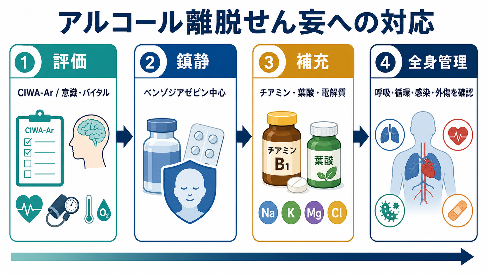
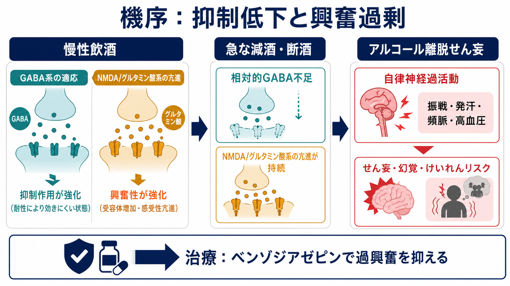
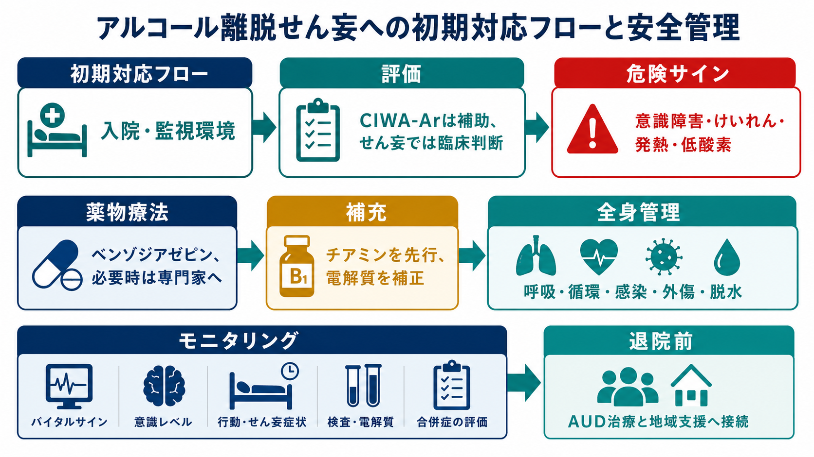

# アルコール離脱せん妄への対応とは何か

## 要点

- アルコール離脱せん妄は、慢性的な多量飲酒の急な減量・中断後に生じる重症の[[せん妄とは何か]]であり、[[振戦せん妄とは何か]]とも呼ばれる。けいれん、自律神経過活動、脱水、感染、外傷、低酸素などを伴うと生命危機になりうる。
- 対応の中心は「離脱の重症度評価」「ベンゾジアゼピンによる過興奮の制御」「チアミンを中心とするビタミン補充」「全身状態と原因鑑別の同時管理」である。
- CIWA-Ar は有用な補助尺度だが、せん妄で本人の報告が不可靠な場合は、バイタルサイン、意識、行動、けいれん、合併症を含む臨床判断が優先される。
- 離脱管理だけで完結させず、退院前から[[依存症の回復支援とは何か]]や地域支援、AUD治療へ接続する。

## この記事で答える問い

このノートは、救急、一般病棟、精神科病棟で「飲酒を急にやめた後に不穏・幻覚・振戦・発汗・頻脈を呈する患者」を前にしたとき、何を優先して評価し、どの治療原則で安全を確保するかを整理する。個別の投与量や院内プロトコルは施設・診療科・患者背景で変わるため、ここでは教育・研究目的の概念整理に留める。

## まず結論

アルコール離脱せん妄への対応は、単に「不穏を鎮静する」ことではない。第一に、アルコール離脱が本当に主因か、低酸素、低血糖、感染、頭部外傷、肝性脳症、薬物中毒・離脱などの可逆的な身体疾患が隠れていないかを同時に確認する。第二に、離脱による中枢神経の過興奮をベンゾジアゼピン中心に抑える。第三に、Wernicke脳症を見逃さないようチアミンを早期に補充する。第四に、呼吸・循環・体温・水分・電解質・安全環境を継続的に管理する。[1][2][3]

NICE は、アルコール離脱発作または振戦せん妄のリスクが高い人には、医学的に支援された離脱のための入院を推奨している。また、CIWA-Ar などの尺度は臨床判断の補助として使う位置づけであり、尺度の点数だけで重症度や処置を決めない。[2]

## 背景

アルコール離脱症候群は、アルコール依存または長期多量飲酒のある人が、急に飲酒量を減らす、または断酒した後に生じる。軽症では不眠、振戦、不安、発汗、消化器症状が目立つが、重症化するとけいれん、幻覚、意識障害、自律神経過活動を伴う。アルコール離脱せん妄はこの連続体の最重症に位置づけられ、典型的には断酒後48-72時間以降に目立つが、発症時期には幅がある。[3][4]

臨床安全上の問題は、離脱せん妄が「精神症状」に見えても、実際には全身管理を要する急性内科・救急の問題である点にある。発熱、低酸素、低血糖、脱水、電解質異常、頭部外傷、肝機能障害、感染症は、せん妄の原因にも、離脱の増悪因子にもなる。したがって、[[興奮状態への対応はどう行うか]]や[[急速鎮静とは何か]]と接続しつつも、鎮静だけに視野を狭めないことが重要である。

## 基本概念

### アルコール離脱せん妄

アルコール離脱せん妄は、アルコール離脱に伴って生じる急性の注意・覚醒・認知の変動である。振戦、発汗、頻脈、高血圧、発熱、幻視、焦燥、睡眠覚醒リズムの崩れ、けいれんリスクを伴うことが多い。過去に離脱発作や離脱せん妄を経験した人、長期多量飲酒、高齢、身体合併症、ベンゾジアゼピンなどGABA作動薬への依存がある人では重症化しやすい。[1][3]

### CIWA-Arの位置づけ

CIWA-Ar は、振戦、発汗、不安、焦燥、感覚過敏、頭痛、見当識などを評価する代表的な離脱評価尺度である。症状誘発投与の補助として有用だが、患者が質問に答えられない、せん妄が強い、挿管中である、重い身体疾患がある場合には限界がある。こうした状況では、バイタルサイン、意識レベル、行動観察、けいれん、呼吸抑制、合併症評価を組み合わせる。[2][3]

### 入院・監視環境

振戦せん妄、けいれん、重度の自律神経過活動、重い身体合併症、服薬や水分摂取の困難、社会的支援の乏しさがある場合は、外来管理ではなく入院・監視環境を考える。NICE は、離脱発作または振戦せん妄がある、あるいは高リスクと判断される場合に入院を推奨している。[2]

## 仕組み

アルコールは急性には中枢神経抑制作用をもつ。慢性的な飲酒が続くと、脳はこの抑制に適応し、GABA系の相対的低下やグルタミン酸/NMDA系の亢進を含む神経適応を起こす。そこで急にアルコールが減ると、抑制が外れた状態で興奮系が過剰に残り、自律神経過活動、振戦、不眠、焦燥、けいれん、せん妄が出現する。[3][5]

この機序から、ベンゾジアゼピンはGABA作動性の抑制を補い、離脱による過興奮を抑える治療として中心的な位置を占める。Cochrane レビューでは、ベンゾジアゼピンはプラセボと比べて離脱発作を減らす効果が示されている。一方で、薬剤間比較や投与レジメンの優劣は研究の異質性が大きく、施設プロトコルと患者背景に応じた運用が必要である。[4]

## 図解

実務上は、次の順に「同時並行」で進める。

| 領域 | 確認すること | 対応の考え方 |
|---|---|---|
| 安全環境 | 転倒、離院、暴力、ライン抜去、自傷他害 | 刺激を減らし、観察密度を上げ、必要に応じて[[暴力リスク評価とは何か]]や[[隔離の適応と安全管理とは何か]]の原則を参照する。 |
| 離脱評価 | 最終飲酒、飲酒量、過去の離脱発作・せん妄、CIWA-Ar、意識変動 | 尺度は補助。せん妄では臨床判断を優先する。[2][3] |
| 薬物療法 | ベンゾジアゼピンの必要性、肝機能、呼吸抑制、併用薬 | ベンゾジアゼピンを中心に、過鎮静と呼吸抑制を監視する。肝障害では薬剤選択に注意する。[1][2] |
| 補充 | チアミン、葉酸、Mg、K、P、栄養、脱水 | Wernicke脳症リスクがあればチアミンを早期に、必要時は非経口で補充する。[2][3] |
| 鑑別 | 低酸素、低血糖、感染、頭部外傷、肝性脳症、薬物中毒・離脱 | 「離脱だから」と決め打ちせず、検査と身体診察で並行評価する。[3][6] |
| 継続支援 | AUD治療、再飲酒予防、地域資源、家族支援 | 離脱管理後に[[依存症の回復支援とは何か]]へ接続する。[1][7] |

## 臨床・研究との接続

### ベンゾジアゼピンは中心だが、単独で全てを解決しない

ASAM ガイドラインは、アルコール離脱管理を、AUD治療への入口として位置づける。つまり、急性期にベンゾジアゼピンで安全を確保しても、退院後の飲酒再開、栄養不良、孤立、服薬中断が放置されれば、再発と再入院のリスクは残る。[1]

ベンゾジアゼピン使用時は、呼吸抑制、転倒、過鎮静、肝機能障害、他の鎮静薬との併用を観察する。長時間作用型は離脱症状の再燃を抑えやすい一方、肝障害や高齢では蓄積に注意する。ロラゼパムやオキサゼパムなど、肝代謝への依存が相対的に少ない薬剤が選ばれる状況もある。[1][7]

### チアミン補充は「後回しにしない」

アルコール依存や栄養不良では、Wernicke脳症のリスクが高い。NICE は、高リスクまたは疑い例にチアミンを投与し、疑い例では非経口投与を行うことを推奨している。特に意識障害、眼球運動異常、失調、栄養不良がある場合は、典型的三徴がそろわなくても疑う。[2]

臨床的には、低血糖があればブドウ糖を遅らせるべきではないが、同時にチアミンを速やかに補充するという発想が安全である。葉酸、マグネシウム、リン、カリウムなどの補正も、けいれん、せん妄、心血管リスク、リフィーディング症候群の観点から重要である。[3][6]

### 抗精神病薬は補助であり、離脱そのものの治療ではない

幻覚や強い焦燥があると抗精神病薬を使いたくなるが、アルコール離脱の基本病態はGABA/グルタミン酸系の過興奮であり、中心治療はベンゾジアゼピンである。抗精神病薬は、けいれん閾値、QT延長、悪性症候群、過鎮静などのリスクを考慮し、ベンゾジアゼピンで不十分な激しい精神運動興奮や幻覚に対する補助として慎重に位置づける。[1][2][5]

### フェノバルビタールなどの選択肢

重症例やベンゾジアゼピン抵抗例では、フェノバルビタールなどが専門的環境で検討されることがある。ただし治療域が狭く、呼吸抑制や過鎮静のリスクがあるため、救急・集中治療・依存症医療の経験があるチームで、モニタリング可能な環境に限定して考える。[1][7]

## よくある誤解

### 「せん妄があるなら、まず抗精神病薬で鎮静する」

アルコール離脱せん妄では、抗精神病薬だけでは離脱の過興奮やけいれんリスクを十分に抑えられない。中心はベンゾジアゼピンであり、抗精神病薬は補助的に考える。

### 「CIWA-Arの点数だけで投与量を決めればよい」

CIWA-Ar は便利だが、せん妄、認知障害、重い身体疾患、コミュニケーション困難がある場合は不正確になる。点数だけでなく、意識、呼吸、循環、体温、けいれん、合併症を評価する。

### 「チアミンは落ち着いてからでよい」

Wernicke脳症は見逃されやすく、不可逆的な記憶障害につながりうる。高リスク例では早期補充を標準動作として考える。

### 「離脱が治まれば治療は終わり」

離脱管理はAUD治療の入口である。退院時に地域支援、外来、心理社会的支援、薬物療法の検討へつなげないと、再飲酒と再離脱のリスクが残る。

## 関連ノート

- [[医療安全とは何か]]
- [[精神科医療安全の特徴は何か]]
- [[興奮状態への対応はどう行うか]]
- [[急速鎮静とは何か]]
- [[暴力リスク評価とは何か]]
- [[隔離の適応と安全管理とは何か]]
- [[ベンゾジアゼピン系薬とは何か]]
- [[ベンゾジアゼピン依存とは何か]]
- [[身体健康管理支援とは何か]]
- [[依存症の回復支援とは何か]]

## MOC更新候補

- `content/00_MOC/MOC｜臨床実践・治療.md`
- `content/00_MOC/MOC｜薬物療法.md`
- `content/00_MOC/MOC｜リハビリ・生活支援.md`

並列ジョブとの競合を避けるため、このノート作成時点ではMOC本体は更新しない。

## 理解チェック

1. アルコール離脱せん妄で、CIWA-Arが不可靠になりやすい状況は何か。
2. ベンゾジアゼピンが中心治療になる神経機序は何か。
3. チアミン補充を早期に考える理由は何か。
4. 「不穏の鎮静」だけに集中すると見落としやすい身体疾患・合併症は何か。
5. 離脱管理後にAUD治療へ接続する理由は何か。

## 未解決問題

- 重症離脱やベンゾジアゼピン抵抗例におけるフェノバルビタール、デクスメデトミジン、プロポフォールなどの位置づけは、施設経験と研究デザインの差が大きい。
- CIWA-Arが使いにくいICU、認知症、挿管、重症身体疾患の患者で、どの観察尺度とプロトコルが最も安全かは、現場実装を含めて検討が必要である。
- 離脱管理からAUD治療への接続を、退院時の一回限りの紹介ではなく、継続的なケア経路としてどう設計するかが課題である。

## 参考文献

[1] American Society of Addiction Medicine. (2020). *The ASAM Clinical Practice Guideline on Alcohol Withdrawal Management*. Journal of Addiction Medicine, 14(3S), 1-72. https://doi.org/10.1097/ADM.0000000000000668

[2] National Institute for Health and Care Excellence. (2010, updated 2017). *Alcohol-use disorders: diagnosis and management of physical complications (CG100): Recommendations*. https://www.nice.org.uk/guidance/cg100/chapter/recommendations

[3] Canver, B. R., Newman, R. K., & Gomez, A. E. (2024). *Alcohol Withdrawal Syndrome*. StatPearls. NCBI Bookshelf. https://www.ncbi.nlm.nih.gov/books/NBK441882/

[4] Amato, L., Minozzi, S., Vecchi, S., & Davoli, M. (2022). *Benzodiazepines for alcohol withdrawal*. Cochrane Database of Systematic Reviews, CD005063. https://doi.org/10.1002/14651858.CD005063.pub3

[5] Mirijello, A., D'Angelo, C., Ferrulli, A., Vassallo, G., Antonelli, M., Caputo, F., Leggio, L., Gasbarrini, A., & Addolorato, G. (2015). Identification and management of alcohol withdrawal syndrome. *Drugs*, 75(4), 353-365. https://doi.org/10.1007/s40265-015-0358-1

[6] Sachdeva, A., Choudhary, M., & Chandra, M. (2015). Alcohol withdrawal syndrome: Benzodiazepines and beyond. *Journal of Clinical and Diagnostic Research*, 9(9), VE01-VE07. https://doi.org/10.7860/JCDR/2015/13407.6538

[7] Tiglao, S. M., Meisenheimer, E. S., & Oh, R. C. (2021). Alcohol Withdrawal Syndrome: Outpatient Management. *American Family Physician*, 104(3), 253-262. https://www.aafp.org/pubs/afp/issues/2021/0900/p253.html

[8] Grover, S., & Ghosh, A. (2018). Delirium Tremens: Assessment and Management. *Journal of Clinical and Experimental Hepatology*, 8(4), 460-470. https://doi.org/10.1016/j.jceh.2018.04.012
