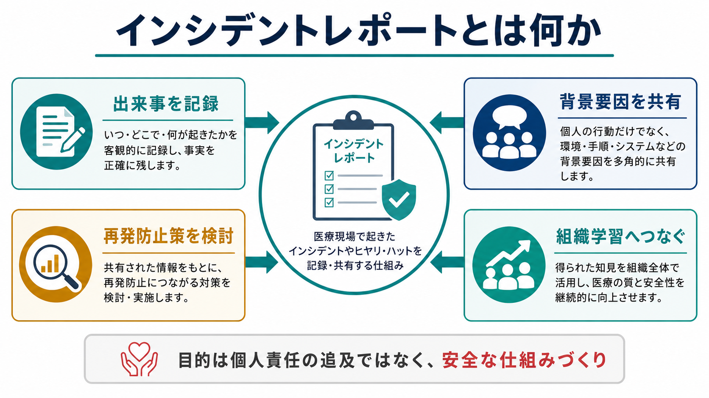
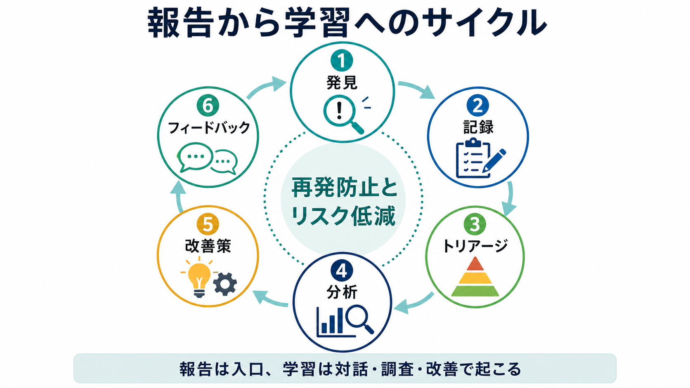
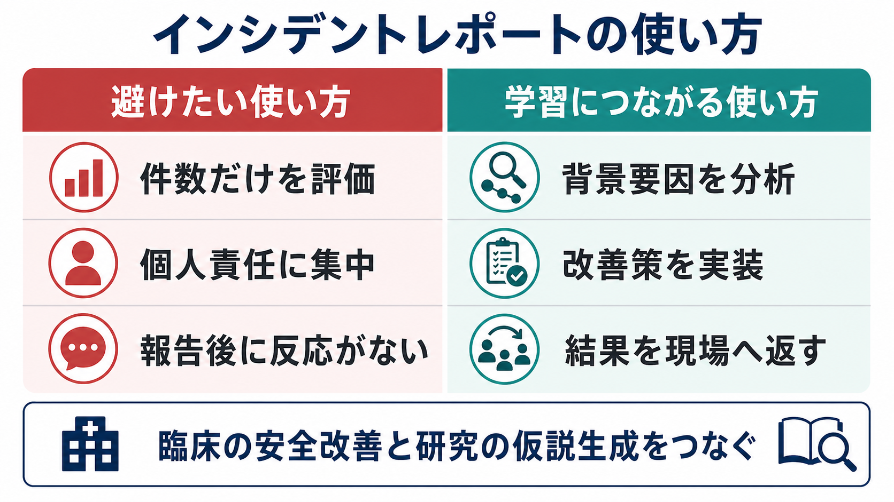

# インシデントレポートとは何か

## 要点

- インシデントレポートとは、医療事故、患者影響の有無にかかわらない安全上の出来事、ヒヤリハット、危険状態を、組織が学習できる形で記録・共有する仕組みである。
- 目的は「誰が悪いか」を決めることではなく、同じ出来事が再発しにくい業務設計、教育、環境、情報伝達、確認手順を作ることである[1][3]。
- レポート件数は安全性そのものを測る指標ではない。報告数は文化、忙しさ、恐れ、関心、システムの使いやすさに左右されるため、件数だけで安全・危険を判断してはいけない[2][4]。
- 良いインシデントレポートは、出来事の入口であり、学習はその後のトリアージ、調査、背景要因分析、改善策の実装、現場へのフィードバックで起こる[1][4]。
- 精神科・身体医療の現場では、[[医療安全とは何か]]、[[精神科医療安全の特徴は何か]]、[[向精神薬の処方ミスを防ぐには何を確認するか]]、[[転倒転落リスク管理とは何か]]などの実践と接続して考える。

## この記事で答える問い

- インシデントレポートは何を記録するものか。
- 医療事故報告、ヒヤリハット報告、苦情、診療録、始末書とは何が違うのか。
- 報告された情報は、どのように組織学習と再発防止へ変換されるのか。
- 件数、分類、個人責任に偏ると、なぜ学習が止まるのか。
- 臨床実践、医療安全管理、研究ではどのように使い分けるべきか。

## まず結論

インシデントレポートは、医療現場で「望ましくない結果が起きた」「起きかけた」「今は害がないが危険な条件が見えた」という情報を、組織が扱える形に変えるための記録である。AHRQ PSNet は、患者安全イベント報告システムを、病院に広く存在する安全イベントや品質問題の検出手段として説明している[2]。WHO も、患者安全インシデント報告・学習システムを、医療に伴う害の性質を理解し、リスク低減と安全改善へつなげるための仕組みとして位置づけている[1]。

ただし、レポートを書けば学習が起こるわけではない。報告は「入口」であり、学習は、報告を受けた組織が優先順位を付け、必要な調査を行い、背景要因を分析し、改善策を実装し、その結果を現場へ返すことで初めて起こる[1][4]。この点を見失うと、インシデントレポートは「件数を集める作業」「個人を責める作業」「現場から管理部門へ情報を送るだけの作業」になり、かえって報告文化を弱める。

## 背景

近代的な医療安全の議論では、エラーを「不注意な個人の失敗」としてだけ扱うのではなく、複雑な医療システムの中で起きる出来事として扱う視点が重視されてきた。Institute of Medicine の *To Err is Human* は、医療エラーを減らすには、個人非難ではなく、より安全な医療システムの設計が必要だと論じた[3]。この流れの中で、インシデントレポートは、現場で見えたリスクを組織が検出し、分析し、学習するための基盤として広がった。

日本でも、厚生労働省と日本医療機能評価機構による医療事故情報収集等事業が、医療事故情報やヒヤリハット事例を収集・分析し、医療安全対策に有用な情報を共有する仕組みとして運営されている[7][8]。このような外部報告制度は、個別施設の学習だけでなく、他施設で起きた出来事から学ぶためにも重要である。

一方で、インシデントレポートには限界もある。自発報告は、記憶、認知、職種、報告しやすさ、法的・職業的な不安、上司との関係、過去のフィードバック経験に影響される。したがって、報告された件数は実際の発生件数をそのまま表さない[2][4]。インシデントレポートは「疫学的に完全な測定器」ではなく、「さらに調べるべきリスクを見つけるセンサー」と捉える方がよい。

## 基本概念

### インシデント

インシデントとは、患者に害が生じたかどうかにかかわらず、医療の安全を脅かした出来事や状況を指す。たとえば、薬剤の取り違え、検査結果伝達の遅れ、転倒しかけた場面、患者確認の抜け、隔離・身体拘束中の観察不足、離院の兆候、情報共有の途切れなどが含まれる。実際に害が生じた有害事象だけでなく、害に至らなかったニアミスや危険状態を扱う点が重要である[1][2]。

### ヒヤリハット

ヒヤリハットは、害には至らなかったが、条件が少し違えば事故になり得た出来事である。日本の医療事故情報収集等事業でも、患者に実施する前に発見された誤り、患者への影響がなかった事例、影響が不明な事例などがヒヤリハット事例として扱われている[7]。ヒヤリハットは「たまたま助かった失敗」ではなく、重大事故の前兆を早く見つけるための情報である。

### レポートと診療録の違い

診療録は、患者の診療経過、判断、説明、同意、処置、観察を記録する公的な医療記録である。インシデントレポートは、組織が安全上の出来事を把握し、分析し、改善へつなげるための内部的な安全管理資料である。したがって、患者への説明や診療上必要な事実は診療録に記載し、背景要因分析や改善検討はインシデントレポートや安全管理の場で扱う、という役割分担が必要になる。

### 始末書との違い

インシデントレポートは、原則として懲罰や反省文ではない。もちろん故意、重大な逸脱、隠蔽、専門職として許容できない行為は別に扱う必要がある。しかし、多くのインシデントでは、個人の注意不足だけでなく、業務量、環境、表示、手順、情報システム、チーム内コミュニケーション、教育、管理体制が重なっている。報告を始末書化すると、現場は不都合な情報を隠しやすくなり、組織は学習機会を失う[3][5]。

## 仕組み

インシデントレポートの基本的な流れは、発見、記録、トリアージ、分析、改善策、フィードバックである。

### 1. 発見

発見される出来事は、患者に実害が生じた事故だけではない。薬剤が投与前に見つかった、転倒しそうになった、夜間の観察体制に不安があった、電子カルテの表示が誤解を招いた、申し送りで重要情報が抜けた、といった「弱いシグナル」も含まれる。重大事故を待たずに、危険条件を見つけることが報告制度の価値である。

### 2. 記録

記録では、まず時刻、場所、関係する業務、何が起きたか、患者への影響、直後の対応、報告先を客観的に書く。推測や評価語は、事実と分ける。たとえば「看護師が不注意だった」ではなく、「A薬とB薬の外観が似ており、夜勤帯の処方変更後、投与直前のダブルチェックで違いに気づいた」のように書く。良い記録は、責任追及よりも、後から状況を再構成できることを重視する。

### 3. トリアージ

報告を受けた組織は、すべてのレポートを同じ深さで分析するわけではない。患者への害の程度、再発可能性、重大事故への近さ、頻度、複数部署への広がり、社会的影響、緊急対応の必要性を見て、すぐに対応すべきもの、詳細調査に進めるもの、集計して傾向を見るものに分ける。AHRQ PSNet も、報告システムには報告のレビューとアクションプランを作る構造が必要だと整理している[2]。

### 4. 分析

分析では「誰が間違えたか」ではなく、「なぜその行動がその場では起こりやすかったのか」を問う。背景要因には、患者状態、業務設計、時間帯、人員配置、環境、物品配置、電子カルテやアラート、手順書、教育、チーム内コミュニケーション、組織文化が含まれる。重大な出来事では、根本原因分析、時系列分析、ヒューマンファクターの観点、関係者への聞き取りを組み合わせる。

### 5. 改善策

改善策は、注意喚起だけで終わらせない。注意喚起は必要だが、記憶と努力に依存するため弱い対策である。より強い対策には、薬剤名・ラベル・配置の変更、似た薬剤の分離、電子カルテ表示の改善、必須入力や確認ステップの設計、標準手順の見直し、教育、チームでのブリーフィング、監査指標の設定などがある。WHO の行動計画も、報告・学習システムを改善活動の優先順位づけに使い、学んだことと取った行動を職員へ返すことを重視している[6]。

### 6. フィードバック

フィードバックがない報告制度は弱くなる。現場が「報告しても何も変わらない」と感じると、次の報告は減る。フィードバックは、個別の報告者への返信だけでなく、部署会議、医療安全ニュース、短い事例共有、手順変更の説明、改善後の結果共有として行う。系統的レビューでも、非難されない環境、明確な報告手順、使いやすいシステム、分析支援、複数経路のフィードバックが、報告・学習システムの導入を助ける要因として整理されている[5]。

## 図解

インシデントレポートは、使い方によって「学習の装置」にも「沈黙を生む装置」にもなる。次の図のように、件数だけを評価し、個人責任に集中し、報告後の反応がない制度では、現場は報告を負担や危険として経験しやすい。反対に、背景要因を分析し、改善策を実装し、結果を現場へ返す制度では、報告が組織学習へつながる。

| 観点 | 避けたい使い方 | 学習につながる使い方 |
|---|---|---|
| 件数 | 報告件数の増減だけで安全を評価する | 件数を安全文化や関心の変化も含めて解釈する |
| 原因 | 個人の不注意に早く結論づける | 業務条件、情報、環境、チーム、管理体制を調べる |
| 改善 | 「注意する」「周知する」で終える | 手順、表示、配置、権限、教育、監査を変える |
| フィードバック | 報告後に何も返さない | 学んだこと、変えたこと、残る課題を返す |
| 研究利用 | 報告数を発生率として扱う | 報告バイアスを前提に、仮説生成や質的分析に使う |

## 臨床・研究との接続

### 臨床実践

臨床では、インシデントレポートは日々の安全改善とつながる。薬剤関連では、[[向精神薬の処方ミスを防ぐには何を確認するか]]、[[薬剤副作用の早期発見はどう行うか]]のような確認・観察の設計に役立つ。身体管理では、[[転倒転落リスク管理とは何か]]、[[誤嚥窒息リスク管理とは何か]]、[[身体拘束の適応とリスク管理とは何か]]の見直しにつながる。精神科では、[[離院リスクへの対応とは何か]]、[[自殺リスクへの危機対応とは何か]]、[[安全計画とは何か]]と接続し、リスクの早期発見、説明、チーム共有、退院後支援を再設計する材料になる。

重要なのは、報告を「現場の失敗の記録」に閉じ込めないことである。たとえば転倒インシデントが増えたとき、単に「見守り強化」と書くだけでは、現場の負荷が増えるだけで再発防止になりにくい。時間帯、人員配置、病棟構造、薬剤、せん妄、履物、トイレ動線、ナースコール、患者説明、家族協力を見直すと、具体的な改善につながる。

### 医療安全管理

医療安全管理では、レポートを「すべて詳細分析する」のではなく、優先順位をつける。重大性が高い、再発可能性が高い、複数部署に共通する、既存対策が効いていない、患者・家族への説明や支援が必要である、といった条件を見て深掘りする。WHO の技術報告は、報告データの価値を認めつつ、その性質と限界を慎重に扱う必要を強調している[1]。

### 研究

研究では、インシデントレポートは発生率推定の万能データではない。自発報告は過少報告や選択バイアスを含むため、発生率や施設間比較には、診療録レビュー、観察、トリガーツール、監査データなどと組み合わせる必要がある[2][4]。一方で、自由記述や時系列情報は、現場が何を危険として見ているか、どの背景要因が語られやすいか、改善策がどこで止まりやすいかを知るための質的データとして有用である。

## よくある誤解

### 「報告件数が少ない部署は安全である」

報告件数が少ない理由は、安全だからとは限らない。報告しにくい文化、報告フォームの使いにくさ、忙しさ、フィードバック不足、上司への遠慮、報告対象の理解不足があるかもしれない。逆に、報告件数が多い部署は、軽微な出来事をよく拾う文化を持っている可能性もある[2][5]。

### 「ヒヤリハットは大きな事故ではないので重要ではない」

ヒヤリハットは、重大事故の前兆を低コストで教えてくれる。害が起きなかったからこそ、冷静に背景要因を調べ、重大事故になる前に対策を打てる。ヒヤリハットを軽視する組織は、実害が出るまで弱いシグナルを見逃しやすい。

### 「原因は本人に聞けばすぐ分かる」

本人の説明は重要だが、それだけでは不十分である。人は、自分の行動を後から合理化したり、記憶の抜けを補ったり、責められることを恐れて語り方を変えたりする。現場確認、記録、物品配置、電子カルテ画面、勤務状況、手順書、関係者の相互作用を合わせて見る必要がある。

### 「全員に注意喚起すれば再発防止になる」

注意喚起は最も実施しやすいが、最も忘れられやすい対策でもある。再発防止には、注意しなくても間違いにくい設計、間違えても害に進みにくい検出、害が出たときに早く対応できる仕組みが必要である。

## 関連ノート

- [[医療安全とは何か]]
- [[精神科医療安全の特徴は何か]]
- [[向精神薬の処方ミスを防ぐには何を確認するか]]
- [[薬剤副作用の早期発見はどう行うか]]
- [[転倒転落リスク管理とは何か]]
- [[誤嚥窒息リスク管理とは何か]]
- [[身体拘束の適応とリスク管理とは何か]]
- [[離院リスクへの対応とは何か]]
- [[自殺リスクへの危機対応とは何か]]
- [[安全計画とは何か]]

## MOC更新候補

- `content/00_MOC/` 配下に医療安全・危機対応系 MOC がある場合、バッチ統合時に本記事 `[[インシデントレポートとは何か]]` を追加する。
- 並列生成ジョブとの衝突を避けるため、このタスクでは MOC 本体は更新しない。

## 未解決問題

- インシデントレポートの自由記述を、個人情報と懲罰リスクを抑えながら、どこまで研究データとして二次利用できるか。
- 報告件数、重大度、改善策の実装率、再発率、職員の心理的安全性を、どのように組み合わせて医療安全の状態を評価すべきか。
- AI による分類・要約・アラート生成を使う場合、見落とし、過剰警告、説明責任、現場の報告意欲への影響をどう管理するか。

## 理解チェック

1. インシデントレポートと診療録の役割の違いを説明できるか。
2. 報告件数だけでは安全性を評価できない理由を説明できるか。
3. ヒヤリハットが組織学習にとって重要な理由を説明できるか。
4. 「注意喚起」だけで終わらない改善策を一つ挙げられるか。
5. 自分の職場・研究領域で、報告後のフィードバックを改善する方法を一つ提案できるか。

## 参考文献

[1] World Health Organization. (2020). *Patient safety incident reporting and learning systems: technical report and guidance*. https://www.who.int/publications/i/item/9789240010338

[2] Agency for Healthcare Research and Quality, Patient Safety Network. (2019; last reviewed 2025). Reporting Patient Safety Events. https://psnet.ahrq.gov/primer/reporting-patient-safety-events

[3] Institute of Medicine. (2000). *To Err Is Human: Building a Safer Health System*. National Academies Press. https://www.ncbi.nlm.nih.gov/books/NBK225182/

[4] Macrae, C. (2016). The problem with incident reporting. *BMJ Quality & Safety, 25*(2), 71-75. https://doi.org/10.1136/bmjqs-2015-004732

[5] Health Quality Ontario. (2017). Patient safety learning systems: A systematic review and qualitative synthesis. *Ontario Health Technology Assessment Series, 17*(3), 1-23. https://pmc.ncbi.nlm.nih.gov/articles/PMC5357133/

[6] World Health Organization. (2021). *Global Patient Safety Action Plan 2021-2030*. https://www.who.int/publications/i/item/9789240032705

[7] 厚生労働省. 医療事故情報収集等事業について. https://www.mhlw.go.jp/stf/newpage_22786.html

[8] 公益財団法人日本医療機能評価機構. 医療事故情報収集等事業. https://www.med-safe.jp/
