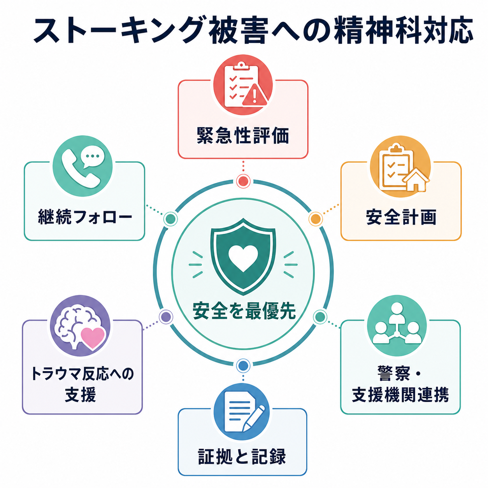
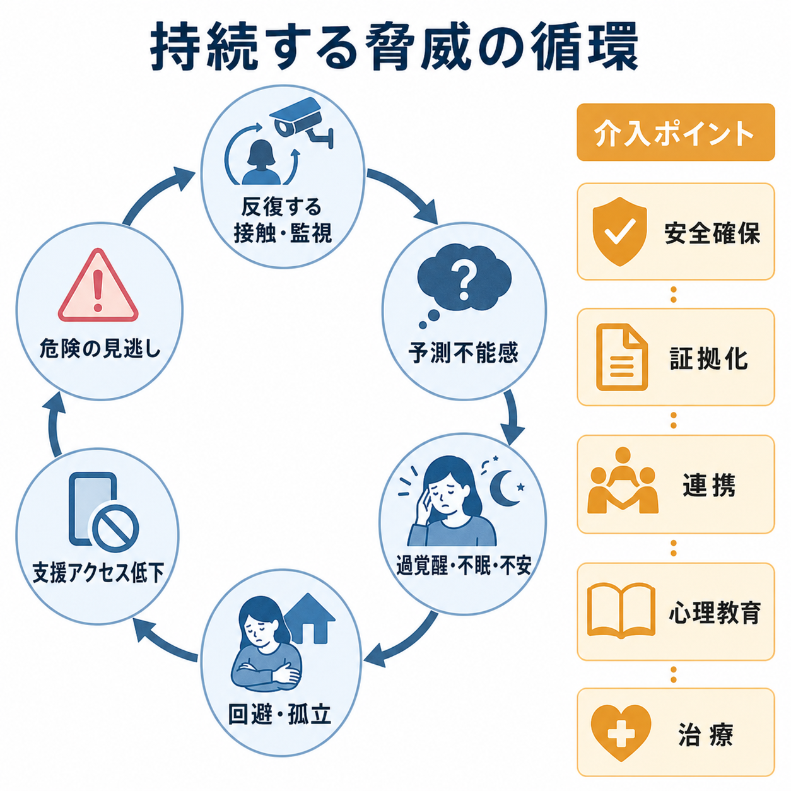
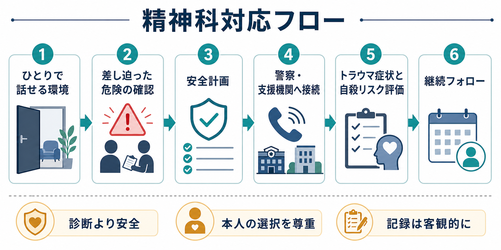

# ストーキング被害への精神科対応とは何か

## 要点

- ストーキング被害への精神科対応の第一目標は、診断名を確定することではなく、本人と周囲の安全を確保し、被害の持続・激化を止める支援につなぐことである。
- 精神科医療者は、被害者を説得して「正しい行動」を取らせる役割ではなく、危険の具体化、[[安全計画とは何か|安全計画]]、警察・支援機関への接続、トラウマ反応への支援を並行して行う。
- 日本ではストーカー行為は犯罪であり、警察は警告、禁止命令等、検挙、保護措置、防犯助言、110番緊急通報登録、住民票閲覧制限に関する支援などを行いうる[1]。
- ストーキング被害は、恐怖、不眠、過覚醒、回避、抑うつ、[[PTSDとは何か|PTSD]]症状、自殺念慮、生活・就労・居住の変更をもたらしうるため、単なる「対人トラブル」として扱わない[5]。
- この記事は教育・研究目的の整理であり、個別事案の法的判断、警察対応の代替、診断・治療指示ではない。差し迫った危険がある場合は、医療相談より先に110番や安全な場所への避難を優先する。

## この記事で答える問い

1. 精神科医療者は、ストーキング被害をどの順番で確認すべきか。
2. 安全計画と警察連携は、どのように治療面接へ組み込まれるか。
3. トラウマ反応、不眠、不安、抑うつ、自殺リスクをどう支援につなげるか。
4. 守秘、記録、本人の意思尊重、第三者連携の境界をどう考えるか。

## まず結論

ストーキング被害への精神科対応は、本人の症状を「内面の問題」として閉じ込めず、現在も続く外的危険として扱うところから始まる。最初に確認するのは、加害者の診断名でも、本人の語りの完全な整合性でもなく、「今日帰る場所は安全か」「待ち伏せ、侵入、脅迫、位置情報追跡、武器、過去の暴力、別離直後の急変があるか」「本人が警察や支援者に接続できるか」である[1][2]。

精神科的支援は三層で考えると実務に乗せやすい。第一に、安全確保と警察・支援機関連携である。第二に、被害状況の客観的記録、診療録、診断書や意見書の限界を明確にした文書化である。第三に、不眠、過覚醒、侵入症状、回避、抑うつ、自殺念慮、解離、物質使用などへの治療的支援である。これらは順番に終えるものではなく、危険が続く間は同時に進める。

## 背景

ストーキングは、拒否された関係性、支配、執着、怨恨、誤った親密性の信念などを背景に、反復する接触、監視、待ち伏せ、脅迫、位置情報の取得、SNSや職場・学校への接近として現れる。日本の政府広報は、ストーカー規制法がつきまとい等を反復する行為を規制し、2025年改正で紛失防止タグの悪用や警察官の職権による警告が加わったと説明している[1]。

警察庁の2025年対応状況では、ストーカー事案の相談等件数は22,881件で高水準にあり、ストーカー規制法違反の検挙件数、刑法犯等の検挙件数も増加している[2]。臨床現場では、この統計を「よくある相談」として軽く扱うのではなく、重大事件化しうる人身安全関連事案として受け止める必要がある。

## 基本概念

### ストーキング被害は症状ではなく状況である

被害者が不眠、不安、過覚醒、集中困難、回避、抑うつを呈していても、その反応は「本人の認知の歪み」だけで説明できない。実際に監視、待ち伏せ、連絡、脅迫、位置情報追跡が続いているなら、身体が警戒を解けないことには合理性がある。したがって、支援は[[ストーキングと精神医学はどう関係するのか|ストーキングと精神医学]]、[[DVと精神科医療はどう関係するのか|DVと精神科医療]]、[[危機介入とは何か|危機介入]]の交差点に置かれる。

### 初期対応は LIVES に近い

WHOは親密なパートナーからの暴力や性暴力を受けた人への初期支援として、傾聴、ニーズ確認、経験の妥当化、安全性の向上、支援への接続を重視するLIVESアプローチを示している[3][4]。ストーキング被害にも、この姿勢は応用できる。つまり、すぐに助言を畳みかけるよりも、まず一人で話せる環境をつくり、本人の語りを疑問視する形で遮らず、具体的危険を確認し、本人の選択を尊重しながら安全資源へつなぐ。

### 精神科対応で確認する危険

危険確認では、次の項目を短く具体的に尋ねる。

| 領域 | 確認すること | 臨床上の意味 |
|---|---|---|
| 直近の危険 | 今日の待ち伏せ、侵入、脅迫、暴力、武器、追跡 | 110番、避難、警察相談を優先する判断 |
| 持続性 | 連絡頻度、期間、職場・学校・家族への接触 | 偶発的トラブルではなく反復被害として扱う |
| エスカレーション | 別離、拒否、通報後、引っ越し後の悪化 | 重大化リスクを見逃さない |
| デジタル監視 | 位置情報共有、紛失防止タグ、SNS、端末、パスワード | 安全計画にIT・通信面を入れる |
| 支援資源 | 家族、友人、職場、学校、警察、弁護士、支援団体 | 本人を孤立させない |
| 精神症状 | 不眠、過覚醒、侵入症状、回避、抑うつ、自殺念慮 | 治療と危機対応を統合する |

## 仕組み

ストーキング被害の特徴は、「終わった出来事」ではなく「続くかもしれない脅威」である点にある。反復する接触や監視は予測不能感を高め、過覚醒、不眠、不安を維持する。本人は安全のために外出、通勤、交友、受診を控えるが、その回避が孤立を深め、警察・医療・支援者へのアクセスを下げることがある。すると危険の更新が遅れ、さらに恐怖が強まる。

この循環を断つ介入ポイントは、心理教育だけではない。安全確保、証拠化、警察連携、職場・学校・家族への安全な共有、住居・通勤経路・端末設定の見直し、睡眠と過覚醒への治療、トラウマ焦点化治療の時期判断が必要になる。Stalking Risk Profileのような構造化判断は、ストーキングの危険を「暴力になるか」だけでなく、持続、再発、心理社会的損害も含めて評価する発想を与える[6]。

## 図解

精神科対応の流れは、次のように整理できる。

1. **ひとりで話せる環境をつくる**  
   同伴者が加害者、加害者側の家族、監視者である可能性を考え、自然な理由で個別面接を確保する。オンライン診療では、画面外に誰かがいないか、通話後に危険が増さないかを確認する。

2. **差し迫った危険を確認する**  
   「今日ここから帰る場所は安全ですか」「相手が今いる場所を知っていますか」「待ち伏せ、侵入、脅し、暴力、位置情報追跡はありますか」と具体的に聞く。危険が差し迫る場合は、治療説明より警察・救急・避難を優先する。

3. **安全計画を本人と作る**  
   安全計画は「気をつけましょう」ではなく、避難先、連絡先、移動手段、証拠保存、端末設定、職場・学校への共有範囲、緊急時の合図を具体化する作業である。自殺リスクがある場合は、[[自殺リスクへの危機対応とは何か|自殺リスクへの危機対応]]と統合する。

4. **警察・支援機関へ接続する**  
   警察への相談は、本人の意思を尊重しつつ、危険が高い場合には強く勧める。政府広報は、警察が警告、禁止命令等、検挙、保護措置、防犯対策、110番緊急通報登録、パトロール強化、住民票閲覧制限に関する支援対応などを行いうると説明している[1]。

5. **トラウマ反応と自殺リスクを評価する**  
   ストーキング被害者研究では、不安、侵入的想起、フラッシュバック、悪夢、抑うつ、自殺念慮、PTSD水準の症状が報告されている[5]。ただし、危険が続く最中に「安全な過去の記憶」として処理する治療へ急ぐと、本人の現実的危険を軽視することがある。

6. **継続フォローで危険を更新する**  
   危険は面接時点で固定されない。通報、別離、転居、勤務変更、SNS遮断、禁止命令などの後に加害行動が変化することがある。診療では、毎回「前回から何が変わったか」を確認し、警察・支援者との連携計画を更新する。

## 臨床・研究との接続

### トラウマ治療は安全確保の上に乗せる

NICEのPTSDガイドラインは、成人PTSDに対してトラウマ焦点化CBTやEMDRを推奨し、心理教育、覚醒やフラッシュバックへの対処、安全計画、回避の克服、機能回復を含めると整理している[7]。VA/DoDの2023年ガイドラインも、PTSDと急性ストレス障害の評価・治療をアルゴリズム化し、PTSD治療ではトラウマ焦点化心理療法を重視する[8]。

しかし、ストーキング被害では「外傷が過去に終わっている」とは限らない。したがって、トラウマ焦点化治療の前に、現在の安全、警察連携、住居・職場・通信環境、記録、支援資源を整える必要がある。安全確保が不十分な状態で暴露的な介入を進めると、症状軽減よりも危険の再燃や脱落を招くことがある。

### 記録は治療と安全の両方を支える

診療録には、本人の訴えをそのまま断定事実に変換せず、「本人は、○月○日に○○があったと述べた」「提示されたスクリーンショットには○○と表示されていた」のように、情報源を明確にして客観的に書く。診断書や意見書を作成する場合も、精神症状、生活機能、治療必要性、本人が述べた被害状況、医療者が直接確認した事項を区別する。

この区別は、被害者を疑うためではない。医療記録が警察、弁護士、職場、学校、裁判手続きで参照される可能性があるため、過剰な断定や曖昧な表現が本人の安全を損なわないようにするためである。

### 守秘と通報の境界

成人被害者の相談では、本人の自己決定と守秘を尊重することが基本である。一方で、差し迫った生命・身体の危険、児童・高齢者・障害者虐待、他者への重大危害リスク、法令上の義務が関わる場合には、守秘の限界を説明し、必要最小限の情報共有を検討する。迷う場面では、院内の医療安全、法務、個人情報担当、地域連携、警察相談窓口に早めに相談する。

## よくある誤解

### 「精神科ではトラウマ症状だけ診ればよい」

誤りである。症状評価は重要だが、ストーキング被害では危険が現在進行形であることがある。安全計画と警察・支援機関連携を外すと、治療は現実の危険から切り離される。

### 「警察に行くかどうかは本人に任せればよい」

本人の選択尊重は重要である。ただし、危険の見立て、警察で何ができるか、相談時に持参できる記録、緊急時の選択肢を説明せずに「任せる」のは、実質的には孤立させる対応になりうる。警察相談を拒む背景に、報復恐怖、過去の相談経験、加害者からの支配、家族や職場への露見恐怖がないかを確認する。

### 「被害を語る人に妄想があるなら、ストーキング対応は不要である」

これも危険である。精神病症状、妄想性障害、PTSD、解離、物質使用があっても、実際の被害が併存することはある。臨床では、症状評価と安全確認を分け、確認できる事実、本人の主観的恐怖、現在の危険、支援資源を別々に扱う。

### 「加害者を治療すれば被害者の安全は解決する」

加害者に精神科治療が必要な場合はある。しかし、被害者支援の場で優先されるのは、加害者の理解や説得ではなく、接触を止めるための制度的・環境的対応と本人の安全である。治療者が加害者との仲介者になると、危険を高めることがある。

## 関連ノート

- [[ストーキングと精神医学はどう関係するのか]]
- [[DVと精神科医療はどう関係するのか]]
- [[安全計画とは何か]]
- [[自殺リスクへの危機対応とは何か]]
- [[PTSDとは何か]]
- [[危機介入とは何か]]
- [[司法精神医学とは何か]]
- [[ケースマネジメントとは何か]]
- [[多職種連携は地域精神医療でなぜ重要なのか]]

## MOC更新候補

- `content/00_MOC/`配下の臨床実践、医療安全、司法・制度・地域精神医療、トラウマ関連MOCに追加候補。
- 並列実行時の衝突を避けるため、本タスクではMOC本文は更新しない。

## 理解チェック

1. ストーキング被害の初回面接で、診断名より先に確認すべき安全項目は何か。
2. 安全計画に、避難先、連絡先、移動手段、証拠保存、端末設定を含める理由は何か。
3. 「本人の意思尊重」と「警察相談を勧めること」は、どのように両立できるか。
4. トラウマ焦点化治療を急ぐ前に、現在の危険を確認すべき理由は何か。
5. 診療録で、本人の陳述と医療者が直接確認した事実を分けて書く理由は何か。

## 未解決問題

- 日本の精神科臨床で、ストーキング被害者に特化した安全計画や警察連携の標準手順は十分に整備されていない。
- デジタル監視、紛失防止タグ、SNS、オンライン診療が関わる場合の安全確認手順は、技術変化に合わせて更新が必要である。
- 被害者支援、加害者治療、司法手続き、職場・学校調整をどの情報共有範囲で接続するかは、地域資源と法的文脈に依存する。

## 参考文献

[1] 政府広報オンライン. (2026). ストーカー行為は犯罪です！迷わず警察に相談を. https://www.gov-online.go.jp/useful/article/202109/1.html

[2] 警察庁. (2026). 令和7年におけるストーカー事案、配偶者からの暴力事案等、児童虐待事案等への対応状況. https://www.npa.go.jp/news/release/2026/jinsyou2026.html

[3] World Health Organization. (2014). *Health care for women subjected to intimate partner violence or sexual violence: a clinical handbook*. https://www.who.int/publications/i/item/WHO-RHR-14.26

[4] World Health Organization. (2013). *Responding to intimate partner violence and sexual violence against women: WHO clinical and policy guidelines*. https://www.who.int/publications/i/item/9789241548595

[5] Pathé, M., & Mullen, P. E. (1997). The impact of stalkers on their victims. *The British Journal of Psychiatry, 170*(1), 12-17. https://doi.org/10.1192/bjp.170.1.12

[6] McEwan, T. E., Shea, D. E., Daffern, M., MacKenzie, R. D., Ogloff, J. R. P., & Mullen, P. E. (2018). The reliability and predictive validity of the Stalking Risk Profile. *Assessment, 25*(2), 259-276. https://doi.org/10.1177/1073191116653470

[7] National Institute for Health and Care Excellence. (2018, reviewed 2025). *Post-traumatic stress disorder: NICE guideline NG116*. https://www.nice.org.uk/guidance/ng116

[8] U.S. Department of Veterans Affairs & Department of Defense. (2023). *VA/DoD clinical practice guideline for the management of posttraumatic stress disorder and acute stress disorder*. https://www.healthquality.va.gov/guidelines/mh/ptsd/
