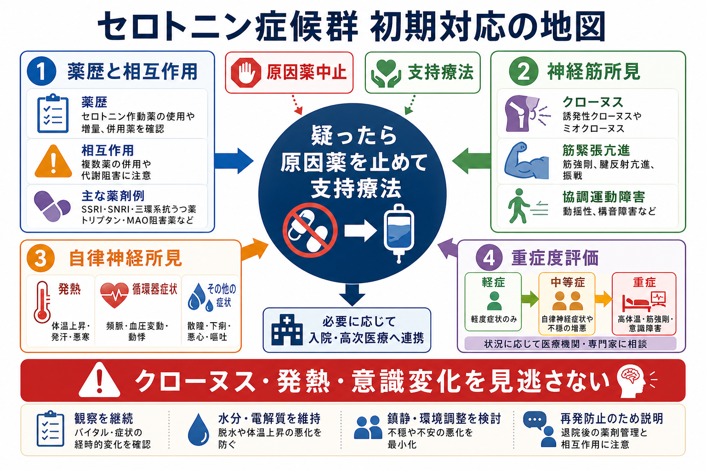
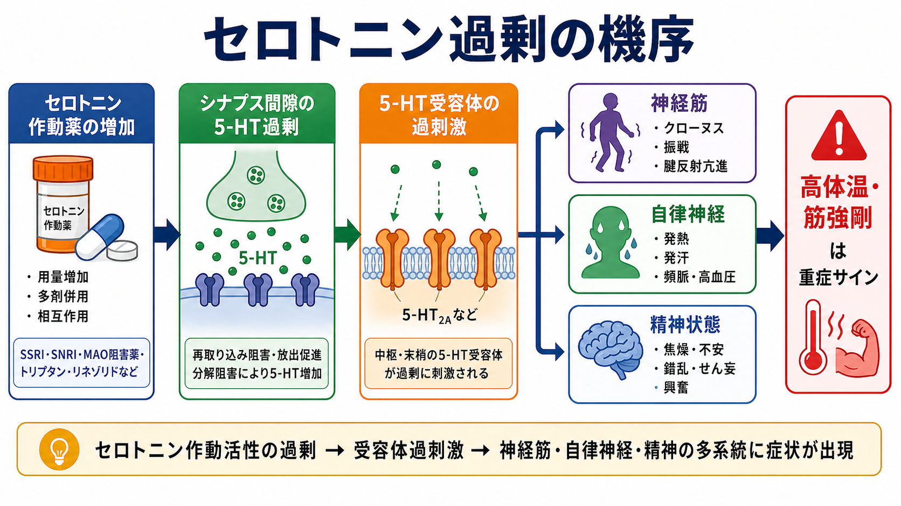

# セロトニン症候群への初期対応とは何か

## 要点

- セロトニン症候群は、セロトニン作動性薬物の開始、増量、併用、過量服薬などを契機に、精神状態変化、自律神経症状、神経筋過活動が急性に出現する毒性状態である[1][2]。
- 初期対応の柱は、原因となりうる薬剤を止めること、気道・呼吸・循環と体温を支えること、重症度を評価して観察場所を決めることである[1][3]。
- 診断は検査値ではなく臨床診断であり、とくにクローヌス、腱反射亢進、振戦、発汗、発熱、筋強剛を系統的に確認する[2][4]。
- 高体温、筋強剛、意識障害、けいれん、横紋筋融解、腎機能障害、代謝性アシドーシスがあれば重症として、ICU、救急、集中治療、毒物・薬剤の専門家に早く相談する[1][3]。
- 本記事は教育・研究目的の整理であり、個別症例の診断や治療指示ではない。実際の対応では施設手順、救急体制、地域の中毒相談、主治医・専門医の判断に従う。

## この記事で答える問い

セロトニン症候群を疑った瞬間に、現場では「薬を止める」「身体を支える」「重症度を見極める」を同時に進める必要がある。このノートでは、[[SSRIとは何か|SSRI]]、[[SNRIとは何か|SNRI]]、[[MAO阻害薬とは何か|MAO阻害薬]]、トラマドール、リネゾリド、トリプタン、リチウム、MDMA、セントジョーンズワートなどの関与を念頭に、初期対応を臨床実践と医療安全の観点から整理する。

## まず結論

セロトニン症候群への初期対応は、診断名を完全に確定してから始めるものではない。セロトニン作動性薬物への曝露があり、クローヌス、腱反射亢進、発汗、発熱、焦燥、せん妄などがそろうなら、原因薬の中止と支持療法を先に始める。検査は「診断の決め手」ではなく、重症度、合併症、鑑別診断を評価するために使う[1][2]。

## 背景

セロトニン症候群は、しばしば「まれな副作用」として理解される。しかし実際には、抗うつ薬、鎮痛薬、抗菌薬、制吐薬、片頭痛薬、気分安定薬、サプリメント、違法薬物など、複数の領域にまたがる薬剤で起こりうる[1][5]。特に複数薬剤の併用、最近の増量、薬剤変更、CYP 阻害薬の追加、過量服薬ではリスクが上がる。

典型的には、セロトニン作動性薬物の開始・増量・追加・過量摂取から数時間から 24 時間以内に出現しやすい[1][5]。この時間経過は、数日から週単位で進むことが多い悪性症候群との鑑別にも役立つ。ただし、半減期の長い薬剤や併用薬がある場合には症状が持続することがある[1]。

## 基本概念

### セロトニン症候群は「毒性スペクトラム」である

セロトニン症候群は、単一の固定した症候群というより、軽症から生命に関わる重症まで連続するセロトニン毒性として理解するとよい[2][5]。軽症では振戦、下痢、発汗、不安、不眠、軽い腱反射亢進が中心になる。一方、重症では高体温、筋強剛、持続するクローヌス、せん妄、けいれん、横紋筋融解、DIC、急性腎障害に進むことがある[1][3]。

### 診断の入口は「薬歴」と「神経筋所見」

初期評価では、薬剤名だけでなく、開始日、増量日、最終服薬時刻、併用薬、頓用薬、サプリメント、違法薬物、過量服薬の意図を確認する。意識障害や焦燥がある場合は、本人だけでなく家族、薬袋、処方歴、薬局情報、救急搬送情報も使う。

身体診察では、体温、心拍数、血圧、呼吸数、酸素化、意識レベルに加え、下肢の腱反射亢進、誘発クローヌス、眼球クローヌス、振戦、筋強剛、発汗、散瞳、腸蠕動亢進を確認する[1][4]。Hunter Serotonin Toxicity Criteria は、クローヌスを中心に据える簡潔な診断規則で、Sternbach 基準より感度・特異度が高いと報告された[4]。

## 仕組み

セロトニン作動性薬物は、再取り込み阻害、代謝阻害、放出促進、前駆物質増加、受容体刺激など、複数の経路でシナプス間隙の 5-HT 活性を高める[1][5]。過剰な 5-HT 作用は、中枢神経、脊髄、末梢自律神経系に影響し、神経筋過活動、自律神経不安定、精神状態変化として現れる。

重要なのは、重症化した高体温が単なる「発熱」ではなく、筋活動の増加と体温調節障害による熱産生増大として生じる点である。そのため、解熱薬だけでは十分でなく、鎮静、冷却、補液、重症例での気管挿管・筋弛緩など、熱産生を抑える支持療法が問題になる[1][3]。

## 初期対応

### 1. 安全確保と ABC 評価

まず、本人と周囲の安全を確保し、気道、呼吸、循環、意識レベル、体温を評価する。強い焦燥、せん妄、けいれん、重度高体温があれば、精神科単独の問題として扱わず、救急・集中治療の枠組みに切り替える。[[興奮状態への対応はどう行うか]]で扱うような安全確保と鎮静の技術は有用だが、セロトニン症候群では身体合併症の評価を同時に行う。

### 2. 原因薬を中止し、相互作用を確認する

疑った時点で、セロトニン作動性薬物と関連しうる併用薬を一時中止することが初期対応の中心になる[1][3]。対象には、SSRI、SNRI、三環系抗うつ薬、MAO 阻害薬、ミルタザピン、トラマドール、フェンタニル、メペリジン、リネゾリド、メチレンブルー、トリプタン、リチウム、デキストロメトルファン、セントジョーンズワートなどが含まれる[1][5]。

ただし、薬剤中止は「一覧にある薬を機械的に全部やめる」という意味ではない。離脱、原疾患の悪化、別の中毒、身体疾患の治療継続も問題になるため、救急、精神科、薬剤部、主治医、必要に応じて中毒専門家で確認する。

### 3. 支持療法を開始する

支持療法は、酸素投与、心電図・バイタル監視、静脈路確保、補液、電解質補正、尿量確認、体温管理、環境刺激の低減を含む[1][3]。焦燥や筋活動が熱産生を悪化させる場合、ベンゾジアゼピン系薬による鎮静が用いられることが多い[3]。

高血圧や頻脈などの自律神経症状は急速に変化するため、必要時には短時間作用型の薬剤が選ばれることがある[1][3]。一方、長時間作用型の薬剤や病態に合わない薬剤は、後の低血圧や過剰反応を招く可能性がある。ここは個別治療指示ではなく、専門家判断と施設手順に従う領域である。

### 4. 重症度を評価し、観察場所を決める

軽症で、バイタルが安定し、神経筋所見が軽く、意識が保たれる場合でも、症状が進行しないか観察する。中等症では、持続する頻脈・高血圧、発熱、焦燥、腱反射亢進、クローヌスがあり、入院観察や継続的モニタリングを検討する。重症では、高体温、筋強剛、意識障害、けいれん、低酸素、代謝性アシドーシス、CK 上昇、腎機能障害などを伴い、ICU レベルの管理が必要になる[1][3]。

検査としては、血糖、電解質、腎機能、肝機能、CK、血液ガス、凝固系、尿検査、心電図、過量服薬が疑われる場合のアセトアミノフェン・サリチル酸濃度などを状況に応じて確認する[1]。検査はセロトニン症候群を「陽性化」するためではなく、合併症と鑑別を落とさないために行う。

## 重症例で考える追加対応

シプロヘプタジンは 5-HT2A 受容体拮抗作用をもつ薬剤として用いられることがあるが、根拠の質は高くなく、投与経路も経口または経管に限られる[3][6]。したがって、原因薬中止と支持療法を置き換えるものではなく、支持療法で改善しない症例や中等症から重症例で専門家が検討する選択肢として理解するのが妥当である。

重度高体温では、冷却、十分な鎮静、気管挿管、非脱分極性筋弛緩薬を含む集中治療が検討される[1][3]。この段階では、精神科薬物副作用というより、全身性の中毒・救急病態として扱う。

## 臨床・研究との接続

臨床では、セロトニン症候群は[[医療安全とは何か|医療安全]]の問題でもある。薬剤相互作用、複数診療科の処方、薬局情報の断片化、OTC 薬やサプリメントの把握漏れが、発症と発見遅れの背景になりうる。特に、抗うつ薬に鎮痛薬、抗菌薬、片頭痛薬、制吐薬が追加される場面では、薬剤部を含むチーム確認が重要になる。

研究上は、セロトニン症候群の発生率、軽症例の見逃し、シプロヘプタジンの有効性、診断基準の外的妥当性、電子カルテアラートの精度が課題になる。Hunter 基準は有用だが、もともとは過量服薬データに基づく基準であり、すべての臨床場面で同じ精度を保証するものではない[4][5]。

## よくある誤解

### 誤解1: 発熱がなければセロトニン症候群ではない

発熱は重症度評価で重要だが、軽症から中等症では発熱が目立たないことがある。むしろ初期には、薬歴、クローヌス、腱反射亢進、振戦、発汗、焦燥を組み合わせて考える[1][4]。

### 誤解2: SSRI 単剤なら起こらない

重症例は複数機序の併用、特に MAO 阻害薬との組み合わせで起こりやすいが、単剤、増量、過量服薬、個体差でも起こりうる[1][5]。安全確認では「単剤だから除外」ではなく、「最近何が変わったか」を確認する。

### 誤解3: シプロヘプタジンを出せば初期対応は完了する

初期対応の中心は原因薬中止と支持療法である[1][3]。シプロヘプタジンは選択肢の一つだが、経口・経管投与に限られ、根拠の質にも限界がある[3][6]。高体温や筋強剛がある重症例では、冷却、鎮静、挿管、筋弛緩、ICU 管理がより重要になる。

### 誤解4: 悪性症候群と同じ対応でよい

セロトニン症候群と悪性症候群は、発熱、意識障害、筋緊張異常などが重なる。しかし、セロトニン症候群は発症が急で、クローヌスや腱反射亢進が目立ちやすい。一方、悪性症候群は抗精神病薬やドパミン遮断、パーキンソン病薬中断などと関連し、鉛管様筋強剛や徐々の発症が手がかりになる[1][3]。鑑別が難しい場合は、片方に決め打ちせず、身体救急として評価する。

## 関連ノート

- [[SSRIとは何か]]
- [[SNRIとは何か]]
- [[MAO阻害薬とは何か]]
- [[医療安全とは何か]]
- [[興奮状態への対応はどう行うか]]

MOC 更新候補: `content/00_MOC/` 配下の臨床実践、薬物療法、医療安全、精神科救急に関する MOC に追加する候補。

## 理解チェック

1. セロトニン症候群を疑うとき、なぜクローヌスと腱反射亢進を確認するのか。
2. 原因薬中止と支持療法のどちらを先に行うべきか。それとも同時に進めるべきか。
3. 高体温がある重症例で、解熱薬だけでは不十分になりうる理由は何か。
4. 悪性症候群、感染症、熱中症、離脱、薬物中毒をどのように並行評価するか。

## 参考文献

[1] Simon LV, Torrico TJ, Keenaghan M. *Serotonin Syndrome*. StatPearls. Last Update: 2024-03-02. https://www.ncbi.nlm.nih.gov/books/NBK482377/

[2] Ables AZ, Nagubilli R. Prevention, diagnosis, and management of serotonin syndrome. *American Family Physician*. 2010;81(9):1139-1142. https://www.aafp.org/pubs/afp/issues/2010/0501/p1139.html

[3] Merck Manual Professional Edition. *Serotonin Syndrome*. https://www.merckmanuals.com/professional/injuries-poisoning/heat-illness/serotonin-syndrome

[4] Dunkley EJC, Isbister GK, Sibbritt D, Dawson AH, Whyte IM. The Hunter Serotonin Toxicity Criteria: simple and accurate diagnostic decision rules for serotonin toxicity. *QJM*. 2003;96(9):635-642. https://academic.oup.com/qjmed/article/96/9/635/1522590

[5] Isbister GK, Buckley NA, Whyte IM. Serotonin toxicity: a practical approach to diagnosis and treatment. *Medical Journal of Australia*. 2007;187(6):361-365. https://www.mja.com.au/journal/2007/187/6/serotonin-toxicity-practical-approach-diagnosis-and-treatment

[6] Prakash S, Patel H, Kumar S. Cyproheptadine in serotonin syndrome: A retrospective study. *Journal of Family Medicine and Primary Care*. 2024;13(4):1340-1346. https://doi.org/10.4103/jfmpc.jfmpc_652_23

## 未解決問題

- シプロヘプタジンの投与量、投与タイミング、終了基準について、質の高い比較研究は限られている。
- Hunter 基準は有用だが、過量服薬以外の一般臨床、軽症例、高齢者、多疾患併存例での性能評価はさらに必要である。
- 電子カルテの薬剤相互作用アラートは過検出と見逃しの両方が問題になり、セロトニン症候群予防に最適な設計はまだ確立していない。
