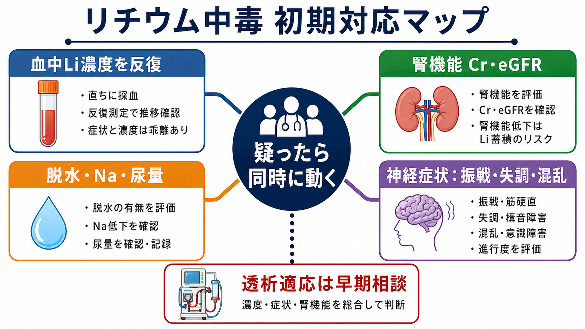
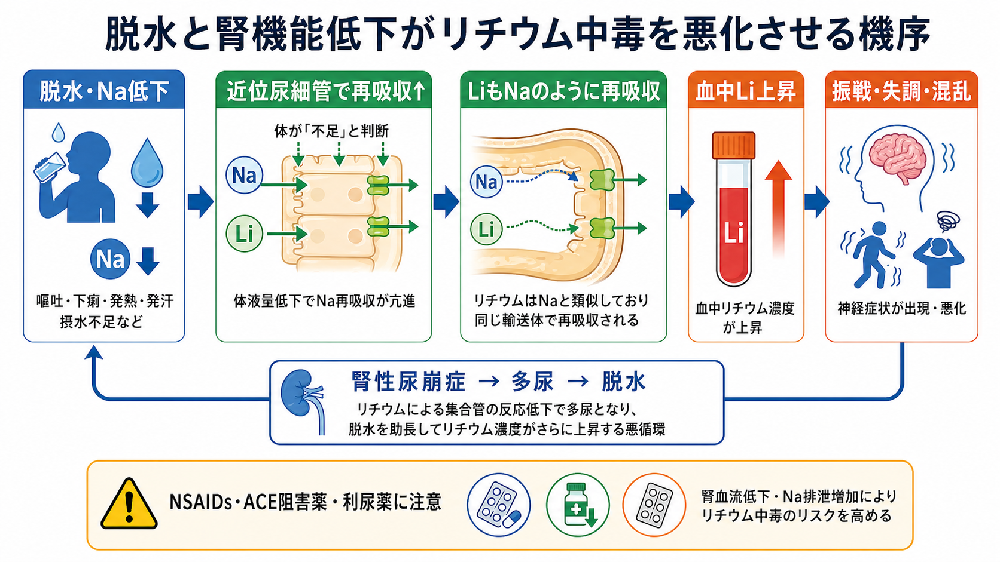
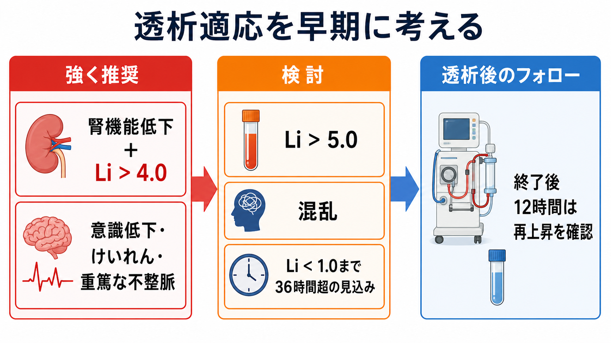

# リチウム中毒への初期対応とは何か

## 要点

- [[リチウム中毒とは何か]]を疑ったら、リチウムをいったん中止し、ABC、意識、循環、体温、神経症状を確認しながら、血中リチウム濃度、腎機能、電解質、脱水、尿量、併用薬を同時に評価する。
- 血中濃度は重要だが、症状と完全には一致しない。慢性中毒では比較的低い濃度でも神経症状が重くなりうるため、濃度だけで軽症と決めない[1][2]。
- 腎機能低下、脱水、低ナトリウム、NSAIDs、ACE阻害薬/ARB、利尿薬はリチウム排泄を低下させ、中毒を悪化させる[3][4]。
- EXTRIP は、腎機能低下を伴う血中リチウム濃度 > 4.0 mmol/L、意識低下、けいれん、生命を脅かす不整脈では体外除去を推奨し、濃度 > 5.0 mmol/L、混乱、36時間以内に 1.0 mmol/L 未満へ下がらない見込みでは体外除去を提案している[1]。
- このノートは教育・研究目的の整理であり、個別症例の診断・治療指示ではない。実際の対応は救急、腎臓内科、集中治療、精神科、薬剤部などの施設手順に従う。

## この記事で答える問い

リチウム中毒への初期対応で最初に確認するべきことは何か。特に、血中濃度、腎機能、脱水、薬物相互作用、透析適応をどのように結びつけて考えるのかを整理する。

## まず結論

リチウム中毒の初期対応は「濃度を待つ」作業ではなく、「排泄できない理由を探し、重症化の時間を短くする」作業である。具体的には、リチウム内服を止め、バイタルと意識を安定化させ、血中リチウム濃度を反復測定し、Cr/eGFR、Na、K、Ca、尿量、脱水、併用薬を確認する。同時に、重い神経症状、腎機能低下、高値濃度、濃度低下の遅延がある場合は、早期に腎臓内科・集中治療へ相談する[1][2]。

## 背景

[[リチウムとは何か]]は、[[双極性障害とは何か]]の維持療法、自殺リスク低下、躁状態の再発予防で重要な薬剤である。一方で治療域が狭く、主に腎排泄で、体液量や腎機能の変化を受けやすい。したがって、発熱、下痢、嘔吐、食事・水分摂取低下、熱中症、急性腎障害、薬剤追加があると、普段の用量でも中毒が起こりうる[3][4]。

リチウム中毒は、急性過量、慢性蓄積、急性 on chronic の3型で考えると臨床判断がしやすい。急性過量では消化器症状が目立ってから中枢神経症状が遅れて出ることがあり、慢性蓄積では振戦、失調、構音障害、混乱、意識障害などの神経症状が前景に立ちやすい[2][5]。[[中毒症状とは何か]]や[[意識障害とは何か]]の評価と接続して考える必要がある。

## 基本概念

### 血中リチウム濃度

血中リチウム濃度は、摂取時刻、最終内服からの時間、徐放製剤、腎機能、輸液や透析の有無で変わる。初回値が低くても上昇することがあり、初回値が高くても組織内分布や腎排泄の経過によって臨床像が変わる。したがって、初期対応では「1回の数値」ではなく「症状と腎機能を見ながら反復測定する推移」が重要である[1][2]。

実務的には、採血時刻、最終内服時刻、通常内服量、過量摂取の有無、徐放製剤かどうか、最近の処方変更、他院処方、サプリメント、脱水イベントを同時に記録する。[[薬物相互作用とは何か]]の確認もここに含まれる。

### 腎機能

リチウムはほぼ腎から排泄される。Cr/eGFR の低下、急性腎障害、慢性腎臓病、高齢、脱水、低ナトリウムは、血中濃度の上昇と濃度低下の遅延につながる。EXTRIP が腎機能低下と高濃度の組み合わせを透析推奨条件にしているのは、単に値が高いからではなく、体内から下がりにくいからである[1]。

### 脱水とナトリウム

体液量が不足すると、腎臓はナトリウムを保持しようとする。リチウムはナトリウムと似た扱いを受けるため、近位尿細管での再吸収が増え、血中濃度が上がりやすくなる。さらにリチウムは腎性尿崩症を起こし、多尿から脱水を強めることがある。この悪循環が、発熱、下痢、嘔吐、摂水低下、猛暑で危険になる理由である[3][4]。

### 透析適応

リチウムは分子量が小さく、蛋白結合がほとんどなく、水溶性であるため、血液透析で除去されやすい。ただし、透析後に組織から血中へ戻る再上昇がありうるため、終了後も濃度と症状を追跡する必要がある[1][6]。

EXTRIP の推奨は、初期相談の目安として有用である。体外除去は、腎機能低下を伴う濃度 > 4.0 mmol/L、意識低下、けいれん、生命を脅かす不整脈では推奨される。また、濃度 > 5.0 mmol/L、混乱、適切な治療をしても 36 時間以内に 1.0 mmol/L 未満へ下がらない見込みでは提案される[1]。一方で、透析の有効性については無作為化比較試験が乏しく、推奨は観察研究、薬物動態、専門家合意に大きく依存する[6]。

## 仕組み

初期対応を一つの流れとして見ると、次の順序で考える。

1. 安全確保と一次評価  
   ABC、意識レベル、けいれん、重い不整脈、脱水、発熱、外傷、誤嚥リスクを確認する。重症なら救急・集中治療レベルで評価する。
2. リチウムと原因薬の保留  
   リチウムを一時中止し、NSAIDs、ACE阻害薬/ARB、利尿薬など濃度上昇に関わる薬剤を確認する[3][4]。
3. 採血とモニタリング  
   血中リチウム濃度、Cr/eGFR、BUN、Na、K、Ca、血糖、CK、血算、肝機能、必要に応じて血液ガスや心電図を確認する。濃度は推移を見る。
4. 脱水と腎機能への対応  
   循環血液量低下があれば、施設手順に従い補液を含む支持療法を検討する。尿量と電解質を追跡し、過補正や心腎負荷にも注意する。
5. 透析適応の早期相談  
   重い神経症状、腎機能低下、高濃度、濃度低下遅延の見込みがあれば、血液浄化の可否を早期に相談する[1][2]。

## 図解

リチウム中毒の初期対応は、単純な「濃度が高いか低いか」の判定ではない。濃度、症状、腎機能、脱水、時間経過を同時に見る。特に慢性中毒では、血中濃度が極端に高くなくても中枢神経症状が重いことがある。逆に急性過量では、初期には症状が軽くても、その後に濃度上昇や神経症状が進むことがある[2][5]。

| 確認するもの | 初期対応での意味 | 見落としやすい点 |
|---|---|---|
| 血中リチウム濃度 | 中毒の程度と推移を把握する | 1回の値だけで安全とは言えない |
| Cr/eGFR | 排泄能力と透析相談の判断に関わる | 高齢者では軽いCr上昇でも意味が大きい |
| Na・水分状態 | 再吸収増加と脱水悪循環を示す | 下痢、嘔吐、発汗、摂水低下を聴取する |
| 神経症状 | 重症度を反映しやすい | 振戦、失調、構音障害、混乱を「精神症状」だけで説明しない |
| 併用薬 | 濃度上昇の原因になる | NSAIDs、ACE阻害薬/ARB、利尿薬を確認する |
| 時間経過 | 再上昇や遅延吸収を見つける | 徐放製剤、慢性蓄積、透析後リバウンドに注意する |

## 臨床・研究との接続

臨床では、リチウム中毒は[[精神科医療安全の特徴は何か]]と[[医療安全とは何か]]の交点にある。処方、採血モニタリング、脱水時の説明、救急受診、腎機能評価、薬剤相互作用、退院後フォローが切れ目なくつながらないと、同じ中毒が再発しやすい。

NICE は、リチウム治療中の血中濃度、腎機能、甲状腺機能、カルシウムなどの定期モニタリングを推奨し、下痢、嘔吐、発熱、脱水、薬剤変更時には医療者へ相談する必要を強調している[3]。これは急性対応だけでなく、再発予防の教育にも直結する。[[薬物療法のリスクベネフィットをどう考えるか]]では、治療効果と安全性を一体として考える必要がある。

研究上は、透析適応の精密化が課題である。EXTRIP は実用的な閾値を示しているが、Cochrane レビューはリチウム中毒に対する血液透析の無作為化比較試験がないことを指摘している[6]。そのため、患者背景、中毒型、濃度推移、神経予後、透析合併症を含む前向きデータが今後も必要である。

## よくある誤解

### 血中濃度が治療域なら中毒ではない

慢性中毒では、濃度と神経症状がずれることがある。振戦、失調、構音障害、混乱、傾眠があれば、血中濃度が極端に高くなくてもリチウム中毒を鑑別に残す[2][5]。

### 脱水を直せばそれで十分である

脱水補正は重要だが、腎機能低下、濃度推移、神経症状、併用薬、透析適応を同時に見る必要がある。補液だけで下がるか、血液浄化が必要かは、時間経過を含めて判断する[1][2]。

### 精神症状が悪化しただけである

混乱、不穏、注意障害、意識変容は[[せん妄とは何か]]や[[中毒性精神障害とは何か]]として現れることがある。リチウム使用者では、精神症状の悪化に見える変化でも、腎機能、脱水、濃度を確認する。

### 透析は濃度だけで決まる

透析適応は濃度だけでなく、腎機能、神経症状、不整脈、濃度低下の見込み、再上昇リスクで決まる。高濃度でも症状が軽い場合、低めの濃度でも慢性中毒で神経症状が強い場合があり、専門科相談が重要である[1][6]。

## 関連ノート

- [[リチウムとは何か]]
- [[リチウム中毒とは何か]]
- [[双極性障害とは何か]]
- [[薬物相互作用とは何か]]
- [[薬物過量服薬とは何か]]
- [[中毒症状とは何か]]
- [[意識障害とは何か]]
- [[腎不全に伴う精神症状とは何か]]
- [[精神科医療安全の特徴は何か]]
- [[医療安全とは何か]]

## MOC更新候補

- `content/00_MOC/MOC｜薬物療法.md`
- `content/00_MOC/MOC｜臨床実践・治療.md`
- `content/00_MOC/MOC｜精神医学.md`

## 理解チェック

1. リチウム中毒で、血中濃度だけでなく腎機能と脱水を同時に見る理由は何か。
2. 慢性中毒で、血中濃度と症状がずれることがあるのはなぜか。
3. リチウム濃度を上げやすい併用薬には何があるか。
4. EXTRIP が透析を推奨または提案する代表的な条件は何か。
5. 透析後に濃度を再確認する必要がある理由は何か。

## 未解決問題

- どの患者で透析が神経予後を改善するかを示す高品質な比較研究は限られている。
- 慢性中毒、急性過量、急性 on chronic を分けた濃度閾値と予後予測は、さらに精密化が必要である。
- 外来での脱水時対応、薬剤変更時のアラート、患者教育をどのように実装すれば再発を減らせるかは、医療安全上の実装課題である。

## 参考文献

[1] Decker, B. S., Goldfarb, D. S., Dargan, P. I., Friesen, M. W., Gosselin, S., Hoffman, R. S., Lavergne, V., Nolin, T. D., & Ghannoum, M. (2015). Extracorporeal treatment for lithium poisoning: Systematic review and recommendations from the EXTRIP Workgroup. *Clinical Journal of the American Society of Nephrology, 10*(5), 875-887. https://doi.org/10.2215/CJN.10021014

[2] Hedya, S. A., Avula, A., & Swoboda, H. D. (2023). Lithium Toxicity. *StatPearls*. https://www.ncbi.nlm.nih.gov/books/NBK499992/

[3] National Institute for Health and Care Excellence. (2014, updated). *Bipolar disorder: assessment and management (CG185)*. https://www.nice.org.uk/guidance/cg185

[4] New Zealand Formulary / bpacnz. (2007). Lithium in General Practice. *Best Practice Journal*. https://bpac.org.nz/magazine/2007/february/lithium.asp

[5] Baird-Gunning, J., Lea-Henry, T., Hoegberg, L. C. G., Gosselin, S., & Roberts, D. M. (2017). Lithium poisoning. *Journal of Intensive Care Medicine, 32*(4), 249-263. https://doi.org/10.1177/0885066616651582

[6] Lavonas, E. J., & Buchanan, J. (2015). Hemodialysis for lithium poisoning. *Cochrane Database of Systematic Reviews, 2015*(9), CD007951. https://doi.org/10.1002/14651858.CD007951.pub2

[7] Gitlin, M. (2016). Lithium side effects and toxicity: prevalence and management strategies. *International Journal of Bipolar Disorders, 4*, 27. https://doi.org/10.1186/s40345-016-0068-y
