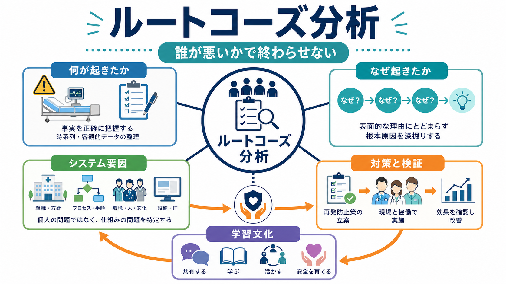
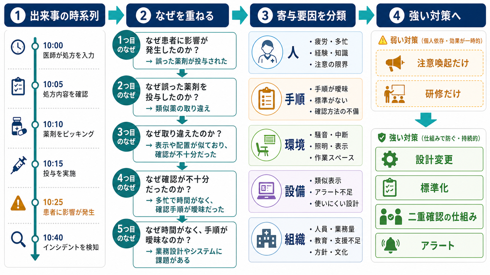
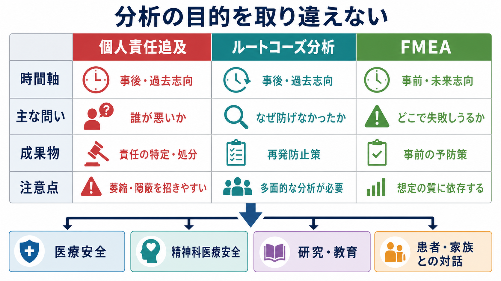

# ルートコーズ分析とは何か

## 要点

- ルートコーズ分析（Root Cause Analysis: RCA）は、重大なインシデントや有害事象のあとに、「誰が悪かったか」ではなく「なぜその出来事が起こりうる仕組みだったのか」を調べる方法である [1][2]。
- RCA の焦点は、個人の注意不足を責めることではなく、手順、情報伝達、勤務負荷、教育、設備、環境、組織文化などの寄与要因を見つけ、再発防止につながる対策へ変えることである [2][3]。
- ただし、RCA は万能ではない。分析が浅いと「注意喚起」「再教育」だけで終わり、システムを変える対策にならない [4][5]。
- 医療安全では、RCA は [[インシデントレポートとは何か]]、[[医療安全とは何か]]、[[精神科医療安全の特徴は何か]] と接続して理解するとよい。

## この記事で答える問い

- ルートコーズ分析は、通常の反省会や責任追及と何が違うのか。
- 「根本原因」とは、単一の真の原因を意味するのか。
- RCA では、どのように事実、時系列、寄与要因、対策をつなげるのか。
- 臨床現場、とくに精神科医療安全では、どのように使えるのか。

## まず結論

ルートコーズ分析とは、事故後の説明責任を果たしながら、同じ事故を起こしにくいシステムへ変えるための分析である。医療事故は、しばしば最後に操作した人、最後に判断した人、最後に確認しなかった人の問題として語られやすい。しかし、Reason のヒューマンエラー論が示したように、エラーは現場の個人だけでなく、組織、設計、管理、作業条件、防御層の穴が重なった結果として現れる [3]。

したがって RCA で問うべきなのは、「なぜその人は間違えたのか」だけではない。「なぜ間違えても検出されなかったのか」「なぜその手順が曖昧だったのか」「なぜ確認のための時間や人員が不足していたのか」「なぜ似た薬剤や似た表示が放置されていたのか」といった問いである。ここまで掘り下げて初めて、個人の反省ではなく、[[リスク下の意思決定はどのように行われるのか]] や [[認知バイアスとは何か]] とも接続するシステム改善になる。

## 背景

医療安全の転換点としてよく引用されるのが、Institute of Medicine の *To Err Is Human* である。この報告書は、医療事故を個人の道徳的失敗としてではなく、複雑な医療システムの安全設計の問題として扱う必要を広く示した [6]。WHO の患者安全行動計画も、回避可能な害を減らすには、報告、学習、患者・家族参加、リーダーシップ、データ活用を含む多層的な安全戦略が必要だと述べている [7]。

日本でも、医療事故調査制度や医療事故情報収集等事業を通じて、個別事例の原因分析と再発防止への学習が重視されてきた [8]。ただし、制度として事例を集めるだけでは十分ではない。現場で「事故が起きたら、誰かが責められる」という感覚が強いままだと、報告は減り、事実は曖昧になり、近接要因だけが強調される。RCA は、この流れを「責める文化」から「学習する文化」へ移すための実務的な道具である。

## 基本概念

### ルートコーズは単一原因ではない

「ルートコーズ」という語は、しばしば「たった一つの本当の原因」を探すように誤解される。しかし医療事故では、原因は一列に並ぶことよりも、複数の条件が重なって事故を可能にすることが多い。薬剤取り違えを例にすれば、似た包装、保管場所、電子カルテの表示、繁忙時間帯、確認手順、経験の浅さ、声をかけにくい職場文化が同時に関わりうる。

RCA でいう根本原因とは、個人の直前行動のさらに下にある、修正可能なシステム条件である。言い換えると、「ここを変えれば、別の人が同じ状況に置かれても同じ事故が起きにくくなる」と考えられる要因である [1][2]。

### 近接要因と寄与要因

近接要因とは、出来事の直前に観察される行為や状態である。たとえば「確認をしなかった」「誤った薬剤を選んだ」「申し送りが抜けた」などが該当する。これは重要な事実だが、そこで分析を止めると個人責任化になりやすい。

寄与要因とは、その近接要因を起こりやすくした条件である。たとえば、表示の見にくさ、標準手順の不在、夜勤帯の人員不足、情報システムのアラート疲れ、心理的安全性の低さ、教育の偏りなどである。RCA は、近接要因を入口にして、寄与要因の層まで掘り下げる。

### 公正文化との関係

RCA は「誰も責任を問わない」という意味ではない。意図的な違反、重大な怠慢、隠蔽、患者への説明責任は別に扱う必要がある。一方で、通常の人間的エラーや、悪い結果を避けようとして行った判断を、結果だけで罰することは安全を損なう。公正文化では、説明責任と学習可能性を分けて扱う [2][3]。

## 仕組み

RCA は、典型的には次の流れで進む。

1. 出来事を定義する  
   何が、いつ、どこで、誰に、どのような影響を与えたのかを、評価語ではなく事実として整理する。

2. 時系列を作る  
   記録、聞き取り、電子カルテ、モニタリング情報、申し送り、環境条件を集め、出来事の前後関係を可視化する。

3. 近接要因を確認する  
   直前の行為や判断だけでなく、検出されなかった理由、エスカレーションされなかった理由も見る。

4. なぜを重ねる  
   「なぜ」を繰り返す。ただし、機械的に 5 回聞くのではなく、手順、環境、設備、チーム、組織など複数の枝に分ける。

5. 寄与要因を分類する  
   人、タスク、手順、情報、設備、環境、教育、勤務体制、管理、組織文化のようなカテゴリに整理する。

6. 対策を選ぶ  
   注意喚起や再教育だけでなく、標準化、物理的分離、設計変更、強制機能、チェックリスト、アラート改善、業務量調整などを検討する。

7. 効果を検証する  
   対策を実施して終わりにせず、再発、ヒヤリ・ハット、遵守率、スタッフの使いやすさ、患者・家族の経験を確認する。

### 弱い対策と強い対策

RCA の品質を左右するのは、分析の深さだけではない。最終的な対策が実際にシステムを変えるかどうかである。米国の National Patient Safety Foundation が提案した RCA2 では、RCA を「分析」だけで終わらせず、「行動と成果」に結びつけることが強調されている [2]。

弱い対策の例は、「注意する」「再教育する」「周知する」だけで終わる対応である。これらは必要な場合もあるが、人の記憶や努力への依存が強く、忙しい現場では効果が続きにくい。強い対策の例は、似た薬剤を離して保管する、表示を変える、誤選択できない画面設計にする、標準手順を作る、ダブルチェックが自然に発生する業務フローに変える、過負荷の時間帯に人員を調整する、などである。

## 図解

RCA、責任追及、FMEA は混同されやすい。責任追及は過去の行為者に焦点を当てる。RCA は事故後に、なぜ防御層が働かなかったかを調べる。FMEA は事故前に、どこで失敗しうるかを予測する。どれも「原因を考える」作業に見えるが、目的、時間軸、成果物が異なる。

| 方法 | 時間軸 | 主な問い | 成果物 | 注意点 |
|---|---|---|---|---|
| 個人責任追及 | 事後・過去志向 | 誰が悪いか | 責任の特定、処分 | 萎縮、隠蔽、報告減少を招きやすい |
| RCA | 事後・過去志向 | なぜ防げなかったか | 再発防止策、学習課題 | 多面的に分析しないと浅くなる |
| FMEA | 事前・未来志向 | どこで失敗しうるか | 事前の予防策 | 想定の質に依存する |

## 臨床・研究との接続

臨床では、RCA は重大事故だけでなく、同じ種類のヒヤリ・ハットが繰り返される場面にも役立つ。たとえば [[向精神薬の処方ミスを防ぐには何を確認するか]]、[[転倒転落リスク管理とは何か]]、[[誤嚥窒息リスク管理とは何か]] のような領域では、個別の注意だけでなく、薬剤選択画面、申し送り、環境整備、観察頻度、患者状態の変化を一体として見る必要がある。

精神科医療安全では、事故の背景に、症状、認知機能、衝動性、対人関係、隔離・身体拘束、退院支援、薬剤副作用、スティグマが絡みやすい。したがって RCA でも、患者を「危険な人」として固定化するのではなく、環境、関係性、説明、権利擁護、チームの負荷、地域資源との接続を含めて考える必要がある。これは [[精神科医療安全の特徴は何か]] や [[患者中心の精神科診療とは何か]] と強く関係する。

研究・教育では、RCA は単なる事例検討ではなく、改善策の実装と評価を含む質改善研究に接続できる。たとえば、対策前後でインシデント率だけを見るのではなく、報告しやすさ、心理的安全性、スタッフ負担、患者経験、対策の遵守率を合わせて見る必要がある。事故件数が減ったように見えても、報告文化が弱まっただけなら安全性は改善していない。

## よくある誤解

### 誤解1: RCA は犯人探しをしないので責任が曖昧になる

RCA は責任を消す方法ではない。むしろ、個人の処分だけで終わらせるよりも、組織がどの条件を変えるべきかを明確にする。説明責任、倫理的責任、法的責任と、システム改善の責任を混同しないことが重要である。

### 誤解2: 「なぜ」を5回聞けば RCA になる

「5つのなぜ」は便利な入口だが、一本道で使うと、最初に設定した仮説に引っ張られやすい。医療では、手順、環境、設備、情報、チーム、組織の複数の枝を同時に見る必要がある。

### 誤解3: 根本原因を特定すれば再発は防げる

根本原因を記述しても、対策が弱ければ再発防止にはならない。RCA の価値は、原因リストではなく、実行可能で検証可能な対策を作るところにある [2][4]。

### 誤解4: RCA は重大事故だけに使う

重大事故では RCA が必要になりやすいが、同じパターンのヒヤリ・ハット、報告されにくい小さな不具合、スタッフが「いつか事故になる」と感じている業務にも有用である。むしろ重大事故の前に学べる仕組みを作ることが、[[医療安全とは何か]] の中心である。

## 関連ノート

- [[医療安全とは何か]]
- [[インシデントレポートとは何か]]
- [[精神科医療安全の特徴は何か]]
- [[向精神薬の処方ミスを防ぐには何を確認するか]]
- [[転倒転落リスク管理とは何か]]
- [[誤嚥窒息リスク管理とは何か]]
- [[認知バイアスとは何か]]
- [[リスク下の意思決定はどのように行われるのか]]
- [[患者中心の精神科診療とは何か]]

## MOC更新候補

- `content/00_MOC/` 配下に医療安全・危機対応系 MOC がある場合、本記事を [[医療安全とは何か]]、[[インシデントレポートとは何か]] と同じ群に追加する。
- 並列生成ジョブとの衝突を避けるため、このタスクでは MOC 本体は更新していない。

## 理解チェック

1. RCA が「誰が悪いか」ではなく「なぜ防げなかったか」を問う理由を説明できるか。
2. 近接要因と寄与要因の違いを、薬剤取り違えや転倒事例で説明できるか。
3. 「注意喚起だけ」「研修だけ」が弱い対策になりやすい理由を説明できるか。
4. RCA と FMEA の時間軸と目的の違いを説明できるか。
5. 精神科医療安全で RCA を行うとき、患者の症状だけに原因を閉じ込めないために何を見るべきか。

## 未解決問題

- RCA の実施件数が増えても、強い対策の実装率や持続性が十分に評価されないことがある。
- 事故分析は、患者・家族への説明、スタッフ支援、法的・倫理的責任、組織学習を同時に扱うため、現場では役割分担が難しい。
- 報告件数の増減だけでは安全文化の変化を判断できない。報告のしやすさ、心理的安全性、対策の使いやすさを含む評価が必要である。

## 参考文献

[1] AHRQ Patient Safety Network. *Root Cause Analysis*. https://psnet.ahrq.gov/primer/root-cause-analysis

[2] National Patient Safety Foundation. (2015). *RCA2: Improving Root Cause Analyses and Actions to Prevent Harm*. https://www.ihi.org/resources/publications/rca2-improving-root-cause-analyses-and-actions-prevent-harm

[3] Reason, J. (2000). Human error: models and management. *BMJ, 320*(7237), 768-770. https://doi.org/10.1136/bmj.320.7237.768

[4] Peerally, M. F., Carr, S., Waring, J., & Dixon-Woods, M. (2017). The problem with root cause analysis. *BMJ Quality & Safety, 26*(5), 417-422. https://doi.org/10.1136/bmjqs-2016-005511

[5] Wu, A. W., Lipshutz, A. K. M., & Pronovost, P. J. (2008). Effectiveness and efficiency of root cause analysis in medicine. *JAMA, 299*(6), 685-687. https://doi.org/10.1001/jama.299.6.685

[6] Institute of Medicine. (2000). *To Err Is Human: Building a Safer Health System*. National Academies Press. https://nap.nationalacademies.org/catalog/9728/to-err-is-human-building-a-safer-health-system

[7] World Health Organization. (2021). *Global Patient Safety Action Plan 2021-2030: Towards eliminating avoidable harm in health care*. https://www.who.int/publications/i/item/9789240032705

[8] 日本医療機能評価機構. *医療事故情報収集等事業*. https://www.med-safe.jp/
