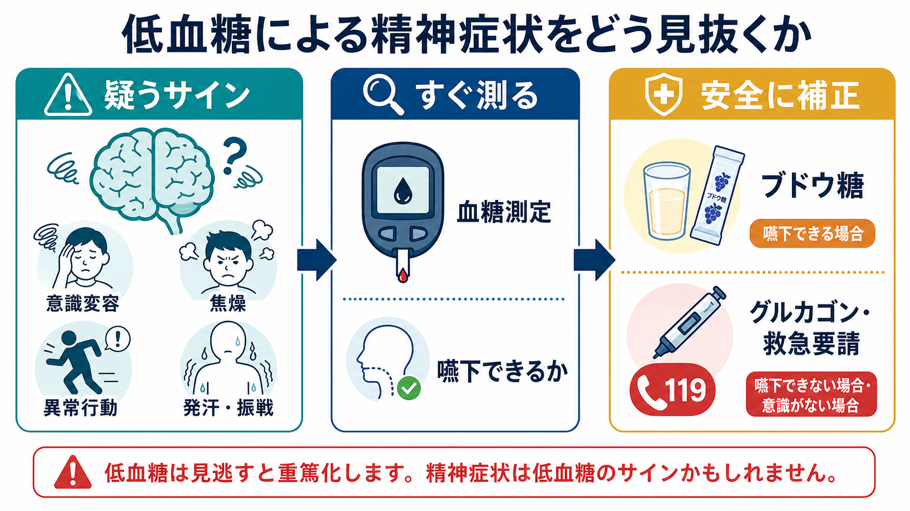
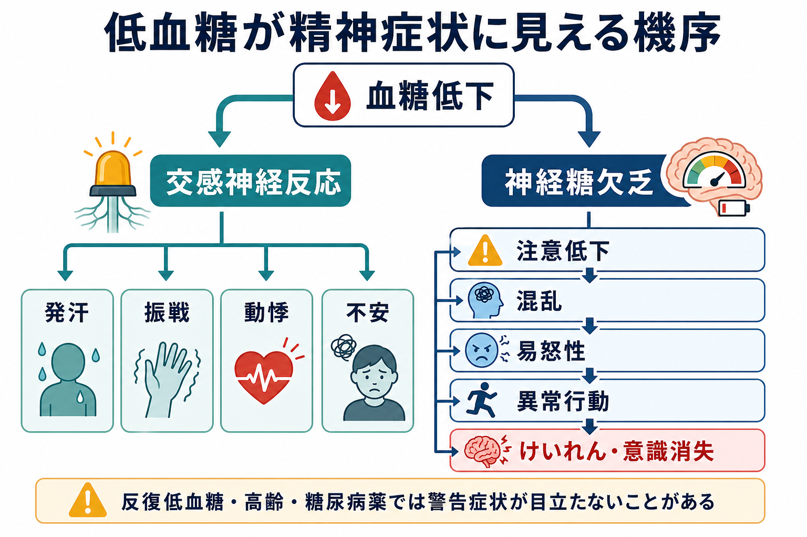
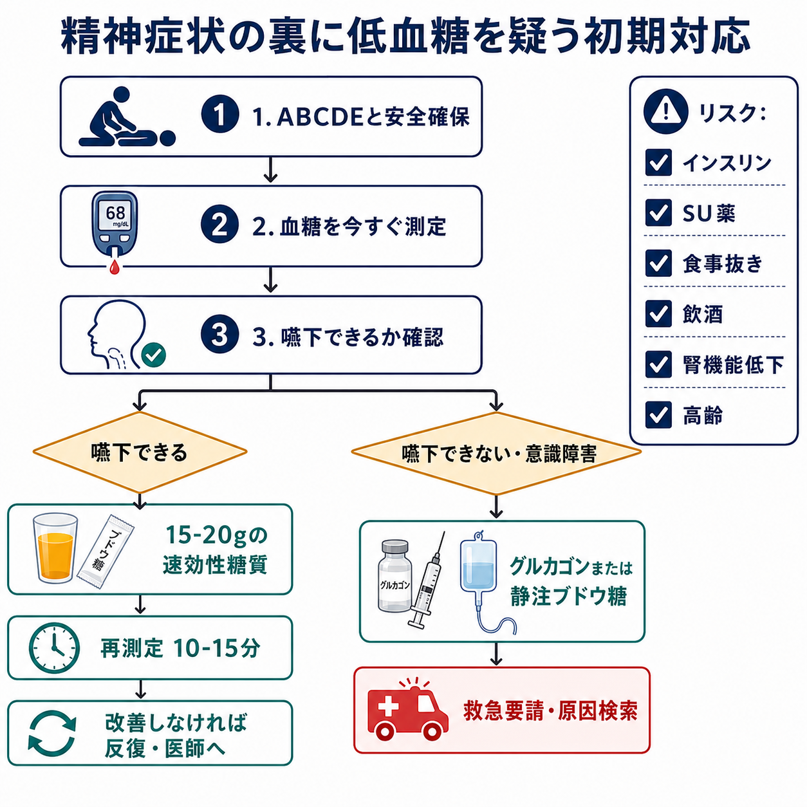

# 低血糖による精神症状をどう見抜くか

## 要点

- 低血糖は、焦燥、易怒性、混乱、奇異な言動、攻撃的に見える行動、眠気、せん妄様の意識変容として現れることがある。
- 精神症状らしく見えても、糖尿病薬、食事摂取不良、飲酒、腎機能低下、高齢、感染・敗血症、長時間の絶食があれば、まず低血糖を除外する。
- 低血糖の診断は「症状」「低い血糖」「糖補正後の改善」をそろえる Whipple 三徴が基本だが、現場の初期対応では血糖測定を遅らせない[1]。
- 嚥下できる軽症例では速効性糖質を投与して再測定し、嚥下できない、意識障害がある、けいれんがある場合はグルカゴン、静注ブドウ糖、救急対応を考える[2][3]。
- これは教育・研究目的の整理であり、個別の診断・治療指示ではない。実際の対応は所属施設のプロトコルと医師・救急チームの判断に従う。

## この記事で答える問い

1. 精神症状に見える低血糖を、どの場面で疑うべきか。
2. 低血糖の症状は、なぜ焦燥・異常行動・意識変容として見えるのか。
3. 精神科・心理臨床・病棟・外来・施設で、どの順番で確認し対応するか。

## まず結論

急に出現した「いつもと違う精神状態」は、精神疾患だけで説明しない。とくに、意識の清明さが揺れる、発汗・振戦・動悸を伴う、食事を抜いた、糖尿病薬を使っている、飲酒後である、腎機能低下や高齢がある、という条件では、低血糖を先に測る。

実務上の合言葉は「説得の前に測定」である。興奮している患者に長く説明したり、[[急速鎮静とは何か|急速鎮静]]へ進む前に、可能な範囲で安全確保、ABCDE、血糖測定を並行して行う。これは[[身体疾患の見逃しを防ぐ精神科初期対応とは何か]]の中でも、とくに見逃すと短時間で重篤化しうるポイントである。

## 背景

低血糖は、糖尿病治療中の人で頻度が高く、インスリン、スルホニル尿素薬、グリニド薬などにより起こりやすい[4]。一方で、糖尿病がない人でも、飢餓、飲酒、重症感染、肝不全、腎不全、副腎不全、インスリノーマ、薬剤などで起こりうる[1]。

精神科的には、低血糖は「不穏」「せん妄」「パニック」「酩酊」「性格変化」「認知症の悪化」のように見える。本人が「低血糖かもしれない」と言えるとは限らない。反復低血糖では自律神経症状が鈍くなり、発汗や振戦が目立たないまま神経糖欠乏症状に進むことがある[1][5]。

## 基本概念

### 低血糖のレベル

糖尿病診療でよく用いられる分類では、血糖 70 mg/dL 未満かつ 54 mg/dL 以上を Level 1、54 mg/dL 未満を Level 2、他者の援助を要する重症イベントを Level 3 とする[4][6]。精神症状として問題になるのは、単なる数値だけではなく、判断力・嚥下・歩行・協力の能力が落ちているかである。

### 自律神経症状と神経糖欠乏症状

低血糖では、まず交感神経・副腎髄質系の反応により、発汗、振戦、動悸、不安、空腹感が出やすい。さらに脳への糖供給が不足すると、注意低下、混乱、発語困難、視覚異常、眠気、行動変化、けいれん、意識消失へ進む[1][5]。後者が「精神症状」に見える中心である。

## 仕組み

脳は通常、グルコースを主要な燃料として使う。血糖が低下すると、インスリン分泌の抑制、グルカゴン分泌、エピネフリン分泌などの拮抗調節反応が働く[1]。この反応が自律神経症状を生む一方、血糖低下がさらに進むと脳機能そのものが障害される。

臨床的に重要なのは、症状の「質」より「変化」である。普段は穏やかな人が急に怒りっぽい、話が飛ぶ、同じことを繰り返す、目的のない行動をする、治療や介助を拒む、眠り込む、という変化が短時間で起こったとき、低血糖は鑑別の上位に置く。

## 図解

初期対応は、精神症状への説明・説得だけで完結させない。低血糖を疑ったら、本人と周囲の安全を確保し、意識・呼吸・循環を見ながら、血糖を測る。嚥下できるなら速効性糖質、嚥下できないなら経口摂取を避け、グルカゴンや静注ブドウ糖、救急要請を検討する[2][3]。

## 臨床・研究との接続

### 精神科・心理臨床での見抜き方

精神症状の面接では、次の質問を早めに入れる。

| 見る点 | 低血糖を疑う手がかり |
|---|---|
| 時間経過 | 数分から数時間で急に変化した |
| 食事 | 食事抜き、嘔吐、下痢、食欲不振、絶食 |
| 薬剤 | インスリン、SU薬、グリニド薬、薬の飲み間違い |
| 身体所見 | 発汗、振戦、頻脈、顔面蒼白、ふらつき |
| 認知・行動 | 混乱、易怒性、奇異な行動、眠気、発語困難 |
| 背景 | 高齢、腎機能低下、肝疾患、感染、飲酒 |

血糖測定は、診断のためだけでなく、スタッフ間の共通認識を作るためにも重要である。「精神症状か身体疾患か」を二分せず、[[せん妄への危機対応とは何か|せん妄への危機対応]]や[[興奮状態への対応はどう行うか|興奮状態への対応]]の一部として扱う。

### 病棟・施設での対応

病棟や介護施設では、低血糖は医療安全上のイベントである。食事摂取量、糖尿病薬の投与時刻、運動量、発熱・感染、腎機能、夜間の発汗や悪夢、朝の頭痛・倦怠感を記録し、再発パターンを探す。高リスク者では、構造化された糖尿病教育、グルカゴン製剤の準備、CGM などの技術活用が推奨される場面がある[4]。

### 鑑別診断

低血糖だけを見ればよいわけではない。意識変容・焦燥・異常行動では、脳卒中、頭部外傷、低酸素、感染、脱水、電解質異常、薬物中毒、アルコール離脱、[[セロトニン症候群への初期対応とは何か|セロトニン症候群]]、[[悪性症候群への初期対応とは何か|悪性症候群]]も並行して考える。低血糖を補正しても意識や行動が戻らない場合、別の原因を探す。

## よくある誤解

### 「本人が低血糖らしいと言わなければ違う」

違う。混乱、失語様の発語困難、判断力低下、低血糖無自覚では、本人が説明できない。周囲が食事・薬剤・時間経過から推定する。

### 「発汗や振戦がなければ低血糖ではない」

違う。反復低血糖、長期糖尿病、高齢、β遮断薬使用などでは警告症状が弱く、いきなり神経糖欠乏症状が前景に出ることがある[1][5]。

### 「精神科の不穏ならまず鎮静する」

危険である。安全確保は必要だが、低血糖を見逃したまま鎮静だけ行うと、意識障害の評価が難しくなり、補正が遅れる。[[薬剤副作用の早期発見はどう行うか]]や[[医療安全とは何か]]の観点からも、身体原因の除外は初期対応に組み込む。

### 「血糖が少し戻れば終わり」

低血糖の再燃に注意する。長時間作用型インスリン、SU薬、腎機能低下、飲酒、食事摂取不良では、補正後も再低下しうる。回復後に食事、薬剤、再測定、観察時間、再発予防を確認する[2][4]。

## 関連ノート

- [[身体疾患の見逃しを防ぐ精神科初期対応とは何か]]
- [[せん妄への危機対応とは何か]]
- [[興奮状態への対応はどう行うか]]
- [[急速鎮静とは何か]]
- [[薬剤副作用の早期発見はどう行うか]]
- [[医療安全とは何か]]

## MOC更新候補

- `content/00_MOC/` 配下の臨床実践・医療安全・危機対応系 MOC に追加候補。
- 並列ジョブとの衝突を避けるため、このタスクでは MOC 本体は更新しない。

## 理解チェック

1. 糖尿病薬を使う高齢者が急に怒りっぽくなり、汗をかいて会話がかみ合わない。最初に確認すべき身体指標は何か。
2. 低血糖で発汗・振戦が出る経路と、混乱・異常行動が出る経路はどう違うか。
3. 嚥下できない人にジュースを飲ませることが危険な理由は何か。
4. 血糖補正後に一度改善した患者で、再低下を疑うべき背景は何か。

## 未解決問題

- 精神科病棟・地域支援現場で、血糖測定をどの職種・手順で迅速化するか。
- 低血糖無自覚や認知機能低下をもつ患者に、どの程度 CGM やグルカゴン準備を標準化するか。
- 「不穏」と記録される出来事のうち、どの程度が低血糖などの可逆的身体要因で説明されるか。

## 参考文献

[1] Feingold KR. *Hypoglycemia*. Endotext. Updated 2025-11-20. https://www.ncbi.nlm.nih.gov/books/NBK279137/

[2] American Diabetes Association. Signs, Symptoms, and Treatment for Hypoglycemia (Low Blood Glucose). https://diabetes.org/living-with-diabetes/hypoglycemia-low-blood-glucose/symptoms-treatment

[3] Centers for Disease Control and Prevention. Treatment of Low Blood Sugar (Hypoglycemia). Updated 2024-05-15. https://www.cdc.gov/diabetes/treatment/treatment-low-blood-sugar-hypoglycemia.html

[4] McCall AL, Lieb DC, Gianchandani R, et al. Management of Individuals With Diabetes at High Risk for Hypoglycemia: An Endocrine Society Clinical Practice Guideline. *J Clin Endocrinol Metab*. 2023;108(3):529-562. https://doi.org/10.1210/clinem/dgac596

[5] Rayas MS, Salehi M. *Non-Diabetic Hypoglycemia*. Endotext. Updated 2024-01-27. https://www.ncbi.nlm.nih.gov/books/NBK355894/

[6] International Hypoglycaemia Study Group. Glucose Concentrations of Less Than 3.0 mmol/L (54 mg/dL) Should Be Reported in Clinical Trials: A Joint Position Statement. *Diabetes Care*. 2017;40(1):155-157. https://doi.org/10.2337/dc16-2215

[7] Yale JF, Paty B, Senior PA. Hypoglycemia. *Canadian Journal of Diabetes*. 2018;42 Suppl 1:S104-S108. https://doi.org/10.1016/j.jcjd.2017.10.010

[8] Cryer PE, Axelrod L, Grossman AB, et al. Evaluation and Management of Adult Hypoglycemic Disorders: An Endocrine Society Clinical Practice Guideline. *J Clin Endocrinol Metab*. 2009;94(3):709-728. https://doi.org/10.1210/jc.2008-1410
