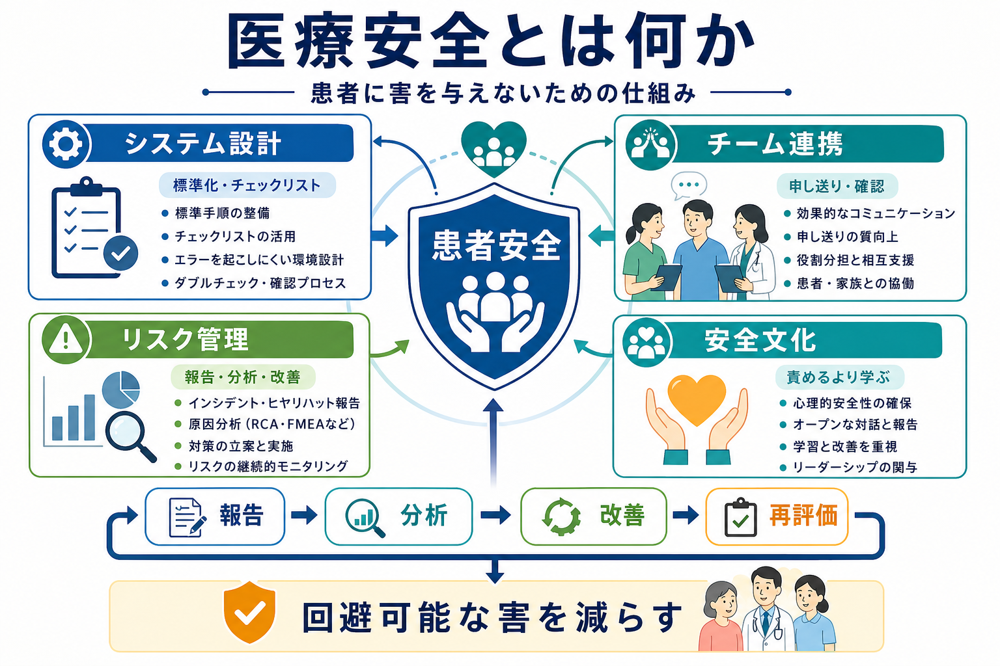
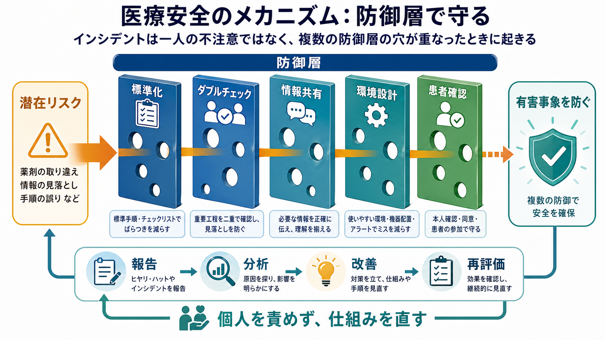
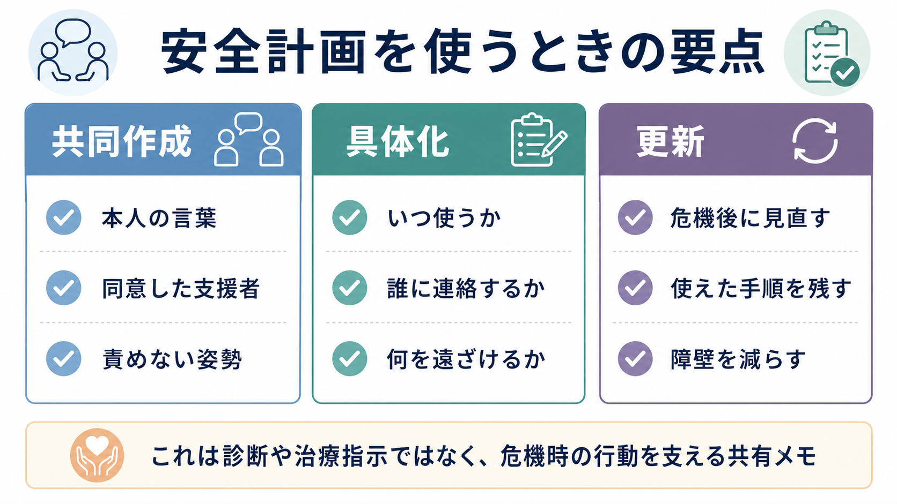

# 医療安全とは何か

## 要点

- 医療安全とは、患者に生じうる回避可能な害を減らすために、個人の注意だけでなく、業務設計、チーム連携、学習する組織文化を整える実践である。
- エラーは「不注意な個人」の問題に還元せず、標準化、確認、情報共有、環境設計、患者参加など複数の防御層で扱う。
- インシデント報告、RCA、FMEA、安全指標、チームトレーニングは、事故後の処罰ではなく、次の害を防ぐための学習装置である。
- 医療安全は臨床現場の手順だけでなく、[[認知バイアスとは何か]]、[[リスク下の意思決定はどのように行われるのか]]、[[薬物療法のリスクベネフィットをどう考えるか]]とも接続する。

## この記事で答える問い

- 医療安全は、単なる「ミスをしない努力」と何が違うのか。
- なぜ医療安全では、個人の責任追及よりもシステム設計を重視するのか。
- 現場では、報告、分析、チーム連携、標準化をどのようにつなげるのか。
- 研究や教育では、医療安全をどのように評価し改善するのか。

## まず結論

医療安全とは、患者に害が届く前にリスクを検出し、害が起きても再発を防げるように、医療を「学習するシステム」として設計することである。WHO は患者安全を、医療に伴う回避可能な害をなくし、不必要な害のリスクを許容可能な最小限に下げる枠組みとして位置づけている [1]。この発想では、医師、看護師、薬剤師、心理職、リハビリ職、事務職、患者・家族が、互いに情報を補完しながら安全を作る。

重要なのは、医療安全が「もっと注意する」だけでは成立しない点である。医療は情報量が多く、時間制約が強く、患者状態も変化するため、どれほど熟練した専門職でも見落としや判断の偏りを完全には避けられない。だからこそ、チェックリスト、標準手順、ダブルチェック、明確な申し送り、アラート設計、インシデント報告などを組み合わせ、個人の弱さを前提にして安全を確保する [2][3]。

## 背景

近代的な医療安全の転機としてしばしば参照されるのが、米国 Institute of Medicine の報告書 *To Err is Human* である。この報告は、医療事故を個人の道徳的失敗ではなく、複雑な医療システムの設計不全として捉え、安全文化、報告制度、標準化、リーダーシップの必要性を広く認識させた [2]。

その後、医療安全は「事故が起きた後に原因を探す」活動から、「普段から安全を測り、危険の兆候を早く拾い、現場で改善を回す」活動へ広がってきた。WHO の Global Patient Safety Action Plan 2021-2030 も、政策、組織、患者・家族参加、医療者教育、データ、研究を含む多層的な安全戦略を求めている [1]。日本でも、厚生労働省の医療安全対策や、日本医療機能評価機構の医療事故情報収集等事業を通じて、個別事例から全国的な注意喚起と学習につなげる仕組みが整えられてきた [7][8]。

## 基本概念

### 患者安全

患者安全は、医療の過程で生じる不必要な害を減らす実践である。ここでいう害には、薬剤の取り違え、転倒、感染、診断の遅れ、情報伝達の断絶、過鎮静、拘束や隔離に伴う二次的害などが含まれる。精神科や心理臨床でも、希死念慮、暴力リスク、薬物相互作用、同意能力、プライバシー、トラウマ反応などを含む広い安全配慮が必要になる。

### インシデントと有害事象

インシデントは、患者に害が届いたかどうかにかかわらず、安全を脅かした出来事や状況を指す。ヒヤリ・ハットは、害に至らなかったが、同じ条件が重なれば事故になりえた出来事である。有害事象は、実際に患者に害が生じた出来事であり、その一部は予防可能である。医療安全では、ヒヤリ・ハットを「失敗未遂」ではなく、システムの弱点を早期に教えてくれる情報として扱う。

### 安全文化

安全文化とは、問題を隠すよりも共有し、個人を責めるよりも仕組みを改善し、役職にかかわらず危険を発言できる組織の規範である。これは責任を曖昧にすることではない。むしろ、誰が何を改善するのかを明確にしつつ、故意の違反、危険な逸脱、通常の人間的エラーを区別して扱う姿勢である [3]。

## 仕組み

### 1. システム設計

医療安全の中心は、注意力に依存しすぎない業務設計である。薬剤名の類似、画面表示の見にくさ、騒音、頻繁な中断、曖昧な指示、複数部署をまたぐ情報断絶は、エラーを誘発する。したがって、標準化された手順、読み返し、チェックリスト、ラベル設計、物品配置、電子カルテのアラート、権限設計を通じて、危険な選択が起こりにくい環境を作る。

### 2. チーム連携

医療はチームで行われるため、安全はコミュニケーションの質に依存する。AHRQ の TeamSTEPPS は、チーム構造、コミュニケーション、リーダーシップ、状況モニタリング、相互支援を患者安全の中核スキルとして整理している [4]。申し送り、復唱、SBAR、ハドル、ブリーフィング、デブリーフィングは、単なる会議技法ではなく、メンバー間の状況認識をそろえる安全装置である。

### 3. リスク管理

リスク管理では、起きた事例から学ぶ後ろ向きの分析と、起きる前に危険を予測する前向きの分析を組み合わせる。RCA は重大なインシデント後に、表面的な「誰がミスしたか」ではなく、作業条件、情報、訓練、環境、管理体制などの根本要因を探る方法である [5]。FMEA は、手順のどこで故障が起きうるかを事前に洗い出し、影響の大きさや発生しやすさから対策を優先する。

### 4. 報告と学習

報告制度は、事故件数を増やすためではなく、見えにくいリスクを組織が学習するためにある。報告が増えたから危険になったとは限らない。むしろ、軽微なインシデントが報告される組織では、重大事故になる前に対策できる余地が広がる。日本医療機能評価機構の医療事故情報収集等事業も、個別事例を匿名化・集約し、医療安全情報として再発防止に役立てる枠組みである [8]。

## 図解

医療安全は、単一の対策ではなく、複数の防御層と改善サイクルで理解するとわかりやすい。

| 層 | 例 | 目的 |
|---|---|---|
| 予防 | 標準手順、チェックリスト、教育、環境整備 | エラーを起こりにくくする |
| 検出 | ダブルチェック、モニタリング、患者確認、アラート | エラーが害になる前に気づく |
| 緩和 | 早期対応、エスカレーション、救急対応、説明と支援 | 害の拡大を防ぐ |
| 学習 | 報告、RCA、FMEA、監査、指標レビュー | 次の事故を減らす |

## 臨床・研究との接続

臨床では、医療安全は日々の小さな作業に埋め込まれる。例えば薬物療法では、適応、用量、併用、腎機能、年齢、妊娠・授乳、服薬理解、副作用モニタリングを一連の安全プロセスとして扱う必要がある。これは [[薬物相互作用とは何か]] や [[多剤併用をどう減らすか]] の問題とも直結する。

精神科医療では、リスク評価が診断名だけで決まるわけではない。希死念慮、衝動性、物質使用、孤立、治療同盟、保護因子、利用可能な支援を統合し、状態変化に応じて再評価する。ここでは [[リスク下の意思決定はどのように行われるのか]] や [[認知バイアスとは何か]] の知識が、見落としや過信を減らす助けになる。

研究では、安全を「事故件数」だけで測ると不十分である。Vincent らは、安全を、過去の害、システムの信頼性、感度、予測と準備、統合と学習という複数の視点から測る必要があると論じている [6]。したがって、転倒率や薬剤エラー率だけでなく、報告の質、手順遵守、スタッフの心理的安全性、患者経験、改善後の持続性も評価対象になる。

## よくある誤解

### 「医療安全は個人の注意力の問題である」

注意力は重要だが、それだけでは不十分である。疲労、中断、複雑な情報、時間圧、権威勾配があると、誰でもエラーを起こしうる。医療安全は、人間が間違えることを前提に、間違いが患者の害に直結しない設計を作る。

### 「報告が多い部署は危険である」

報告件数だけでは危険度は判断できない。報告しやすい文化がある部署ほど、軽微な事例が見える化されることがある。重要なのは、重大度、再発性、対策の実施率、改善後の指標をあわせて見ることである。

### 「標準化すればすべて解決する」

標準化は有効だが、患者の個別性を無視すると別のリスクが生じる。標準手順は、例外を見つけるための基準でもある。現場では「標準から外れる理由」を明確にし、記録し、チームで共有する必要がある。

### 「事故分析は誰かの責任を決める作業である」

事故分析の主目的は、再発防止である。もちろん説明責任は必要だが、個人名の特定だけで終わる分析は、同じ条件で別の人が同じ失敗をする可能性を残す。RCA や FMEA は、責任追及ではなく、条件と仕組みを改善するために使う。

## 関連ノート

- [[薬物療法のリスクベネフィットをどう考えるか]]
- [[薬物相互作用とは何か]]
- [[多剤併用をどう減らすか]]
- [[高齢者の薬物療法では何に注意するか]]
- [[認知バイアスとは何か]]
- [[リスク下の意思決定はどのように行われるのか]]
- [[せん妄とは何か]]

## 理解チェック

1. 医療安全が「個人の注意」だけでなく「システム設計」を重視する理由を説明できるか。
2. インシデント、ヒヤリ・ハット、有害事象の違いを説明できるか。
3. RCA と FMEA の違いを、事故後の分析と事前の予測という観点から説明できるか。
4. 報告件数が増えたとき、それを単純に「安全性の悪化」と解釈できない理由を説明できるか。
5. 自分の臨床・研究領域で、標準化、確認、情報共有、患者参加のどれを改善できるかを一つ挙げられるか。

## MOC更新候補

- `content/00_MOC/` 配下に臨床実践・医療安全系 MOC がある場合、バッチ統合時に本記事へのリンク追加を検討する。
- 並列生成ジョブとの衝突を避けるため、本タスクでは MOC 本体は更新しない。

## 未解決問題

- 安全文化を高める介入が、長期的に有害事象をどの程度減らすかは、施設、診療科、測定指標によって差が大きい。
- AI、電子カルテアラート、臨床意思決定支援は安全を高めうる一方で、アラート疲れ、過信、責任分界の曖昧さを生む可能性がある。
- 患者参加は重要だが、患者に過剰な監視責任を負わせない設計が必要である。

## 参考文献

[1] World Health Organization. (2021). *Global Patient Safety Action Plan 2021-2030: Towards eliminating avoidable harm in health care*. https://www.who.int/publications/i/item/9789240032705

[2] Institute of Medicine. (2000). *To Err Is Human: Building a Safer Health System*. National Academies Press. https://nap.nationalacademies.org/catalog/9728/to-err-is-human-building-a-safer-health-system

[3] Reason, J. (2000). Human error: models and management. *BMJ, 320*(7237), 768-770. https://doi.org/10.1136/bmj.320.7237.768

[4] Agency for Healthcare Research and Quality. TeamSTEPPS. https://www.ahrq.gov/teamstepps/index.html

[5] AHRQ Patient Safety Network. Root Cause Analysis. https://psnet.ahrq.gov/primer/root-cause-analysis

[6] Vincent, C., Burnett, S., & Carthey, J. (2014). The measurement and monitoring of safety. *BMJ Quality & Safety, 23*(8), 670-677. https://doi.org/10.1136/bmjqs-2013-002757

[7] 厚生労働省. 医療安全対策. https://www.mhlw.go.jp/stf/seisakunitsuite/bunya/kenkou_iryou/iryou/i-anzen/

[8] 日本医療機能評価機構. 医療事故情報収集等事業. https://www.med-safe.jp/
