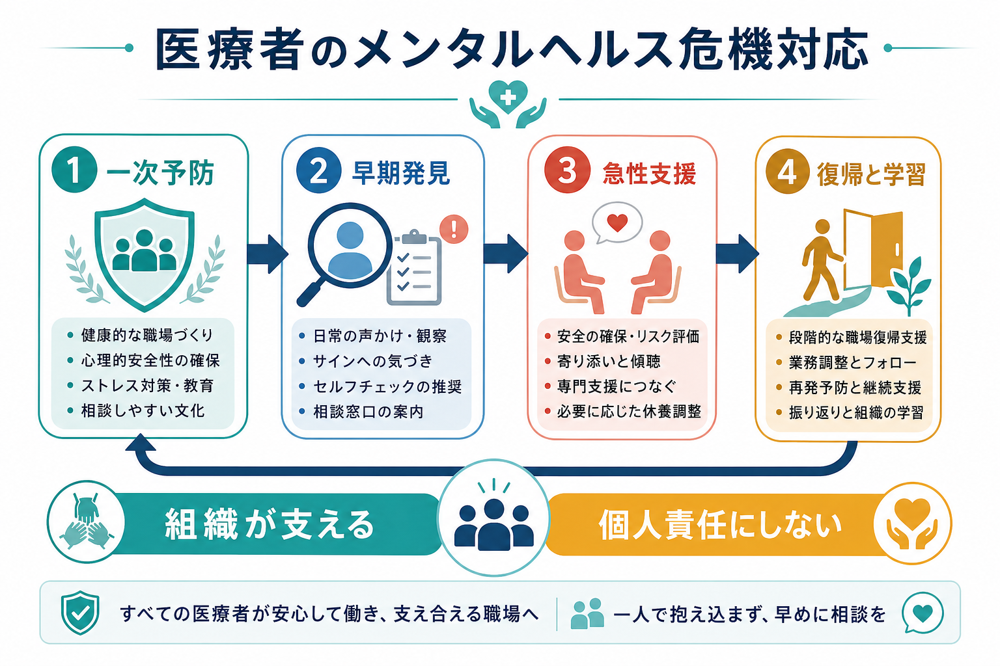
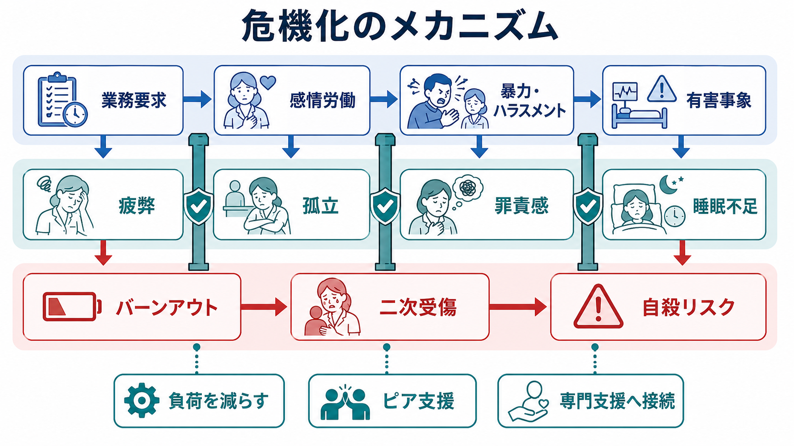
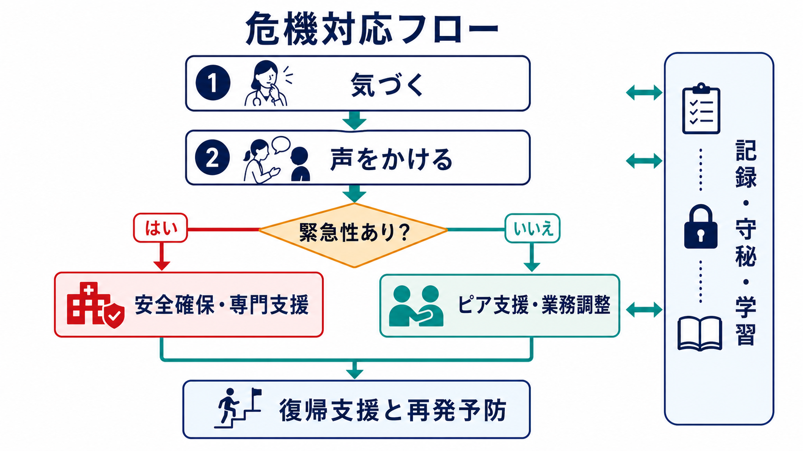

# 医療者のメンタルヘルス危機対応とは何か

## 要点

- 医療者のメンタルヘルス危機対応とは、バーンアウト、二次受傷、抑うつ、不安、物質使用、自殺リスクを、個人の忍耐やセルフケアだけに委ねず、職場システムとして予防・発見・支援・復帰を設計することである。
- 有害事象、患者・家族からの暴力やハラスメント、過重労働、道徳的苦痛、孤立は、医療者の心理的危機を強める。対応は「相談してください」と掲示するだけでは不十分で、相談しやすい文化、業務調整、ピア支援、専門支援への接続を組み合わせる必要がある[1][2]。
- 自殺リスクが疑われる場合は、守秘と尊厳を保ちながらも、本人を一人にしない、緊急支援へつなぐ、勤務から一時的に離す、職場復帰を段階化するという安全確保が優先される[3][7]。

## この記事で答える問い

- 医療者のバーンアウト、二次受傷、自殺リスクは、どのように危機化するのか。
- 医療機関は、個人面談や研修だけでなく、どのような組織的支援を持つべきか。
- [[医療安全とは何か]]、[[インシデントレポートとは何か]]、[[ルートコーズ分析とは何か]]と、医療者支援はどのように接続するのか。

## まず結論

医療者のメンタルヘルス危機対応は、患者安全の一部である。疲弊した医療者を「もっと強くする」ことではなく、疲弊を生む業務条件、沈黙を生む文化、支援につながるまでの障壁を減らすことが中心になる。全米アカデミーズの臨床家バーンアウト報告書は、バーンアウトを個人の回復力不足ではなく、医療の構造・組織・文化の問題として扱うシステムアプローチを強調している[1]。WHO の職場メンタルヘルス指針も、組織介入、管理職教育、労働者教育、個別支援、復職支援を組み合わせることを求めている[2]。

したがって、実務上の骨格は次の4層で考えるとよい。第一に、過重労働、暴力、ハラスメント、電子カルテ負荷、休憩不能などの一次予防。第二に、欠勤、睡眠不足、怒りっぽさ、ミス増加、孤立、泣きやすさ、希死念慮の示唆などの早期発見。第三に、緊急性がある場合の安全確保と専門支援への接続。第四に、復帰支援、業務調整、再発予防、組織学習である。

## 背景

医療者は、生命に関わる判断、時間的圧力、感情労働、患者・家族の苦痛への反復曝露、夜勤、訴訟不安、組織内の階層性にさらされる。CDC/NIOSH の Impact Wellbeing は、医療者のウェルビーイング改善を病院運営の課題として位置づけ、セルフケアの呼びかけを超えて、業務政策、支援希求の障壁、信頼形成を変えることを推奨している[3]。

この視点は、[[精神科病棟の安全文化とは何か]]や[[多職種カンファレンスでリスクをどう共有するか]]ともつながる。医療者が疲弊や不安を隠さざるを得ない職場では、患者安全上の懸念も報告されにくい。逆に、心理的安全性がある職場では、体調不良、判断迷い、インシデント後の苦痛を早く共有できる。

## 基本概念

### バーンアウト

バーンアウトは、慢性的な職場ストレスに関連する情緒的消耗、脱人格化・冷笑、達成感低下として扱われることが多い。医療者では、長時間労働だけでなく、裁量の乏しさ、記録業務の過多、価値に反する業務、サポート不足が関与する。医師バーンアウト介入のシステマティックレビューでは、個人向け介入だけでなく、勤務条件や組織プロセスに働きかける介入が重要であることが示されている[4]。

### 二次受傷と「第二の被害者」

二次受傷は、患者の苦痛、外傷体験、有害事象、死亡、暴力場面などに関わることで、支援者側に侵入的想起、罪責感、過覚醒、回避、無力感が生じる状態を指す。医療安全の文脈では、有害事象に関与した医療者が強い心理的苦痛を受ける「第二の被害者」現象が知られている。AHRQ の CANDOR Toolkit は、有害事象対応に患者・家族への説明、調査、解決だけでなく、Care for the Caregiver、すなわち医療者支援を組み込んでいる[5]。

### 自殺リスク

医療者の自殺リスクは、職業的アクセス、孤立、スティグマ、資格・評価への不安、過労、うつ病、物質使用、ハラスメントなどが絡む。BMJ の2024年メタ分析は、20か国の研究を統合し、医師の自殺率を一般人口と比較して検討している。結果の異質性は大きいが、特に女性医師では一般人口より高いリスクが示され、継続的な予防策の必要性が示唆されている[7]。

## 仕組み

医療者の危機化は、単一の出来事だけで起きるとは限らない。多くは、業務要求、感情労働、睡眠不足、暴力・ハラスメント、有害事象、相談困難が重なり、疲弊、孤立、罪責感へ進む。ここに「迷惑をかけられない」「評価に響く」「専門職なのだから自分で対処すべきだ」という規範が加わると、支援希求が遅れる。

組織的対応では、次のように危機化の経路を途中で切る。

| 段階 | 主要なリスク | 組織的支援 |
|---|---|---|
| 一次予防 | 過重労働、休憩不能、暴力、ハラスメント | 人員配置、休憩確保、暴力対応、管理職教育、相談窓口の明示 |
| 早期発見 | 欠勤、睡眠不足、ミス増加、孤立、表情変化 | 声かけ、定期面談、ピアサポート、匿名相談、勤務調整 |
| 急性支援 | 希死念慮、重大インシデント後の混乱、強い罪責感 | 安全確保、専門支援、産業保健、勤務からの一時離脱、家族等との連携 |
| 復帰支援 | 再燃、過剰な責任追及、チーム内の沈黙 | 段階的復帰、業務再設計、振り返り、再発予防、組織学習 |

## 図解

危機対応は、本人の話を聞くだけで終わらない。緊急性の判断、専門支援への接続、業務調整、復帰後のフォローまでを一続きのフローとして持つ必要がある。

このフローは、[[自殺リスクへの危機対応とは何か]]や[[安全計画とは何か]]と似ているが、対象が医療者である点に固有の難しさがある。本人が医療知識を持つため、援助を受けることへの恥や資格上の不利益への恐れが強くなりうる。また、同僚や上司が「よく知っている相手」を評価しなければならず、守秘と安全確保の線引きが難しくなる。

## 臨床・研究との接続

### ピア支援は「雑談」ではなく制度である

ピア支援は、同僚同士の自然な声かけを制度化したものである。AHRQ の Care for the Caregiver guide は、所属部署での支援、訓練されたピアサポーター、専門職への迅速な紹介という階層的支援を示している[5]。Johns Hopkins Hospital の RISE プログラムは、訓練されたピアレスポンダーによる第二の被害者支援を実装し、認知度向上やグループ支援の必要性も含めて報告している[6]。

重要なのは、ピア支援を「親切な個人」に依存させないことである。受付経路、守秘の範囲、緊急時のエスカレーション、記録の扱い、支援者自身のスーパービジョンを決めておく。

### 組織学習と責任追及を分ける

重大な有害事象の後には、患者・家族への説明、事実確認、[[ルートコーズ分析とは何か]]、再発防止が必要になる。しかし、医療者の心理的支援が「調査の前処理」や「責任追及を円滑にする手段」になると、支援への信頼は失われる。CANDOR の考え方では、患者・家族への誠実な対応と、関与した医療者への支援を同時に行う[5]。

### 反省会とデブリーフィングは慎重に使う

危機後の振り返りは有用だが、直後に詳細な感情表出を強制する一律のデブリーフィングは逆効果になりうる。実務では、まず安全・睡眠・食事・休息・相談先を整え、その後に本人の同意と状態に応じて、チーム学習と個別支援を分けて行う。Schwartz Rounds のレビューでは、医療者が感情的・社会的課題を共有する場の価値が示唆される一方、研究デザインの限界も指摘されている[8]。

## よくある誤解

### 「医療者なのだから自分で対処できる」

専門知識は保護因子にもなるが、援助希求の遅れにもなる。医療者は、症状を隠す、自己診断する、同僚に迷惑をかけないよう過剰に働く、資格や評価への影響を恐れて相談を避けることがある。組織は、相談の心理的・制度的コストを下げる必要がある。

### 「バーンアウト対策はマインドフルネス研修で足りる」

個人向け介入は役立つことがあるが、それだけでは過重労働、休憩不能、暴力、ハラスメント、記録負荷を変えられない。WHO、CDC/NIOSH、全米アカデミーズはいずれも、組織レベルの介入を重視している[1][2][3]。

### 「インシデント後は、まず原因究明を徹底すればよい」

原因究明は必要だが、関与した医療者の心理的安全と支援を後回しにすると、沈黙、防衛、離職、再外傷化を招く。[[インシデントレポートとは何か]]は罰の道具ではなく学習の入り口であり、医療者支援とセットで設計されるべきである。

## 関連ノート

- [[医療安全とは何か]]
- [[精神科医療安全の特徴は何か]]
- [[精神科病棟の安全文化とは何か]]
- [[インシデントレポートとは何か]]
- [[ルートコーズ分析とは何か]]
- [[多職種カンファレンスでリスクをどう共有するか]]
- [[患者からのハラスメントにどう対応するか]]
- [[守秘義務と安全確保はどう両立するか]]
- [[安全計画とは何か]]
- [[自殺リスクへの危機対応とは何か]]

## MOC更新候補

- `content/00_MOC/` 配下の医療安全・危機対応系 MOC がある場合、本記事を「医療者支援」「安全文化」「有害事象後対応」の節に追加する。
- 並列ジョブとの競合を避けるため、この作業では MOC ファイル本体は更新していない。

## 理解チェック

1. 医療者のバーンアウト対策を、個人のセルフケアだけに限定すると何が見落とされるか。
2. 有害事象後の医療者支援と、患者・家族への説明・調査はどのように両立できるか。
3. ピア支援を制度として運用する場合、守秘、緊急時対応、専門支援への接続をどのように決めるべきか。
4. 自殺リスクが疑われる医療者への対応で、職場が「評価」より先に確保すべきものは何か。

## 未解決問題

- 日本の医療機関におけるピア支援・第二の被害者支援プログラムの実装研究は、職種、施設規模、法的文化の違いを踏まえた蓄積が必要である。
- 医療者の自殺予防では、個人の危険因子だけでなく、資格申請、勤務評価、懲戒・訴訟不安、ハラスメント対策が援助希求に与える影響を検討する必要がある。
- 支援記録を、守秘、医療安全、労務管理、法的リスクの間でどのように扱うかは、各施設で事前に合意しておくべき実務課題である。

## 参考文献

[1] National Academies of Sciences, Engineering, and Medicine. (2019). *Taking Action Against Clinician Burnout: A Systems Approach to Professional Well-Being*. The National Academies Press. https://doi.org/10.17226/25521

[2] World Health Organization. (2022). *WHO guidelines on mental health at work*. https://www.who.int/publications/i/item/9789240053052

[3] CDC/NIOSH. (2024). *Impact Wellbeing Guide: Taking Action to Improve Healthcare Worker Wellbeing*. https://www.cdc.gov/niosh/healthcare/impactwellbeingguide/index.html

[4] West, C. P., Dyrbye, L. N., Erwin, P. J., & Shanafelt, T. D. (2016). Interventions to prevent and reduce physician burnout: a systematic review and meta-analysis. *The Lancet, 388*(10057), 2272-2281. https://doi.org/10.1016/S0140-6736(16)31279-X

[5] Agency for Healthcare Research and Quality. (2016/2022). *Communication and Optimal Resolution (CANDOR) Toolkit: Care for the Caregiver Program Implementation Guide*. https://www.ahrq.gov/patient-safety/settings/hospital/candor/modules/guide6.html

[6] Edrees, H., Connors, C., Paine, L., Norvell, M., Taylor, H., & Wu, A. W. (2016). Implementing the RISE second victim support programme at the Johns Hopkins Hospital: a case study. *BMJ Open, 6*(9), e011708. https://doi.org/10.1136/bmjopen-2016-011708

[7] Zimmermann, C., Strohmaier, S., Herkner, H., Niederkrotenthaler, T., & Schernhammer, E. (2024). Suicide rates among physicians compared with the general population in studies from 20 countries: gender stratified systematic review and meta-analysis. *The BMJ, 386*, e078964. https://doi.org/10.1136/bmj-2023-078964

[8] Taylor, C., Xyrichis, A., Leamy, M. C., Reynolds, E., & Maben, J. (2018). Can Schwartz Center Rounds support healthcare staff with emotional challenges at work, and how do they compare with other interventions aimed at providing similar support? A systematic review and scoping review. *BMJ Open, 8*(10), e024254. https://doi.org/10.1136/bmjopen-2018-024254
