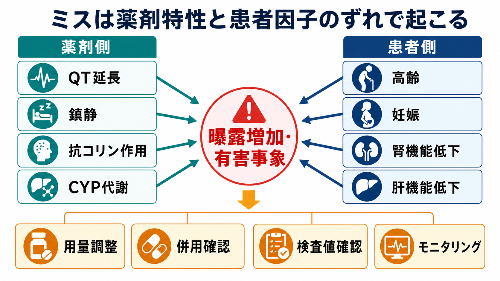
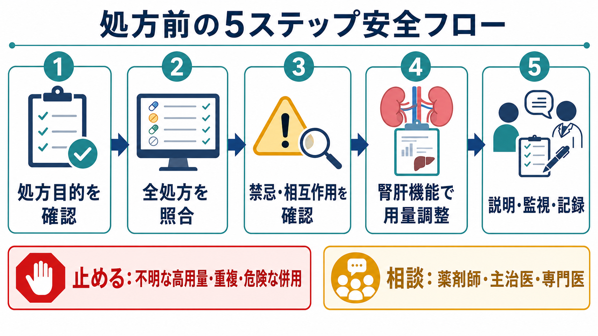

# 向精神薬の処方ミスを防ぐには何を確認するか

## 要点

- 向精神薬の処方ミスは、「薬を選ぶ瞬間」だけでなく、入退院、転科、頓用追加、検査値未確認、既存処方の見落とし、モニタリング不足で起こる。
- 処方前には、少なくとも **用量、相互作用、重複、禁忌、腎機能、肝機能** を同じ順番で確認する。
- 精神科では、鎮静、転倒、QT延長、抗コリン作用、離脱、セロトニン症候群、リチウム中毒、妊娠可能性などが処方安全の主要な焦点になる。
- チェックリストは判断を代替しない。疑義が残る処方は、薬剤師、主治医、専門医、検査担当者と確認してから進める。
- 本稿は教育・研究目的の整理であり、個別患者への診断や治療指示ではない。

## この記事で答える問い

1. 向精神薬の処方前に何を順番に確認すればよいか。
2. 用量、相互作用、重複、禁忌、腎肝機能はどのように処方ミスへつながるか。
3. 精神科薬物療法で見落としやすい高リスク場面は何か。
4. チームで処方安全を保つには、どこで止め、どこで相談するか。

## まず結論

向精神薬の処方ミスを防ぐ実務上の結論は、**「目的、患者、薬、検査値、既存処方、説明・監視」を一つの流れで確認すること**である。WHO は薬剤関連有害事象を世界的な患者安全課題と位置づけ、とくに高リスク状況、多剤併用、ケア移行期を重点領域としている[1][2][3]。精神科医療でも、処方ミスや有害薬物事象は入院精神科病棟で継続的に報告されており、処方、調剤、投与、モニタリングの全段階で対策が必要である[5]。

実際には、次の6点を毎回同じ順番で見る。

1. **用量**: 年齢、体重、既往、初回投与か継続か、最大量、増量速度を確認する。
2. **相互作用**: CYP阻害・誘導、QT延長薬、鎮静薬、セロトニン作動薬、リチウム濃度を上げる薬を確認する。
3. **重複**: 同効薬、同系統薬、頓用、院外処方、市販薬、サプリメントを含めて照合する。
4. **禁忌・注意**: 妊娠可能性、既往アレルギー、認知症、高齢、心疾患、てんかん、緑内障、尿閉などを確認する。
5. **腎機能**: eGFR、脱水、急性腎障害、リチウムや腎排泄薬の必要検査を確認する。
6. **肝機能**: 肝障害、肝代謝薬、バルプロ酸などで必要な血液検査や中止基準を確認する。

## 背景

向精神薬は、抗うつ薬、抗精神病薬、気分安定薬、睡眠薬、抗不安薬、精神刺激薬などを含む。これらは症状軽減や再発予防に大きな役割を持つ一方で、眠気、転倒、錐体外路症状、代謝異常、QT延長、せん妄、離脱、依存、中毒、胎児リスクなどを伴いうる。薬剤安全では、薬剤そのものの危険性だけでなく、患者因子、チーム体制、情報共有、検査値、ケア移行期が組み合わさって高リスク状況を作る[2]。

NICE の医薬品最適化ガイドラインは、薬物療法を「構造化された薬剤レビュー」と「薬剤照合」によって安全かつ有効にすることを重視している。薬剤レビューでは、本人や家族の理解、処方薬・市販薬・補完療法、薬の安全性と適切性、有害反応リスク、必要なモニタリングを確認する[4]。これは精神科薬物療法にもそのまま当てはまる。

## 基本概念

### 処方ミス

処方ミスは、薬剤名、用量、用法、頻度、投与経路、期間、禁忌、相互作用、重複、検査値、説明、モニタリングのどこかで、意図した安全な薬物療法から外れることである。NICE は薬剤関連患者安全インシデントに、処方エラー、投与エラー、モニタリングエラー、ニアミス、回避可能な有害事象を含めている[4]。

### 薬剤照合

薬剤照合とは、現在服用している薬を、処方薬、頓用、注射薬、貼付薬、市販薬、サプリメント、他院処方まで含めて確認し、今回の処方と矛盾しないかを照らし合わせる作業である。入院、退院、転科、外来紹介などの移行期は、薬剤不一致が起こりやすい[1][4]。

### 薬剤レビュー

薬剤レビューとは、薬を単に一覧化するだけではなく、目的、効果、副作用、本人の希望、服薬実態、検査値、減量・中止可能性を批判的に見直すことである。多剤併用では、薬の数そのものよりも「不要な薬、重複、害が利益を上回る薬」が問題になる[3][4]。

## 確認手順

### 1. 用量を確認する

用量確認では、まず「なぜこの薬をこの量で使うのか」を確認する。初回投与、再開、増量、頓用追加、退院時処方では、過去の処方をそのまま複写すると高用量や二重投与が残りやすい。高齢者、低体重、身体疾患、脱水、肝腎機能低下、併用薬がある場合は、通常量でも過量になることがある。

実務では次を確認する。

| 確認項目 | 見るポイント |
|---|---|
| 目的 | 急性期鎮静、維持療法、不眠、不安、うつ、躁、幻覚妄想、離脱予防のどれか |
| 開始か継続か | 初回量、再開量、前回中止理由、過去の副作用 |
| 最大量 | 添付文書、院内基準、年齢・肝腎機能による上限 |
| 増量速度 | 眠気、血圧低下、アカシジア、躁転、離脱との関係 |
| 頓用 | 定期薬との合計量、使用回数、翌日の残存効果 |

### 2. 相互作用を確認する

向精神薬では、相互作用は大きく **薬物動態** と **薬力学** に分けて見る。薬物動態では、CYP2D6、CYP2C19、CYP3A4 などの阻害・誘導により血中濃度が変わる。薬力学では、QT延長、鎮静、呼吸抑制、抗コリン作用、セロトニン作用、血圧低下、けいれん閾値低下が重なる。

FDA のシタロプラム安全情報は、QT延長リスクを例示するよい教材である。シタロプラムでは用量依存的なQT延長が問題になり、60歳超、肝障害、CYP2C19 poor metabolizer、CYP2C19阻害薬併用などでは最大推奨量が低く設定される。また、低カリウム血症、低マグネシウム血症、他のQT延長薬併用では ECG や電解質確認が重要になる[7]。

### 3. 重複を確認する

重複は、同じ薬剤名の重複だけではない。たとえば、睡眠薬と抗不安薬、抗精神病薬の定期薬と頓用、SSRI と SNRI、抗コリン作用を持つ複数薬、鎮静性抗うつ薬と抗ヒスタミン薬など、**作用の重複**も問題になる。高齢者では、AGS Beers Criteria がベンゾジアゼピン系薬、Z薬、強い抗コリン薬、抗精神病薬の慎重使用や回避場面を整理している[6]。

重複確認では、電子カルテの処方欄だけでなく、退院時処方、紹介状、持参薬、家族管理薬、訪問看護記録、薬局情報を見る。これは [[精神科医療安全の特徴は何か]] で扱う「情報が分散しやすい」精神科医療安全の問題と直結する。

### 4. 禁忌・注意を確認する

禁忌確認では、薬剤禁忌だけでなく、患者の状態との不一致を見る。妊娠可能性、授乳、認知症、高齢、心疾患、QT延長、低ナトリウム血症、てんかん、緑内障、前立腺肥大、尿閉、薬疹歴、悪性症候群歴、自殺リスク、物質使用、過量服薬リスクを確認する。

バルプロ酸、リチウム、クロザピン、抗精神病薬、ベンゾジアゼピン系薬は、単に「効くか」ではなく、使ってよい条件、検査、説明、代替薬、緊急時対応を含めて確認する。NICE の双極性障害ガイドラインでは、リチウム開始・継続時の血中濃度、腎機能、甲状腺機能、カルシウム、神経毒性症状のモニタリングが具体的に示されている[8]。

### 5. 腎機能を確認する

腎機能確認では、eGFR だけでなく、急性変化、脱水、下痢、発熱、NSAIDs、ACE阻害薬、ARB、利尿薬、造影検査、食事・水分摂取の変化を確認する。リチウムは代表的な高リスク薬であり、腎機能低下や脱水、相互作用で血中濃度が上がりやすい。リチウムでは血中濃度だけを見ればよいのではなく、症状、腎機能、甲状腺機能、カルシウム、併用薬、服薬実態を合わせて見る必要がある[8]。

処方前に次のどれかがあれば、処方を止めて確認する。

- 直近の eGFR が不明、または急に低下している。
- 下痢、嘔吐、発熱、脱水、食事摂取低下がある。
- NSAIDs、ACE阻害薬、ARB、利尿薬が追加・増量されている。
- ふらつき、振戦、失調、意識変容、構音障害など中毒を疑う症状がある。

### 6. 肝機能を確認する

肝機能確認では、AST、ALT、ビリルビン、アルブミン、凝固能、肝硬変、アルコール使用、ウイルス性肝炎、脂肪肝、併用薬を確認する。肝代謝薬では血中濃度上昇や鎮静、ふらつき、QT延長、せん妄が起こりやすくなる。バルプロ酸、カルバマゼピン、一部の抗精神病薬、抗うつ薬では、肝機能や血液検査のモニタリングが重要になる。

## 仕組み

処方ミスは、薬剤側の性質と患者側の状態がずれたときに起こる。たとえば、QT延長作用を持つ薬を、低カリウム血症、徐脈、心疾患、他のQT延長薬併用がある人に使うと、不整脈リスクが上がる。強い鎮静作用を持つ薬を、高齢、睡眠時無呼吸、転倒歴、アルコール使用がある人に重ねると、転倒や呼吸抑制が起こりやすい。腎排泄薬を腎機能低下や脱水のある人に通常量で使うと、曝露が増えて中毒につながる。

重要なのは、ミスを「個人の注意不足」とだけ見ないことである。WHO は高リスク状況を、薬剤、患者・提供者因子、システム因子が組み合わさって生じるものとして整理している[2]。したがって、処方安全は、個人の記憶力よりも、薬剤照合、検査値表示、アラート設計、薬剤師レビュー、チーム内確認、患者説明、モニタリング計画で支える必要がある。

## 図解

図の流れは、次のように読める。

1. **処方目的を確認**する。症状、診断仮説、緊急性、代替手段、本人の意向を確認する。
2. **全処方を照合**する。定期薬、頓用、他院薬、市販薬、サプリメントを含める。
3. **禁忌・相互作用を確認**する。薬剤名だけでなく、作用の重なりを見る。
4. **腎肝機能で用量調整**する。検査値がない場合は、処方を止めて確認する。
5. **説明・監視・記録**を行う。何を見て、いつ再評価し、どの症状で連絡するかを共有する。

## 臨床・研究との接続

臨床では、処方安全を「処方時点」だけでなく、入院時、退院時、転科時、外来再診時、急変時、薬剤変更時に組み込む。NICE は薬剤レビューで、本人や家族の理解、すべての薬、薬の安全性、リスク因子、必要なモニタリングを確認するよう勧めている[4]。これは、精神科で多い「眠れないので頓用を追加」「焦燥が強いので抗精神病薬を追加」「退院時に外来薬へ戻す」といった場面で特に重要である。

研究上は、電子カルテアラート、薬剤師介入、処方監査、薬剤照合、薬剤レビュー、患者参加型ツールのどれが、どのリスクを下げるかを分けて評価する必要がある。精神科病院の薬剤エラーに関する系統的レビューは、この領域のデータがまだ限られ、エラーの定義や測定方法がばらつくことも示している[5]。したがって、院内でのインシデント報告だけでなく、ニアミス、薬剤師照会、検査値未確認、退院後の再処方修正も学習材料にする。

## よくある誤解

### 誤解1: 電子カルテのアラートが出なければ安全である

アラートは有用だが、すべての禁忌、重複、検査値変化、本人の服薬実態を拾えるわけではない。とくに市販薬、他院処方、頓用、サプリメント、最近の脱水や発熱は、人が聞き取って確認する必要がある。

### 誤解2: 低用量なら相互作用は問題にならない

低用量でも、高齢、肝腎機能低下、CYP阻害薬併用、同じ副作用を持つ薬の重複があると有害事象は起こりうる。安全確認は「量」だけではなく、曝露、感受性、併用、モニタリングの組み合わせで行う。

### 誤解3: 長く飲んでいる薬は確認しなくてよい

長期処方ほど、年齢、腎機能、肝機能、併存疾患、生活環境、併用薬が変化している可能性がある。リチウム、ベンゾジアゼピン系薬、抗コリン作用を持つ薬、抗精神病薬では、長期使用そのものが再評価の理由になる[6][8]。

### 誤解4: 処方ミスは処方医だけの問題である

処方医の責任は大きいが、薬剤安全はチームで支える。薬剤師、看護師、心理職、家族、本人、地域支援者が持つ情報が、重複、飲み間違い、過量服薬、離脱、転倒、せん妄の予防に役立つ。これは [[安全計画とは何か]] や [[自殺リスクへの危機対応とは何か]] で扱う危機時の共有計画とも接続する。

## 関連ノート

- [[精神科医療安全の特徴は何か]]
- [[安全計画とは何か]]
- [[自殺リスクへの危機対応とは何か]]

### 関連ノート候補

- 向精神薬の薬剤照合とは何か
- 精神科薬物療法におけるQT延長リスクとは何か
- リチウム中毒を防ぐには何を確認するか
- ベンゾジアゼピン系薬の処方安全とは何か
- 高齢者の向精神薬処方で何に注意するか
- セロトニン症候群とは何か

### MOC更新候補

- `content/00_MOC/` 配下の臨床実践、精神科医療安全、薬物療法関連 MOC に、バッチ統合時に `[[向精神薬の処方ミスを防ぐには何を確認するか]]` を追加する。

## 理解チェック

1. 新しく睡眠薬を追加する前に、定期薬と頓用のどこを確認するか。
2. SSRI を増量する前に、QT延長、CYP相互作用、セロトニン作動薬の併用をどう確認するか。
3. リチウム内服中に発熱、下痢、NSAIDs追加があった場合、何を止めて誰に確認するか。
4. 高齢者にベンゾジアゼピン系薬を継続する場合、転倒、認知、せん妄、依存、減量可能性をどう評価するか。
5. 退院時処方で、入院前薬、入院中追加薬、頓用、外来処方の重複をどう防ぐか。

## 参考文献

[1] World Health Organization. (2017). *Medication Without Harm: Global Patient Safety Challenge*. https://www.who.int/initiatives/medication-without-harm

[2] World Health Organization. (2019). *Medication safety in high-risk situations*. https://www.who.int/publications-detail-redirect/medication-safety-in-high-risk-situations

[3] World Health Organization. (2019). *Medication safety in polypharmacy: technical report*. https://www.who.int/publications/i/item/WHO-UHC-SDS-2019.11

[4] National Institute for Health and Care Excellence. (2015). *Medicines optimisation: the safe and effective use of medicines to enable the best possible outcomes* (NICE guideline NG5). https://www.nice.org.uk/guidance/ng5

[5] Alshehri, G. H., Keers, R. N., & Ashcroft, D. M. (2017). Frequency and nature of medication errors and adverse drug events in mental health hospitals: A systematic review. *Drug Safety, 40*(10), 871-886. https://doi.org/10.1007/s40264-017-0557-7

[6] American Geriatrics Society Beers Criteria Update Expert Panel. (2023). American Geriatrics Society 2023 updated AGS Beers Criteria for potentially inappropriate medication use in older adults. *Journal of the American Geriatrics Society, 71*(7), 2052-2081. https://doi.org/10.1111/jgs.18372

[7] U.S. Food and Drug Administration. (2012). *Clarification of dosing and warning recommendations for Celexa*. https://www.fda.gov/drugs/special-features/clarification-dosing-and-warning-recommendations-celexa

[8] National Institute for Health and Care Excellence. (2025). *Bipolar disorder: assessment and management* (NICE guideline CG185). https://www.ncbi.nlm.nih.gov/books/NBK547001/
