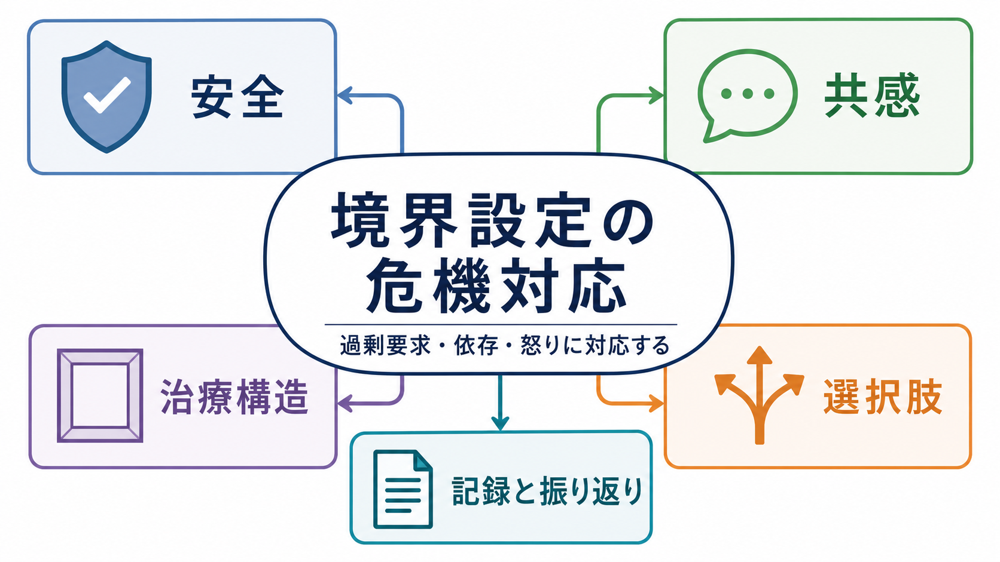
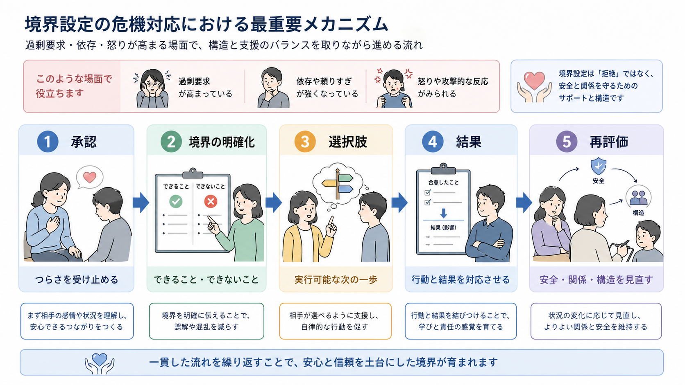
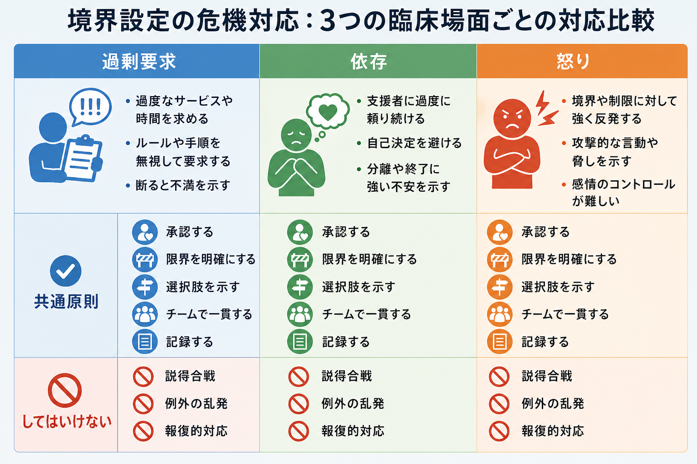

# 境界設定の危機対応とは何か

## 要点

- 境界設定の危機対応とは、過剰要求・依存・怒りが高まった場面で、本人を見捨てず、同時に時間・役割・連絡手段・安全上の限界を明確にして、[[心理療法における治療同盟とは何か]]と治療構造を守る対応である。
- 境界は「拒絶」ではなく、予測可能性を高める構造である。治療関係では、境界の柔軟な運用と境界違反を区別する必要がある[1][2]。
- 危機対応では、共感的な承認、明確な限界、実行可能な選択肢、チーム内の一貫性、記録と振り返りを一連の流れとして扱う[3][4]。
- 境界設定が必要になる場面には、頻回連絡、予約外対応の反復、薬物・入院・診断書への強い要求、怒りや脅し、支援者への過度な依存、治療者側の救済願望や回避反応が含まれる。
- 医療・心理臨床では、個別診断や懲罰ではなく、[[医療安全とは何か]]、[[言語的ディエスカレーションとは何か]]、[[心理療法における治療同盟とは何か]]と接続して考える。

## この記事で答える問い

1. 境界設定の危機対応は、単なる「断り方」と何が違うのか。
2. 過剰要求・依存・怒りが強いとき、治療構造をどう守るのか。
3. 共感と限界設定は、どの順番で組み合わせるとよいのか。
4. チーム・記録・再評価はなぜ必要なのか。
5. 境界設定を、見捨て・支配・報復にしないための注意点は何か。

## まず結論

境界設定の危機対応は、「相手を落ち着かせる技法」でも「要求を断る技法」でもない。中心にあるのは、**安全・関係・構造を同時に守ること**である。

本人の苦痛を承認せずに限界だけを告げると、拒絶や罰として受け取られやすい。一方、苦痛への共感だけで時間・役割・連絡手段・処方・入院・面接頻度の枠を曖昧にすると、危機のたびに例外対応が増え、本人も支援者も次に何が起こるかを予測できなくなる。境界設定は、この二つの失敗を避けるために、共感と構造を同じ文脈で提示する実践である[1][3][4]。

たとえば、「それほど追い詰められているのですね」と承認したうえで、「ただし、夜間に私個人の携帯へ連絡する形では対応できません。今夜の安全確認は救急窓口、明日の診療時間内に主治医へ共有、という形にします」と伝える。ここでの境界は、相手を遠ざける壁ではなく、誰が・いつ・何を・どこまで行うかを見えるようにする足場である。

## 背景

臨床現場の危機は、症状の悪化だけで起こるわけではない。待機時間、説明不足、孤立、トラウマ記憶、物質使用、睡眠不足、家族葛藤、制度上の制限、支援者の交代などが重なると、本人は「いま応答されなければ見捨てられる」と感じることがある。そこで過剰要求、強い依存、怒り、脅し、頻回連絡、治療中断の示唆が前景化する。

NICE の境界性パーソナリティ障害ガイドラインは、危機時にリスクを評価し、過去に有効だった対処を尋ね、本人の視点から危機を理解し、共感的な開かれた質問と妥当化を用い、問題が明確になる前に解決策を急がないことを勧めている[3]。これは、境界設定の前提が「まず理解すること」であることを示している。

一方、Project BETA の興奮対応コンセンサスは、強制・拘束・非自発的薬物療法に頼る前に、言語的関与、協働関係、本人が自分を落ち着かせる支援を重視する[4]。危機場面の境界設定も同じで、相手を屈服させるのではなく、本人が自己制御を取り戻せる環境条件を整えることが目的になる。

境界設定が問題になるのは、支援者側の心理にも関係する。境界違反の研究では、支援者が秘密を抱え込むこと、過剰な救済願望、怒りや愛着の逆転移、スーパービジョンからの孤立がリスクになると指摘されてきた[1][2]。そのため境界設定は、本人への対応であると同時に、支援者とチームの安全策でもある。

## 基本概念

### 境界

境界とは、治療や支援が行われる時間、場所、役割、責任、連絡経路、身体的距離、情報共有、金銭、処方、記録、緊急時手順の枠である。心理療法では「治療フレーム」とも呼ばれ、本人と支援者が何を期待できるかを安定させる。

境界には、治療を支えるための柔軟な「境界越え」と、本人を害したり搾取したりする「境界違反」がある[1][2]。たとえば、災害や急変時に臨時連絡を行うことは、文脈によっては治療的な境界越えになりうる。しかし、支援者個人の都合や感情で例外を反復し、チームにも記録にも残さず、本人が断りにくい関係を作るなら、境界違反に近づく。

### 危機対応

危機対応とは、短時間で安全・苦痛・関係・環境を評価し、当面の危険を下げ、次の支援へつなぐ実践である。ここでの「危機」は、必ずしも自殺・暴力・入院適応だけを意味しない。本人と支援者の関係が急速に狭まり、通常の治療構造が保てなくなる状況も危機である。

境界設定の危機対応では、[[暴力リスク評価とは何か]]や[[自殺リスクへの危機対応とは何か]]のような安全評価と、[[支持的面接とは何か]]や[[心理療法における治療同盟とは何か]]のような関係形成を分けずに扱う。

### 過剰要求・依存・怒り

過剰要求は、本人の苦痛が大きいほど、サービス量・面接時間・即時応答・診断書・薬剤・入院・特別扱いへの要求として表面化しやすい。依存は、支援者の応答がなければ自分で判断できない、あるいは安全を保てないという感覚と結びつく。怒りは、制限・待機・拒否・曖昧な説明が「見捨て」や「軽視」と体験されたときに強まる。

これらは人格の欠陥として片づけるべきではない。境界性パーソナリティ障害や自傷を伴う危機では、感情調整、対人関係、衝動性、見捨てられ不安が絡むことが多いが、同じ行動は疼痛、せん妄、物質使用、発達特性、認知症、トラウマ、制度的困窮でも起こりうる[3][7]。したがって、境界設定は診断名ではなく、場面と機能に基づいて行う。

## 仕組み

### 1. 承認してから境界を置く

危機場面で最初に必要なのは、「要求を通すか断るか」ではなく、本人が何を危機として体験しているかを言葉にすることである。NICE は危機時に本人の視点を理解し、妥当化を含む共感的な質問を用いることを勧めている[3]。Project BETA も、本人を協働の相手として関与させることを重視する[4]。

承認は同意ではない。「今すぐ薬を増やしてほしい」という要求に対して、「薬を増やすべきです」と言う必要はない。「眠れず、不安が強くて、今夜を越せるか心配なのですね」と整理するだけでも、本人は自分の危機が無視されていないと感じやすくなる。

### 2. 境界を「人格評価」ではなく「行動条件」として伝える

境界設定が失敗する典型は、「あなたは要求が多い」「依存的だ」「怒りすぎだ」と人格評価の形になることである。これでは羞恥や反撃を招きやすい。境界は、観察可能な行動と条件で伝える。

例:

| 避けたい言い方 | 置き換え |
|---|---|
| そんなに電話されても困ります | 緊急時は救急窓口、予約変更は診療時間内の代表番号で扱います |
| 依存しすぎです | 今日は二つの選択肢から、あなたが実行できる方を一緒に決めます |
| 怒るなら診ません | 大声や威圧が続く場合は、この部屋ではなく安全な場所に移って話します |
| 例外は認めません | 例外が必要かどうかは、チームで安全性と治療計画に照らして判断します |

### 3. 選択肢を残す

境界設定は、本人の選択肢を消すほど危険になる。SAMHSA のトラウマインフォームドな原則は、安全、信頼性、協働、エンパワメント、声と選択を重視する[6]。危機対応でも「できません」で終えるのではなく、「この条件ならできます」「今は A と B のどちらを選びますか」と提示する。

ただし、選択肢は実行可能でなければならない。選択肢を多く見せるために、実際には守れない約束をしてはいけない。守れない選択肢は、後から裏切りとして体験され、次の危機を強める。

### 4. 行動と結果を対応させる

境界は、脅しではなく予測可能な対応である。「暴言があれば面接を終える」ではなく、「このまま大声が続くと互いに安全に話せないので、5分休憩します。再開しても難しければ、今日は安全確認だけに切り替えます」と伝える。行動と結果の対応が明確であれば、本人は次に何が起こるかを予測できる。

NICE の暴力・攻撃性対応ガイドラインは、制限的介入を最終手段とし、脱興奮、落ち着ける環境、治療関係の維持を重視する[5]。境界設定もこの流れに含まれる。制限は罰ではなく、より制限的な介入を避けるための早期の構造化である。

### 5. チームで一貫させる

境界設定は、個人技にすると壊れやすい。あるスタッフは例外を出し、別のスタッフは拒否し、記録が残らないと、本人は「誰にどう訴えれば通るか」を学習しやすくなる。これは本人の操作性だけでなく、チームの不一致が作る環境要因でもある。

チームで一貫させるとは、冷たく同じ文句を繰り返すことではない。共有すべきなのは、危機時の連絡経路、面接頻度、処方判断の窓口、入院検討の条件、安全確認の手順、家族・他機関連携、逸脱時の再評価である。APA の境界性パーソナリティ障害ガイドラインも、評価、リスク、治療計画、心理社会的介入を系統的に扱うことを重視している[8]。

## 図解

境界設定の危機対応は、次の順番で考えると整理しやすい。

| 段階 | 見ること | すること |
|---|---|---|
| 1. 安全確認 | 自傷他害、興奮、物質使用、離院、せん妄、身体疾患 | 必要なら[[暴力リスク評価とは何か]]や救急対応に切り替える |
| 2. 承認 | 本人が何を脅威として感じているか | 苦痛、怒り、不安、見捨てられ感を短く言語化する |
| 3. 境界の明確化 | 時間、役割、連絡先、処方、入院、面接頻度 | できること・できないこと・判断者を明示する |
| 4. 選択肢 | 本人が実行できる行動 | 2択程度の具体策に絞る |
| 5. 結果 | 行動が続いた場合に何が起こるか | 罰ではなく安全上の手順として説明する |
| 6. 記録と振り返り | 何が危機を強め、何が役立ったか | チームで共有し、[[安全計画とは何か]]へ反映する |

## 臨床・研究との接続

### 治療同盟との接続

治療同盟は、治療目標、課題、情緒的な絆の共有として理解される。成人心理療法のメタ分析では、治療同盟と治療成績の関連は理論的立場を超えて一貫している[7]。したがって、境界設定は同盟を犠牲にするものではなく、同盟の条件を整える作業である。

ただし、同盟を「相手の要求に応じ続けること」と誤解すると、危機のたびに治療構造が壊れる。逆に、構造を守ることを「相手に勝つこと」と誤解すると、同盟が壊れる。重要なのは、本人の苦痛を認めながら、治療の課題と枠を共有することである。

### パーソナリティ障害臨床との接続

[[境界性パーソナリティ障害とは何か]]や[[自傷を伴う境界性パーソナリティ障害とは何か]]では、危機時の対応が治療全体を左右しやすい。NICE は、危機計画を参照し、過去に役立った対処を確認し、入院を検討する前に他の選択肢を探索し、合意した時期にフォローアップすることを勧めている[3]。これは、境界設定を単発の説得ではなく、長期の治療計画の一部として扱うことを意味する。

薬物療法も同様である。NICE は、境界性パーソナリティ障害の危機時の短期薬物療法について、他の介入の代替にしないこと、単剤を基本とすること、多剤併用を避けること、短期で見直すことを勧めている[3]。薬剤への強い要求に対しても、処方の境界は「冷たく断る」ためではなく、安全、過量服薬、依存、治療関係への影響を含めて説明するために必要になる。

### 医療安全との接続

境界設定は[[精神科医療安全の特徴は何か]]と深く関係する。危機時には、本人の自由と安全、支援者の安全、家族や他者の安全、治療関係の継続性が同時に問題になる。言葉だけで対応できない場合は、[[言語的ディエスカレーションとは何か]]、環境調整、複数スタッフ対応、身体疾患評価、法的手続き、制限的介入の適応評価へ移る。

重要なのは、境界設定を「制限的介入の前段階」とだけ見ないことである。境界が明確で、予測可能で、記録され、本人と共有されているほど、危機は早い段階で扱いやすくなる。これは強制を減らす方向の安全管理である[4][5][6]。

## よくある誤解

### 誤解1: 境界設定は冷たい対応である

境界設定は、共感を減らすことではない。むしろ、共感だけで構造を曖昧にしないための方法である。本人の苦痛を承認しながら、支援者が守れる範囲を明示することで、見捨てられ感と混乱を下げる。

### 誤解2: 例外を一切認めないことが一貫性である

一貫性とは、すべての例外を禁止することではない。安全上・倫理上・治療上の理由がある例外を、チームで判断し、本人に説明し、記録することである。説明されない例外、記録されない例外、特定の支援者だけが抱える例外が危険である[1][2]。

### 誤解3: 怒りが出たら面接を終えるべきである

怒りそのものは面接終了の理由ではない。問題は、怒りが威圧、脅迫、身体的危険、他者への危害、治療不能な混乱へ移行しているかである。怒りを承認しながら、声量、距離、部屋、参加者、時間、休憩、再開条件を調整する。

### 誤解4: 境界設定は支援者個人の技量で決まる

個人の言葉遣いは重要だが、境界設定はチーム設計である。連絡窓口、予約外対応、処方、入院、家族対応、夜間・休日、記録、スーパービジョンが整っていなければ、最も丁寧な面接でも構造は崩れる。

### 誤解5: 境界設定は診断名がある人にだけ必要である

境界設定は、特定の診断名への対応ではない。慢性疼痛、依存症、発達特性、認知症、せん妄、トラウマ、家族葛藤、制度的不利益、医療不信でも必要になる。診断名よりも、いま何が要求を強め、どの構造が壊れかけているかを見る。

## 関連ノート

- [[精神科面接で境界設定はなぜ必要なのか]]
- [[心理療法における治療同盟とは何か]]
- [[言語的ディエスカレーションとは何か]]
- [[暴力リスク評価とは何か]]
- [[自殺リスクへの危機対応とは何か]]
- [[安全計画とは何か]]
- [[医療安全とは何か]]
- [[精神科医療安全の特徴は何か]]
- [[危機介入とは何か]]
- [[境界性パーソナリティ障害とは何か]]
- [[自傷を伴う境界性パーソナリティ障害とは何か]]
- [[支持的面接とは何か]]

MOC更新候補: [[MOC｜臨床実践・治療]]、[[MOC｜心理療法]]、[[MOC｜精神医学]]。並列生成ジョブとの競合を避けるため、本記事では MOC 本体を更新しない。

今後の作成候補: 治療契約とは何か、危機時の予約外連絡をどう設計するか、逆転移と医療安全はどう関係するか、境界違反と境界越えはどう違うか。

## 理解チェック

1. 境界設定を「拒絶」ではなく「治療構造」として説明するとき、どのような言葉が使えるか。
2. 過剰要求に対して、承認・境界・選択肢を一文ずつ作るとどうなるか。
3. 依存が強い場面で、本人の自律性を残す選択肢は何か。
4. 怒りが強い場面で、面接継続と安全確保を分けて判断するには何を見るか。
5. チーム内で境界設定を一貫させるために、記録すべき項目は何か。

## 参考文献

[1] Gutheil, T. G., & Gabbard, G. O. (1998). Misuses and misunderstandings of boundary theory in clinical and regulatory settings. *American Journal of Psychiatry, 155*(3), 409-414. https://doi.org/10.1176/ajp.155.3.409

[2] Friedman, S. H., & Martinez, R. P. (2019). Boundaries, professionalism, and malpractice in psychiatry. *Focus, 17*(4), 365-371. https://doi.org/10.1176/appi.focus.20190019

[3] National Institute for Health and Care Excellence. (2009, last reviewed 2024). *Borderline personality disorder: recognition and management (NICE guideline CG78).* https://www.nice.org.uk/guidance/cg78

[4] Richmond, J. S., Berlin, J. S., Fishkind, A. B., et al. (2012). Verbal de-escalation of the agitated patient: Consensus statement of the American Association for Emergency Psychiatry Project BETA De-escalation Workgroup. *Western Journal of Emergency Medicine, 13*(1), 17-25. https://doi.org/10.5811/westjem.2011.9.6864

[5] National Institute for Health and Care Excellence. (2015, last reviewed 2024). *Violence and aggression: short-term management in mental health, health and community settings (NICE guideline NG10).* https://www.nice.org.uk/guidance/ng10

[6] Substance Abuse and Mental Health Services Administration. (2014). *SAMHSA's concept of trauma and guidance for a trauma-informed approach.* HHS Publication No. SMA14-4884. https://library.samhsa.gov/product/samhsas-concept-trauma-and-guidance-trauma-informed-approach/sma14-4884

[7] Flückiger, C., Del Re, A. C., Wampold, B. E., & Horvath, A. O. (2018). The alliance in adult psychotherapy: A meta-analytic synthesis. *Psychotherapy, 55*(4), 316-340. https://doi.org/10.1037/pst0000172

[8] Keepers, G. A., Fochtmann, L. J., Anzia, J. M., et al. (2024). The American Psychiatric Association Practice Guideline for the Treatment of Patients With Borderline Personality Disorder. *American Journal of Psychiatry, 181*(11), 1024-1028. https://doi.org/10.1176/appi.ajp.24181010

## 未解決問題

- 境界設定のどの要素が、危機再発、治療継続、スタッフバーンアウト、制限的介入の減少に最も寄与するかは、介入研究として十分に分かっていない。
- 文化、制度、医療アクセス、保険、オンライン連絡手段によって、適切な境界の形は変わる。日本の一般精神科外来・救急・地域支援での実装研究が必要である。
- 境界設定を「患者の問題」としてではなく、治療システムの設計問題として評価する指標が今後の課題である。
