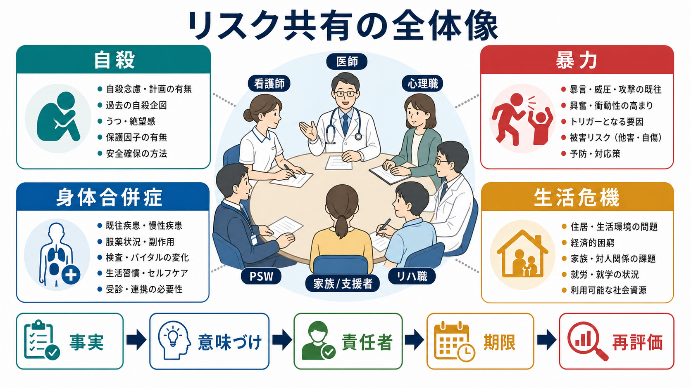
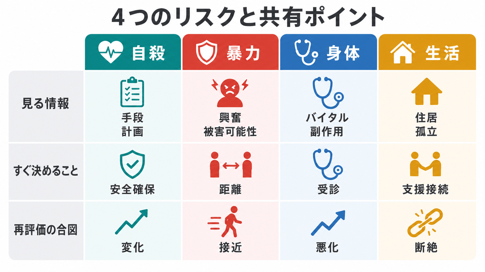
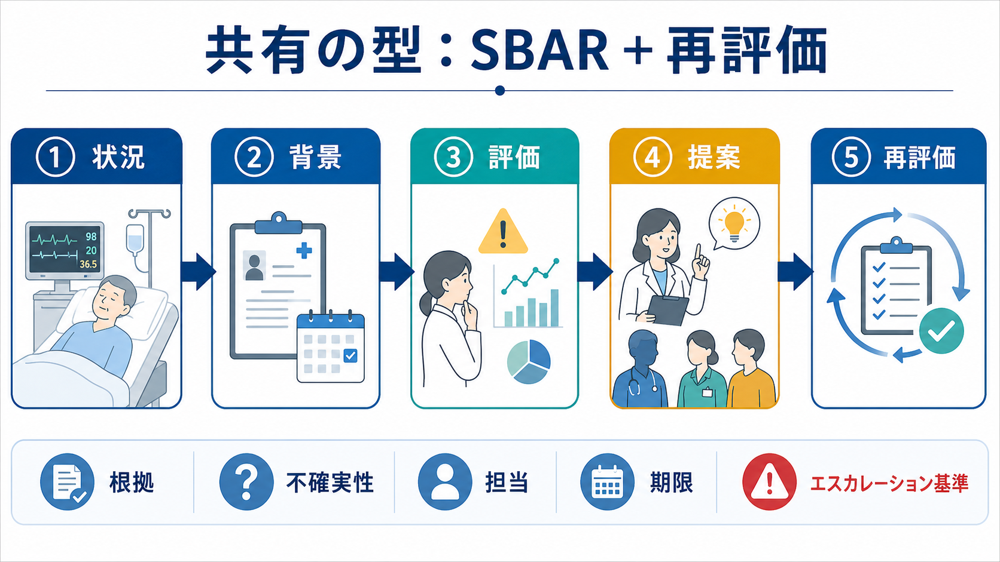

# 多職種カンファレンスでリスクをどう共有するか

## 要点

- 多職種カンファレンスで共有すべきリスクは、「危険そう」という印象ではなく、**誰に、どの時間幅で、何が起こり得て、何をすれば下げられるか**という実行可能な仮説である。
- 自殺、暴力、身体合併症、生活危機は別々のリスクに見えるが、実際には睡眠不足、物質使用、孤立、服薬中断、身体不調、住居不安などを介して互いに増幅し合う。
- 「低・中・高」のラベルだけで共有すると、判断の根拠、変化の合図、担当者、再評価時点が抜け落ちやすい。NICEは自傷・自殺リスクについて、包括的なリスク階層化を予測や退院判断に使わないよう勧告している[2]。
- 共有の型は、SBAR（状況・背景・評価・提案）に「不確実性」「担当」「期限」「エスカレーション基準」「再評価」を加えると実践しやすい[6]。
- この記事は教育・研究目的の整理であり、個別事例の診断、治療指示、法的判断の代替ではない。差し迫った危険がある場合は、所属機関の緊急対応手順、救急、警察、地域の危機介入資源につなぐ。

## この記事で答える問い

1. 多職種カンファレンスでは、リスクをどの粒度で共有すればよいか。
2. 自殺・暴力・身体合併症・生活危機を、同じ会議のなかでどう扱い分けるか。
3. リスク評価を「誰が何をするか」に変換するには、どのような型が必要か。
4. リスク共有で起こりやすい誤解と、チームで避けるべき失敗は何か。

## まず結論

多職種カンファレンスの目的は、リスクを正確に「当てる」ことではなく、**リスクを下げる行動をチームで同期すること**である。したがって、発言は次の5点にそろえるとよい。

| 共有する項目 | カンファレンスでの問い | 記録に残す形 |
|---|---|---|
| 事実 | 何が観察され、誰が確認したか | 発言、行動、バイタル、服薬、家族情報、生活状況 |
| 解釈 | 何がリスクを上げ、何が保護因子か | 自殺、暴力、身体、生活の各仮説 |
| 不確実性 | まだ分からないことは何か | 未確認情報、矛盾する情報、確認先 |
| 行動 | 誰が、いつまでに、何をするか | 担当者、期限、連絡先、介入内容 |
| 再評価 | 何が起きたら見直すか | 再評価時点、エスカレーション基準 |

WHOの患者安全行動計画は、回避可能な害を減らすには、現場の実践だけでなく、患者・家族の関与、学習、リーダーシップ、データ、チーム横断の取り組みが必要だと整理している[1]。精神科のリスクカンファレンスも同じで、個人の注意力に依存する会議ではなく、情報が途切れにくく、責任が曖昧になりにくい[[医療安全とは何か]]の仕組みとして設計する必要がある。

## 背景

精神科・心理臨床・地域支援の現場では、危機は単独のカテゴリーとして現れない。たとえば、希死念慮がある人に、睡眠不足、アルコール使用、退院直後の孤立、住居喪失、身体疾患の悪化が重なることがある。興奮や攻撃性の背景にも、幻覚妄想、せん妄、疼痛、薬剤性アカシジア、対人関係の破綻、制度への不信が混在する。

このため、多職種カンファレンスでは「自殺リスクが高い」「暴力リスクあり」といったラベルよりも、リスクが生まれる条件を共有する方が有用である。NICEの自傷ガイドラインは、将来の自殺や自傷反復を予測する目的でリスク尺度や包括的な低・中・高分類を用いないこと、本人のニーズと心理的・身体的安全を支える評価に焦点を当てることを勧告している[2]。これは尺度を使ってはいけないという意味ではなく、尺度の点数をカンファレンスの結論にしてはいけないという意味である。

一方で、身体合併症については観察項目とエスカレーション基準を曖昧にしないことが重要になる。NICEの急性疾患悪化対応ガイドラインは、心拍数、呼吸数、収縮期血圧、意識レベル、酸素飽和度、体温などの生理学的観察を記録し、トラック・アンド・トリガー方式で悪化に対応することを推奨している[5]。精神科病棟や地域支援でも、[[身体疾患の見逃しを防ぐ精神科初期対応とは何か]]をチームの共通言語にしておく必要がある。

## 基本概念

### リスクは「属性」ではなく「条件つきのシナリオ」である

リスクを「あの人は危ない」と人に貼りつけると、支援者の警戒は上がっても、具体的な予防行動に変わりにくい。共有すべきなのは、次のような条件つきのシナリオである。

> 退院後48時間以内、服薬が中断し、家族と連絡が取れず、飲酒が再開した場合、自殺企図または救急受診に至る可能性が上がる。今日中に本人と安全計画を確認し、家族同意の範囲で連絡方法を整え、明日午前に訪問看護が再評価する。

この形なら、リスクが「性格」や「診断名」ではなく、変えられる条件として扱われる。[[自殺リスクへの危機対応とは何か]]や[[暴力リスク評価とは何か]]でも重要なのは、危険因子の羅列ではなく、危険因子がどの場面で行動に近づくかを言語化することである。

### 4種類のリスクは同じテーブルで扱う

多職種カンファレンスでは、少なくとも次の4領域を同時に確認する。

| 領域 | 見る情報 | すぐ決めること | 再評価の合図 |
|---|---|---|---|
| 自殺・自傷 | 希死念慮、計画性、手段へのアクセス、過去の企図、孤立、保護因子 | 安全確保、手段安全化、同席・観察、連絡先、次回接点 | 希死念慮の増強、手段への接近、退院・外泊、飲酒、支援断絶 |
| 暴力・他害 | 興奮、被害的解釈、過去の暴力、物質使用、対象者、環境刺激 | 距離、環境調整、ディエスカレーション、応援要請、制限の最小化 | 威嚇、接近、物損、睡眠不足、拒薬、境界設定への反応 |
| 身体合併症 | バイタル、意識、疼痛、脱水、感染、薬剤副作用、既往歴 | 診察、検査、身体科相談、観察頻度、救急搬送基準 | 呼吸・循環・意識の悪化、発熱、低酸素、転倒、摂食水分低下 |
| 生活危機 | 住居、金銭、食事、家族関係、就労就学、孤立、制度利用 | 支援接続、福祉連携、退院調整、家族面談、危機時連絡 | 住居喪失、連絡途絶、借金・被害、介護破綻、制度手続きの失敗 |

WHOの自殺予防枠組みLIVE LIFEは、自殺予防を保健医療だけでなく、手段へのアクセス制限、メディア、若者の社会情動スキル、早期発見・評価・管理・フォローアップを含む多部門の取り組みとして整理している[3]。同様に、生活危機は「医療の外」ではなく、危機の発生確率を左右する臨床情報である。

### 不確実性も共有対象である

良いカンファレンスは、分かっていることだけでなく、分かっていないことを見える化する。たとえば「本人は否定しているが、家族は過量服薬の準備を疑っている」「暴力の対象が特定人物なのか不特定なのか未確認」「発熱は感染か薬剤性か判断できない」といった不確実性である。

不確実性を共有しないと、次の勤務者は「評価済み」と誤解しやすい。逆に、不確実性を明示すれば、「誰が、どこに、いつ確認するか」が決めやすくなる。

## 仕組み

### 1. 会議前に情報を4領域へ仮置きする

会議の場でゼロから情報を集めると、声の大きい職種や直近の出来事に判断が引っ張られる。短いメモでよいので、事前に4領域へ仮置きする。

- 自殺・自傷: 希死念慮、計画、手段、過去の企図、保護因子、[[安全計画とは何か]]の有無
- 暴力・他害: 直近の興奮、対象、引き金、過去の有効なディエスカレーション、制限の必要性
- 身体合併症: バイタル、意識、疼痛、脱水、転倒、薬剤副作用、身体科相談の要否
- 生活危機: 住居、金銭、食事、家族・支援者、制度利用、退院後の接点

NICEの暴力・攻撃性ガイドラインは、暴力リスクの評価と管理に、ケア環境を反映した多職種アプローチを用いること、本人と同意があれば介護者を含め、暴力が起こりやすい文脈、予防策、有効だったディエスカレーションなどを整理することを推奨している[4]。これは暴力に限らず、リスクカンファレンス全体に応用できる。

### 2. SBARで「共有の順番」をそろえる

SBARは、状況（Situation）、背景（Background）、評価（Assessment）、提案（Recommendation）の順に伝えるコミュニケーションの型である。SBARの系統的レビューでは、電話連絡や引き継ぎで患者安全を改善する可能性が示される一方、研究の質や設定には限界があるとされている[6]。つまり、SBARは万能薬ではないが、情報の抜けと階層差による発言しにくさを減らす共通形式として使える。

カンファレンスでは、SBARを次のように拡張するとよい。

| 型 | 発言例 | 目的 |
|---|---|---|
| S: 状況 | 「昨夜から不眠が続き、今朝、退院後に消えたいと話した」 | 今、何が問題かを短くそろえる |
| B: 背景 | 「過去に退院直後の過量服薬があり、家族とは連絡が途絶えやすい」 | 直近の出来事を文脈化する |
| A: 評価 | 「手段へのアクセスと孤立が重なると危険が上がる。不確実なのは薬の保管状況」 | 根拠と不確実性を分ける |
| R: 提案 | 「今日、本人と安全計画を更新し、薬剤師が残薬確認、PSWが家族連絡の同意を確認する」 | 行動へ変換する |
| R2: 再評価 | 「明日午前、外泊可否の前に再評価。連絡途絶なら訪問看護と主治医へ即共有」 | 期限とエスカレーションを固定する |

### 3. 「担当」と「期限」を決める

リスク共有で最も危険なのは、「みんなで注意する」という結論で終わることである。注意は必要だが、担当と期限がなければ実行されない。

悪い記録:

- 自殺リスクに注意。
- 家族と連携する。
- 身体面も観察する。

良い記録:

- 本日16時までに、看護師Aが本人と手段へのアクセスを再確認する。
- 本人同意の範囲で、PSW Bが母へ危機時連絡先を共有する。
- 発熱、SpO2低下、意識変容、摂水不良があれば、当直医へSBARで連絡し、身体科相談を検討する。

安全計画介入とフォローアップを組み合わせた研究では、救急部門で自殺関連行動の低下と治療関与の向上が報告されている[7]。ここで重要なのは、計画を作ること自体よりも、計画を本人と共有し、フォローアップ接点に接続することである。

### 4. エスカレーション基準を先に決める

カンファレンスでは、問題が悪化した時に「誰に相談するか」をその場で考え始めないようにする。次のような基準を先に置く。

| 領域 | エスカレーション基準の例 | 連絡先の例 |
|---|---|---|
| 自殺 | 具体的手段への接近、行方不明、別れの準備、強い焦燥、観察不能 | 主治医、当直医、救急、家族、地域危機介入 |
| 暴力 | 対象者への接近、威嚇、武器化できる物品、被害妄想の増悪、制止困難 | 応援要請、責任者、警備、必要時の警察・救急 |
| 身体 | 呼吸数異常、SpO2低下、意識変容、発熱、低血圧、転倒、けいれん | 当直医、身体科、救急搬送 |
| 生活 | 住居喪失、食事不能、連絡途絶、介護者の限界、制度手続き失敗 | PSW、地域包括、福祉事務所、訪問支援 |

精神科入院から地域への移行について、NICEは複数チームが関わる場合、入院チームと地域の医療・社会ケア、住宅支援、リエゾンなどの間で継続的なコミュニケーションを確保することを推奨している[8]。生活危機のエスカレーション基準は、医療安全の一部として扱う必要がある。

### 5. 会議後に「同じ言葉」で記録する

カンファレンスの記録は、議論の全てを書き起こすものではない。次の勤務者や地域支援者が、同じ判断にたどり着ける程度に、根拠と行動を残す。

記録の最小セット:

1. 現在の主要リスク: 自殺、暴力、身体、生活のどれか。複数可。
2. 根拠: 観察された事実と情報源。
3. 保護因子: 本人の希望、関係、制度、環境、治療関係。
4. 不確実性: 未確認情報、矛盾、追加確認先。
5. 当面の対応: 担当者、期限、連絡方法。
6. 再評価: いつ、誰が、何を見て判断を更新するか。

## 図解

この記事の3枚の図は、次のように使い分ける。

| 図 | 用途 | カンファレンスでの使い方 |
|---|---|---|
| リスク共有の全体像 | 4領域と多職種の役割を俯瞰する | 会議冒頭で、どの領域に情報不足があるかを見る |
| SBARと再評価 | 共有の手順をそろえる | 発言が長くなった時に、状況・背景・評価・提案へ戻す |
| 4つのリスクと共有ポイント | 領域ごとの確認項目を比べる | 記録作成時に、見落としや担当漏れを確認する |

図は臨床判断を代替するものではない。あくまで、会議中の視線をそろえ、情報の抜けを見つける補助である。

## 臨床・研究との接続

### 自殺リスク共有

自殺リスクの共有では、希死念慮の有無だけでなく、計画性、手段へのアクセス、過去の企図、物質使用、孤立、身体苦痛、退院・外泊・治療変更などの時間的文脈を扱う。WHOは自殺予防において、手段へのアクセス制限、早期同定、評価、管理、フォローアップを含む多層的な介入を重視している[3]。カンファレンスでは「聞いたか」ではなく、「聞いた後に何を安全化したか」を共有する。

### 暴力リスク共有

暴力リスクでは、攻撃性を本人の性格に還元せず、引き金、対象、場面、症状、物質使用、身体不調、環境刺激、過去に有効だった対応を整理する。NICEは、過去の暴力・攻撃エピソードを考慮しつつ、文化・宗教・民族性に基づく否定的仮定を避け、客観的で検証可能なリスク評価を行うことを求めている[4]。これは[[言語的ディエスカレーションとは何か]]や[[急速鎮静とは何か]]を用いる前段階の情報共有でもある。

### 身体合併症リスク共有

身体合併症では、「精神症状らしい」という説明が身体悪化の見逃しにつながる。呼吸、循環、意識、酸素化、体温、疼痛、脱水、感染、薬剤副作用、転倒、摂食水分、せん妄の可能性を定期的に確認する。NICEの急性悪化対応ガイドラインは、観察項目、観察頻度、トリガー基準、反応戦略を明確にすることを推奨している[5]。精神科カンファレンスでも、身体面の「誰が次に見るか」を具体化する必要がある。

### 生活危機リスク共有

生活危機は、医療リスクの背景ではなく、医療リスクを増幅する条件である。住居喪失、食事不能、金銭困窮、孤立、介護者の限界、制度手続きの失敗、就労・就学の破綻は、自殺、自傷、暴力、身体悪化、再入院のリスクと結びつく。退院・地域移行のガイドラインが住宅支援チームや地域の社会ケアとの継続的連絡を重視するのは、このためである[8]。

### 研究との接続

研究上は、リスク共有の効果を単純な「予測精度」だけで測ると不十分である。評価すべきなのは、情報の完全性、職種間の共有メンタルモデル、担当の明確さ、再評価の実施率、エスカレーション遅延、患者・家族の関与、インシデント後の学習である。SBAR研究でも、患者アウトカムの改善については一定の示唆があるが、設定や研究デザインの異質性が大きく、構造化コミュニケーションを導入しただけで安全が保証されるわけではない[6]。

## よくある誤解

### 「リスクを共有する」とは、危険な人をリスト化することではない

危険人物リストは、支援者の不安を一時的に下げることがあるが、本人の回復、権利、治療関係を損なうことがある。共有すべきなのは、人ではなく、状況と行動計画である。

### 「低リスク」と言えれば安心ではない

低・中・高のラベルは、申し送りの省略語として便利に見える。しかし、自傷・自殺リスクでは、このような包括的階層化を予測や退院判断に使うことは推奨されない[2]。低リスクと書くより、「現在は計画性を否定し、家族同席があり、手段は保管済み。ただし外泊後に飲酒が再開した場合は再評価」と書く方が安全である。

### 家族・支援者に話せば十分ではない

家族や支援者は重要な安全資源だが、負担を押しつける相手ではない。本人の同意、守秘、意思決定能力、虐待や支配関係の有無、家族自身の疲弊を確認する必要がある。患者・家族の関与は、情報提供だけでなく、実行可能な範囲と限界を一緒に決めることを含む[1]。

### 身体リスクは身体科に任せればよい、ではない

身体科相談は重要だが、相談に至るまでの観察、記録、異常時の連絡、薬剤副作用の確認は精神科チームの日常業務である。身体リスクを「専門外」として会議から外すと、悪化の初期サインが共有されにくくなる。

### カンファレンスを増やせば安全になるわけではない

会議数が増えても、担当、期限、再評価が決まらなければ安全にはならない。短くても、行動に変換される会議の方が有効である。

## 関連ノート

- [[医療安全とは何か]]
- [[自殺リスクへの危機対応とは何か]]
- [[安全計画とは何か]]
- [[暴力リスク評価とは何か]]
- [[身体疾患の見逃しを防ぐ精神科初期対応とは何か]]
- [[クライシスプランとは何か]]
- [[離院リスクへの対応とは何か]]

## MOC更新候補

- [[MOC｜臨床実践・治療]] に「医療安全・危機対応」の多職種連携ノートとして追加候補。
- MOC更新は並列ジョブとの競合を避けるため、本記事では実施しない。

## 理解チェック

1. 「自殺リスク高い」とだけ記録することの問題は何か。
2. SBARに「再評価」を加えると、どのような抜けを防げるか。
3. 暴力リスク評価で、文化・宗教・民族性に基づく仮定を避ける必要があるのはなぜか。
4. 身体合併症リスクを精神科カンファレンスで扱う理由は何か。
5. 生活危機が自殺・暴力・身体リスクを増幅する例を1つ挙げると何か。

## 未解決問題

- 多職種カンファレンスの質を、患者アウトカム、職種間連携、患者・家族の経験のどの指標で評価するのが妥当か。
- リスク共有記録の標準化は、必要な情報共有とスティグマ化の回避をどのように両立できるか。
- AIや電子カルテアラートを使う場合、予測精度だけでなく、過剰警戒、差別、責任の曖昧化をどう監査するか。
- 地域支援や福祉機関を含むカンファレンスで、守秘と安全確保をどのように運用するか。

## 参考文献

[1] World Health Organization. (2021). *Global patient safety action plan 2021–2030: towards eliminating avoidable harm in health care*. https://iris.who.int/handle/10665/343477

[2] National Institute for Health and Care Excellence. (2022). *Self-harm: assessment, management and preventing recurrence (NICE guideline NG225)*. https://www.nice.org.uk/guidance/ng225/chapter/recommendations

[3] World Health Organization. (2021). *LIVE LIFE: an implementation guide for suicide prevention in countries*. https://www.who.int/publications/i/item/9789240026629

[4] National Institute for Health and Care Excellence. (2015). *Violence and aggression: short-term management in mental health, health and community settings (NICE guideline NG10)*. https://www.nice.org.uk/guidance/ng10

[5] National Institute for Health and Care Excellence. (2007). *Acutely ill adults in hospital: recognising and responding to deterioration (Clinical guideline CG50)*. https://www.nice.org.uk/guidance/CG50

[6] Müller, M., Jürgens, J., Redaèlli, M., Klingberg, K., Hautz, W. E., & Stock, S. (2018). Impact of the communication and patient hand-off tool SBAR on patient safety: a systematic review. *BMJ Open, 8*(8), e022202. https://doi.org/10.1136/bmjopen-2018-022202

[7] Stanley, B., Brown, G. K., Brenner, L. A., Galfalvy, H. C., Currier, G. W., Knox, K. L., Chaudhury, S. R., Bush, A. L., & Green, K. L. (2018). Comparison of the Safety Planning Intervention With Follow-up vs Usual Care of Suicidal Patients Treated in the Emergency Department. *JAMA Psychiatry, 75*(9), 894–900. https://doi.org/10.1001/jamapsychiatry.2018.1776

[8] National Institute for Health and Care Excellence. (2016). *Transition between inpatient mental health settings and community or care home settings (NICE guideline NG53)*. https://www.nice.org.uk/guidance/ng53
