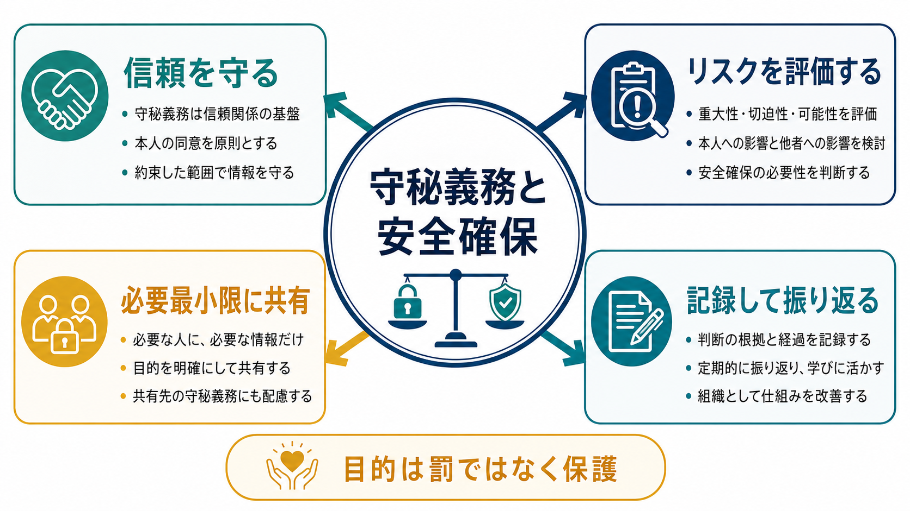
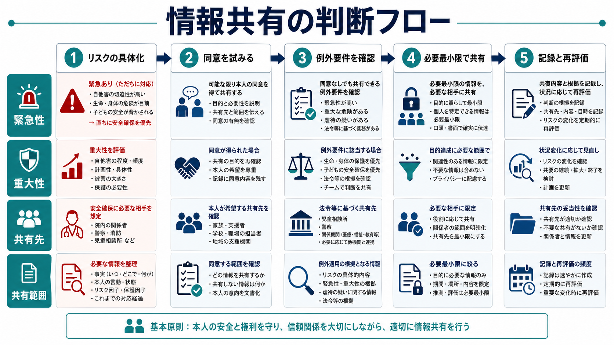
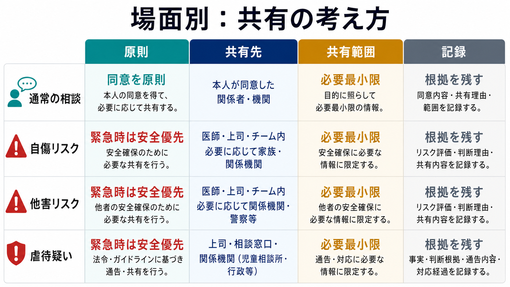

# 守秘義務と安全確保はどう両立するか

## 要点

- 守秘義務は、患者・相談者が危険な考えや被害を語れるようにするための安全基盤であり、単なる秘密主義ではない。
- 情報共有の原則は、本人の同意、目的の明確化、共有先の限定、必要最小限、記録である。
- 例外的に同意なしの共有が検討されるのは、法令に基づく場合、人の生命・身体・財産の保護に必要で同意取得が困難な場合、児童の健全育成のため特に必要な場合などである[2][3]。
- 自傷・他害・虐待疑いでは、「共有するか」だけでなく、「誰に、何を、どの目的で、どの範囲まで、いつ本人へ説明するか」を具体化する。
- 本記事は教育・研究目的の整理であり、個別事案の法的判断や治療指示ではない。実務では所属機関の規程、自治体の運用、専門職倫理、法務・管理者への相談を組み合わせる。

## この記事で答える問い

1. 守秘義務は、なぜ臨床の安全にとって重要なのか。
2. 自傷・他害リスクがある場合、どのように情報共有を判断するのか。
3. 児童虐待など通告義務がある場面では、守秘義務とどう関係づけるのか。
4. 「安全のためなら何でも共有してよい」という誤解をどう避けるのか。

## まず結論

守秘義務と安全確保は対立物ではなく、どちらも「本人と周囲の人を守る」ための制度である。通常時は守秘が治療関係を守り、危機時は限定的な情報共有が生命・身体の安全を守る。重要なのは、守秘義務を破るか守るかという二択ではなく、次の順に考えることである。

1. まず本人と話し、同意を得て共有できないか検討する。
2. リスクの重大性、切迫性、具体性、対象者、利用可能な保護手段を評価する。
3. 同意なし共有が必要な場合でも、共有先・共有内容・共有時点を必要最小限にする。
4. 判断根拠、同意取得の試み、共有した内容、共有後の安全計画を記録する。

この流れは、[[医療安全とは何か]]や[[精神科医療安全の特徴は何か]]で扱う「個人の責任追及ではなく、予防可能な危険を減らす」という考え方と接続する。

## 背景

医療・心理・福祉の相談では、本人が言いにくいことを語れる関係が不可欠である。自殺念慮、暴力衝動、家族内暴力、被虐待体験、違法薬物使用、性的被害、加害への恐れなどは、秘密が守られる見通しがなければ表面化しにくい。したがって守秘義務は、臨床家を黙らせるためではなく、危険な情報を早く把握し、支援につなげるための条件でもある。

一方で、守秘には限界がある。日本の刑法は、医師など一定の職種について、正当な理由なく業務上知り得た秘密を漏らすことを秘密漏示として扱う[1]。ここで重要なのは「正当な理由がないのに」という限定である。個人情報保護法や医療・介護分野のガイダンスは、本人同意を原則としつつ、法令に基づく提供、人の生命・身体・財産の保護に必要で本人同意を得ることが困難な場合などを例外として整理している[2][3]。

つまり、危機対応の問いは「守秘義務があるから共有できない」でも「危険だから何でも共有できる」でもない。守秘を原則にしながら、例外を狭く、説明可能に、記録可能に使うことである。

## 基本概念

### 守秘義務

守秘義務とは、職務上知り得た秘密を正当な理由なく第三者へ漏らさない義務である。医療・心理・福祉の場では、法的義務だけでなく、専門職倫理、施設内規程、診療契約、研究倫理とも重なる。精神科領域では、守秘が弱いと本人が危険な思考や被害状況を隠し、結果として[[自殺リスクへの危機対応とは何か]]や[[暴力リスク評価とは何か]]が遅れる。

### 情報共有

情報共有とは、支援や安全確保の目的で、本人情報を他者に伝えることである。共有先には、家族、支援者、主治医、救急、警察、児童相談所、市町村、学校、施設、職場などがありうる。ただし、共有先が多いほど安全になるわけではない。むしろ過剰共有は、信頼関係を損ない、差別や報復、治療中断のリスクを増やす。

### 必要最小限

必要最小限とは、「目的達成に必要な相手へ、必要な項目だけを、必要な時期に共有する」ことである。たとえば、家族に自殺リスクを説明する場合でも、診断名、過去の詳細なトラウマ、本人が秘密にしたい生活史まで常に共有する必要はない。必要なのは、危険な手段へのアクセス、見守りの期間、緊急連絡先、避けるべき対応、本人の同意範囲などである。

### 安全確保

安全確保は、危険をゼロにすることではない。リスクの切迫性を下げ、本人・周囲・支援者が次に取る行動を具体化することである。[[安全計画とは何か]]や[[クライシスプランとは何か]]は、同意に基づく共有を増やし、危機時の例外的共有を狭めるための準備にもなる。

## 仕組み

### 1. 同意を原則にする

最初の選択肢は、本人と共有の目的を話し合い、同意を得ることである。本人が「誰に何を知られるのか」を理解できるようにし、共有範囲を本人と一緒に絞る。たとえば「母親に全部話す」ではなく、「今夜一人にしないため、自殺念慮が強いことと薬の管理が必要なことだけ伝える」と具体化する。

NICE の自傷行為ガイドラインも、自傷した人の支援では同意、守秘、セーフガーディングを理解し、必要に応じて本人を意思決定に関与させ続けることを重視している[7]。これは日本の制度を直接決めるものではないが、臨床的には「守秘を破ったら関係が終わり」ではなく、危機時にも本人との協働を保つという実践原理として参考になる。

### 2. リスクを具体化する

情報共有の必要性は、診断名や感情の強さだけでは決まらない。少なくとも次を確認する。

| 観点 | 確認すること |
|---|---|
| 重大性 | 死亡、重傷、虐待継続、重大な暴力につながる可能性があるか |
| 切迫性 | 今日・今夜・数日以内に起こりうるか |
| 具体性 | 方法、対象、場所、時期、準備行動が具体化しているか |
| 手段へのアクセス | 薬剤、刃物、紐、車、武器、被害児童への接近などがあるか |
| 保護因子 | 同意できる支援者、受診継続、避難先、見守り、環境調整があるか |
| 代替手段 | 同意取得、匿名相談、院内カンファレンス、法務相談で足りるか |

この評価は、[[自傷行為への初期対応はどう行うか]]、[[自殺未遂後の再企図予防とは何か]]、[[興奮状態への対応はどう行うか]]と連続する。リスク評価は「共有の免罪符」ではなく、共有範囲を絞るための作業である。

### 3. 例外要件を確認する

同意が得られない場合でも、共有が許容または義務づけられることがある。代表的には、個人情報保護法上の「法令に基づく場合」や「人の生命、身体又は財産の保護のために必要がある場合で、本人同意を得ることが困難な場合」である[2][3]。児童虐待では、虐待を受けたと思われる児童を発見した者に通告義務があり、守秘義務に関する規定は通告義務の遵守を妨げるものと解釈してはならないとされる[4][5]。

精神科救急では、入院させなければ精神障害のために自傷他害のおそれがある場合、措置入院や緊急措置入院の制度が関係することがある[6]。ただし、これらは強い権利制限を伴うため、単に不穏、怒り、希死念慮があるというだけで機械的に使うものではない。本人の権利、安全、医療必要性、手続保障を同時に考える必要がある。

### 4. 必要最小限で共有する

共有すると決めたら、次のように範囲を狭める。

| 問い | 例 |
|---|---|
| 目的は何か | 今夜の自殺手段へのアクセスを減らす、児童の安全確認を依頼する |
| 共有先は誰か | 同居家族、救急外来、児童相談所、警察、院内安全管理者 |
| 共有する項目は何か | リスクの切迫性、必要な見守り、避けるべき接触、緊急連絡先 |
| 共有しない項目は何か | 目的に不要な診断名、過去の詳細な被害歴、第三者の秘密 |
| 本人への説明はどうするか | 可能なら事前に説明し、事後でも理由と範囲を説明する |

Tarasoff 事件で知られる「保護義務」の議論は、守秘と第三者保護の緊張を示す古典例である。米国法の枠組みは地域差が大きく日本へ直接移植できないが、「警告」だけでなく、入院、警察連絡、被害者保護、治療強化など複数の保護手段を状況に応じて考えるという点は参考になる[8]。

### 5. 記録して再評価する

危機時の共有では、記録が安全管理そのものになる。記録には、リスク評価、本人への説明、同意の有無、同意を得られなかった理由、共有先、共有内容、共有時刻、共有後の反応、次の評価予定を残す。第三者提供や情報授受の確認・記録は、医療・介護分野の個人情報ガイダンスでも重要な実務として整理されている[2]。

記録は、後から誰かを責めるためだけのものではない。次の担当者が同じ危険を見落とさないため、本人へ一貫した説明をするため、共有しすぎを防ぐための道具である。

## 図解

上の流れは、実務では直線的に一度だけ進むものではない。救急場面では「リスクの具体化」と「安全確保」がほぼ同時に起こることがある。虐待疑いでは、本人や保護者への説明が安全を損なう場合もある。そのため、判断の中心は「秘密を守るか、破るか」ではなく、「誰のどの危険を下げるために、どの情報が必要か」である。

## 臨床・研究との接続

### 自傷・自殺リスク

自傷や自殺念慮がある場合、本人が語った内容をすぐ家族へ全面共有するのではなく、まず共同で安全計画を作る。危険手段の除去、受診・連絡の約束、夜間の見守り、服薬管理、危機時の連絡先などは、本人の同意を得て共有しやすい。本人が拒否し、かつ切迫した生命リスクがある場合には、同意なし共有の必要性を検討する[2][7]。

### 他害リスク

他害リスクでは、怒りの表出と具体的な危害計画を区別する。標的、手段、準備行動、接近可能性、過去の暴力、物質使用、妄想・幻覚、保護因子を確認し、[[暴力リスク評価とは何か]]と接続して判断する。特定の第三者に重大で切迫した危険がある場合、警察、院内安全部門、管理者、必要な支援機関との共有が検討される。ただし、共有は報復やリスク増大を招くこともあるため、誰へ直接伝えるかは慎重に選ぶ。

### 虐待疑い

児童虐待では「確証がないから通告できない」という理解は危険である。児童虐待防止法は、虐待を受けたと思われる児童を発見した者の通告義務を定め、通告義務の遵守が守秘義務規定に妨げられないことを明示している[4]。厚生労働省の援助指針も、通告が守秘義務違反に当たらないことを説明している[5]。通告後も、通告者を特定させる情報や、児童の安全を損なう情報の扱いには注意が必要である。

### 家族・支援者との協働

家族や支援者は安全確保の重要な資源である一方、本人にとって危険源である場合もある。[[家族支援とは何か]]や[[トラウマインフォームドケアとは何か]]の観点から、家族へ共有する前に、暴力、支配、ストーキング、経済的搾取、性的被害、アウティングの危険を評価する。家族に共有することが安全を下げる場合には、別の支援者、医療機関、行政機関、専門窓口を選ぶ。

### 研究・教育

研究や教育では、臨床事例の共有範囲をさらに狭く考える必要がある。個人が識別される情報、珍しい経過、地域・職業・家族構成などの組み合わせは、匿名化しても再識別につながることがある。[[インフォームドコンセントとは何か]]や研究倫理の枠組みでは、二次利用、教育利用、症例報告、データ共有の範囲を事前に説明することが重要である。

## よくある誤解

### 誤解1: 守秘義務があるので、危険があっても誰にも言えない

守秘義務は原則だが、絶対ではない。法令に基づく通告や、生命・身体の保護に必要で同意取得が困難な場合など、例外は制度上整理されている[2][3][4]。ただし、例外があることと、広く共有してよいことは別である。

### 誤解2: 安全のためなら、本人の同意は不要である

危機時でも、同意取得の試みは重要である。本人が共有の必要性を理解し、共有内容を一緒に決められれば、治療関係を守りながら安全を高められる。同意なし共有は、同意を得る時間がない、同意を求めること自体が危険を増やす、本人の判断能力が著しく低下しているなど、具体的な理由がある場合に検討する。

### 誤解3: 家族には当然すべて話してよい

家族は第三者であり、本人同意なしに病状や相談内容を全面共有してよいわけではない。家族が安全計画の担い手になる場合でも、共有するのは目的に必要な範囲に限る。家族内暴力や虐待が疑われる場合、家族への説明が本人や児童の危険を高めることもある。

### 誤解4: 通告や警察連絡をすれば臨床家の役割は終わる

通告や警察連絡は安全確保の一部であり、支援の終点ではない。本人への説明、フォローアップ、治療継続、支援者との役割分担、記録、再評価が必要である。危機対応は単発の通報ではなく、危険を下げる連続的なケアである。

## 関連ノート

- [[医療安全とは何か]]
- [[精神科医療安全の特徴は何か]]
- [[安全計画とは何か]]
- [[クライシスプランとは何か]]
- [[自傷行為への初期対応はどう行うか]]
- [[自殺リスクへの危機対応とは何か]]
- [[自殺未遂後の再企図予防とは何か]]
- [[暴力リスク評価とは何か]]
- [[ストーキング被害への精神科対応とは何か]]
- [[家族支援とは何か]]
- [[トラウマインフォームドケアとは何か]]

## MOC更新候補

- `content/00_MOC/MOC｜臨床実践・治療.md`
- `content/00_MOC/MOC｜司法・制度・地域精神医療.md`
- `content/00_MOC/MOC｜倫理・哲学・社会.md`

並列ジョブとの競合を避けるため、本記事作成時点では MOC 本体は更新していない。

## 理解チェック

1. 守秘義務が臨床安全に役立つ理由を、「危険な情報を語れる関係」という観点から説明できるか。
2. 同意なし共有を検討する前に、本人とどのような共有範囲の交渉ができるか。
3. 自傷リスク、他害リスク、虐待疑いでは、共有先と共有内容がどのように異なるか。
4. 「必要最小限の共有」を、共有先・共有内容・共有時点・記録の4点で説明できるか。
5. 通告や情報共有の後に、なぜ再評価とフォローアップが必要なのか。

## 未解決問題

- 日本の精神科・心理臨床において、同意なし情報共有の判断過程をどの程度標準化できるか。
- 家族支援が安全を高める場面と、家族共有が危険を増やす場面を、初回面接でどう見分けるか。
- 学校、職場、福祉、警察、医療のあいだで、必要最小限の共有を実装する共通フォーマットをどう作るか。
- AI記録、電子カルテ連携、オンライン相談で、危機情報の共有と過剰拡散をどう両立するか。

## 参考文献

[1] e-Gov法令検索. 刑法（明治四十年法律第四十五号）第134条「秘密漏示」. https://laws.e-gov.go.jp/law/140AC0000000045

[2] 個人情報保護委員会・厚生労働省. 医療・介護関係事業者における個人情報の適切な取扱いのためのガイダンス. https://www.ppc.go.jp/personalinfo/legal/iryoukaigo_guidance/

[3] 個人情報保護委員会. 個人情報の保護に関する法律についてのガイドライン（通則編）. https://www.ppc.go.jp/personalinfo/legal/guidelines_tsusoku/

[4] 厚生労働省. 児童虐待の防止等に関する法律（平成十二年法律第八十二号）. https://www.mhlw.go.jp/bunya/kodomo/dv22/01.html

[5] 厚生労働省. 第1章 子ども虐待の援助に関する基本事項. https://www.mhlw.go.jp/bunya/kodomo/dv05/01.html

[6] 厚生労働省. 「措置入院の運用に関するガイドライン」について. https://www.mhlw.go.jp/web/t_doc?dataId=00tc3289&dataType=1

[7] National Institute for Health and Care Excellence. *Self-harm: assessment, management and preventing recurrence* (NICE guideline NG225). 2022; last reviewed 2024. https://www.nice.org.uk/guidance/ng225

[8] Tarasoff v. Regents of University of California, 17 Cal. 3d 425 (Supreme Court of California, 1976). Justia. https://law.justia.com/cases/california/supreme-court/3d/17/425.html
