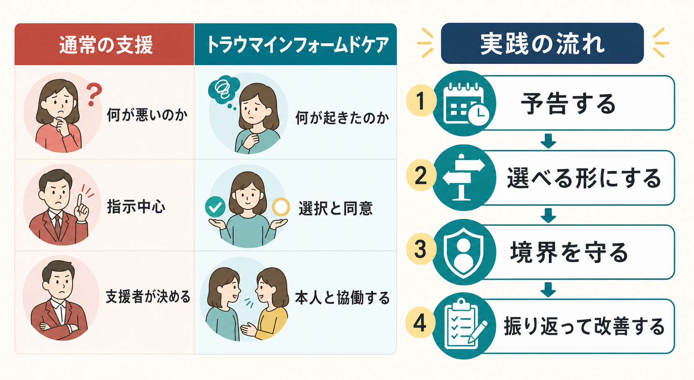

# 安全計画とは何か

## 要点

- 安全計画とは、自殺念慮や自傷衝動が強まったときに、本人が「何に気づき、何を試し、誰に連絡し、何を遠ざけるか」をあらかじめ本人と支援者が共同で書き出す短い行動計画である。
- Stanley と Brown の Safety Planning Intervention（SPI）は、警告サイン、ひとりでできる対処、気をそらす社会的接触、支援者、専門機関、致死的手段へのアクセス制限という6要素で構成される [1]。
- 安全計画は「死なないと約束する契約」ではない。危機時に実行できる具体的行動を、本人の言葉で、すぐ見られる形にする介入である [2]。
- 救急部門での SPI と構造化フォローアップを組み合わせた研究では、通常ケアと比べて6か月間の自殺行動が少なく、外来精神保健受診も増えていた [3]。
- ただし安全計画だけで診断・治療・見守り・環境調整を代替できるわけではない。リスクが高い場合は、即時の安全確保、専門評価、家族・支援者との連携、緊急対応が優先される。

## この記事で答える問い

1. 安全計画は何を目的にした計画なのか。
2. 安全計画には何を書くのか。
3. なぜ危機時に役立つと考えられているのか。
4. 「安全契約」や単なる連絡先リストと何が違うのか。
5. 臨床・地域支援で使うときに何へ注意すべきか。

## まず結論

安全計画は、危機が起きてから説得するための文書ではなく、危機が強まる前の比較的落ち着いた時間に作る「行動の足場」である。自殺危機では注意の幅が狭まり、将来の選択肢を思い出しにくくなり、孤立や衝動性が強まることがある。そこで、本人が自分の警告サインを認識し、まず自分でできる対処を試し、それでも下がらない場合に人・専門機関・緊急支援へ段階的につながり、同時に致死的手段を遠ざける [1], [4]。

臨床上の核心は「本人と共同で、本人の言葉で、具体的に、アクセスしやすく作る」ことである。支援者が一方的に注意事項を書き渡すものではなく、本人が危機時に実際に使えるかを一緒に検討し、使った後に見直す共有メモとして扱う。

## 背景

自殺予防では、長期的な治療や社会的支援だけでなく、危機が高まる数分から数時間をどう越えるかが重要になる。安全計画は、この短い時間幅に焦点を当てた低負担の介入であり、救急、外来、入退院時、学校、地域支援などで使われている [1], [5]。

WHO の自殺予防実装ガイド LIVE LIFE は、手段へのアクセス制限、メディア報道、若者の社会情動スキル、早期発見と支援を主要介入として位置づけている [6]。安全計画はこのうち、早期発見と支援、危機時のつながり、手段制限を個人レベルに落とし込む道具として理解できる。日本でも厚生労働省の「まもろうよ こころ」は、電話・SNS相談など複数の相談先を提示しており、安全計画には地域で実際に使える相談先を入れておく必要がある [7]。

## 基本概念

### 安全計画の定義

安全計画とは、自殺念慮・自傷衝動・強い絶望感などが高まったときに使う、個別化された行動手順である。典型的には次の6項目を含む [1], [5]。

| 項目 | 書く内容 | 具体化の例 |
|---|---|---|
| 警告サイン | 危機が近づく前ぶれ | 眠れない、特定の考えが反復する、連絡を絶つ |
| ひとりでできる対処 | すぐ試せる行動 | 呼吸、短い散歩、冷水、音楽、メモを読む |
| 気をそらす場所・人 | 危機を直接話さずに孤立を減らす接点 | カフェ、図書館、家族と同じ部屋にいる |
| 支援してくれる人 | 危機を伝えられる相手 | 友人、家族、ピア、支援者 |
| 専門家・相談先 | 専門的助けを求める連絡先 | 主治医、訪問看護、地域窓口、救急、相談電話 |
| 手段制限 | 衝動と致死的手段を離す工夫 | 保管を他者に依頼する、アクセス時間を遅らせる、安全な環境へ移動する |

### 誰のためのものか

安全計画は、希死念慮がある人、自殺企図後に退院・帰宅する人、自傷や自殺関連の危機を反復しうる人、危機の波を本人と支援者が一緒に扱う必要がある人に使われる。[[クライシスプランとは何か]] や WRAP と重なる面はあるが、安全計画は特に「自殺危機時に、いま何をするか」に焦点を絞る。

### 何ではないか

安全計画は、単なるチェックリスト、免責文書、本人を説得する紙、支援者が責任を回避するための書類ではない。また「自殺しないと約束する」形式の no-suicide contract とは異なる。no-suicide contract は経験的支持が乏しく、概念的・実務的問題が指摘されている [2]。安全計画は約束ではなく、危機時に実行できる行動の選択肢を増やす介入である。

## 仕組み

安全計画が働く仕組みは、少なくとも4つに分けて考えられる。

第1に、警告サインを言語化することで、危機を「突然の破局」ではなく「気づける変化」として扱いやすくする。これはリスク要因の一覧ではなく、本人に特有の近接サインを探す作業である。

第2に、ひとりでできる対処を前もって決めることで、強い感情のなかでも最初の一手を取りやすくする。ここで重要なのは、一般論として望ましい対処ではなく、本人が実際に数分以内にできる対処を選ぶことである。

第3に、社会的接触と支援要請を段階化することで、孤立を減らす。危機を話す前段階として「人のいる場所に行く」「誰かに短いメッセージを送る」だけでも、衝動のピークを越える時間を作りうる。

第4に、手段制限によって、強い衝動と致死的手段が同時にそろう状況を減らす。CDC の自殺予防リソースも、リスクのある人への致死的手段アクセス低減を保護的環境づくりの一部として位置づけている [8]。

## 図解

安全計画は、次のような「下から上へ戻る階段」として考えると実装しやすい。

| 危機の段階 | 本人の状態 | 安全計画で確認すること |
|---|---|---|
| 早期サイン | まだ少し選択肢を考えられる | いつもの危険サインは何か |
| 高まり始め | 思考が狭まり、反復的になる | ひとりでできる対処は何か |
| 孤立 | 誰にも言えない、連絡を避ける | 危機を話さず近づける場所・人は誰か |
| 支援要請 | 自分だけでは下げられない | 誰に何と言って連絡するか |
| 緊急性 | 具体的な計画・手段・切迫性がある | 専門機関、救急、周囲の即時協力、手段制限 |

この階段は必ず順番どおり使う必要はない。切迫性が高いときは、最初から専門支援や緊急対応へ進む。むしろ安全計画には「この状態なら迷わず救急・緊急連絡」という条件を明記しておく方がよい。

## 臨床・研究との接続

Stanley と Brown の SPI は、救急部門など短時間接触の場でも使えるように設計された。本人と支援者が協働して、警告サインから手段制限までを優先順位つきで記入し、危機時に取り出せる形にする [1]。

大規模な退院後フォローアップ研究では、退院時の SPI と電話フォローアップを組み合わせた群は通常ケア群より6か月間の自殺行動が少なく、少なくとも1回の外来精神保健受診につながる確率も高かった [3]。安全計画型介入のメタ分析でも、自殺行動の相対リスク低下が示された一方、自殺念慮そのものへの効果は明確ではなかった [4]。つまり、安全計画は「考えを消す」介入というより、危機時の行動、接続、環境を変える介入として位置づけるのが妥当である。

NICE の自傷ガイドラインは、自傷した人と協働して安全計画を作ることを推奨し、トリガー・警告サイン、個別化された対処、社会的接触、家族や友人、精神保健サービス、環境安全化を含めるとしている [5]。これは [[認知行動療法CBTとは何か]] の問題解決的要素、[[弁証法的行動療法DBTとは何か]] の苦痛耐性・危機スキル、[[家族支援とは何か]] の支援ネットワークづくりとも接続する。

## よくある誤解

### 誤解1: 安全計画があれば自殺リスク評価は不要である

安全計画はリスク評価の代替ではない。念慮、計画、意図、手段、過去の企図、保護因子、物質使用、精神症状、身体疾患、生活危機などを包括的に評価し、そのうえで介入を選ぶ必要がある。NICE も、安全計画を協働的ケアの一部として扱っており、単独の判定道具としては扱っていない [5]。

### 誤解2: 連絡先を書けば安全計画になる

連絡先は重要だが、それだけでは危機の最初の数分を支えにくい。本人が「どのサインで」「どの順番で」「誰に何と言うか」まで具体化して初めて使いやすくなる。

### 誤解3: 手段制限は本人の自律性を奪う

手段制限は、本人を罰することではなく、衝動が高い時間帯と致死的手段を物理的・時間的に離す工夫である。本人の同意、尊厳、文化的背景、生活上の現実を確認しながら、家族・支援者・医療者と協働して行う必要がある [5], [8]。

### 誤解4: 安全計画は一度作れば終わりである

安全計画は使った後に更新する。役立った対処は残し、使えなかった対処は理由を検討し、連絡先や支援体制の変化を反映する。危機後の振り返りは、本人を責める場ではなく、次の危機に備えて障壁を減らす場である。

## 関連ノート

- [[クライシスプランとは何か]]
- [[WRAPとは何か]]
- [[弁証法的行動療法DBTとは何か]]
- [[DBTの苦痛耐性スキルとは何か]]
- [[認知行動療法CBTとは何か]]
- [[家族支援とは何か]]
- [[訪問看護は精神科で何を支えるのか]]
- [[ケースマネジメントとは何か]]

## 理解チェック

1. 安全計画の6要素を、本人の行動順に説明できるか。
2. 安全計画と no-suicide contract の違いを説明できるか。
3. 「手段制限」がなぜ危機時の安全に関係するのかを説明できるか。
4. 安全計画を作るとき、本人の言葉・具体性・アクセスしやすさをどう確認するか。
5. 安全計画だけでは不十分で、緊急対応や専門評価が必要になる条件を挙げられるか。

## 未解決問題

- どの対象者・どの場面で、安全計画単独よりフォローアップ接触を組み合わせるべきか。
- デジタル安全計画アプリやメッセージ支援は、紙の計画と比べてどの条件で有効か。
- 若者、高齢者、発達特性、物質使用、家庭内暴力、文化的背景の違いに応じて、どのように安全計画を調整すべきか。
- 日本の地域資源、救急体制、家族関係の文脈で、手段制限をどのように協働的に実装するか。

## 参考文献

[1] Stanley, B., & Brown, G. K. (2012). Safety Planning Intervention: A brief intervention to mitigate suicide risk. *Cognitive and Behavioral Practice, 19*(2), 256-264. https://doi.org/10.1016/j.cbpra.2011.01.001

[2] Rudd, M. D., Mandrusiak, M., & Joiner, T. E. Jr. (2006). The case against no-suicide contracts: The commitment to treatment statement as a practice alternative. *Journal of Clinical Psychology, 62*(2), 243-251. https://doi.org/10.1002/jclp.20227

[3] Stanley, B., Brown, G. K., Brenner, L. A., et al. (2018). Comparison of the Safety Planning Intervention With Follow-up vs Usual Care of Suicidal Patients Treated in the Emergency Department. *JAMA Psychiatry, 75*(9), 894-900. https://doi.org/10.1001/jamapsychiatry.2018.1776

[4] Nuij, C., van Ballegooijen, W., de Beurs, D., et al. (2021). Safety planning-type interventions for suicide prevention: Meta-analysis. *The British Journal of Psychiatry, 219*(2), 419-426. https://doi.org/10.1192/bjp.2021.50

[5] National Institute for Health and Care Excellence. (2022). *Self-harm: assessment, management and preventing recurrence* (NICE guideline NG225). https://www.nice.org.uk/guidance/ng225

[6] World Health Organization. (2021). *LIVE LIFE: An implementation guide for suicide prevention in countries*. https://www.who.int/publications/i/item/9789240026629

[7] 厚生労働省. (n.d.). まもろうよ こころ. https://www.mhlw.go.jp/mamorouyokokoro/

[8] Centers for Disease Control and Prevention. (2022). *Suicide Prevention Resource for Action: A Compilation of the Best Available Evidence*. https://stacks.cdc.gov/view/cdc/124648

## 関連ノート候補・MOC更新候補

- MOC更新候補: `content/00_MOC/` 配下の臨床実践・精神医学・医療安全関連MOCに、バッチ統合時に `[[安全計画とは何か]]` を追加する。
- 今後の作成候補: 「自殺リスク評価とは何か」「手段制限とは何か」「危機介入とは何か」「自傷と自殺念慮の違い」。
