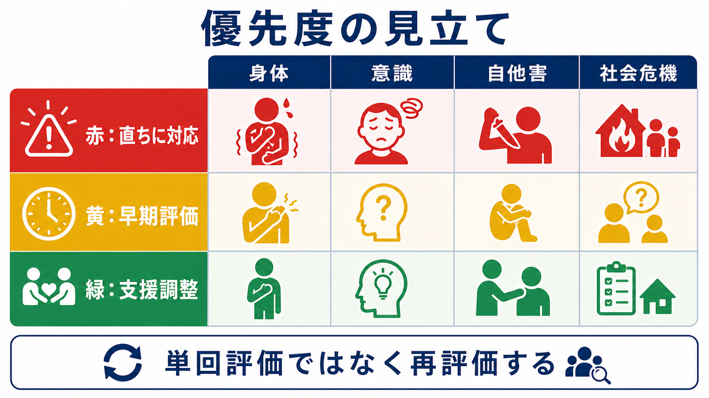
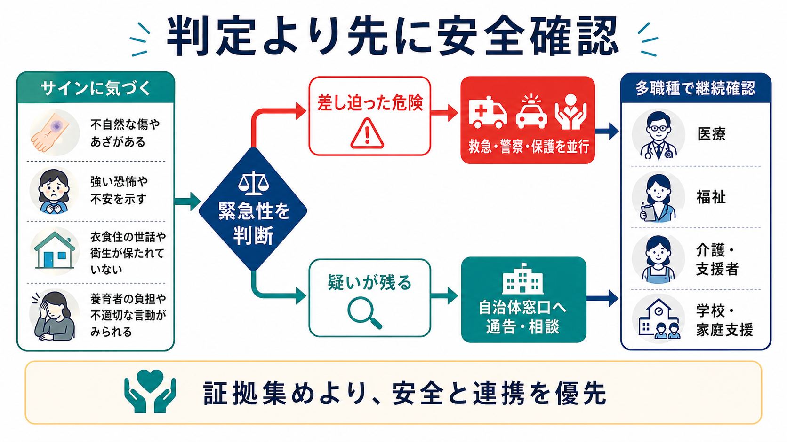
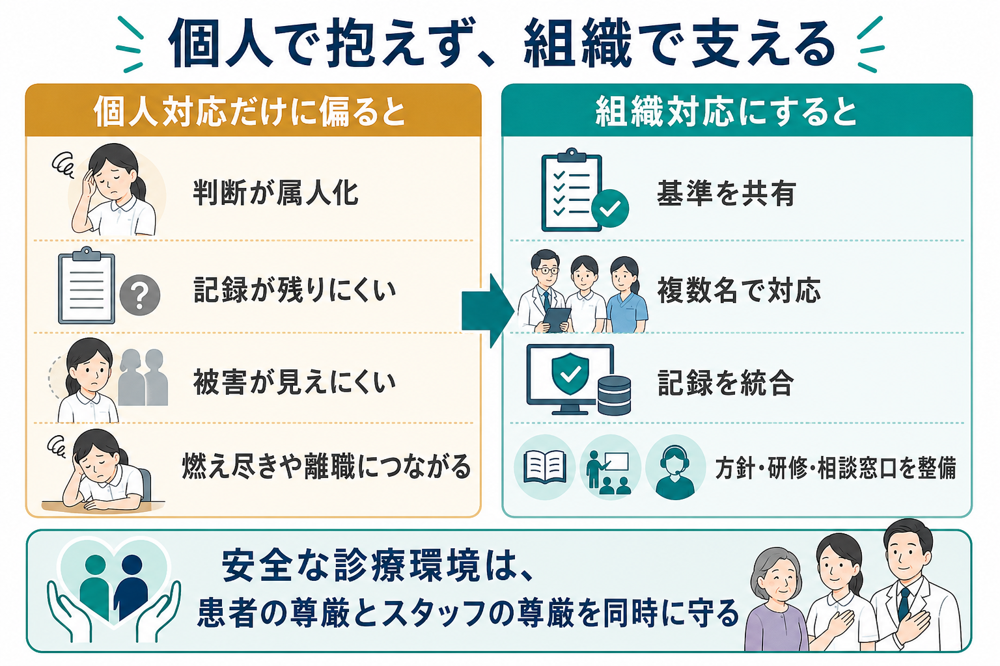

# 患者からのハラスメントにどう対応するか

## 要点

- 患者からのハラスメント対応は、接遇の問題ではなく、**スタッフの安全、患者の診療継続、組織の労働安全衛生**を同時に扱う医療安全課題である。
- 暴言、脅迫、性的言動、差別的言動、執拗な要求、長時間拘束、SNS上の攻撃などは、診療上の苦痛や不満が背景にあっても、放置してよい行為ではない。
- 現場では「短く、明確に、複数名で、記録に残す」。個人の我慢や説得力に依存させず、組織基準、応援要請、退避、警備・警察連携、事後支援まで設計する。
- 精神症状、せん妄、認知症、物質使用、疼痛、恐怖、情報不足が関係する場合でも、原因理解と安全境界は分けて考える。

## この記事で答える問い

1. 患者からのハラスメントを、どこから医療安全課題として扱うべきか。
2. その場でスタッフはどのように境界を伝え、いつ退避・応援要請すべきか。
3. 記録、チーム共有、組織対応では何を残し、何を決めるべきか。
4. 患者の権利や疾患背景への配慮と、スタッフの尊厳・安全をどう両立させるか。

## まず結論

患者からのハラスメントには、個人技で耐えるよりも、**事前の基準、現場の短い対応、記録、組織的な再発予防**をつなぐほうが安全である。医療機関は患者に必要な診療を提供する責任を負う一方で、職員を暴力・脅迫・性的嫌がらせ・差別的言動から守る責任も負う。厚生労働省のカスタマーハラスメント対策資料も、顧客等からの著しい迷惑行為を組織として把握し、方針、相談体制、対応手順、再発防止に結びつけることを求めている [1][2]。

その場での基本は、相手を診断したり論破したりすることではない。危険を見積もり、距離と出口を確保し、要求と行動を分けて聴き、許容できない行動を短く伝え、必要なら複数名対応・退避・警備・警察へ移行する。言語的な鎮静化は有用だが、暴力の危険が高い場面では、会話の継続より安全確保が優先される [3][4][6]。

## 背景

医療現場は、痛み、不安、待ち時間、予後への恐怖、経済的困難、家族葛藤、薬物・アルコール、認知機能低下、精神症状が交差する場所である。そのため、怒りや混乱が医療者に向かうことがある。しかし、背景が理解できることと、暴言・脅迫・身体的接近・性的言動・差別的言動を受忍することは別である。

WHO、ILO、ICN、PSI の共同枠組みは、医療部門における職場暴力を、身体的暴力だけでなく、脅迫、言語的虐待、いじめ、ハラスメントを含む広い安全問題として扱う [3]。OSHA と NIOSH も、医療・社会福祉領域では患者、利用者、家族、訪問者からの暴力が職業上のリスクになり、予防プログラム、環境整備、報告、教育、事後支援が必要であると整理している [4][5]。

日本でも、カスタマーハラスメントは労働者の就業環境を害する問題として扱われ、組織の方針表明、相談対応、事実確認、対応方針、再発防止が重要視されている [1][2]。医療機関では、これを単なる「接遇改善」に矮小化せず、医療安全、労務、倫理、法務、地域連携を含む課題として扱う必要がある。

## 基本概念

### 患者からのハラスメント

ここでは、患者本人、家族、付き添い、代理人、その他関係者からスタッフに向けられる、業務上必要かつ相当な範囲を超えた言動を指す。具体例には、暴言、侮辱、威圧、脅迫、身体的接近、物を叩く・投げる、性的な発言や接触、差別的言動、診療時間外の執拗な連絡、長時間拘束、SNSでの攻撃、合理性を欠く過大要求が含まれる。

重要なのは、**要求内容**と**要求の仕方**を分けることである。たとえば「説明が不足している」「痛みが強い」「待ち時間が長い」という訴えは正当な改善課題になりうる。一方で、職員への人格攻撃、脅迫、性的言動、差別的発言、退去指示への不応、診療を妨げる長時間拘束は、要求の背景にかかわらず制限が必要になる。

### 境界設定

境界設定とは、患者を拒絶することではなく、診療を続けるための条件を明確にすることである。「説明は続けます。ただし、大声での威圧や職員への侮辱が続く場合は、面談を中断します」のように、対応可能な内容と許容できない行動を分けて伝える。これは [[言語的ディエスカレーションとは何か]] と接続するが、ディエスカレーションは無制限の説得ではない。

### 組織対応

組織対応とは、個々のスタッフが耐えるかどうかではなく、医療機関として一貫した基準を持つことである。たとえば、警告文、複数名対応、担当者変更、面談時間・場所の制限、書面での連絡、警備同席、診療契約上の対応、地域連携、警察相談、職員の心理的支援などを、事案の重症度に応じて選択する。

## 仕組み

### 1. 早期兆候を読む

多くの事案では、いきなり重大暴力に至る前に、声量の上昇、距離の詰め方、出口を塞ぐ動き、物に当たる、同じ要求の反復、侮辱、被害的解釈、アルコール臭、混乱、見当識障害などの兆候が出る。NICE の暴力・攻撃性対応ガイドラインは、リスク評価、環境調整、ディエスカレーション、身体的介入を分け、最小限かつ安全を優先する段階的対応を推奨している [6]。

ここで鑑別すべきなのは、「怒っている人」だけではない。[[せん妄とは何か]]、認知症、低血糖、低酸素、疼痛、離脱、薬物中毒、精神病症状、強いトラウマ反応などが背景にある場合、医学的評価が必要になる。ただし、原因が医学的であっても、スタッフが単独で危険な場に留まる理由にはならない。

### 2. 現場で短く境界を伝える

現場での文言は、長い説得よりも短いほうがよい。

| 状況 | 返答例 | 目的 |
|---|---|---|
| 大声・侮辱 | 「説明は続けます。職員への侮辱が続く場合、この面談は中断します」 | 行動と結果を明確にする |
| 脅迫 | 「その発言は脅迫として扱います。安全確認のため複数名で対応します」 | 危険度を上げて扱う |
| 長時間拘束 | 「本日の面談はあと5分です。続きは予約枠で扱います」 | 時間境界を示す |
| 性的言動 | 「その発言は不適切です。続く場合は担当を交代し、記録します」 | 性的ハラスメントとして明確化する |
| SNS投稿を示唆 | 「診療内容の説明はこの場で行います。職員への攻撃や個人情報の公開は対応を検討します」 | 診療説明と攻撃を分ける |

この段階で大切なのは、相手の人格を評価しないことである。「あなたは問題患者です」ではなく、「その行動は続けられません」と伝える。境界は、診療拒否の宣言ではなく、安全な診療条件の提示である。

### 3. 退避と応援要請を遅らせない

身体的接近、出口を塞ぐ、物を投げる、殺傷を示唆する発言、ストーカー化、薬物・アルコールの影響、複数人による威圧、刃物などの所持が疑われる場合は、会話で解決しようとしない。距離を取り、退避経路を確保し、応援を呼ぶ。OSHA は医療・社会福祉職場の暴力予防として、管理者のコミットメント、職員参加、危険評価、予防・管理、教育訓練、記録と評価を統合したプログラムを示している [4]。

単独対応を避けることは、弱さではなく標準的な安全行動である。複数名対応は、事実確認、証言、役割分担、スタッフの心理的負担軽減にも役立つ。緊急性が高い場合には、院内警備、警察、救急対応を含める。

### 4. 記録する

記録は、相手を罰するためだけのものではない。再発予防、チーム共有、職員保護、診療継続の条件整理、法的・労務的判断の土台である。[[診療録は精神科でどう書くべきか]] と同じく、評価語よりも観察可能な事実を残す。

記録に含めるとよい項目は、日時、場所、関係者、発言の要旨、具体的行動、危険物の有無、身体的接近の程度、退避・応援要請の有無、患者の医学的状態、説明内容、境界設定の文言、合意事項、今後の対応方針である。可能なら、診療録、インシデント報告、労務・安全衛生上の記録を混同せず、機関内のルールに沿って分ける。

### 5. 事後支援と再発予防につなぐ

患者からのハラスメントは、当日の対応で終わらない。被害を受けたスタッフには、責任追及ではなく、心理的安全、休憩、交代、上長面談、必要に応じた産業保健・メンタルヘルス支援が必要になる。The Joint Commission は、医療現場の暴力予防を安全文化、報告しやすさ、リーダーシップ、教育、データ活用と結びつけている [7][8]。

再発予防では、患者側の要因だけでなく、予約設計、待合環境、説明不足、苦情対応窓口、警備動線、夜間体制、スタッフ人数、電子カルテへの注意喚起、個人情報保護、SNS対応方針も見る。組織対応は、患者を排除するためではなく、安全に診療を継続できる条件を調整するために行う。

## 図解

図1は、患者からのハラスメント対応を「安全確保」「境界設定」「記録と共有」「組織対応」の4層で整理している。図2は、現場で兆候を見たときに、危険度評価、境界設定、応援要請、退避、記録へ進む流れを示している。図3は、個人対応だけに偏る場合と、組織対応として支える場合の違いを比較している。

## 臨床・研究との接続

### 精神科・救急・高齢者医療での注意

精神科、救急、認知症ケア、依存症医療では、混乱、被害的解釈、衝動性、離脱、疼痛、家族葛藤が重なりやすい。したがって、ハラスメント対応は、患者の医学的評価と切り離せない。たとえば意識障害が疑われる場合は [[せん妄とは何か]]、自他への危険が疑われる場合は [[自殺リスクへの危機対応とは何か]]、家庭内の暴力や支配が絡む場合は [[DVと精神科医療はどう関係するのか]] や [[虐待リスクを精神科でどう評価するか]] と接続して考える。

ただし、医学的背景を理解することは、スタッフへの被害を見逃すことではない。本人の意思決定能力、緊急性、治療必要性、他患者への影響、職員の安全、代替手段を分けて評価する。

### 合理的配慮との違い

障害や疾患特性に応じた調整は重要であり、[[合理的配慮とは何か]] と関連する。たとえば、感覚過敏がある人に静かな待機場所を用意する、説明を紙で渡す、短い面談を複数回に分けることは合理的配慮になりうる。しかし、暴力、脅迫、性的言動、差別的言動、職員への長時間拘束を許容することは、合理的配慮ではない。配慮は安全基準をなくすことではなく、安全基準にアクセスする経路を調整することである。

### 研究上の論点

医療現場の暴力・ハラスメント研究では、発生率の測定が難しい。報告されない事案、職種差、診療科差、夜間・訪問場面、文化差、法制度差がある。したがって、単純な発生率だけでなく、報告制度、組織文化、スタッフ離職、患者アウトカム、再発予防策の有効性を合わせて評価する必要がある。

## よくある誤解

### 誤解1：患者だから多少の暴言は仕方ない

苦痛や不安への共感は必要だが、暴言や脅迫を受け続けることは医療の一部ではない。スタッフの安全が崩れると、診療の質、チーム連携、他患者の安全も損なわれる。

### 誤解2：丁寧に説明すれば必ず収まる

説明不足が怒りの一因になることはある。しかし、脅迫、身体的接近、性的言動、差別的言動、執拗な拘束がある場合は、説明の追加よりも境界設定と安全確保が優先される。説明と制限は両立する。

### 誤解3：記録すると患者との関係が悪くなる

評価語で相手を断罪する記録は避けるべきだが、具体的事実の記録は関係調整の土台になる。記録がなければ、チームは同じ危険を繰り返し、対応が属人化する。

### 誤解4：担当者を替えれば解決する

担当者変更が有効なことはあるが、組織方針がないまま個人を替えるだけでは、別のスタッフに被害が移る。担当変更、複数名対応、面談条件、警告、診療継続条件、苦情窓口をセットで考える。

## 関連ノート

- [[言語的ディエスカレーションとは何か]]
- [[診療録は精神科でどう書くべきか]]
- [[自殺リスクへの危機対応とは何か]]
- [[せん妄とは何か]]
- [[DVと精神科医療はどう関係するのか]]
- [[虐待リスクを精神科でどう評価するか]]
- [[合理的配慮とは何か]]

## MOC更新候補

- `content/00_MOC/MOC｜医療安全・危機対応.md` がある場合、本記事を「職員安全・暴力予防」領域に追加する。
- 並列ジョブとの衝突を避けるため、この作業では MOC 本体は更新しない。

## 理解チェック

1. 患者の要求内容が正当でありうる場合でも、要求の仕方に境界設定が必要になる例を3つ挙げよ。
2. 単独対応から複数名対応・退避へ切り替えるべき兆候は何か。
3. ハラスメント事案の記録で、評価語よりも具体的事実を優先する理由は何か。
4. 合理的配慮と、暴言・脅迫を許容することの違いを説明せよ。
5. 事後支援として、被害を受けたスタッフに組織が行うべきことを挙げよ。

## 未解決問題

- 医療機関ごとに、どの行為を警告、面談制限、警備同席、警察相談、診療継続条件の変更へ進めるかを、どこまで標準化できるか。
- 患者の権利擁護とスタッフ安全を両立するために、第三者相談、倫理カンファレンス、苦情処理制度をどう設計するか。
- SNS上の攻撃、録音・撮影、個人情報暴露への対応を、診療録、労務、法務、広報でどう分担するか。
- ハラスメント被害後のスタッフ支援が、離職、燃え尽き、心理的安全性、報告率に与える影響をどう評価するか。

## 参考文献

[1] 厚生労働省. 職場におけるハラスメントの防止のために：顧客等からの著しい迷惑行為（いわゆるカスタマーハラスメント）について. https://www.mhlw.go.jp/stf/seisakunitsuite/bunya/koyou_roudou/koyoukintou/seisaku06/index.html

[2] 厚生労働省. カスタマーハラスメント対策企業マニュアル. 2022. https://www.mhlw.go.jp/content/11900000/000915233.pdf

[3] International Labour Office, International Council of Nurses, World Health Organization, Public Services International. *Framework Guidelines for Addressing Workplace Violence in the Health Sector*. 2002. https://www.ilo.org/publications/framework-guidelines-addressing-workplace-violence-health-sector

[4] Occupational Safety and Health Administration. *Guidelines for Preventing Workplace Violence for Healthcare and Social Service Workers*. OSHA 3148-06R. 2016. https://www.osha.gov/sites/default/files/publications/osha3148.pdf

[5] National Institute for Occupational Safety and Health. *Violence: Occupational Hazards in Hospitals*. 2002. https://www.cdc.gov/niosh/docs/2002-101/

[6] National Institute for Health and Care Excellence. *Violence and aggression: short-term management in mental health, health and community settings*. NICE guideline NG10. 2015. https://www.nice.org.uk/guidance/ng10

[7] The Joint Commission. *Quick Safety Issue 47: De-escalation in health care*. 2019. https://www.jointcommission.org/en-us/knowledge-library/newsletters/quick-safety/issue-47/

[8] The Joint Commission. *R3 Report Issue 30: Workplace Violence Prevention Standards*. 2021. https://www.jointcommission.org/-/media/tjc/documents/standards/r3-reports/wpvp-r3-30_revised_06302021.pdf
