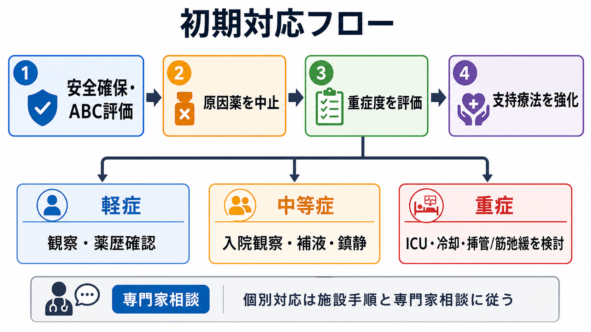
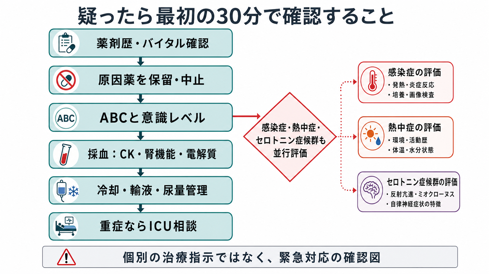
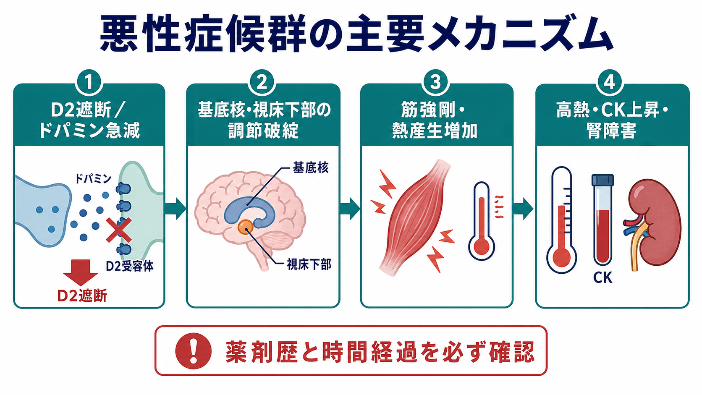

# 悪性症候群への初期対応とは何か

## 要点

- 悪性症候群 neuroleptic malignant syndrome, NMS は、[[抗精神病薬とは何か|抗精神病薬]]などのドパミン遮断薬、またはドパミン作動薬の急な中止に関連して起こりうる、まれだが致死的になりうる救急疾患である[1][2]。
- 典型的には、意識変容、筋強剛、発熱、自律神経不安定を組み合わせて疑う。CK上昇や横紋筋融解は重症度と合併症評価に役立つが、検査値だけで診断を確定しない[2][3]。
- 初期対応の核は、疑った時点で原因薬を保留・中止し、ABC、冷却、輸液、電解質補正、腎障害・不整脈・呼吸不全への監視を始めることである[1][2][4]。
- セロトニン症候群、悪性緊張病、熱中症、感染症、非けいれん性てんかん重積などを並行して評価する。鑑別のために対応を遅らせない[2][4]。
- 重症例ではICU、救急、精神科、神経内科、薬剤部へ早期に連絡する。ブロモクリプチン、アマンタジン、ダントロレン、ベンゾジアゼピン、ECTなどは、重症度・鑑別・施設手順に基づいて専門的に検討する[2][4][5]。

## この記事で答える問い

1. 悪性症候群を疑ったとき、最初に何を止め、何を支えるべきか。
2. どの検査と観察が、初期対応と重症度判断に必要か。
3. どの時点で救急・ICU・精神科・神経内科・薬剤師へつなぐべきか。

## まず結論

悪性症候群への初期対応は、「診断名を完全に確定してから治療する」手順ではない。抗精神病薬開始・増量・持効性注射・制吐薬使用・ドパミン作動薬中止などの時間関係に、意識変容、筋強剛、発熱、自律神経不安定が重なれば、まず原因薬を止め、全身管理を開始する[1][2]。

実務上は、次の順番で考える。

| 優先順位 | 行動 | 目的 |
|---|---|---|
| 1 | 薬剤歴と発症時期を確認し、疑わしい原因薬を保留・中止する | ドパミン遮断またはドパミン急減の継続を止める |
| 2 | ABC、意識レベル、体温、血圧、脈拍、呼吸数、SpO2を評価する | 呼吸不全、循環不安定、誤嚥、ショックを見逃さない |
| 3 | 冷却、輸液、尿量管理、電解質補正を始める | 高熱、脱水、横紋筋融解、急性腎障害を抑える |
| 4 | CK、腎機能、電解質、肝機能、血算、凝固、尿ミオグロビンなどを確認する | 合併症と鑑別診断を評価する |
| 5 | 救急・ICU・精神科・神経内科・薬剤師へ連絡する | 気道管理、鎮静、薬物治療、再開計画をチームで決める |

ここでの記述は教育・研究目的の整理であり、個別症例の診断や治療指示ではない。実際の対応は施設の救急手順、主治医・専門科判断、添付文書、地域の医療体制に従う。

## 背景

悪性症候群は、頻度は高くないが、遅れると横紋筋融解、急性腎障害、DIC、不整脈、呼吸不全、誤嚥、死亡につながりうる[2][4]。古い報告では死亡率が高かったが、早期認識と支持療法、集中治療の普及により低下してきたとされる[1][2]。

原因薬は典型抗精神病薬だけではない。第二世代抗精神病薬、制吐薬のメトクロプラミドやプロクロルペラジン、ドパミン作動薬の急な中止、まれにリチウム併用なども関係しうる[1][2][3]。したがって、精神科入院中だけでなく、一般病棟、救急外来、在宅療養、パーキンソン病治療中の薬剤変更でも念頭に置く。

## 基本概念

### 疑う入口

悪性症候群を疑う入口は、単一の検査値ではなく「薬剤歴と症候群の組み合わせ」である。特に以下の組み合わせは危険信号になる[1][2][4]。

- 抗精神病薬の開始、増量、注射製剤、急な切替、複数併用のあとに発熱や意識変容が出た。
- 制吐薬など、ドパミン遮断作用をもつ薬剤の使用後に筋強剛や自律神経不安定が出た。
- パーキンソン病治療薬などのドパミン作動薬を急に減量・中止したあとに、強剛、発熱、意識変容が出た。
- CK上昇、ミオグロビン尿、腎機能悪化、白血球増多、代謝性アシドーシスなどが加わる。

### 初期対応で見るべき検査

検査は診断確定のためだけでなく、合併症を見つけるために行う。CK、腎機能、電解質、血糖、カルシウム、マグネシウム、肝機能、血算、凝固系、尿ミオグロビン、動脈血ガス、心電図、感染症評価、必要時の髄液・画像・脳波などを、臨床状況に応じて組み合わせる[2][3][4]。

## 仕組み

悪性症候群の機序は完全には単純化できないが、中心仮説は「中枢ドパミン機能の急な低下」である。D2受容体遮断、またはドパミン作動薬の急な中止により、基底核の運動調節や視床下部の体温・自律神経調節が破綻し、筋強剛、熱産生増加、高熱、自律神経不安定につながると考えられる[1][3]。

筋強剛が続くと、筋細胞障害と横紋筋融解が起こり、CK上昇、ミオグロビン尿、急性腎障害のリスクが高まる。発汗、発熱、摂取不良、拘束、不穏、感染、脱水は、腎障害と循環不安定をさらに悪化させうる[2][3]。

## 図解

この記事の図は、以下の3点を強調している。

1. 初期対応は、薬剤歴確認、原因薬中止、安全確保、重症度評価、支持療法、専門科相談を並行して進める。
2. 機序は、ドパミン遮断またはドパミン急減から、運動・体温・自律神経調節の破綻、筋強剛、熱産生、横紋筋融解へつながる。
3. 鑑別診断は重要だが、感染症や熱中症を評価している間も、全身管理と原因薬中止を遅らせない。

## 臨床・研究との接続

### 原因薬の扱い

原因薬の中止は初期対応の中心である[1][2][4]。ただし、精神病症状、躁状態、せん妄、パーキンソン症状などが同時に問題になるため、単に「全部の向精神薬を永続的に止める」という意味ではない。急性期には疑わしいドパミン遮断薬を止め、再開や代替薬は回復後に専門科で再評価する。再導入では、十分な回復期間、低用量、慎重な漸増、脱水回避、再発徴候の監視が重要とされる[2]。

### 全身管理

悪性症候群の初期対応は、精神科副作用対応であると同時に、救急・集中治療の問題である。高熱には物理的冷却を行い、脱水や横紋筋融解には輸液と尿量管理を考える。電解質異常、不整脈、呼吸不全、誤嚥、腎不全、DICを監視し、必要なら気道管理やICU管理を検討する[2][4]。

### 薬物療法と専門科連携

重症例や改善が乏しい例では、ブロモクリプチンやアマンタジンなどのドパミン作動薬、筋強剛や高熱に対するダントロレン、興奮や緊張病性要素に対するベンゾジアゼピンが検討されることがある[2][4][5]。ただし、これらの根拠は主に症例報告、観察研究、レビュー、ガイドライン比較に基づき、RCTで確立した一律の標準治療ではない[4][5]。そのため、薬剤選択はICU、救急、精神科、神経内科、薬剤師が、鑑別診断と禁忌を確認して決める。

悪性緊張病との境界が問題になる場合、[[緊張病とは何か]]、[[悪性緊張病とは何か]]の評価も重要である。治療抵抗例や緊張病性要素が強い例ではECTが報告されるが、これは施設体制と専門的判断を要する[2][6]。

### 鑑別診断

悪性症候群と似る病態には、[[セロトニン症候群とは何か|セロトニン症候群]]、悪性緊張病、熱中症、敗血症や髄膜炎・脳炎、抗コリン中毒、薬物中毒、非けいれん性てんかん重積、悪性高熱症などがある[2][4][7]。セロトニン症候群では腱反射亢進やクローヌス、消化器症状、セロトニン作動薬との時間関係が手がかりになることが多いが、実際には混在や非典型例もある[7]。鑑別は、薬剤歴、神経所見、体温経過、検査、感染症評価、必要時の脳波・髄液・画像を使って進める。

## よくある誤解

### 「発熱がないから悪性症候群ではない」

典型例では高熱が目立つが、早期・非典型例では発熱が遅れることがある。薬剤歴、意識変容、筋強剛、自律神経症状、CK上昇を合わせて見る必要がある[2][3]。

### 「CKが高いから悪性症候群で確定」

CK上昇は重要だが、けいれん、筋注、外傷、拘束、長時間不動、熱中症、横紋筋融解の別原因でも上がる。逆に早期にはCKがまだ高くないこともあるため、検査値だけで確定・除外しない[3][4]。

### 「精神科の副作用なので、精神科だけで対応する」

悪性症候群は身体合併症の管理が予後を左右する。呼吸、循環、体温、腎機能、電解質、凝固、感染症評価が必要であり、救急・ICU・内科・神経内科・薬剤師との連携が初期から必要になる[2][4]。

### 「原因薬を止めれば、それだけで十分」

原因薬中止は必須だが、それだけでは不十分なことがある。高熱、脱水、横紋筋融解、腎障害、不整脈、呼吸不全は並行して進むため、支持療法と監視を同時に行う[1][2][4]。

## 関連ノート

- [[抗精神病薬とは何か]]
- [[抗精神病薬の錐体外路症状とは何か]]
- [[セロトニン症候群とは何か]]
- [[緊張病とは何か]]
- [[悪性緊張病とは何か]]
- [[薬剤性アカシジアとは何か]]
- [[薬物過量服薬とは何か]]
- [[興奮状態への対応はどう行うか]]
- [[医療安全とは何か]]

## 理解チェック

1. 悪性症候群を疑ったとき、原因薬の扱いと全身管理をどの順番で考えるか。
2. CK上昇は、診断確定と重症度評価のどちらにより役立つか。
3. セロトニン症候群や悪性緊張病との鑑別を進めながら、初期対応を遅らせない理由は何か。
4. 精神科、救急、ICU、神経内科、薬剤師の連携が必要になる場面はどこか。

## 関連ノート候補

- 悪性症候群とは何か
- 抗精神病薬の重篤副作用をどう監視するか
- 向精神薬中止後の身体リスクとは何か
- ICUと精神科リエゾンはどう連携するか

## MOC更新候補

- `content/00_MOC/` 配下に医療安全・危機対応、薬物療法、精神科救急のMOCがある場合、本記事を「重篤副作用」「身体救急」「抗精神病薬安全管理」の近くに追加する。
- 並列ジョブとの競合を避けるため、この作業ではMOC本体は更新しない。

## 未解決問題

- 悪性症候群の薬物療法は、重症度や鑑別診断によって選択が変わるが、RCTに基づく強固な比較エビデンスは限られる[4][5]。
- 第二世代抗精神病薬や持効性注射製剤に関連する非典型的な悪性症候群を、どのようなモニタリングで早期に拾うかは、臨床現場の安全設計と教育に依存する。
- 回復後の抗精神病薬再導入では、再発リスク、原疾患の再燃リスク、本人の価値観、薬剤選択をどう統合するかが課題になる[2]。

## 参考文献

[1] Berman BD. Neuroleptic Malignant Syndrome: A Review for Neurohospitalists. *The Neurohospitalist*. 2011;1(1):41-47. https://doi.org/10.1177/1941875210386491

[2] Simon LV, Hashmi MF, Callahan AL. Neuroleptic Malignant Syndrome. *StatPearls*. Last update 2023-04-24. https://www.ncbi.nlm.nih.gov/books/NBK482282/

[3] Oruch R, Pryme IF, Engelsen BA, Lund A. Neuroleptic malignant syndrome: an easily overlooked neurologic emergency. *Neuropsychiatric Disease and Treatment*. 2017;13:161-175. https://doi.org/10.2147/NDT.S118438

[4] Yip K, Tanen D. Neuroleptic Malignant Syndrome. *Merck Manual Professional Edition*. Reviewed/Revised May 2025, Modified Nov 2025. https://www.merckmanuals.com/professional/injuries-poisoning/heat-illness/neuroleptic-malignant-syndrome

[5] Schönfeldt-Lecuona C, Kuhlwilm L, Cronemeyer M, et al. Treatment of the neuroleptic malignant syndrome in international therapy guidelines: a comparative analysis. *Pharmacopsychiatry*. 2020;53(2):51-59. https://doi.org/10.1055/a-1046-1044

[6] Rosebush PI, Stewart T, Mazurek MF. The treatment of neuroleptic malignant syndrome: are dantrolene and bromocriptine useful adjuncts to supportive care? *The British Journal of Psychiatry*. 1991;159:709-712. https://doi.org/10.1192/bjp.159.5.709

[7] Boyer EW, Shannon M. The serotonin syndrome. *New England Journal of Medicine*. 2005;352(11):1112-1120. https://doi.org/10.1056/NEJMra041867

[8] Wijdicks EFM, Ropper AH. Neuroleptic Malignant Syndrome. *New England Journal of Medicine*. 2024;391(12):1130-1138. https://doi.org/10.1056/NEJMra2404606

