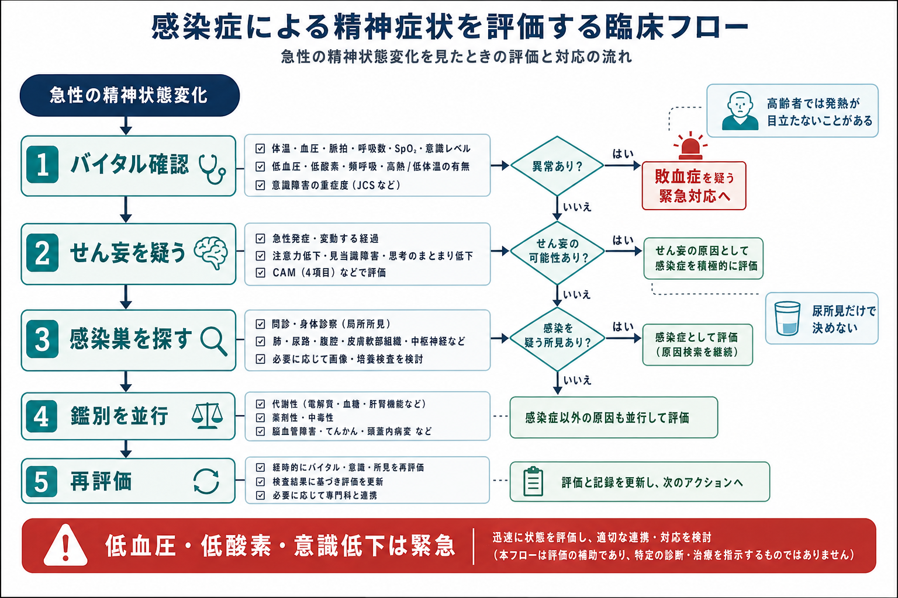

# 感染症による精神症状をどう評価するか

## 要点

- 感染症による精神症状は、幻覚や興奮だけでなく、注意障害、ぼんやりする、眠気、拒否、食欲低下、転倒、日内変動として現れることがある。
- まず見るべき軸は、急性発症・変動性・注意障害から[[せん妄への危機対応とは何か]]を疑うこと、同時にバイタルサインと感染巣を確認することである[1][2]。
- 高齢者やフレイルのある人では、感染があっても発熱や局所痛が目立たず、意識変容やADL低下だけが初期症状になることがある[3]。
- 尿所見や培養陽性だけで「感染による精神症状」と決めつけない。高齢者の無症候性細菌尿では、尿路症状や発熱・循環不安定がなければ、他原因の評価と慎重な観察が推奨される[4]。
- 低血圧、低酸素、頻呼吸、低体温、意識レベル低下、尿量低下、強い全身状態悪化があれば、敗血症を含む身体救急として扱う[5][6]。

## この記事で答える問い

1. 発熱や炎症と精神症状を、どの順番で結びつけて考えるか。
2. 感染症によるせん妄を、うつ、不安、精神病症状、認知症、薬剤性の変化とどう区別し始めるか。
3. 高齢者の「発熱がない感染」「尿検査だけが陽性」の場面で、何を過大評価し、何を見落としやすいか。
4. 精神科・心理臨床の場面で、どこから[[身体疾患の見逃しを防ぐ精神科初期対応とは何か]]や救急連携へ切り替えるか。

## まず結論

感染症による精神症状を評価するときは、「精神症状の名前」を先に決めるより、**急性変化、注意障害、変動性、バイタル異常、感染巣、薬剤・代謝・低酸素の鑑別**を同時に見る。感染症はせん妄の代表的な誘因だが、精神症状のすべてを感染で説明してよいわけではない。特に高齢者では、尿検査陽性、微熱、CRP上昇のような断片的情報が、せん妄の原因推定を過度に単純化しやすい。

実践上は、次の三層で評価する。

| 層 | 見ること | 目的 |
|---|---|---|
| 危険度 | 意識、呼吸、循環、体温、SpO2、尿量、脱水 | 敗血症・低酸素・ショックを見逃さない |
| 症候 | 急性発症、注意障害、睡眠覚醒リズム、日内変動、幻覚、活動性 | せん妄として整理できるかを見る |
| 原因 | 肺炎、尿路感染、皮膚軟部組織感染、腹部感染、薬剤、離脱、代謝異常 | 感染だけでなく複数原因を並行評価する |

このノートは教育・研究目的の整理であり、個別症例の診断や治療指示ではない。実際の対応は施設手順、診療科連携、救急・感染症・高齢者医療の判断に従う。

## 背景

せん妄は、高齢者に多い急性の注意・認知の障害であり、急性発症、変動性、注意障害を確認することが診断の中心になる[2]。感染症、脱水、低酸素、疼痛、睡眠障害、薬剤、入院環境は、単独または複合してせん妄を引き起こす[2][7]。NICEのせん妄ガイドラインも、認知、知覚、身体機能、社会的行動の急性変化を見たときに、せん妄を疑うことを推奨している[1]。

精神科・心理臨床では、感染症による精神症状は二重に見落とされやすい。一つは、興奮、幻覚、被害的訴え、不眠、拒薬が「精神症状」として処理され、身体評価が遅れる見落としである。もう一つは、尿検査陽性や炎症反応だけを根拠に「感染だから」と決めつけ、薬剤性、低酸素、頭蓋内疾患、便秘・尿閉、アルコール離脱、[[リチウム中毒への初期対応とは何か]]などの鑑別が狭くなる見落としである。

## 基本概念

### 感染症による精神症状は「脳だけの問題」ではない

感染症では、病原体そのものだけでなく、発熱、炎症性サイトカイン、循環変化、低酸素、代謝異常、疼痛、脱水、睡眠分断、治療薬の影響が重なり、注意・覚醒・知覚・行動が乱れる[7][8]。そのため、感染症による精神症状は「脳内で何かが起きている」と同時に、「全身状態の破綻が脳機能に反映されている」と捉える。

### せん妄として見る

感染症関連の精神症状で最も重要なのはせん妄である。せん妄は、幻覚や興奮の有無だけで判断しない。むしろ、注意を保てない、会話がずれる、日付や場所があいまい、昼夜逆転する、普段より反応が遅い、ぼんやりして食事や水分摂取が落ちる、といった変化が入口になる[1][2]。

### 高齢者では発熱が目立たないことがある

フレイルのある高齢者では、感染しても標準的な発熱基準を満たさないことがあり、局所痛や炎症症状も弱いことがある。肺炎や尿路感染でも、精神状態の変化やADL低下が初期の目立つ所見になる場合がある[3]。したがって、「熱がないから感染ではない」とも、「ぼんやりしているだけだから精神症状」とも決めない。

### 尿所見だけで決めない

高齢者では無症候性細菌尿が多く、尿検査や尿培養の陽性が、精神症状の原因を必ず意味するわけではない。IDSAは、機能・認知障害のある高齢者で細菌尿とせん妄があっても、尿路症状や発熱・循環不安定などの全身感染徴候がなければ、抗菌薬治療よりも他原因の評価と慎重な観察を推奨している[4]。これは感染を軽視するためではなく、過剰治療と見落としを同時に避けるためである。

## 仕組み

感染症が精神症状を起こす過程は、単一経路ではない。末梢感染で免疫反応が起こると、サイトカインや急性期反応、内皮機能、血液脳関門、神経伝達、視床・脳幹覚醒系、前頭葉ネットワークが影響を受けると考えられている[7][8]。さらに脱水、低酸素、低血圧、腎機能低下、薬剤蓄積、抗コリン作用、疼痛、睡眠不足が加わると、せん妄の閾値が下がる[2][7]。

この仕組みを臨床で使うときは、「感染があるか」だけでなく、次の増幅因子を確認する。

| 増幅因子 | 具体例 | 見落とすと起こること |
|---|---|---|
| 低酸素 | 肺炎、誤嚥、COPD増悪、睡眠時低換気 | 不穏、眠気、注意障害を精神症状と誤認する |
| 循環不全 | 低血圧、脱水、敗血症、出血 | 意識変容を心理的反応と誤認する |
| 薬剤 | 抗コリン薬、ベンゾジアゼピン、オピオイド、ステロイド、抗菌薬の副作用 | [[薬剤副作用の早期発見はどう行うか]]が遅れる |
| 代謝 | 低血糖、高血糖、電解質異常、腎不全、肝不全 | 感染だけに注目して補正可能な原因を逃す |
| 環境 | 睡眠分断、拘束、感覚遮断、疼痛、尿閉、便秘 | せん妄が持続・悪化する |

## 図解

評価は、緊急度を先に見て、その後に原因推定を狭める。低血圧、低酸素、低体温または高熱、頻呼吸、意識レベル低下、尿量低下、強い全身状態悪化がある場合は、敗血症を含む身体救急として扱い、精神科的な説明だけで止めない[5][6]。

| ステップ | 確認すること | 判断のポイント |
|---|---|---|
| 1. バイタル | 体温、血圧、脈拍、呼吸数、SpO2、意識、尿量 | 異常があれば精神症状の評価より先に身体救急の導線を確認する |
| 2. せん妄 | 急性発症、変動性、注意障害、睡眠覚醒リズム | 興奮型だけでなく低活動型せん妄を探す |
| 3. 感染巣 | 咳、痰、呼吸苦、排尿痛、頻尿、腹痛、下痢、皮膚発赤、褥瘡、カテーテル | 局所症状が乏しくても診察と経過で補う |
| 4. 鑑別 | 薬剤、離脱、低酸素、低血糖、電解質、頭蓋内疾患、便秘・尿閉 | 感染があっても他原因の併存を前提にする |
| 5. 再評価 | 時間経過、治療反応、家族情報、普段との差 | 一回の検査値で確定せず、変化を記録する |

## 臨床・研究との接続

臨床では、感染症による精神症状は[[医療安全とは何か]]と直結する。せん妄を見逃すと、転倒、誤嚥、ライン抜去、拒薬、離院、過鎮静、身体拘束の増加につながりうる。したがって、[[転倒転落リスク管理とは何か]]、[[誤嚥窒息リスク管理とは何か]]、[[身体拘束の適応とリスク管理とは何か]]を、原因評価と切り離さずに扱う。

研究では、感染症関連せん妄を評価するとき、感染巣、炎症マーカー、バイタル、低酸素、薬剤負荷、基礎認知機能、フレイル、睡眠、疼痛、入院環境を分けて測定する必要がある。炎症仮説は有力だが、炎症反応だけでせん妄を説明するのは不十分であり、神経伝達、血管内皮、脳予備能、環境因子を含めた多因子モデルとして扱うのが妥当である[7][8]。

## よくある誤解

### 誤解1: 熱がないなら感染症ではない

高齢者やフレイルのある人では、感染しても発熱が弱いことがある。低体温や普段より低い活動性、食欲低下、転倒、意識変容が入口になる場合がある[3]。

### 誤解2: 尿検査が陽性なら、精神症状の原因は尿路感染である

尿所見は重要な手がかりだが、高齢者では無症候性細菌尿が多い。尿路症状や全身感染徴候がない場合、尿所見だけで抗菌薬治療や原因確定に進むと、薬剤有害事象や耐性菌、別原因の見落としにつながる[4]。

### 誤解3: 幻覚や興奮がなければせん妄ではない

低活動型せん妄では、静かになる、眠ってばかりいる、反応が遅い、食事が進まない、会話が途切れるといった形で現れる。非常に見落とされやすく、予後にも関わる[2]。

### 誤解4: 感染症が見つかれば、精神症状の評価は終わりである

感染症は原因の一部であり、薬剤、脱水、低酸素、疼痛、便秘、尿閉、睡眠分断、環境変化が重なっていることが多い。感染治療と並行して、せん妄を増幅する要因を下げる必要がある[1][2]。

## 関連ノート

- [[せん妄への危機対応とは何か]]
- [[身体疾患の見逃しを防ぐ精神科初期対応とは何か]]
- [[医療安全とは何か]]
- [[薬剤副作用の早期発見はどう行うか]]
- [[転倒転落リスク管理とは何か]]
- [[誤嚥窒息リスク管理とは何か]]
- [[悪性症候群への初期対応とは何か]]
- [[セロトニン症候群への初期対応とは何か]]

### MOC更新候補

- `content/00_MOC/` 配下の臨床実践・医療安全系MOCに、バッチ統合時に追加する。
- せん妄、身体疾患見逃し、感染症・救急評価を横断する索引がある場合は、本記事を「精神症状の身体因評価」の入口として配置する。

### 今後の作成候補

- 高齢者の非典型感染症状をどう評価するか
- 尿所見陽性とせん妄をどう解釈するか
- 感染症関連せん妄の家族説明
- 精神科病棟で敗血症を疑うサイン

## 理解チェック

1. 急性の幻覚や興奮を見たとき、精神症状の評価と同時に確認すべきバイタルサインは何か。
2. 高齢者の細菌尿とせん妄を見たとき、尿路症状や全身感染徴候がない場合に注意すべき解釈は何か。
3. 低活動型せん妄を見逃さないために、家族や介護者から聞くべき「普段との差」は何か。
4. 感染症が見つかった後も、薬剤・低酸素・脱水・便秘・尿閉を評価し続ける理由は何か。

## 未解決問題

- 炎症マーカーやサイトカインが、個々の症例でせん妄の原因推定にどこまで使えるかは限界がある。
- 高齢者の非典型感染症状では、過少診断と過剰抗菌薬使用の両方をどう減らすかが実践上の課題である。
- 精神科病棟や介護施設で、せん妄評価、感染評価、救急搬送判断をどのように標準化するかは、施設ごとの検討が必要である。

## 参考文献

[1] National Institute for Health and Care Excellence. (2010, updated 2023). *Delirium: prevention, diagnosis and management in hospital and long-term care* (CG103). https://www.nice.org.uk/guidance/cg103/chapter/1-recommendations

[2] Inouye, S. K., Westendorp, R. G. J., & Saczynski, J. S. (2014). Delirium in elderly people. *The Lancet, 383*(9920), 911-922. https://doi.org/10.1016/S0140-6736(13)60688-1

[3] Merck Manual Professional Edition. (Reviewed/Revised 2024; modified 2025). *Fever: Geriatrics Essentials*. https://www.merckmanuals.com/professional/infectious-diseases/biology-of-infectious-disease/fever

[4] Nicolle, L. E., Gupta, K., Bradley, S. F., et al. (2019). Clinical Practice Guideline for the Management of Asymptomatic Bacteriuria: 2019 Update by the Infectious Diseases Society of America. *Clinical Infectious Diseases, 68*(10), e83-e110. https://doi.org/10.1093/cid/ciy1121

[5] Centers for Disease Control and Prevention. (2026). *About Sepsis*. https://www.cdc.gov/sepsis/about/index.html

[6] Evans, L., Rhodes, A., Alhazzani, W., et al. (2021). Surviving Sepsis Campaign: International Guidelines for Management of Sepsis and Septic Shock 2021. *Intensive Care Medicine, 47*, 1181-1247. https://www.sccm.org/survivingsepsiscampaign/guidelines-and-resources/surviving-sepsis-campaign-adult-guidelines

[7] Merck Manual Professional Edition. (Modified 2025). *Delirium*. https://www.merckmanuals.com/professional/neurologic-disorders/delirium-and-dementia/delirium

[8] Cerejeira, J., Firmino, H., Vaz-Serra, A., & Mukaetova-Ladinska, E. B. (2010). The neuroinflammatory hypothesis of delirium. *Acta Neuropathologica, 119*(6), 737-754. https://doi.org/10.1007/s00401-010-0674-1
