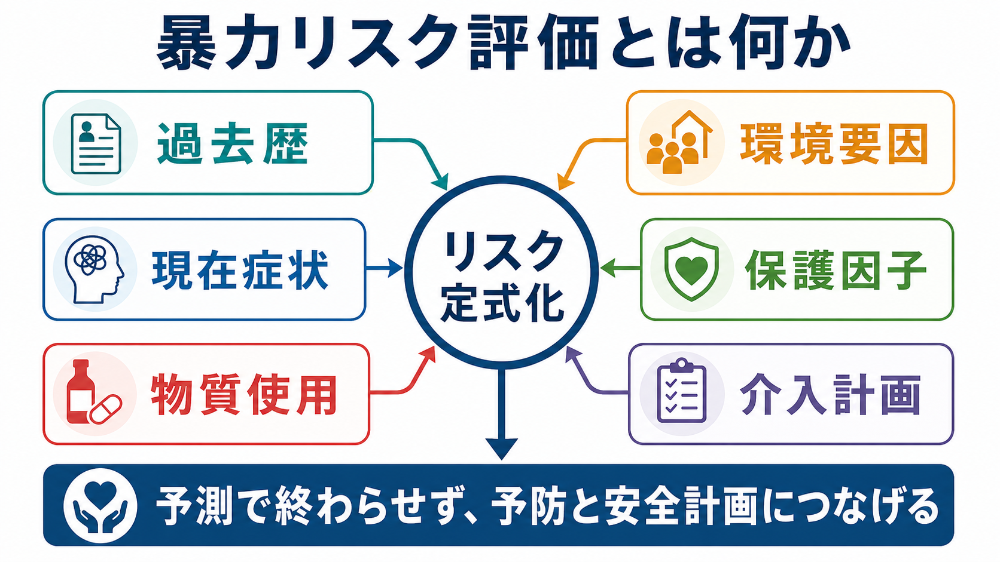
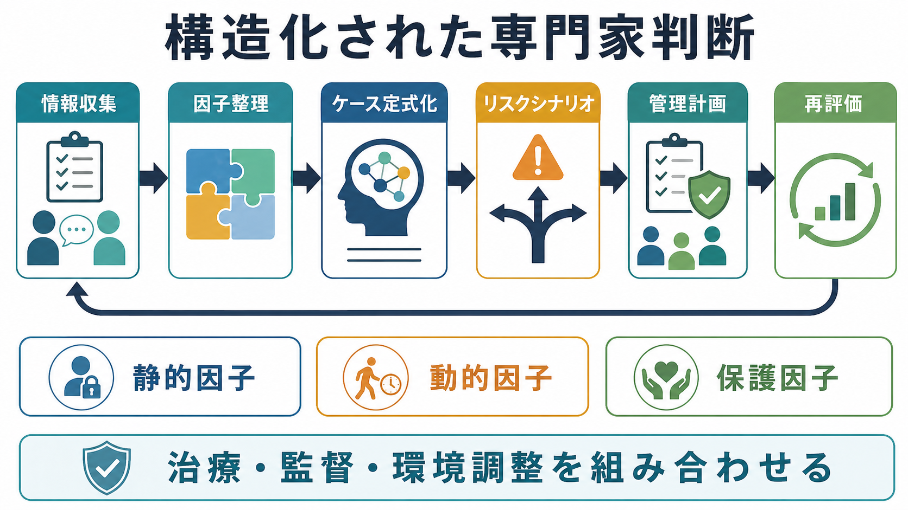

# 暴力リスク評価とは何か

## 要点

- 暴力リスク評価とは、「この人は危険か」を一度だけ判定する作業ではなく、過去歴、現在の症状、物質使用、環境要因、保護因子を統合し、どの状況で、どのような暴力が、どの程度起こりやすいかを定式化する作業である。
- 目的は予言ではなく、予防である。評価結果は、観察、環境調整、治療、物質使用への支援、家族・地域・司法との連携、[[クライシスプランとは何か]]などの安全計画へ変換されて初めて意味をもつ。
- 構造化されていない臨床判断だけに頼るより、BVC や HCR-20 V3 のような構造化された道具を使う方が、評価項目、根拠、見直し時点を明示しやすい[1][2][3]。
- ただし、リスク評価尺度は個人の将来を正確に予測する装置ではない。メタ分析では暴力リスク評価ツールの陰性的中率は比較的高い一方、陽性的中率には限界があり、拘束・退院・司法判断の唯一の根拠にすることは支持されていない[2]。
- 精神疾患そのものを暴力と短絡させてはならない。暴力リスクは、急性精神症状、物質使用、被害体験、生活困窮、対人葛藤、環境の混雑、治療中断、支援の断絶などが組み合わさって上がる[4][5]。

## この記事で答える問い

1. 暴力リスク評価は、通常の診断面接や医療安全と何が違うのか。
2. どのようなリスク因子と保護因子を確認するのか。
3. 「構造化された専門家判断」は何を構造化しているのか。
4. 評価結果を、臨床・病棟運営・地域支援・研究にどう接続するのか。
5. 暴力リスク評価が、偏見や過剰な制限にならないために何が必要か。

## まず結論

暴力リスク評価は、危険人物を見つけて排除するための分類ではない。より正確には、「暴力が起こりやすくなる条件」と「暴力を起こりにくくする条件」を、本人・支援者・環境の相互作用として整理し、介入可能な点を見つけるための臨床的推論である。NICE は、過去の暴力・攻撃エピソード、引き金、症状や感情、環境要因、過去に有効だったディエスカレーションや制限的介入を、本人と可能なら介護者を含めて確認し、定期的に見直すことを推奨している[1]。

したがって評価の成果物は、「低・中・高」というラベルだけでは不十分である。必要なのは、たとえば「睡眠不足と飲酒が重なり、被害的解釈が強くなり、住居で家族との接触が増える時に、言語的威嚇から物損へ進みやすい。保護因子は本人が支援者に相談できること、内服継続、家族が早期サインを把握していること」というようなケース定式化である。ここから観察頻度、薬物療法、心理社会的支援、物質使用への介入、連絡手順、避難・距離確保、再評価時点を決める。

## 背景

医療・福祉・地域支援の現場では、暴力や攻撃性は本人、家族、他の利用者、職員の安全に直接関わる。NICE NG10 は、暴力と攻撃性を、身体的か言語的か、身体的損傷が実際に生じたか、意図が明確かにかかわらず、他者に害・痛み・傷害をもたらしうる行動として広く定義している[1]。この広い定義は、殴打のような明白な暴力だけでなく、威嚇、物損、激しい言語的攻撃、急迫した他害の示唆を含めて、早期に予防するためのものである。

一方で、暴力リスク評価はスティグマと隣り合わせである。MacArthur Violence Risk Assessment Study の退院後追跡研究は、急性精神科入院から退院した人の暴力を、同じ地域に住む比較対象と照らして検討した代表的研究であり、「精神疾患があるから危険」と単純化できないことを示した[4]。実際のリスクは、性別、年齢、過去の暴力、物質使用、症状、生活環境、社会的支援、被害体験などの複数要因に依存する。

特に物質使用は重要である。統合失調症や他の精神病性障害と暴力に関するメタ分析では、物質使用を伴わない場合の関連は相対的に小さく、物質使用併存がある場合にリスク推定値が大きく上がることが示された[5]。これは、精神病性障害の人を一律に危険視する根拠ではなく、むしろ[[依存症の回復支援とは何か]]や生活支援をリスク管理の中心に置くべきことを示す。

## 基本概念

### 暴力リスク

暴力リスクは、「ある人に固定された属性」ではなく、「ある時間幅・状況・対象・行動様式に関する確率的な見立て」である。病棟内での24時間以内の攻撃性、退院後数か月の対人暴力、家庭内での威嚇、物質使用時の衝動的暴力では、必要な情報も介入も異なる。

そのため評価では、少なくとも次を分ける。

| 観点 | 確認する内容 |
|---|---|
| 時間幅 | 今から数時間、24時間、入院中、退院後、地域生活のどの局面か |
| 対象 | 家族、医療者、同室者、不特定他者、特定の被害者候補 |
| 行動 | 言語的威嚇、物損、接近、身体暴力、武器使用、性的暴力 |
| 状況 | せん妄、躁状態、被害妄想、飲酒、離脱、不眠、拒否場面、退院・外泊 |
| 保護因子 | 支援関係、服薬継続、相談能力、住居、家族協力、本人の価値観 |

### 静的因子・動的因子・保護因子

静的因子は、過去の暴力、若年期からの行動問題、司法歴、被害歴など、今すぐ変えにくい因子である。これらはベースラインの注意水準を上げるが、介入対象としては限界がある。

動的因子は、現在の精神症状、怒り、恐怖、睡眠不足、服薬中断、飲酒・薬物使用、住居不安、対人葛藤、病棟の混雑、拘束感、職員との関係など、短期に変化しうる因子である。臨床実践では、動的因子を見つけて下げることが中心になる。

保護因子は、暴力を起こしにくくする条件である。本人が助けを求められる、支援者を信頼している、家族が早期サインを知っている、薬物使用を避ける環境がある、本人に守りたい役割や価値がある、といった要素が含まれる。

### 急性評価と長期評価

急性期病棟や救急外来では、次の数時間から24時間を扱う短期評価が必要になる。Brøset Violence Checklist は、混乱、易刺激性、騒がしさ、言語的威嚇、身体的威嚇、物への攻撃を確認し、入院環境での短期暴力予測に使われてきた[3][7]。これは、短時間で共有しやすい一方、長期の地域生活リスクを単独で評価する道具ではない。

一方、HCR-20 V3 は、過去歴、臨床状態、リスク管理上の問題を統合する構造化された専門家判断の代表例であり、司法精神医学、一般精神科、矯正、地域管理などで用いられる[6]。こちらは、単なる点数化よりも、リスクシナリオと管理計画を作ることを重視する。

## 仕組み

### 1. 情報収集

暴力リスク評価では、本人の語りだけでなく、診療録、家族・支援者からの情報、過去の入院・警察・司法・福祉情報、服薬状況、物質使用、生活環境を統合する。NICE は、過去の暴力・攻撃エピソードを将来リスクと関連するものとして扱い、文化・宗教・民族に基づく否定的な推測を避け、検証可能な根拠に基づいて客観的に評価することを求めている[1]。

重要なのは、本人を「尋問」するのではなく、何が起きると危険が上がり、何があると安全を保てるかを一緒に調べる姿勢である。これは[[トラウマインフォームドケアとは何か]]とも接続する。被害体験や支配される感覚をもつ人では、職員の声かけ、閉鎖環境、身体接触、突然の制限が強い脅威として体験されることがある。

### 2. リスク因子と保護因子の整理

収集した情報を、静的因子、動的因子、保護因子に分ける。過去の暴力や司法歴は再発の手がかりになるが、それだけで現在の危険を決めない。むしろ、いま変えられる要因を特定する。

たとえば、被害妄想、命令性幻聴、躁状態、せん妄、認知症に伴う誤認、強い不安や怒り、離脱症状、疼痛、睡眠不足は、急性の動的因子になりうる。物質使用、服薬中断、経済的困窮、住居不安、支援者との断絶、家族との葛藤も重要である[5]。一方、本人が「暴力は避けたい」と明確に語れる、過去に助けを求めて危機を乗り切った、家族が早期サインを把握している、[[薬物療法のアドヒアランスをどう支えるか]]に沿った服薬支援がある、などは保護因子になる。

### 3. ケース定式化

ケース定式化は、「なぜこの人が、どの状況で、どの対象に、どのような行動を取りやすいのか」を文章で説明する作業である。ここでは診断名よりも、時間的連鎖を重視する。

例として、次のように書ける。

> 過去に飲酒後の家族への威嚇と物損がある。現在は不眠、被害的解釈、服薬中断、退院への焦りが重なっている。家族からの拒否や金銭要求が通らない場面で怒りが上がり、言語的威嚇から物損へ進むリスクがある。保護因子は、本人が主治医には相談できること、飲酒を避ける意思があること、家族が事前連絡に応じられることである。

この文章があれば、観察、環境調整、退院調整、家族面談、物質使用への支援、緊急時連絡を具体化できる。

### 4. リスクシナリオと管理計画

HCR-20 V3 などの構造化された専門家判断では、リスク因子の有無を確認するだけでなく、可能性のあるリスクシナリオを作る[6]。シナリオは、誰に対して、どの状況で、どの程度深刻な行動が、どのくらい差し迫って起こりうるかを整理する。

管理計画は、リスク因子を下げ、保護因子を増やすための実行計画である。病棟では、刺激の少ない環境、ディエスカレーション、短時間の観察強化、疼痛やせん妄の治療、薬物療法の見直し、チーム内の共有が含まれる。地域では、訪問頻度、家族との連絡手順、飲酒・薬物使用への支援、住居・金銭・就労の調整、警察・保護観察・福祉との情報共有が含まれる。

### 5. 再評価

暴力リスクは変化する。NICE は、リスク評価と管理計画を定期的に見直し、リスク水準に応じて見直し頻度を変えることを推奨している[1]。再評価のタイミングは、入退院、外泊、退院直後、服薬変更、物質使用再開、睡眠悪化、家族葛藤、司法手続き、重大な喪失、病棟内トラブル、隔離・拘束後などである。

## 図解

1枚目の図は、暴力リスク評価を「過去歴」「現在症状」「物質使用」「環境要因」「保護因子」「介入計画」からリスク定式化へつなぐ概念地図として示している。2枚目の図は、構造化された専門家判断を、情報収集、因子整理、ケース定式化、リスクシナリオ、管理計画、再評価の循環として示している。

画像はあくまで理解補助であり、実際の臨床判断は、所属機関の手順、法制度、専門職の監督、本人の権利保障に沿って行う。

## 臨床・研究との接続

### 医療安全

暴力リスク評価は[[精神科医療安全の特徴は何か]]の一部である。医療安全として重要なのは、本人の自由を不必要に制限せず、他者の安全も守ることである。制限的介入は、最後の手段として、必要最小限、最短時間、説明と記録、解除後の振り返りを伴って使われるべきである[1]。

### 自殺リスク評価との違い

[[自殺リスクへの危機対応とは何か]]と暴力リスク評価は、どちらも危機対応であり、予測より安全計画を重視する。しかし、自殺リスクでは本人の苦痛、希死念慮、手段アクセス、孤立が中心になりやすいのに対し、暴力リスクでは対象者、被害者候補、対人距離、環境、職員・家族の安全、守秘義務と情報共有の限界がより前面に出る。

### 薬物療法と心理社会的介入

薬物療法は、急性精神病症状、躁状態、せん妄、不眠、疼痛、離脱など、暴力リスクを上げる動的因子に作用しうる。ただし薬だけで安全計画は完結しない。特に反復する暴力や重い攻撃性では、症状治療、物質使用への介入、心理教育、家族支援、環境調整、リハビリテーションを組み合わせる。

統合失調症で治療抵抗性の攻撃性が問題となる場合、[[クロザピンとは何か]]が検討されることがあるが、これは個別の適応、身体リスク、モニタリング体制を含めた専門的判断であり、暴力リスク評価そのものの代替ではない。

### 研究

研究では、リスク評価ツールの性能は AUC、感度、特異度、陽性的中率、陰性的中率などで評価される。BMJ のメタ分析では、暴力リスク評価ツールの AUC は中等度で、低リスク群を同定する性能は比較的高い一方、陽性的中率には限界があった[2]。この知見は、リスク評価を「個人を正確に当てる装置」と見るのではなく、「透明性のあるリスク管理計画を作る補助」と見るべきことを示す。

## よくある誤解

### 誤解1: 暴力リスク評価は危険人物を見つけるためのもの

実際には、危険な状況を見つけるためのものである。本人の人格や診断名に危険を貼り付けると、介入可能な動的因子を見落とし、スティグマと過剰な制限を生む。

### 誤解2: 高リスクなら必ず暴力が起こる

高リスクは、条件がそろえば起こりやすいという意味であり、必然ではない。リスク評価の目的は、その条件を崩すことである。尺度の陽性的中率には限界があるため、単独で拘束・隔離・退院拒否・司法判断を決める使い方は慎重でなければならない[2]。

### 誤解3: 低リスクなら何もしなくてよい

低リスクは「現在の条件では相対的に低い」という意味である。物質使用、睡眠、服薬、対人葛藤、住居、支援者の不在が変化すれば、短期間でリスクは上がる。再評価の仕組みが必要である。

### 誤解4: 精神疾患がある人は暴力的である

これは誤りであり、臨床的にも倫理的にも有害である。研究は、精神疾患と暴力の関連が単純ではなく、物質使用や社会環境が大きく関与することを示している[4][5]。評価は偏見を補強するためではなく、本人と周囲の安全を同時に守るために使う。

### 誤解5: 評価尺度を使えば専門的判断はいらない

尺度は、確認漏れを減らし、チーム内で共有しやすくする道具である。最終的には、対象、時間幅、文脈、本人の価値、法的条件、支援資源を含めた専門家判断が必要である[6]。

## 関連ノート

- [[精神科医療安全の特徴は何か]]
- [[自殺リスクへの危機対応とは何か]]
- [[クライシスプランとは何か]]
- [[依存症の回復支援とは何か]]
- [[トラウマインフォームドケアとは何か]]
- [[薬物療法のアドヒアランスをどう支えるか]]
- [[クロザピンとは何か]]

### 関連ノート候補

- 他害リスクへの危機対応とは何か
- ディエスカレーションとは何か
- 構造化された専門家判断とは何か
- HCR-20とは何か
- BVCとは何か
- 精神科における制限的介入とは何か

### MOC更新候補

- `content/00_MOC/` 配下の臨床実践・医療安全系 MOC に追加候補。
- 並列生成ジョブとの競合を避けるため、本記事作成時点では MOC 本体は更新していない。

## 理解チェック

1. 暴力リスク評価で、診断名だけを根拠にしてはいけない理由は何か。
2. 静的因子、動的因子、保護因子の違いを、臨床例で説明できるか。
3. 「高リスク」という評価を、どのように管理計画へ変換するか。
4. BVC のような短期評価と、HCR-20 V3 のような構造化された専門家判断は、どの時間幅で使い分けるか。
5. 本人の権利と周囲の安全を同時に守るため、情報共有・制限的介入・記録で何に注意するか。

## 参考文献

[1] National Institute for Health and Care Excellence. (2015, last reviewed 2024). *Violence and aggression: short-term management in mental health, health and community settings (NICE guideline NG10).* https://www.nice.org.uk/guidance/ng10

[2] Fazel, S., Singh, J. P., Doll, H., & Grann, M. (2012). Use of risk assessment instruments to predict violence and antisocial behaviour in 73 samples involving 24,827 people: systematic review and meta-analysis. *BMJ, 345*, e4692. https://doi.org/10.1136/bmj.e4692

[3] Almvik, R., Woods, P., & Rasmussen, K. (2000). The Brøset Violence Checklist: Sensitivity, specificity, and interrater reliability. *Journal of Interpersonal Violence, 15*(12), 1284-1296. https://doi.org/10.1177/088626000015012003

[4] Steadman, H. J., Mulvey, E. P., Monahan, J., Robbins, P. C., Appelbaum, P. S., Grisso, T., Roth, L. H., & Silver, E. (1998). Violence by people discharged from acute psychiatric inpatient facilities and by others in the same neighborhoods. *Archives of General Psychiatry, 55*(5), 393-401. https://doi.org/10.1001/archpsyc.55.5.393

[5] Fazel, S., Gulati, G., Linsell, L., Geddes, J. R., & Grann, M. (2009). Schizophrenia and violence: systematic review and meta-analysis. *PLOS Medicine, 6*(8), e1000120. https://doi.org/10.1371/journal.pmed.1000120

[6] Douglas, K. S., Hart, S. D., Webster, C. D., Belfrage, H., Guy, L. S., & Wilson, C. M. (2014). Historical-Clinical-Risk Management-20, Version 3 (HCR-20V3): Development and overview. *International Journal of Forensic Mental Health, 13*(2), 93-108. https://doi.org/10.1080/14999013.2014.906519

[7] Woods, P., & Almvik, R. (2002). The Brøset violence checklist (BVC). *Acta Psychiatrica Scandinavica, 106*(s412), 103-105. https://doi.org/10.1034/j.1600-0447.106.s412.22.x

## 未解決問題

- 暴力リスク評価ツールを導入するだけで、実際の暴力発生、制限的介入、職員の傷害、本人の権利侵害がどの程度減るのかは、設定や運用に依存する。
- 日本の一般精神科、救急、地域支援で、BVC や HCR-20 V3 のような道具をどのように研修・記録・チーム運用へ組み込むかは、実装研究が必要である。
- AI や電子カルテ予測モデルを使う場合、偽陽性、偏り、説明可能性、責任の所在、本人への説明をどう扱うかが重要な倫理課題になる。
