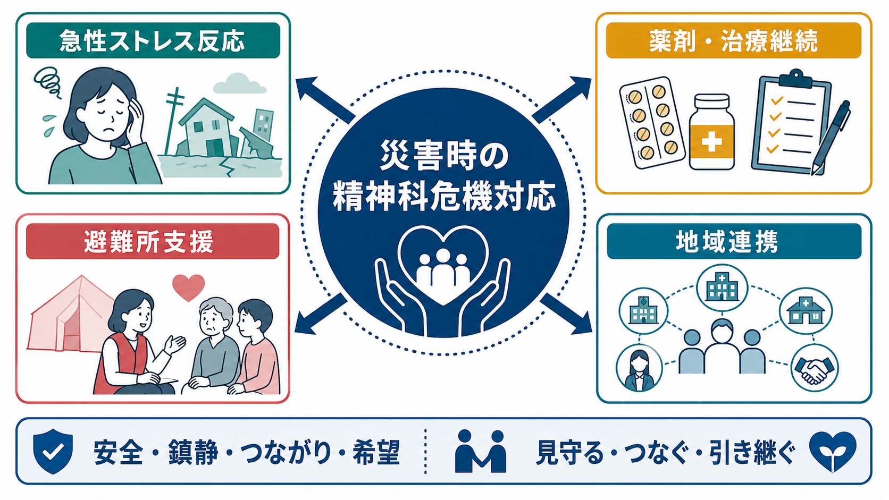
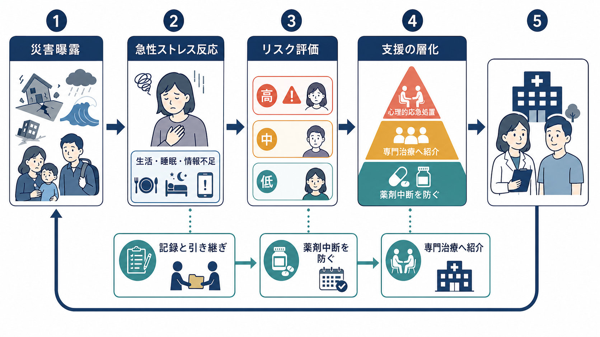
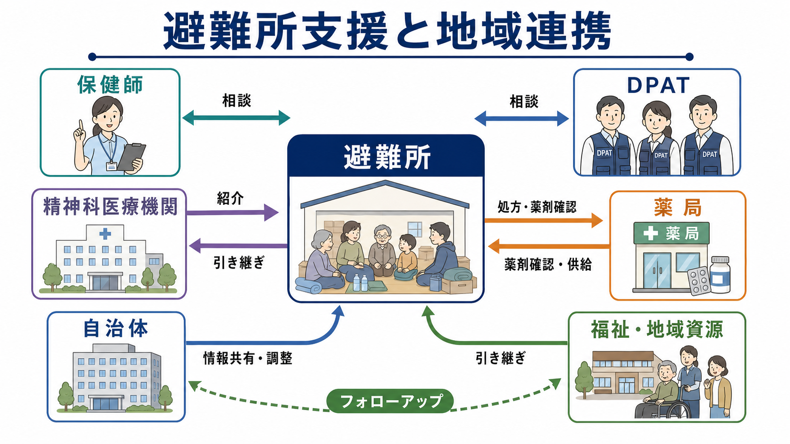

# 災害時の精神科危機対応とは何か

## 要点

- 災害時の精神科危機対応は、被災直後の「こころのケア」だけではなく、急性ストレス反応、既存の精神疾患、薬剤中断、避難所環境、支援者疲弊、地域医療システムの低下を同時に扱う実践である。
- 初期対応の中心は、詳細なトラウマ聴取ではなく、安全確保、落ち着き、自己効力感、つながり、希望を支える環境調整と実務支援である[1][2]。
- 急性ストレス反応の多くは自然に軽快するが、自殺リスク、精神病症状、重度の不眠、解離、物質使用、服薬中断、持病の悪化、保護者・介護者の喪失がある場合は、早期に専門支援へつなぐ[3][4]。
- 避難所では、睡眠、プライバシー、薬剤確認、相談導線、要配慮者の把握、記録と引き継ぎが、精神症状そのものへの介入と同じくらい重要になる[5][6]。
- 日本では [[DPATとは何か]] が、被災地の精神保健医療ニーズ把握、地域精神科医療機能の補完、避難所・在宅者への継続支援、関係機関への引き継ぎを担う[6]。

## この記事で答える問い

1. 災害時の精神科危機対応は、平時の精神科診療や一般的な危機介入と何が違うのか。
2. 急性ストレス反応には、どこまで支援し、どこから専門治療につなぐのか。
3. 薬剤中断や処方情報の喪失を、どのように安全に扱うのか。
4. 避難所で精神科支援を行うとき、何を見て、誰と連携するのか。

## まず結論

災害時の精神科危機対応とは、「被災者の症状を診断する活動」ではなく、「被災で壊れた生活・医療・つながりを、精神保健の観点から再接続する活動」である。急性期には、強い恐怖、涙もろさ、不眠、怒り、身体症状、ぼんやりする感じ、罪責感などが起こりうる。これらをすぐに病的反応とみなすのではなく、まず安全、睡眠、食事、情報、家族・支援者との連絡、薬剤継続を整える。

一方で、災害は既存の精神疾患の治療を途切れさせやすい。処方薬を失う、医療機関が被災する、通院手段がなくなる、避難所で眠れない、周囲の目が気になって服薬できない、といった条件が重なる。したがって、[[薬物療法のアドヒアランスをどう支えるか]] や [[クライシスプランとは何か]] の発想は、災害時にもそのまま重要になる。

## 背景

災害では、精神保健医療への需要が二重に増える。第一に、被災、喪失、避難、情報不足、生活再建の不確実性によって、新たな心理的苦痛が生じる。第二に、平時から精神科治療や生活支援を受けていた人の支援網が途切れる。WHOとUNHCRの mhGAP Humanitarian Intervention Guide は、専門医療へのアクセスが限られる人道危機下で、急性ストレス、悲嘆、うつ病、[[PTSDとは何か]]、精神病、てんかん、知的障害、有害な物質使用、自殺リスクを非専門職も含めて扱うための実践ガイドとして作られている[3]。

IASCのMHPSSガイドラインは、災害時の精神保健・心理社会的支援を医療だけに閉じ込めず、保護、人権、教育、食料、住居、水・衛生、コミュニティ支援まで含む多層的な支援として位置づける[5]。つまり、避難所の照明、騒音、トイレ、寝床、掲示情報、相談窓口の配置も、精神科危機対応の一部になる。

日本では、東日本大震災後の経験を踏まえ、災害派遣精神医療チームであるDPATが整備された。厚生労働省の活動要領では、DPATは被災地の精神保健医療機能の低下と災害ストレスによる需要増大に対応するため、ニーズ把握、他の保健医療体制との連携、関係機関とのマネジメント、専門性の高い精神科医療と精神保健活動の支援を行うとされる[6]。

## 基本概念

### 急性ストレス反応

急性ストレス反応は、異常な出来事に対する理解可能な反応として始まることが多い。症状には、不眠、過覚醒、驚きやすさ、涙、怒り、身体の痛み、動悸、食欲低下、ぼんやりする感じ、現実感の低下、出来事の反復想起などがある。災害直後にこれらがあるだけで、すぐに [[PTSDとは何か]] と診断するわけではない。

初期対応では、心理的応急処置、すなわち「見る、聞く、つなぐ」が基本になる。WHOの心理的応急処置ガイドは、危機を経験した人に対して、尊厳、文化、能力を尊重しながら、人道的・支持的・実用的な援助を行う枠組みを示している[2]。ここで重要なのは、無理に詳しい体験を語らせないことである。

### 薬剤中断

災害時には、処方箋、薬手帳、保険証、通院先、調剤薬局、交通手段が失われる。[[抗精神病薬とは何か]]、[[気分安定薬とは何か]]、[[リチウムとは何か]]、[[ベンゾジアゼピン系薬とは何か]]、抗てんかん薬、睡眠薬、身体疾患薬の中断は、再燃、離脱症状、せん妄、発作、転倒、過鎮静、相互作用のリスクを高める。

薬剤対応では、まず「何を飲んでいたか」を完全に思い出せない前提で動く。本人、家族、薬袋、残薬、薬局、通院先、診療情報、避難所記録を突き合わせ、緊急性の高い薬から優先する。避難所での服薬はプライバシーが守られにくいため、本人が服薬を隠したり中断したりしないよう、服薬場所や声かけの方法も調整する。

### 避難所支援

避難所支援では、診察室での面接よりも、環境と導線を見る。眠れているか、食べられているか、情報が届いているか、孤立していないか、服薬できているか、乳幼児・高齢者・障害者・妊産婦・外国語話者・性的少数者などが相談しやすいかを確認する。

精神科支援者が前面に出すぎると、「こころの問題の人だけが呼ばれる」形になり、スティグマを生むことがある。保健師、看護師、自治体職員、避難所運営者、薬剤師、福祉職、地域包括支援センター、学校関係者と連携し、生活相談や健康相談の一部として自然に支えることが望ましい。

### 地域連携

災害時の支援は、個人面接だけでは完結しない。医療機関、薬局、保健所、自治体、福祉、訪問看護、相談支援、学校、職場、地域団体が、それぞれ断片的な情報を持つ。[[ケアマネジメントとケースマネジメントは何が違うのか]] の観点からは、誰が現在の主担当で、誰が次の接点を持ち、どの情報をどこへ引き継ぐかを明確にすることが核心になる。

## 仕組み

災害時の精神科危機対応は、次の流れで整理できる。

1. **安全確認**  
   生命の危険、けが、脱水、低体温、感染、暴力、虐待、[[自殺リスクへの危機対応とは何か]]、せん妄、精神病症状、重度の興奮を確認する。

2. **生活基盤の回復**  
   睡眠、食事、水分、トイレ、休める場所、正確な情報、家族・支援者との連絡、子どもや高齢者の見守りを整える。

3. **心理的応急処置**  
   話したい範囲を聞き、反応を正常化しすぎず、実際の困りごとを整理し、次の行動に結びつける。Hobfollらの合意文書は、災害・大量トラウマ後の初期から中期の支援原則として、安全、鎮静、自己・共同体効力感、つながり、希望の促進を挙げている[1]。

4. **リスク評価と層化**  
   すべての被災者に専門治療を提供するのではなく、支援の強さを分ける。大多数には基本的支援と見守り、困難が持続する人には焦点化された心理社会的支援、重度症状や機能障害がある人には専門医療を提供する[5]。

5. **薬剤・治療継続**  
   服薬歴、残薬、通院先、調剤薬局、身体疾患を確認し、優先度の高い治療を途切れさせない。薬剤名が不明な場合は、身体所見、既往歴、薬袋、家族情報、薬局照会を使い、過量・重複・相互作用を避ける。

6. **記録と引き継ぎ**  
   その場限りの善意で終わらせず、避難所担当者、保健師、医療機関、DPAT活動拠点本部などに、最小限必要な情報を引き継ぐ。DPAT活動要領でも、活動記録と処方、チーム内および避難所担当者・保健師への引き継ぎが明示されている[6]。

## 図解

災害時の精神科危機対応は、避難所を中心に見ると理解しやすい。避難所には、生活困難、身体疾患、薬剤中断、家族分離、情報不足、喪失体験、支援者疲弊が集まる。精神科チームだけで抱えるのではなく、保健師、薬局、精神科医療機関、自治体、福祉・地域資源の間で、相談、処方確認、紹介、引き継ぎ、フォローアップを回す。

| 場面 | 見ること | 初期対応 | つなぎ先 |
|---|---|---|---|
| 強い不安・不眠 | 眠れているか、身体疾患や薬剤中断がないか | 安全な場所、短い説明、休息、服薬確認 | 保健師、医療救護所、精神科 |
| 希死念慮 | 具体性、手段、孤立、飲酒、過去の自傷歴 | 一人にしない、手段を遠ざける、緊急評価 | 救急、精神科、自治体危機対応 |
| 精神病症状・躁状態 | 幻覚妄想、興奮、不眠、服薬中断 | 刺激を下げる、身体疾患も確認 | DPAT、精神科医療機関 |
| 薬剤不明 | 薬袋、残薬、薬局、家族情報 | 重複・急な再開を避けて照会 | 薬局、主治医、医療救護所 |
| 支援者疲弊 | 長時間勤務、罪責感、怒り、睡眠不足 | 休息交代、チーム内共有、過剰な責任化を避ける | 所属組織、産業保健、DPAT |

## 臨床・研究との接続

臨床的には、災害時の精神科危機対応は [[精神科医療安全の特徴は何か]] と連続している。安全確保、説明、権利擁護、記録、チーム連携、再発予防を、混乱した環境でどのように保つかが問われる。特に、興奮、希死念慮、薬剤中断、せん妄、認知症、物質使用、虐待や暴力のリスクは、身体医療・福祉・行政との連携なしには扱えない。

研究的には、災害後の精神保健支援はRCTだけで単純に評価しにくい。災害の種類、被害規模、文化、支援資源、避難期間、社会的脆弱性が異なるためである。そのため、Hobfollらの5原則のような合意に基づく実践原則、IASCの多層モデル、WHO/UNHCRの実務ガイド、国内のDPAT活動記録を組み合わせて、実装と評価を進める必要がある[1][3][5][6]。

また、単回の心理的デブリーフィングを全員に行うことは推奨されない。Cochraneレビューは、単回デブリーフィングがPTSD予防に有効である根拠を示さず、場合によっては害の可能性があると結論している[7]。NICEのPTSDガイドラインも、PTSDの予防または治療として心理的焦点化デブリーフィングを提供しないよう勧告している[8]。災害時に必要なのは、語らせることを急ぐ介入ではなく、支援を層化し、必要な人を継続的に見つけてつなぐ仕組みである。

## よくある誤解

### 「被災者には早く体験を語ってもらうほどよい」

必ずしもそうではない。話したい人の話を尊重して聞くことは大切だが、語ることを促したり、詳細な再体験を求めたりする必要はない。心理的応急処置では、相手のペースを守り、現実的な困りごとを支え、必要な支援につなぐ。

### 「精神科支援は専門職が面接すれば十分である」

不十分である。避難所の騒音、プライバシー、情報掲示、服薬場所、相談窓口、支援者の交代制が整わないと、症状は悪化しやすい。精神科支援は、環境調整と地域連携の中で機能する。

### 「急性ストレス反応はすべて治療対象である」

多くは自然な反応であり、全員を治療対象にする必要はない。ただし、自殺リスク、重度の不眠、精神病症状、解離、強い機能障害、子どもや高齢者の保護者喪失、服薬中断、物質使用、暴力被害がある場合は、見守りだけにしない。

### 「薬が分からなければ、とりあえず似た薬を出せばよい」

危険である。災害時は情報が欠けやすく、重複処方、相互作用、離脱、身体疾患の悪化が起こりやすい。残薬、薬袋、薬局照会、家族情報、診療情報を突き合わせ、優先度と安全性を確認する。

## 関連ノート

- [[DPATとは何か]]
- [[PTSDとは何か]]
- [[トラウマ焦点化認知行動療法とは何か]]
- [[自殺リスクへの危機対応とは何か]]
- [[精神科医療安全の特徴は何か]]
- [[薬物療法のアドヒアランスをどう支えるか]]
- [[向精神薬の基本分類とは何か]]
- [[クライシスプランとは何か]]
- [[ケアマネジメントとケースマネジメントは何が違うのか]]
- [[地域移行支援とは何か]]

## MOC更新候補

- [[MOC｜臨床実践・治療]]
- [[MOC｜精神医学]]
- [[MOC｜司法・制度・地域精神医療]]
- [[MOC｜薬物療法]]

## 理解チェック

1. 災害直後の急性ストレス反応に対して、詳細な体験聴取よりも優先される支援は何か。
2. 避難所で薬剤中断を見つけるために、本人以外から確認できる情報源は何か。
3. 単回の心理的デブリーフィングが推奨されにくい理由は何か。
4. DPATが避難所支援で保健師や自治体へ引き継ぐべき情報には何があるか。

## 未解決問題

- 災害後の精神保健支援では、支援の有効性を被災者の症状だけでなく、生活機能、医療継続、孤立の軽減、支援者負担、地域資源の回復として評価する必要がある。
- 避難所、在宅避難、車中泊、福祉避難所、広域避難では、支援に届きにくい人の見つけ方が異なる。
- SNSやメディア情報が急性ストレス、噂、不安、支援要請行動に与える影響は、災害ごとに変化する。
- 平時からの [[クライシスプランとは何か]]、服薬情報共有、地域精神保健ネットワークづくりが、災害時にどの程度リスクを下げるかを継続的に検証する必要がある。

## 参考文献

[1] Hobfoll, S. E., Watson, P., Bell, C. C., Bryant, R. A., Brymer, M. J., Friedman, M. J., et al. (2007). Five essential elements of immediate and mid-term mass trauma intervention: Empirical evidence. *Psychiatry*, 70(4), 283-315. https://doi.org/10.1521/psyc.2007.70.4.283

[2] World Health Organization, War Trauma Foundation, & World Vision International. (2011). *Psychological first aid: Guide for field workers*. World Health Organization. https://www.who.int/mental_health/publications/guide_field_workers/en/

[3] World Health Organization & UNHCR. (2015). *mhGAP Humanitarian Intervention Guide: Clinical management of mental, neurological and substance use conditions in humanitarian emergencies*. World Health Organization. https://iris.who.int/handle/10665/162960

[4] World Health Organization & UNHCR. (2012). *Assessing mental health and psychosocial needs and resources: Toolkit for humanitarian settings*. World Health Organization. https://iris.who.int/handle/10665/76796

[5] Inter-Agency Standing Committee. (2007). *IASC Guidelines on Mental Health and Psychosocial Support in Emergency Settings*. https://www.who.int/publications-detail-redirect/iasc-guidelines-for-mental-health-and-psychosocial-support-in-emergency-settings

[6] 厚生労働省. (2014). 災害派遣精神医療チーム（DPAT）活動要領. https://www.mhlw.go.jp/seisakunitsuite/bunya/hukushi_kaigo/shougaishahukushi/kokoro/ptsd/dpat_130410.html

[7] Rose, S. C., Bisson, J., Churchill, R., & Wessely, S. (2002). Psychological debriefing for preventing post traumatic stress disorder (PTSD). *Cochrane Database of Systematic Reviews*, CD000560. https://doi.org/10.1002/14651858.CD000560

[8] National Institute for Health and Care Excellence. (2018). *Post-traumatic stress disorder: NICE guideline NG116*. https://www.nice.org.uk/guidance/ng116/chapter/1-Recommendations
