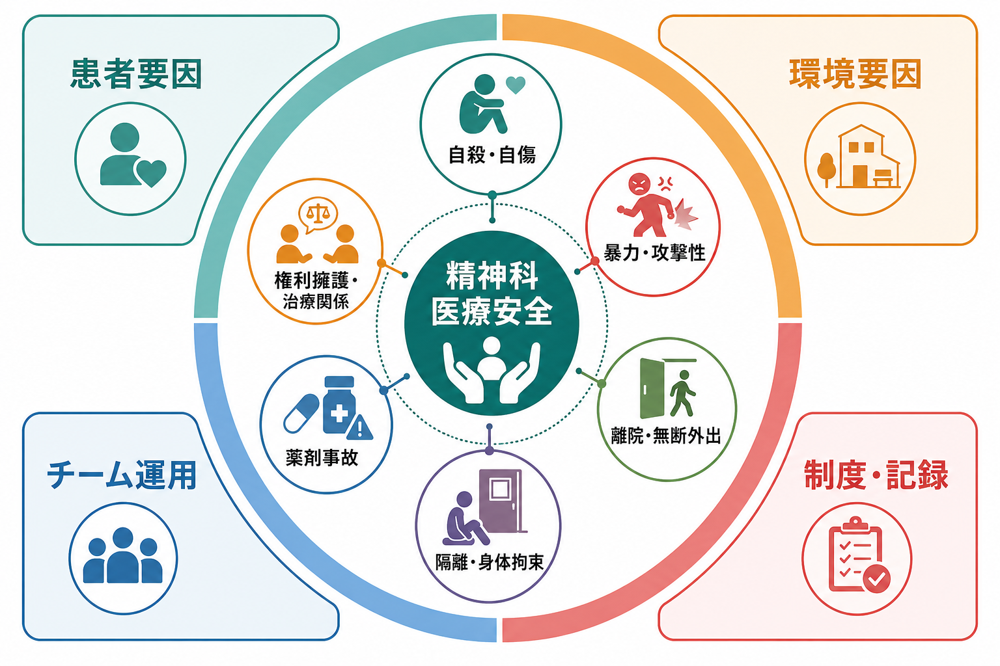
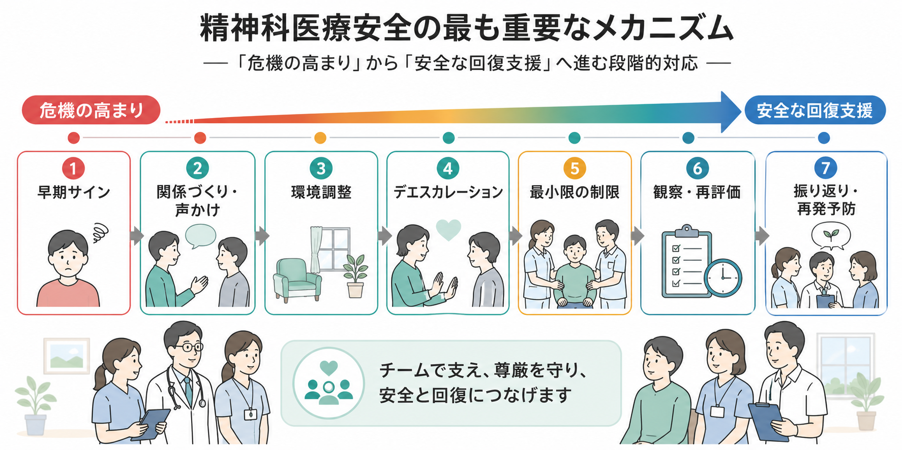
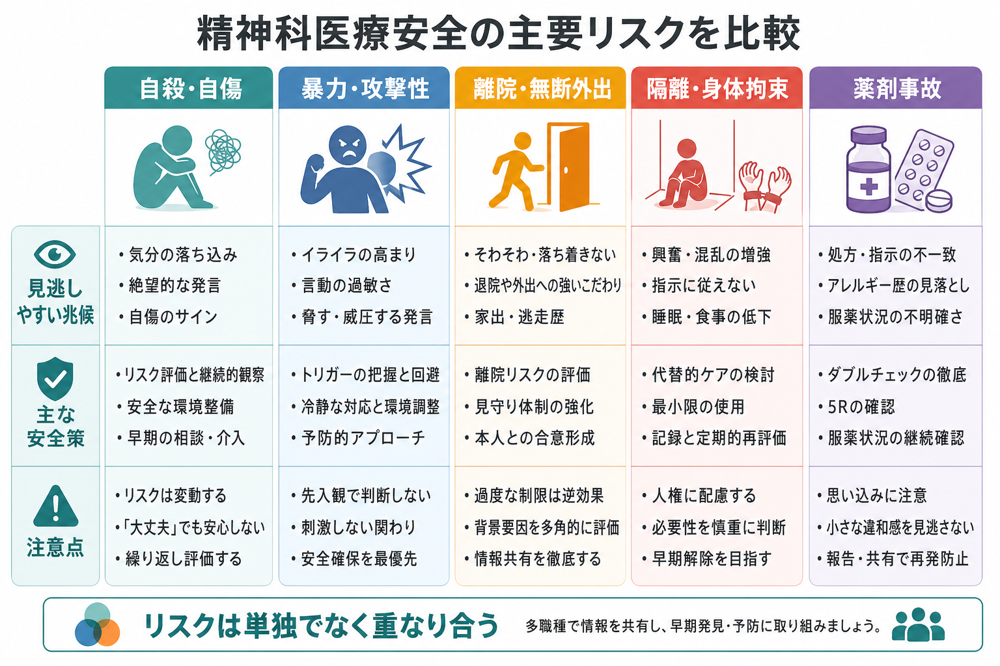

# 精神科医療安全の特徴は何か

## 要点

- 精神科医療安全は、転倒・感染・薬剤事故のような一般医療安全に加えて、自殺・自傷、暴力・攻撃性、離院・無断外出、隔離・身体拘束、退院直後の危機などを同時に扱う。
- 特徴は、リスクが「症状」「関係性」「環境」「制度」「薬剤」「地域生活」の相互作用として現れることである。個人の危険性だけに還元すると、過剰な制限や見逃しが起こりやすい。
- 自殺リスク評価は重要だが、個人を高リスク群と低リスク群に確実に分ける道具ではない。安全計画、観察、治療同盟、退院後フォローを組み合わせる必要がある[2][3]。
- 暴力・攻撃性への対応では、予防、早期の声かけ、デエスカレーション、環境調整、必要最小限の制限、事後レビューを一連の流れとして運用する[4][5]。
- 隔離・身体拘束は安全確保の手段であると同時に、尊厳、トラウマ、治療関係に重大な影響を与える。国内制度でも行動制限最小化が課題化され、国際的にも強制的実践を減らす方向が示されている[1][6]。

## この記事で答える問い

このノートでは、精神科医療安全を「精神症状をもつ人を危険人物として管理する技術」ではなく、「危機の中で本人・周囲・職員の安全と尊厳を同時に守る臨床システム」として整理する。中心になる問いは次の四つである。

1. 精神科医療安全は、一般的な医療安全と何が違うのか。
2. 自殺、暴力、離院、隔離・身体拘束、薬剤事故はどのようにつながるのか。
3. リスクを下げながら、本人の権利と治療関係をどう守るのか。
4. 臨床現場や研究では、何を測り、何を改善すべきなのか。

## まず結論

精神科医療安全の特徴は、リスクが「患者の内側」だけで完結しない点にある。希死念慮、幻覚妄想、躁状態、せん妄、認知症、物質使用、衝動性、疼痛、睡眠不足、薬剤副作用などは重要な要因である。しかし実際の事故や危機は、病棟の混雑、刺激の多さ、説明不足、待ち時間、職員配置、情報共有の途切れ、家族・地域資源との断絶、退院後フォローの不足と重なって起こる。

したがって、精神科医療安全は「危険を予測して閉じ込める」だけでは成立しない。むしろ、早期サインを拾い、本人の意味づけを聞き、選択肢を示し、環境を調整し、危機が高まったときには最小限の制限で守り、解除後に本人とチームで振り返るという反復的な安全設計である。これは[[精神科入院で患者の権利をどう守るのか]]、[[精神医療における権利擁護とは何か]]、[[精神科医療における行動制限最小化とは何か]]と強く接続する。

## 背景

一般医療の安全対策は、患者確認、手術安全、感染対策、転倒転落、薬剤管理、インシデント報告などを中心に発展してきた。精神科でもこれらは不可欠である。加えて精神科では、本人の意思、判断能力、自由、プライバシー、対人関係、急性症状、法制度が安全実践の中心に入ってくる。

たとえば自殺予防では、入院中の観察だけでなく、退院直後の移行期が大きなリスクになる。退院後自殺のメタ解析では、退院後 3 か月の自殺率が一般人口より著しく高く、特に自殺念慮・自殺行動を理由に入院した人では高率であることが示された[3]。この知見は、退院を「安全になったから終わり」と見るのではなく、病棟から地域へリスク管理を引き継ぐ過程として設計する必要を示す。

暴力・攻撃性についても、本人の診断名だけでは説明できない。NICE は、暴力と攻撃性を本人の苦痛、周囲の態度、物理的環境、自由の制限などの相互作用として扱い、予防から制限的介入、事後レビューまでの段階的対応を推奨している[4]。Safewards のクラスターランダム化試験でも、スタッフと患者の関係性を改善する比較的単純な介入群により、葛藤と containment が減少した[5]。

## 基本概念

### 自殺・自傷

精神科医療安全で最も重大なアウトカムの一つが自殺である。ただし、自殺リスク評価は「この人が自殺するかどうか」を当てる作業ではない。メタ解析では、高リスク分類の感度・特異度には限界があり、臨床的な高リスク群と低リスク群を安定して分ける方法は十分に確立していない[2]。したがって、[[自殺リスク評価では何を聞くべきか]]で扱うような評価は、危険因子の点数化ではなく、現在の危機、保護因子、アクセス可能な手段、退院後の接点、本人が助けを求められる条件を具体化するために使う。

実践上は、[[精神疾患と自殺リスクはどう関係するのか]]、[[自傷と自殺企図はどう違うのか]]、[[自殺未遂者支援では何を行うのか]]と接続しながら、入院中の観察、持ち物・環境確認、個別安全計画、家族・支援者との連携、退院後早期フォローを一体で設計する。

### 暴力・攻撃性

暴力・攻撃性は、職員や他患者の安全に直結するが、精神疾患そのものと単純に同一視してはならない。急性精神病症状、躁状態、せん妄、物質使用、認知症、強い不安、羞恥、過去のトラウマ、コミュニケーション困難、環境刺激などが重なると、声量の増大、威嚇、物損、他害行動として表れることがある。

重要なのは、暴力を「本人の問題行動」として切り離さず、病棟の相互作用として見ることである。NICE は、予防、デエスカレーション、必要な場合の制限的介入、事後の身体・心理状態確認を含む段階的対応を示している[4]。Safewards 研究は、患者とスタッフの関係性、予測可能な病棟運営、相互理解が安全性に影響することを示す[5]。

### 離院・無断外出

離院・無断外出は、本人の自殺・自傷、事故、被害、服薬中断、家族・地域への不安と結びつく。患者側から見ると、離院は単なる規則違反ではなく、閉じ込められ感、退屈、孤立、家族や仕事への心配、治療への不信、薬剤への不満、スティグマから自由を求める行動として理解できる場合がある[7]。

そのため、離院対策は施錠や監視だけでは不十分である。入院早期から、本人が病棟にいる意味を理解できているか、外の責任や不安を話せているか、外出・面会・連絡の見通しがあるか、任意入院者の意思が尊重されているかを確認する必要がある。

### 隔離・身体拘束

[[隔離とは何か]]、[[身体拘束とは何か]]は、急迫した危険があり、他の代替手段では安全確保が難しい場合に検討される強い制限である。国内では、精神科病院における行動制限最小化が政策・研究課題として整理され、関連法令・通知や調査研究が公開されている[6]。国際的には WHO/OHCHR が、強制的実践を人権上の課題として位置づけ、自由で十分な説明に基づく同意、地域支援、権利に基づくサービス転換を強調している[1]。

ここでの医療安全は、制限を「使えるか」ではなく、「使わずに済む条件をどれだけ増やせるか」「使う場合にどれだけ短く、説明可能で、再評価可能にできるか」を問う。

### 薬剤事故

精神科では、抗精神病薬、気分安定薬、抗うつ薬、睡眠薬、抗不安薬、抗認知症薬、抗てんかん薬、身体合併症治療薬が併用されやすい。薬剤事故は、処方・調剤・投与・服薬確認・副作用モニタリング・退院時薬剤調整のどこでも起こりうる。精神科病院における薬剤エラーと有害事象の系統的レビューは、この領域の実態把握と質改善がなお重要であることを示している[8]。

精神科特有の注意点は、服薬拒否、過量服薬、頓服の反復、鎮静による転倒、錐体外路症状、悪性症候群、QT 延長、リチウム中毒、クロザピン関連有害事象、ベンゾジアゼピン系薬の依存・せん妄・転倒などが、安全と治療関係の両方に影響することである。[[精神疾患と過量服薬はどう関係するのか]]、[[薬物過量服薬とは何か]]ともつながる。

## 仕組み

精神科医療安全は、次のような循環で考えると理解しやすい。

1. 早期サインを拾う  
   睡眠、食事、表情、声量、歩き回り、孤立、希死念慮、被害的解釈、服薬状況、家族との連絡、身体症状を観察する。

2. 本人の意味づけを聞く  
   「何が起きているか」「何が怖いか」「何を避けたいか」「どうしてほしいか」を聞く。ここを飛ばすと、制限は本人にとって突然の支配として体験されやすい。

3. 環境と関係を調整する  
   刺激を減らす、安心できる職員が対応する、説明を短くする、選択肢を示す、家族・支援者と連絡する、薬剤や身体不調を確認する。

4. 危機が高い場合は段階的に介入する  
   デエスカレーション、観察強化、持ち物確認、部屋移動、頓服相談、チーム対応を行い、どうしても必要な場合に最小限の制限を使う。

5. 再評価と解除を続ける  
   制限や観察は開始時点より解除時点が重要である。危険が下がったか、代替手段に戻せるか、本人に説明できているかを繰り返し確認する。

6. 振り返りを学習に変える  
   本人、家族、職員で、何がつらかったか、何が助けになったか、次に危機が高まる前に何をするかを確認する。責任追及だけで終わるレビューは、次の予防につながりにくい。

## 図解

精神科医療安全のリスクは、単独ではなく重なり合う。たとえば、退院直前の不眠と焦燥、薬剤変更、家族葛藤がある人では、自殺リスク、離院リスク、暴力・攻撃性、過量服薬のリスクが同時に上がることがある。逆に、暴力リスクに見える行動が、実際にはアカシジア、疼痛、せん妄、トラウマ反応、説明不足への反応である場合もある。

| 領域 | 見るべきサイン | 安全策の焦点 |
|---|---|---|
| 自殺・自傷 | 希死念慮、手段へのアクセス、絶望、退院直後、過去の企図 | 安全計画、手段制限、観察、退院後早期接点 |
| 暴力・攻撃性 | 声量、威嚇、被害的解釈、焦燥、身体不調 | デエスカレーション、環境調整、チーム対応 |
| 離院・無断外出 | 閉じ込められ感、外の責任、病棟不信、初期入院期 | 説明、連絡手段、外出計画、本人参加 |
| 隔離・身体拘束 | 急迫した自他への危険、代替困難性 | 最小限性、説明、観察、解除基準、事後レビュー |
| 薬剤事故 | 多剤併用、頓服反復、眠気、ふらつき、副作用 | 薬剤照合、副作用監視、退院時薬剤整理 |

## 臨床・研究との接続

臨床では、精神科医療安全をインシデント報告だけで把握しないことが重要である。報告された事故は氷山の一角であり、報告されなかった「ヒヤリ」、本人が言えなかった苦痛、職員が危険を感じた場面、家族が不安を抱いた退院直後の出来事も、改善の材料になる。

研究では、単一のリスク尺度の精度だけでなく、介入パッケージの実装、病棟文化、職員配置、患者経験、権利擁護、退院後フォロー、薬剤照合、行動制限件数と時間、再入院、職員傷害、患者のトラウマ反応を組み合わせて評価する必要がある。Safewards のような病棟単位の介入研究は、個人の症状だけでなく環境と関係を変える発想を示している[5]。

また、医療安全と権利擁護は対立概念ではない。説明、選択肢、同意、異議申立て、外部相談、記録、レビューを整えるほど、強い制限の必要性は検証可能になり、本人の信頼も保ちやすい。これは[[自殺対策基本法とは何か]]のような社会的予防、[[MOC｜司法・制度・地域精神医療]]で扱う制度的安全とも接続する。

## よくある誤解

### 誤解1: 精神科医療安全とは、危険な患者を管理することである

より正確には、危機が高まる条件を見つけ、本人・周囲・職員の安全を同時に高めることである。本人を危険性だけで見ると、情報が集まりにくくなり、治療関係も損なわれる。

### 誤解2: 自殺リスク評価をすれば、自殺は予測できる

評価は不可欠だが、予測の道具としては限界がある[2]。実践上は、リスク分類よりも、安全計画、手段へのアクセス低減、退院後接点、危機時の連絡先、家族・地域連携が重要になる[3]。

### 誤解3: 暴力リスクには強い制限で早く対応するのが最も安全である

急迫した危険には迅速な対応が必要だが、強い制限は二次的な身体・心理的害を生みうる。早期サイン、関係調整、環境調整、デエスカレーションを先に厚くするほうが、結果として制限を減らしやすい[4][5]。

### 誤解4: 離院は本人の規則違反なので、監視を強めればよい

離院には、閉じ込められ感、孤立、病棟不信、外の生活責任が関わる[7]。監視だけではなく、入院の意味、外部連絡、外出計画、本人の希望、退院見通しを扱う必要がある。

### 誤解5: 薬剤事故は薬剤師だけの問題である

薬剤安全は、医師、看護師、薬剤師、本人、家族、地域支援者の共同作業である。処方の意図、副作用、服薬実態、退院時の薬剤変更、過量服薬リスクを共有しなければ、安全な薬物療法にはならない[8]。

## 関連ノート

- [[MOC｜司法・制度・地域精神医療]]
- [[精神科入院で患者の権利をどう守るのか]]
- [[精神医療における権利擁護とは何か]]
- [[精神科医療における行動制限最小化とは何か]]
- [[隔離とは何か]]
- [[身体拘束とは何か]]
- [[自殺リスク評価では何を聞くべきか]]
- [[精神疾患と自殺リスクはどう関係するのか]]
- [[自殺未遂者支援では何を行うのか]]
- [[精神疾患と過量服薬はどう関係するのか]]

### MOC更新候補

- `content/00_MOC/MOC｜司法・制度・地域精神医療.md`
- 今後、臨床実践・治療領域に医療安全 MOC を作る場合は、本記事を「医療安全・危機対応」の入口ノートとして配置する。

## 理解チェック

1. 精神科医療安全が、患者個人の危険性だけで説明できない理由は何か。
2. 自殺リスク評価の限界を踏まえると、退院前後にどのような安全策が必要になるか。
3. 暴力・攻撃性への対応で、デエスカレーションや環境調整が重要になる理由は何か。
4. 離院・無断外出を、単なる規則違反ではなく患者経験として見ると、どのような予防策が見えるか。
5. 隔離・身体拘束を行った後、本人とチームで振り返るべきことは何か。
6. 精神科薬剤事故を防ぐために、処方・投与・退院時のどこを確認すべきか。

## 未解決問題

- 日本の精神科病棟で、行動制限件数だけでなく、患者経験、職員傷害、退院後転帰、再入院、治療関係を同時に評価する指標をどう作るか。
- 自殺予防において、リスク分類の限界を現場教育にどう反映するか。
- 離院予防で、開放性・本人参加・安全確保をどのように両立させるか。
- 薬剤安全で、過鎮静や多剤併用を減らしながら急性症状に対応するチーム運用をどう標準化するか。

## 参考文献

[1] World Health Organization & Office of the United Nations High Commissioner for Human Rights. (2023). *Mental health, human rights and legislation: guidance and practice*. https://www.who.int/publications/i/item/9789240080737

[2] Large, M., Kaneson, M., Myles, N., Myles, H., Gunaratne, P., & Ryan, C. (2016). Meta-analysis of longitudinal cohort studies of suicide risk assessment among psychiatric patients: Heterogeneity in results and lack of improvement over time. *PLOS ONE, 11*(6), e0156322. https://doi.org/10.1371/journal.pone.0156322

[3] Chung, D. T., Ryan, C. J., Hadzi-Pavlovic, D., Singh, S. P., Stanton, C., & Large, M. M. (2017). Suicide rates after discharge from psychiatric facilities: A systematic review and meta-analysis. *JAMA Psychiatry, 74*(7), 694-702. https://doi.org/10.1001/jamapsychiatry.2017.1044

[4] National Institute for Health and Care Excellence. (2015). *Violence and aggression: short-term management in mental health, health and community settings* (NICE guideline NG10). https://www.nice.org.uk/guidance/ng10

[5] Bowers, L., James, K., Quirk, A., Simpson, A., Stewart, D., & Hodsoll, J. (2015). Reducing conflict and containment rates on acute psychiatric wards: The Safewards cluster randomised controlled trial. *International Journal of Nursing Studies, 52*(9), 1412-1422. https://doi.org/10.1016/j.ijnurstu.2015.05.001

[6] 厚生労働省. 精神科病院における行動制限最小化について. https://www.mhlw.go.jp/stf/newpage_33838.html

[7] Muir-Cochrane, E., Oster, C., Gerace, A., Dawson, S., Damarell, R., & Grimmer, K. (2019). Seeking freedom: A systematic review and thematic synthesis of the literature on patients' experience of absconding from hospital. *Journal of Psychiatric and Mental Health Nursing, 26*(9-10), 289-300. https://doi.org/10.1111/jpm.12540

[8] Alshehri, G. H., Keers, R. N., & Ashcroft, D. M. (2017). Frequency and nature of medication errors and adverse drug events in mental health hospitals: A systematic review. *Drug Safety, 40*(10), 871-886. https://doi.org/10.1007/s40264-017-0557-7
