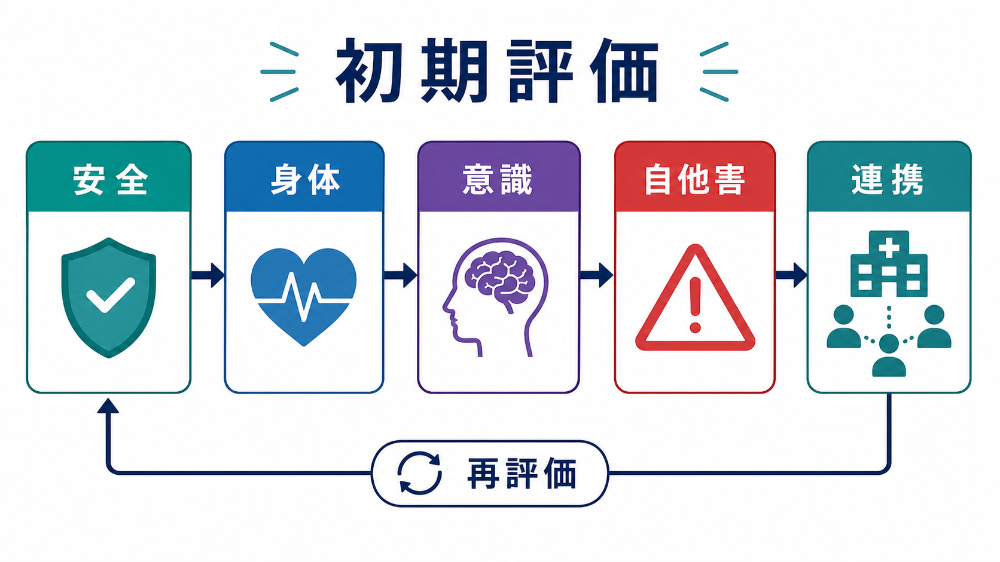

# 精神科救急のトリアージとは何か

## 要点

- 精神科救急のトリアージは、「精神科か身体科か」を振り分ける作業ではなく、生命・身体の緊急性、自他害リスク、意識障害、社会的危機を同時に見て、最初に守るべき安全を決める作業である。
- 自殺念慮、暴力、興奮、幻覚妄想だけに注目すると、低血糖、頭部外傷、せん妄、薬物中毒、離脱、感染などの身体緊急を見落とす。
- 「リスク評価票の点数」だけで帰宅・入院・隔離・身体拘束を決めるのではなく、本人の状態、家族・地域資源、環境、再評価可能性を含めた臨床判断が必要である[3][4]。
- トリアージは一回で完結しない。待機中、診察後、鎮静後、酩酊からの回復後、家族情報の追加後に、優先度は変わりうる。

## この記事で答える問い

1. 精神科救急のトリアージでは、何を優先して見るのか。
2. 自他害リスク、身体緊急度、意識障害、社会的危機はどう並べて考えるのか。
3. 「精神科らしい症状」に見えても身体評価を外せないのはなぜか。
4. リスク評価尺度や低・中・高リスク分類をどう使い、どこで限界を置くべきか。

## まず結論

精神科救急のトリアージは、次の4軸を並行して評価する「安全の優先順位づけ」である。

1. **身体緊急度**：気道・呼吸・循環、外傷、中毒、離脱、低血糖、感染、発熱、脱水、けいれん、妊娠関連、薬剤性有害事象など。
2. **意識障害・認知変動**：せん妄、酩酊、頭部外傷、神経疾患、代謝異常、薬物影響など。
3. **自他害リスク**：自殺企図、自傷、殺害・傷害の切迫性、武器、命令性幻聴、制御困難な興奮、暴力既往など。
4. **社会的危機**：帰宅先の安全、養育・介護、虐待・DV、孤立、支援者不在、服薬・受診継続不能、地域資源との接続不全。

この4軸のうち1つでも切迫していれば、精神科診断名が未確定でも対応優先度は上がる。逆に、診断名が重く見えても、身体的に安定し、意識清明で、差し迫った自他害がなく、安全な支援体制がある場合は、救急入院ではなく外来・地域支援への接続が中心になることもある。

## 背景

精神科救急では、本人の訴え、家族・警察・救急隊からの情報、外傷や酩酊、興奮の程度、受け入れ先の制約が同時に押し寄せる。しかも、初期情報はしばしば不完全で、本人が話せない、話したくない、話している内容の信頼性が揺らぐ、同伴者の情報にも利害や混乱が混じる。

日本精神科救急学会の『精神科救急医療ガイドライン2015年版』は、精神科救急を総論、受診前相談、興奮・攻撃性、自殺未遂者対応などを含む包括的実践として整理している[1]。つまりトリアージは、単に「入院の要否」を決める前段ではなく、相談段階から診療・搬送・身体治療・急性期精神科治療・地域連携までをつなぐ入口である。

救急トリアージの国際的教材では、メンタルヘルス関連の来院でも「生命の危険」「暴力・自傷の切迫」「重度の行動障害」「待機中の悪化可能性」を、通常の救急優先度と接続して扱う[2]。精神科症状だから別枠にするのではなく、救急医療の時間軸の中に置くことが重要である。

## 基本概念

### トリアージは診断ではない

トリアージは、診断名を確定する作業ではない。最初に決めるのは、誰が、どこで、どの程度の観察下で、何を先に評価・介入するかである。例えば、統合失調症の再燃か、薬物中毒か、せん妄か、躁状態かが未確定でも、「武器を持ち、指示に応じず、他者への攻撃が切迫している」なら安全確保が最優先になる。一方で、抑うつ症状が主訴でも、胸痛、低酸素、意識変容、頭部外傷があれば身体救急を優先する。

この意味で、精神科救急のトリアージは[[医療安全とは何か]]と[[精神科医療安全の特徴は何か]]の接点にある。

### 「精神科的」症状ほど身体疾患を疑う

急な興奮、混乱、幻視、失見当識、人格変化、初発の精神病症状は、精神疾患だけでなく、低血糖、感染、頭部外傷、脳血管障害、てんかん、薬物中毒、離脱、内分泌疾患、疼痛などでも起こる。Project BETA の医学的評価ワーキンググループは、興奮の背景には生命に関わる医学的原因がありうるため、精神科的原因と医学的原因を区別し、原因不明なら医学的評価を進める必要を強調している[5]。

ACEP の成人精神科患者に関する救急部門ポリシーは、全例に一律の検査を課すのではなく、病歴、既往、身体診察、リスク因子に基づいて検査や画像を選ぶ方針を示す[3]。これは「身体評価を省略してよい」という意味ではない。むしろ、無差別な検査セットではなく、危険な身体疾患を見落とさない焦点化された評価が必要だということである。

## 仕組み

### 1. まず場の安全を確保する

精神科救急では、面接そのものが介入である。安全な距離、退路、複数スタッフの配置、危険物の確認、刺激の少ない環境、プライバシー、本人の尊厳を同時に考える。興奮している人に対しては、強制的対応を急ぐほど悪化することがあるため、可能な限り[[言語的ディエスカレーションとは何か]]を先行させる[6]。

ただし、差し迫った暴力、自殺企図、武器、重度の興奮、制御不能な行動がある場合は、本人・他患者・家族・スタッフの安全を守るため、救急医療、精神科、警備、警察、保護者・支援者などとの連携が必要になる。[[興奮状態への対応はどう行うか]]、[[急速鎮静とは何か]]、[[暴力リスク評価とは何か]]も併せて読むとよい。

### 2. 身体緊急度を見る

身体緊急度は、精神科面接より前、または同時に確認する。重要なのは「精神科救急だから身体評価は後でよい」としないことである。

| 見る領域 | 例 | 優先度が上がる状況 |
|---|---|---|
| 生命徴候 | 呼吸、SpO2、脈拍、血圧、体温 | 低酸素、ショック、発熱、重度脱水 |
| 外傷 | 頭部外傷、出血、骨折、絞頸痕 | 自傷・暴力・転倒・事故の可能性 |
| 中毒・離脱 | アルコール、睡眠薬、覚醒剤、処方薬 | 意識変容、けいれん、呼吸抑制、離脱せん妄 |
| 代謝・内分泌 | 低血糖、電解質異常、甲状腺、腎・肝機能 | 急な混乱、脱水、食事摂取不良 |
| 薬剤性 | 悪性症候群、セロトニン症候群、アカシジア | 発熱、筋強剛、自律神経症状、焦燥 |

この領域は[[リチウム中毒への初期対応とは何か]]、[[セロトニン症候群への初期対応とは何か]]、[[悪性症候群への初期対応とは何か]]、[[アルコール離脱せん妄への対応とは何か]]と直結する。

### 3. 意識障害を別枠で扱う

意識障害や注意の変動は、精神科診断よりも優先して扱う。NICE のせん妄ガイドラインは、急性発症または変動する経過、注意や意識の変化、認知機能変化などに注意して、入院・長期ケア領域でせん妄を同定することを推奨している[7]。救急では、これをより短い時間軸で見る必要がある。

「話の内容が奇妙」だけで精神病性障害と決めるのは危険である。意識水準、見当識、注意、日内変動、幻視、発熱、脱水、疼痛、薬剤変更、物質使用、頭部外傷を確認する。詳しくは[[せん妄への危機対応とは何か]]、[[ICUせん妄とは何か]]、[[MSEで認知機能をどう評価するか]]が関連する。

### 4. 自他害リスクを「点数」ではなく状況で見る

自殺リスクや自傷リスクは、尺度の点数だけで判断しない。NICE の自傷ガイドラインは、将来の自殺や自傷反復の予測、治療提供や退院可否の決定に、リスク評価ツールや低・中・高の包括的分類を単独使用しないよう勧めている[4]。ACEP も、救急部門で自殺念慮のある患者を「退院安全」と判断するために、リスク評価ツールを単独使用しないことを推奨している[3]。

見るべきなのは、次のような文脈である。

- 具体的な手段、準備、アクセス、直近の企図
- 命令性幻聴、被害妄想、強い絶望、激越、酩酊
- 暴力の切迫性、武器、標的、追跡、威嚇、過去の重篤暴力
- 保護因子、支援者、本人の協力可能性、見守り可能性
- 帰宅先の安全、児童・高齢者・被介護者への影響

自殺については[[自殺リスクへの危機対応とは何か]]、[[自殺未遂後の再企図予防とは何か]]、[[安全計画とは何か]]、自傷については[[自傷行為への初期対応はどう行うか]]、他害については[[他害リスク評価では何を見るべきか]]と接続する。

### 5. 社会的危機を「医学の外」と扱わない

精神科救急では、医学的に安定していても、社会的危機が処遇を左右する。例えば、本人が帰宅を希望していても、同居家族への暴力が切迫している、養育者が機能していない、虐待が疑われる、住居を失っている、服薬・受診継続が現実的でない、支援者が疲弊している、といった場合には、医療・福祉・行政・地域支援の調整が必要になる。

ここで重要なのは、本人の権利と安全、家族・周囲の安全、守秘義務、情報共有の必要性を衝突として放置しないことである。関連ノートとして[[守秘義務と安全確保はどう両立するか]]、[[虐待疑いへの対応とは何か]]、[[クライシスプランとは何か]]がある。

## 図解

上の2つの図は、精神科救急トリアージを次のように読むための補助である。

- 1枚目は、初期評価を「安全、身体、意識、自他害、連携、再評価」の流れとして示す。実際には直線ではなく、待機中の悪化、追加情報、身体検査結果、鎮静後の再面接により前段へ戻る。
- 2枚目は、赤・黄・緑の優先度を固定ラベルではなく、身体、意識、自他害、社会危機の各列で見直すマトリクスとして示す。どれか一列が赤なら、全体の処遇も赤寄りに再調整される。

画像生成では日本語文字の安定性に限界があるため、図は本文の補助として使い、実際の判断は本文と各施設プロトコルに従う。

## 臨床・研究との接続

### 臨床実践

臨床では、トリアージを「誰が最初に診るか」の問題に縮めない。救急医、精神科医、看護師、心理職、ソーシャルワーカー、薬剤師、警備、行政・地域支援が、それぞれ別の情報を持つ。短時間での安全判断ほど、単職種の印象に依存しすぎる危険がある。

NICE の暴力・攻撃性ガイドラインは、予防、早期介入、ディエスカレーション、最小制限原則、身体拘束・隔離・薬物療法のリスク管理を含む包括的な短期対応を扱う[8]。これは、トリアージ後の処遇が「入院か帰宅か」だけではなく、観察、環境調整、関係調整、危機計画、再評価から成ることを示している。

### 研究・質改善

研究や質改善では、単に「精神科救急件数」や「入院率」だけを見ると、トリアージの質が見えにくい。より有用なのは、次のような指標である。

- 身体疾患の見落とし、再受診、予期せぬICU搬送
- 待機中の自傷・暴力・離院
- ディエスカレーション成功率、身体拘束・隔離・急速鎮静の頻度
- 自殺未遂後の心理社会的評価実施率、退院後早期フォロー
- 地域支援への接続、ケア計画・安全計画の共有
- スタッフの心理的安全性、暴力インシデント後のレビュー

この意味で、精神科救急トリアージは[[インシデントレポートとは何か]]や[[精神科医療安全の特徴は何か]]とも結びつく。

## よくある誤解

### 誤解1：精神科救急では自殺リスクだけ見ればよい

自殺リスクは中核だが、それだけでは不十分である。自殺企図後には外傷、中毒、低体温、横紋筋融解、妊娠、感染、せん妄、物質使用、虐待、孤立などが重なる。自殺リスクを評価するほど、身体評価と社会的危機の評価も必要になる。

### 誤解2：身体検査や検査は全例同じセットで行うべきである

一律検査は安心に見えるが、焦点をぼかすことがある。ACEP は、病歴・既往・身体診察に基づいて検査を選ぶ方針を示している[3]。ただし、これは検査を減らす口実ではなく、危険な身体疾患の可能性がある人を的確に拾うための考え方である。

### 誤解3：低リスクなら帰宅、高リスクなら入院である

低・中・高の分類は会話の整理には役立つが、処遇決定そのものではない。NICE は、自傷後の将来リスク予測や退院可否をリスク分類だけで決めないよう注意している[4]。帰宅可能性は、本人の協力、支援者、手段制限、フォローの速さ、再評価可能性、地域資源によって変わる。

### 誤解4：興奮している人にはまず薬物鎮静である

興奮が切迫した危険を伴う場合、薬物療法や身体的介入が必要になることはある。しかし Project BETA は、可能な限り非強制的で協働的なディエスカレーションを重視する[6]。薬物鎮静は、安全確保のための選択肢であって、面接や環境調整の代替ではない。

## 関連ノート

- [[医療安全とは何か]]
- [[精神科医療安全の特徴は何か]]
- [[興奮状態への対応はどう行うか]]
- [[言語的ディエスカレーションとは何か]]
- [[急速鎮静とは何か]]
- [[暴力リスク評価とは何か]]
- [[自殺リスクへの危機対応とは何か]]
- [[自傷行為への初期対応はどう行うか]]
- [[安全計画とは何か]]
- [[せん妄への危機対応とは何か]]
- [[守秘義務と安全確保はどう両立するか]]
- [[虐待疑いへの対応とは何か]]

## MOC更新候補

- `content/00_MOC/` 配下の臨床実践、精神医学、医療安全、危機対応に関するMOCへ追加候補。
- 並列生成ジョブとの競合を避けるため、本記事作成時点ではMOC本体は更新しない。

## 理解チェック

1. 「精神科症状が主訴」の人でも、最初に身体緊急度と意識障害を確認すべき理由を説明できるか。
2. 自殺リスク評価尺度を、退院可否の単独判断に使わない理由を説明できるか。
3. 自他害リスクが高くないように見えても、社会的危機によって処遇優先度が上がる例を挙げられるか。
4. 興奮対応で、ディエスカレーション、環境調整、薬物療法、身体的介入の位置づけを区別できるか。

## 未解決問題

- 日本の精神科救急現場で、標準化されたトリアージ尺度と地域ごとの実装をどう両立させるか。
- 身体救急、精神科救急、警察、行政、地域支援の情報共有を、守秘義務と本人の権利を守りながらどう設計するか。
- 自殺・暴力・離院・身体疾患見落としを減らす質改善指標を、現場負担を増やしすぎずにどう測定するか。
- 救急外来の混雑や精神科病床不足が、トリアージ判断を歪めない仕組みをどう作るか。

## 参考文献

[1] 日本精神科救急学会 監修, 平田豊明・杉山直也 編. (2015). *精神科救急医療ガイドライン 2015年版*. 日本精神科救急学会. https://www.jaep.jp/gl/2015_all.pdf

[2] Australian Commission on Safety and Quality in Health Care. (2024). *Emergency Triage Education Kit, second edition: Mental Health Triage Tool*. https://www.safetyandquality.gov.au/publications-and-resources/resource-library/emergency-triage-education-kit-etek-second-edition

[3] American College of Emergency Physicians Clinical Policies Subcommittee. (2017). Clinical Policy: Critical Issues in the Diagnosis and Management of the Adult Psychiatric Patient in the Emergency Department. *Annals of Emergency Medicine, 69*(4), 480-498. https://doi.org/10.1016/j.annemergmed.2017.01.036

[4] National Institute for Health and Care Excellence. (2022). *Self-harm: assessment, management and preventing recurrence (NICE guideline NG225)*. https://www.nice.org.uk/guidance/ng225

[5] Nordstrom, K., Zun, L. S., Wilson, M. P., Stiebel, V., Ng, A. T., Bregman, B., & Anderson, E. L. (2012). Medical evaluation and triage of the agitated patient: Consensus statement of the American Association for Emergency Psychiatry Project BETA Medical Evaluation Workgroup. *Western Journal of Emergency Medicine, 13*(1), 3-10. https://doi.org/10.5811/westjem.2011.9.6863

[6] Richmond, J. S., Berlin, J. S., Fishkind, A. B., Holloman, G. H., Jr., Zeller, S. L., Wilson, M. P., Rifai, M. A., & Ng, A. T. (2012). Verbal de-escalation of the agitated patient: Consensus statement of the American Association for Emergency Psychiatry Project BETA De-escalation Workgroup. *Western Journal of Emergency Medicine, 13*(1), 17-25. https://doi.org/10.5811/westjem.2011.9.6864

[7] National Institute for Health and Care Excellence. (2010, updated). *Delirium: prevention, diagnosis and management in hospital and long-term care (Clinical guideline CG103)*. https://www.nice.org.uk/guidance/cg103

[8] National Institute for Health and Care Excellence. (2015). *Violence and aggression: short-term management in mental health, health and community settings (NICE guideline NG10)*. https://www.nice.org.uk/guidance/ng10
