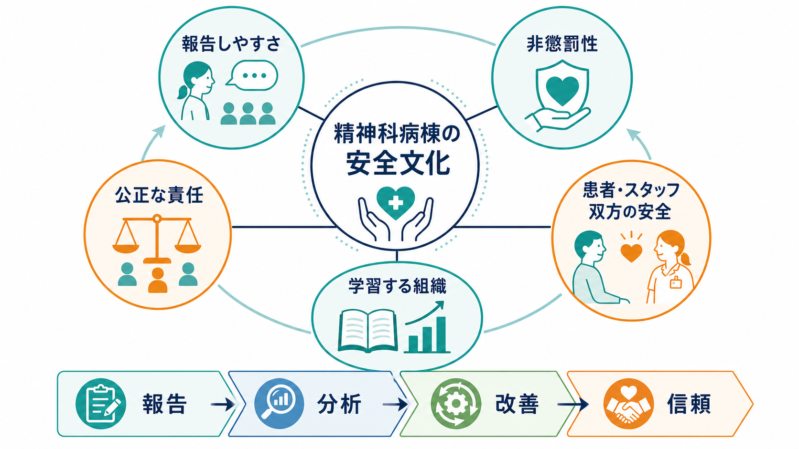
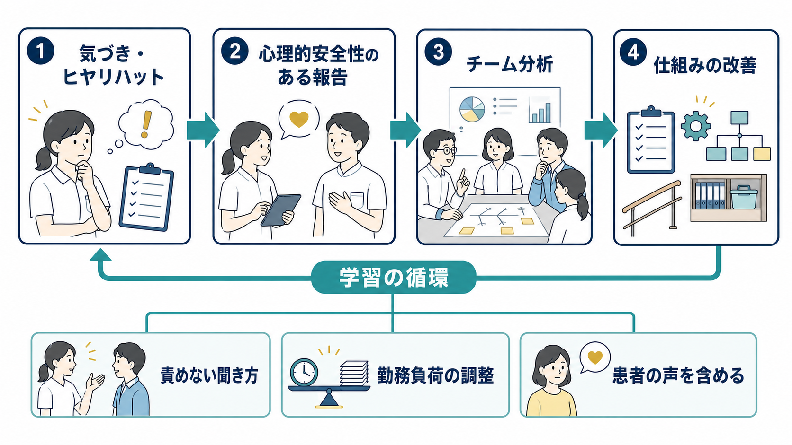
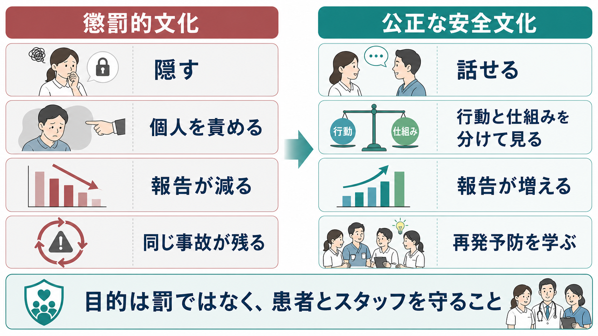

# 精神科病棟の安全文化とは何か

## 要点

- 精神科病棟の安全文化とは、ミスやヒヤリ・ハットを隠さず話せること、個人を一方的に責めないこと、危険行動とシステム要因を分けて検討すること、得られた情報を再発予防に変えることを支える組織文化である。
- 非懲罰性は「誰も責任を問われない」という意味ではない。通常の人間エラー、危険な近道、意図的な違反や粗暴な行為を区別し、公正に扱うことが必要である[3][4]。
- 精神科病棟では、自傷・自殺、暴力、隔離・身体拘束、離院、薬剤、転倒、身体合併症などが相互に絡むため、安全文化は「患者を管理する文化」ではなく、患者・スタッフ双方の安全と尊厳を守る文化として設計する必要がある[1][6]。
- 報告件数だけで文化を評価してはいけない。AHRQ SOPS のように、報告、コミュニケーションの開放性、エラーへの対応、組織学習、スタッフ配置、リーダー支援などを複数の側面から見る[2]。
- インシデント対応は、責任追及だけで終わらせず、当事者への支援、関係者への説明、システム要因の分析、実行可能な安全対策、改善後の評価までを含める[7][8]。

## この記事で答える問い

- 精神科病棟でいう「安全文化」とは何を指すのか。
- 「報告しやすい病棟」と「何でも許す病棟」はどこが違うのか。
- 非懲罰性、公正な責任、心理的安全性、学習する組織はどうつながるのか。
- 精神科病棟では、どのような実践で安全文化を育てられるのか。

## まず結論

精神科病棟の安全文化は、「問題を起こした人を探す文化」から「危険が生まれた条件を理解し、次の害を減らす文化」へ移るための土台である。ここで重要なのは、責めない雰囲気だけではない。報告された情報が分析され、改善策になり、現場にフィードバックされるところまで回って初めて、安全文化は機能する。

精神科病棟では、患者の苦痛、症状、権利、治療同盟、環境刺激、スタッフの疲弊、法制度、家族・地域との連携が安全に直結する。したがって、[[精神科医療安全の特徴は何か]]で扱うようなリスクを、個人の注意不足だけに還元すると、現場は沈黙しやすくなる。逆に、何でも「システムのせい」にして危険行動を曖昧にしても信頼は崩れる。安全文化の要点は、率直に話せることと、公正に責任を分けることを両立させる点にある[3][4]。

## 背景

WHO は患者安全を、医療に伴う回避可能な害を減らす世界的課題として位置づけ、患者・家族参加、リーダーシップ、報告と学習、医療者教育、データ活用を含む包括的な行動計画を示している[1]。これは一般病院だけの話ではない。精神科入院環境でも、薬剤エラー、転倒、感染、身体疾患の見逃しに加えて、自傷、暴力、強制的介入、離院、治療関係の破綻など、精神科に特有の安全課題が重なる[6]。

精神科病棟では、重大な出来事ほど「誰が悪かったのか」という問いが強くなりやすい。自殺、暴力、身体拘束中の有害事象、急速鎮静後の呼吸抑制、無断離院などは、患者・家族・スタッフの心理的衝撃が大きいからである。しかし、現場が責任追及を恐れて情報を出せなくなると、軽微な異変や未然事例が共有されず、同じ条件が残る。日本の医療事故情報収集等事業も、報告された事故やヒヤリ・ハットを分析・提供し、医療安全対策に役立つ情報を共有する仕組みとして運営されている[8]。

## 基本概念

### 安全文化

安全文化とは、組織の中で「安全に関して何が重視され、支援され、期待され、許容されるか」を形づくる価値観・規範・行動様式である。AHRQ は患者安全文化を、組織文化が患者安全をどの程度支え促進しているかとして捉え、チームワーク、スタッフ配置と業務ペース、継続的改善、エラーへの対応、コミュニケーション、報告、管理者支援などの側面から測定している[2]。

精神科病棟に置き換えると、安全文化は、申し送りで「この患者さんが危ない」と一言で済ませる文化ではなく、「どの状況で、誰にとって、何が危険になり、どの支援で下げられるか」を共有する文化である。[[暴力リスク評価とは何か]]、[[自殺リスクへの危機対応とは何か]]、[[離院リスクへの対応とは何か]]のような個別リスク評価も、この文化の上で初めて機能する。

### 報告しやすさ

報告しやすさは、単にインシデントフォームが使いやすいことではない。スタッフが「書いたら怒られる」「自分の評価に残る」「忙しいのに何も変わらない」と感じると、報告は減る。逆に、報告後に「何が学ばれたか」「何が変わったか」が返ってくると、報告は現場の負担ではなく改善の入口になる[1][2]。

精神科病棟で報告すべき情報には、有害事象だけでなく、未遂、近接事象、違和感、環境上の危険、申し送りの抜け、患者からの不安の訴え、スタッフの過負荷も含まれる。とくに自傷・暴力・離院は、出来事の前に小さなサインが分散していることが多いため、看護師、医師、心理職、作業療法士、薬剤師、事務職、警備、清掃、患者本人・家族の情報をつなぐ必要がある。

### 非懲罰性と公正な責任

非懲罰性とは、正直な報告を処罰しないことである。ただし、非懲罰性は免責ではない。Reason の安全文化論では、報告する文化、公正な文化、柔軟な文化、学習する文化が安全文化の中核をなすとされ、公正な文化では、受け入れられる行動と受け入れられない行動の境界を明確にする[3]。

たとえば、過密な勤務中に確認手順が抜けた場合、まず問うべきは「なぜ確認が成立しない勤務設計だったのか」である。一方で、明確な危険を知りながら意図的に記録を改ざんしたり、患者を侮辱したり、暴力的に扱ったりする行為は、学習だけで済ませてよいものではない。安全文化は、通常の人間エラーを責めず、危険な近道を減らし、故意・悪質・反復的な逸脱には組織として対応する文化である[4]。

### 心理的安全性

心理的安全性は、チームの中で、疑問、懸念、失敗、異論を口にしても罰せられたり屈辱を受けたりしないという共有された感覚である[5]。精神科病棟では、若手スタッフや夜勤者が「この対応は少し危ない気がする」「拘束解除はまだ早いかもしれない」「患者さんの表情がいつもと違う」と言えることが、重大事故の予防につながる。

ただし、心理的安全性は「何を言ってもよい」ではない。患者を傷つける言葉、偏見、威圧、責任転嫁を放置することではなく、根拠の弱い不安や少数意見を、検討可能な情報として扱うチーム習慣である。

## 仕組み

### 1. 報告を入口にする

報告システムは、事故件数を数えるためだけの道具ではない。WHO の行動計画は、医療機関が報告・学習システムを用いて患者安全上の優先課題を特定し、学んだことと取った行動をスタッフにフィードバックする重要性を示している[1]。精神科病棟では、報告様式に「患者の状態」「環境」「人員」「声かけ」「制限の有無」「薬剤」「申し送り」「家族・地域連携」などを入れると、個人のミスではなく条件の組み合わせを見やすくなる。

### 2. 責めない聞き方を標準化する

インシデント後の最初の問いが「なぜそんなことをしたのか」になると、防衛的な説明が増える。代わりに、「その時、何が見えていたか」「どの情報が足りなかったか」「どの選択肢が現実的だったか」「何があれば別の対応ができたか」を聞く。これは責任を曖昧にするためではなく、現場で実際に起きていた制約を把握するためである。

### 3. チームで分析する

精神科病棟の安全問題は単線的ではない。たとえば暴力事案では、患者の症状、刺激の多い環境、待ち時間、説明不足、過去のトラウマ、スタッフ配置、薬剤調整、他患者との距離が絡む。[[言語的ディエスカレーションとは何か]]、[[急速鎮静とは何か]]、[[隔離の適応と安全管理とは何か]]、[[身体拘束の適応とリスク管理とは何か]]は、別々の手順ではなく、同じ安全文化の中で選択される介入である。

### 4. 改善を小さく実装する

分析だけでは文化は変わらない。改善策は、具体的で、担当者が明確で、期限があり、効果を確認できる必要がある。たとえば「注意喚起する」ではなく、「夜勤開始時に自殺・離院・暴力リスクの変化を3分で共有する」「急速鎮静後の観察項目を電子カルテテンプレート化する」「新規入院24時間以内の環境リスク確認をチェックリスト化する」のようにする。

### 5. 当事者を支援する

重大インシデント後には、患者・家族だけでなく、関与したスタッフも心理的打撃を受ける。スタッフ支援を「甘やかし」とみなすと、次の報告や相談が止まる。NHS の Patient Safety Incident Response Framework は、患者安全インシデントへの対応を、学習と改善のためのシステムとして位置づけ、影響を受けた患者・家族・スタッフへの思いやりある関与、システムベースの学習、比例的な対応、改善に焦点を当てた監督を重視している[7]。

## 図解

精神科病棟の安全文化は、次の3層で考えると整理しやすい。

| 層 | 問い | 実践例 |
|---|---|---|
| 報告の層 | 何が見え、何が言えるか | ヒヤリ・ハット、患者の声、夜勤者の違和感、申し送りの抜けを共有する |
| 公正さの層 | 何を責めず、何に責任を持つか | 人間エラー、危険な近道、意図的逸脱を区別する |
| 学習の層 | 何を変え、効果をどう見るか | 手順、環境、人員配置、教育、記録、フィードバックを改善する |

## 臨床・研究との接続

臨床では、安全文化は日々のカンファレンス、申し送り、デブリーフィング、事故後レビューに現れる。[[向精神薬の処方ミスを防ぐには何を確認するか]]で扱う薬剤確認、[[転倒転落リスク管理とは何か]]で扱う環境調整、[[身体疾患の見逃しを防ぐ精神科初期対応とは何か]]で扱う身体評価は、すべて「気づいた人が言える」「言われた側が防衛的になりすぎない」「仕組みに戻して改善する」文化を必要とする。

研究では、精神科入院環境の患者安全はまだ十分に研究されていない。Thibaut らの系統的レビューは、精神科入院患者安全に関する364本の研究を整理し、対人暴力、強制的介入、安全文化、自傷、物理環境、薬剤安全、無断離院、臨床意思決定、転倒、感染管理の10カテゴリーを示した[6]。このレビューは、精神科病棟の安全文化を「理念」ではなく、複数のリスク領域を横断する実装課題として扱う必要を示している。

評価では、報告件数、重大インシデント件数、スタッフアンケート、患者経験、離職・バーンアウト、拘束・隔離率、薬剤エラー、暴力事案、改善策の完了率を組み合わせる。報告件数の増加は、危険が増えたサインの場合も、沈黙が減ったサインの場合もある。したがって、単独指標ではなく、文脈とセットで読む必要がある。

## よくある誤解

### 「非懲罰性」とは、誰も責任を取らないことだ

違う。非懲罰性は、正直な報告と学習を守るための条件である。公正な安全文化では、人間エラーを個人の道徳的失敗にせず、危険な近道を生む勤務・手順・教育・監督を改善する。同時に、故意の隠蔽、患者への虐待、重大な職業倫理違反を曖昧にしない[3][4]。

### 報告が多い病棟は危険な病棟だ

必ずしもそうではない。報告しやすい病棟では、軽微な事例や未然事例も表に出るため、件数が多く見えることがある。重要なのは、重大性、再発性、改善への接続、フィードバックの有無である[2]。

### 安全文化は管理職だけが作る

管理職の態度は大きいが、それだけでは足りない。安全文化は、朝の申し送りで違和感を拾う、患者の訴えを軽視しない、夜勤明けのスタッフを責める前に状況を聞く、改善後の効果を確認する、といった小さな行動の積み重ねで作られる。

### 精神科ではリスクが高いので、制限を強めるほど安全になる

制限は必要な場面があるが、制限そのものが新たな害を生むこともある。隔離・身体拘束、過鎮静、過度な監視、説明不足は、尊厳、治療同盟、トラウマ反応に影響する。安全文化は、制限を「使うか」だけでなく、「使わずに済ませる条件」「使う場合の最小化」「解除後の振り返り」を問う。

## 関連ノート

- [[医療安全とは何か]]
- [[精神科医療安全の特徴は何か]]
- [[暴力リスク評価とは何か]]
- [[言語的ディエスカレーションとは何か]]
- [[自殺リスクへの危機対応とは何か]]
- [[離院リスクへの対応とは何か]]
- [[隔離の適応と安全管理とは何か]]
- [[身体拘束の適応とリスク管理とは何か]]
- [[向精神薬の処方ミスを防ぐには何を確認するか]]
- [[転倒転落リスク管理とは何か]]

## 理解チェック

1. 自分の病棟で、スタッフが報告をためらう理由を3つ挙げると何か。
2. 「人間エラー」「危険な近道」「意図的な逸脱」を、最近のヒヤリ・ハットに当てはめるとどう区別できるか。
3. インシデント後に、患者・家族・スタッフへどのようなフィードバックが返っているか。
4. 報告された事例から、実際に手順・環境・人員配置・教育のどれが変わったか。
5. 隔離・身体拘束・急速鎮静の使用後に、解除と再発予防の振り返りが行われているか。

## 未解決問題

- 精神科病棟に特化した安全文化尺度を、患者経験、スタッフ心理的安全性、強制的介入の最小化とどう統合するか。
- 報告件数の増減を、文化の変化、実際のリスク変化、業務負荷の変化からどう切り分けるか。
- 患者・家族をインシデント後レビューに参加させるとき、治療関係とプライバシーをどう守るか。
- スタッフ支援と説明責任を両立する院内制度を、どのように教育・監督・評価へ組み込むか。

## 参考文献

[1] World Health Organization. (2021). *Global patient safety action plan 2021-2030: towards eliminating avoidable harm in health care*. https://www.who.int/publications-detail-redirect/9789240032705/

[2] Agency for Healthcare Research and Quality. (2019/2025). *SOPS Hospital Survey Version 2.0*. https://www.ahrq.gov/sops/surveys/hospital/index.html

[3] Reason, J. T. (1997). *Managing the Risks of Organizational Accidents*. Ashgate. AHRQ PSNet summary: https://psnet.ahrq.gov/issue/managing-risks-organizational-accidents

[4] Institute of Medicine. (2004). *Keeping Patients Safe: Transforming the Work Environment of Nurses*, Chapter 7: Creating and Sustaining a Culture of Safety. National Academies Press. https://www.ncbi.nlm.nih.gov/books/NBK216181/

[5] Agency for Healthcare Research and Quality. (2025). *Psychological Safety*. https://www.ahrq.gov/hai/tools/mrsa-prevention/surgery/psychological-safety.html

[6] Thibaut, B., Dewa, L. H., Ramtale, S. C., D'Lima, D., Adam, S., Ashrafian, H., Darzi, A., & Archer, S. (2019). Patient safety in inpatient mental health settings: a systematic review. *BMJ Open, 9*(12), e030230. https://doi.org/10.1136/bmjopen-2019-030230

[7] NHS England. (2022/2025). *Patient Safety Incident Response Framework*. https://www.england.nhs.uk/long-read/patient-safety-incident-response-framework/

[8] 厚生労働省. (2022). 医療事故情報収集等事業について. https://www.mhlw.go.jp/stf/newpage_22786.html

## 関連ノート候補・MOC更新候補

- MOC更新候補: `content/00_MOC/` 配下の医療安全・臨床実践系MOCがある場合、本記事へのリンクをバッチ統合時に追加する。
- 関連ノート候補: 「公正文化とは何か」「心理的安全性とは何か」「インシデント後デブリーフィングとは何か」「精神科病棟のデブリーフィングをどう行うか」。
