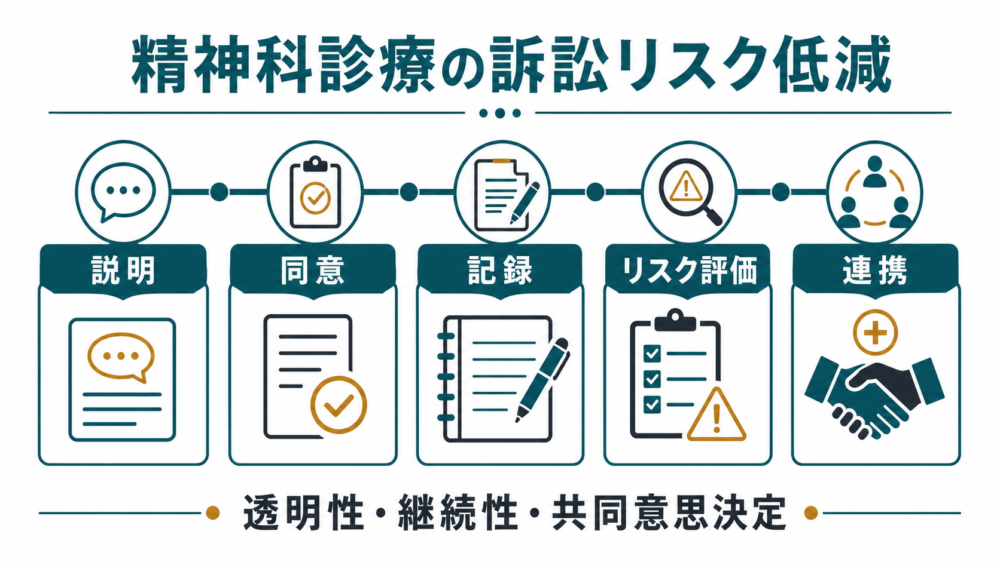
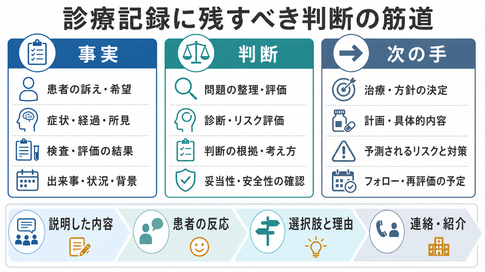

# 精神科診療における訴訟リスクをどう減らすか

## 要点

- 訴訟リスク低減の中心は、防御的医療ではなく、[[医療安全とは何か|医療安全]]、透明な説明、患者の理解を踏まえた同意、臨床判断の記録、変化に応じたリスク再評価である。
- 精神科では、自殺、自傷、暴力、離院、薬剤副作用、身体疾患の見逃し、強制入院・隔離・身体拘束、守秘義務と安全確保の衝突が紛争化しやすい。
- 記録は「あとで責任を逃れるための文章」ではなく、「その時点で何を把握し、どう判断し、何を説明し、なぜその方針にしたか」を第三者が追える臨床の足跡である。
- 自殺や自傷の評価は、低・中・高のラベルで終わらせず、ニーズ、危険因子、保護因子、差し迫った安全、フォロー、連携先を方針化する。
- 本稿は教育・研究目的の整理であり、個別事案の法的助言ではない。実際の紛争、重大事故、記録修正、警察・行政・弁護士対応は所属機関の手順と専門家の助言に従う。

## この記事で答える問い

1. 精神科診療で訴訟や苦情につながりやすい場面はどこか。
2. 説明・同意・記録・リスク評価・連携を、どのように日常診療へ落とし込むか。
3. 自殺・自傷・暴力・非自発入院など、完全予測ができない領域で何を記録すべきか。
4. 「訴えられないため」ではなく、患者安全と信頼関係を高める実務として何を整えるか。

## まず結論

精神科診療の訴訟リスクを下げる最も現実的な方法は、結果を完全に防ぐことではなく、標準的な診療過程を丁寧に実行し、その過程を再構成できる形で残すことである。精神科医療過誤の概説では、精神科医は他診療科より訴訟頻度が低い一方、訴訟では自殺・自殺企図、不適切治療、守秘義務違反、薬物療法、診断、強制入院、境界違反などが問題になりやすいと整理されている[1]。これは、精神科で扱うリスクが「予測困難だが無視できない」性質を持つためである。

したがって、臨床で見るべき焦点は次の5つである。

| 領域 | 実務上の問い | 記録に残す要点 |
|---|---|---|
| 説明 | 患者は何を知る必要があるか | 病状、選択肢、利益、不利益、代替案、不実施時の見通し |
| 同意 | 患者は理解し、自発的に選べているか | 理解度、質問、同意・拒否、判断能力への配慮 |
| 記録 | 判断の筋道を第三者が追えるか | 事実、評価、鑑別、リスク、方針、説明、連絡 |
| リスク評価 | リスクを方針に変換したか | 危険因子、保護因子、切迫性、安全計画、再評価時点 |
| 連携 | 一人の判断に閉じていないか | 家族・多職種・他科・地域・救急との共有範囲と理由 |

## 背景

医療訴訟は、悪い結果が起きたというだけで成立するものではない。一般に、注意義務、標準的診療からの逸脱、損害、因果関係が問題になる[1]。ただし患者・家族から見ると、紛争の入口は必ずしも法律論ではない。「説明がなかった」「なぜ退院になったのか分からない」「危険と言ったのに対応されなかった」「カルテに聞いた話が残っていない」といった不信が、苦情、開示請求、調査、訴訟へ進むことがある。

精神科では、[[精神科医療安全の特徴は何か|精神科医療安全]]の難しさがこの不信を増幅しやすい。症状が変動し、本人の同意能力や病識が揺れ、家族・支援者との情報共有には[[守秘義務と安全確保はどう両立するか|守秘義務と安全確保]]の緊張がある。さらに、自殺や暴力を完全に予測する尺度はなく、病棟環境や地域支援の制約も大きい。ここで必要なのは「必ず当てる評価」ではなく、「その時点で利用可能な情報から合理的に評価し、実行可能な安全策へつなげたこと」を明確にする実務である[2][3]。

厚生労働省の診療情報提供指針も、インフォームド・コンセントの理念、患者の自己決定、診療情報の共有、診療記録開示を信頼関係と医療の質の基盤として位置づけている[4]。つまり、説明と記録は法的防衛だけでなく、患者と医療者が同じ地図を見て治療を進めるための基盤である。

## 基本概念

### 訴訟リスクは「結果」より「過程」で下げる

精神科では悪い転帰を完全に避けられない。自殺、再企図、衝動的暴力、離院、拒薬、過量服薬、身体疾患の急変は、標準的な診療を行っていても起こりうる。訴訟リスクを下げるとは、結果をゼロにすることではなく、標準的な過程を外さないこと、そして過程の合理性を説明できる状態にすることである。

実務上は、次の文が診療録から読める必要がある。

- 何が問題として提示されたか。
- どの情報を本人、家族、紹介元、他職種、過去記録から得たか。
- 何を診断・鑑別し、何をまだ不確実と考えたか。
- どのリスクを評価し、どのリスクは低くないと見たか。
- 何を説明し、本人はどう理解・反応したか。
- どの選択肢を検討し、なぜ採用・不採用にしたか。
- 次にいつ、誰が、何を確認するか。

### インフォームド・コンセントは文書ではなく対話である

同意書は重要だが、同意書だけで説明義務が満たされるわけではない。精神科では、薬物療法、入院形態、行動制限、身体拘束、ECT、rTMS、心理療法、退院方針、家族への情報共有などで、本人の理解度、意思決定能力、同意の自発性を確認する必要がある。救急精神科の法的整理でも、緊急評価・治療では同意能力と非同意下治療の法的根拠が重要な論点として扱われる[5]。

説明では「何をするか」だけでなく、「なぜ今それが必要か」「しない場合に何が起こりうるか」「代替案は何か」「本人が何を心配しているか」を扱う。[[意思決定支援とは何か|意思決定支援]]の観点からは、理解しやすい言葉、反復説明、家族・支援者同席、通訳、書面、時間を置いた再確認が、同意の質を高める。

### 記録は、事実・判断・次の手を分ける

記録で最も弱くなりやすいのは、結論だけが残り、判断過程が消えることである。例えば「自殺リスク低い」「退院可」だけでは、何を根拠にそう判断したのか、悪化時に誰が何をするのかが分からない。精神科記録に関するリスクマネジメント文献は、症状、精神状態、診断に至った理由、治療選択の理由、薬剤量、フォロー、他職種とのコミュニケーションを明確に残す重要性を強調している[1][6]。

診療録は次の3層で書くと読みやすい。

| 層 | 内容 | 例 |
|---|---|---|
| 事実 | 本人の訴え、観察、検査、家族情報 | 「希死念慮は否定。ただし昨夜眠れず、酒量増加」 |
| 判断 | 鑑別、リスク、診療上の解釈 | 「急性切迫は乏しいが、飲酒増加と孤立で短期再評価が必要」 |
| 次の手 | 方針、説明、連絡、再評価 | 「安全計画を確認し、家族同意の範囲で見守りを依頼。48時間以内再診」 |

## 仕組み

### 1. 自殺・自傷リスクは「分類」ではなく「方針化」する

[[自殺リスクへの危機対応とは何か|自殺リスク]]や[[自傷行為への初期対応はどう行うか|自傷行為]]の評価では、低・中・高のラベルを付けるだけでは不十分である。NICE の自傷ガイドラインは、将来の自殺や自傷反復を予測する目的でリスク評価尺度を用いること、また低・中・高の全体分類で治療や退院を決めることを推奨していない。代わりに、本人のニーズ、心理的・身体的安全、心理社会的評価、リスク定式化へ焦点を当てる[3]。

診療録では、少なくとも次を残す。

- 現在の希死念慮、自殺念慮、計画、準備行動、手段へのアクセス。
- 過去の自殺企図、自傷、過量服薬、暴力、衝動性、物質使用。
- 精神症状、身体疾患、睡眠、疼痛、社会的孤立、喪失、経済問題。
- 保護因子、支援者、治療関係、本人の価値、受診継続可能性。
- その時点の切迫性と、入院、観察、帰宅、再診、連絡、[[安全計画とは何か|安全計画]]の理由。
- 本人・家族へ説明した危険サイン、緊急受診先、薬剤・手段制限、フォロー時点。

自殺リスク管理の文献では、訴訟で問われやすい点として、リスク指標と保護因子の同定、臨床ニーズに基づく治療計画、計画の実施と修正、継続的評価、そしてそれらを裏付ける記録が挙げられている[2]。これは「自殺を予測できたか」だけではなく、「既知の情報に応じた安全策を取ったか」が問われるという意味で重要である。

### 2. 暴力・他害リスクは守秘と安全の両方から考える

[[暴力リスク評価とは何か|暴力リスク評価]]では、過去の暴力、脅迫、被害念慮、物質使用、服薬中断、武器アクセス、標的の具体性、保護因子を確認する。患者暴力に関する医療過誤レビューは、暴力予測の限界を認めつつ、評価、コミュニケーション、記録、必要時の警告・保護義務を検討する実務の重要性を述べている[7]。

ただし、日本の臨床では守秘義務、個人情報保護、精神保健福祉法、虐待・DV・児童保護、警察・行政との連携など、複数の制度が関わる。安全確保のために情報共有が必要な場合も、共有する相手、範囲、根拠、本人への説明可否、緊急性を記録する。迷う場合は一人で抱えず、上級医、管理者、医療安全部門、地域連携、法律相談窓口に早くつなぐ。

### 3. 非自発入院・行動制限は「必要性」と「最小性」を記録する

任意入院、医療保護入院、応急入院、措置入院、隔離、身体拘束は、患者の自由や権利に深く関わる。厚生労働省は精神保健福祉法に基づく入院関連様式を整備しており、任意入院同意書、任意入院に際してのお知らせ、退院制限時の記録、医療保護入院の家族等同意書、退院支援委員会記録などが示されている[8]。

実務では、[[任意入院とは何か|任意入院]]・[[医療保護入院とは何か|医療保護入院]]・[[隔離の適応と安全管理とは何か|隔離]]・[[身体拘束の適応とリスク管理とは何か|身体拘束]]について、次を明確にする。

- 法的根拠と入院形態。
- 本人への告知・説明内容。
- 同意者、同意取得過程、同意困難時の理由。
- 入院・制限を必要とした具体的リスク。
- より制限の少ない代替策を検討したか。
- 解除基準、観察、再評価、退院支援。
- 本人の不服、質問、希望、家族とのやりとり。

「危ないから拘束」ではなく、「何が、いつ、どの程度危険で、どの代替策では不十分で、どの条件で解除するか」を書く。これは権利擁護であると同時に、後から判断過程を説明するための最重要部分である。

### 4. 薬物療法は、リスク説明とモニタリングをセットにする

向精神薬では、効果だけでなく副作用、相互作用、過量服薬リスク、妊娠・授乳、運転、アルコール、身体疾患、検査フォローを説明する。特に抗精神病薬、リチウム、バルプロ酸、ベンゾジアゼピン、抗うつ薬開始・増量時、クロザピン、LAI、ECT 前後では、説明とモニタリングの記録が重要になる。

記録には、少なくとも次を含める。

- 処方目的と標的症状。
- 期待される効果と限界。
- 主な副作用と、すぐ相談すべき症状。
- 代替薬・非薬物療法・無治療時の見通し。
- 検査、血中濃度、体重、代謝、心電図などの予定。
- 過量服薬が懸念される場合の処方日数、家族管理、薬剤師連携。

関連して、[[向精神薬の処方ミスを防ぐには何を確認するか]]、[[薬剤副作用の早期発見はどう行うか]]、[[過量服薬リスクへの対応とは何か]]も参照するとよい。

### 5. 身体疾患の見逃しを「精神科らしさ」で覆わない

精神科既往がある患者でも、意識障害、せん妄、感染、低血糖、薬物中毒、頭部外傷、内分泌疾患、神経疾患、疼痛、妊娠、離脱、悪性症候群、セロトニン症候群などを見逃すと、重篤な転帰と紛争につながる。救急精神科の整理でも、緊急評価では精神症状だけでなく医学的要因の除外、診断・鑑別、適切な処遇判断が求められる[5]。

「精神症状として説明できる」ことと「身体疾患を評価しなくてよい」ことは違う。身体診察、バイタル、服薬歴、検査、他科紹介の要否、本人が拒否した場合の説明と再評価を記録する。関連ノートとして[[身体疾患の見逃しを防ぐ精神科初期対応とは何か]]を参照。

## 図解

本記事の3枚の図は、日常診療で確認すべき流れを示している。

1. 「説明・同意・記録・リスク評価・連携」を、訴訟リスク低減の5本柱として整理する。
2. リスク評価を、予測ラベルではなく安全方針に変換する。
3. 診療録を、事実・判断・次の手に分けて残す。

図はあくまで学習用の概念図であり、個別症例の判断や所属施設の手順を置き換えるものではない。

## 臨床・研究との接続

### チェックリストは「記録の代替」ではない

チェックリストは抜け漏れを減らすが、チェックだけでは判断過程を示せない。例えば、自殺リスク項目にチェックが入っていても、「なぜ帰宅可能としたか」「なぜ入院を選ばなかったか」「次に誰が何をするか」がなければ、記録として弱い。チェックリストは、自由記載の臨床判断と組み合わせる。

### 多職種連携は、責任の分散ではなく情報の統合である

[[多職種連携は地域精神医療でなぜ重要なのか|多職種連携]]は、責任を曖昧にするためではなく、観察点を増やし、患者の生活文脈を診療方針に反映するためにある。病棟、外来、訪問看護、薬局、家族、学校、職場、行政、地域支援者の情報は、それぞれ断片的である。重要なのは、誰から何を聞き、誰に何を伝え、どの同意または緊急性に基づいたかである。

### 重大事案後は、記録を改変しない

重大事故や自殺後に、診療録を後から整えたくなる誘惑は強い。しかし、医療過誤レビューは記録改変が防御可能な事案を防御困難にする危険を明確に述べている[1][2]。訂正が必要な場合は、施設の診療録訂正手順に従い、追記日時、追記者、追記理由を明確にする。事故後の対応は、医療安全部門、管理者、保険会社、法務担当、弁護士に早期相談する。

## よくある誤解

### 誤解1: 訴訟リスクを下げるには、危険そうな患者をすべて入院させればよい

過剰な入院や行動制限は、別の権利侵害リスクを生む。必要なのは、リスクの性質、切迫性、本人の意思、支援環境、代替策を評価し、最も制限の少ない安全策を選ぶことである。

### 誤解2: 同意書があれば説明は十分である

同意書は説明過程の一部である。患者が何を理解し、何を質問し、何を拒否・選択したかが記録されていなければ、実質的な同意の質は示しにくい。

### 誤解3: 自殺リスクが「低」なら記録は短くてよい

リスクが低いと判断した時こそ、根拠とフォローを残す。特に退院、外泊、観察解除、処方日数延長、家族への情報共有をしない判断では、理由が重要になる。

### 誤解4: 家族に話すと守秘義務違反になるので、常に話してはいけない

原則として本人同意を確認するが、急迫した安全確保、虐待、他害リスク、判断能力低下などでは、共有が必要になる場合がある。共有範囲を最小化し、理由を記録する。

### 誤解5: よい診療をしていれば記録は簡単でよい

よい診療でも、記録が乏しければ後から再構成できない。記録は診療の質を外部に示す媒体であり、患者・家族・他職種への説明の基盤でもある。

## 関連ノート

- [[医療安全とは何か]]
- [[精神科医療安全の特徴は何か]]
- [[守秘義務と安全確保はどう両立するか]]
- [[自殺リスクへの危機対応とは何か]]
- [[自傷行為への初期対応はどう行うか]]
- [[安全計画とは何か]]
- [[暴力リスク評価とは何か]]
- [[離院リスクへの対応とは何か]]
- [[任意入院とは何か]]
- [[医療保護入院とは何か]]
- [[隔離の適応と安全管理とは何か]]
- [[身体拘束の適応とリスク管理とは何か]]
- [[身体疾患の見逃しを防ぐ精神科初期対応とは何か]]
- [[多職種連携は地域精神医療でなぜ重要なのか]]
- [[意思決定支援とは何か]]

## 理解チェック

1. 「自殺リスク低い」とだけ記録した場合、後から何が分からなくなるか。
2. インフォームド・コンセントで、同意書以外に記録すべき要素を3つ挙げよ。
3. 非自発入院や身体拘束で、「必要性」と「最小性」をどう記録するか。
4. 守秘義務と安全確保が衝突したとき、記録に残すべき判断要素は何か。
5. 重大事案後に診療録へ追記するとき、避けるべきことは何か。

## 未解決問題

- 日本の精神科医療訴訟データを、診療場面別・請求類型別に継続的に公開・分析する仕組みは十分ではない。
- リスク評価尺度、構造化臨床判断、自由記載の定式化を、現場負担を増やしすぎず電子カルテへ統合する方法は発展途上である。
- 患者・家族が「説明された」と感じる説明方法と、医療者が「説明した」と記録する方法のずれを測定する研究が必要である。
- 医療安全、権利擁護、地域連携、司法対応を横断する教育プログラムの効果検証が必要である。

## 参考文献

[1] Frierson, R. L., & Joshi, K. G. (2019). Malpractice Law and Psychiatry: An Overview. *Focus*, 17(4), 332-336. https://doi.org/10.1176/appi.focus.20190017

[2] Melonas, J. M. (2011). Patients at Risk for Suicide: Risk Management and Patient Safety Considerations to Protect the Patient and the Physician. *Innovations in Clinical Neuroscience*, 8(3), 45-49. https://pmc.ncbi.nlm.nih.gov/articles/PMC3074199/

[3] National Institute for Health and Care Excellence. (2022). *Self-harm: assessment, management and preventing recurrence* (NICE Guideline NG225). https://www.nice.org.uk/guidance/ng225

[4] 厚生労働省. (2003). 診療情報の提供等に関する指針の策定について. https://www.mhlw.go.jp/web/t_doc?dataId=00tb3403&dataType=1

[5] Rozel, J. S., Toohey, T., & Amin, P. (2023). Legal Considerations in Emergency Psychiatry. *Focus*, 21(1), 3-7. https://doi.org/10.1176/appi.focus.20220071

[6] McNary, A. L. (2022). Risk Management: On the Record: Documentation of Psychiatric Treatment. *Innovations in Clinical Neuroscience*, 19(7-9), 77-79. https://pubmed.ncbi.nlm.nih.gov/36204164/

[7] Resnick, P., & Saxton, A. (2019). Malpractice Liability Due to Patient Violence. *Focus*, 17(4), 343-348. https://doi.org/10.1176/appi.focus.20190022

[8] 厚生労働省. (2024). 精神保健福祉法に基づく入院に関する各種様式（令和6年度4月1日以降に用いるもの）. https://www.mhlw.go.jp/stf/seisakunitsuite/bunya/hukushi_kaigo/shougaishahukushi/kaisei_seisin/youshiki.html
