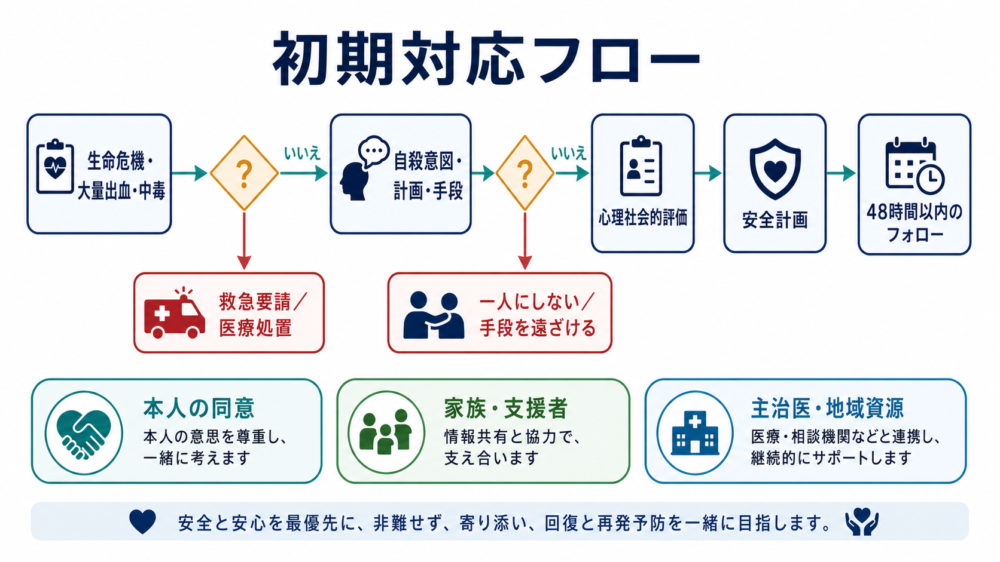
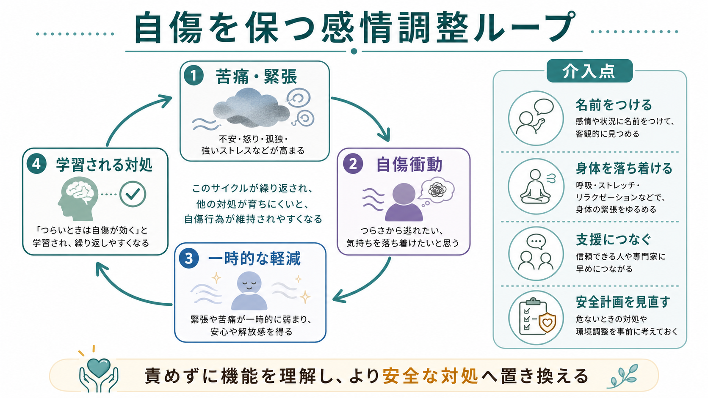

# 自傷行為への初期対応はどう行うか

## 要点

- 自傷行為への初期対応は、「身体の安全確保」と「心理社会的評価」を並行して行う。傷の処置だけ、あるいは自殺意図の確認だけで終えない。
- 生命危機、大量出血、中毒、意識障害、強い興奮、継続する自殺意図がある場合は、救急医療と安全確保を優先する。
- 「死ぬつもりだったか」だけでなく、意図、計画、手段へのアクセス、過去の企図、現在の孤立、保護因子を具体的に確認する[1][3]。
- 自傷はしばしば苦痛や緊張を一時的に下げる感情調整として機能する。責めるよりも、機能を理解し、より安全な対処へ置き換える[5]。
- 再発予防は、安全計画、手段制限、短期間のフォロー、家族・支援者・主治医との連携を組み合わせる[1][7]。

## この記事で答える問い

この記事は、医療・福祉・教育・家族支援の場で自傷行為を把握した直後に、何を優先し、何を確認し、どこへつなぐかを整理する。教育・研究目的のノートであり、個別事例の診断や治療指示ではない。現に生命の危険がある、出血が止まらない、過量服薬や中毒が疑われる、本人が今も死にたい意図を強く示す場合は、地域の救急・危機対応資源につなぐ。

## まず結論

初期対応の骨格は、**安全確保、身体評価、自殺意図評価、感情調整支援、再発予防**の5段階である。ただし現場では順番どおりに進むとは限らない。例えば、傷の圧迫止血をしながら「今も自分を傷つけたい気持ちは続いているか」を確認し、危険物を遠ざけ、本人を一人にしない判断を同時に行う。

## 背景

自傷は、診断名ではなく行動の記述である。自殺を意図した行為、自殺意図が曖昧な行為、死ぬ意図を伴わない非自殺性自傷が連続的に存在する。そのため、「浅い傷だから安全」「本人が死ぬ気はないと言ったから評価不要」とは判断できない。NICE は、救急や一般医療、精神保健の場で、自傷を理由に支援を求めた人に対して、身体的治療と心理社会的評価を適切に提供し、懲罰的・拒否的な対応を避けることを強調している[1]。

自傷行為の後は、羞恥、恐怖、怒り、解離、家族との衝突、薬物・アルコール、孤立、医療不信が重なりやすい。初期対応の質は、その後の援助希求に影響する。本人を「操作的」「注目を集めたいだけ」とみなすと、危険評価が粗くなり、支援につながる機会を失う。

## 基本概念

### 自傷と自殺企図は重なりうる

自傷行為は、意図で分類すると、自殺企図、非自殺性自傷、意図不明の自傷に分けられる。しかし臨床的には、本人の語りが揺れることがある。直後は「死ぬ気はなかった」と話しても、計画性、手段の致死性、孤立、飲酒、過去の企図が重なる場合は、[[自殺リスクへの危機対応とは何か]]として扱う必要がある[1][3]。

### 「リスク尺度」だけで帰結を決めない

初期対応では、チェックリストや点数だけで入院・帰宅・紹介を決めない。NICE は、将来の自殺や再自傷を予測する目的でリスク評価尺度を単独使用しないことを推奨している[1]。必要なのは、現在の危険、本人の文脈、利用できる支援、環境調整の可能性を合わせた臨床判断である。

### 感情調整としての機能

非自殺性自傷では、強い苦痛、緊張、怒り、空虚感、解離感を下げるために行われることが多い。Nock のレビューは、自傷の機能を、苦痛を下げる自動的負の強化、何かを感じるための自動的正の強化、他者から支援や反応を得る対人的機能などに整理している[5]。これは自傷を正当化する説明ではなく、置き換え可能な対処を見つけるための見立てである。

## 仕組み

### 1. 傷と身体状態を先に見る

切創・擦過傷・熱傷などがある場合は、出血、深さ、汚染、異物、神経・腱・血管損傷の疑い、感染兆候、破傷風リスクを確認する。大量出血、止血困難、深い創、顔面・手指・関節部の損傷、意識障害、過量服薬・薬物中毒、アルコール影響がある場合は、精神面の面接より救急評価を優先する。破傷風予防では、CDC が創の清潔度、ワクチン歴、免疫不全、TIG の要否を分けて判断する枠組みを示している[4]。

ここで重要なのは、傷の処置を「叱責の場」にしないことである。処置の説明、同意、痛みへの配慮、プライバシー保護は、再相談のしやすさに直結する。身体処置を終えたら、[[精神科医療安全の特徴は何か]]の観点から、観察、記録、引き継ぎを残す。

### 2. 自殺意図と現在の危険を具体的に尋ねる

自殺意図評価では、抽象的に「大丈夫？」と聞くだけでは不十分である。SAMHSA の SAFE-T は、リスク因子、保護因子、自殺念慮、リスク水準、介入と記録を5段階で整理する[3]。実務では、少なくとも次を確認する。

- 今も死にたい気持ち、自傷したい衝動が続いているか。
- いつ、どこで、何を使い、どの程度の致死性を想定していたか。
- 具体的な計画、準備、遺書、検索、手段へのアクセスがあるか。
- 過去の自殺企図、自傷、精神疾患、物質使用、急性ストレスがあるか。
- 一人で帰れる状態か、支援者が同席・連絡・見守りできるか。

高リスクが疑われる場合は、本人を一人にせず、危険物・薬剤・刃物・紐状物・高所などへのアクセスを減らし、救急・精神科・地域危機対応へつなぐ。過量服薬が関係する場合は、[[過量服薬リスクへの対応とは何か]]の評価も同時に行う。

### 3. 感情調整支援は短く、具体的に行う

初期対応の場で長時間の心理療法を行う必要はない。むしろ、短く具体的に「今この場を安全に通過する」支援が重要である。具体的には、低い声で短く話す、刺激を減らす、本人の言葉を反復する、感情に名前をつける、呼吸・冷水・感覚刺激・姿勢変更など身体を落ち着ける方法を選択肢として示す。

このとき、「なぜやったの」「約束したのに」と詰問すると、羞恥や防衛が強まりやすい。代わりに、「その時に一番下げたかった苦しさは何だったか」「切る以外で少しでも下げられたことはあったか」と、機能を尋ねる。継続支援では、[[DBTの感情調整スキルとは何か]]や[[DBTの苦痛耐性スキルとは何か]]が、衝動の波をやり過ごす実践的スキルとして接続しやすい。

### 4. 安全計画と手段制限を作る

帰宅・退院・次回面接までの間に、再自傷や自殺企図の危険が高まる時間帯を想定して、[[安全計画とは何か]]を簡潔に作る。安全計画には、危険サイン、本人が一人でできる対処、注意をそらせる場所・人、連絡できる支援者、専門機関、手段を遠ざける方法を含める。Stanley と Brown らの研究では、安全計画介入に電話フォローを組み合わせた群で、その後の自殺関連行動が少なく、外来支援への参加が高いことが報告されている[7]。

手段制限は、本人の自由を罰として奪うことではない。衝動が強い数十分から数時間を越えるために、薬の小分け、刃物・紐状物・危険物の一時管理、高所や孤立場所を避ける、支援者と同じ空間で過ごすなど、実行までの距離を伸ばす環境調整である。

### 5. 48時間以内の接触と継続支援につなぐ

自傷後の初期対応は、その日の安全確保だけで完結しない。NICE は、心理社会的評価、ケア計画、支援者との協働、継続的な治療・支援への接続を重視している[1]。可能なら48時間以内に電話、訪問、外来、学校・職場・家族との連絡など、次の接触点を明確にする。自殺企図に近い場合は、[[自殺未遂後の再企図予防とは何か]]として、退院後・帰宅後の空白を減らす。

## 図解

この記事では、画像として次の2点を本文に挿入した。

| 図 | 役割 | 本文内の位置 |
|---|---|---|
| 自傷行為への初期対応フロー | 生命危機、自殺意図、心理社会的評価、安全計画、フォローの流れ | 「まず結論」 |
| 自傷を保つ感情調整ループ | 苦痛から自傷衝動、一時的軽減、学習される対処への循環 | 「基本概念」 |

追加で作るなら、「家族・支援者に何を共有し、何を本人の同意なく扱わないか」を整理する比較表が有用である。

## 臨床・研究との接続

心理社会的介入のエビデンスは一枚岩ではない。Cochrane レビューでは、成人の自傷に対する心理社会的介入のうち、認知行動療法に基づく介入は再自傷を減らす可能性が示される一方、研究間の異質性や確実性の限界もある[6]。したがって初期対応では、「この場で治す」よりも、評価、短期安全確保、継続介入への橋渡しを目的にする。

DBT は、反復自傷、感情調整困難、対人危機が目立つ人に接続しやすい治療モデルである。既存ノートでは、[[弁証法的行動療法DBTとは何か]]、[[DBTの感情調整スキルとは何か]]、[[DBTの苦痛耐性スキルとは何か]]を参照できる。ただし、初期対応者がDBTを十分に実施できなくても、責めない態度、衝動の波を越える支援、具体的な安全計画は実践できる。

## よくある誤解

### 「浅い傷なら自殺リスクは低い」

傷の深さは重要な身体情報だが、自殺リスクを単独では決めない。手段の致死性が低くても、本人が強い絶望、明確な計画、孤立、過去の企図を持つことがある。逆に、致死性の高い手段でも本人の意図が曖昧な場合がある。意図、文脈、手段アクセス、支援資源を合わせて評価する[1][3]。

### 「自傷を話題にすると悪化する」

自殺念慮や自傷衝動を具体的に尋ねることは、危険を高めるためではなく、隠れた危険を共同で扱うために行う。大切なのは、詰問や説教ではなく、具体的で落ち着いた質問にすることである。

### 「約束させれば再発を防げる」

「もうしません」と約束させるだけでは、衝動が戻った時の行動が決まらない。必要なのは、危険サイン、代替行動、支援者、専門機関、手段制限を含む具体的な安全計画である[7]。

### 「家族にはすべて知らせるべき」

未成年、生命危機、重大な安全リスクでは保護者・支援者との連携が必要になる。一方で、成人で直ちに重大危険がない場合は、本人の同意、プライバシー、関係性への影響を確認しながら共有範囲を決める。安全と尊厳を両立させる説明が重要である。

## 関連ノート

- [[安全計画とは何か]]
- [[自殺リスクへの危機対応とは何か]]
- [[自殺未遂後の再企図予防とは何か]]
- [[過量服薬リスクへの対応とは何か]]
- [[精神科医療安全の特徴は何か]]
- [[弁証法的行動療法DBTとは何か]]
- [[DBTの感情調整スキルとは何か]]
- [[DBTの苦痛耐性スキルとは何か]]
- [[トラウマインフォームドケアとは何か]]
- [[家族支援とは何か]]

## MOC更新候補

- `content/00_MOC/MOC｜臨床実践・治療.md`
- `content/00_MOC/MOC｜心理療法.md`

並列生成ジョブとの衝突を避けるため、本記事作成時点では MOC 本体は更新していない。

## 理解チェック

1. 自傷後の初期対応で、傷の処置と同時に確認すべき心理社会的リスクは何か。
2. 「死ぬ気はなかった」という発言だけで帰宅判断をしてはいけない理由は何か。
3. 自傷が感情調整として機能している場合、初期対応者はどのような聞き方をするとよいか。
4. 安全計画に含めるべき要素を、少なくとも4つ挙げよ。
5. 家族・支援者への共有で、本人の安全と尊厳を両立させるために確認すべきことは何か。

## 未解決問題

- 自傷後の短期フォローを、救急、学校、地域精神保健、オンライン相談の間でどう標準化するか。
- 非自殺性自傷と自殺企図が混在する事例で、本人の語りを尊重しつつ安全判断をどう記録するか。
- 家族支援、手段制限、本人のプライバシーのバランスを、文化・年齢・法制度ごとにどう調整するか。

## 参考文献

[1] National Institute for Health and Care Excellence. (2022). *Self-harm: assessment, management and preventing recurrence (NICE guideline NG225).* https://www.nice.org.uk/guidance/ng225

[2] World Health Organization. (2016). *mhGAP Intervention Guide for mental, neurological and substance use disorders in non-specialized health settings: version 2.0.* https://www.who.int/publications/i/item/9789241549790

[3] Substance Abuse and Mental Health Services Administration. (2024). *SAFE-T Suicide Assessment Five-Step Evaluation and Triage.* https://library.samhsa.gov/product/safe-t-suicide-assessment-five-step-evaluation-and-triage/pep24-01-036

[4] Centers for Disease Control and Prevention. (2024). *Clinical Guidance for Wound Management to Prevent Tetanus.* https://www.cdc.gov/tetanus/hcp/clinical-guidance/index.html

[5] Nock, M. K. (2010). Self-injury. *Annual Review of Clinical Psychology, 6*, 339-363. https://doi.org/10.1146/annurev.clinpsy.121208.131258

[6] Witt, K. G., Hetrick, S. E., Rajaram, G., Hazell, P., Salisbury, T. L. T., Townsend, E., & Hawton, K. (2021). Psychosocial interventions for self-harm in adults. *Cochrane Database of Systematic Reviews*, 4, CD012189. https://doi.org/10.1002/14651858.CD012189.pub2

[7] Stanley, B., Brown, G. K., Brenner, L. A., et al. (2018). Comparison of the Safety Planning Intervention with follow-up vs usual care of suicidal patients treated in the emergency department. *JAMA Psychiatry, 75*(9), 894-900. https://doi.org/10.1001/jamapsychiatry.2018.1776
