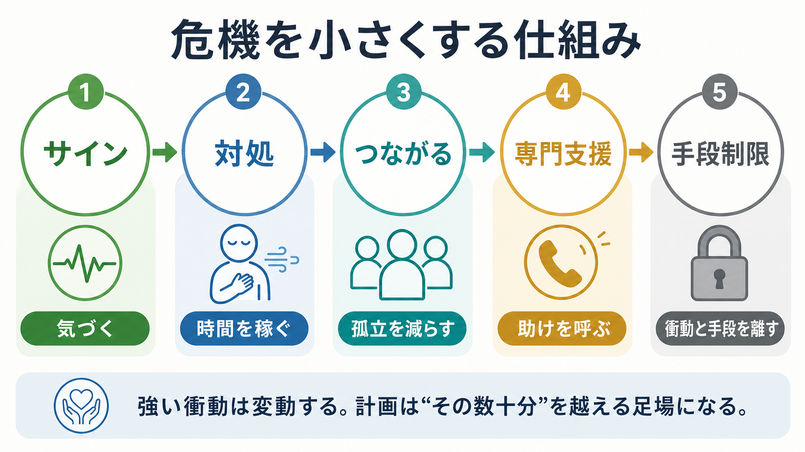
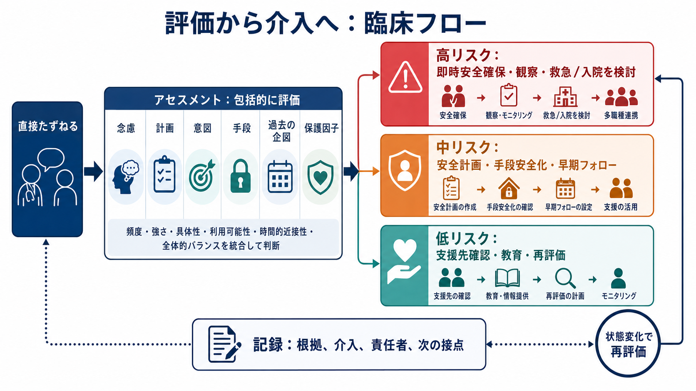

# 自殺リスクへの危機対応とは何か

## 要点

- 自殺リスクへの危機対応は、「将来の自殺を完全に予測する」作業ではなく、いま変えられる危険を見つけ、本人を一人にせず、手段へのアクセスを減らし、次の支援接点までつなぐ作業である。
- 評価では、希死念慮の有無だけでなく、計画性、意図、手段へのアクセス、過去の企図、物質使用、精神症状、身体疾患、孤立、保護因子を具体的に確認する[1][2]。
- リスク尺度や「低・中・高」の分類だけで処遇を決めるのは危険であり、NICEは自殺や自傷再発の予測・退院判断にリスク尺度や包括的な階層化を使わないよう推奨している[3]。
- 有効な危機対応の中核は、安全計画、手段安全化、家族・支援者・専門職との連携、短い間隔での再評価である[3][4][5]。
- この記事は教育・研究目的の整理であり、個別の診断、治療指示、法的判断の代替ではない。差し迫った危険がある場合は、地域の救急、医療機関、相談窓口など即時につながる必要がある。

## この記事で答える問い

自殺リスクへの危機対応とは、[[危機介入とは何か]]の一部であり、希死念慮や自殺企図の可能性がある人に対して「いま何を確認し、何を安全にし、誰へつなぐか」を決める実践である。この記事では、臨床・支援現場で混同されやすい評価、リスク分類、安全計画、手段安全化、記録、フォローアップを区別して整理する。

## まず結論

危機対応の第一目標は、本人の人生や苦痛を短時間で解決することではなく、「次の数時間から数日を生き延びる足場」を作ることである。そのために、支援者は直接たずね、否定せずに聴き、急性危険を具体化し、本人と協働して安全計画を作る。ここでいう安全計画は「自殺しない約束」ではなく、警告サイン、対処、連絡先、専門支援、手段安全化を順番に書いた実行可能な行動表である[4][5]。

一方で、自殺リスクは静的な属性ではない。睡眠不足、酩酊、対人トラブル、喪失、疼痛、退院直後、薬剤変更、孤立などで短時間に変動する。したがって、評価は一回で終わらせず、状態変化、帰宅、退院、支援者交代、治療変更の前後で再評価する必要がある[1][2]。

## 背景

WHOは、自殺予防を個人レベルの問題だけでなく、手段へのアクセス制限、メディア報道、若者の社会情動スキル、早期発見・評価・管理・フォローアップを含む多層的な公衆衛生課題として位置づけている[6]。日本の自殺総合対策大綱も、「誰も自殺に追い込まれることのない社会」を目標に、医療、地域、学校、職域、民間支援の連携を重視している[7]。これは[[自殺対策基本法とは何か]]や[[自殺未遂者支援では何を行うのか]]と直接つながる。

臨床現場では、希死念慮を聞くこと自体へのためらいが起こりやすい。しかし、SAFE-TやVA/DoDガイドラインは、危険因子と保護因子を確認し、自殺念慮・計画・行動・方法・意図を直接評価し、介入とフォローを記録する枠組みを示している[1][2]。重要なのは、質問することではなく、質問した後に安全確保へ移ることである。

## 基本概念

### 希死念慮

希死念慮は、「消えたい」「眠ったまま起きたくない」から、具体的な自殺の考えまで幅がある。確認では、頻度、持続時間、制御可能性、きっかけ、強さ、本人がどれほど行動に近いと感じているかを聞く。希死念慮があるだけで同じ対応になるわけではないが、軽く扱ってよいという意味でもない。

### 計画性と意図

計画性は、日時、場所、方法、準備行動、遺書、身辺整理、別れの連絡などの具体性を含む。意図は「死ぬつもりがどの程度あるか」であり、行動の切迫度を判断する中心情報である[1][2]。計画が具体的で、意図が強く、手段へすぐアクセスでき、酩酊や激しい焦燥がある場合は、短時間で危険が上がる。

### 手段へのアクセス

手段へのアクセスは、危機対応で最も変えやすい要素の一つである。WHOのLIVE LIFEや複数のレビューでは、致死的手段へのアクセス制限が自殺予防の主要な根拠ある介入として扱われている[6][8]。個別支援では、本人を責めるのではなく、「衝動が強い時間をやり過ごすために距離を作る」という説明で、家族・支援者・医療者と協働して手段安全化を行う。

### 保護因子

保護因子には、家族・友人・支援者とのつながり、ペットや役割、文化的・宗教的価値、治療関係、将来の予定、問題解決スキル、住居、経済支援などがある[1]。ただし、保護因子があることは、急性危険を打ち消す保証ではない。重い計画性や手段アクセスがある場合は、保護因子を確認しつつも安全確保を優先する。

## 仕組み

自殺リスクへの危機対応は、危険因子を「探す」だけでなく、危険因子を「下げる」方向に変換する。実務上は、次の順で考えると整理しやすい。

1. 直接たずねる  
   「死にたい気持ちはありますか」「自分を傷つける具体的な方法を考えていますか」のように、曖昧に避けず、落ち着いて聞く。誘導尋問ではなく、現在の安全を一緒に確認するための質問である。

2. 切迫度を具体化する  
   念慮、計画、意図、手段、準備行動、過去の企図、酩酊、精神病症状、躁状態、強い不眠・焦燥、身体疾患、疼痛、孤立を確認する[1][2]。[[うつ病とは何か]]や依存症、精神病症状の評価は、背景疾患の理解に役立つ。

3. 一人にしない  
   急性危険が高いと判断されるときは、本人を一人にせず、観察、付き添い、救急受診、入院検討、地域の緊急支援への連絡など、状況に応じた安全確保を行う[2][3]。

4. 手段を遠ざける  
   致死的手段や大量服薬につながる薬剤などへのアクセスを、本人と協働して制限する。これは罰ではなく、衝動と行動の間に時間と距離を作る介入である[3][6][8]。

5. 安全計画を作る  
   警告サイン、本人だけでできる対処、気をそらせる人・場所、連絡できる支援者、専門機関、手段安全化を紙やスマートフォンで確認できる形にする[3][4]。

6. 次の接点を予約する  
   「困ったら来てください」では弱い。いつ、誰が、どこで、どの手段で再接触するかを具体化し、可能なら支援者間で共有する。これは[[ケースマネジメントとは何か]]や[[多職種連携は地域精神医療でなぜ重要なのか]]と接続する。

## 図解

図の「高・中・低」は説明上の便宜であり、NICEが警告するように、包括的なリスク階層化だけで退院、入院、治療アクセスを決めるべきではない[3]。実際には、現在の切迫度、変動しやすい危険因子、本人のニーズ、環境の安全性、支援者の利用可能性を統合して、介入を組み合わせる。

| 確認する領域 | 具体的な問い | 危機対応で変える点 |
|---|---|---|
| 希死念慮 | どのくらい強く、どのくらい続くか | 一人で抱えない接点を作る |
| 計画性 | 日時、場所、方法、準備があるか | 具体的計画を中断する |
| 意図 | 行動に移すつもりがどの程度あるか | 観察、受診、入院検討を含める |
| 手段 | すぐ使える致死的手段があるか | 手段安全化、保管変更、支援者協力 |
| 過去の企図 | 以前の企図、救急受診、入院歴 | 再企図のパターンを理解する |
| 保護因子 | 生きる理由、関係、役割、治療関係 | 危機時に使える形へ具体化する |

## 臨床・研究との接続

自殺リスク対応は、[[心理測定と臨床判断はどう組み合わせるべきか]]の典型例である。尺度は情報整理や見落とし防止に役立つ場合があるが、単独で将来の自殺を正確に予測する道具ではない。NICEは、尺度や包括的な低・中・高リスク分類で将来の自殺・自傷反復を予測したり、治療提供や退院の判断をしたりしないよう明記している[3]。

救急や外来では、安全計画とフォローアップを組み合わせた Safety Planning Intervention が、通常ケアよりも6か月以内の自殺関連行動を減らし、外来行動保健治療への関与を高めた研究がある[4]。ただし、これは万能の単独介入ではなく、背景疾患の治療、家族支援、社会資源、住居・経済支援、物質使用への介入と組み合わせる必要がある。

地域では、[[地域精神医療とは何か]]、[[精神科訪問看護とは何か]]、[[精神保健福祉士とは何をする職種なのか]]、[[精神医療における権利擁護とは何か]]が重要になる。危機対応は本人の自由を不必要に奪うことではない。本人の意向と尊厳を確認しながら、最小限必要な安全確保を行う実践である。

## よくある誤解

### 「自殺について聞くと、かえって危険になる」

自殺について直接たずねることは、危機評価の基本である。問題は、聞くこと自体ではなく、聞いた後に安全確保、手段安全化、支援接続を行わないことである[1][2]。

### 「リスク分類で高くなければ安全」

リスクは変動する。NICEが強調するように、低・中・高の分類は将来予測や退院判断の根拠として使うべきではない[3]。むしろ、本人のニーズ、現在の安全、変化しうる危険因子を丁寧に定式化する。

### 「安全計画は、本人に約束させること」

安全計画は契約ではない。警告サインに気づき、対処し、人へつながり、専門支援へ連絡し、手段を遠ざけるための具体的な手順表である[3][4][5]。

### 「保護因子があるなら大丈夫」

保護因子は重要だが、強い意図、具体的計画、手段アクセス、酩酊、激しい焦燥などを自動的に打ち消すわけではない。保護因子は、危機時に実際に使える形にして初めて安全確保に寄与する[1]。

## 関連ノート

- [[危機介入とは何か]]
- [[自殺未遂者支援では何を行うのか]]
- [[自殺対策基本法とは何か]]
- [[心理測定と臨床判断はどう組み合わせるべきか]]
- [[ケースマネジメントとは何か]]
- [[多職種連携は地域精神医療でなぜ重要なのか]]
- [[地域精神医療とは何か]]
- [[精神科訪問看護とは何か]]
- [[精神医療における権利擁護とは何か]]
- [[うつ病とは何か]]

## MOC更新候補

- `content/00_MOC/MOC｜臨床実践・治療.md`
- `content/00_MOC/MOC｜精神医学.md`
- `content/00_MOC/MOC｜司法・制度・地域精神医療.md`

## 理解チェック

1. 自殺リスク評価で、希死念慮の有無だけでなく確認すべき項目は何か。
2. 手段安全化は、なぜ危機対応の中心になるのか。
3. 「低・中・高リスク」の分類だけで退院や治療提供を決めてはいけない理由は何か。
4. 安全計画と「自殺しない約束」は何が違うか。
5. 保護因子を聞くだけでなく、危機時に使える形にするには何を具体化すべきか。

## 未解決問題

- 個人レベルの急性リスクを、短時間で高精度に予測する方法はまだ限られている。
- 安全計画、手段安全化、フォローアップを、救急、外来、地域、学校、職域でどのように継続実装するかは制度設計の課題である。
- 本人の自己決定、家族・支援者への情報共有、守秘義務、緊急安全確保のバランスは、国や地域の法制度、臨床状況により慎重な判断を要する。

## 参考文献

[1] Substance Abuse and Mental Health Services Administration. (2024). *SAFE-T Suicide Assessment Five-Step Evaluation and Triage*. https://library.samhsa.gov/product/safe-t-suicide-assessment-five-step-evaluation-and-triage/pep24-01-036

[2] Department of Veterans Affairs & Department of Defense. (2024). *VA/DoD Clinical Practice Guideline for Assessment and Management of Patients at Risk for Suicide*. https://www.healthquality.va.gov/guidelines/mh/srb/

[3] National Institute for Health and Care Excellence. (2022). *Self-harm: assessment, management and preventing recurrence (NICE guideline NG225)*. https://www.nice.org.uk/guidance/ng225

[4] Stanley, B., Brown, G. K., Brenner, L. A., et al. (2018). Comparison of the Safety Planning Intervention With Follow-up vs Usual Care of Suicidal Patients Treated in the Emergency Department. *JAMA Psychiatry, 75*(9), 894-900. https://doi.org/10.1001/jamapsychiatry.2018.1776

[5] Stanley, B., & Brown, G. K. (2012). Safety planning intervention: a brief intervention to mitigate suicide risk. *Cognitive and Behavioral Practice, 19*(2), 256-264. https://doi.org/10.1016/j.cbpra.2011.01.001

[6] World Health Organization. (2021). *LIVE LIFE: An implementation guide for suicide prevention in countries*. https://www.who.int/publications/i/item/9789240026629

[7] 厚生労働省. (2022). *自殺総合対策大綱：誰も自殺に追い込まれることのない社会の実現を目指して*. https://www.mhlw.go.jp/stf/taikou_r041014.html

[8] Mann, J. J., Michel, C. A., & Auerbach, R. P. (2021). Improving suicide prevention through evidence-based strategies: a systematic review. *American Journal of Psychiatry, 178*(7), 611-624. https://doi.org/10.1176/appi.ajp.2020.20060864
