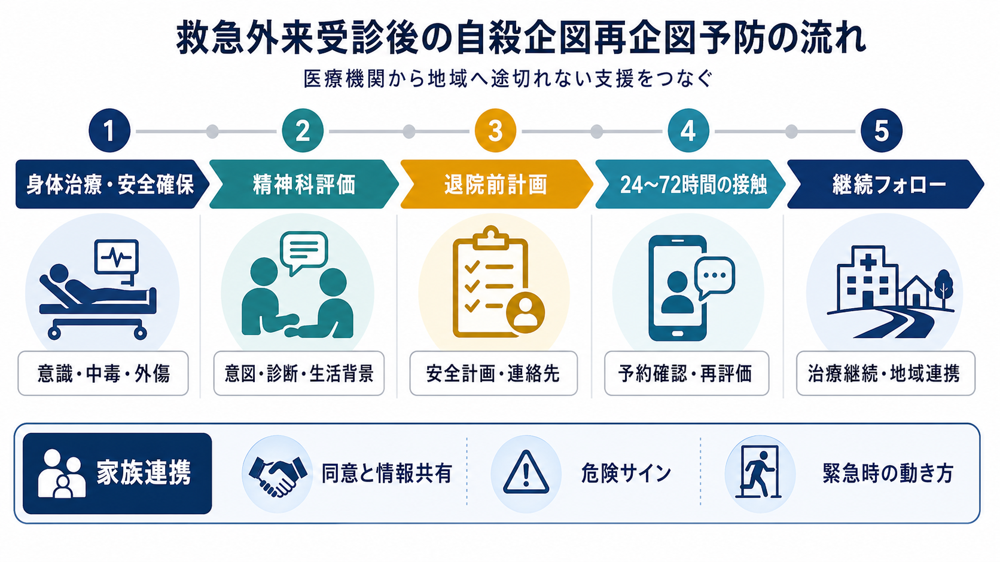
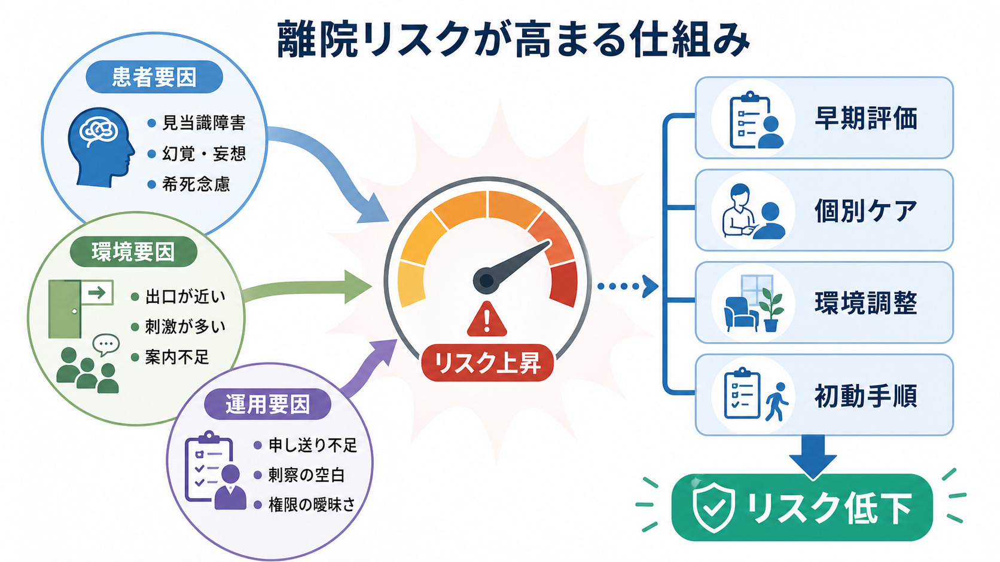

# 自殺未遂後の再企図予防とは何か

## 要点

- 自殺未遂後の再企図予防は、「危険度を一度判定すること」ではなく、救急対応、精神科評価、安全計画、手段へのアクセス低減、退院後フォローアップ、家族・地域連携を切れ目なくつなぐ実践である。
- NICE は、自傷後のできるだけ早い時期に精神保健専門職による心理社会的評価を行い、退院前に管理計画、関係機関連携、アフターケア、一次医療への明確な連絡を整えることを推奨している[1]。
- Safety Planning Intervention と電話フォローを組み合わせた研究、ED-SAFE、ACTION-J は、救急外来を「再企図予防の入口」として使えることを示している。ただし効果は介入内容、対象、追跡期間、地域資源によって変わる[4][5][6]。
- 家族連携は監視を押しつけることではない。本人の同意、守秘、危機時の安全、手段へのアクセス低減、支援者の疲弊を同時に扱う必要がある[1][3]。

## この記事で答える問い

1. 自殺未遂後の「再企図予防」は、救急処置の後に何を継続することなのか。
2. 精神科評価では、何を単なるリスクスコアではなく臨床的な定式化として見るのか。
3. 安全計画、手段へのアクセス低減、フォローアップ、家族連携はどのように組み合わさるのか。

## まず結論

本記事は教育・研究目的の整理であり、個別事例の診断、入退院判断、治療指示を置き換えるものではない。切迫した危険がある場合は、地域の救急・精神科救急・相談窓口など、実際に利用できる緊急支援につなぐ必要がある。

自殺未遂後の再企図予防とは、本人を「危険人物」として分類する作業ではなく、危機が再燃したときに致死的な行動へ進みにくい環境と支援経路を作ることである。救急では身体治療と安全確保を優先し、その直後から[[精神科救急では何を優先するべきか|精神科救急]]として、意図、計画性、手段、精神症状、物質使用、身体疾患、生活背景、支援者、今後の受診可能性を評価する。評価後は、本人と共有できる安全計画、手段へのアクセス低減、早期接触、外来・地域資源への接続を文書化する[1][2][3]。

重要なのは、退院や帰宅を「支援終了」と見なさないことである。救急外来や身体科病棟で生命の危機を脱しても、孤立、羞恥、対人葛藤、睡眠障害、飲酒、治療中断、退院直後の空白が重なると、再企図の危険は残る。したがって再企図予防は、短期の安全と中期の治療継続を同じ計画に載せる実践である。

## 背景

自殺未遂は、その後の自殺死亡や再企図の重要な危険因子である。WHO は自殺予防を、手段へのアクセス制限、責任あるメディア報道、若者の社会情動スキル、そして自殺行動・自傷を経験した人の早期同定、評価、管理、フォローアップを含む多層的な公衆衛生課題として整理している[2]。臨床現場では、この公衆衛生的枠組みを、救急、精神科、一次医療、家族、地域相談、福祉に落とし込む必要がある。

自殺未遂後の支援で難しいのは、危険が一つの原因で決まらない点である。[[自殺リスク評価では何を聞くべきか|自殺リスク評価]]では、希死念慮の強さだけでなく、具体的な計画、手段へのアクセス、過去の企図、精神疾患、睡眠、疼痛、飲酒・薬物、衝動性、喪失体験、孤立、経済問題、家族関係、受診継続性を合わせて見る。これは「低・中・高」と点数化するためではなく、何を変えると次の危機が致死的になりにくいかを見つけるためである[1][3]。

## 基本概念

### 再企図予防

再企図予防は、次の危機を完全に予測することではない。短期予測には限界があるため、予測に過度に依存するよりも、危機時に使える具体的な手順、支援者、受診先、手段へのアクセス低減を準備するほうが実践的である[3]。これは[[危機介入とは何か|危機介入]]の一部であり、同時に退院後支援、外来治療、地域連携の入口でもある。

### 心理社会的評価

心理社会的評価は、本人がなぜその行動に至ったかを、診断名だけでなく生活史、現在のストレス、支援関係、本人の意味づけから理解する作業である。NICE は、自傷後のできるだけ早い機会に精神保健専門職が心理社会的評価を行い、本人と治療的関係を作り、本人と家族・支援者に必要な情報を提供することを推奨している[1]。[[自殺念慮と自殺企図は何が違うのか|自殺念慮と自殺企図]]の違いを確認するだけでなく、行動に至る連鎖を一緒にほどくことが重要である。

### 安全計画

安全計画は、「自殺しないと約束する」ことではない。危険サイン、本人だけで使える対処、気をそらせる場所や人、連絡できる家族・支援者、専門機関、緊急時の受診先、手段へのアクセス低減を、本人と協働して短い手順にする実践である。VA/DoD ガイドラインは、危機反応計画や安全計画、致死的手段へのアクセス低減を急性リスク管理の主要な構成要素として扱っている[3]。

### 家族連携

家族連携は、本人の同意と守秘を無視して情報を広げることではない。一方で、急性の生命リスクがあるとき、家族・同居者・支援者が危険サイン、緊急連絡先、手段へのアクセス低減、受診同行の役割を知らなければ、安全計画は実行されにくい。[[家族支援とは何か|家族支援]]では、本人の権利、家族の負担、支援者の安全を同時に扱う。

## 仕組み

再企図は、希死念慮だけで自動的に起こるわけではない。睡眠不足、飲酒、解離、激しい対人葛藤、疼痛、退院後の孤立、恥や罪悪感、受診予約までの空白、手段への近さが重なると、危機が短時間で高まることがある。したがって、再企図予防の仕組みは三層で考えるとわかりやすい。

第一に、危機の再燃を早く見つける。本人が自分の危険サインを言語化し、家族や支援者も「何が起きたら連絡するか」を共有する。第二に、衝動と致死的手段が近づく時間帯を短くし、手段へのアクセスを下げる。第三に、フォローアップを早く入れ、孤立と治療中断を減らす。Stanley らの研究では、救急外来での安全計画介入と構造化された電話フォローを組み合わせた群で、通常ケアより自殺行動が少なく、外来治療への接続も高かった[4]。

## 図解

| 段階 | 主要な問い | 具体的な対応 |
|---|---|---|
| 身体治療・安全確保 | 意識障害、中毒、外傷、身体合併症は安定しているか | 救命処置、観察、せん妄・中毒・疼痛の評価、離院リスクへの配慮 |
| 精神科評価 | なぜ今起きたのか、次に何が危険になるか | 希死念慮、計画性、手段、診断、物質使用、生活背景、支援者、意思決定能力を評価 |
| 退院前計画 | 帰宅後の空白をどう減らすか | 安全計画、手段へのアクセス低減、連絡先、受診予約、一次医療・地域への連絡 |
| 早期フォロー | 退院直後に孤立していないか | 電話、訪問、外来予約確認、症状再評価、家族・支援者との役割確認 |
| 継続フォロー | 治療と生活支援が続いているか | 精神科治療、心理社会的支援、福祉・地域資源、再発サインの見直し |

## 臨床・研究との接続

救急外来での介入研究は、短時間でも意味のある介入が可能であることを示している。ED-SAFE 研究では、自殺リスクのスクリーニング、救急外来での短時間介入、退院後電話フォローを組み合わせた多面的介入により、12か月の観察期間で自殺企図数が減少した[5]。これは、救急外来が単なる「入口」ではなく、治療継続へつなぐ能動的な接点になりうることを示す。

日本の ACTION-J では、救急医療機関に入院した自殺未遂者に対する積極的ケースマネジメントが検討された。研究計画の段階から、救急での危機介入、精神科評価、心理教育、継続的ケースマネジメントを組み合わせる設計が重視されていた[7]。全追跡期間で主要アウトカムの有意差は明確ではなかったが、6か月までの再企図抑制が示唆され、実臨床でケースマネジメントを行う可能性を示した[6]。この結果は、「一回の面接で終わらせない」「診断、社会的リスク、ニーズに応じて支援を調整する」ことの重要性を示している。

研究を臨床に移すときには、効果の大きさだけでなく実装条件を見る必要がある。電話できる番号があるか、本人が連絡を受けられる生活状況か、家族が支援可能か、地域の相談機関が機能しているか、外来予約まで何日空くかによって、同じ安全計画でも実効性は変わる。[[地域連携は精神科診療で何を意味するのか|地域連携]]は、紹介状を出すことだけでなく、危機時にどの機関が何をするかを共有することである。

## よくある誤解

### リスクスコアが低ければ退院してよい

リスクスコアは補助情報であり、退院可否を単独で決めるものではない。NICE は、退院前に心理社会的評価、今後の管理計画、関係者との退院計画、アフターケアの明確化が必要であると整理している[1]。短期予測の限界を考えると、「低リスク」と書くより、何が再燃サインで、何が保護因子で、どの支援がいつ入るかを明記するほうが臨床的である。

### 本人が「もう大丈夫」と言えばフォローは不要である

危機が過ぎた直後には、疲労、羞恥、家族への遠慮、入院回避の希望から、本人が危険を小さく表現することがある。もちろん本人の言葉を疑う姿勢で聞くべきではないが、睡眠、飲酒、手段、支援者、受診予約、帰宅後の環境を具体的に確認する必要がある。[[希死念慮とは何か|希死念慮]]は変動しうるため、フォローアップは「信用していないから」ではなく、変動する危機に備えるために行う。

### 家族に見守らせれば十分である

家族だけに安全管理を任せると、家族が疲弊し、本人も監視されていると感じやすい。必要なのは、家族に責任を移すことではなく、本人、家族、医療、地域が同じ安全計画を見て、限界時には医療や救急へ戻れるようにすることである。特に、家族内葛藤やDV、虐待、孤立が背景にある場合、家族連携そのものが危険を高めることもあるため、[[意思決定支援とは何か|意思決定支援]]と安全確保を分けて考える。

### 精神科診断がつけば再企図予防は終わる

診断は重要だが、再企図予防そのものではない。[[精神疾患と自殺リスクはどう関係するのか|精神疾患と自殺リスク]]を評価し、うつ病、双極性障害、統合失調症、物質使用、PTSD、パーソナリティ病理、発達特性、身体疾患を治療につなぐ必要がある。一方で、診断が未確定でも、安全計画、手段へのアクセス低減、フォローアップ、生活支援は開始できる。

## 関連ノート

- [[自殺未遂者支援では何を行うのか]]
- [[自殺リスク評価では何を聞くべきか]]
- [[精神科救急では何を優先するべきか]]
- [[危機介入とは何か]]
- [[自殺念慮と自殺企図は何が違うのか]]
- [[希死念慮とは何か]]
- [[精神疾患と自殺リスクはどう関係するのか]]
- [[家族支援とは何か]]
- [[地域連携は精神科診療で何を意味するのか]]

## 理解チェック

1. 自殺未遂後の再企図予防を、単なる「リスク判定」ではなく「支援経路の設計」と見る理由は何か。
2. 心理社会的評価で、希死念慮の有無以外に確認すべき要素を三つ挙げられるか。
3. 安全計画と「自殺しない約束」は何が違うか。
4. 家族連携が有効になる条件と、かえって危険になりうる条件は何か。
5. 退院直後のフォローアップでは、予約確認以外に何を再評価すべきか。

## 関連ノート候補

- 自殺安全計画とは何か
- 致死的手段へのアクセス低減とは何か
- 退院直後の自殺リスクをどう下げるのか
- 精神科救急における家族支援とは何か
- 自殺未遂者支援におけるケースマネジメントとは何か

## MOC更新候補

- `content/00_MOC/MOC｜臨床実践・治療.md` の医療安全・危機対応セクションに本記事を追加する候補。
- `content/00_MOC/MOC｜司法・制度・地域精神医療.md` の危機介入・救急・自殺対策関連セクションに本記事を追加する候補。

## 未解決問題

- 救急外来から地域支援へつなぐ標準的な連絡様式と責任分担を、地域差の大きい日本の医療圏でどう実装するか。
- 電話、SMS、アプリ、訪問、外来をどのように組み合わせると、本人の負担を増やさず継続率を高められるか。
- 家族がいない、家族関係が危険、住居が不安定、物質使用が強い場合の安全計画をどう個別化するか。
- 再企図予防のアウトカムを、再企図の有無だけでなく、治療継続、生活安定、本人の尊厳、家族負担まで含めてどう評価するか。

## 参考文献

[1] National Institute for Health and Care Excellence. (2022). *Self-harm: assessment, management and preventing recurrence* (NICE Guideline NG225). https://www.nice.org.uk/guidance/ng225

[2] World Health Organization. (2021). *LIVE LIFE: An implementation guide for suicide prevention in countries*. https://www.who.int/publications/i/item/9789240026629

[3] U.S. Department of Veterans Affairs & U.S. Department of Defense. (2024). *VA/DoD Clinical Practice Guideline for Assessment and Management of Patients at Risk for Suicide*. https://www.healthquality.va.gov/guidelines/MH/srb/

[4] Stanley, B., Brown, G. K., Brenner, L. A., et al. (2018). Comparison of the Safety Planning Intervention with follow-up vs usual care of suicidal patients treated in the emergency department. *JAMA Psychiatry, 75*(9), 894-900. https://doi.org/10.1001/jamapsychiatry.2018.1776

[5] Miller, I. W., Camargo, C. A., Arias, S. A., et al. (2017). Suicide prevention in an emergency department population: The ED-SAFE study. *JAMA Psychiatry, 74*(6), 563-570. https://doi.org/10.1001/jamapsychiatry.2017.0678

[6] Kawanishi, C., Aruga, T., Ishizuka, N., et al. (2014). Assertive case management versus enhanced usual care for people with mental health problems who had attempted suicide and were admitted to hospital emergency departments in Japan (ACTION-J): A multicentre, randomised controlled trial. *The Lancet Psychiatry, 1*(3), 193-201. https://doi.org/10.1016/S2215-0366(14)70259-7

[7] Hirayasu, Y., Kawanishi, C., Yonemoto, N., et al. (2009). A randomized controlled multicenter trial of post-suicide attempt case management for the prevention of further attempts in Japan (ACTION-J). *BMC Public Health, 9*, 364. https://doi.org/10.1186/1471-2458-9-364
