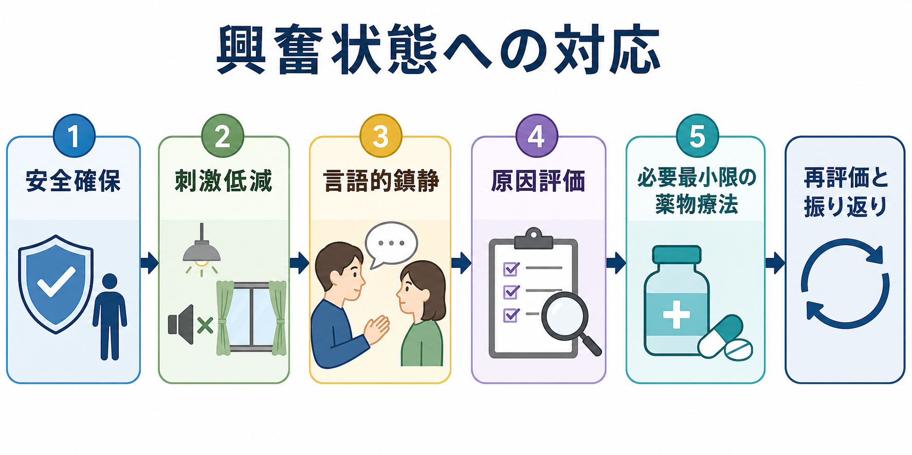
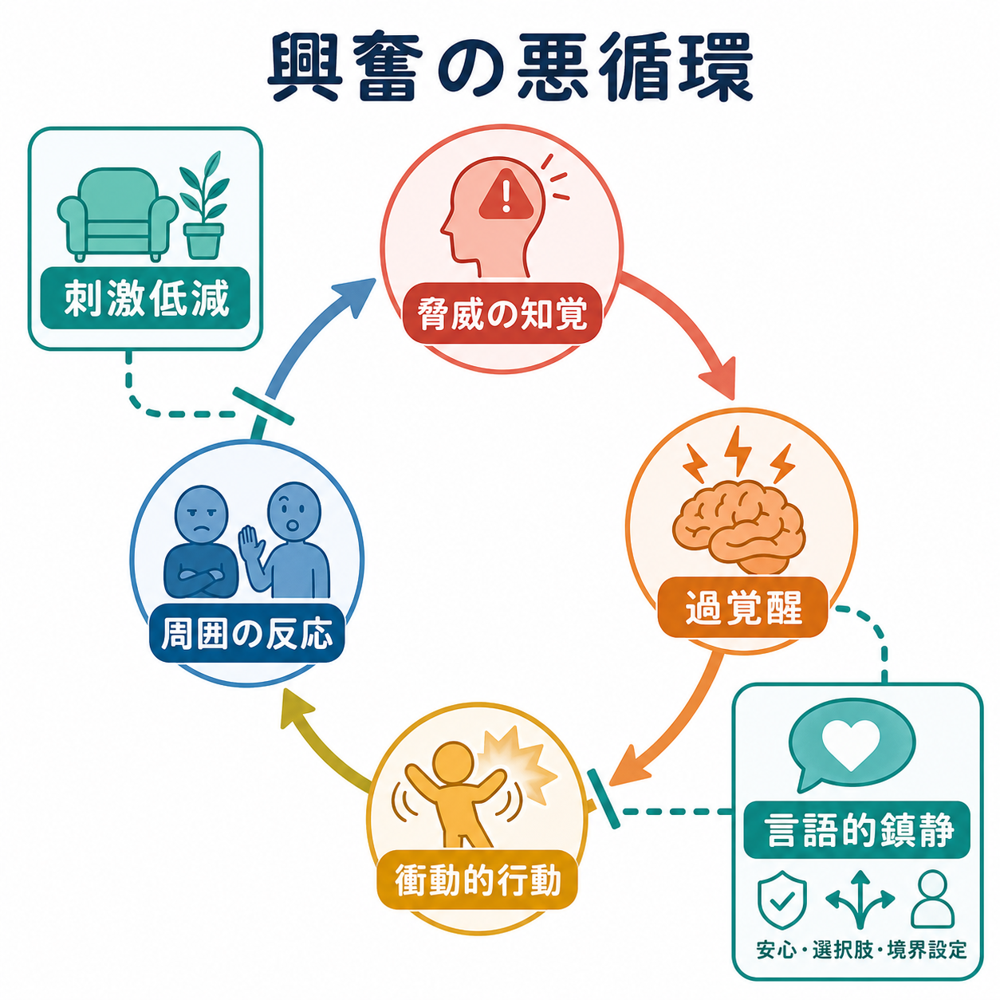
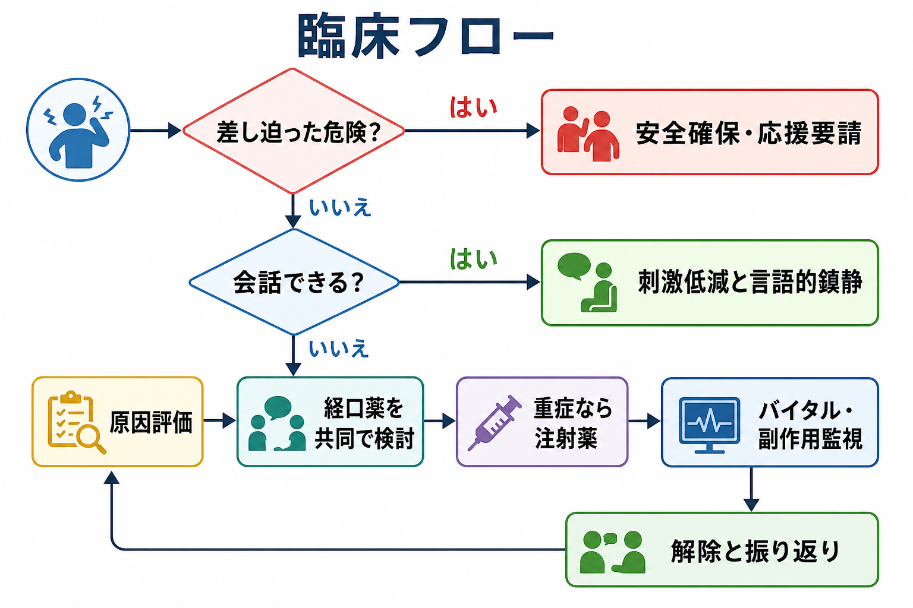

# 興奮状態への対応はどう行うか

## 要点

- 興奮状態への対応は、「早く黙らせる」ことではなく、本人・周囲・職員の安全を守りながら、評価と治療を可能にする危機介入である。
- 最初に行うのは薬物投与ではなく、安全確保、応援要請、危険物・退路・周囲の人の確認、刺激低減である。
- 会話が可能なら、短い言葉、低い声、十分な距離、選択肢の提示、明確な境界設定を使って言語的ディエスカレーションを試みる。
- 薬物療法は、言語的鎮静や環境調整だけでは安全を保てない場合に、原因と身体リスクを評価しながら、必要最小限に用いる。
- 隔離・身体拘束・強制的な注射は、最後の手段であり、開始時点から解除、観察、説明、記録、事後レビューを設計する。

## この記事で答える問い

このノートでは、外来、救急、病棟、地域支援の現場で出会う「興奮している人」に対して、どの順番で何を確認し、どこまで言語的に対応し、どの時点で薬物療法や制限的介入を検討するかを整理する。内容は教育・研究目的の一般的整理であり、個別症例の診断や処方指示ではない。実際の対応では所属機関の手順、法制度、職種ごとの権限、地域の救急体制に従う。

## まず結論

興奮状態では、介入の優先順位を「安全確保 → 刺激低減 → 言語的鎮静 → 原因評価 → 必要最小限の薬物療法 → 再評価」と置く。Project BETA は、興奮対応の目標を、身体疾患の除外、急性危機の安定化、強制の回避、最小制限、治療同盟、適切な方針決定に整理している[1]。NICE も、暴力・攻撃性の管理では、本人の尊厳と職員安全の両方を優先し、言語的ディエスカレーションや刺激低減を含む心理社会的手段を先行させることを推奨している[2]。

## 背景

興奮は、精神疾患の症状だけでなく、せん妄、低血糖、頭部外傷、感染、低酸素、薬物中毒・離脱、疼痛、アカシジア、強い恐怖、環境刺激、対人葛藤などから生じる行動上の緊急状態である。したがって、興奮している人を「精神科的な問題」と即断すると、身体疾患や薬剤性要因を見逃す危険がある[3]。この点は、[[精神科救急では何を優先するべきか]]、[[医療安全とは何か]]、身体合併症急変時の対応とも接続する。

また、興奮は本人の意思だけで決まるものではない。騒音、照明、人の多さ、長い待ち時間、説明不足、身体的不快、職員の威圧的態度、過去のトラウマ体験は、脅威の知覚と過覚醒を高めうる。したがって対応の焦点は、本人を一方的に変えることではなく、周囲の刺激と相互作用を変え、安全な選択肢を増やすことである。

## 基本概念

### 興奮は連続体として見る

興奮は、不安、焦燥、落ち着きのなさ、声量の増大、要求の反復、怒り、脅し、物を叩く、接近、暴力といった連続体として現れる。軽度の段階で気づけば、環境調整と言語的鎮静だけで落ち着く可能性がある。重度で差し迫った危険がある場合は、会話を続けること自体が危険となるため、応援要請、退避、周囲の保護、緊急対応に切り替える。

### 鎮静は「評価できる程度に落ち着く」ことを目標にする

急性興奮での薬物療法の目標は、意識を失わせることではなく、安全に会話・診察・原因評価ができる程度に落ち着くことである。Project BETA の薬物療法ワークグループは、薬剤選択を原因推定に基づけること、せん妄や身体疾患が疑われるときは基礎疾患の治療を優先することを強調している[4]。

### 制限的介入は最後の手段である

隔離、身体拘束、強制的な薬物投与は、本人や他者への差し迫った危険を避けるために、より制限の少ない手段が無効または不可能な場合に限って検討される。日本でも精神科病院における行動制限最小化の取り組みが厚生労働省により整理されており、行動制限は必要最小限性、代替困難性、継続的な解除検討、権利擁護と切り離せない[5]。関連して[[精神科医療における行動制限最小化とは何か]]、[[精神科医療安全の特徴は何か]]を参照する。

## 仕組み

興奮は、脅威の知覚、過覚醒、衝動的行動、周囲の強い反応が循環することで増幅する。本人が「攻撃している」ように見える場面でも、本人の主観では「追い詰められている」「危険から逃げたい」「説明されていない」「痛い」「怖い」という体験であることがある。

この悪循環を断つ主な介入点は二つある。第一に、音、光、人の密集、見物人、威圧的な姿勢、長い説明を減らす。第二に、本人が処理できる短い言葉で、安全、選択肢、限界を伝える。Project BETA の言語的ディエスカレーションは、本人を言葉で説き伏せる技術ではなく、接触を作り、共同関係を作り、本人が自分で制御を取り戻すことを助ける技術として位置づけられる[6]。

## 図解

次のフローは、臨床現場での判断の順番を示す。最初の分岐は「差し迫った危険があるか」である。武器、窒息・転落・自傷他害の切迫、急激な意識変容、強い身体症状、複数人では安全に近づけない状況では、単独で説得しようとせず、応援要請と退避を含む安全確保を優先する。

## 段階的対応

### 1. 安全確保

まず、自分、本人、周囲の人の安全を同時に確認する。退路を確保し、単独対応を避け、周囲の患者・家族・見物人を遠ざけ、危険物や投げられる物を減らす。正面から詰め寄らず、十分な距離を取り、出口をふさがない。緊急性が高いときは、院内応援、警備、救急、警察など、現場の手順に沿って支援を呼ぶ。

### 2. 刺激低減

可能なら、静かな場所、明るすぎない照明、少人数の対応、短い説明に切り替える。NICE は、興奮した人を他者から離れられる静かな場所へ移すこと、ただし職員が孤立しないことを推奨している[2]。対応者は一人を主担当にし、複数人が同時に話しかけることを避ける。これは、情報量を減らし、本人の警戒心を下げるためである。

### 3. 言語的鎮静

言語的鎮静では、低く落ち着いた声、短い文、反復、共感、選択肢、具体的な依頼を使う。たとえば「ここでは安全を守りたいです」「少し距離を取って話します」「座るか、少し歩くか、どちらがよいですか」「物を投げるとけがにつながるので、手を下ろしてください」のように、安心と限界を同時に伝える。

有効な姿勢は、反論ではなく検証である。妄想や誤解の内容に同意する必要はないが、「怖く感じていること」「説明が足りず腹が立っていること」「早く帰りたいこと」など、本人の体験として理解できる部分を確認する。これは[[共感的理解とは何か]]や[[反映とは何か]]に近い面接技術でもある。

### 4. 原因評価

安全がある程度確保できたら、身体疾患と薬剤性要因を見直す。確認したいのは、意識水準、見当識、発熱、低酸素、血糖、頭部外傷、けいれん、疼痛、脱水、感染、中毒、離脱、服薬変更、抗精神病薬によるアカシジア、せん妄、認知症、躁状態、精神病症状、トラウマ反応などである。急な発症、高齢、意識変容、見当識障害、発熱、神経学的所見、重い身体症状があれば、身体疾患を優先して評価する[3]。[[薬剤性アカシジアとは何か]]、[[アカシジアをどう見分けるか]]も重要な鑑別である。

### 5. 薬物療法

会話が可能で本人が選べる場合は、経口薬を共同で検討する。本人が以前に効いた薬、避けたい薬、副作用経験、アレルギー、アルコール・薬物使用、妊娠可能性、高齢、呼吸器疾患、QT 延長リスク、他剤併用を確認する。

重症で差し迫った危険があり、経口薬が安全に使えない場合は、注射薬を含む急速鎮静を検討する。ACEP の 2024 年 clinical policy は、成人の救急外来における重症興奮について、言語的ディエスカレーションを第一選択として考え、経口・舌下薬が安全に使える場合はそれを検討し、それが不可能な重症例では非経口薬が安全確保と医学的評価を可能にすると整理している[7]。同 policy は、救急外来の重症興奮に対してドロペリドールとミダゾラム、非定型抗精神病薬とミダゾラム、ドロペリドール単剤または非定型抗精神病薬単剤、ハロペリドール単剤またはロラゼパム併用などを選択肢として示し、差し迫った安全上の懸念ではケタミンも考慮しうるとしている[7]。ただし、これは個別処方の指示ではなく、地域・施設で利用可能な薬剤、禁忌、モニタリング体制に依存する。

### 6. 監視、解除、振り返り

薬物投与、隔離、身体拘束を行った後は、介入して終わりではない。バイタルサイン、呼吸、意識、転倒、錐体外路症状、過鎮静、悪性症候群、QT 延長、誤嚥、脱水、外傷を監視する。隔離・拘束は開始した時点から解除条件を考え、落ち着いたら本人に理由を説明し、本人の体験を聞き、次に危機が高まる前に何が役立つかを確認する。Project BETA は、制限的介入後の本人・職員双方のデブリーフィングを、治療関係の修復と再発予防の一部として位置づけている[8]。

## 臨床・研究との接続

臨床では、興奮対応を個人技にしないことが重要である。手順書、応援要請の基準、役割分担、静かな場所の確保、薬剤セット、モニタリング、記録様式、事後レビュー、職員教育を整えるほど、場当たり的な制限的介入は減りやすい。[[医療安全とは何か]]の観点では、興奮対応は「危険な患者への対応」ではなく、予測、早期介入、チーム連携、環境設計、学習する組織の課題である。

研究上は、言語的ディエスカレーションの効果測定、急速鎮静薬の比較、トラウマインフォームドな介入、隔離・拘束最小化プログラム、職員傷害と本人の心理的害、事後レビューの質が重要なテーマになる。ACEP も、重症興奮の薬物研究は投与経路、用量、アウトカム、対象年齢が不均一であり、高齢者や病院前設定の研究が不足していると述べている[7]。

## よくある誤解

### 誤解1: 興奮している人には、まず強く注意すべきである

強い注意や詰問は、脅威の知覚を高め、逆に興奮を増幅することがある。必要なのは、威圧ではなく、短く、明確で、尊重を保った境界設定である。

### 誤解2: 薬を使えば原因評価は後でよい

過鎮静は評価を難しくし、身体疾患や薬剤性要因を見えにくくする。安全上必要な鎮静は行うが、血糖、酸素化、意識変容、外傷、中毒、離脱、せん妄などの評価を並行して考える必要がある[3][4]。

### 誤解3: 言語的鎮静は時間がかかり、救急現場では非現実的である

Project BETA の合意声明では、言語的ディエスカレーションは多くの場面で短時間に試みる価値があるとされる[6]。もちろん差し迫った危険がある場合は安全確保が優先されるが、会話可能な段階では、数分の介入が拘束、注射、外傷、関係破綻を減らす可能性がある。

### 誤解4: 隔離や拘束をすれば安全である

隔離や拘束は危険を下げる場合がある一方で、身体的・心理的害、職員傷害、治療関係の悪化を伴いうる。必要な場面ではためらわず使うが、最小限、継続観察、早期解除、事後レビューを伴わなければならない[5][8]。

## 関連ノート

- [[精神科医療安全の特徴は何か]]
- [[医療安全とは何か]]
- [[精神科救急では何を優先するべきか]]
- [[精神科医療における行動制限最小化とは何か]]
- [[薬剤性アカシジアとは何か]]
- [[アカシジアをどう見分けるか]]
- [[トラウマインフォームドケアとは何か]]
- [[クライシスプランとは何か]]

### 今後の作成候補

- 言語的ディエスカレーションの実践例
- 急速鎮静薬の比較とモニタリング
- 隔離・身体拘束後のデブリーフィング
- せん妄と興奮状態の鑑別
- 身体合併症急変時の対応

### MOC更新候補

- `content/00_MOC/MOC｜臨床実践・治療.md`
- `content/00_MOC/MOC｜精神医学.md`
- `content/00_MOC/MOC｜薬物療法.md`

## 理解チェック

1. 興奮状態で最初に確認すべき安全項目は何か。
2. 言語的鎮静で「短い言葉」と「一人の主担当」が重要になる理由は何か。
3. せん妄、低血糖、アカシジア、薬物離脱を見逃すと、興奮対応にどのような危険が生じるか。
4. 薬物療法の目標を「眠らせる」ではなく「評価できる程度に落ち着く」と置く理由は何か。
5. 隔離・身体拘束を行った後に、解除と振り返りを最初から設計すべき理由は何か。

## 未解決問題

- 日本の精神科救急・一般救急・地域支援で、言語的ディエスカレーション研修をどの程度標準化できるか。
- 興奮対応の質を、薬物使用量や拘束件数だけでなく、本人の体験、職員傷害、再発予防、治療関係の修復まで含めてどう評価するか。
- 高齢者、認知症、発達特性、知的障害、トラウマ歴、物質使用をもつ人に対する急速鎮静のリスクを、現場でどう個別化するか。

## 参考文献

[1] Holloman, G. H., Jr., & Zeller, S. L. (2012). Overview of Project BETA: Best practices in Evaluation and Treatment of Agitation. *Western Journal of Emergency Medicine, 13*(1), 1-2. https://doi.org/10.5811/westjem.2011.9.6865

[2] National Institute for Health and Care Excellence. (2015). *Violence and aggression: short-term management in mental health, health and community settings* (NICE guideline NG10). Published May 28, 2015; last reviewed July 11, 2024. https://www.nice.org.uk/guidance/ng10

[3] Nordstrom, K., Zun, L. S., Wilson, M. P., Stiebel, V., Ng, A. T., Bregman, B., & Anderson, E. L. (2012). Medical evaluation and triage of the agitated patient: Consensus statement of the American Association for Emergency Psychiatry Project BETA Medical Evaluation Workgroup. *Western Journal of Emergency Medicine, 13*(1), 3-10. https://doi.org/10.5811/westjem.2011.9.6863

[4] Wilson, M. P., Pepper, D., Currier, G. W., Holloman, G. H., Jr., & Feifel, D. (2012). The psychopharmacology of agitation: Consensus statement of the American Association for Emergency Psychiatry Project BETA Psychopharmacology Workgroup. *Western Journal of Emergency Medicine, 13*(1), 26-34. https://doi.org/10.5811/westjem.2011.9.6866

[5] 厚生労働省. 精神科病院における行動制限最小化について. https://www.mhlw.go.jp/stf/newpage_33838.html

[6] Richmond, J. S., Berlin, J. S., Fishkind, A. B., Holloman, G. H., Jr., Zeller, S. L., Wilson, M. P., Rifai, M. A., & Ng, A. T. (2012). Verbal de-escalation of the agitated patient: Consensus statement of the American Association for Emergency Psychiatry Project BETA De-escalation Workgroup. *Western Journal of Emergency Medicine, 13*(1), 17-25. https://doi.org/10.5811/westjem.2011.9.6864

[7] Thiessen, M. E. W., Godwin, S. A., Hatten, B. W., Whittle, J. A., Haukoos, J. S., & American College of Emergency Physicians Clinical Policies Subcommittee. (2024). Clinical policy: Critical issues in the evaluation and management of adult out-of-hospital or emergency department patients presenting with severe agitation. *Annals of Emergency Medicine, 83*(1), e1-e30. https://doi.org/10.1016/j.annemergmed.2023.09.010

[8] Knox, D. K., & Holloman, G. H., Jr. (2012). Use and avoidance of seclusion and restraint: Consensus statement of the American Association for Emergency Psychiatry Project BETA Seclusion and Restraint Workgroup. *Western Journal of Emergency Medicine, 13*(1), 35-40. https://doi.org/10.5811/westjem.2011.9.6867
