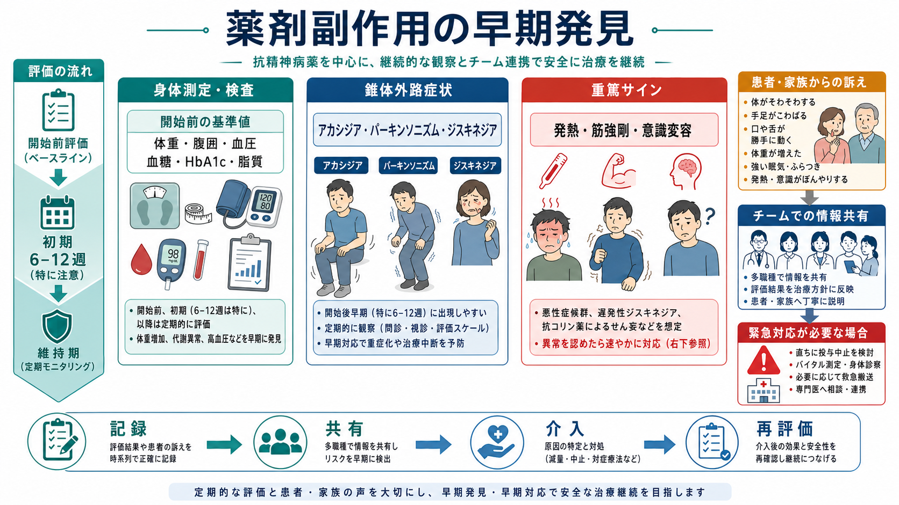
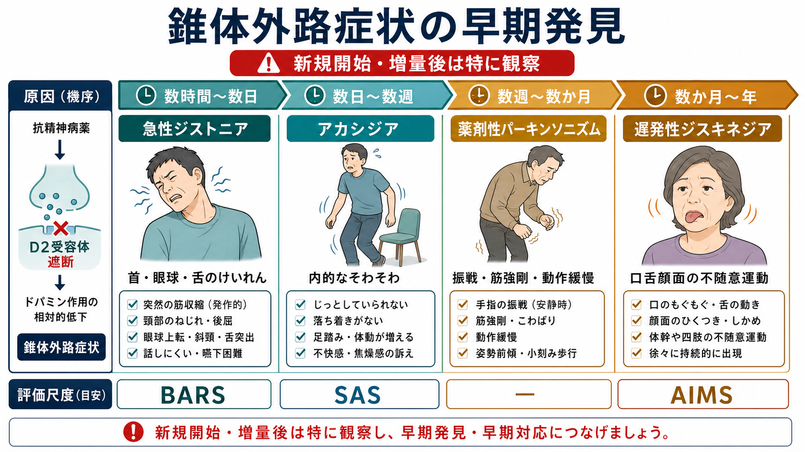
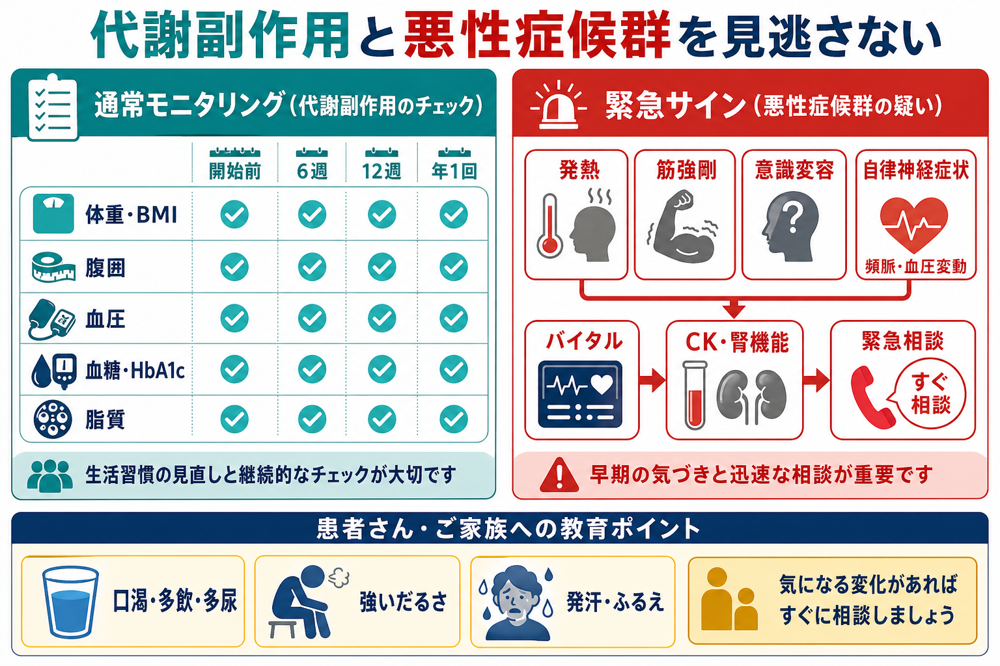

# 薬剤副作用の早期発見はどう行うか

## 要点

- 薬剤副作用の早期発見は、「症状が出たら聞く」ではなく、開始前の基準値、予測される時期、患者・家族への説明、定期測定、チーム共有を組み合わせる[[医療安全とは何か]]の実践である。
- 抗精神病薬では、開始前に体重、腹囲、血圧、血糖または HbA1c、脂質、プロラクチン、運動障害の有無、生活習慣を記録し、開始後は滴定期に副作用と運動障害を系統的に観察する[1]。
- 錐体外路症状は「落ち着きがない」「不安が強い」「動きが遅い」と誤認されやすい。アカシジア、パーキンソニズム、ジストニア、遅発性ジスキネジアを時間経過で分けて見る[2][8]。
- 代謝副作用は自覚症状が乏しいため、体重増加、腹囲、血圧、血糖・HbA1c、脂質をスケジュール化して測る。実臨床では代謝モニタリングが不十分になりやすい[3][4]。
- 悪性症候群はまれだが生命に関わる。発熱、筋強剛、意識変容、自律神経症状、CK 上昇や腎機能悪化を早く拾い、個別判断で速やかに専門的対応へつなげる[6][7]。

## この記事で答える問い

- 薬剤副作用を早く見つけるには、何をいつ確認するのか。
- 錐体外路症状、代謝副作用、悪性症候群は、どのようなサインとして現れるのか。
- 患者・家族の訴え、身体測定、検査、評価尺度、チーム共有をどう組み合わせるのか。

## まず結論

薬剤副作用の早期発見は、単発のチェックリストではなく「基準値を取る」「変化しやすい時期に見る」「見逃しやすい訴えを翻訳する」「危険サインは別ルートで扱う」という運用で行う。抗精神病薬を例にすると、開始前に体重・腹囲・血圧・血糖または HbA1c・脂質・プロラクチン・既存の運動障害を確認し、開始後は体重を最初の6週に毎週、12週、1年、以後年1回を目安に追う。血圧、血糖または HbA1c、脂質は12週、1年、以後年1回を目安に再評価する[1]。

ただし、数値だけでは足りない。アカシジアは不安や焦燥、パーキンソニズムはうつや陰性症状、悪性症候群は感染症や緊張病と混同されうる。したがって、診察室での観察、患者本人の主観的苦痛、家族・病棟スタッフの変化の気づき、薬剤変更の時系列、バイタル・検査値を一つの記録にまとめる必要がある[2][7]。

## 背景

精神科薬物療法では、薬剤の利益と副作用の不利益が同じ患者の生活の中で同時に起こる。副作用を恐れて必要な治療を避けることも危険だが、副作用を軽く見て継続だけを優先することも危険である。[[薬物療法のリスクベネフィットをどう考えるか]]では、治療効果と安全性を同じテーブルで再評価する姿勢が重要になる。

抗精神病薬は、精神病症状、躁状態、興奮、せん妄、難治性うつ病の補助療法などで使われる一方、錐体外路症状、体重増加、糖脂質代謝異常、高プロラクチン血症、QT 延長、鎮静、抗コリン作用、悪性症候群など多様な有害事象を起こしうる[1][3]。そのため、[[抗精神病薬とは何か]]を理解するだけでなく、導入時から「どの副作用を、誰が、どの頻度で、どの基準で拾うか」を決めておく必要がある。

## 基本概念

### 1. 基準値を取る

副作用は「異常値」ではなく「その人にとっての変化」として現れる。開始前の体重、腹囲、血圧、脈拍、血糖または HbA1c、脂質、プロラクチン、既存の振戦・筋強剛・不随意運動、食事・運動・喫煙・飲酒、糖尿病や脂質異常症の既往を記録する[1]。基準値がなければ、治療後の変化が薬剤性なのか、もともとの身体状態なのか判断しにくい。

### 2. 時期で見る

副作用には出やすい時期がある。急性ジストニアは開始・増量後の早期、アカシジアは数日から数週、薬剤性パーキンソニズムは数週から数か月、遅発性ジスキネジアは数か月から年単位で問題になることが多い[2][8]。代謝副作用は初期から体重増加として見え、血糖・脂質の変化は検査しなければ見逃される。悪性症候群は開始・増量・脱水・身体疾患・多剤併用などの文脈で急に進行しうる[6][7]。

### 3. 主観症状を軽視しない

アカシジアでは、患者は「不安」「じっとしていられない」「内側から急かされる」と訴えることがある。これを単に原疾患の焦燥や不眠と解釈すると、増量によって悪化する危険がある。副作用の早期発見では、本人の言葉を薬理学的カテゴリーへ翻訳し、薬剤変更との時間関係を確認する。

### 4. 重篤サインは通常モニタリングと分ける

体重や脂質は定期測定で拾うが、悪性症候群、高血糖緊急症、重症低血糖、重篤な不整脈、横紋筋融解などは「次回予約まで待つ」対象ではない。厚生労働省・PMDA の重篤副作用疾患別対応マニュアルは、患者・家族向けの初期症状と医療者向けの早期対応ポイントを整理しており、早期に気づくための教育資材として使える[5][6]。

## 仕組み

### 錐体外路症状

錐体外路症状は、主にドパミン D2 受容体遮断に伴う運動系の副作用として理解される。観察すべきなのは、動きが増える副作用と減る副作用の両方である。

| 副作用 | 典型的な見え方 | 見逃しやすい解釈 | 使いやすい評価 |
|---|---|---|---|
| 急性ジストニア | 首、眼球、舌、顎、喉頭周囲の急な筋収縮 | パニック、身体疾患、けいれん | 神経学的診察、薬剤変更時系列 |
| アカシジア | 内的そわそわ、足踏み、座っていられない | 不安、焦燥、病状悪化 | BARS |
| 薬剤性パーキンソニズム | 振戦、筋強剛、動作緩慢、仮面様顔貌 | うつ、陰性症状、老化 | SAS など |
| 遅発性ジスキネジア | 口舌顔面、体幹、四肢の不随意運動 | 癖、歯科的問題、落ち着きのなさ | AIMS/DISCUS |

APA のガイドラインは、抗精神病薬使用中はアカシジア、ジストニア、パーキンソニズム、遅発性ジスキネジアを含む運動障害を各診察で臨床的に評価し、AIMS などの構造化尺度を高リスク例では少なくとも6か月ごと、それ以外でも少なくとも12か月ごとに用いることを示している[2]。BARS はアカシジアの客観的運動、主観的そわそわ、苦痛を分けて評価できる尺度であり、SAS は薬剤性パーキンソニズムの定量に使われる[8]。

### 代謝副作用

代謝副作用では、患者が苦痛を訴える前に体重、腹囲、血圧、血糖・HbA1c、脂質が変化することがある。NICE は、抗精神病薬開始前に身体測定と検査を記録し、開始後は体重を最初の6週に毎週、12週、1年、以後年1回、血圧・血糖または HbA1c・脂質を12週、1年、以後年1回確認することを推奨している[1]。

重要なのは、検査を「異常が出てから」ではなく「予定として」行うことである。系統的レビューでは、抗精神病薬使用者に対する体重、血糖、脂質などの代謝モニタリングは実臨床で十分に行われていないことが示されている[4]。そのため、電子カルテのリマインダー、外来採血セット、薬剤師・看護師による測定、患者が見える体重グラフなど、個人の記憶に頼らない仕組みが必要になる。

### 悪性症候群

悪性症候群は、抗精神病薬などのドパミン遮断薬、またはドパミン作動薬の急な中断などを背景に起こりうる、まれだが重篤な副作用である。典型的には発熱、筋強剛、意識変容、自律神経症状を呈し、CK 上昇、白血球増多、腎機能障害、ミオグロビン尿などを伴うことがある[6][7]。

早期発見の要点は、発熱だけを感染症として処理しないことである。薬剤開始・増量・注射製剤・脱水・身体拘束・身体疾患・多剤併用などの背景があり、筋強剛、発汗、頻脈、血圧変動、意識の変化が重なる場合は、悪性症候群を鑑別に入れる。疑われる場合の投与中止、輸液、冷却、集中管理、特異的治療の要否は個別事例として専門的に判断されるべきであり、この記事は診断や治療指示の代替ではない[6][7]。

## 臨床・研究との接続

臨床では、薬剤副作用の早期発見は[[精神科医療安全の特徴は何か]]と深く関係する。精神症状、身体症状、薬剤副作用、環境要因が重なって見えるため、単一の専門職だけで判断すると見落としやすい。医師は診断と処方方針、薬剤師は薬歴・相互作用・用量、看護師は日々の行動変化とバイタル、心理職やリハビリ職は機能変化、患者・家族は生活上の違和感を持ち寄る。

研究では、単に副作用発生率を数えるだけでなく、どのモニタリング体制が検査実施率、早期介入、治療継続、身体疾患アウトカム、患者満足度を改善するかが問われる。代謝モニタリングの実施率が低いという知見は、ガイドラインが存在するだけでは十分でなく、実装科学や医療安全の視点が必要であることを示している[4]。

## よくある誤解

### 「副作用は患者が言ってくれる」

言語化しやすい副作用もあるが、代謝異常、軽いパーキンソニズム、遅発性ジスキネジア、悪性症候群の初期変化は本人が気づきにくい。本人の訴えを待つだけでなく、観察と測定を組み込む。

### 「検査値が正常なら副作用はない」

錐体外路症状、アカシジア、鎮静、抗コリン作用、性機能障害、主観的不快感は検査値だけでは拾えない。逆に、代謝副作用は診察室で見ただけでは拾えない。質問、診察、測定、検査を分担する。

### 「落ち着かないなら病状悪化である」

アカシジアは焦燥や不安に似て見える。抗精神病薬の開始・増量後に「じっとしていられない」「足が勝手に動く」「内側がむずむずする」と訴える場合、病状悪化だけでなく副作用を考える[8]。

### 「まれな副作用は説明しなくてよい」

まれでも重篤な副作用は、初期症状を患者・家族が知っていることが早期対応につながる。厚生労働省・PMDA の重篤副作用疾患別対応マニュアルは、患者向け説明と医療者向け対応を分けて整理している[5]。

## 関連ノート

- [[MOC｜薬物療法]]
- [[抗精神病薬とは何か]]
- [[抗精神病薬の錐体外路症状とは何か]]
- [[アカシジアをどう見分けるか]]
- [[抗精神病薬の代謝副作用とは何か]]
- [[悪性症候群とは何か]]
- [[高プロラクチン血症とは何か]]
- [[高齢者の薬物療法では何に注意するか]]
- [[医療安全とは何か]]
- [[精神科医療安全の特徴は何か]]

## MOC更新候補

- `content/00_MOC/MOC｜薬物療法.md` の「総論・判断」または「抗精神病薬」に、本記事 `[[薬剤副作用の早期発見はどう行うか]]` を追加する。
- `content/00_MOC/MOC｜臨床実践・治療.md` に医療安全・薬物療法をつなぐ入口として追加する。

## 理解チェック

1. 抗精神病薬を開始する前に、なぜ体重や血糖だけでなく既存の運動障害も記録する必要があるか。
2. アカシジアが「不安」や「病状悪化」と誤認されやすい理由は何か。
3. 代謝副作用の早期発見で、患者の自覚症状だけに頼れない理由は何か。
4. 発熱、筋強剛、意識変容、自律神経症状がそろったとき、どのような副作用を鑑別に入れるべきか。
5. 副作用モニタリングを個人の注意力ではなくチームの仕組みにするには、どのような記録・リマインダー・役割分担が必要か。

## 未解決問題

- 日本の精神科外来・病棟で、代謝モニタリングの実施率を実際に改善する最小限の運用セットは何か。
- 患者報告アウトカム、ウェアラブル、電子カルテアラートを組み合わせた副作用検出は、過剰警告を増やさずに安全性を高められるか。
- 遅発性ジスキネジアやアカシジアの早期兆候を、非専門職や家族がどこまで再現性高く観察できるか。

## 参考文献

[1] National Institute for Health and Care Excellence. (2014, amended 2021). *Psychosis and schizophrenia in adults: prevention and management* (CG178), recommendations 1.3.6.1-1.3.6.5. https://www.nice.org.uk/guidance/cg178/chapter/1-Recommendations

[2] American Psychiatric Association. (2020). *The American Psychiatric Association Practice Guideline for the Treatment of Patients With Schizophrenia* (3rd ed.). https://psychiatryonline.org/doi/pdf/10.1176/appi.ajp.2020.177901

[3] De Hert, M., Detraux, J., van Winkel, R., Yu, W., & Correll, C. U. (2012). Metabolic and cardiovascular adverse effects associated with antipsychotic drugs. *Nature Reviews Endocrinology, 8*, 114-126. https://doi.org/10.1038/nrendo.2011.156

[4] Mitchell, A. J., Delaffon, V., Vancampfort, D., Correll, C. U., & De Hert, M. (2012). Guideline concordant monitoring of metabolic risk in people treated with antipsychotic medication: systematic review and meta-analysis of screening practices. *Psychological Medicine, 42*(1), 125-147. https://doi.org/10.1017/S003329171100105X

[5] 厚生労働省. 重篤副作用疾患別対応マニュアル. https://www.mhlw.go.jp/stf/seisakunitsuite/bunya/kenkou_iryou/iyakuhin/topics/tp061122-1.html

[6] 厚生労働省. (2022). *重篤副作用疾患別対応マニュアル 悪性症候群*. https://www.info.pmda.go.jp/juutoku/file/jfm2203025.pdf

[7] Tse, L., Barr, A. M., Scarapicchia, V., & Vila-Rodriguez, F. (2015). Neuroleptic malignant syndrome: a review from a clinically oriented perspective. *Current Neuropharmacology, 13*(3), 395-406. https://doi.org/10.2174/1570159X13999150424113345

[8] Barnes, T. R. E. (1989). A rating scale for drug-induced akathisia. *The British Journal of Psychiatry, 154*(5), 672-676. https://doi.org/10.1192/bjp.154.5.672
