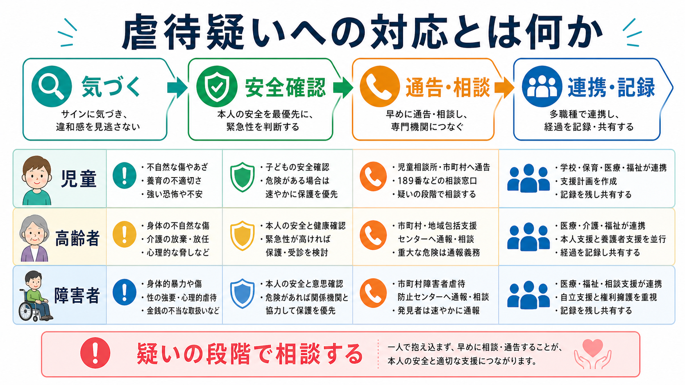
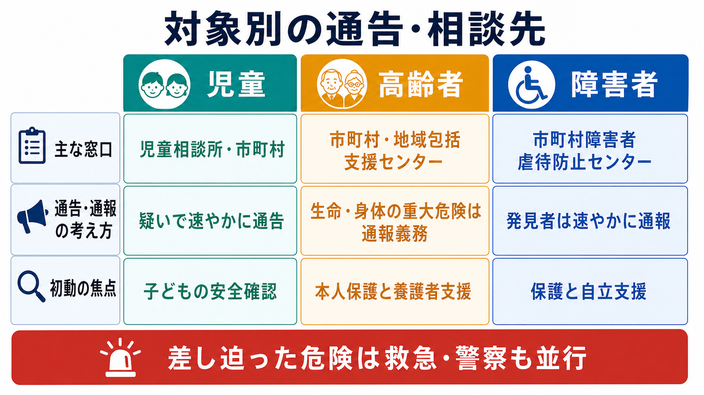

# 虐待疑いへの対応とは何か

## 要点

- 虐待疑いへの対応は、「虐待を確定する作業」ではなく、本人の安全を確認し、必要な窓口へ通告・通報・相談し、支援機関につなぐ初動である。
- 児童虐待では、虐待を受けたと思われる児童を発見した者に通告義務がある。通告先は児童相談所、市町村、福祉事務所などで、児童相談所虐待対応ダイヤル 189 も相談経路になる[1][2]。
- 高齢者虐待では、市町村が中心的窓口となり、生命・身体に重大な危険が生じている場合は通報義務が明確に置かれている[3][4]。
- 障害者虐待では、養護者・障害者福祉施設従事者等・使用者による虐待が区別され、市町村障害者虐待防止センター等への通報と支援調整が重要になる[5][6]。
- 医療・福祉・教育の現場では、守秘義務を「何もしない理由」にせず、法令上の通告・通報、本人保護、記録、チーム共有を分けて考える。

## この記事で答える問い

1. 虐待を疑った段階で、最初に何を確認するべきか。
2. 児童・高齢者・障害者で、通告・通報先や初動はどう違うか。
3. 臨床現場で、記録、守秘、多職種連携をどう扱うか。

## まず結論

虐待疑いへの対応では、**「証拠がそろうまで待つ」よりも、「安全確認、相談、通告・通報、記録」を並行して進める**。とくに、本人がその場で危険にさらされている、帰宅後に危険が高まる、医療的処置や保護が必要、加害がエスカレートしている、本人が助けを求められない、といった状況では、通常の面接や情報収集よりも安全確保を優先する。

ここでいう「疑い」は、虐待を断定することではない。児童虐待防止法は「児童虐待を受けたと思われる児童」を発見した者に通告を求めており、確定診断を待つ設計ではない[1]。障害者虐待防止法も、虐待を受けたと思われる障害者を発見した者に速やかな通報を求める[5]。高齢者虐待では、生命または身体に重大な危険が生じている場合の通報義務が明記され、そうでない場合も市町村への通報が求められる[3]。

## 背景

虐待は、身体的暴力だけでなく、心理的虐待、性的虐待、ネグレクト、経済的虐待などを含む。WHOも、子どもや高齢者への虐待を個人間の問題にとどまらない公衆衛生上の課題として整理している[7][8]。対象によって法制度上の分類は異なるが、共通する実務上の課題は、本人が被害を語りにくいこと、家族・介護者・支援者との関係が切り離せないこと、医療者だけでは安全を維持できないことにある。

児童では、発達段階、養育環境、保護者への依存が安全判断に直結する。高齢者では、認知症、介護負担、家族関係、経済問題、セルフネグレクトとの鑑別が問題になりやすい。障害者では、意思表明の難しさ、支援者への依存、施設・職場・家庭という複数の場面が絡む。したがって、虐待疑いは [[医療安全とは何か]]、[[暴力リスク評価とは何か]]、[[守秘義務とは何か]] と接続する、制度横断的な危機対応である。

## 基本概念

### 疑いの段階で動く

虐待対応で避けるべきなのは、「確信がないから何もしない」という態度である。臨床家や支援者が単独で真偽を裁く必要はない。むしろ、観察されたサイン、本人の訴え、家族・介護者の説明、過去の受診歴、生活環境、第三者情報を、通告・通報先と共有できる形で整理する。

### 安全確認

安全確認では、次を分けてみる。

| 視点 | 確認すること |
|---|---|
| 直近の危険 | 帰宅してよいか、加害者と同じ場に戻るか、医療処置や保護が必要か |
| 本人の状態 | 外傷、脱水、低栄養、恐怖、抑うつ、混乱、発達・認知・意思表明の困難 |
| 環境 | 監督者の不在、介護放棄、孤立、支援拒否、生活衛生、金銭管理 |
| 関係性 | 誰が同席しているか、本人が自由に話せるか、説明に不自然さがあるか |
| 連絡経路 | 児童相談所、市町村、高齢者虐待担当、障害者虐待防止センター、警察、救急 |

### 通告・通報・相談

「通告」「通報」「相談」は、厳密には制度ごとに語が違う。ただし現場では、本人の安全を守るために専門窓口へ情報を渡し、保護・調査・支援につなぐ行為として理解するとよい。児童では児童相談所や市町村、高齢者では市町村や地域包括支援センター、障害者では市町村障害者虐待防止センターなどが主要な入口になる[2][4][6]。

## 仕組み

### 1. 兆候に気づく

身体所見、説明と所見の不一致、過度な恐怖、養育・介護の不適切さ、受診の遅れ、金銭の不自然な扱い、支援者の過剰な支配、本人だけで話せない状況などを拾う。単一のサインで断定せず、複数情報の組み合わせとして扱う。

### 2. 本人を一人で話せる条件に近づける

同席者の前では話せないことが多い。可能なら、診察、検査、ケア説明などの自然な理由を使って本人だけで話せる時間を作る。ただし、分離そのものが危険を高める場合は、施設手順や関係機関と相談しながら進める。

### 3. 緊急性を判断する

差し迫った危険がある場合は、救急、警察、保護、入院、緊急一時保護などを並行して検討する。虐待対応の窓口に連絡することと、生命・身体の危険に対して緊急対応することは、どちらか一方ではない。

### 4. 対象別の窓口につなぐ

対象別の入口は次のように整理できる。自治体により名称や運用が異なるため、施設内の手順書と地域窓口一覧を更新しておく必要がある。

| 対象 | 主な窓口 | 初動の焦点 |
|---|---|---|
| 児童 | 児童相談所、市町村、福祉事務所、189 | 子どもの安全確認、保護者説明の扱い、きょうだいの安全 |
| 高齢者 | 市町村、高齢者虐待担当、地域包括支援センター | 本人保護、介護者支援、医療・介護サービス調整 |
| 障害者 | 市町村障害者虐待防止センター、都道府県権利擁護センター、労働関係窓口 | 保護、意思決定支援、施設・職場・家庭での再発防止 |

### 5. 記録する

記録は、後から安全判断と連携を可能にするための実務である。本人の発言は可能な範囲で言葉どおりに記載し、観察事実、日時、同席者、身体所見、写真の有無、説明の不一致、連絡した窓口、担当者名、助言内容、次の対応を分けて書く。評価や推測は、観察事実と混ぜない。

## 図解

図解は、次の3点を読む補助として作成した。

- 全体像: 気づく、安全確認、通告・相談、連携・記録を一連の流れとして見る。
- メカニズム: 確定判断より先に、緊急性判断と通告・相談を進める。
- 対象別整理: 児童、高齢者、障害者で窓口と初動の焦点が異なる。

## 臨床・研究との接続

臨床では、虐待疑いへの対応はトラウマ理解だけでは完結しない。[[逆境的小児期体験ACEとは何か]] や [[トラウマは発達にどう影響するのか]] は長期的影響の理解に役立つが、現在進行形の危険がある場合は、心理教育や詳細なトラウマ聴取より安全確保が先である。

また、虐待疑いは [[自殺リスクへの危機対応とは何か]] や [[興奮状態への対応はどう行うか]] と同じく、個人の病理だけでなく環境、制度、権利擁護を含む。研究上は、虐待の検出精度、通告後のアウトカム、医療機関と福祉機関の連携、養護者支援、再発予防、本人の意思決定支援が重要な論点になる。

## よくある誤解

### 誤解1: 証拠がそろうまで通告してはいけない

法制度は、現場の支援者が虐待を確定するまで待つことを前提にしていない。児童や障害者では「虐待を受けたと思われる」段階が通告・通報の入口になる[1][5]。

### 誤解2: 家族関係を壊さないために、まず家庭内で解決すべきである

家族や養護者への支援は重要だが、本人の安全より優先されない。高齢者虐待対応でも、本人保護と養護者支援は対立するものではなく、市町村が支援調整を行う枠組みで扱われる[4]。

### 誤解3: 守秘義務があるので外部には言えない

守秘は重要だが、法令上の通告・通報や生命・身体の保護が必要な場面では、必要最小限の情報共有が求められる。院内規程、自治体窓口、管理者、医療安全担当、ソーシャルワーカーと連携し、誰に何を伝えたかを記録する。

### 誤解4: 本人が否定すれば虐待ではない

本人が否定する理由には、恐怖、依存、認知機能低下、発達特性、加害者への配慮、報復への不安、施設や家族から離れる不安がある。否定は重要な情報だが、それだけで安全と判断しない。

## 関連ノート

- [[医療安全とは何か]]
- [[安全計画とは何か]]
- [[暴力リスク評価とは何か]]
- [[自殺リスクへの危機対応とは何か]]
- [[逆境的小児期体験ACEとは何か]]
- [[トラウマは発達にどう影響するのか]]
- [[精神疾患と虐待歴はどう関係するのか]]

## 理解チェック

1. 虐待疑いへの対応で、「確定」より先に行うべきことは何か。
2. 児童・高齢者・障害者で、主な通告・通報先はどう違うか。
3. 本人が虐待を否定した場合でも、安全確認を続けるべき理由は何か。
4. 記録では、観察事実と推測をなぜ分ける必要があるか。
5. 守秘義務と通告・通報義務が衝突して見えるとき、現場では何を確認するべきか。

## 関連ノート候補

- 虐待通告制度とは何か
- 虐待リスクを精神科でどう評価するか
- 高齢者虐待は精神科でどう評価するのか
- 権利擁護とは何か
- 地域包括支援センターとは何か
- 意思決定支援とは何か

## MOC更新候補

- `content/00_MOC/MOC｜臨床実践・治療.md`
- `content/00_MOC/MOC｜司法・制度・地域精神医療.md`

## 未解決問題

- 通告・通報後に本人の生活がどう変化したかを、医療機関側がどこまで追跡できるか。
- 本人の意思、保護の必要性、家族・養護者支援が衝突する場面で、どのように意思決定支援を組み込むか。
- 医療機関、学校、介護、障害福祉、行政、警察の情報共有を、過不足なく行うための地域手順をどう標準化するか。

## 参考文献

[1] e-Gov法令検索. 児童虐待の防止等に関する法律. https://laws.e-gov.go.jp/law/412AC1000000082

[2] こども家庭庁. 児童相談所虐待対応ダイヤル「189」について. https://www.cfa.go.jp/policies/jidougyakutai/gyakutai-taiou-dial/

[3] e-Gov法令検索. 高齢者虐待の防止、高齢者の養護者に対する支援等に関する法律. https://laws.e-gov.go.jp/law/417AC1000000124

[4] 厚生労働省. 市町村・都道府県における高齢者虐待への対応と養護者支援について. https://www.mhlw.go.jp/stf/seisakunitsuite/bunya/0000200478_00004.html

[5] e-Gov法令検索. 障害者虐待の防止、障害者の養護者に対する支援等に関する法律. https://laws.e-gov.go.jp/law/423AC1000000079

[6] 厚生労働省. 障害者虐待防止法に関する情報. https://www.mhlw.go.jp/stf/seisakunitsuite/bunya/hukushi_kaigo/shougaishahukushi/gyakutaiboushi/index.html

[7] World Health Organization. Child maltreatment. https://www.who.int/news-room/fact-sheets/detail/child-maltreatment

[8] World Health Organization. Elder abuse. https://www.who.int/news-room/fact-sheets/detail/elder-abuse
