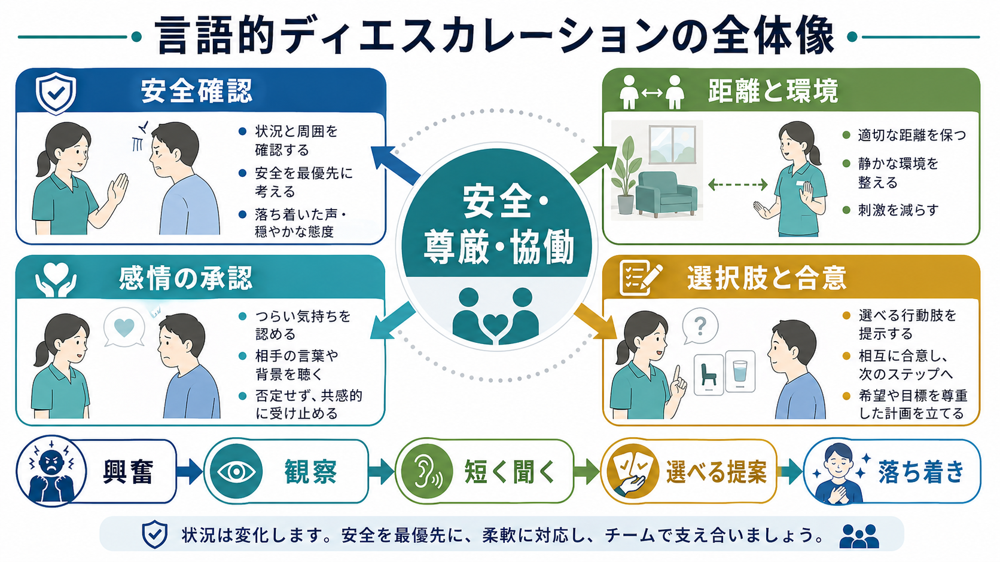
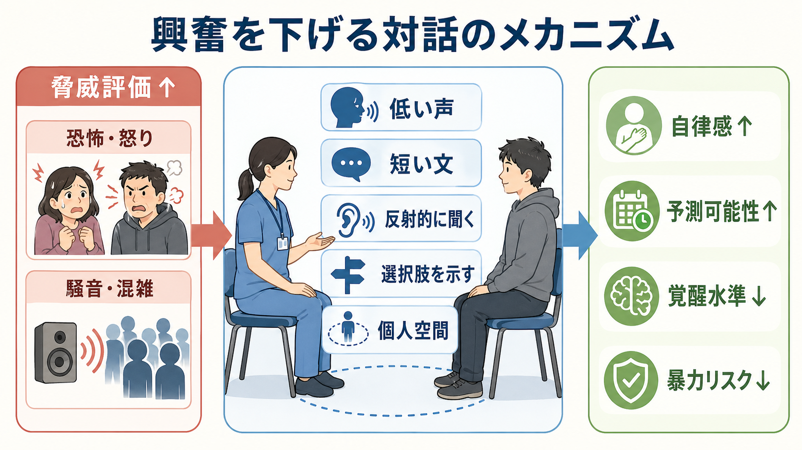

# 言語的ディエスカレーションとは何か

## 要点

- 言語的ディエスカレーションは、興奮・怒り・恐怖・混乱が高まった人に対して、短い言葉、落ち着いた態度、適切な距離、選択肢の提示を使い、本人が自分で落ち着きを取り戻せるよう支える技法である[1]。
- 目的は「相手を屈服させること」ではなく、本人・周囲・スタッフの安全を守り、強制的介入をできるだけ避け、治療関係を壊さずに次の支援へつなぐことである[1][2]。
- NICE は、興奮した人には1人のスタッフが主担当となり、安全を評価し、非対立的に明確化と交渉を行うこと、さらに尊重と共感を全段階で伝えることを推奨している[2]。
- ただし、ディエスカレーションの効果を単独技法として検証したRCTは少ない。Cochraneレビューは、広く推奨されている一方で、個別技法の有効性については不確実性が残ると結論づけている[3]。
- したがって実践では、個人技だけでなく、チーム体制、環境調整、事後レビュー、[[トラウマインフォームドケアとは何か]]、[[精神科医療安全の特徴は何か]]と接続して考える必要がある[4][5]。

## この記事で答える問い

1. 言語的ディエスカレーションは、どのような臨床場面で何を目指す技法なのか。
2. 「声かけ」や「説得」とは何が違うのか。
3. 興奮や攻撃性を下げる仕組みを、心理・環境・関係性の観点からどう理解できるか。
4. どこまでを言葉で対応し、どこからチーム介入や薬物療法を検討するべきか。

## まず結論

言語的ディエスカレーションとは、興奮した相手に「落ち着いてください」と言うことではない。本人にとって世界が脅威的に感じられ、情報処理が狭まり、逃げる・怒鳴る・近づく・物を投げるといった反応が起こりやすい場面で、支援者側が刺激量、距離、声、言葉、選択肢を調整し、本人の自律感と予測可能性を回復させる実践である[1][2]。

Project BETA は、興奮への対応を、まず言語的に関わり、協働関係をつくり、その関係を使って興奮状態から抜け出すという流れで整理している[1]。この発想では、本人は「制圧される対象」ではなく、危機から抜け出すための共同作業者である。言語的ディエスカレーションは、[[動機づけ面接とは何か]]や[[支持的精神療法とは何か]]と同じく、言葉を用いた臨床行為だが、通常の面接よりも時間が短く、身体的安全と環境調整の比重が大きい。

## 背景

医療・福祉・救急・精神科の現場では、痛み、恐怖、幻覚妄想、物質使用、せん妄、認知症、待ち時間、制限、説明不足、過去のトラウマなどが重なると、興奮や攻撃的行動が出現することがある。攻撃性は単なる「性格」ではなく、本人の苦痛、環境の過負荷、対人関係の不信、身体疾患、薬物・アルコール、制度上の制限が相互作用して起こる[2][3]。

従来は、身体拘束、隔離、強制的な薬物投与が早く選ばれやすかった。しかし、こうした介入は差し迫った危険がある場合には必要になりうる一方で、本人の恐怖や屈辱感を強め、スタッフとの信頼を損ない、次の危機で援助要請を遅らせることがある[1][4]。そのため、現代の医療安全では、非強制的で、権利に配慮し、チームで行う予防的対応が重視される。

## 基本概念

### ディエスカレーションは「低刺激化」と「協働化」である

興奮場面では、説得の内容よりも、相手が「いま安全か」「この人は敵か味方か」「自分に選べる余地があるか」を高速に判断している。大きな声、複数人からの質問、近すぎる距離、出口をふさぐ立ち位置、命令口調は、たとえ善意でも脅威として処理されやすい[1][2]。

そのため、基本は次の2つである。

| 方向 | 実践例 |
|---|---|
| 低刺激化 | 声を低くする、文を短くする、質問を減らす、人を減らす、静かな場所を提案する |
| 協働化 | 名前を確認する、感情を言葉にする、選択肢を示す、本人の希望を確認する、次の一歩を合意する |

### 10領域としての技法

Project BETA は、言語的ディエスカレーションを単一の台詞ではなく、個人空間、刺激の減少、言語接触、簡潔さ、感情の同定、傾聴、合意、境界設定、選択肢、スタッフの事後振り返りなどを含む複合的実践として整理している[1]。重要なのは、境界設定も「罰」ではなく、安全に戻るための見通しとして提示することである。

## 仕組み

興奮が高いとき、相手は複雑な説明を処理しにくい。支援者が短い文で話し、反射的に聞き、感情を承認し、選択肢を示すと、少なくとも3つの経路で危機が下がりやすくなる。

1. 脅威評価が下がる  
   「攻撃される」「閉じ込められる」という予測が弱まると、防衛反応が少し下がる。

2. 自律感が戻る  
   「座るか、少し離れた場所で話すか」など、選べる範囲があると、制圧されている感覚が弱まる[1][2]。

3. 予測可能性が上がる  
   次に何が起こるかを短く説明すると、混乱と警戒が下がりやすい。これは[[トラウマインフォームドケアとは何か]]における安全・透明性・選択の原則とも重なる[4]。

## 図解

臨床で使いやすい流れとしては、次のように考える。

| 段階 | 見ること | すること |
|---|---|---|
| 1. 安全確認 | 武器、出口、周囲の人、身体症状、せん妄・中毒の可能性 | 距離を取る、応援を呼べる位置に立つ、1人が主担当になる |
| 2. 接触 | 名前、希望、怒りや恐怖の対象、本人が避けたいこと | 自己紹介、短い説明、相手の呼ばれ方を確認する |
| 3. 感情の承認 | 「無視された」「怖い」「痛い」「帰りたい」など | 反論より先に、つらさや怒りを言葉にして返す |
| 4. 選択肢 | 座る、場所を変える、水を飲む、薬を相談する、家族に連絡する | 命令ではなく、実行可能な2択程度を示す |
| 5. 合意と移行 | 危険が下がったか、再燃しそうな条件は何か | 次の行動を短く確認し、事後に本人・チームで振り返る |

## 臨床・研究との接続

言語的ディエスカレーションは、[[心理教育とは何か]]や[[リラクゼーション法とは何か]]のように、本人が自分の状態を理解し、調整する力を支える実践と接続する。一方で、急性期の興奮では、本人の努力だけに任せるのではなく、支援者側が環境を変える責任を持つ。

研究面では、単独のディエスカレーション技法をRCTで厳密に評価することは難しい。Cochraneレビューでは、非精神病性の攻撃性に対するディエスカレーション技法について、該当RCTが少なく、効果の確実性は限定的とされた[3]。しかし、病棟全体の関係性、予測可能性、相互理解を改善する Safewards のクラスターRCTでは、介入群で conflict events と containment events が減少した[5]。これは、言語的ディエスカレーションを「個人技」ではなく、病棟文化・チーム実践・環境設計の一部として扱う必要を示している。

薬物療法との関係も誤解されやすい。[[抗精神病薬とは何か]]や[[ベンゾジアゼピン系薬とは何か]]は、急性興奮に使われることがあるが、薬は対話の代替ではない。本人が選べる場合には、薬の目的、効果、眠気やふらつきなどの副作用、拒否できる範囲を説明し、身体疾患・せん妄・中毒・離脱の評価と並行して使う必要がある[2][6]。

## よくある誤解

### 誤解1: 優しく話せば必ず鎮まる

言語的ディエスカレーションは万能ではない。意識障害、重いせん妄、低酸素、頭部外傷、急性中毒、差し迫った他害危険がある場合は、会話だけで対応し続けることが危険になる。安全確保、身体評価、応援要請、必要最小限の制限や薬物療法を並行して考える。

### 誤解2: 境界設定は対立を強める

境界設定そのものが悪いのではない。問題は、脅しや屈辱として伝えることである。「これ以上近づくと拘束します」ではなく、「安全のためにこの距離で話します。ここで話すか、静かな部屋に移るかを選べます」のように、理由と選択肢を添えて伝える。

### 誤解3: うまい人だけができる個人技である

技量は重要だが、1人に任せるほど危険になる。NICE は1人が主に話すことを推奨するが、それは「1人で対応する」という意味ではない[2]。周囲の人を減らす、出口を確保する、応援を呼ぶ、記録する、薬剤や身体評価を準備するなど、チームで支える。

### 誤解4: 言語的対応は医療安全より心理療法に近い

実際には、医療安全と心理的支援の交点にある。尊重・共感・選択を伝えることは、本人の権利を守るだけでなく、暴力、身体拘束、スタッフ受傷、治療関係の破綻を減らすための安全技法でもある[1][2][4]。

## 関連ノート

- [[精神科医療安全の特徴は何か]]
- [[トラウマインフォームドケアとは何か]]
- [[動機づけ面接とは何か]]
- [[支持的精神療法とは何か]]
- [[心理教育とは何か]]
- [[リラクゼーション法とは何か]]
- [[BPSDへの非薬物的支援とは何か]]
- [[認知症の生活支援とは何か]]
- [[抗精神病薬とは何か]]
- [[ベンゾジアゼピン系薬とは何か]]

MOC更新候補: [[MOC｜臨床実践・治療]]、[[MOC｜精神医学]]、医療安全・危機対応系MOCを作成する場合の中核ノート候補。

今後の作成候補: 身体拘束とは何か、隔離とは何か、急性興奮への薬物療法とは何か、せん妄と興奮への対応とは何か、医療現場の暴力予防とは何か。

## 理解チェック

1. 言語的ディエスカレーションの目的は、相手を従わせることではなく何を回復させることか。
2. 興奮している人に対して、なぜ複数人が同時に話しかけることは避けるべきか。
3. 感情の承認と、相手の要求をすべて受け入れることは、どこが違うか。
4. 会話だけで対応し続けるべきではない危険サインには何があるか。
5. 事後レビューでは、本人・家族・スタッフそれぞれから何を学ぶべきか。

## 参考文献

[1] Richmond JS, Berlin JS, Fishkind AB, et al. Verbal De-escalation of the Agitated Patient: Consensus Statement of the American Association for Emergency Psychiatry Project BETA De-escalation Workgroup. *Western Journal of Emergency Medicine*. 2012;13(1):17-25. https://doi.org/10.5811/westjem.2011.9.6864

[2] National Institute for Health and Care Excellence. *Violence and aggression: short-term management in mental health, health and community settings*. NICE guideline NG10. 2015. https://www.nice.org.uk/guidance/ng10

[3] Spencer S, Johnson P, Smith IC. De-escalation techniques for managing non-psychosis induced aggression in adults. *Cochrane Database of Systematic Reviews*. 2018;7:CD012034. https://doi.org/10.1002/14651858.CD012034.pub2

[4] Substance Abuse and Mental Health Services Administration. *SAMHSA's Concept of Trauma and Guidance for a Trauma-Informed Approach*. HHS Publication No. SMA14-4884. 2014. https://library.samhsa.gov/product/samhsas-concept-trauma-and-guidance-trauma-informed-approach/sma14-4884

[5] Bowers L, James K, Quirk A, et al. Reducing conflict and containment rates on acute psychiatric wards: The Safewards cluster randomised controlled trial. *International Journal of Nursing Studies*. 2015;52(9):1412-1422. https://doi.org/10.1016/j.ijnurstu.2015.05.001

[6] Garriga M, Pacchiarotti I, Kasper S, et al. Assessment and management of agitation in psychiatry: Expert consensus. *The World Journal of Biological Psychiatry*. 2016;17(2):86-128. https://doi.org/10.3109/15622975.2015.1132007

## 未解決問題

- どの言語的技法が、どの診断・環境・年齢層で最も有効なのかは、まだ十分に分かっていない。
- 効果指標を、暴力件数だけでなく、本人の尊厳、恐怖、治療同盟、スタッフの心理的安全性まで広げる必要がある。
- 文化・言語・発達特性・認知機能に応じたディエスカレーションの調整方法は、今後の実装研究が必要である。
