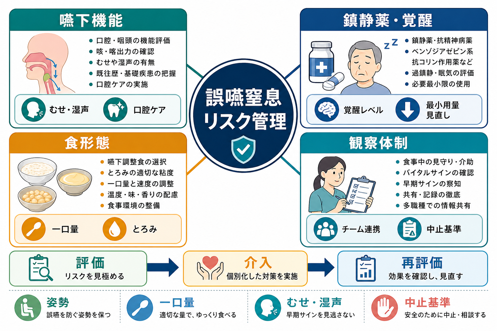
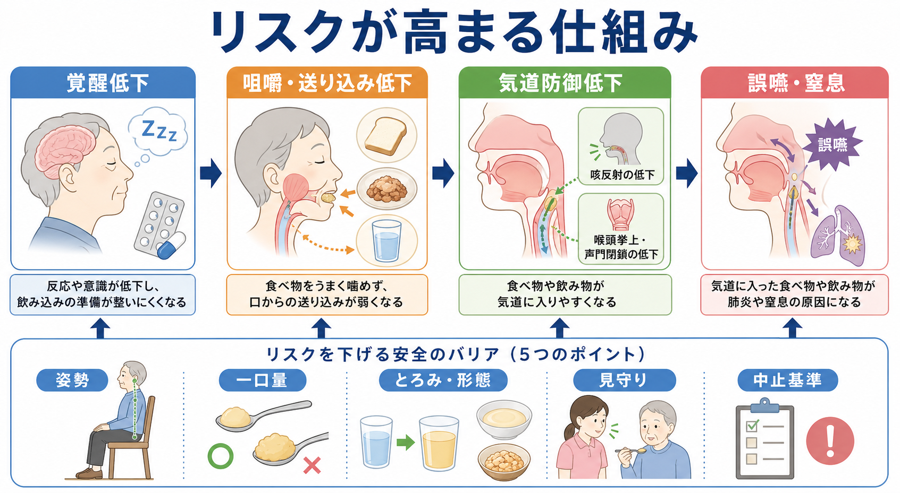
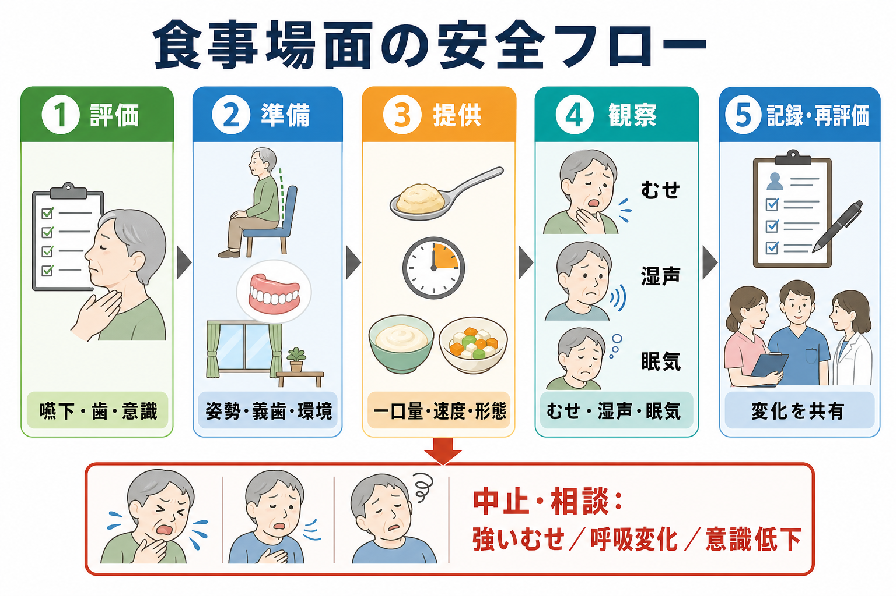

# 誤嚥窒息リスク管理とは何か

## 要点

- 誤嚥窒息リスク管理とは、食べる力だけでなく、覚醒水準、薬剤、食形態、姿勢、口腔ケア、見守り、緊急時対応を一体で調整する医療安全の実践である。
- 嚥下障害は、低栄養、脱水、誤嚥性肺炎、窒息、生活の質の低下につながりうる。むせがない「不顕性誤嚥」もあるため、単一のサインだけで安全と判断しない[1][2]。
- 鎮静薬、抗精神病薬、抗コリン作用をもつ薬剤、ベンゾジアゼピン系薬などは、覚醒低下、口腔乾燥、錐体外路症状、協調運動低下を通じて嚥下や肺炎リスクに関与しうる[6][7]。
- 食形態は「やわらかければ安全」ではなく、本人の咀嚼、送り込み、喉頭防御、疲労、介助環境に合わせて選ぶ。JDD2021やIDDSIのような共通言語を使うと、職種間のずれを減らしやすい[3][4]。
- 本記事は教育・研究目的の整理であり、個別の診断、食事指示、薬剤変更、治療指示ではない。具体的対応は医師、歯科医師、看護師、言語聴覚士、管理栄養士、薬剤師などのチームで判断する。

## この記事で答える問い

1. 誤嚥窒息リスク管理は、単なる「食事介助マニュアル」と何が違うのか。
2. 嚥下機能、鎮静薬、食形態、観察体制はどのようにつながるのか。
3. 臨床現場では、食事前・食事中・食事後に何を見て、何を中止基準にするのか。
4. 精神科、認知症ケア、高齢者医療、施設ケアでは何に注意するべきか。

## まず結論

誤嚥窒息リスク管理は、「飲み込めるか」を一回判定して終わる作業ではない。食べる前の覚醒、姿勢、口腔内、義歯、薬剤、食形態、介助者の配置、食べる速度、食後の呼吸・声・発熱までを継続的に見直す安全システムである。

嚥下評価では、むせ、湿った声、食物残留、咀嚼困難、食事時間の延長、体重減少、呼吸状態の変化などを観察する。ただし、高齢者や神経疾患では誤嚥してもむせが目立たない場合があるため、観察だけでなく、必要に応じて専門的評価や画像・内視鏡評価を検討する[1][2]。

## 背景

嚥下は、口腔で食塊を作り、咽頭へ送り、気道を守りながら食道へ通す協調運動である。脳卒中、認知症、パーキンソン病、頭頸部疾患、加齢によるフレイル、歯や義歯の問題、急性疾患後の廃用、薬剤の影響などで、この協調は崩れやすくなる[1][2]。

誤嚥と窒息は近いが、同じではない。誤嚥は唾液、食物、飲水、胃内容物などが気道側へ入ることであり、誤嚥性肺炎の背景になりうる。窒息は食物などが気道を塞ぎ、短時間で生命危機に至る状態である。高齢者の食品による窒息では、餅などの粘着性・弾力性のある食品を小さくし、無理のない一口量で、よく噛んで飲み込むことが事故予防の基本として示されている[5]。

医療・介護現場では、窒息の直前だけを見ても遅い。食事前の眠気、頸部姿勢、義歯不適合、口腔乾燥、抗精神病薬や睡眠薬の増量、急な発熱、肺炎後の体力低下などが重なった時点で、すでにリスクは高まっている。

## 基本概念

### 嚥下機能

嚥下機能の評価では、口腔・咽頭の形態と運動、咳反射、声質、唾液処理、姿勢、呼吸状態、認知機能、疲労、栄養状態を合わせて見る。ASHAは、嚥下障害のサインとして、唾液や食塊の管理不良、咀嚼困難、口腔残留、湿った声、食中・食後の咳、呼吸と嚥下の協調困難、低栄養・脱水などを挙げている[1]。

### 鎮静薬・覚醒

食事は覚醒を要する行為である。強い眠気、注意低下、せん妄、過鎮静があると、口に入ったものを適切に咀嚼し、タイミングよく飲み込み、誤って気道に入ったものを咳で排出する力が弱くなる。抗精神病薬では、錐体外路症状や抗コリン作用を介した嚥下障害が報告されており、ベンゾジアゼピン系薬やZ薬では、特に認知症や神経疾患をもつ高齢者で肺炎リスクとの関連が検討されている[6][7]。

ここで重要なのは、「薬を使わない」ではなく、「食事場面の安全に影響する鎮静、口腔乾燥、錐体外路症状、ふらつき、せん妄を定期的に見直す」ことである。薬剤変更は自己判断ではなく、処方医・薬剤師を含むチームで扱う。

### 食形態

食形態は、本人の嚥下機能に合わせて、硬さ、まとまりやすさ、付着性、ばらけやすさ、液体の流速を調整する。日本ではJDD2021が嚥下調整食ととろみ付き液体の分類を示し、国際的にはIDDSIが飲料0-4、食品3-7の8段階フレームワークを提供している[3][4]。

食形態の調整は、栄養と楽しみを減らすためではない。安全に食べられる範囲を広げ、むしろ食事の継続可能性を高めるための調整である。ただし、とろみを付けすぎる、食欲を落とす、脱水を招く、本人の嗜好を無視する、といった副作用もありうるため、再評価が必要である。

### 観察体制

誤嚥窒息リスクは、本人の機能だけでなく、環境によって変わる。食事中に誰が見守るのか、どのサインで中止するのか、急変時に誰へ連絡するのか、記録はどこへ残すのかが曖昧だと、同じ人でも日によって安全性が変わる。

観察体制には、食前確認、食事中の見守り、食後の変化確認、記録、申し送り、再評価の流れが含まれる。これは[[精神科医療安全の特徴は何か]]で扱う多職種・環境依存の安全課題とも重なる。

## 仕組み

リスクは、しばしば次の連鎖で高まる。

1. 鎮静薬、急性疾患、睡眠不足、せん妄などで覚醒が下がる。
2. 咀嚼、口腔内保持、送り込み、呼吸との協調が乱れる。
3. 食塊が咽頭に残る、液体が速く流れ込む、咳で出せない。
4. むせ、湿声、呼吸変化、食事時間延長、疲労が出る。
5. 見守りや中止基準が弱いと、誤嚥や窒息が重大化する。

この連鎖は、どこか一箇所を直せば必ず解決するものではない。たとえば、食形態を下げても、眠気が強いままなら安全とは限らない。逆に、覚醒が改善し、姿勢と一口量が整えば、過度に制限された食形態を見直せる場合もある。

## 図解

食事場面では、次の5段階で考えると実践に落とし込みやすい。

| 段階 | 確認すること | 典型的な対応 |
|---|---|---|
| 評価 | 嚥下歴、肺炎歴、口腔内、義歯、意識、薬剤、食事中の変化 | 必要時に専門職へ評価依頼 |
| 準備 | 姿勢、座位保持、環境、食具、義歯、口腔ケア | 体幹・頸部を整え、集中できる環境にする |
| 提供 | 食形態、とろみ、一口量、速度、温度、疲労 | 少量ずつ、急がせず、必要時は介助 |
| 観察 | むせ、湿声、呼吸苦、SpO2変化、眠気、顔色、食物残留 | 強いむせや呼吸変化では中止・相談 |
| 記録・再評価 | 何を食べたか、どのサインが出たか、介入の効果 | チームで共有し、次の食事条件を更新 |

## 臨床・研究との接続

### 高齢者医療・施設ケア

高齢者では、嚥下障害、認知症、脱水、低栄養、サルコペニア、口腔衛生不良、ポリファーマシーが重なりやすい。むせがないから安全と判断するのではなく、食後の湿声、発熱、呼吸数、酸素化、食事量低下、体重変化も見る必要がある[2]。

### 精神科医療

精神科では、抗精神病薬、抗不安薬、睡眠薬、抗コリン薬、気分安定薬が複数併用されることがある。急性期の鎮静、隔離・身体拘束、活動量低下、認知機能低下、早食い、口腔ケア不足が重なると、誤嚥窒息リスクは上がる。薬剤性嚥下障害は見落とされやすく、食事量低下や拒薬として見えることもある[6]。

このため、精神科の食事安全は、[[精神科医療安全の特徴は何か]]の一部として扱う必要がある。本人を責めるのではなく、覚醒、薬剤、食形態、見守りを調整する。

### 急変対応

窒息が疑われる場面では、食事を続けない。強いむせ、声が出ない、呼吸困難、チアノーゼ、意識低下、急なSpO2低下などがあれば、現場の救急手順に従って応援要請、気道異物除去、救急搬送を含む対応を行う。平時から中止基準と連絡経路を共有しておくことが、[[自殺リスクへの危機対応とは何か]]や[[安全計画とは何か]]と同様に、危機時の迷いを減らす。

## よくある誤解

### 「むせなければ誤嚥していない」

むせは重要なサインだが、誤嚥の全例で出るわけではない。不顕性誤嚥では、食後の湿声、発熱、酸素化低下、肺炎の反復、食事量低下などが手がかりになる[1][2]。

### 「とろみを付ければ常に安全」

とろみは流速を調整する有効な手段になりうるが、濃すぎると残留や飲水量低下につながることがある。本人の嚥下機能、嗜好、脱水リスク、食事全体の摂取量と合わせて再評価する[3][4]。

### 「食形態を下げるほど安全」

刻み食はばらけやすく、かえって誤嚥しやすい場合がある。ペースト状でも付着性や粘度が合わなければ残留する。分類名だけでなく、実際の物性、食べ方、介助環境を見る必要がある[3]。

### 「薬剤は嚥下とは別問題」

薬剤は嚥下と密接に関係する。鎮静、錐体外路症状、抗コリン作用、口腔乾燥、筋弛緩、呼吸抑制などは、食事場面の安全に影響しうる[6][7]。

## 関連ノート

- [[精神科医療安全の特徴は何か]]
- [[安全計画とは何か]]
- [[自殺リスクへの危機対応とは何か]]

今後の作成候補:

- 嚥下障害とは何か
- 誤嚥性肺炎とは何か
- 食形態調整とは何か
- 薬剤性嚥下障害とは何か
- 高齢者の窒息事故予防とは何か
- 精神科病棟の食事安全とは何か

MOC更新候補:

- `content/00_MOC/` 配下の臨床実践・医療安全・高齢者医療・精神科医療安全に関するMOC

## 理解チェック

1. 誤嚥窒息リスク管理で、食形態だけを調整しても不十分になりうる理由は何か。
2. 鎮静薬や抗精神病薬は、どのような経路で嚥下・窒息リスクに影響しうるか。
3. 「むせがない」食事場面で、ほかにどのようなサインを観察するべきか。
4. 食事を中止して相談する基準を、あなたの現場ならどのように共有するか。

## 参考文献

[1] American Speech-Language-Hearing Association. Adult Dysphagia. ASHA Practice Portal. https://www.asha.org/practice-portal/clinical-topics/adult-dysphagia/

[2] O'Rourke F, Vickers K, Upton C, Chan D. Swallowing and oropharyngeal dysphagia. *Clinical Medicine*. 2014;14(2):196-199. https://doi.org/10.7861/clinmedicine.14-2-196

[3] The Dysphagia Diet Committee of the Japanese Society of Dysphagia Rehabilitation, Kayashita J, Fujishima I, et al. The Japanese Dysphagia Diet of 2021 by the Japanese Society of Dysphagia Rehabilitation. *Journal of Clinical Rehabilitation Science*. 2022;13:64-77. https://pmc.ncbi.nlm.nih.gov/articles/PMC10545023/

[4] International Dysphagia Diet Standardisation Initiative. The IDDSI Framework. https://www.iddsi.org/standards/framework

[5] 消費者庁. 高齢者の事故を防ぐために. https://www.caa.go.jp/policies/policy/consumer_safety/caution/caution_055

[6] Crouse EL, Alastanos JN, Bozymski KM, Toscano RA. Dysphagia with second-generation antipsychotics: A case report and review of the literature. *Mental Health Clinician*. 2017;7(2):56-64. https://pmc.ncbi.nlm.nih.gov/articles/PMC6007670/

[7] Taipale H, Tolppanen AM, Koponen M, et al. Risk of pneumonia associated with incident benzodiazepine use among community-dwelling adults with Alzheimer disease. *CMAJ*. 2017;189(14):E519-E529. https://pmc.ncbi.nlm.nih.gov/articles/PMC5386845/

[8] Wirth R, Dziewas R, Beck AM, et al. Oropharyngeal dysphagia in older persons: from pathophysiology to adequate intervention. *Clinical Interventions in Aging*. 2016;11:189-208. https://doi.org/10.2147/CIA.S97481

## 未解決問題

- 食形態調整、とろみ、見守り体制、口腔ケア、薬剤見直しのどの組み合わせが、どの患者群で最も有効か。
- 認知症、精神疾患、神経変性疾患をもつ人の「食べる楽しみ」と安全を、どのような意思決定支援で両立するか。
- 施設・病棟で使いやすい中止基準、記録様式、申し送り方法をどう標準化するか。

## 更新ログ

- 2026-04-28: 初版作成。嚥下機能、薬剤、食形態、観察体制、図解、参考文献を整理。
