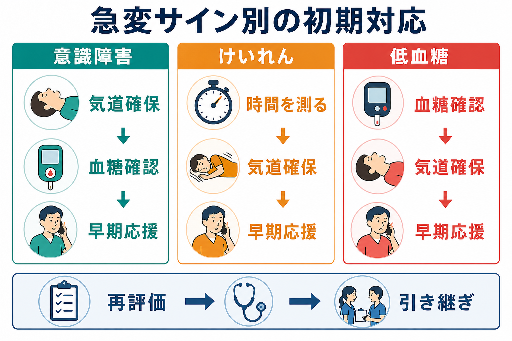
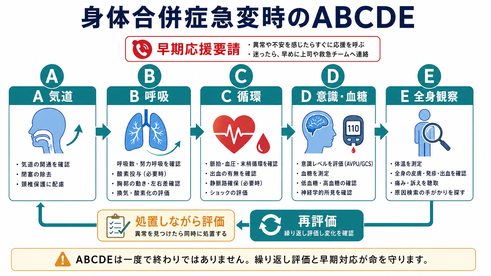

# 身体合併症急変時の対応とは何か

## 要点

- 身体合併症急変時の対応は、診断名を急いで当てる作業ではなく、生命を脅かす異常を見つけ、応援を呼び、ABCDEで処置しながら再評価する作業である[1][2]。
- 最初に確認するバイタルは、呼吸数、酸素飽和度、血圧、脈拍、意識レベル、体温である。NEWS2のような早期警告スコアは、これらを複数パラメータで見て、観察頻度と応援要請を標準化する道具である[1][3]。
- 意識障害では、低酸素、低血圧、薬剤、低血糖を優先して確認する。ABCDEのDでは意識レベルと血糖を早期に測る[2]。
- けいれんが5分以上続く、反復する、回復しない場合は医学的緊急事態として扱い、個別の救急対応計画や施設手順に沿って早期に応援を要請する[6]。
- 低血糖では、血糖確認と安全な糖補正を遅らせない。ただし意識障害や嚥下困難がある場合は、経口摂取を無理に行わず救急対応に切り替える[2][5]。
- 本記事は教育・研究目的の整理であり、個別症例の診断、投薬、救急処置を指示するものではない。実際の対応は所属施設の急変時手順、救急要請基準、医師・看護師・救急チームの判断に従う。

## この記事で答える問い

1. 精神科病棟、外来、デイケア、地域支援の場で身体急変に気づいたとき、最初に何を優先するのか。
2. バイタル異常、意識障害、けいれん、低血糖をどう同じ初期対応の枠組みに入れるのか。
3. どの段階で応援を呼び、何を記録し、次の医療者へ何を引き継ぐのか。

## まず結論

身体合併症急変時の対応とは、**「気づく、呼ぶ、ABCDEで評価しながら処置する、測る、再評価する、引き継ぐ」** という一連の安全行動である。特に精神科領域では、興奮、不安、せん妄、拒否、沈黙、眠気に見える状態の背後に、低酸素、低血糖、感染、脳卒中、けいれん後状態、薬剤性の呼吸抑制や循環不全が隠れることがある。したがって、[[精神科救急では何を優先するべきか|精神科救急]]でも、身体評価を「精神症状の後」に回さない。

NICEは、急性期病院での初期評価とモニタリングに、心拍数、呼吸数、収縮期血圧、意識レベル、酸素飽和度、体温を最低限含めることを推奨している[1]。Resuscitation Council UKのABCDEアプローチも、生命を脅かす問題を次の評価へ進む前に扱い、処置後に再評価し、早期に適切な応援を呼ぶことを基本原則としている[2]。

## 背景

身体急変の難しさは、最初の情報が不完全である点にある。患者が「苦しい」と言えない、訴えが精神症状として受け取られる、夜間で人員が少ない、薬剤変更直後で眠気と呼吸抑制が区別しにくい、行動制限中で全身観察が難しい、といった条件が重なる。ここで必要なのは、診断を一発で当てる能力より、危険を見逃しにくい型である。

このテーマは、[[身体疾患の見逃しを防ぐ精神科初期対応とは何か]]と重なる。ただし本記事は「見逃し予防」よりも、すでに異常に気づいた後の初期対応に焦点を置く。[[医療安全とは何か|医療安全]]の観点では、個人の気づきだけに依存せず、観察項目、応援要請、記録、引き継ぎをチームの手順として整えることが重要である。

## 基本概念

### 急変サイン

急変サインは、単一の数値ではなく「普段からの変化」と「複数の異常の組み合わせ」で見る。

| 領域 | すぐ見ること | 危険な変化の例 |
|---|---|---|
| 呼吸 | 呼吸数、努力呼吸、SpO2、喘鳴、湿性嗄声 | 呼吸数の増加または低下、SpO2低下、会話困難、チアノーゼ |
| 循環 | 脈拍、血圧、冷汗、末梢冷感、皮膚色 | 頻脈、徐脈、低血圧、意識低下、ショック様所見 |
| 意識 | AVPU/GCS、見当識、急な混乱、反応性 | 新たな混乱、傾眠、反応低下、呼びかけへの反応低下 |
| 体温・感染 | 体温、悪寒、発汗、疼痛、尿路・呼吸器症状 | 発熱、低体温、頻呼吸、血圧低下 |
| 神経 | 麻痺、構音障害、けいれん、頭痛、瞳孔 | 片麻痺、けいれん持続、強い頭痛、瞳孔不同 |
| 代謝・薬剤 | 血糖、薬剤変更、過量、脱水、食事摂取 | 低血糖、鎮静過多、離脱、電解質異常が疑われる状態 |

NEWS2は、呼吸数、酸素飽和度、収縮期血圧、脈拍、意識レベルまたは新たな混乱、体温の6項目を基礎に急性疾患への標準化された評価と対応を支える[3]。スコアは万能ではないが、「何となく変」という臨床的懸念を、測定と応援要請へつなげる補助線になる。

### 応援要請

急変対応では、応援要請は「診断がついた後」に行うものではない。NICEは、臨床的悪化リスクがある患者への対応を、低・中・高の段階的対応として整え、高リスクでは重症患者評価と蘇生技能を持つチームの即時対応を求める[1]。精神科病棟であれば、院内急変コール、当直医、救急外来、救急搬送、近隣身体科連携など、施設ごとの連絡経路をあらかじめ確認しておく。

### ABCDE

ABCDEは、A（Airway: 気道）、B（Breathing: 呼吸）、C（Circulation: 循環）、D（Disability: 意識・神経・血糖）、E（Exposure: 全身観察）の順に評価し、見つけた生命危険を同時に処置する枠組みである[2]。この順番は「最後まで観察してから対応する」という意味ではない。Aで気道閉塞があればそこで助けを呼び、気道を保ち、Bへ進む。処置後は必ず再評価する。

## 仕組み

### A: 気道

意識低下、けいれん後、過鎮静、嘔吐、誤嚥では、気道が保てないことが最初の危険になる。声が出るか、いびき様呼吸があるか、喘鳴や湿性音があるか、嘔吐物や義歯がないかを見る。意識が低く自力で気道を守れない場合は、体位、吸引、酸素、救急チーム要請を含めて施設手順に沿う。[[誤嚥窒息リスク管理とは何か]]は、食事場面の予防だけでなく急変時の気道安全ともつながる。

### B: 呼吸

呼吸数は急変の早期サインになりやすい。SpO2だけでなく、呼吸数、努力呼吸、左右差、胸郭の動き、会話可能性を見る。酸素投与は「多いほどよい」ではなく、目標酸素飽和度を意識する。BTSは、急性疾患で高二酸化炭素血症リスクがない場合は94-98%、COPDなど高二酸化炭素血症リスクがある場合は88-92%を目標範囲として示している[4]。

### C: 循環

血圧、脈拍、末梢冷感、皮膚色、冷汗、出血、脱水、胸痛を確認する。精神科では、脱水、摂食不良、発熱、薬剤性低血圧、過量服薬、感染、悪性症候群、セロトニン症候群などが循環不全の背景になりうる。[[悪性症候群への初期対応とは何か]]や[[薬剤副作用の早期発見はどう行うか]]と接続して考える。

### D: 意識・神経・血糖

意識障害では、まずABCを見直す。低酸素、低血圧、薬剤、低血糖は修正可能で、見逃すと短時間で悪化する。ABCDEアプローチでは、Dで意識レベルをAVPUやGCSで素早く評価し、血糖を測定して低血糖を除外する[2]。[[意識障害とは何か]]を鑑別する前に、「今、酸素化と循環と血糖は大丈夫か」を確認する。

### E: 全身観察

発疹、外傷、出血、発熱、脱水、穿刺痕、拘束具や衣服による圧迫、皮膚色、疼痛、薬剤パッチ、嘔吐物、便尿失禁を確認する。全身を観察するときも、羞恥と保温に配慮する。Eは最後の「おまけ」ではなく、感染、外傷、中毒、薬剤副作用の手がかりを拾う段階である。

## 図解

身体急変は、次のような短いループで整理すると実装しやすい。

| 段階 | 行動 | 目的 |
|---|---|---|
| 気づく | 普段と違う、バイタル異常、転倒、けいれん、反応低下を止まって見る | 精神症状や「眠いだけ」と決めつけない |
| 呼ぶ | 応援、医師、急変コール、救急要請基準を使う | 一人で抱えず、評価と処置を並行する |
| ABCDE | 気道、呼吸、循環、意識・血糖、全身観察 | 生命危険を優先して拾う |
| 測る | 呼吸数、SpO2、血圧、脈拍、意識、体温、血糖 | 主観的懸念を共有可能な情報にする |
| 再評価 | 処置後、数分ごと、搬送前後に見直す | 悪化・改善・処置反応を確認する |
| 引き継ぐ | 時刻、発見状況、バイタル推移、薬剤、既往、処置、反応を伝える | 次の医療者が同じ情報から動けるようにする |

## 代表的な急変場面

### バイタル異常

バイタル異常は、単に記録するだけでは意味がない。NICEは、異常生理が検出された場合にはモニタリング頻度を上げ、臨床的懸念または早期警告スコアを引き金として対応することを推奨している[1]。呼吸数が増えている、SpO2が低い、血圧が下がる、脈が速い、体温が高い、意識が変わったという変化は、感染、脱水、出血、肺塞栓、誤嚥、薬剤性呼吸抑制などの入口である。

### 意識障害

意識障害では、精神科診断名よりも可逆的危険因子を先に見る。低酸素、低血圧、低血糖、薬剤、けいれん後状態、感染、頭部外傷、脳卒中を念頭に置く。本人が返答できない場合は、家族、同室者、スタッフ、救急隊、診療録、処方歴から発症時刻と普段との差を集める。

### けいれん

けいれん中は、押さえつける、口に物を入れる、飲水させるといった行為を避け、安全確保と気道・呼吸の観察を優先する。発作開始時刻を確認し、持続時間を測る。NICEは、5分以上続くけいれん性てんかん重積状態では蘇生と即時救急治療を行い、個別の救急管理計画がある場合はそれに従うとしている[6]。5分以上、反復、外傷、妊娠、低血糖疑い、発作後に回復しない場合は、施設手順に従って救急対応へ進む。

### 低血糖

低血糖は、焦燥、怒りっぽさ、不安、発汗、振戦、眠気、混乱、意識障害、けいれんとして現れることがある。CDCは、血糖70 mg/dL未満を低血糖とし、対応可能な場合には15 gの炭水化物摂取後15分待って再測定する「15-15ルール」を示している[5]。ただし、意識がない、嚥下できない、けいれんがある場合に経口摂取を試みるのは危険であり、グルカゴンや静脈ブドウ糖などの施設手順・医療者対応へ切り替える[2][5]。

## 臨床・研究との接続

臨床では、急変対応を「個人の経験」に閉じず、チームの仕組みに落とし込む必要がある。たとえば、観察頻度、血糖測定のタイミング、酸素投与の目標、救急要請基準、SBARでの引き継ぎ、夜間・休日の連絡先を病棟単位でそろえる。これは[[医療安全とは何か|医療安全]]で扱う標準化、チームコミュニケーション、インシデント学習の実践である。

研究上は、NEWS2のような早期警告スコアが精神科病棟や地域精神医療でどこまで有用か、薬剤性鎮静や行動制限下の身体異常をどのように早期検出するか、救急搬送基準が過小・過大トリアージをどのように変えるかが課題になる。身体急変の見逃しは、本人の訴えだけでなく、環境、記録、職種間連携、スティグマ、認知バイアスの問題でもある。

## よくある誤解

### 「精神科患者なので、まず精神症状として評価する」

精神症状に見える訴えでも、低酸素、低血糖、感染、薬剤、中毒、脳血管障害が背景にあることがある。急な変化、普段と違う反応、バイタル異常がある場合は、身体急変として先に評価する。

### 「SpO2が正常なら呼吸は大丈夫」

SpO2は重要だが、呼吸数、努力呼吸、二酸化炭素貯留、気道分泌、誤嚥を単独では十分に示さない。酸素投与中はSpO2が保たれていても呼吸不全が進む場合がある[2]。

### 「血糖は糖尿病患者だけ測ればよい」

低血糖は糖尿病治療薬で起こりやすいが、摂食不良、アルコール、重症感染、肝腎機能低下、薬剤、過量服薬などでも問題になる。意識障害やけいれんでは、血糖測定を早く行う。

### 「けいれんは自然に止まるまで待つ」

短時間で自然停止する発作もあるが、5分以上続く、反復する、回復しない発作は緊急対応が必要である[6]。時間を測り、安全確保と応援要請を行う。

## 関連ノート

- [[身体疾患の見逃しを防ぐ精神科初期対応とは何か]]
- [[医療安全とは何か]]
- [[精神科救急では何を優先するべきか]]
- [[意識障害とは何か]]
- [[誤嚥窒息リスク管理とは何か]]
- [[悪性症候群への初期対応とは何か]]
- [[急速鎮静とは何か]]

### MOC更新候補

- `content/00_MOC/MOC｜臨床実践・治療.md`
- 医療安全・危機対応、精神科救急、身体合併症、薬剤副作用関連のMOC

並列ジョブとの競合を避けるため、本タスクではMOC本体は更新しない。

## 理解チェック

1. 身体急変時に、診断名を確定する前に応援を呼ぶべき理由を説明できるか。
2. ABCDEのA、B、C、D、Eで、それぞれ最初に見る項目を一つずつ挙げられるか。
3. 意識障害で血糖測定が優先される理由を説明できるか。
4. けいれんが5分以上続く場合に、なぜ医学的緊急事態として扱うのか説明できるか。
5. SBARで引き継ぐとき、発見時刻、バイタル推移、処置、反応、薬剤歴のどれを伝えるべきか整理できるか。

## 参考文献

[1] National Institute for Health and Care Excellence. (2007, updated). *Acutely ill adults in hospital: recognising and responding to deterioration* (CG50). https://www.nice.org.uk/guidance/cg50

[2] Resuscitation Council UK. (2015, updated 2024). *The ABCDE Approach*. https://www.resus.org.uk/library/abcde-approach

[3] Royal College of Physicians. (2017). *National Early Warning Score (NEWS) 2*. https://www.rcp.ac.uk/resources/national-early-warning-score-news-2/

[4] British Thoracic Society. (2017; update notice 2019). *BTS guideline for oxygen use in adults in healthcare and emergency settings*. https://www.brit-thoracic.org.uk/clinical-resources/guidelines/emergency-oxygen/

[5] Centers for Disease Control and Prevention. (2024). *Treatment of Low Blood Sugar (Hypoglycemia)*. https://www.cdc.gov/diabetes/treatment/treatment-low-blood-sugar-hypoglycemia.html

[6] National Institute for Health and Care Excellence. (2022, updated). *Epilepsies in children, young people and adults: treating status epilepticus, repeated or cluster seizures, and prolonged seizures* (NG217). https://www.nice.org.uk/guidance/ng217/chapter/7-Treating-status-epilepticus-repeated-or-cluster-seizures-and-prolonged-seizures

## 未解決問題

- 精神科病棟にNEWS2などの早期警告スコアを導入する場合、観察負担と見逃し低減のバランスをどう設計するか。
- 急速鎮静、身体拘束、隔離の前後で、呼吸抑制・循環不全・脱水・横紋筋融解をどの頻度で再評価するのが妥当か。
- 地域精神医療や訪問場面で、血糖測定、酸素飽和度測定、救急要請基準をどのように標準化するか。
