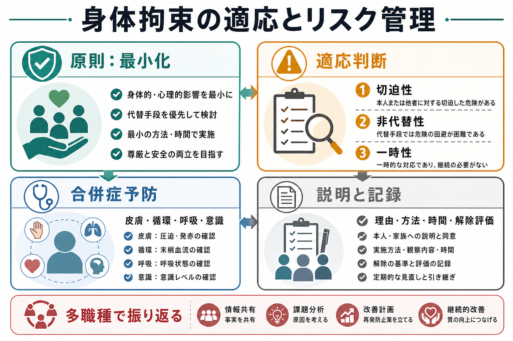
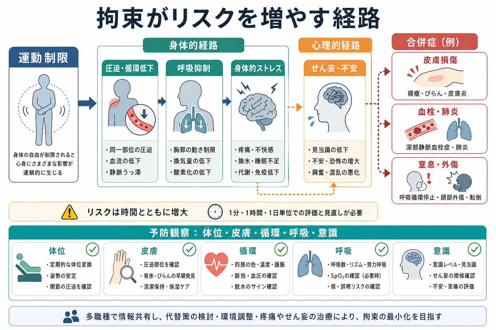
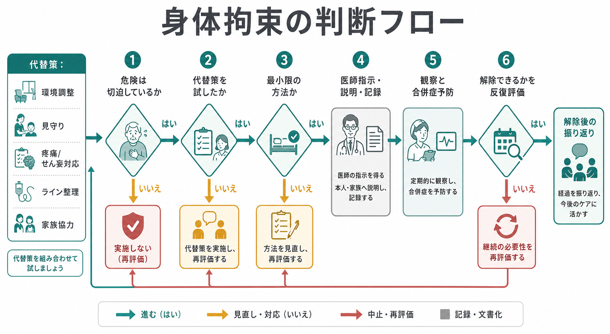

# 身体拘束の適応とリスク管理とは何か

## 要点

- 身体拘束は、本人の行動の自由を外部から制限する介入であり、医療安全の手段であると同時に、尊厳・自由・治療関係を傷つけうる強い制限である。
- 適応は「危険が切迫している」「代替策では回避できない」「一時的で最小限である」という三要件で考える。介護領域では「切迫性・非代替性・一時性」と整理されてきた[1]。
- 2024年度診療報酬改定では、一般医療機関でも身体的拘束最小化の体制、記録、チーム、指針が入院料の施設基準に位置づけられた[2]。
- 拘束のリスク管理は「拘束を安全に行う技術」だけではなく、拘束を始める前の代替策、実施中の合併症予防、解除評価、説明と記録、事後レビューまでを含む。
- 本稿は教育・研究目的の整理であり、個別事例での拘束の可否や治療指示を決めるものではない。実務では法令、施設基準、院内指針、職種別権限、患者の状態に従う。

## この記事で答える問い

1. 身体拘束はどのような場合に適応となるのか。
2. 拘束が患者に及ぼす身体的・心理的リスクは何か。
3. 合併症を予防し、できるだけ短時間で解除するには何を観察するのか。
4. 説明、同意、記録、多職種レビューでは何を残すべきか。

## まず結論

身体拘束は「危険な患者を管理する方法」ではなく、「目前の重大な危険を、より制限の少ない方法では回避できないときに限って使う、時間限定の危機介入」である。したがって判断の中心は、拘束の有無ではなく、現在の危険、代替策、最小性、観察、解除可能性を反復的に評価することである。

## 背景

身体拘束は、転倒・転落、ライン抜去、暴力、自傷、重篤なせん妄、治療継続困難などへの対応として検討されることがある。しかし、拘束は患者の自由を制限し、恐怖、屈辱感、再トラウマ化、治療不信をもたらしうる。身体面でも、皮膚損傷、圧迫、循環障害、呼吸抑制、誤嚥、血栓、肺炎、筋力低下、せん妄悪化、外傷、窒息、死亡のリスクが問題になる[3][4]。

日本では高齢者ケア領域で「身体拘束ゼロ作戦」と「身体拘束ゼロへの手引き」が展開され、緊急やむを得ない場合の三要件が広く参照されてきた[1]。さらに2024年度診療報酬改定では、入院料通則に身体的拘束最小化が組み込まれ、記録、専任医師・看護職員を含むチーム、指針、周知、定期的見直しが求められる方向になった[2]。精神科病院・精神病室では、精神保健福祉法上の行動制限の枠組みも重なるため、[[精神科医療における行動制限最小化とは何か]]や[[精神医療における権利擁護とは何か]]と接続して理解する必要がある。

## 基本概念

### 身体拘束

身体拘束とは、本人の身体や衣服に接触する用具、または人の力によって、本人の身体の動きや移動を一時的に制限する行為である。入院料の施設基準では、抑制帯等の用具を用いて患者の身体を拘束し、運動を抑制する行動制限として定義されている[2]。ただし臨床倫理上は、ミトン、ベッド柵、車椅子テーブル、深い鎮静、過度な見守り、隔離的な環境設定なども「自由の制限」として広く検討する。

### 三要件

拘束を検討する際の中核は次の三要件である[1]。

| 要件 | 問うこと | 典型例 |
|---|---|---|
| 切迫性 | 本人または他者の生命・身体に重大な危険が差し迫っているか | 激しい自傷、重大な他害、生命維持ラインの反復抜去 |
| 非代替性 | より制限の少ない代替策では危険を回避できないか | 環境調整、見守り、疼痛・せん妄対応、説明、家族協力を試しても困難 |
| 一時性 | 最小の方法・最短時間で、解除条件が明確か | 時間、方法、解除基準、再評価間隔が定められている |

この三要件は「拘束してよい理由」を探すためではなく、「拘束しないで済む条件」を探し続けるためのチェックである。

## 仕組み

拘束が危険を増やす仕組みは、単一ではない。まず運動制限により、同一部位の圧迫、静脈うっ滞、筋力低下、換気量低下が生じる。これが皮膚損傷、深部静脈血栓症、肺炎、廃用、転倒リスクの増加につながる。次に、拘束されている体験そのものが恐怖や怒りを強め、[[ICUせん妄とは何か]]や[[せん妄と認知症はどう違うのか]]で扱うような意識・注意の揺らぎを悪化させることがある[3][4]。さらに、拘束具から逃れようとする動きが、窒息、外傷、ライン抜去、頭頸部損傷を逆に増やす場合もある。

## 適応判断の実務

### 1. 危険を具体化する

「危ない」「落ち着かない」だけでは適応にならない。何が、誰に、どの程度、どの時間軸で危険なのかを記述する。例として、挿管チューブを抜去しようとしている、抗凝固中に転落を反復している、他患者への暴力が差し迫っている、自傷が止まらない、といった具体的な危険に分解する。

### 2. 原因と代替策を先に探す

拘束の前に、疼痛、低酸素、尿閉、便秘、発熱、薬剤性アカシジア、アルコール離脱、低血糖、睡眠不足、感覚遮断、眼鏡・補聴器の不使用、家族不在、説明不足を確認する。代替策には、環境調整、ライン整理、見守り強化、ポジショニング、離床センサー、家族・支援者の協力、短時間の静かな場所への移動、疼痛・せん妄・不安の治療がある。NICE は、暴力・攻撃性への対応でも、予防、デエスカレーション、本人の好みの確認、最小制限、短時間化を重視している[5]。

### 3. 最小限の方法を選ぶ

拘束を使わざるを得ない場合も、部位、強度、時間、観察間隔を最小化する。複数部位拘束、腹臥位での制圧、頸部・胸郭・腹部を圧迫する保持、呼吸や発語を妨げる方法は重大な危険を伴う。国際的な患者権利基準では、最小制限、早期解除、監視、方針、職員教育が重視される[6]。

### 4. 説明・記録・解除評価を同時に開始する

開始時点で、本人に可能な限り理由、方法、予定時間、解除条件を説明する。家族等への説明も、本人の権利とプライバシーに配慮して行う。記録には、拘束の態様と時間、患者の心身の状況、緊急やむを得ない理由が含まれるべきである[2]。

## 合併症予防

拘束中の観察は「拘束具が外れていないか」だけでは不十分である。少なくとも次を反復して確認する。

| 観察領域 | 確認すること | 介入例 |
|---|---|---|
| 呼吸 | 呼吸数、努力呼吸、SpO2、胸郭運動、体位 | 胸腹部圧迫の解除、体位調整、酸素化評価 |
| 循環 | 末梢冷感、色調、浮腫、脈拍、疼痛 | 拘束部位の緩み確認、四肢運動、血栓リスク評価 |
| 皮膚 | 発赤、水疱、びらん、湿潤、圧迫部位 | 体位変換、皮膚保護、清潔保持 |
| 意識・心理 | せん妄、不安、恐怖、怒り、疼痛 | 説明、安心づけ、原因検索、疼痛・せん妄対応 |
| 栄養・水分・排泄 | 脱水、食事、トイレ、尿閉、便秘 | 水分提供、排泄援助、羞恥への配慮 |
| 解除可能性 | 危険が下がったか、代替策へ移れるか | 短時間解除、段階的解除、見守りへ移行 |

急性期高齢者の研究では、拘束は機能低下、入院期間延長、死亡などの不良転帰と関連することが示されている[4]。また、身体拘束が転倒を確実に減らすという根拠は限定的であり、拘束最小化プログラムでは転倒や重傷の増加を伴わず拘束を減らせる可能性が示されている[7][8]。したがって「転倒予防のために拘束する」という発想は、個別の危険と代替策を吟味せずに一般化してはならない。

## 最小化のためのチーム設計

身体拘束の最小化は、担当者の善意だけでは安定しない。必要なのは、[[精神科医療安全の特徴は何か]]で扱うような、組織的な医療安全システムである。2024年度改定で求められた身体的拘束最小化チームは、拘束の実施状況を把握し、管理者を含む職員に周知し、指針を作成・見直す役割を持つ[2]。実務上は、次のような指標を追うとよい。

- 拘束件数、延べ時間、患者1000人日あたりの拘束時間。
- 拘束開始理由、代替策の実施状況、解除までの時間。
- 拘束中の皮膚損傷、転倒、窒息、ライン抜去、せん妄悪化、職員傷害。
- 事後レビュー実施率、本人・家族への説明率。
- 病棟、時間帯、人員配置、薬剤、環境要因との関連。

重要なのは、拘束件数だけを減らすことではない。見守り不足、過鎮静、隠れた行動制限、家族への過度な依存に置き換わっていないかを確認する必要がある。

## 記録と説明

記録は防衛的な書類ではなく、拘束が本当に必要だったか、いつ解除できるか、次にどう防ぐかをチームで共有するための臨床データである。最低限、次を残す。

| 記録項目 | 内容 |
|---|---|
| 危険の具体像 | 何が、誰に、どの程度、いつ差し迫っていたか |
| 代替策 | 試した方法、効果、試せなかった理由 |
| 判断 | 三要件、医師指示、関係職種の判断 |
| 方法 | 拘束部位、用具、開始時刻、予定再評価時刻 |
| 観察 | 呼吸、循環、皮膚、意識、疼痛、排泄、水分、心理状態 |
| 説明 | 本人・家族への説明内容、反応、同意または異議 |
| 解除評価 | 解除基準、実際の解除時刻、解除後の状態 |
| 振り返り | 再発予防、環境・人員・薬剤・ケア計画の修正 |

本人が理解困難な状態でも、説明を省略してよいわけではない。説明は短く、反復し、本人の苦痛や怒りを記録に残す。これは[[意思決定支援とは何か]]や権利擁護の実践と連続している。

## 臨床・研究との接続

臨床では、身体拘束は[[危機介入とは何か]]、せん妄ケア、転倒予防、薬剤安全、感染対策、褥瘡予防、精神科行動制限、家族支援にまたがる。研究では、単に「拘束したかどうか」ではなく、拘束に至ったリスク、代替策、病棟文化、人員配置、患者体験、解除までの時間、合併症、退院後アウトカムを組み合わせて評価する必要がある。

拘束最小化の研究で難しいのは、拘束される患者ほどもともと重症で、せん妄、認知症、身体疾患、ライン類、転倒歴などのリスクが高いことである。観察研究では交絡が強いため、拘束そのものの因果効果を過大にも過小にも見積もりうる。それでも、拘束が中立的な安全装置ではなく、害の可能性を伴う介入であるという点は一貫している[3][4][7]。

## よくある誤解

### 誤解1: 転倒予防には拘束が最も安全である

拘束は転倒を確実に防ぐとは限らず、脱出しようとする動き、筋力低下、せん妄悪化を通じて、より重い外傷につながる場合がある[7]。転倒予防では、原因評価、環境調整、見守り、排泄援助、薬剤見直し、リハビリ、家族協力を組み合わせる。

### 誤解2: 医師指示があればリスク管理は完了する

医師指示は必要条件であって、十分条件ではない。拘束中の観察、説明、記録、解除評価、合併症予防は看護、リハビリ、薬剤、心理、ソーシャルワーク、家族支援を含むチーム課題である。

### 誤解3: 暴力や興奮には強い制限で早く対応するほどよい

切迫した危険には迅速な対応が必要だが、強い制限は二次的な身体・心理被害を増やしうる。NICE は、デエスカレーションを継続し、比例性、最小制限、短時間化、身体状態への配慮を求めている[5]。

### 誤解4: 拘束を減らすとは、現場に我慢を求めることである

拘束最小化は、現場負担の押し付けではない。むしろ、環境、人員、教育、薬剤レビュー、せん妄ケア、リーダーシップ、データ活用を整える組織的な医療安全活動である[2][8]。

## 関連ノート

- [[精神科医療安全の特徴は何か]]
- [[精神科医療における行動制限最小化とは何か]]
- [[精神医療における権利擁護とは何か]]
- [[意思決定支援とは何か]]
- [[危機介入とは何か]]
- [[多職種連携は地域精神医療でなぜ重要なのか]]
- [[ICUせん妄とは何か]]
- [[せん妄と認知症はどう違うのか]]

## MOC更新候補

- `content/00_MOC/` 配下の臨床実践、医療安全、精神科制度・権利擁護系 MOC に追加候補。
- 並列ジョブとの衝突を避けるため、本記事では MOC 本体は更新しない。

## 理解チェック

1. 身体拘束の三要件を、切迫性・非代替性・一時性の言葉を使って説明できるか。
2. 「転倒予防のため」という理由だけでは拘束適応として不十分な理由は何か。
3. 拘束中に観察すべき呼吸・循環・皮膚・意識・心理のポイントは何か。
4. 拘束開始時点で、記録に必ず残すべき内容は何か。
5. 拘束を減らす組織的な取り組みとして、病棟で測定できる指標を3つ挙げられるか。

## 未解決問題

- 急性期一般病棟で、拘束最小化と転倒・ライン抜去・職員傷害を同時に減らす実装パッケージは何か。
- 身体拘束、過鎮静、過度な見守り、隔離的環境調整を一体として評価する指標をどう作るか。
- 拘束体験が退院後の治療不信、PTSD症状、再入院、医療回避に与える影響をどう測定するか。
- 患者・家族の声を、拘束最小化チームのレビューにどのように組み込むか。

## 参考文献

[1] 厚生労働省老健局. 「身体拘束ゼロ作戦」の推進について（老発第155号）. 2001. https://www.mhlw.go.jp/web/t_doc?dataId=00ta4435&dataType=1

[2] 厚生労働省. 令和6年度診療報酬改定の概要：身体的拘束を最小化する取組の強化. 2024. https://www.mhlw.go.jp/content/12400000/001238907.pdf

[3] CADTH. *Avoidance of Physical Restraint Use among Hospitalized Older Adults: A Review of Clinical Effectiveness and Guidelines*. 2019. https://www.ncbi.nlm.nih.gov/books/NBK545889/

[4] Chou M-Y, Hsu Y-H, Wang Y-C, et al. The Adverse Effects of Physical Restraint Use among Older Adult Patients Admitted to the Internal Medicine Wards: A Hospital-Based Retrospective Cohort Study. *Journal of Nutrition, Health & Aging*. 2020;24(2):160-165. https://doi.org/10.1007/s12603-019-1306-7

[5] National Institute for Health and Care Excellence. *Violence and aggression: short-term management in mental health, health and community settings* (NG10). 2015, last reviewed 2024. https://www.nice.org.uk/guidance/ng10

[6] The Joint Commission. R3 Report Issue 44: New and Revised Restraint and Seclusion Requirements for Behavioral Health Care and Human Services Organizations. 2024. https://www.jointcommission.org/en-us/standards/r3-report/r3-report-44/

[7] Tang W-S, Chow Y-L, Koh S-S-L. The effectiveness of physical restraints in reducing falls among adults in acute care hospitals and nursing homes: a systematic review. *JBI Library of Systematic Reviews*. 2012;10(5):307-351. https://doi.org/10.11124/jbisrir-2012-4

[8] Eskandari F, Abdullah K-L, Zainal NZ, Wong LP. The effect of educational intervention on nurses' knowledge, attitude, intention, practice and incidence rate of physical restraint use. *Nurse Education in Practice*. 2018;32:52-57. https://doi.org/10.1016/j.nepr.2018.07.007
