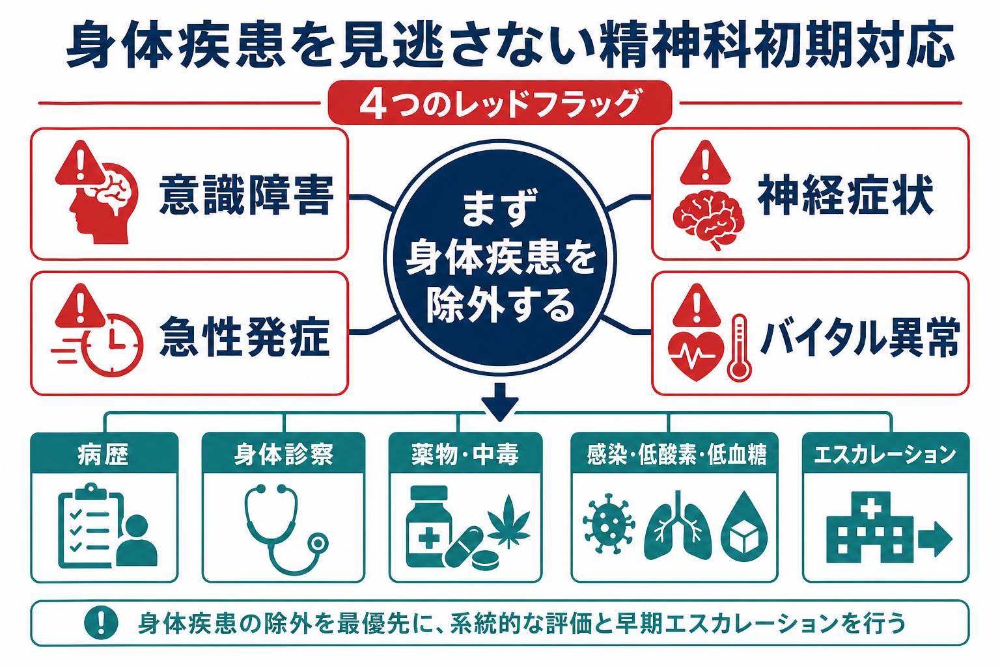
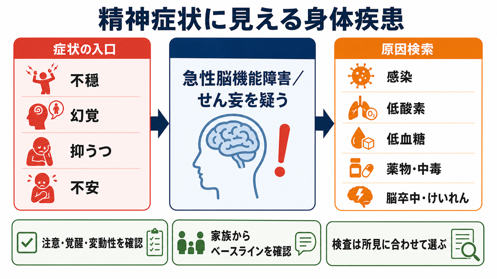
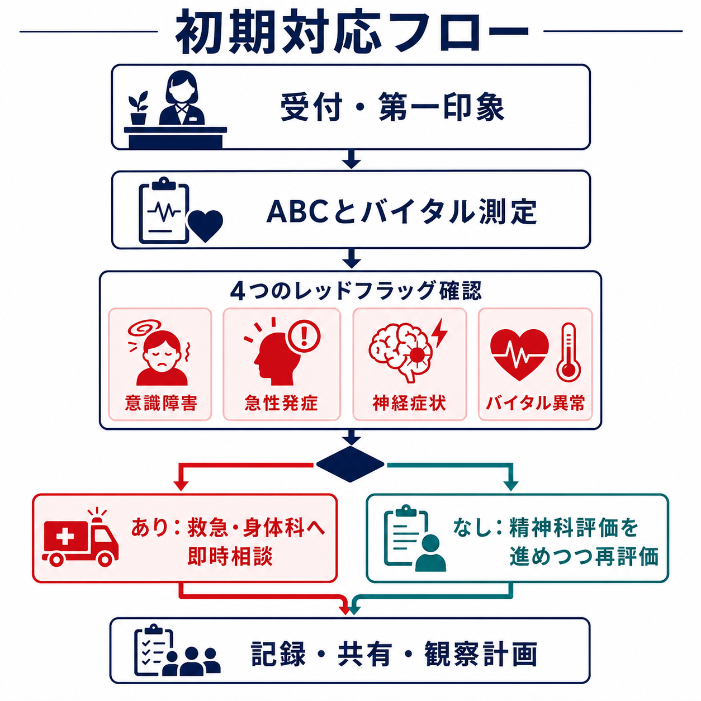

# 身体疾患の見逃しを防ぐ精神科初期対応とは何か

## 要点

- 精神科初期対応では、最初から「精神疾患か身体疾患か」を二分するのではなく、まず生命に関わる身体疾患と急性脳機能障害を拾い上げる。
- とくに **意識障害・急性発症・神経症状・バイタル異常** は、精神症状に見えても身体疾患を優先して考えるレッドフラッグである。
- 初期評価の最小単位は、病歴、薬物・物質使用、身体診察、バイタルサイン、意識・見当識、神経学的所見、低酸素・低血糖・感染・中毒の確認である[1][2]。
- 検査は「全例に同じセット」ではなく、レッドフラッグ、年齢、既往、薬剤、発症様式、身体所見に基づいて選ぶ。ただし、意識障害やバイタル異常がある場合は、検査より先に救急・身体科へエスカレーションする。
- 本稿は教育・研究目的の整理であり、個別症例の診断や治療指示ではない。実際の対応は所属施設の手順、地域の救急体制、医師・看護師・救急隊・身体科との連携に従う。

## この記事で答える問い

このノートでは、[[精神科救急でみる疾患・症候群には何があるのか]]や[[興奮状態への対応はどう行うか]]の前提として、精神科初期対応で身体疾患を見逃さないために何を確認するかを扱う。中心となる問いは次の四つである。

1. 精神症状の訴えで来た人に、なぜ身体疾患の確認が必要なのか。
2. どの所見を「精神科だけで抱え込まない」サインとして見るべきか。
3. 意識障害、急性発症、神経症状、バイタル異常をどう確認するか。
4. どの時点で救急・身体科に相談し、どのように記録・共有するか。

## まず結論

身体疾患の見逃しを防ぐ精神科初期対応とは、**精神症状の評価を始める前に、急変しうる身体疾患の入口を閉じない対応**である。幻覚、妄想、不安、抑うつ、不眠、興奮、希死念慮などの訴えがあっても、急に始まった、意識がぼんやりしている、神経学的な左右差がある、発熱・低酸素・頻脈・低血圧などがある場合は、精神疾患の診断名を急がない。

AAEPの成人精神科患者の医学的評価に関する合意声明は、救急場面での評価の目的を、精神症状の医学的模倣、すなわち脳症、物質中毒・離脱、感染、中枢神経疾患などを同定することに置いている[1]。Project BETAも、興奮は精神疾患だけでなく生命に関わる医学的原因から生じうるため、医学的原因と非医学的原因を区別して適時に治療へつなぐ必要があるとする[2]。

したがって、初期対応の実務的な順序は次のようになる。

1. まず安全確保とABC、バイタル測定を行う。
2. 意識障害、急性発症、神経症状、バイタル異常を確認する。
3. どれか一つでも明らかなら、精神科評価を止めるのではなく、身体疾患評価を優先する。
4. レッドフラッグが乏しい場合も、薬物・中毒、感染、低酸素、低血糖、脱水、疼痛、外傷、妊娠可能性、高齢、認知症、身体合併症を確認しながら精神科評価を進める。

## 背景

精神科では、患者が「不安」「眠れない」「死にたい」「幻聴がある」「怒りが抑えられない」と訴えて来ることが多い。しかし、症状の入口が精神症状であっても、原因が身体疾患であることは珍しくない。低血糖、低酸素、感染、脳卒中、てんかん発作後、頭部外傷、甲状腺機能異常、肝腎機能障害、薬物中毒、アルコール離脱、抗コリン性せん妄などは、精神症状に似た形で現れる。

ここで重要なのは、「精神疾患と身体疾患の鑑別」を一回で完了させようとしないことである。初期対応で必要なのは、最終診断ではなく、危険な身体疾患を示すサインを拾い上げ、適切な場所へつなぐことである。これは[[医療安全とは何か]]や[[精神科医療安全の特徴は何か]]で扱う、個人の注意だけに依存しない安全設計の一部である。

AAEPの合意声明では、異常バイタル、高齢、重度の興奮、中毒の証拠、意識レベル低下などは医学的原因の可能性を高め、追加評価が必要な所見として整理されている[1]。この考え方は、精神科外来、精神科救急、一般救急、病棟、地域支援のいずれでも応用できる。

## 基本概念

### レッドフラッグ1: 意識障害

意識障害は、眠そうに見える、反応が遅い、話がかみ合わない、見当識があいまい、注意が保てない、日内変動がある、家族から見て「いつもと違う」といった形で現れる。これは[[意識障害はどのように評価されるのか]]と直結する所見であり、精神症状よりも先に評価する。

NICEのせん妄ガイドラインは、数時間から数日の変化や変動性、集中困難、反応の遅さ、混乱、幻覚、活動性の変化、睡眠や食欲の変化、社会的行動の変化をせん妄の指標として確認することを推奨している[3]。とくに低活動型せん妄は見逃されやすく、引きこもり、反応の遅さ、活動低下、集中困難、食欲低下として現れる[3]。

確認する問いは単純でよい。

- 今日の日付、場所、状況をどの程度理解しているか。
- 呼びかけへの反応は普段と比べてどうか。
- 注意を保って会話できるか。
- 症状は一日中同じか、波があるか。
- 家族や支援者から見て「いつもの本人」と違うか。

### レッドフラッグ2: 急性発症

精神症状は急に悪化することもあるが、「数時間から数日で急に別人のようになった」場合は、まず身体疾患を疑う。急性発症は、感染、低酸素、低血糖、脳卒中、けいれん、薬物中毒・離脱、頭部外傷、脱水、代謝異常の入口になりやすい。

初診時に重要なのは、症状の内容よりも時間軸である。「いつから」「何時ごろから」「最後に普段通りだったのはいつか」「発症時に転倒、発熱、服薬変更、飲酒、物質使用、けいれん様の動き、頭痛、胸痛、息苦しさがあったか」を確認する。本人の説明が不確かなら、家族、施設職員、救急隊、紹介元、薬局情報、過去カルテから補う。

### レッドフラッグ3: 神経症状

片側の麻痺やしびれ、構音障害、失語、視野障害、複視、歩行障害、めまい、失調、けいれん、強い頭痛、項部硬直は、精神症状の文脈だけで説明しない。CDCは、脳卒中の症状として、突然の片側の顔・腕・脚のしびれや脱力、突然の混乱や会話理解困難、視覚障害、歩行障害、原因不明の激しい頭痛を挙げ、直ちに救急要請するよう示している[6]。

精神科場面では、焦燥、拒否、会話困難、興奮があると神経診察が省略されやすい。最低限、顔面の左右差、上肢挙上、握力差、歩行、構音、眼球運動、瞳孔、けいれん後のもうろう、頭部外傷の痕跡は確認する。異常があれば「精神症状が強い脳卒中かもしれない」と考える。

### レッドフラッグ4: バイタル異常

バイタルサインは、精神科初期対応で最も見逃してはならない身体情報である。NICEの急性疾患対応ガイドラインは、初期評価とモニタリングで、心拍数、呼吸数、収縮期血圧、意識レベル、酸素飽和度、体温を最低限記録することを推奨している[4]。状況により尿量、乳酸、血糖、血液ガス、疼痛評価なども考慮される[4]。

精神科場面で見逃しやすいのは、呼吸数、SpO2、低体温、発熱、頻脈、低血圧、脱水である。たとえば敗血症では、混乱、発熱または悪寒、頻脈、息切れ、冷汗、強い痛みや不快感が生じうる[5]。感染が疑われる人に意識変容やバイタル異常がある場合、「不安が強い」「落ち着かない」とだけ解釈しない。

## 仕組み

### 精神症状に見える急性脳機能障害

せん妄は、急性の脳機能障害として理解すると見逃しにくい。脳は、酸素、血糖、電解質、感染・炎症、薬物、睡眠、疼痛、感覚入力、脱水などの影響を受ける。これらが崩れると、注意、覚醒、知覚、思考、行動が変化し、幻覚、不安、興奮、抑うつ、拒否、被害的言動として見えることがある。

このため、精神科初期対応では「幻覚があるから統合失調症」「不安が強いからパニック」「暴れているから性格や意思の問題」と短絡しない。急性発症、注意障害、変動性、身体所見、薬剤変更、感染徴候、低酸素、低血糖を確認する。[[せん妄と認知症はどう違うのか]]、[[せん妄を起こしやすい疾患には何があるのか]]、[[抗コリン性せん妄とは何か]]、[[振戦せん妄とは何か]]は、この鑑別の基礎になる。

### 「検査するか」より先に「危険か」を見る

身体疾患の見逃しを防ぐというと、血液検査、尿検査、頭部CT、心電図をどこまで行うかに議論が偏りやすい。しかし、初期対応で最も重要なのは、検査セットではなく危険度の見立てである。

AAEPの合意声明は、精神科患者の評価において、病歴、身体診察、バイタルサイン、精神状態評価が最小限必要な要素である一方、全例一律のルーチン検査については根拠が明確ではなく議論があると整理している[1]。つまり、検査を減らすために身体評価を省くのではなく、身体評価を丁寧に行い、必要な検査を選ぶ。

### エスカレーションは「診断がついた後」ではない

救急・身体科への相談は、診断確定後に行うものではない。むしろ、診断がつかない段階で危険所見があるから相談する。たとえば、意識障害、SpO2低下、低血圧、発熱と頻脈、片麻痺、けいれん、急な激しい頭痛、外傷、急性中毒が疑われる場合は、精神科的な面接を完了する前にエスカレーションする。

NICEの急性疾患対応ガイドラインは、異常な生理学的所見をトリガーとして観察頻度を上げ、重症度に応じて主治療チーム、急性疾患に対応できる人員、集中治療能力を持つチームへ段階的に対応する枠組みを示している[4]。精神科でも同様に、「どの所見で誰に連絡するか」を部署内で明確にしておく必要がある。

## 図解

実務上は、次のような短い型で記録すると共有しやすい。

| 確認項目 | 具体的に見ること | 危険な所見 |
|---|---|---|
| 意識 | 覚醒、見当識、注意、変動性、家族から見た変化 | 反応低下、急な混乱、注意保持困難、日内変動 |
| 発症様式 | 最終正常時刻、数時間から数日の変化、急な悪化 | 突然発症、急速進行、転倒・発熱・服薬変更後 |
| 神経 | 顔面左右差、上肢挙上、構音、歩行、視覚、けいれん | 片麻痺、失語、けいれん、強い頭痛、項部硬直 |
| バイタル | 体温、脈拍、血圧、呼吸数、SpO2、意識レベル | 発熱/低体温、低血圧、頻脈、低酸素、頻呼吸 |
| 薬物・中毒 | 処方変更、過量服薬、飲酒、物質使用、離脱 | 意識変容、呼吸抑制、散瞳/縮瞳、発汗、振戦 |
| 感染・代謝 | 発熱、尿路症状、咳、脱水、摂食低下、血糖 | 敗血症疑い、低血糖、脱水、電解質異常の疑い |

## 臨床・研究との接続

臨床では、身体疾患の見逃しは「知識不足」だけで起こるわけではない。精神科的な既往がある、本人が説明しにくい、興奮や拒否がある、夜間や休日で人員が少ない、紹介状に精神疾患名が書かれている、過去にも似た症状があった、といった状況が判断を狭める。

したがって、個人の鑑別能力だけでなく、チェックリスト、バイタル測定の標準化、観察頻度、相談基準、記録様式、身体科連携、薬剤照合、家族・施設からの情報収集が必要になる。これは[[精神疾患と身体合併症はどう関係するのか]]、[[過量服薬リスクへの対応とは何か]]、[[薬物療法は神経回路にどう作用するのか]]とも接続する。

研究上は、精神科救急でどのレッドフラッグが医学的原因の予測に有用か、どの検査が過不足なく安全性を高めるか、低活動型せん妄をどう拾うか、精神科病棟でのNEWSや類似の早期警告スコアをどう運用するかが課題になる。AAEPも、この領域ではランダム化比較試験が乏しく、合意に基づく推奨が多いことを明記している[1]。

## よくある誤解

### 誤解1: 精神科既往があれば、今回も精神症状である

精神科既往は重要な情報だが、今回の症状の原因を自動的に決める情報ではない。統合失調症、双極症、うつ病、認知症、物質使用症がある人も、低血糖、感染、脳卒中、薬物中毒、頭部外傷を起こす。むしろ、説明が難しい、支援が途切れやすい、身体疾患の訴えが精神症状として扱われやすいという意味で、見逃しリスクが高くなる。

### 誤解2: 会話ができていれば意識障害はない

せん妄や軽度の意識障害では、短い会話は成立することがある。重要なのは、注意を保てるか、話題が逸れないか、見当識が保たれるか、時間帯で変動するか、普段の本人と違うかである。低活動型せん妄では、静かで協力的に見えるため、むしろ見逃されやすい[3]。

### 誤解3: 検査をすれば安全である

検査は重要だが、検査だけでは安全にならない。低酸素、低血圧、急性神経症状、けいれん、敗血症疑いでは、検査結果を待つ前に対応が必要になる。逆に、バイタル、病歴、身体所見が安定していて低リスクと判断できる場合は、全例一律の検査よりも、所見に合わせた評価が合理的である[1]。

### 誤解4: 興奮していると身体評価はできない

完全な診察が難しい場面でも、観察できる情報は多い。呼吸の速さ、顔色、発汗、転倒痕、歩行、構音、左右差、瞳孔、服薬袋、飲酒臭、周囲の証言、救急隊情報、家族からの普段との差は評価できる。[[興奮状態への対応はどう行うか]]で扱う安全確保や言語的ディエスカレーションは、身体評価を可能にするための手段でもある。

## 関連ノート

- [[意識障害はどのように評価されるのか]]
- [[せん妄と認知症はどう違うのか]]
- [[せん妄を起こしやすい疾患には何があるのか]]
- [[抗コリン性せん妄とは何か]]
- [[振戦せん妄とは何か]]
- [[精神疾患と身体合併症はどう関係するのか]]
- [[精神科救急でみる疾患・症候群には何があるのか]]
- [[興奮状態への対応はどう行うか]]
- [[精神科医療安全の特徴は何か]]
- [[医療安全とは何か]]

### MOC更新候補

- `content/00_MOC/MOC｜総論・診断・面接.md`
- `content/00_MOC/MOC｜薬物療法.md`
- 医療安全・危機対応系MOCを統合ジョブで作る場合、本記事を「身体疾患見逃し・精神科救急・初期評価」の入口ノートとして配置する。

### 今後の作成候補

- 精神科救急でのバイタルサイン確認とは何か
- 精神症状に見える低血糖・低酸素・感染をどう見分けるか
- 精神科病棟での急変対応フローとは何か
- 低活動型せん妄を見逃さない観察とは何か

## 理解チェック

1. 精神科初期対応で、意識障害、急性発症、神経症状、バイタル異常を先に確認する理由を説明できるか。
2. 本人が「不安」と訴えていても、身体疾患評価を優先すべき所見を三つ挙げられるか。
3. せん妄を疑うとき、本人の訴え以外に誰から何を確認するべきか。
4. 全例一律の検査ではなく、所見に基づく検査選択が必要な理由を説明できるか。
5. 救急・身体科へ相談するとき、バイタル、発症時刻、神経所見、薬剤情報をどのように短く共有するか。

## 参考文献

[1] Wilson, M. P., Nordstrom, K., Anderson, E. L., Ng, A. T., Zun, L. S., Peltzer-Jones, J. M., & Allen, M. H. (2017). American Association for Emergency Psychiatry Task Force on Medical Clearance of Adult Psychiatric Patients. Part II: Controversies over Medical Assessment, and Consensus Recommendations. *Western Journal of Emergency Medicine, 18*(4), 640-646. https://doi.org/10.5811/westjem.2017.3.32259

[2] Nordstrom, K., Zun, L. S., Wilson, M. P., Stiebel, V., Ng, A. T., Bregman, B., & Anderson, E. L. (2012). Medical evaluation and triage of the agitated patient: Consensus statement of the American Association for Emergency Psychiatry Project BETA Medical Evaluation Workgroup. *Western Journal of Emergency Medicine, 13*(1), 3-10. https://doi.org/10.5811/westjem.2011.9.6863

[3] National Institute for Health and Care Excellence. (2010, updated 2023). *Delirium: prevention, diagnosis and management in hospital and long-term care* (Clinical guideline CG103). https://www.nice.org.uk/guidance/cg103

[4] National Institute for Health and Care Excellence. (2007). *Acutely ill adults in hospital: recognising and responding to deterioration* (Clinical guideline CG50). https://www.nice.org.uk/guidance/cg50

[5] Centers for Disease Control and Prevention. (2026). *About Sepsis*. https://www.cdc.gov/sepsis/about/index.html

[6] Centers for Disease Control and Prevention. (2024). *Signs and Symptoms of Stroke*. https://www.cdc.gov/stroke/signs-symptoms/index.html

