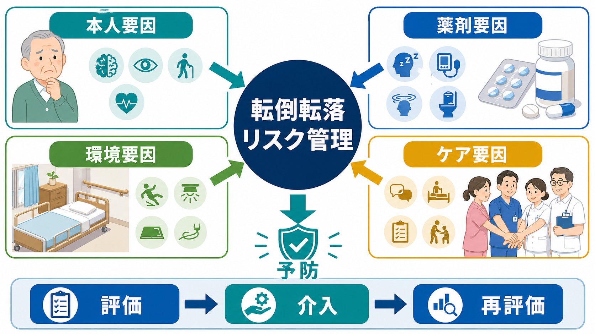
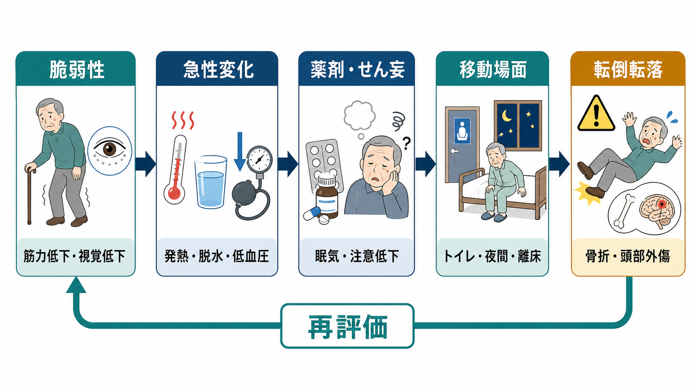
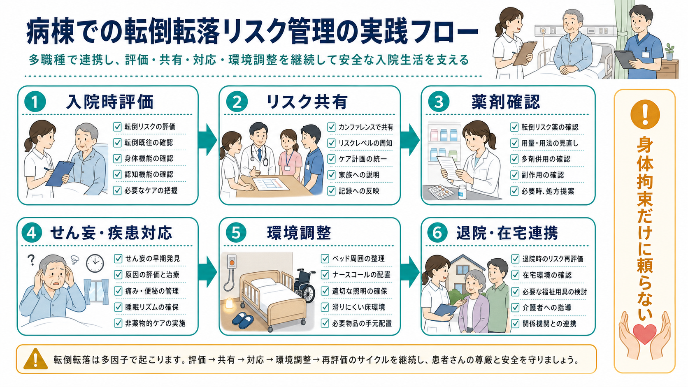

# 転倒転落リスク管理とは何か

## 要点

- 転倒転落リスク管理とは、患者を「転びやすい人」と固定的に分類する作業ではなく、身体機能、認知機能、薬剤、急性疾患、環境、ケア体制を組み合わせて、リスクが高まる場面を予測し、介入し、再評価する実践である。
- 高齢者では筋力低下、視覚・聴覚低下、起立性低血圧、認知症、フレイル、骨粗鬆症などが重なり、転倒そのものだけでなく骨折・頭部外傷・活動性低下・再転倒恐怖につながる[1][2]。
- 薬剤では、ベンゾジアゼピン系薬、Z薬、抗コリン作用をもつ薬、抗精神病薬、抗うつ薬、降圧薬、利尿薬、オピオイドなどが、眠気、ふらつき、注意低下、低血圧、せん妄を介して転倒リスクを高めうる[2][5]。
- せん妄や急性身体疾患は、数時間から数日の注意・認知・睡眠覚醒・行動の変動として現れ、夜間離床、点滴・尿道カテーテルへの違和感、トイレ移動などと結びつく[6]。
- 有効な対策は、単一の「転倒スコア」やセンサーだけに頼ることではない。運動、環境調整、薬剤見直し、視覚・足部・起立性低血圧の評価、患者・家族参加型のケア計画を、状況に合わせて組み合わせる[1][3][4][7]。

## この記事で答える問い

1. 転倒転落リスク管理は、単なる見守りや身体拘束と何が違うのか。
2. 高齢者、薬剤、せん妄、身体疾患はどのように転倒転落へつながるのか。
3. 病棟・外来・在宅支援で、どの順番で評価し、どの介入を優先すべきか。
4. 「転ばせない」ことと、本人の尊厳・活動性・リハビリテーションをどう両立するのか。

## まず結論

転倒転落リスク管理の中心は、「危ないから動かさない」ではなく、「危なくなる条件を具体化し、安全に動ける条件を増やす」ことである。入院時や状態変化時にリスクを評価し、薬剤、せん妄、発熱・脱水・疼痛、排泄、睡眠、歩行補助具、照明、床環境、履物、ナースコール、家族説明を見直す。そして、介入後に転倒の有無だけでなく、移動能力、本人の不安、ケア負担、活動量、退院後の生活環境を再評価する。

これは [[医療安全とは何か]] の一領域であると同時に、[[身体健康管理支援とは何か]]、[[身体活動処方とは何か]]、[[高齢者の薬物療法では何に注意するか]]、[[せん妄とは何か]] と強く接続する。特に精神科・認知症ケアでは、行動制限だけで転倒を防ごうとすると、廃用、せん妄悪化、尊厳の損傷、治療関係の悪化を招きうるため、[[身体拘束とは何か]] と合わせて考える必要がある。

## 背景

転倒は高齢者医療で頻度が高く、結果のばらつきが大きい安全課題である。何も起きない軽微な転倒もあれば、大腿骨近位部骨折、頭蓋内出血、長期入院、活動性低下、施設入所、死亡につながる転倒もある。NICE は、65歳以上の人と、転倒リスクが高い50歳以上の人を対象に、転倒リスクの同定、包括的評価、介入、継続参加、情報提供を推奨している[1]。

臨床で難しいのは、転倒が単一原因で説明できないことである。筋力低下だけで転ぶのではなく、発熱でふらつき、夜間にトイレへ急ぎ、睡眠薬が残り、点滴ルートが足に絡み、照明が暗く、ナースコールを押しにくい、というように複数の小さな条件が同時にそろう。したがって「転倒歴あり」「高齢」「認知症あり」とラベルを貼るだけでは不十分で、いつ、どこで、何をしようとして、どのリスクが重なるのかを具体化する必要がある。

地域在住高齢者では、運動介入が転倒と転倒関連 morbidity を減らす中等度の利益をもち、多因子介入は小さい利益をもつと USPSTF は評価している[3]。Cochrane レビューでも、多因子評価にもとづく介入は転倒率を下げうる一方、すべての転倒者数や骨折を一律に減らすわけではないことが示されている[4]。これは、転倒予防が「評価すれば終わり」ではなく、評価結果を実際の行動・環境・ケア計画に落とし込めるかに左右されることを示す。

## 基本概念

### 転倒と転落

転倒は、本人の意思に反して床や低い位置に倒れる出来事を指す。転落は、ベッド、椅子、車椅子、ストレッチャー、段差など、一定の高さから落ちる出来事として扱われることが多い。実務上は「転倒転落」とまとめ、同じ安全管理サイクルで扱う。

重要なのは、転倒転落を単なるインシデント報告名ではなく、機能・環境・治療・生活行動が交差する出来事として理解することである。たとえば、ベッド柵を越えようとして落ちた場合、柵の有無だけでなく、排泄切迫、せん妄、疼痛、ナースコールの理解、スタッフ配置、夜間照明、睡眠薬の影響まで見直す。

### リスク因子と誘発因子

リスク因子は、転倒しやすい土台である。高齢、筋力低下、歩行障害、視力低下、認知症、パーキンソン症状、脳血管障害後遺症、糖尿病性神経障害、骨粗鬆症、多剤併用などが含まれる。

誘発因子は、ある時点でリスクを急に高める条件である。発熱、脱水、低血糖、低酸素、貧血、起立性低血圧、疼痛、便秘、尿意切迫、感染、睡眠不足、薬剤変更、手術後、入院直後、病室移動、夜間、検査前後などである。

この2つを分けると、介入の優先順位が立てやすい。慢性的な筋力低下には運動・リハビリ・補助具調整が必要だが、急性の脱水や低血圧には輸液、降圧薬調整、立位時の見守り、トイレ動線の短縮が先になる。

### リスク評価は点数よりケア計画が重要

転倒リスクスコアは、注意喚起や情報共有には役立つ。しかし、点数だけでは「何を変えるか」は決まらない。CDC STEADI は、スクリーニング、評価、介入を組み合わせ、椅子立ち上がり、バランス、Timed Up and Go、起立性血圧、薬剤レビューなどを臨床資源として整理している[2]。評価は、ケア計画に接続して初めて意味をもつ。

## 仕組み

転倒転落は、多くの場合、次の連鎖で起こる。

1. もともとの脆弱性がある。
2. 急性疾患や入院環境で状態が変わる。
3. 薬剤やせん妄で注意・覚醒・判断・姿勢制御が乱れる。
4. トイレ、夜間離床、移乗、検査移動などの場面で負荷がかかる。
5. 転倒転落が起こり、外傷、恐怖、活動性低下、再転倒リスクが生じる。

### 高齢者の脆弱性

高齢者では、筋力、バランス、反応速度、視覚、前庭機能、末梢感覚が少しずつ低下する。これだけなら代償できていても、入院や急性疾患で活動量が落ちると、数日で立位・歩行能力が下がる。さらに骨粗鬆症があると、転倒後の骨折リスクが高まる。

予防の要点は、安静を増やすだけではなく、安全に活動する機会を保つことである。運動介入は地域在住高齢者の転倒予防で比較的強い根拠があり、筋力、バランス、歩行、立ち上がりを組み合わせる介入が中心になる[3][4]。入院中でも、病状に応じて離床計画、歩行補助具、リハビリ、トイレ誘導を調整する。

### 薬剤による眠気・ふらつき・低血圧

薬剤は、転倒転落リスク管理で見逃されやすい。ベンゾジアゼピン系薬やZ薬は、眠気、反応遅延、ふらつき、せん妄を介してリスクを高める。抗コリン作用をもつ薬は、口渇、便秘、尿閉、視覚調節障害、認知機能低下、せん妄と関連する。抗精神病薬、抗うつ薬、抗てんかん薬、オピオイド、降圧薬、利尿薬も、症例によって転倒に寄与する[5]。

ただし、薬剤を一律に中止すればよいわけではない。疼痛、不眠、不安、精神症状、血圧、排尿、便秘が悪化すれば、かえって夜間離床やせん妄が増える。したがって [[薬物療法のリスクベネフィットをどう考えるか]] と同じく、適応、用量、投与時刻、併用、腎機能、肝機能、離脱症状、代替手段を確認する。高齢者では [[高齢者の薬物療法では何に注意するか]] と接続して、最小有効量、短期使用、定期的な減量可能性の確認を行う。

### せん妄と急性身体疾患

せん妄は、転倒転落の強い誘発因子である。NICE は、病院や長期ケアで、65歳以上、認知機能障害または認知症、股関節骨折、重症疾患をせん妄リスクとして評価し、注意・認知・知覚・身体機能・社会的行動の急な変化を観察するよう勧めている[6]。

せん妄では、本人が「なぜここにいるのか」「点滴は何か」「ナースコールを押すべきか」を理解しにくくなる。夜間にトイレへ行こうとして急に立ち上がる、ベッド柵を乗り越える、ルートを外そうとする、廊下へ出る、という行動が起こりうる。これは本人の性格や協力性の問題ではなく、急性脳機能障害として理解する必要がある。

実践上は、[[せん妄とは何か]]、[[ICUせん妄とは何か]]、[[せん妄を起こしやすい疾患には何があるのか]] と同じく、感染、脱水、低酸素、疼痛、便秘、尿閉、薬剤、睡眠覚醒リズム、感覚遮断を見直す。せん妄が改善すれば、転倒リスクも下がりやすい。

### 環境とケア体制

環境調整は、単に「ベッドを低くする」だけではない。必要物品が手に届くか、ナースコールが理解できる場所にあるか、履物は滑りにくいか、床にコードや荷物がないか、夜間照明は十分か、トイレまでの距離は長すぎないか、車椅子のブレーキは使えているかを確認する。

ケア体制では、申し送り、リスク表示、患者・家族説明、トイレ誘導、離床センサーの適応、リハビリ職との連携、薬剤師との薬剤レビューが重要である。AHRQ の Fall TIPS は、患者固有のリスク因子と個別化された予防計画をベッドサイドで共有し、患者・家族とチームを巻き込む仕組みとして開発され、急性期病棟で転倒と傷害を減らした研究が報告されている[7]。

## 図解

病棟での実践は、次の流れで考えると整理しやすい。

| 段階 | 見ること | 介入例 |
|---|---|---|
| 入院時評価 | 転倒歴、歩行、認知、視覚、排泄、薬剤、疾患 | 初期リスク共有、歩行補助具、トイレ動線確認 |
| 状態変化時評価 | 発熱、脱水、低血圧、疼痛、睡眠、せん妄 | バイタル・検査・疼痛管理・原因治療 |
| 薬剤確認 | 眠気、ふらつき、抗コリン作用、多剤併用 | 用量・投与時刻・減量可能性・代替策の検討 |
| 環境調整 | ベッド周囲、照明、履物、コード、ナースコール | 低床ベッド、手すり、滑りにくい履物、必要物品配置 |
| ケア共有 | 申し送り、患者・家族説明、リハビリ連携 | 個別予防計画、トイレ誘導、移乗方法の統一 |
| 再評価 | 転倒の有無、活動量、不安、介入の副作用 | 介入の解除・変更、退院後環境への接続 |

## 臨床・研究との接続

### 病棟では「個別化」と「実行の一貫性」が鍵になる

急性期病院では、転倒転落は病状、薬剤、検査、病室移動、スタッフ交代の影響を受ける。したがって、評価票を埋めるだけでなく、リスク因子に対応した具体的なケアが、日勤・夜勤・リハビリ・薬剤・家族説明で一貫しているかが重要である。

Fall TIPS の研究は、患者・家族が見える形でリスク因子と予防計画を共有することの意義を示している[7]。この発想は、[[精神科医療安全の特徴は何か]] で扱うチーム共有や、[[安全計画とは何か]] の「危機時に何をするかを具体化する」考え方とも近い。

### 地域・在宅では「転ばない生活」ではなく「安全に動ける生活」を支える

在宅では、転倒を完全にゼロにするよりも、生活機能、外出、社会参加、本人の希望を保ちながらリスクを下げることが中心になる。運動、住環境、視覚、足部、履物、薬剤、骨折予防、介護者支援を組み合わせる。地域在住高齢者では、運動介入の利益が比較的明確であり、多因子介入は個々のリスクに合わせて設計する必要がある[3][4]。

### 精神科・認知症ケアでは身体拘束に頼りすぎない

認知症、せん妄、精神症状がある場合、転倒リスクは高まる。しかし、身体拘束や過度な行動制限は、筋力低下、せん妄悪化、不安、怒り、治療関係の悪化を招きうる。やむを得ず制限を検討する場合でも、切迫性、非代替性、一時性、説明、記録、解除基準、振り返りが必要である。ここは [[身体拘束とは何か]] と接続して検討する。

## よくある誤解

### 誤解1: 転倒リスクが高い人は、なるべく動かさないほうが安全である

安静は短期的には転倒機会を減らすが、筋力低下、起立性低血圧、睡眠障害、せん妄、活動性低下を通じて、長期的にはリスクを高めうる。安全な離床、見守り、補助具、環境調整を組み合わせ、動ける条件を作るほうが重要である。

### 誤解2: センサーを付ければ転倒は防げる

センサーは離床に気づく補助にはなるが、転倒原因を取り除くものではない。通知が鳴ってもスタッフが間に合わない、本人が驚いて急ぐ、アラーム疲れが起こる、という問題もある。センサーは、排泄計画、薬剤調整、せん妄対応、動線調整と組み合わせる必要がある。

### 誤解3: 薬剤を減らせば必ず転倒は減る

転倒リスク薬の見直しは重要だが、急な中止で不眠、疼痛、不安、離脱、精神症状が悪化すれば逆効果になりうる。薬剤レビューは、薬剤師、主治医、看護師、本人・家族で、何をどの順番で調整するかを決めるプロセスである。

### 誤解4: 転倒したら、まず本人に注意すればよい

「勝手に歩かないでください」という注意だけでは、排泄切迫、せん妄、ナースコール理解困難、羞恥心、疼痛、夜間不眠は解決しない。転倒後は、責めるのではなく、何が重なったかをチームで振り返り、次に同じ場面が来たときの条件を変える。

## 関連ノート

- [[医療安全とは何か]]
- [[精神科医療安全の特徴は何か]]
- [[安全計画とは何か]]
- [[身体拘束とは何か]]
- [[せん妄とは何か]]
- [[ICUせん妄とは何か]]
- [[せん妄と認知症はどう違うのか]]
- [[せん妄を起こしやすい疾患には何があるのか]]
- [[高齢者の薬物療法では何に注意するか]]
- [[薬物療法のリスクベネフィットをどう考えるか]]
- [[身体健康管理支援とは何か]]
- [[身体活動処方とは何か]]
- [[認知症の生活支援とは何か]]

## MOC更新候補

- `content/00_MOC/MOC｜臨床実践・治療.md`
- `content/00_MOC/MOC｜薬物療法.md`
- 医療安全・高齢者ケア・せん妄・身体健康管理を横断する記事として、バッチ統合時に MOC へ追加する。

## 理解チェック

1. 転倒転落リスク管理が「高リスク者を動かさないこと」ではない理由を説明できるか。
2. 高齢者の脆弱性と、急性疾患・薬剤・せん妄の誘発因子を分けて列挙できるか。
3. ベンゾジアゼピン系薬、抗コリン作用、降圧薬、利尿薬が転倒に関わる経路を説明できるか。
4. せん妄がある患者の夜間離床に対して、身体拘束以外に検討すべき介入を挙げられるか。
5. 転倒後レビューで、本人の注意不足ではなく、環境・薬剤・排泄・睡眠・情報共有を点検できるか。

## 未解決問題

- 日本の一般病棟・精神科病棟・介護施設で、患者参加型の転倒予防計画をどの程度実装できるか。
- 転倒予防センサー、見守り機器、AI予測モデルが、実際の転倒・傷害・スタッフ負担・患者の尊厳にどのような影響を与えるか。
- せん妄、認知症、精神症状をもつ患者で、身体拘束を減らしながら転倒傷害を減らす標準的なケアパッケージをどう設計するか。
- 多剤併用の高齢者で、転倒リスク低減と精神症状・疼痛・睡眠の安定を両立する薬剤調整プロトコルをどう作るか。

## 参考文献

[1] National Institute for Health and Care Excellence. (2025). *Falls: assessment and prevention in older people and in people 50 and over at higher risk* (NICE guideline NG249). https://www.nice.org.uk/guidance/ng249

[2] Centers for Disease Control and Prevention. (2025). *STEADI: Clinical Resources*. https://www.cdc.gov/steadi/hcp/clinical-resources/index.html

[3] US Preventive Services Task Force. (2024). Interventions to Prevent Falls in Community-Dwelling Older Adults: US Preventive Services Task Force Recommendation Statement. *JAMA, 332*(1), 51-57. https://doi.org/10.1001/jama.2024.8481

[4] Hopewell, S., Adedire, O., Copsey, B. J., Boniface, G. J., Sherrington, C., Clemson, L., Close, J. C. T., & Lamb, S. E. (2018). Multifactorial and multiple component interventions for preventing falls in older people living in the community. *Cochrane Database of Systematic Reviews*, 2018(7), CD012221. https://doi.org/10.1002/14651858.CD012221.pub2

[5] American Geriatrics Society Beers Criteria Update Expert Panel. (2023). American Geriatrics Society 2023 updated AGS Beers Criteria for potentially inappropriate medication use in older adults. *Journal of the American Geriatrics Society, 71*(7), 2052-2081. https://doi.org/10.1111/jgs.18372

[6] National Institute for Health and Care Excellence. (2010, updated 2023). *Delirium: prevention, diagnosis and management in hospital and long-term care* (Clinical guideline CG103). https://www.nice.org.uk/guidance/cg103

[7] Dykes, P. C., Burns, Z., Adelman, J., Benneyan, J., Bogaisky, M., Carter, E., Ergai, A., Lindros, M. E., Lipsitz, S. R., Scanlan, M., Shaykevich, S., & Bates, D. W. (2020). Evaluation of a Patient-Centered Fall-Prevention Tool Kit to Reduce Falls and Injuries: A Nonrandomized Controlled Trial. *JAMA Network Open, 3*(11), e2025889. https://doi.org/10.1001/jamanetworkopen.2020.25889

