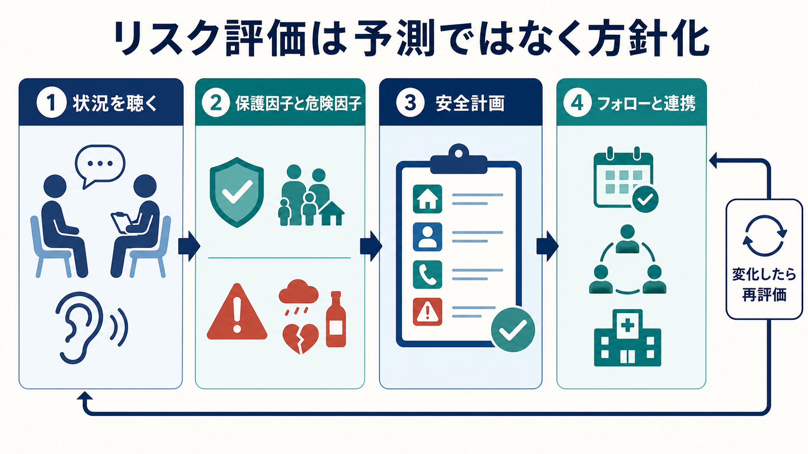
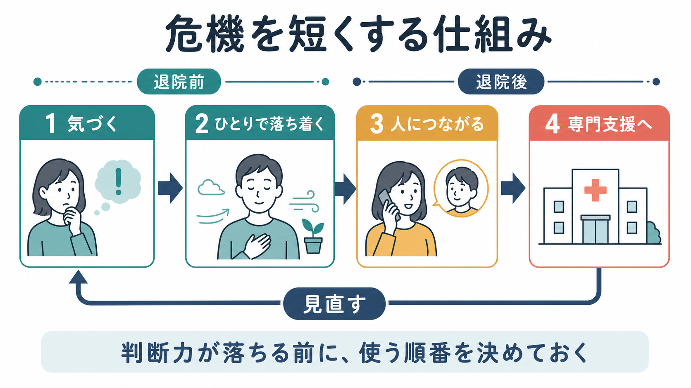
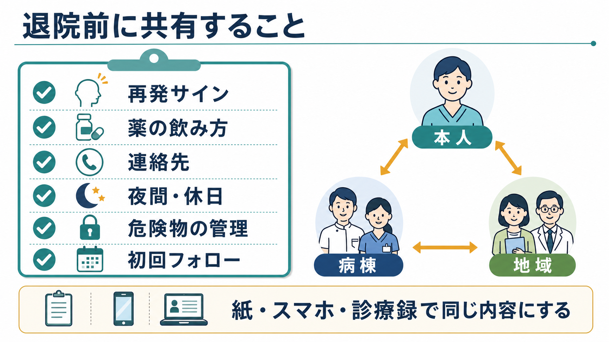

# 退院時の安全計画とは何か

## 要点

- 退院時の安全計画は、退院後に調子が崩れたときの「使う順番」を、本人・家族や支援者・病棟・地域チームで共有する短い実用文書である。
- 中核は、再発サイン、本人が試せる対処、支援者への連絡、専門支援への接続、危険物・薬剤の管理、服薬とフォローの確認である[1][2]。
- 退院直後は自殺や再入院につながる危機が起こりやすい時期であり、計画は退院後フォローと一体で使う必要がある[3]。
- 「低・中・高リスク」と分類することが目的ではない。NICE は自傷後の将来リスク予測や退院判断にリスク尺度・一括リスク層別化を使わないよう勧め、ニーズと安全を中心にした定式化を求めている[4]。
- 医療内容を本人に押しつける書類ではなく、本人の言葉で書き、必要時に本人が持ち出せる形にする。

## この記事で答える問い

退院前に「安全計画を立てましょう」と言うと、しばしば自殺危機だけを想定した文書、あるいは医療者側の免責書類のように受け取られる。しかし臨床で必要なのは、退院後の生活のなかで再発サイン・服薬のつまずき・孤立・夜間休日の危機が起きたとき、誰が何を見て、どこへつなぐかを具体化することである。

この記事では、[[安全計画とは何か]]を退院場面に絞り、[[自殺リスクへの危機対応とは何か]]、[[自殺未遂後の再企図予防とは何か]]、[[薬物療法のアドヒアランスをどう支えるか]]と接続しながら整理する。

## まず結論

退院時の安全計画は、「退院後に問題が起きたら連絡してください」という一般的説明を、行動可能な順番に変換する方法である。退院前に、本人の早期サイン、服薬・睡眠・生活リズムの弱点、相談先、夜間休日の連絡先、危険物や過量服薬リスクへの対応、初回フォロー予定を一枚の計画にまとめる。

ポイントは、危機時には判断力・記憶・問題解決能力が落ちやすいという前提に立つことである。落ち着いている退院前に手順を決め、紙、スマートフォン、診療録、家族・地域支援者が参照する計画の内容をそろえておく。VA の安全計画アプリも、危機時には明晰に考えにくいため、 distress が低いときに計画を作ることを強調している[2]。

## 背景

精神科退院後は、入院中の保護的環境から生活環境へ戻る移行期である。症状が完全に消えたから退院するとは限らず、睡眠、対人ストレス、金銭、住居、服薬管理、孤立、物質使用などの負荷が再び前景化する。JAMA Psychiatry のメタ解析では、精神科施設退院後の自殺率は全体で高く、とくに退院後3か月以内と、自殺念慮・自殺行動を理由に入院した人で高いことが示されている[3]。

ただし、退院後の危機を「高リスク者だけの問題」と見ると実務を誤る。退院後自殺率は集団として高い一方で、個々の危機は生活環境、支援の切れ目、症状変動、物質使用、服薬中断などの組み合わせで生じる。したがって安全計画は、予測のためのラベルではなく、本人のニーズと環境に合わせた支援設計として位置づける[3][4]。

NICE の退院移行ガイドラインも、退院計画を本人・家族・支援者と協働して行い、ケアプランには再発サイン、危機時の行き先、連絡先、薬剤情報、治療・支援計画、レビュー日を含め、退院後支援者に共有するよう求めている[5]。

## 基本概念

### 安全計画は「優先順位つきの行動リスト」である

Stanley と Brown の Safety Planning Intervention は、自殺危機を緩和する短時間介入として提案された。基本要素は、警告サイン、本人だけでできる対処、気をそらせる人や場所、支援を頼める人、専門家・機関、致死的手段へのアクセス制限である[1]。VA のワークシートも同様に、本人と支援者が一緒に作成し、本人が持ち、診療録にも複製を残す形式を採っている[2]。

退院時には、これに次の要素を重ねる。

| 領域 | 退院時に具体化する内容 |
|---|---|
| 再発サイン | 睡眠短縮、食欲低下、焦燥、幻聴の増悪、活動量の急変、物質使用、孤立など本人固有のサイン |
| 服薬 | 薬剤名、用量、飲む時間、変更点、残薬、頓服の使い方、飲み忘れ時に相談する先 |
| 支援先 | 家族、訪問看護、相談支援、地域チーム、主治医、薬局、職場・学校の窓口 |
| 危機時対応 | 夜間休日、救急受診、地域の危機対応窓口、緊急連絡の順番 |
| 環境調整 | 過量服薬につながる薬剤量、刃物・紐・火器などの管理、飲酒・薬物使用のリスク |
| フォロー | 初回外来、訪問、電話確認、ケアプラン見直し日 |

### 退院時の計画はケアプランと別物ではない

安全計画は、ケアプランの一部として機能する。ケアプランが生活・治療・福祉全体を扱う地図だとすれば、安全計画は「危機時に最初に開く手順書」である。退院サマリー、薬剤情報、危機時連絡先、家族への説明、地域チームへの申し送りと内容が食い違うと、危機時に使えない。

NICE の医薬品最適化ガイドラインは、移行時に薬剤情報を本人・家族・ケア提供者間で完全かつ正確に共有し、薬剤名、用量、タイミング、変更理由、最終投与、モニタリング、服薬支援の必要性などを含めるよう勧めている[6]。退院時安全計画の服薬欄は、この薬剤コミュニケーションの臨床的な利用先である。

## 仕組み

退院時の安全計画が働く仕組みは、危機を「予測して当てる」ことではなく、危機が始まったときの遅れを短くすることにある。

1. **早期サインに名前をつける。**  
   「なんとなく不安」ではなく、「2晩眠れない」「食事が1日1回になる」「返信ができなくなる」など、本人と支援者が同じものを見られるサインにする。

2. **ひとりでできる対処を短く書く。**  
   深呼吸、シャワー、散歩、音楽、刺激を減らす、服薬カレンダーを見るなど、数分から数十分で始められる行動にする。危機時に長い心理教育は読めない。

3. **人につながる順番を決める。**  
   話題をそらす相手、状況を説明して助けを頼む相手、専門職の順番を分ける。Stanley-Brown 型の計画では、社会的気晴らしと、危機解決を助ける家族・友人を分けている[1]。

4. **専門支援と夜間休日の経路を明記する。**  
   主治医だけでなく、外来時間外、地域窓口、救急受診、緊急時の移動手段を確認する。退院後フォローは、通常7日以内、自殺リスクが同定されている場合は48時間以内のフォローが NICE で勧められている[5]。

5. **危険物・薬剤量を本人と協働して調整する。**  
   自傷や過量服薬の手段になりうるものへのアクセスを、本人の尊厳と自律を保ちながら減らす。NICE の自傷ガイドラインも、安全計画に致死的手段へのアクセス制限を含めるよう述べている[4]。

## 図解

退院前の共有では、内容の網羅性よりも「危機時に誰が見ても同じ行動に移れること」を優先する。本人用の言葉、家族・支援者用の連絡先、医療者用の記録が別々の内容になると、夜間や休日に迷いが生じる。

実務上は、次の確認が使いやすい。

| 確認項目 | 退院前の問い |
|---|---|
| 本人の言葉 | 本人は、この計画を自分の言葉として説明できるか |
| 連絡先 | 電話番号、受付時間、夜間休日の代替先は書かれているか |
| 服薬 | 退院処方、変更点、残薬、薬局、飲み忘れ時の相談先が一致しているか |
| 家族・支援者 | どこまで共有するか、本人の同意と例外的な安全配慮を整理したか |
| 初回フォロー | 外来、訪問、電話、地域支援の初回日時が決まっているか |
| 見直し | 退院後に計画を更新するタイミングが決まっているか |

## 臨床・研究との接続

### 自殺予防との接続

安全計画型介入のメタ解析では、対照条件と比べて自殺行動の相対リスクが低下した一方、自殺念慮そのものへの有意な効果は確認されなかった[7]。これは臨床的には重要である。安全計画は「死にたい気持ちを消す」介入ではなく、危機時の行動選択を増やし、支援接続までの時間を短くする介入として理解する方がよい。

Stanley らの救急部門研究では、安全計画と構造化フォロー電話を組み合わせた介入が、通常ケアと比べて6か月以内の自殺行動を減らし、外来精神医療への接続を高めたと報告されている[8]。退院時安全計画でも、計画作成だけでなく、退院後に計画を見直す電話・訪問・外来が効果の一部を担う。

### 再発予防との接続

退院時の安全計画は、自殺危機が前面にない場合にも有用である。統合失調症、双極症、うつ病、物質使用症、摂食障害、パーソナリティ関連の危機では、悪化の早期サインが本人と周囲で異なることが多い。本人は「大丈夫」と感じていても、家族は睡眠短縮や支出増加に気づくかもしれない。逆に家族が気づかない孤立や希死念慮を、本人だけが知っている場合もある。

安全計画は、[[ケースフォーミュレーションとは何か]]で整理した個別の悪循環を、退院後の観察点と対処に落とし込む橋渡しになる。診断名だけで項目を決めるのではなく、「この人では何が悪化の始まりになりやすいか」を書く。

### 服薬支援との接続

服薬欄は、単に「処方どおり内服」と書く欄ではない。退院時には、入院前と処方が変わっている、残薬が家にある、薬局が複数ある、眠気や体重増加が心配、頓服の使い分けが曖昧、といった問題が起きやすい。NICE は移行時の薬剤情報共有を重視し、本人や家族に適した形式で完全な薬剤リストと変更点を伝えることを勧めている[6]。

安全計画上は、「薬を飲む」だけでなく、「飲めなかったときに誰へ相談するか」「副作用が出たらどこへ連絡するか」「過量服薬リスクがある場合に薬を誰がどの量で管理するか」まで書く。これは[[過量服薬リスクへの対応とは何か]]とも直接つながる。

## よくある誤解

### 誤解1: 安全計画があれば安全である

安全計画はリスクをゼロにする文書ではない。退院後フォロー、薬剤調整、家族・地域支援、住居や経済の支援、緊急時対応と一体で使う。計画があっても、本人が読めない、連絡先が古い、夜間に使えない、家族が知らない場合は機能しない。

### 誤解2: リスク評価で低リスクなら計画はいらない

退院後の危機は、単一のリスク尺度で十分に予測できない。NICE は自傷後の将来リスク予測や退院判断にリスク尺度・一括リスク層別化を使わないよう勧めている[4]。安全計画は「高リスク者のためだけの特別対応」ではなく、退院移行の標準的な支援設計として考える。

### 誤解3: 家族に全部共有すればよい

共有は重要だが、本人の同意、守秘、家族関係の安全性、虐待や支配のリスクを考える必要がある。共有する相手、共有する内容、緊急時に例外的に伝える条件を分けて書く。関連して、[[守秘義務と安全確保はどう両立するか]]の論点が生じる。

### 誤解4: 書式を埋めれば完成である

安全計画は書式ではなく、共同作業である。本人が「この言葉なら使える」と思える表現にし、退院後の初回フォローで実際に使えたか、使えなかった理由は何かを見直す。退院前に作った計画は暫定版であり、地域生活で試して更新する。

## 関連ノート

- [[安全計画とは何か]]
- [[クライシスプランとは何か]]
- [[自殺リスクへの危機対応とは何か]]
- [[自殺未遂後の再企図予防とは何か]]
- [[自傷行為への初期対応はどう行うか]]
- [[過量服薬リスクへの対応とは何か]]
- [[薬物療法のアドヒアランスをどう支えるか]]
- [[ケースフォーミュレーションとは何か]]
- [[守秘義務と安全確保はどう両立するか]]

MOC 更新候補: [[MOC｜臨床実践・治療]]、[[MOC｜精神医学]]、[[MOC｜薬物療法]]

## 理解チェック

1. 退院時安全計画と通常のケアプランは、どこが重なり、どこが違うか。
2. 本人の再発サインを「観察可能な行動」に直すと、どのような書き方になるか。
3. 安全計画に服薬情報を入れるとき、薬剤名以外に何を確認すべきか。
4. リスク分類だけで退院後の安全を判断してはいけない理由は何か。
5. 退院後の初回フォローで、安全計画のどの部分を見直すべきか。

## 未解決問題

- 安全計画単体の効果と、フォロー電話・訪問・外来接続を含む複合介入の効果を、実臨床でどのように分けて評価するか。
- 自殺危機だけでなく、躁状態、精神病症状、摂食障害、物質使用、認知症、発達特性を含む退院安全計画をどう個別化するか。
- 紙、スマートフォン、電子カルテ、地域支援システムの間で、本人の同意と守秘を保ちながら最新情報を共有する仕組みをどう作るか。
- 家族支援が乏しい人、住居不安定、孤立、DV・虐待リスクがある人に対して、誰を「支援先」として設計するか。

## 参考文献

[1] Stanley, B., & Brown, G. K. (2012). Safety Planning Intervention: A brief intervention to mitigate suicide risk. *Cognitive and Behavioral Practice, 19*(2), 256-264. https://doi.org/10.1016/j.cbpra.2011.01.001

[2] U.S. Department of Veterans Affairs. Safety Plan App / Safety Plan Quick Guide and Worksheet. https://mobile.va.gov/app/safety-plan

[3] Chung, D. T., Ryan, C. J., Hadzi-Pavlovic, D., Singh, S. P., Stanton, C., & Large, M. M. (2017). Suicide rates after discharge from psychiatric facilities: A systematic review and meta-analysis. *JAMA Psychiatry, 74*(7), 694-702. https://doi.org/10.1001/jamapsychiatry.2017.1044

[4] National Institute for Health and Care Excellence. (2022). *Self-harm: assessment, management and preventing recurrence* (NG225). https://www.nice.org.uk/guidance/ng225

[5] National Institute for Health and Care Excellence. (2016). *Transition between inpatient mental health settings and community or care home settings* (NG53). https://www.nice.org.uk/guidance/ng53

[6] National Institute for Health and Care Excellence. (2015). *Medicines optimisation: the safe and effective use of medicines to enable the best possible outcomes* (NG5). https://www.nice.org.uk/guidance/ng5

[7] Nuij, C., van Ballegooijen, W., de Beurs, D., Juniar, D., Erlangsen, A., Portzky, G., O'Connor, R. C., Smit, J. H., Kerkhof, A., & Riper, H. (2021). Safety planning-type interventions for suicide prevention: Meta-analysis. *The British Journal of Psychiatry, 219*(2), 419-426. https://doi.org/10.1192/bjp.2021.50

[8] Stanley, B., Brown, G. K., Brenner, L. A., Galfalvy, H. C., Currier, G. W., Knox, K. L., Chaudhury, S. R., Bush, A. L., & Green, K. L. (2018). Comparison of the Safety Planning Intervention with follow-up vs usual care of suicidal patients treated in the emergency department. *JAMA Psychiatry, 75*(9), 894-900. https://doi.org/10.1001/jamapsychiatry.2018.1776
