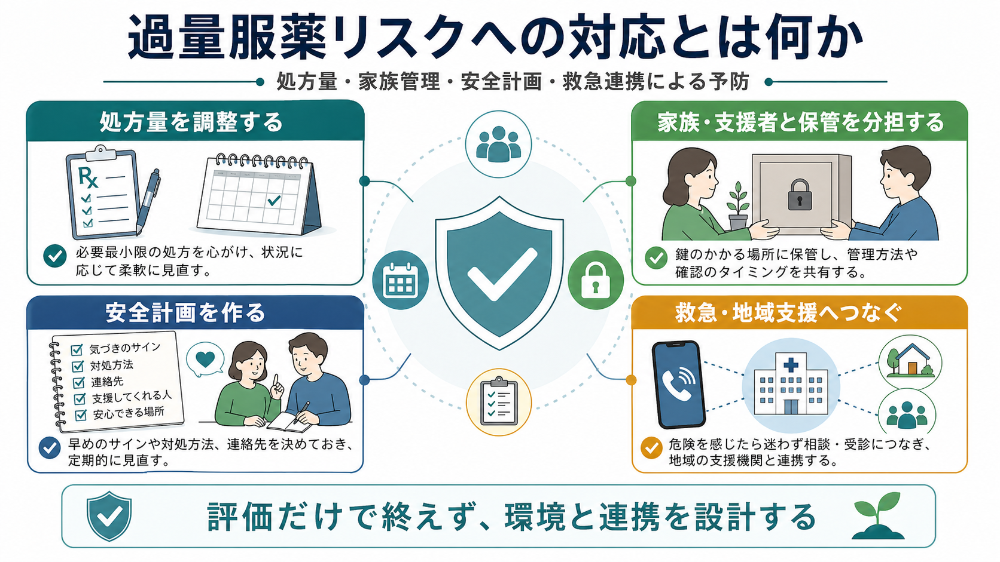
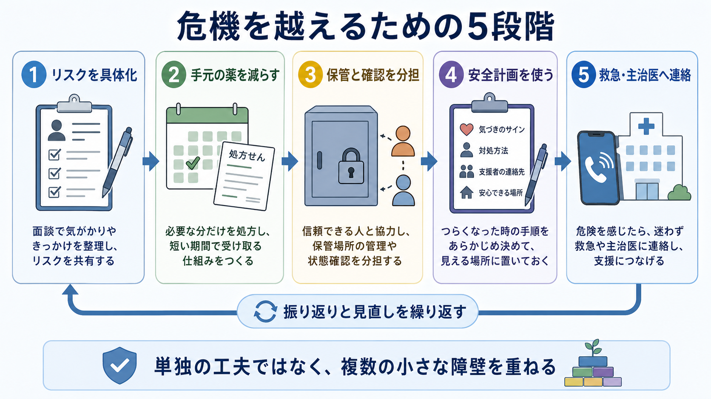

# 過量服薬リスクへの対応とは何か

## 要点

- 過量服薬リスクへの対応は、「危険な人を見つける」だけではなく、危機の最中に大量の薬へアクセスしにくくし、相談・受診へつながる時間を作る実践である。
- 対応の柱は、処方量を小さくすること、薬剤の毒性と相互作用を見直すこと、家族・支援者と保管を分担すること、[[安全計画とは何か|安全計画]]を作ること、救急・主治医・地域支援へつなぐことである[1][2]。
- 自傷・自殺リスクがある人への処方では、過量時毒性、本人が利用できる薬、同居者の薬、市販薬、アルコールや他物質との併用を確認する必要がある[1]。
- 安全計画は「しない約束」ではなく、警告サイン、対処行動、連絡先、専門機関、手段へのアクセス低減を本人と共同で書面化する道具である[2][4]。
- 本記事は教育・研究目的の概説であり、個別の診断、治療、処方変更、緊急対応を指示するものではない。差し迫った危険がある場合は、地域の救急、医療機関、相談窓口につなぐことが優先される。

## この記事で答える問い

1. 過量服薬リスクへの対応は、単なる処方制限と何が違うのか。
2. 処方量、家族管理、安全計画、救急連携はどのように組み合わさるのか。
3. 本人の自己決定や治療継続を尊重しながら、薬へのアクセスをどう扱うのか。
4. 外来、救急、退院前支援では何を確認すべきか。

## まず結論

過量服薬リスクへの対応とは、薬を「出すか、出さないか」だけで決めるものではない。本人が必要な治療を受けられる状態を保ちながら、危機が高まった短い時間に大量服薬へ進みにくい環境を作り、早めに人とサービスへつながる経路を短くすることである。

そのためには、[[薬物療法のリスクベネフィットをどう考えるか|薬物療法のリスクベネフィット]]、[[自殺リスク評価では何を聞くべきか|自殺リスク評価]]、薬剤の毒性、家庭内の保管、本人の同意、家族・支援者の負担、救急受診の基準を一つの計画として扱う必要がある。NICE の self-harm ガイドラインは、過量服薬を含む自傷後の安全処方として、薬剤の毒性、手元にある薬、同居者や周囲の薬、処方量、不要薬の返却、複数処方者間の情報共有を重視している[1]。

## 背景

過量服薬は、[[薬物過量服薬とは何か|薬物過量服薬]]として救急医療に現れるだけでなく、外来処方、睡眠、不安、抑うつ、衝動性、孤立、アルコール使用、家庭内の薬剤保管とつながっている。したがって、対応は薬理学だけでも精神科面接だけでも足りない。

自傷後の支援では、身体的安全の確保と並行して、心理社会的評価、今後の支援計画、家族・支援者との連携、薬剤レビューを行う必要がある[2][3]。日本の自殺未遂者ケアガイドラインも、救急外来での情報収集、企図の有無、現在の希死念慮、危険因子、退院前の支援体制、キーパーソン、精神科やソーシャルワークとの連携を整理している[3]。

また、自殺予防における手段へのアクセス低減は、衝動や苦痛を完全に消す介入ではない。危機のピークを越えるための「時間」と「接触」を増やす介入である。手段制限のレビューでは、地域で多い手段や文化的文脈に応じたアクセス低減が自殺予防の重要な柱とされる[6]。薬剤では、その考え方を処方量、保管、調剤、家族支援、不要薬回収に翻訳する。

## 基本概念

### 過量時毒性

同じ「薬」でも、過量時の危険性は大きく異なる。三環系抗うつ薬、オピオイド、鎮静薬、リチウム、抗不整脈薬、糖尿病薬などは、薬剤ごとに問題となる臓器や重症化の速さが異なる。NICE のうつ病ガイドラインは、自殺リスクが高い人へ抗うつ薬を処方する際、過量時毒性を考慮し、三環系抗うつ薬を routine に開始しないよう述べている[7]。この点は [[三環系抗うつ薬とは何か]] とも接続する。

### 手元の薬へのアクセス

過量服薬リスクは、その人に処方された薬だけで決まらない。同居者の薬、以前の余り薬、市販薬、オンライン購入薬、複数医療機関からの処方も含めて、実際に手に取れる薬を確認する必要がある[1]。ここで大切なのは、本人を疑うためではなく、危機時に本人を守る環境を一緒に設計するために確認することである。

### 安全処方

安全処方とは、治療を控えることではなく、必要な治療を継続しやすくしながら、過量時の害を下げる処方設計である。具体的には、処方日数を短くする、少量ずつ受け取る、過量時毒性の低い選択肢を検討する、相互作用を避ける、複数処方者で情報共有する、不要薬を返却する、薬剤師と連携する、といった方法が含まれる[1]。

### 家族・支援者との薬剤管理

家族管理は、本人から薬を取り上げることと同義ではない。本人の同意と尊厳を前提に、鍵のかかる場所に保管する、服薬確認を誰が行うかを決める、夜間や週末の連絡先を共有する、支援者の負担が過大にならないようにする、といった分担である。本人が家族と安全に協力できない場合は、訪問看護、薬局、主治医、地域支援者など別の管理方法を検討する。

## 仕組み

### 1. リスクを具体化する

まず、過量服薬のリスクを「あり・なし」で終わらせず、どの条件で高まるかを具体化する。たとえば、不眠が続く、飲酒が増える、処方薬が手元に多い、強い焦燥がある、孤立している、過去の過量服薬後に受診が途切れた、などである。[[精神疾患と過量服薬はどう関係するのか|精神疾患と過量服薬]]の背景には、症状だけでなく生活上の危機や支援の途切れがある。

救急場面では、薬剤名、服薬時刻、推定量、併用物質、意識・呼吸循環、入手経路、再入手可能性を確認する。外来では、直近の希死念慮、計画性、衝動性、睡眠、物質使用、支援者、処方の受け取り方を確認する。

### 2. 手元の薬を少なくする

手元の薬が多いほど、危機時に大量服薬へ進む障壁は低くなる。NICE の安全処方レビューは、自傷歴がある人に処方する際、処方量を制限することを重要な原則としている[1]。ただし、処方量を小さくすると、通院・調剤の負担、費用、仕事や学業との調整、服薬継続のしにくさが増えることがある。安全性とアドヒアランスを両方見て、本人と共有意思決定を行う必要がある。

実務上は、短期処方、分割調剤、家族や薬局との受け取り調整、訪問看護での確認、残薬整理などが候補になる。薬を急に中止することが安全とは限らないため、処方変更は主治医や処方者と相談して行う。

### 3. 保管と確認を分担する

保管の工夫は、危機が高まった瞬間に「すぐ大量に飲める」状態を避けるために行う。本人の同意が得られる範囲で、支援者が保管する、鍵のかかる場所に置く、1回分ずつ出す、残薬を定期的に確認する、不要薬を薬局へ返却する、といった方法を検討する。

ここで重要なのは、家族に全責任を負わせないことである。家族が疲弊している、本人との関係が不安定である、暴力や支配がある、家族も薬剤管理に不安がある場合、家族管理はかえって危険や対立を増やすことがある。[[精神科救急では何を優先するべきか|精神科救急]]や地域支援と組み合わせ、複数人で負担を分散する。

### 4. 安全計画を作る

安全計画は、危機が高まったときに参照できる短い行動手順である。NICE は、安全計画に、手段、警告サイン、個別化された対処、気をそらせる人や場所、支援してくれる家族・友人、専門機関や時間外連絡先、手段へのアクセス低減を含めることを勧めている[2]。

Stanley らの研究では、救急部門で安全計画介入と構造化された電話フォローを組み合わせた群は、通常ケアより6か月後の自殺関連行動が少なく、外来治療への関与も高かった[4]。安全計画は単独で万能ではないが、処方量、保管、フォローアップ、救急連絡先と結びつくと、危機時に使える具体的な道具になる。

### 5. 救急・主治医・地域支援へつなぐ

過量服薬リスクが高い場面では、本人が自分で予約を取り、適切な窓口を探し、危険を説明することが難しいことがある。そのため、主治医、救急外来、精神科救急、薬局、訪問看護、家族、地域相談をあらかじめつないでおく必要がある。

救急医療では、身体的評価と治療を優先しつつ、意識が回復し対応可能になった段階で心理社会的評価と退院前計画を行う。日本の自殺未遂者ケアガイドラインは、退院前に自殺危険性の再評価、キーパーソンと支援体制、かかりつけ精神科との連携を確認することを挙げている[3]。退院後の孤立を避けることは、[[自殺未遂者支援では何を行うのか|自殺未遂者支援]]の中心でもある。

## 図解

| 対応の柱 | 目的 | 実務上の確認 |
|---|---|---|
| 処方量の調整 | 危機時に一度に使える薬を減らす | 短期処方、分割調剤、受け取り頻度、費用と負担 |
| 薬剤レビュー | 過量時毒性と相互作用を下げる | 高毒性薬、併用薬、アルコール、市販薬、同居者の薬 |
| 家族・支援者管理 | 保管と見守りを分担する | 同意、鍵付き保管、確認役、支援者負担、関係性の安全 |
| 安全計画 | 危機時の行動手順を短くする | 警告サイン、対処、連絡先、救急基準、手段アクセス低減 |
| 救急・地域連携 | 受診・相談への接続を確実にする | 主治医、救急、薬局、訪問看護、相談機関、退院後フォロー |

## 臨床・研究との接続

臨床では、過量服薬リスク対応を「治療制限」としてではなく、治療を継続するための安全設計として説明することが重要である。薬を少量ずつ受け取ることや家族管理は、本人にとって恥や監視として体験されることがある。そのため、「信頼していないから」ではなく、「危機の短い時間を越えるために、複数の障壁を重ねる」と説明し、本人の希望や生活条件を反映させる。

研究上は、安全計画や救急後フォローアップの効果は示されつつあるが、薬剤保管や処方量調整だけを切り出した高品質な介入研究は限られている。NICE の安全処方レビューでも、直接該当する有効性研究は見つからず、推奨は委員会の知識と臨床経験に基づいている[1]。したがって、処方量制限を一律のルールにするより、本人のリスク、薬剤の毒性、支援体制、治療継続への影響を組み合わせて判断する必要がある。

救急後支援の研究では、退院後の電話フォロー、ケア調整、治療継続支援などを含む介入が再企図やフォローアップ接続に関わることが示されている[5]。日本の ACTION-J 研究でも、救急部門に入院した自殺企図者に対する積極的ケースマネジメントが検討され、通常ケア強化群と比較して早期の再企図抑制が報告された[8]。過量服薬リスク対応も、薬剤管理だけでなく、こうした継続接触の仕組みと結びつけて評価する必要がある。

日本では、救急、精神科、薬局、訪問看護、自治体、保健所、家族支援が制度上分かれやすい。過量服薬リスク対応は、これらを「連携してください」と一般論で述べるだけでは実装されない。誰が薬を確認するか、誰が次回予約を取るか、夜間に何番へ連絡するか、救急受診の基準を誰が説明するかを、具体的に決める必要がある。

## よくある誤解

### 誤解1：薬を減らせばリスク対応は完了する

薬を減らすことは有効な場面があるが、それだけでは不十分である。症状悪化、離脱、治療中断、孤立、飲酒、生活問題が残れば、別の形で危機が高まる。薬剤レビューと同時に、安全計画、支援者、受診経路を整える必要がある。

### 誤解2：家族が薬を管理すれば安全である

家族管理は有用な場合があるが、家族の負担や関係性の安全を評価しなければならない。本人の同意がないまま一方的に管理すると、対立、隠し薬、受診中断につながることがある。家族だけに任せず、医療者、薬局、訪問看護、地域支援を組み合わせる。

### 誤解3：安全計画は「自殺しない約束」である

安全計画は約束や念書ではない。危機時に使う行動手順であり、本人が実際に参照できる形式で作る。警告サイン、対処、相談先、専門機関、手段へのアクセス低減を具体化する点が重要である[2]。

### 誤解4：過量服薬リスクがある人には薬物療法を使ってはいけない

そうではない。うつ病、不安症、双極性障害、精神病症状、不眠などの治療がリスク低減に必要な場合もある。重要なのは、過量時毒性、処方量、受け取り方、フォロー頻度、支援体制を含めて治療を設計することである[7]。

## 関連ノート

- [[薬物過量服薬とは何か]]
- [[精神疾患と過量服薬はどう関係するのか]]
- [[自殺リスク評価では何を聞くべきか]]
- [[安全計画とは何か]]
- [[自殺未遂者支援では何を行うのか]]
- [[精神科救急では何を優先するべきか]]
- [[薬物療法のリスクベネフィットをどう考えるか]]
- [[三環系抗うつ薬とは何か]]
- [[自殺対策基本法とは何か]]

MOC更新候補: `content/00_MOC/` 配下の医療安全、危機対応、精神科救急、自殺予防、薬物療法関連 MOC。並列ジョブとの競合を避けるため、本記事では MOC 本体は更新しない。

## 理解チェック

1. 過量服薬リスク対応で、処方量の調整だけでは不十分な理由を説明せよ。
2. 安全処方で確認すべき「本人に処方された薬以外」の薬剤アクセスを3つ挙げよ。
3. 家族・支援者による薬剤管理を行う前に確認すべき条件は何か。
4. 安全計画に含めるべき要素を5つ挙げよ。
5. 救急退院前に、主治医・地域支援へつなぐために確認すべき情報は何か。

## 参考文献

[1] National Institute for Health and Care Excellence. Evidence review for safer prescribing: Self-harm: assessment, management and preventing recurrence. NICE Guideline NG225, Evidence review O. 2022. https://www.ncbi.nlm.nih.gov/books/NBK588195/

[2] National Institute for Health and Care Excellence. Self-harm: assessment, management and preventing recurrence. NICE Guideline NG225. 2022. https://www.nice.org.uk/guidance/ng225

[3] 日本臨床救急医学会. 自殺未遂者ケアガイドライン 自殺未遂患者への対応 救急外来（ER）・救急科・救命救急センタースタッフのための手引き. 2009. 厚生労働省掲載. https://www.mhlw.go.jp/stf/seisakunitsuite/bunya/hukushi_kaigo/seikatsuhogo/jisatsu/houkoku_sonota.html

[4] Stanley B, Brown GK, Brenner LA, et al. Comparison of the Safety Planning Intervention With Follow-up vs Usual Care of Suicidal Patients Treated in the Emergency Department. JAMA Psychiatry. 2018;75(9):894-900. https://doi.org/10.1001/jamapsychiatry.2018.1776

[5] Doupnik SK, Rudd B, Schmutte T, et al. Association of Suicide Prevention Interventions With Subsequent Suicide Attempts, Linkage to Follow-up Care, and Depression Symptoms for Acute Care Settings: A Systematic Review and Meta-analysis. JAMA Psychiatry. 2020;77(10):1021-1030. https://doi.org/10.1001/jamapsychiatry.2020.1586

[6] Nevarez-Flores AG, Pandey V, Perez Angelucci A, Neil AL, McDermott B, Castle D. Means Restriction for Suicide Prevention: An Umbrella Review. Acta Psychiatr Scand. 2025;151(6):653-667. https://doi.org/10.1111/acps.13783

[7] National Institute for Health and Care Excellence. Depression in adults: treatment and management. NICE Guideline NG222. 2022. https://www.nice.org.uk/guidance/ng222

[8] Kawanishi C, Aruga T, Ishizuka N, et al. Assertive case management versus enhanced usual care for people with mental health problems who had attempted suicide and were admitted to hospital emergency departments in Japan (ACTION-J): a multicentre, randomised controlled trial. The Lancet Psychiatry. 2014;1(3):193-201. https://doi.org/10.1016/S2215-0366(14)70259-7

## 未解決問題

- 処方量制限、分割調剤、薬局連携、家族保管のどの組み合わせが、どの患者群で最も有効か。
- 本人の自己決定と家族・支援者による安全管理を、急性期の限られた時間でどのように合意形成するか。
- 地域差の大きい日本の医療・福祉資源の中で、救急から外来・薬局・訪問看護へつなぐ標準的な実装モデルをどう作るか。
- デジタル安全計画や服薬管理アプリを、プライバシーと支援アクセスの両方を守りながらどう使うか。
