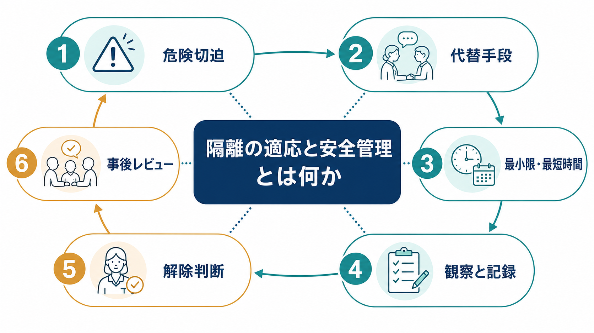
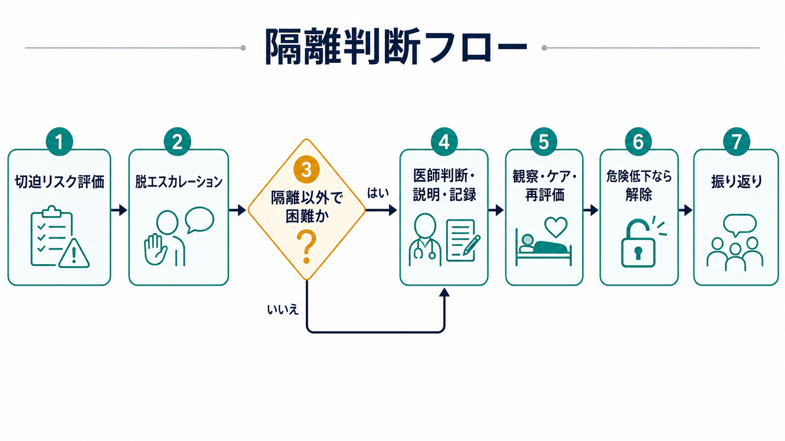
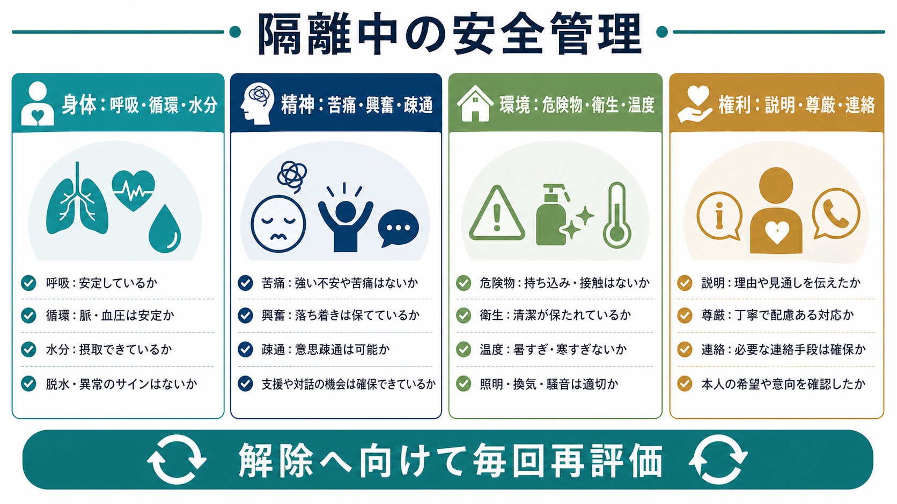

# 隔離の適応と安全管理とは何か

## 要点

- 精神科における隔離は、本人または周囲への危険が著しく高く、隔離以外では危険回避が著しく困難なときに限って検討される、強い制限性をもつ介入である[1][2]。
- 適応判断の中心は「疾患名」ではなく、切迫した自傷・自殺、他害、著しい興奮、病棟内の安全を保てない行動、身体合併症への対応など、現在のリスクと代替手段の限界である[2][4]。
- 隔離中の安全管理は、観察、会話、身体状態、精神状態、環境、衛生、説明、記録、解除に向けた再評価を同時に扱う。
- 隔離は治療そのものというより、危機を一時的に封じ込めるための安全介入である。WHO や SAMHSA は、隔離・拘束を最後の手段とし、組織的に減らす方向を強調している[5][6]。
- 解除判断は「静かになったか」だけではなく、切迫リスクが低下し、より制限の少ない方法で安全を保てるかを、本人の状態と病棟環境の両方から判断する。

## この記事で答える問い

1. 精神科隔離は、どのような条件で適応になりうるのか。
2. 隔離中には何を観察し、何を記録する必要があるのか。
3. 解除判断と事後レビューでは、何を確認すればよいのか。

## まず結論

隔離は、[[隔離とは何か]]で扱う行動制限の一形態であり、自由を大きく制限する。したがって「危ないかもしれないから念のため」ではなく、切迫した危険、代替手段の不十分さ、医療または保護としての必要性、最小限・最短時間、継続的観察、診療録への記載、解除に向けた再評価をそろえて考える必要がある[1][2]。

このノートは教育・研究目的の整理であり、個別事例の診断、処遇決定、隔離指示を代替するものではない。実際の運用は、精神保健福祉法、関連告示、各施設の手順、精神保健指定医・主治医・看護チームの評価に従う。

## 背景

精神科病棟では、強い興奮、幻覚妄想に基づく切迫行動、重い抑うつや混乱に伴う自傷、他者への暴力、器物破損、身体合併症への処置困難などが重なることがある。こうした場面では、本人の尊厳と自由を守りながら、本人・他患者・職員の安全を同時に守る必要がある。

日本の告示では、法上の「患者の隔離」は、本人の意思では内側から出られない部屋へ一人で入室させ、他の患者から遮断する行動制限で、12時間を超えるものとして定義されている[1]。一方、12時間を超えない場合でも、隔離の要否は医師が判断すべきものとされる[2]。つまり、時間の長短にかかわらず、隔離は単なる病棟管理ではなく、医療安全・人権・記録責任を伴う介入である。

近年は、隔離・身体的拘束を「やむを得ない場合に使う」だけでなく、組織として最小化する流れが強い。厚生労働省は精神科病院における行動制限最小化に関する情報をまとめ、調査研究やプラットフォームを通じて、病院全体での見直しを促している[3]。これは[[精神科医療における行動制限最小化とは何か]]と直結する論点である。

## 基本概念

### 隔離

隔離とは、本人の意思だけでは出られない閉鎖的環境に一人で入室させ、他の患者から遮断する行動制限である[1]。本人が自ら希望して閉鎖的環境の部屋に入る場合は、法的な意味での隔離とは区別されるが、その場合でも本人の意思による入室であることを明確にする必要がある[2]。

### 適応

告示上、隔離の対象になりうる状態として、他患者との関係や病状経過への著しい悪影響、自殺企図または自傷行為の切迫、他患者への暴力や著しい迷惑行為・器物破損、急性精神運動興奮により一般病室で医療または保護が著しく困難な場合、身体合併症の検査・処置のために必要な場合などが挙げられている[2]。

重要なのは、これらが「隔離してよい理由の一覧」ではなく、「隔離以外によい代替方法がない場合に限って検討される状況」である点である。[[自殺リスク評価では何を聞くべきか]]や[[他害リスク評価では何を見るべきか]]で扱うように、意図、手段、切迫性、過去歴、物質使用、せん妄・身体疾患、保護因子、支援可能性を確認し、リスクを具体的に記述する。

### 最小限・最短時間

隔離は、制裁、懲罰、見せしめのために行ってはならない[2]。NICE も、制限的介入は他の試みが失敗し、自傷他害の可能性がある場合に限るとし、隔離は可能な限り短く、少なくとも定期的に必要性をレビューすることを求めている[4]。臨床的には、隔離開始時点から解除条件を言語化し、継続のたびに「なぜ今も必要か」を問い直す。

## 仕組み

隔離判断は、単一のスイッチではなく、危機評価、代替手段、法的・倫理的要件、観察、解除判断を循環的に回すプロセスである。

### 1. 切迫リスクを具体化する

まず、何が、誰に、どの程度、どれほど近い時間軸で危険なのかを記述する。たとえば「興奮」だけでは不十分であり、殴打、蹴る、頭を打ちつける、首を絞める行為、ガラスを割る、病棟外へ飛び出そうとする、処置中の生命維持に必要なラインを抜くなど、観察可能な行動に落とす。

この段階では、[[精神科救急では何を優先するべきか]]の原則と同じく、意識障害、低酸素、低血糖、感染、薬物・アルコール、頭部外傷、けいれん後、せん妄などの身体要因を見落とさない。隔離が必要に見える行動の背後に、身体救急や薬剤性の問題があることもある。

### 2. 代替手段を試す

隔離前には、可能な範囲でより制限の少ない方法を検討する。声かけ、距離の確保、刺激を減らす、担当者を変える、家族や信頼できる支援者との連絡、場所を移す、本人の希望を聞く、頓用薬、観察強化、個室利用、チームでの脱エスカレーションなどが含まれる。

ただし、代替手段の試行は形式的なチェック欄ではない。切迫した暴力や自殺企図が進行中で、待つことで危険が増す場合には、短時間で判断しなければならない。重要なのは、なぜその時点で代替手段だけでは不十分だったのかを、後から検証できる形で記録することである[2][4]。

### 3. 医師判断、説明、記録を行う

隔離の要否は医師が判断する[2]。隔離を行う場合は、本人に対して理由を知らせるよう努め、隔離を行った事実、理由、開始日時、解除日時を診療録に記載する[2]。これは[[診療録は精神科でどう書くべきか]]の医療安全版であり、後から「必要だったか」「より少ない制限で済んだか」「解除が遅れなかったか」を検討するための材料になる。

本人が説明を理解しにくい状態でも、説明を省略してよいという意味ではない。短く、具体的に、「何が危険で」「何が変われば解除を検討するか」を伝える。権利擁護の観点では、[[精神科入院で患者の権利をどう守るのか]]と合わせて考える必要がある。

### 4. 隔離中の観察とケアを続ける

隔離中は、放置ではなく、定期的な会話等による注意深い臨床的観察と適切な医療・保護が必要である[2]。NICE は、隔離中の観察スケジュールを立て、少なくとも視野内で観察できるよう、訓練された職員を割り当てることを推奨している[4]。

観察の焦点は次のように分けると抜けが少ない。

| 領域 | 見ること | 見落とすと何が起こるか |
|---|---|---|
| 身体 | 呼吸、循環、意識、水分、排泄、疼痛、外傷、発熱、薬剤影響 | 低酸素、脱水、せん妄、急変、身体合併症の悪化 |
| 精神 | 興奮、不安、恐怖、幻覚妄想、疎通、希死念慮、自傷衝動 | 隔離内自傷、パニック、敵意の増悪、解除遅延 |
| 環境 | 危険物、室温、換気、照明、騒音、衛生、トイレ・洗面 | 事故、熱中症・低体温、不快感、感染・尊厳低下 |
| 権利 | 説明、尊厳、文化・宗教的配慮、連絡、希望の確認 | 不信、トラウマ化、権利侵害、治療関係の破綻 |

告示は、隔離中の衛生確保への配慮と、漫然とした隔離を避けるため医師が原則として少なくとも毎日1回診察することも求めている[2]。急速鎮静を併用した場合は、呼吸、血圧、脈拍、意識、水分、体温などの身体モニタリングがさらに重要になる[4]。これは[[身体合併症は精神科診療でなぜ重要なのか]]の具体例でもある。

### 5. 解除条件を繰り返し確認する

解除は「時間が来たから」でも「完全に症状が消えたから」でもない。隔離によって下げようとしていた具体的危険が低下し、観察強化、個室、開放環境での休息、服薬、対話、家族連絡、スタッフ配置など、より制限の少ない方法で安全を保てる見通しが立つかを確認する。

解除前には、本人に何が起きていたと理解しているか、今の不安や怒り、希死念慮・自傷衝動、他害衝動、身体症状、希望する支援を確認する。解除後は、病棟内での刺激、他患者との接触、スタッフの声かけ、薬剤効果、身体状態をしばらく追跡し、再隔離を「失敗」とだけ捉えず、解除条件と環境調整を再検討する。

## 図解

図解としては、上の3枚を次のように読むとよい。

| 図 | 役割 | 読み方 |
|---|---|---|
| 概念地図 | 隔離の全体像 | 適応、代替手段、最小限、観察、解除、レビューを一つの循環として見る。 |
| 判断フロー | 開始から解除まで | 隔離を「開始判断」だけでなく、「再評価して解除へ向かう流れ」として読む。 |
| 安全管理チェック | 隔離中の観察 | 身体・精神・環境・権利を同時に点検する。 |

## 臨床・研究との接続

隔離の臨床的難しさは、短期的な安全確保と、長期的な治療関係・権利擁護が衝突しやすい点にある。隔離をしなければ自傷他害を防げない場面はあるが、隔離そのものが恐怖、怒り、不信、トラウマ反応を強め、次の危機の火種になることもある。

Cochraneレビューは、重い精神疾患の人に対する隔離・拘束の価値を評価する十分な対照研究が見当たらず、重篤な有害影響の報告があるため、代替手段の開発と慎重な検証が必要だと結論づけている[7]。これは「隔離は無効」と単純化する根拠ではなく、「隔離の有効性を自明視しない」ための根拠である。

隔離を減らす研究としては、Safewards が重要である。急性期精神科病棟を対象にしたクラスターランダム化試験では、スタッフと患者の関係、病棟内コミュニケーション、相互理解を改善する複数の介入により、 conflict と containment の発生率が低下した[8]。ここでいう containment には隔離、身体的拘束、特別観察、強制的な投薬などが含まれる。[[精神科で多職種連携はなぜ重要なのか]]や[[精神科におけるチーム医療とは何か]]の視点からは、隔離の適応判断だけでなく、隔離が必要になりにくい病棟文化を作ることが中心課題になる。

## よくある誤解

### 誤解1: 暴れたら隔離する

暴力や器物破損があっても、常に隔離が適応になるわけではない。切迫性、持続性、代替手段、身体疾患、薬物影響、本人の希望、病棟環境を評価する必要がある。隔離は、本人または周囲への危険が著しく高く、隔離以外では回避が著しく困難なときに限られる[2]。

### 誤解2: 隔離室に入れれば安全になる

隔離室は安全を自動的に保証しない。隔離内自傷、脱水、転倒、過鎮静、せん妄、怒りや恐怖の増幅、衛生不良、説明不足による不信が起こりうる。安全管理は「入室」ではなく、観察、ケア、環境、説明、再評価の継続で成り立つ[2][4]。

### 誤解3: 本人が落ち着くまで解除できない

解除条件は「完全に落ち着いたか」ではなく、隔離でしか防げなかった切迫危険が低下し、より制限の少ない方法で安全を保てるかで考える。怒りや不安が残っていても、疎通が回復し、具体的な安全計画が共有でき、観察強化で対応できる場合には解除を検討しうる。

### 誤解4: 隔離は個人の判断技術だけの問題である

隔離の頻度は、患者個人の重症度だけで決まらない。人員配置、スタッフ間連携、病棟構造、ルール運用、説明の仕方、退院支援、患者同士の関係、組織文化が影響する。SAMHSA の Six Core Strategies や WHO QualityRights は、隔離・拘束の削減を、リーダーシップ、データ活用、人材育成、本人参加、デブリーフィングを含む組織課題として扱う[5][6]。

## 関連ノート

- [[隔離とは何か]]
- [[身体拘束とは何か]]
- [[精神科医療における行動制限最小化とは何か]]
- [[精神科入院で患者の権利をどう守るのか]]
- [[精神科救急では何を優先するべきか]]
- [[自殺リスク評価では何を聞くべきか]]
- [[他害リスク評価では何を見るべきか]]
- [[精神科で多職種連携はなぜ重要なのか]]
- [[精神科におけるチーム医療とは何か]]
- [[診療録は精神科でどう書くべきか]]
- [[身体合併症は精神科診療でなぜ重要なのか]]

## MOC更新候補

- `content/00_MOC/MOC｜臨床実践・治療.md` の「医療安全・危機対応」節に追加候補。
- `content/00_MOC/MOC｜司法・制度・地域精神医療.md` の「入院・行動制限・権利擁護」節に追加候補。

## 理解チェック

1. 隔離の適応判断で、「疾患名」よりも優先して記述すべき情報は何か。
2. 隔離前に検討すべき、より制限の少ない代替手段には何があるか。
3. 隔離中の観察を、身体・精神・環境・権利の4領域に分けると、それぞれ何を見るか。
4. 解除判断を「静かになったか」だけで決めると、どのような問題が起こるか。
5. 隔離を減らすために、個人の判断技術以外に病棟・組織として取り組むべきことは何か。

## 参考文献

[1] 厚生労働省. 精神保健及び精神障害者福祉に関する法律第三十六条第三項の規定に基づき厚生労働大臣が定める行動の制限（昭和63年厚生省告示第129号）. https://www.mhlw.go.jp/web/t_doc?dataId=80135000&dataType=0

[2] 厚生労働省. 精神保健及び精神障害者福祉に関する法律第三十七条第一項の規定に基づき厚生労働大臣が定める基準（昭和63年厚生省告示第130号）. https://www.mhlw.go.jp/web/t_doc?dataId=80136000&dataType=0&pageNo=1

[3] 厚生労働省. 精神科病院における行動制限最小化について. https://www.mhlw.go.jp/stf/newpage_33838.html

[4] National Institute for Health and Care Excellence. *Violence and aggression: short-term management in mental health, health and community settings* (NICE guideline NG10). 2015. https://www.nice.org.uk/guidance/ng10

[5] Substance Abuse and Mental Health Services Administration / NASMHPD. *Promoting Alternatives to the Use of Seclusion and Restraint*. https://www.samhsa.gov/sites/default/files/topics/trauma_and_violence/seclusion-restraints-1.pdf

[6] World Health Organization. *Strategies to end seclusion and restraint: WHO QualityRights specialized training: course guide*. 2019. https://www.who.int/publications-detail-redirect/9789241516754

[7] Sailas EES, Fenton M. Seclusion and restraint for people with serious mental illnesses. *Cochrane Database of Systematic Reviews*. 2000;(1):CD001163. https://doi.org/10.1002/14651858.CD001163

[8] Bowers L, James K, Quirk A, Simpson A, Stewart D, Hodsoll J. Reducing conflict and containment rates on acute psychiatric wards: The Safewards cluster randomised controlled trial. *International Journal of Nursing Studies*. 2015;52(9):1412-1422. https://doi.org/10.1016/j.ijnurstu.2015.05.001

## 未解決問題

- 日本の精神科病棟で、隔離の開始・継続・解除判断を標準化しつつ、個別性を損なわない記録様式をどう設計するか。
- 隔離経験者の主観的苦痛、トラウマ反応、治療関係への影響を、医療安全指標にどう組み込むか。
- 人員配置、病棟構造、急性期入院需要、地域支援資源の不足が、隔離頻度にどの程度影響するか。
- 隔離を減らす組織的介入を、日本の制度・病棟文化に合わせてどのように実装し、評価するか。
