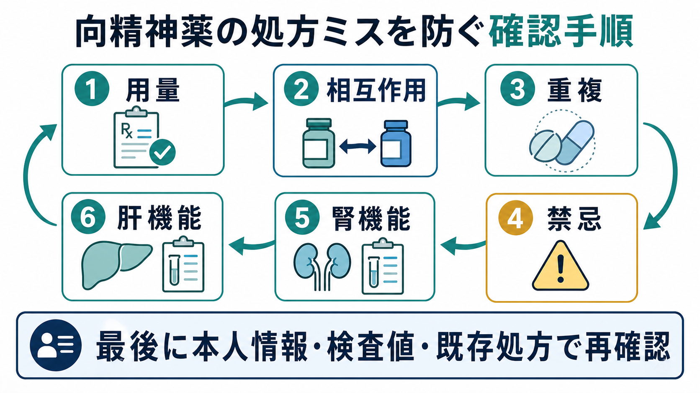
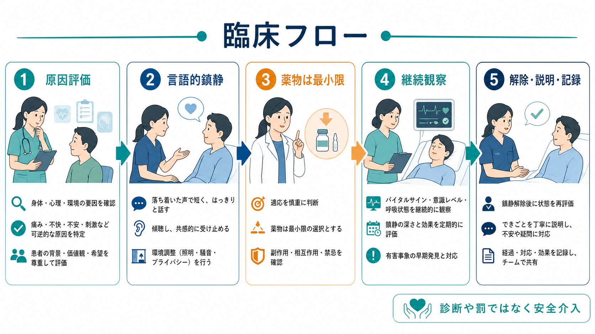
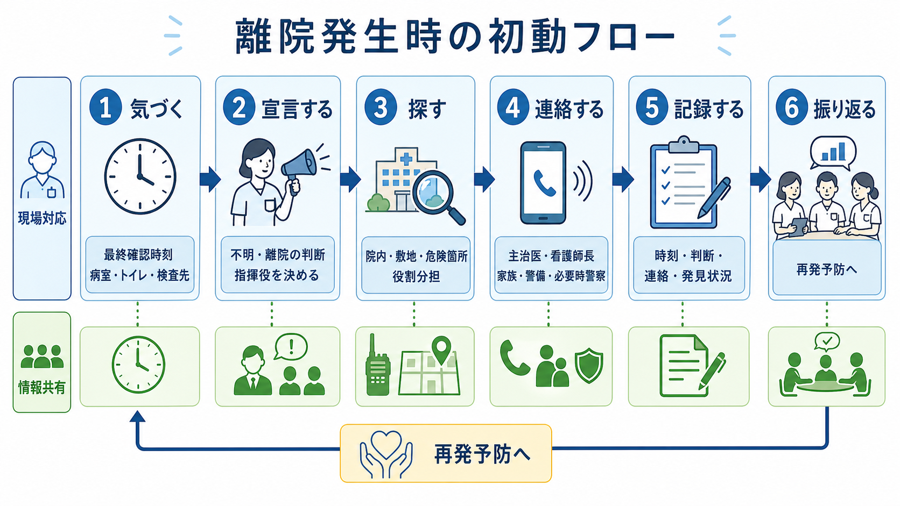

# 離院リスクへの対応とは何か

## 要点

- 離院リスクへの対応とは、患者を「逃げないように監視する」ことではなく、離院したくなる理由、判断能力の揺らぎ、環境のわかりにくさ、チーム内の情報断絶を減らす医療安全実践である。
- 認知症・せん妄では、見当識障害、歩き回り、不安、身体不快、環境変化が重なると、本人にとっては「帰る」「探す」「確認する」という自然な行動が離院につながる[1][2]。
- 精神病症状や強い焦燥、自殺リスクがある場合、離院は治療中断だけでなく、自傷、事故、行方不明、家族・地域への危機として扱う必要がある[3][4]。
- 発生時の対応は、発見の遅れを最小化し、指揮役、捜索範囲、連絡先、記録、再評価を事前に決めておくほど機能する[1]。
- 事後対応では、本人を責めるよりも「なぜ病棟に留まることが本人にとって耐えにくかったのか」を検討し、環境・説明・観察・権限・申し送りを改善する[5][6]。

## この記事で答える問い

このノートでは、[[精神科医療安全の特徴は何か]]、[[自殺リスクへの危機対応とは何か]]、[[安全計画とは何か]]と接続しながら、次の問いに答える。

1. どのような患者・状況で離院リスクが高まるのか。
2. 予防策として、観察、環境調整、本人への説明、家族連携をどう組み合わせるのか。
3. 無断離院が発生したとき、初動で何を確認し、誰へ連絡し、どう記録するのか。
4. 事後レビューを責任追及ではなく再発予防につなげるには何を見るのか。

## まず結論

離院リスクへの対応は、三層で考えると実装しやすい。第一に、入院時・転棟時・外出外泊前後・精神状態変化時に、認知機能、せん妄、精神病症状、自殺念慮、身体不快、薬剤、過去の離院歴、家族・生活上の責任を再評価する。第二に、リスクが上がる前から、わかりやすい案内、見守り、関係づくり、活動、睡眠・疼痛・排泄への対応、家族との情報共有を行う。第三に、離院が疑われた時点で、最終確認時刻、最終目撃場所、服装、身体リスク、自傷他害リスク、持ち物、行き先候補を共有し、院内・敷地・危険箇所を役割分担して捜索する[1]。

重要なのは、離院を単独の「問題行動」と見ないことである。患者側の研究では、精神科病院からの離院は、恐怖、孤立、自由の喪失、役割喪失、満たされないニーズへの反応として語られることがある[5][6]。したがって予防策は、出口管理だけでは不十分であり、本人が納得できる説明、相談できる関係、日中の活動、外部の責任への配慮、治療の見通しを含める必要がある。

## 背景

病院では、患者は治療を受ける人であると同時に、自分の生活史、役割、恐怖、希望をもつ人である。認知症やせん妄では、病棟の構造、検査予定、夜間の物音、スタッフ交代が理解しにくくなり、「ここにいてよい」という感覚が崩れやすい。NICEの認知症ガイドラインは、入院中の認知症患者ではせん妄、移動、痛み、コミュニケーション、意思決定支援、介護者との連携を含めた支援が必要であることを強調している[2]。

精神科・救急・一般病棟では、自殺リスクも離院対応と重なる。NICEの自傷ガイドラインは、将来の自殺や自傷反復を「低・中・高」の層別化だけで予測したり、退院判断に使ったりしないよう勧め、本人のニーズ、脆弱性、心理的・身体的安全を中心に評価することを求めている[3]。The Joint Commissionも、自殺念慮を示した患者では、計画、意図、過去の試み、リスク因子、保護因子を含む評価と、環境リスクへの対応を重視している[4]。

日本では、医療事故情報収集等事業が、医療機関から報告された事故やヒヤリ・ハットを分析し、医療安全対策に役立つ情報として公開している[7][8]。無断離院そのものが常に重大事故になるわけではないが、転落、交通事故、自殺企図、治療中断、家族・地域への影響につながりうるため、報告・分析・再発防止の対象として扱うべき事象である。

## 基本概念

### 離院・無断離院・行方不明

ここでは、離院を「患者が予定された診療・看護・保護の範囲から外れて、職員が所在と安全を確認できなくなること」と広く定義する。無断離院は、許可や合意なく病棟・施設を離れることを指す。行方不明は、院内外を問わず所在確認ができず、患者の安全確認が緊急課題になる状態である。

この区別は、責任のためではなく初動を早くするために使う。たとえば、売店にいる可能性が高い患者と、自殺念慮があり薬剤や刃物へアクセスできる可能性がある患者では、同じ「いない」でも捜索範囲、連絡先、緊急度が異なる。

### リスクは患者要因だけではない

離院リスクは、患者要因、環境要因、運用要因の相互作用として起こる。

| 層 | 例 | 対応の焦点 |
|---|---|---|
| 患者要因 | 認知症、せん妄、幻覚妄想、強い焦燥、希死念慮、疼痛、排泄切迫、物質使用、過去の離院歴 | 評価、説明、安心づけ、身体不快の軽減、個別安全計画 |
| 環境要因 | 出口が近い、案内が少ない、夜間に暗い、刺激が多い、病室が変わる、待ち時間が長い | 視認性、導線、表示、見守りやすさ、刺激調整 |
| 運用要因 | 申し送り不足、誰が判断するか曖昧、付き添い基準がない、外出外泊ルールが不明、捜索手順が未整備 | 標準手順、役割分担、連絡網、記録、訓練 |

## 仕組み

### 1. 入院初期と状態変化時にリスクが上がる

離院は、入院直後、転棟直後、拘束感が高まった時、外出外泊の前後、家族との面会後、薬剤変更後、夜間・夕方、せん妄の出現時に起こりやすい。精神科入院患者の研究でも、若年、男性、物質使用、過去の離院、入院初期、判断力低下、幻覚・妄想、易刺激性などが関連因子として報告されている[6]。ただし、これらは「その属性なら離院する」という予測ではなく、注意深い確認が必要なサインとして扱う。

### 2. 本人にとっての「理由」を聞けないと予防にならない

離院する人は、しばしば「治療を拒否する人」と見なされる。しかし質的研究では、患者は自由を取り戻す、苦痛から離れる、家族や仕事の責任を果たす、病棟環境の孤立や退屈を避ける、といった意味づけをしている[5][6]。したがって、予防では次の質問が重要になる。

- ここにいることで、何が一番つらいか。
- 家に帰らないと困ること、心配な人や用事はあるか。
- 病棟で何がわからないか。
- どの時間帯に外へ出たくなるか。
- 外へ行きたくなった時、誰に何と言えばよいか。

### 3. 観察は「頻度」だけでなく「意味」を見る

見守り強化は必要な場合があるが、頻度だけを増やしてもリスクは下がりにくい。観察では、出口周辺への接近、荷物をまとめる、服装を整える、家族へ帰宅を告げる、退院・外出へのこだわり、幻聴・被害妄想、希死念慮、焦燥、アカシジア、疼痛、排泄切迫、睡眠不足を見て、本人の意図と身体状態を結びつけて評価する。

自殺リスクを伴う場合、単なる「目視」では足りない。NICEは、リスク尺度や低中高分類だけで処遇を決めず、安全計画、致死的手段へのアクセス制限、家族・支援者・専門職との共有を含む個別化された支援を勧めている[3]。これは[[安全計画とは何か]]と直接つながる。

## 図解

離院発生時は、探しながら考えるのではなく、考えるべきことをあらかじめ手順化しておく。

| 時点 | 主要タスク | 注意点 |
|---|---|---|
| 気づいた直後 | 最終確認時刻、最終目撃場所、服装、持ち物、身体リスク、自傷他害リスクを確認 | 「少し待つ」を標準にしない |
| 初動宣言 | 不明・離院疑いとして指揮役を置く | その場の最年長者ではなく、役割として決める |
| 院内捜索 | 病室、トイレ、浴室、検査先、売店、階段、屋上、駐車場、出入口を確認 | 同じ場所を重複して探さないよう担当を割る |
| 情報共有 | 主治医、看護師長、警備、事務、家族、必要時警察へ連絡 | 連絡時刻と相手を記録する |
| 発見後 | 身体状態、精神状態、受傷、内服中断、自殺念慮を再評価 | 叱責ではなく、理由を聞く |
| 事後レビュー | 予兆、環境、説明、申し送り、観察、初動時間を振り返る | 個人責任ではなくシステム改善にする |

## 臨床・研究との接続

### 認知症・せん妄

認知症やせん妄では、本人の行動を「徘徊」とだけ名づけると、意味を見失いやすい。疼痛、排泄、空腹、眠気、帰宅願望、家族への心配、場所の誤認、薬剤性の不穏を評価し、身体的苦痛を減らす。案内板、時計、カレンダー、照明、同じ説明の反復、家族からの生活情報、なじみの物品、歩ける時間の確保が予防策になる[1][2]。

### 精神病症状・躁状態・物質使用

幻覚や妄想がある患者では、病棟が危険な場所に感じられたり、誰かに追われていると感じたりすることがある。躁状態や物質使用では、判断の速さ、焦燥、易刺激性、衝動性が高まる。ここでは、説得よりも刺激を下げ、短く明確に説明し、信頼できる職員が一貫して対応することが重要である。外出・喫煙・面会・スマートフォンなどのルールは、懲罰ではなく安全理由として説明する。

### 自殺リスク

自殺リスクがある患者の離院は、単なる所在不明ではなく、手段へのアクセスが急に広がる危機である。希死念慮、計画、意図、過去の企図、アルコール・薬物、喪失、疼痛、退院直後の不安、保護因子を確認し、必要に応じて観察強化、持ち物確認、環境調整、緊急評価を行う[3][4]。ただし、本人を「危険物」として扱うのではなく、苦痛の表現として聞き、安全確保の理由を説明する。

### 家族・地域との連携

離院時の行き先は、自宅、家族宅、職場、駅、以前住んでいた場所、飲酒・薬物に関連する場所、橋・線路・水辺などの危険箇所であることがある。家族から、普段の移動範囲、よく行く場所、連絡手段、服装、写真、金銭や交通系ICの有無を確認する。本人の同意とプライバシーに配慮しつつ、危機時には安全確認を優先する。

## 実践チェックリスト

### 予防

- 入院時に、過去の離院、迷子、帰宅願望、自殺企図、外出トラブルを確認したか。
- 認知症・せん妄・精神病症状・躁状態・物質使用・疼痛・排泄・睡眠を評価したか。
- 本人が「帰りたい」「外へ出たい」と言った時の対応先を決めたか。
- 家族や支援者から、生活上の責任、行き先候補、安心材料を聞いたか。
- 出入口、階段、屋上、駐車場、危険箇所の観察方法を決めたか。
- 外出・外泊・面会・検査移動のルールを、本人にわかる言葉で説明したか。

### 発生時

- 最終確認時刻と最終目撃者を記録したか。
- 院内、敷地、危険箇所、検査部門、売店、トイレを分担して確認したか。
- 主治医、看護師長、警備、事務、家族、必要時警察への連絡基準を満たしているか。
- 服装、身体特徴、持ち物、リスク情報、行き先候補を共有したか。
- 発見後に、身体状態、自傷他害リスク、内服中断、外傷、低体温・熱中症などを再評価したか。

## よくある誤解

### 誤解1: 離院は本人のわがままなので、強く止めればよい

離院には、恐怖、混乱、孤立、退屈、身体不快、生活上の責任、治療への不信が関わる。強い制止だけでは、かえって不信や焦燥を強めることがある。まず理由を聞き、代替手段を一緒に作る。

### 誤解2: 認知症患者には出口センサーだけ付ければよい

センサーは発見を早める補助にはなるが、本人の不安や見当識障害を下げるものではない。環境のわかりやすさ、日中活動、排泄・疼痛対応、家族情報、なじみの関係づくりと組み合わせる必要がある[1][2]。

### 誤解3: 自殺リスクが低評価なら離院しても大きな問題ではない

自殺リスクは変動する。NICEは、低・中・高の層別化だけで将来の自殺や自傷反復を予測したり、処遇を決めたりしないよう勧めている[3]。離院時点の状況、手段へのアクセス、直前の会話、退院・転棟・面会などの変化を再評価する。

### 誤解4: 事後レビューは誰が見落としたかを決める場である

レビューの目的は、次に同じ事象が起きた時に早く気づき、早く探し、本人が離院しにくい環境を作ることである。個人の責任追及に偏ると、報告が遅れ、予兆が共有されにくくなる。医療安全の報告制度も、事例の分析と再発防止を目的としている[7][8]。

## 関連ノート

- [[精神科医療安全の特徴は何か]]
- [[自殺リスクへの危機対応とは何か]]
- [[安全計画とは何か]]
- [[認知症治療薬とは何か]]
- [[高齢者の薬物療法では何に注意するか]]

### 関連ノート候補

- 「せん妄への非薬物的対応とは何か」
- 「病棟環境調整とは何か」
- 「精神科病棟における観察とは何か」
- 「自殺リスク患者の持ち物確認とは何か」
- 「医療事故の事後レビューとは何か」

### MOC更新候補

- `content/00_MOC/MOC｜臨床実践・治療.md`
- 今後、医療安全・危機対応 MOC を作成または統合する場合、本記事を「離院・行方不明・自殺リスクが交差する実践ノート」として配置する。

## 理解チェック

1. 離院リスクを患者要因だけでなく、環境要因・運用要因と合わせて見る理由は何か。
2. 認知症・せん妄の患者が「帰りたい」と言う時、どのような身体的・心理的ニーズを確認するか。
3. 自殺リスクがある患者の離院が、通常の所在不明より緊急度が高い理由は何か。
4. 離院発生時に、最初の10分で確認すべき情報は何か。
5. 事後レビューを再発防止につなげるため、個人責任以外にどのシステム要因を見るか。

## 未解決問題

- 日本の一般病棟・精神科病棟で、無断離院の発生率、発生時間帯、発見までの時間、アウトカムを標準化して集計する仕組みは十分ではない。
- 認知症患者の自由な移動と安全確保を、過度な制限なしに両立する環境デザインの実装研究が必要である。
- 自殺リスク、せん妄、精神病症状、物質使用が重なる患者に対する観察強化の効果と弊害を、患者経験も含めて評価する必要がある。
- 家族・警備・警察との連携基準は施設差が大きく、地域資源に合わせたプロトコル検証が課題である。

## 参考文献

[1] Veterans Health Administration National Center for Patient Safety. *A Toolkit: Patients At Risk for Wandering*. https://patientsafety.va.gov/A_Toolkit_Patients_At_Risk_for_Wandering.asp

[2] National Institute for Health and Care Excellence. (2018). *Dementia: assessment, management and support for people living with dementia and their carers* (NICE guideline NG97). https://www.nice.org.uk/guidance/ng97/chapter/recommendations

[3] National Institute for Health and Care Excellence. (2022). *Self-harm: assessment, management and preventing recurrence* (NICE guideline NG225). https://www.nice.org.uk/guidance/ng225/chapter/recommendations

[4] The Joint Commission. *National Patient Safety Goal NPSG.15.01.01: suicide risk reduction FAQs*. https://www.jointcommission.org/standards/standard-faqs/behavioral-health/national-patient-safety-goals-npsg/000002238/

[5] Voss, I., & Bartlett, R. (2019). Seeking freedom: A systematic review and thematic synthesis of the literature on patients' experience of absconding from hospital. *Journal of Psychiatric and Mental Health Nursing, 26*(9-10), 289-300. https://doi.org/10.1111/jpm.12551

[6] Kaggwa, M. M., Acai, A., Rukundo, G. Z., Harms, S., et al. (2021). Patients' perspectives on the experience of absconding from a psychiatric hospital: a qualitative study. *BMC Psychiatry, 21*, 371. https://doi.org/10.1186/s12888-021-03382-0

[7] 厚生労働省. 医療事故情報収集等事業について. https://www.mhlw.go.jp/stf/newpage_22786.html

[8] 公益財団法人日本医療機能評価機構. 医療事故情報収集等事業. https://www.med-safe.jp/
