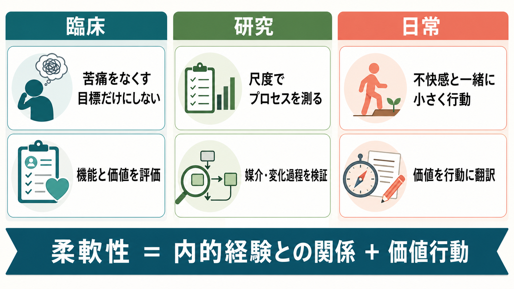

# ACTにおける心理的柔軟性とは何か

## 要点

- ACT（Acceptance and Commitment Therapy: アクセプタンス&コミットメント・セラピー）における心理的柔軟性とは、「今この瞬間により十分に接触し、価値ある目的に役立つなら行動を変える、または続ける能力」である[1]。
- 中核は、つらい思考や感情を消すことではなく、それらに巻き込まれすぎず、価値に沿った行動を選べるようにする点にある[1][2]。
- ACTでは、受容、脱フュージョン、今この瞬間への接触、文脈としての自己、価値、コミットされた行為という6つの過程が、心理的柔軟性を支えると考える[1][2]。
- 心理的柔軟性は、症状の有無だけでなく、生活の質、役割、対人関係、学習、健康行動などにまたがる横断的な臨床プロセスとして研究されている[3][4]。
- ただし、測定尺度、とくにAAQ-IIの解釈には議論があり、「心理的柔軟性そのもの」を単純に1点の得点だけで代表させない注意が必要である[5][8]。

## この記事で答える問い

1. ACTでいう心理的柔軟性とは何か。
2. 「思考や感情を受け入れる」とは、我慢やあきらめと何が違うのか。
3. 6つの中核過程は、どのように価値に基づく行動へつながるのか。
4. 臨床・研究では、この概念をどのように扱うべきか。

## まず結論

心理的柔軟性は、「不快な内的経験があるかどうか」ではなく、「その経験とどのような関係を取り、何に向かって行動するか」を見る概念である。たとえば「失敗するかもしれない」という思考や不安が出てきても、それを完全に消してから動くのではなく、「不安がある」と気づき、それに飲み込まれすぎず、自分が大切にしたい学習、関係、仕事、健康、ケアに沿って小さく行動する。この能力がACTにおける心理的柔軟性である[1][2]。

## 背景

ACTは、行動分析、機能的文脈主義、関係フレーム理論を背景にもつ心理療法である。従来の認知療法が「非合理的な思考内容を検討し修正する」ことを重視する場面があるのに対し、ACTは思考内容の真偽だけでなく、思考が行動をどのように支配しているかに注目する[1]。

この違いは、[[メタ認知とは何か]]や[[注意とは何か]]とも関係する。人は「私はだめだ」という思考を、単なる心的出来事として観察できることもあれば、現実そのもののように扱って行動を狭めることもある。ACTでは後者を認知的フュージョンと呼び、思考・感情・身体感覚との関係が硬くなると、回避や停止が強まりやすいと考える[1][2]。

ただし、ACTは「ポジティブ思考になろう」という技法ではない。むしろ、不安、悲しみ、怒り、羞恥、痛みなどを人生から完全に排除することはできないという前提から出発する。そのうえで、苦痛がある状況でも価値に沿って行動できる余地を広げる。

## 基本概念

### 心理的柔軟性

ACTの代表的定義では、心理的柔軟性は「意識ある人間として現在の瞬間により十分に接触し、価値ある目的に役立つなら行動を変える、または持続する能力」とされる[1]。ここには3つの要素が含まれる。

| 要素 | 意味 | 臨床での見方 |
|---|---|---|
| 現在への接触 | 今起きている思考、感情、身体感覚、状況に気づく | 自動操縦や反すうから少し距離をとれるか |
| 開かれた態度 | 不快な経験をすぐ排除せず、持てる範囲を広げる | 回避だけが選択肢になっていないか |
| 価値に沿った行動 | 大切な方向に向けて、具体的行動を選ぶ | 気分に左右されても行動を調整できるか |

この意味での柔軟性は、[[認知的柔軟性とは何か]]と重なる部分をもつが、同一ではない。認知的柔軟性が課題ルールや注意の切り替えを含む実行機能的概念として扱われることが多いのに対し、ACTの心理的柔軟性は、苦痛を伴う内的経験、価値、行動機能を同時に扱う臨床プロセスである[3][8]。

### 心理的非柔軟性

心理的柔軟性の反対側には、心理的非柔軟性がある。これは、不快な思考や感情を避けること自体が生活を支配し、選べる行動が狭くなる状態である[1][5]。

例を挙げる。

- 不安を避けるために、人との約束をすべて断る。
- 「どうせ失敗する」という思考を現実と同一視し、挑戦をやめる。
- 苦痛を短期的に下げる行動が、長期的には孤立、学習機会の減少、健康悪化を招く。

これは[[回避学習とは何か]]や[[行動変容はどのように起こるのか]]と接続しやすい。短期的には回避が報酬として働くため、回避行動は強化される。しかし、長期的には生活範囲や価値行動が縮小することがある。

## 仕組み

ACTの6つの中核過程は、別々の技法リストというより、同じ問題を異なる角度から扱うプロセス群である[1][2]。

| 中核過程 | 何を広げるか | よくある介入の方向 |
|---|---|---|
| 受容 | 感情や身体感覚を押し出さずに持つ力 | 不安や痛みに場所を作る、抵抗のコストを見る |
| 脱フュージョン | 思考を現実そのものではなく思考として見る力 | 「私は〜という考えを持っている」と言語化する |
| 今この瞬間 | 注意を現在の経験へ戻す力 | 呼吸、身体感覚、周囲の刺激に気づく |
| 文脈としての自己 | 経験を観察する視点を持つ力 | 「経験している私」と「経験内容」を分ける |
| 価値 | 進みたい方向を明確にする力 | 何を大切にしたいか、どんな人でありたいかを言語化する |
| コミットされた行為 | 価値を具体的行動へ落とす力 | 小さな行動計画、振り返り、再調整 |

重要なのは、受容やマインドフルネスだけではACTの全体ではないという点である。受容は「苦痛に耐える」ためだけにあるのではなく、価値ある行動の自由度を回復するために使われる。価値は「理想論」ではなく、今日・今週の小さな行動に翻訳される必要がある[1][2]。

## 図解

図1は、心理的柔軟性を6つの過程の相互作用として示している。内的経験に気づき、受容と脱フュージョンによって距離を取り、価値とコミットされた行為へ向かう流れである。

図2は、心理的非柔軟性と柔軟性の分岐を示している。不快な思考・感情が出たとき、融合と回避が強まると行動は狭まりやすい。いっぽう、気づき、受け入れ、距離をとる過程が働くと、反応を選べる余地が生まれ、価値に沿った行動につながる。

図3は、臨床・研究・日常応用への接続である。臨床では症状低減だけでなく、機能と価値行動を評価する。研究では尺度や媒介分析でプロセスを検討する。日常では、不快感が消えてからではなく、不快感と一緒に小さく行動することが焦点になる。

## 臨床・研究との接続

ACTの臨床効果については、精神疾患や身体疾患を含む多様な問題を対象にメタ分析が行われている。A-Tjakらのメタ分析では、39件のランダム化比較試験、1,821名を対象に、ACTが複数の臨床的問題に対して有効である可能性が示された[6]。ただし、対象疾患、比較条件、介入形式には幅があり、「ACTが常に他の有効な心理療法より優れる」と単純化するのは避けるべきである[1][6]。

プロセス研究では、心理的柔軟性モデルの構成要素が実験室研究でも検討されている。Levinらのメタ分析は、受容、脱フュージョン、価値などの構成要素が短期的アウトカムに影響しうることを示しているが、実験室課題から臨床実践へ一般化する際には限界もある[7]。

測定ではAAQ-IIが広く用いられてきた。BondらはAAQ-IIが心理的非柔軟性、経験の回避、受容に関連する構成概念を測定する尺度として、複数サンプルで信頼性と妥当性を示した[5]。一方で、近年のスコーピングレビューでは、心理的柔軟性の定義と測定にはなお不一致があり、AAQ-IIは否定的感情や神経症傾向を反映しすぎる可能性が指摘されている[8]。したがって、[[心理測定とは何か]]や[[妥当性とは何か]]の観点から、尺度得点だけでなく、行動観察、生活機能、価値行動、文脈情報を合わせて読むことが望ましい。

臨床実践では、心理的柔軟性を個別診断や治療指示として断定的に使うのではなく、教育・研究・ケースフォーミュレーションの枠組みとして扱うのが適切である。たとえば、抑うつ、不安、慢性疼痛、依存、職場ストレスなどで、症状を完全に消すことが短期的に難しい場合でも、価値に沿った行動を少しずつ回復するという目標設定が可能になる。

## よくある誤解

### 誤解1: 受容とは、つらさを我慢することである

ACTの受容は、受け身の我慢ではない。むしろ、苦痛を消すためだけに生活を犠牲にしていないかを見直し、価値ある行動のために内的経験を持つ余地を広げることである[1][2]。

### 誤解2: 脱フュージョンとは、思考を否定することである

脱フュージョンは、思考の内容を「間違い」と論破することではない。「私は失敗する」という思考が出たとき、それを現実そのものとして扱うのではなく、「失敗するという考えが出ている」と気づくことである。

### 誤解3: 価値とは、目標や成果と同じである

価値は、到達したら終わるゴールというより、進み続ける方向である。「よい親でありたい」「学び続けたい」「誠実に働きたい」は価値であり、「今週1回、子どもと10分話す」「論文を1ページ読む」は価値に沿った行動目標である。ここは[[価値学習とは何か]]や[[目標指向行動と習慣行動は何が違うのか]]とも接続する。

### 誤解4: 心理的柔軟性が高ければ、苦痛はなくなる

心理的柔軟性は苦痛をゼロにする能力ではない。苦痛があるときにも、行動の選択肢を保つ能力である。結果として苦痛が下がることはありうるが、苦痛低減だけを唯一の成功指標にすると、ACTの焦点を見誤る。

## 関連ノート

- [[認知的柔軟性とは何か]]
- [[メタ認知とは何か]]
- [[注意とは何か]]
- [[回避学習とは何か]]
- [[行動変容はどのように起こるのか]]
- [[行動活性化とは何か]]
- [[価値学習とは何か]]
- [[目標指向行動と習慣行動は何が違うのか]]
- [[心理測定とは何か]]
- [[妥当性とは何か]]

## MOC更新候補

- `content/00_MOC/MOC｜臨床実践・治療.md` に `[[ACTにおける心理的柔軟性とは何か]]` を追加候補。
- `content/00_MOC/MOC｜認知科学・心理学.md` には、心理的柔軟性と認知的柔軟性の比較ノートとして追加候補。
- 並列生成ジョブとの競合を避けるため、本ジョブではMOC本体は更新しない。

## 理解チェック

1. ACTでいう心理的柔軟性は、単なる「気分のよさ」や「ポジティブ思考」とどう違うか。
2. 認知的フュージョンが強いと、行動選択はどのように狭まりやすいか。
3. 受容と価値行動は、なぜセットで考える必要があるか。
4. AAQ-IIなどの尺度を読むとき、なぜ得点だけで臨床判断しないほうがよいか。

## 未解決問題

- 心理的柔軟性の6過程が、疾患・年齢・文化・治療形式によって同じ重みをもつのかは、さらに検証が必要である。
- 心理的柔軟性の測定は、AAQ-IIだけでなく多面的尺度、行動指標、日誌、デジタルフェノタイピングなどをどう統合するかが課題である。
- ACTの効果がどの程度、心理的柔軟性の変化によって媒介されるのかは、研究デザインと測定時点に依存するため、慎重な解釈が必要である。

## 参考文献

[1] Hayes, S. C., Luoma, J. B., Bond, F. W., Masuda, A., & Lillis, J. (2006). Acceptance and Commitment Therapy: Model, processes and outcomes. *Behaviour Research and Therapy, 44*(1), 1-25. https://doi.org/10.1016/j.brat.2005.06.006

[2] Hayes, S. C., Strosahl, K. D., & Wilson, K. G. (2012). *Acceptance and Commitment Therapy: The Process and Practice of Mindful Change* (2nd ed.). Guilford Press. https://www.guilford.com/books/Acceptance-and-Commitment-Therapy/Hayes-Strosahl-Wilson/9781609189624

[3] Kashdan, T. B., & Rottenberg, J. (2010). Psychological flexibility as a fundamental aspect of health. *Clinical Psychology Review, 30*(7), 865-878. https://doi.org/10.1016/j.cpr.2010.03.001

[4] Lucas, J. J., & Moore, K. A. (2020). Psychological flexibility: Positive implications for mental health and life satisfaction. *Health Promotion International, 35*(2), 312-320. https://doi.org/10.1093/heapro/daz036

[5] Bond, F. W., Hayes, S. C., Baer, R. A., Carpenter, K. C., Guenole, N., Orcutt, H. K., Waltz, T., & Zettle, R. D. (2011). Preliminary psychometric properties of the Acceptance and Action Questionnaire-II: A revised measure of psychological inflexibility and experiential avoidance. *Behavior Therapy, 42*(4), 676-688. https://doi.org/10.1016/j.beth.2011.03.007

[6] A-Tjak, J. G. L., Davis, M. L., Morina, N., Powers, M. B., Smits, J. A. J., & Emmelkamp, P. M. G. (2015). A meta-analysis of the efficacy of Acceptance and Commitment Therapy for clinically relevant mental and physical health problems. *Psychotherapy and Psychosomatics, 84*(1), 30-36. https://doi.org/10.1159/000365764

[7] Levin, M. E., Hildebrandt, M. J., Lillis, J., & Hayes, S. C. (2012). The impact of treatment components suggested by the psychological flexibility model: A meta-analysis of laboratory-based component studies. *Behavior Therapy, 43*(4), 741-756. https://doi.org/10.1016/j.beth.2012.05.003

[8] Cherry, K. M., Vander Hoeven, E., Patterson, T. S., & Lumley, M. N. (2021). Defining and measuring “psychological flexibility”: A narrative scoping review of diverse flexibility and rigidity constructs and perspectives. *Clinical Psychology Review, 84*, 101973. https://doi.org/10.1016/j.cpr.2021.101973
