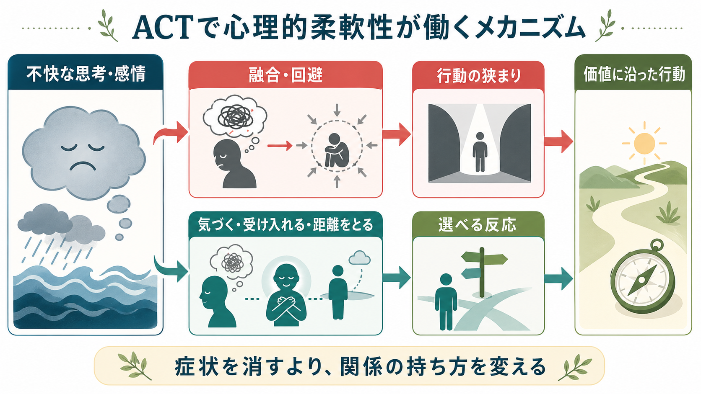
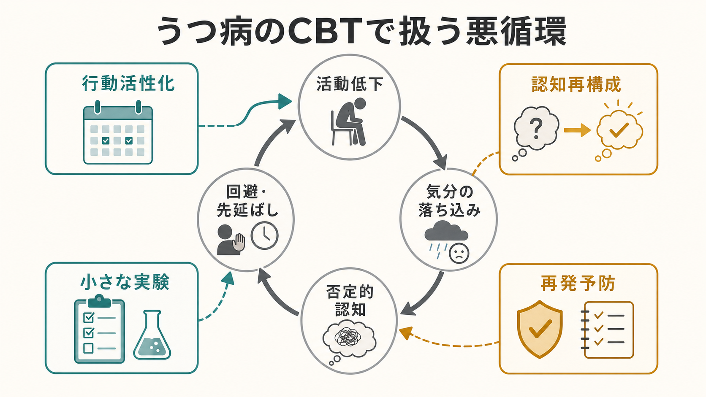

# DBTのマインドフルネススキルとは何か

## 要点

- DBT（dialectical behavior therapy; 弁証法的行動療法）のマインドフルネススキルは、「今この瞬間」の内的・外的体験に気づき、評価や反射的反応に巻き込まれず、目的に合う行動を選びやすくするための基礎スキルである[1][2]。
- DBTのスキルトレーニングは、マインドフルネス、対人関係スキル、感情調整、苦痛耐性を中心に構成され、マインドフルネスは他のスキルを使うための土台になる[1][3]。
- 中核は、「何をするか」のスキルである「観察する・描写する・参加する」と、「どのように行うか」のスキルである「評価せず・一つのことに集中し・効果的に行う」を区別して練習する点にある[1]。
- 臨床では、感情や衝動を消す技法ではなく、感情・身体感覚・思考・行動衝動を識別し、短期的な反応から一歩距離を取るための訓練として使う。
- DBTは[[境界性パーソナリティ障害とは何か]]や[[自傷を伴う境界性パーソナリティ障害とは何か]]に関連して発展したが、個別の診断や治療適応は専門家による評価と治療計画の中で判断される。

## この記事で答える問い

1. DBTにおけるマインドフルネスは、一般的な瞑想やリラクゼーションと何が違うのか。
2. 「観察する」「描写する」「参加する」は、治療場面で何を意味するのか。
3. 「評価せず」「一つのことに集中し」「効果的に行う」は、感情調整や衝動行動とどう関係するのか。
4. 臨床家や学習者は、このスキルをどの範囲で理解すればよいのか。

## まず結論

DBTのマインドフルネススキルは、「気持ちを落ち着かせるための瞑想」だけではない。むしろ、強い感情、対人ストレス、自己批判、衝動が生じた瞬間に、自分の中で何が起きているかを観察可能な対象として扱うための行動スキルである。これにより、「怒りを感じたからすぐ言い返す」「不安が強いから避ける」「自己批判が浮かんだから事実だと信じる」といった自動的な反応の連鎖に、短い間を作る。

DBTでは、この間を単なる我慢ではなく、「賢明な心（wise mind）」に近づくための訓練として扱う。賢明な心とは、感情を否定せず、同時に事実・目的・長期的な価値にも目を向ける姿勢である[1]。したがってマインドフルネスは、受容と変化というDBTの弁証法をつなぐ中心的な実践だと考えられる。

## 背景

DBTは、Marsha M. Linehanにより、自殺関連行動や慢性的な自傷を伴う境界性パーソナリティ障害の治療として発展した認知行動療法系の心理療法である。初期の無作為化試験では、DBTを受けた群でパラ自殺行動、医学的重症度、入院日数などのアウトカムに改善が示された[4]。その後、DBTはBPDに限らず、感情調整困難や衝動性を伴う臨床問題へ拡張されてきた。

NICEの境界性パーソナリティ障害ガイドラインは、再発性自傷を減らすことが優先課題である女性のBPDに対して、包括的DBTプログラムを考慮するよう述べている[5]。Cochraneレビューでも、BPDに焦点化した心理療法は通常治療と比べてBPD症状や自傷などに有益な可能性があり、DBTはBPD重症度、自傷、心理社会的機能の改善で研究されている主要な治療の一つと整理されている。ただし、エビデンスの確実性には限界がある[6]。

ここで重要なのは、「DBTが有効か」という治療全体の問いと、「マインドフルネススキルがどのように機能するか」というスキル水準の問いを混同しないことである。マインドフルネスはDBT全体の一部であり、個別療法、スキルトレーニング、電話コーチング、治療者コンサルテーションチームなどを含む包括的構造の中で使われる[1][3]。

## 基本概念

### 一般的なマインドフルネスとの関係

臨床心理学で用いられるマインドフルネスは、現在の内的・外的体験に意図的に注意を向ける訓練として整理されることが多い。Baerのレビューは、マインドフルネスを「現在起きている内的・外的経験へ意図的に注意を向けること」とし、瞑想練習を通じて教えられることが多い臨床的介入として概念化している[7]。Kabat-Zinnも、現在の瞬間へ意図的に、評価せず注意を向ける態度を中心にマインドフルネスを定義している[8]。

DBTはこの考えを、治療の現場で使える行動スキルへ分解する。つまり、「マインドフルでいる」という抽象的な目標を、「観察する」「描写する」「参加する」「評価せずに」「一つのことに集中して」「効果的に」という練習単位に分ける。

### 何をするか: 観察・描写・参加

「観察する」とは、感情、思考、身体感覚、外界の出来事を、すぐに変えようとせず気づくことである。たとえば「胸が熱い」「手に力が入っている」「相手に責められたと思った」「逃げたい衝動がある」といった形で、体験の出現に気づく。

「描写する」とは、観察したものを言葉にすることである。ここでは「私はだめだ」ではなく「『私はだめだ』という考えが浮かんでいる」、「相手は私を嫌っている」ではなく「相手が返信していないという事実がある」といった区別が重要になる。描写は、事実、解釈、感情、衝動を分ける訓練でもある。

「参加する」とは、現在の活動に身を入れることである。これは受け身の観察だけではない。会話、食事、歩行、呼吸、作業、ロールプレイなど、今行っている行為に注意を戻し、過去や未来の反すうから行動へ戻ることを含む。

### どのように行うか: 評価せず・一つのことに集中・効果的に

「評価せず」とは、良い・悪い、正しい・間違い、弱い・強いといった裁きに巻き込まれすぎず、体験を事実として扱う姿勢である。これは価値判断を永久に捨てるという意味ではない。治療上は、自己批判や相手批判が行動選択を狭める場面で、まず観察可能な事実へ戻るための技術として使う。

「一つのことに集中」とは、注意が逸れたら、罰するのではなく、選んだ対象へ戻す練習である。呼吸、足裏の感覚、会話の相手、課題の一手順など、対象は臨床目標に応じて変わる。

「効果的に行う」とは、「正しさ」や「勝ち負け」ではなく、目的に合う行動を選ぶことである。たとえば、相手を論破したい衝動が強くても、長期的には関係を保つことが目的なら、短い休止、事実の確認、要求の明確化がより効果的な行動になることがある。

## 仕組み

DBTのマインドフルネススキルは、刺激と反応の間に、観察・言語化・選択の段階を入れる。強い感情が起こると、身体感覚、解釈、記憶、行動衝動が一体化しやすい。そこで「観察する」は体験の存在に気づき、「描写する」は体験を言語化して分節し、「参加する」は現在の行動へ戻す。

この過程は、感情を消すためではなく、感情と行動を同一視しないために用いられる。怒りは怒りとして存在してよい。しかし、「怒りがある」ことと「怒りに従って攻撃する」ことは同じではない。不安は不安として存在してよい。しかし、「不安がある」ことと「回避が唯一の選択肢である」ことは同じではない。

治療場面では、この仕組みはチェーン分析、日記カード、宿題、ロールプレイと結びつく。たとえば自傷衝動が生じた場面を振り返るとき、出来事、解釈、感情、身体反応、衝動、行動、結果を分けて記述する。そのうえで、どの時点で観察・描写・参加が使えたか、次回どのスキルを試すかを検討する。

## 図解

1枚目の図は、DBTのマインドフルネスを「今この瞬間」「観察・描写・参加」「評価せず・一つのことに集中・効果的に」「賢明な心」の関係として整理している。マインドフルネスは、単独の瞑想技法というより、DBTの他のスキルを使うための共通基盤である。

2枚目の図は、刺激から反応までの間にスキルを挿入するモデルである。刺激そのものを消せない場合でも、身体感覚・感情・思考を観察し、言葉にし、現在の行動へ戻ることで、衝動に直行する経路を短くしないようにする。

## 臨床・研究との接続

DBTのマインドフルネススキルは、[[自傷を伴う境界性パーソナリティ障害とは何か]]で重要になる「衝動が強いときに何が選べるか」という問いと接続する。臨床的には、自傷、過量服薬、激しい対人衝突、回避、解離的なぼんやり感などを、単に「問題行動」と見るのではなく、苦痛を下げるために選ばれた短期的対処として理解する。そのうえで、より安全で目的に合う行動のレパートリーを増やす。

また、DBTのマインドフルネスは、[[ACTとは何か]]で扱われるアクセプタンスや脱フュージョンとも近い問題意識を持つ。どちらも、思考や感情を消すことより、それらとの関係を変えることを重視する。ただし、DBTは行動分析、危機対応、スキルトレーニングの構造が明確であり、BPDや自傷を伴う臨床状況に合わせて発展してきた点に特徴がある。

研究上は、DBT全体の効果と、マインドフルネススキル単独の寄与を分けて考える必要がある。包括的DBTには複数の構成要素が含まれるため、改善が見られても、それがマインドフルネスのみの効果だとは言えない。スキル使用頻度、感情調整、自己批判、衝動性、治療継続などを媒介変数として検討する研究が必要である。

## よくある誤解

### 誤解1: マインドフルネスは何も考えないこと

DBTで求められるのは、考えを消すことではない。むしろ「考えが浮かんでいる」と気づき、考え・感情・事実・行動衝動を区別することが重要である。

### 誤解2: 評価しないとは、問題を問題と言わないこと

評価しないことは、危険や不適切な行動を見逃すことではない。臨床では、安全確保、リスク評価、限界設定は必要である。ただし、自己批判や相手批判が強すぎると行動分析が粗くなるため、まず事実へ戻る。

### 誤解3: マインドフルネスはリラクゼーション技法である

結果として落ち着くことはあるが、主目的はリラックスではない。不快な感情が残っていても、その存在に気づきながら目的に合う行動を選べるようにすることが中心である。

### 誤解4: スキルを使えないのは意志が弱いから

スキルは練習によって獲得される行動であり、強い感情、睡眠不足、物質使用、対人ストレス、トラウマ反応などで使いにくくなる。治療では「なぜ使えなかったか」を責めるのではなく、どの時点でどの支援や練習が必要だったかを分析する。

## 関連ノート

- [[境界性パーソナリティ障害とは何か]]
- [[自傷を伴う境界性パーソナリティ障害とは何か]]
- [[ACTとは何か]]

### 関連ノート候補

- 弁証法的行動療法とは何か
- DBTの苦痛耐性スキルとは何か
- DBTの感情調整スキルとは何か
- DBTの対人関係スキルとは何か
- チェーン分析とは何か

### MOC更新候補

- `content/00_MOC/` 配下に心理療法または臨床実践のMOCがある場合、バッチ統合時に本記事を追加する。
- 並列生成ジョブとの競合を避けるため、本タスクではMOC本体は更新しない。

## 理解チェック

1. 「観察する」と「描写する」は、臨床場面でどのように違うか。
2. 「評価せず」は、危険な行動を見逃すこととどう違うか。
3. 「効果的に行う」は、正しさや感情の強さではなく、何を基準に行動を選ぶことか。
4. DBT全体の有効性と、マインドフルネススキル単独の効果を分けて考える必要があるのはなぜか。

## 未解決問題

- DBTの各構成要素のうち、マインドフルネススキルがどのアウトカムにどの程度寄与するかは、包括的治療研究だけでは切り分けにくい。
- マインドフルネス練習が合わない人、解離やトラウマ反応が強い人、文化的・宗教的背景から抵抗を感じる人に対して、どのように導入を調整するかは臨床判断が必要である。
- アプリや短時間教材でDBTスキルが普及する一方、危機対応、治療関係、行動分析を伴わない自己流実践の限界も検討する必要がある。

## 参考文献

[1] Linehan, M. M. (2025). *DBT Skills Training Manual: Revised Edition*. Guilford Press. https://www.guilford.com/books/DBT-Skills-Training-Manual/Marsha-Linehan/9781462556359

[2] Linehan Institute. DBT Skills Training Manual. https://www.linehaninstitute.org/publications-books/dbt-skills-training-manual

[3] Linehan, M. M. (2014). *DBT Skills Training Manual: Second Edition*. Guilford Press. https://www.guilford.com/books/DBT-Skills-Training-Manual/Marsha-Linehan/9781462516995

[4] Linehan, M. M., Armstrong, H. E., Suarez, A., Allmon, D., & Heard, H. L. (1991). Cognitive-behavioral treatment of chronically parasuicidal borderline patients. *Archives of General Psychiatry, 48*(12), 1060-1064. https://doi.org/10.1001/archpsyc.1991.01810360024003

[5] National Institute for Health and Care Excellence. (2009). *Borderline personality disorder: recognition and management* (CG78), recommendations. https://www.nice.org.uk/guidance/cg78/chapter/1-Guidance

[6] Storebø, O. J., Stoffers-Winterling, J. M., Völlm, B. A., Kongerslev, M. T., Mattivi, J. T., Jørgensen, M. S., Faltinsen, E., Todorovac, A., Sales, C. P., Callesen, H. E., Lieb, K., & Simonsen, E. (2020). Psychological therapies for people with borderline personality disorder. *Cochrane Database of Systematic Reviews*, CD012955. https://doi.org/10.1002/14651858.CD012955.pub2

[7] Baer, R. A. (2003). Mindfulness training as a clinical intervention: A conceptual and empirical review. *Clinical Psychology: Science and Practice, 10*(2), 125-143. https://doi.org/10.1093/clipsy.bpg015

[8] Kabat-Zinn, J. (2003). Mindfulness-based interventions in context: Past, present, and future. *Clinical Psychology: Science and Practice, 10*(2), 144-156. https://doi.org/10.1093/clipsy.bpg016
