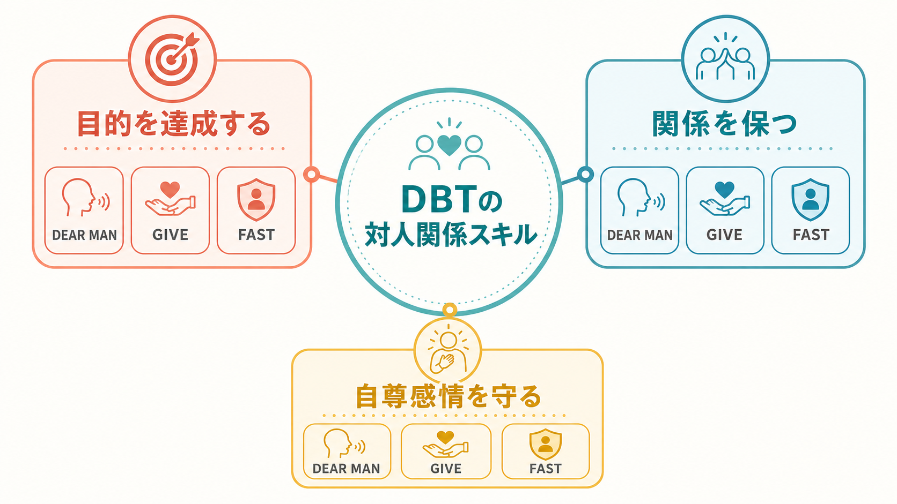
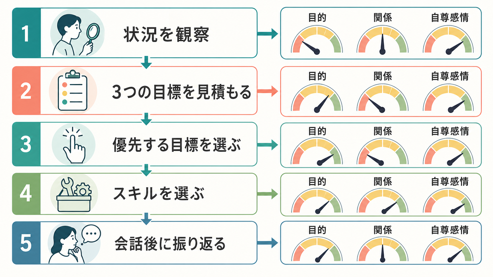
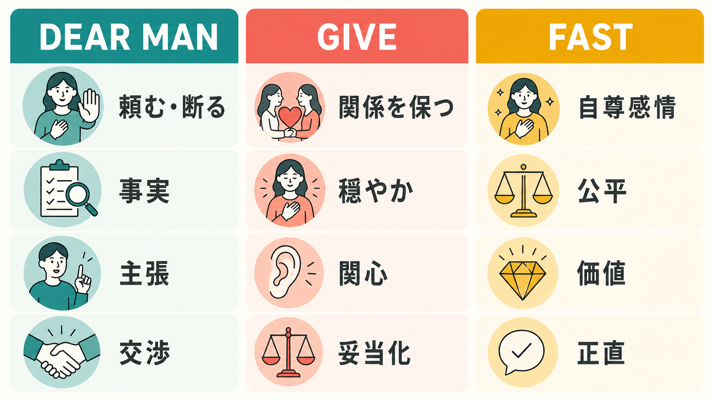

# DBTの対人関係スキルとは何か

## 要点

- DBTの対人関係スキルは、「頼む・断る」「関係を壊しにくくする」「自尊感情を守る」を同時に扱う、会話場面の行動スキルである。
- 中核は、目的達成の **DEAR MAN**、関係維持の **GIVE**、自尊感情維持の **FAST** という3つのまとまりである。
- 重要なのは、どのスキルを暗記するかではなく、いまの会話で「目的」「関係」「自尊感情」のどれをどの程度優先するかを見積もることである。
- 医療・心理臨床では、DBTはもともと[[境界性パーソナリティ障害とは何か]]や自傷・自殺リスクの高い人への治療として発展したが、対人関係スキルは診断名にかかわらず、感情が強い場面での行動選択を助ける心理教育としても理解できる。

## この記事で答える問い

1. DBTの「対人関係スキル」は、一般的なコミュニケーション術と何が違うのか。
2. DEAR MAN、GIVE、FASTは、それぞれ何を守るためのスキルなのか。
3. 臨床で使うとき、自己主張・関係維持・自尊感情のバランスをどう考えるのか。

## まず結論

DBTの対人関係スキルは、対人場面で「相手を変える技術」ではなく、「感情が高まっても、自分の価値と関係を壊しすぎずに、具体的な行動を選ぶ技術」である。DBT全体は、受容と変化のバランスを重視する認知行動療法系の治療であり、スキルトレーニングではマインドフルネス、苦悩耐性、感情調整、対人関係スキルを扱う[1]。このうち対人関係スキルは、実際の会話で「何を言うか」と「どのように言うか」を分けて考える点に特徴がある。

## 背景

DBT（Dialectical Behavior Therapy; 弁証法的行動療法）は、Marsha M. Linehan によって、自殺リスクや[[非自殺性自傷とは何か]]、強い感情調整困難をもつ人への治療として開発された。標準DBTは、個人療法、スキルトレーニング、電話コーチング、治療者コンサルテーションチームなどから成る包括的治療である[1]。

対人関係スキルが必要になるのは、対人場面が「感情」「欲求」「価値」「関係の歴史」を同時に刺激するからである。たとえば、依頼を断る場面では、目的を通そうとすると関係が悪くなる不安が高まり、関係を守ろうとすると自分の限界を超えて引き受けてしまうことがある。DBTはこのような場面を、性格の弱さや意思の問題ではなく、スキル不足・感情の強さ・環境条件が重なった行動問題として扱う。

この見方は、[[心理教育とは何か]]や[[ケースフォーミュレーションとは何か]]とも相性がよい。問題を「人柄」ではなく「状況の中でどの行動が強化されているか」として見立てるため、練習可能な単位に分解しやすい。

## 基本概念

### 3つの目標

DBTの対人関係スキルでは、会話の目標を大きく3つに分ける。

| 目標 | 中心になる問い | 主なスキル |
| --- | --- | --- |
| 目的を達成する | 何を頼むのか。何を断るのか。 | DEAR MAN |
| 関係を保つ | この人との関係をどう扱うのか。 | GIVE |
| 自尊感情を守る | 会話後に自分を裏切った感じが残らないか。 | FAST |

この3つは、いつも同じ重みではない。緊急の安全確保や明確な境界設定では目的や自尊感情が優先されることがあり、長期的に大切な相手との会話では関係維持の比重が高くなることがある。DBTの対人関係スキルは、すべてを完璧に満たすための手順ではなく、葛藤する価値をその場で調整するための地図である。

### DEAR MAN

**DEAR MAN** は、頼む、断る、交渉するなど、目的達成のための骨組みである。典型的には、事実を述べる（Describe）、気持ちや影響を表す（Express）、具体的に求める・断る（Assert）、相手にとっての利点を示す（Reinforce）、論点からそれない（Mindful）、落ち着いた態度をとる（Appear confident）、交渉する（Negotiate）という流れで使う[2]。

重要なのは、DEAR MANが「強く押す」技術ではないことである。曖昧な不満、遠回しな期待、あとから爆発する怒りを、相手が理解しやすい具体的な依頼や境界に変換する技術である。

### GIVE

**GIVE** は、関係をできるだけ傷つけずに会話するためのスキルである。Gentle（攻撃や脅しを避ける）、Interested（関心を示して聞く）、Validate（相手の見方や感情の一部を妥当化する）、Easy manner（硬直しすぎない態度）を含む[2]。ここでは[[傾聴とは何か]]や[[共感的理解とは何か]]が実践上の土台になる。

GIVEは「相手に合わせて自分を消す」ことではない。むしろ、目的を伝えるときの摩擦を下げ、相手が防衛的になりすぎない条件を整える技術である。

### FAST

**FAST** は、会話のあとに自分への信頼を失わないためのスキルである。Fair（相手にも自分にも公平である）、no Apologies（不必要に謝りすぎない）、Stick to values（価値に沿う）、Truthful（正直である）を含む[2]。これは[[自己効力感とは何か]]や[[自己制御とは何か]]と関連するが、単なる自信づけではなく、行動と価値の整合性を保つための実践である。

FASTがないと、会話では一時的に丸く収まっても、あとから「また自分を曲げた」という感覚が残りやすい。逆にFASTだけが強すぎると、関係への配慮が落ち、正しさを主張するだけの会話になりやすい。

## 仕組み

DBTの対人関係スキルの仕組みは、会話の前後に「優先順位づけ」を挟む点にある。まず状況を観察し、目的・関係・自尊感情の3つを見積もる。そのうえで、DEAR MAN、GIVE、FASTのどれを前面に出すかを選ぶ。会話後には、結果だけでなく「自分はスキルを使えたか」「次は何を変えるか」を振り返る。

このプロセスは、[[DBTのマインドフルネススキルとは何か]]と切り離せない。感情が強いとき、人は相手の意図を断定したり、過去の傷つきと現在の発言を結びつけたりしやすい。マインドフルネスは、会話中に「いま何が起きているか」「自分は何を求めているか」に戻るための足場になる。

研究面では、DBTのスキル使用が治療成果の媒介要因として検討されている。Neacsiuらの研究では、DBTを受けた参加者は対照治療よりもスキル使用が増え、そのスキル使用が自殺企図、抑うつ、怒りの制御などの変化を媒介していた[3]。これは、DBTが単に支持的な関係を提供するだけでなく、具体的なスキル獲得を通じて行動変化を支えるという仮説を補強する。

## 図解

次の図は、DEAR MAN、GIVE、FASTを「何を守るか」で比較したものである。臨床場面では、3つを別々に教えるだけでなく、同じ会話の中で組み合わせる練習が重要になる。

簡単な例で見ると、上司から急な追加作業を頼まれた場面では、次のように分解できる。

| 目標 | 例 |
| --- | --- |
| DEAR MAN | 「今日は既に締切作業があり、追加作業を今日中に行うのは難しいです。明日の午前なら対応できます」 |
| GIVE | 「急ぎの案件で困っていることは理解しています」 |
| FAST | 「休息を削ると明日の質が落ちるので、今日は引き受けない判断をします」 |

この例で大切なのは、相手に勝つことではなく、事実・配慮・価値を同じ会話の中に置くことである。

## 臨床・研究との接続

DBTの有効性については、境界性パーソナリティ障害や自殺・自傷リスクに関するランダム化比較試験が蓄積されてきた。Linehanらの2年RCTでは、自殺行動をもつ境界性パーソナリティ障害の人に対して、DBTが専門家による治療と比較され、自殺企図や救急利用などの面で有利な結果が報告された[4]。また、DBTの構成要素を比較した研究では、スキルトレーニングを含む条件が重要な役割をもつことが示唆されている[5]。

一方で、DBTが常に他の構造化治療を大きく上回るとは限らない。McMainらのRCTでは、DBTと一般精神医学的管理の双方で改善がみられ、比較対象となる治療の質が高い場合には差が小さくなる可能性も示された[8]。したがって、DBTの対人関係スキルを評価するときは、単独技法としてではなく、治療構造、危機対応、治療者訓練、継続的な練習環境の中で考える必要がある。

ただし、対人関係スキルだけを取り出して「これを使えば関係が必ず改善する」と考えるのは不正確である。Cochraneレビューでは、境界性パーソナリティ障害に対する心理療法の中でDBTに一定のエビデンスがある一方、研究数や比較条件には限界があり、介入ごとの結論には慎重さが必要とされている[6]。NICEガイドラインも、反復する自傷の低減が優先課題である女性の境界性パーソナリティ障害に対して、包括的DBTプログラムを考慮するとしており、単発の助言や短期的な技法集として扱っていない[7]。

臨床的には、[[自傷と自殺企図はどう違うのか]]や[[自殺リスク評価では何を聞くべきか]]に関わる高リスク事例では、対人関係スキルの練習だけで安全が確保されるわけではない。リスク評価、危機対応、治療関係、環境調整、多職種連携が前提になる。DBTの対人スキルは、その上で生活場面の衝突を減らし、[[治療関係とは何か]]の中で学んだことを日常に移すための行動レパートリーとして位置づけると理解しやすい。

## よくある誤解

### 誤解1: DBTの対人関係スキルは、相手を思い通りに動かす技術である

DEAR MANは依頼や交渉の技術だが、相手の同意を保証するものではない。むしろ、相手が同意しなかった場合にも、自分が明確に伝えたか、関係を不必要に傷つけなかったか、自分の価値に沿っていたかを評価できるようにする。

### 誤解2: GIVEは、相手に合わせて我慢することである

GIVEは関係維持のスキルであり、自己犠牲の推奨ではない。妥当化は「相手が正しい」と認めることではなく、相手の反応がその人の文脈から理解可能である部分を言語化することである。

### 誤解3: FASTは、謝らない・譲らない態度である

FASTの「no Apologies」は、必要な謝罪をしないという意味ではない。不必要な謝罪、存在そのものへの謝罪、正当な依頼や境界設定への過剰な謝罪を減らすという意味である。公平さと正直さが同時に求められるため、相手への配慮を捨てる技術ではない。

### 誤解4: スキルを知ればすぐ使える

対人関係スキルは、知識というより行動練習である。強い不安、怒り、恥、見捨てられ不安が出る場面では、手順を知っていても使えないことがある。そのためDBTでは、宿題、ロールプレイ、振り返り、実生活での反復練習を重視する[1]。

## 関連ノート

既存ノートとして関連が強いもの:

- [[DBTのマインドフルネススキルとは何か]]
- [[境界性パーソナリティ障害とは何か]]
- [[自傷を伴う境界性パーソナリティ障害とは何か]]
- [[非自殺性自傷とは何か]]
- [[心理教育とは何か]]
- [[治療関係とは何か]]
- [[傾聴とは何か]]
- [[共感的理解とは何か]]
- [[自己制御とは何か]]

今後の作成候補:

- DBTの感情調整スキルとは何か
- DBTの苦悩耐性スキルとは何か
- DEAR MANとは何か
- GIVEとは何か
- FASTとは何か
- 境界設定は心理療法でどう扱うのか

MOC更新候補:

- MOC｜臨床実践・治療
- MOC｜精神医学
- MOC｜総論・診断・面接

## 理解チェック

1. ある会話で「目的」「関係」「自尊感情」のうち、どれを最優先にする必要があるか説明できるか。
2. DEAR MAN、GIVE、FASTを、それぞれ一文で説明できるか。
3. 「妥当化」と「同意」の違いを説明できるか。
4. 相手が同意しなかった場合でも、自分のスキル使用を振り返る観点を挙げられるか。
5. 高リスクの自傷・自殺関連行動がある場合、対人スキル練習だけでなく安全評価と治療体制が必要であることを説明できるか。

## 参考文献

[1] Behavioral Research & Therapy Clinics, University of Washington. "Dialectical Behavior Therapy." https://depts.washington.edu/uwbrtc/about-us/dialectical-behavior-therapy/

[2] Linehan, M. M. (2025). *DBT Skills Training Manual* (Revised ed.). Guilford Press. https://www.guilford.com/books/DBT-Skills-Training-Manual/Marsha-Linehan/9781462516995

[3] Neacsiu, A. D., Rizvi, S. L., & Linehan, M. M. (2010). Dialectical behavior therapy skills use as a mediator and outcome of treatment for borderline personality disorder. *Behaviour Research and Therapy, 48*(9), 832-839. https://doi.org/10.1016/j.brat.2010.05.017

[4] Linehan, M. M., Comtois, K. A., Murray, A. M., et al. (2006). Two-year randomized controlled trial and follow-up of dialectical behavior therapy vs therapy by experts for suicidal behaviors and borderline personality disorder. *Archives of General Psychiatry, 63*(7), 757-766. https://doi.org/10.1001/archpsyc.63.7.757

[5] Linehan, M. M., Korslund, K. E., Harned, M. S., et al. (2015). Dialectical behavior therapy for high suicide risk in individuals with borderline personality disorder: A randomized clinical trial and component analysis. *JAMA Psychiatry, 72*(5), 475-482. https://doi.org/10.1001/jamapsychiatry.2014.3039

[6] Storebø, O. J., Stoffers-Winterling, J. M., Völlm, B. A., et al. (2020). Psychological therapies for people with borderline personality disorder. Cochrane Database of Systematic Reviews. https://www.cochrane.org/evidence/CD005652_psychological-therapies-borderline-personality-disorder

[7] National Institute for Health and Care Excellence. (2009). *Borderline personality disorder: recognition and management* (CG78). https://www.nice.org.uk/guidance/cg78/chapter/1-Guidance

[8] McMain, S. F., Links, P. S., Gnam, W. H., et al. (2009). A randomized trial of dialectical behavior therapy versus general psychiatric management for borderline personality disorder. *American Journal of Psychiatry, 166*(12), 1365-1374. https://doi.org/10.1176/appi.ajp.2009.09010039

## 未解決問題

- DBT対人関係スキルの各要素が、どの症状・機能アウトカムにどの程度寄与するかは、包括的DBT全体の効果と切り分けて検討する必要がある。
- 文化差、権力差、家族内役割、職場環境などによって、自己主張や境界設定の意味は変わる。日本語圏の臨床・教育場面で、どのようにローカライズするかは重要な課題である。
- 生成AIやデジタル教材を用いたロールプレイ練習が、実際の対人行動変化に結びつくかは、今後の検証が必要である。
