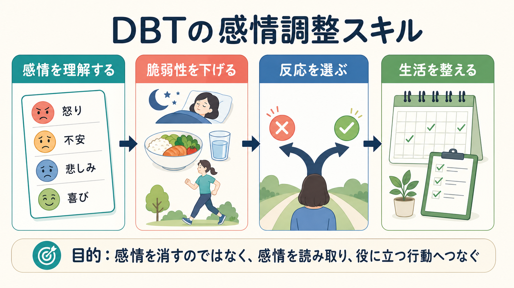
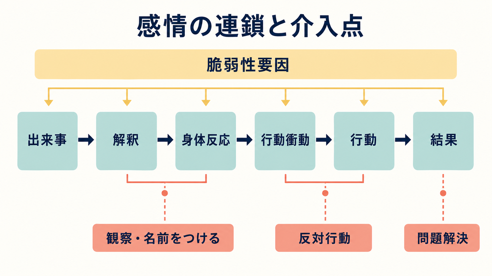
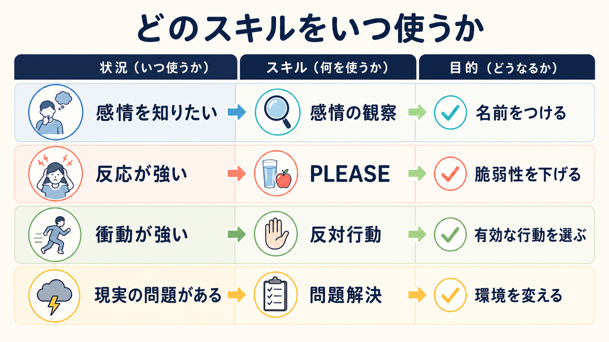

# DBTの感情調整スキルとは何か

## 要点

- DBTの感情調整スキルは、感情を「消す」技法ではなく、感情を理解し、感情に振り回される条件を減らし、有効な行動を選ぶための行動スキルである。
- 中核は、感情の機能を知る、感情に名前をつける、感情の連鎖を分析する、身体的・生活上の脆弱性を下げる、反対行動や問題解決を選ぶ、という流れにある。
- 標準DBTでは、感情調整は[[DBTのマインドフルネススキルとは何か]]、苦痛耐性、[[DBTの対人関係スキルとは何か]]と組み合わせて使われる。
- 臨床では有用な枠組みだが、この記事は教育・研究目的の整理であり、個別の診断や治療指示ではない。

## この記事で答える問い

この記事では、[[弁証法的行動療法DBTとは何か]]における「感情調整スキル」が何を目指し、どのような仕組みで使われ、臨床研究とどう接続するのかを整理する。特に、感情を抑え込む技法としてではなく、感情を情報として読み取りながら、生活・身体・行動を調整する技法群として理解する。

## まず結論

DBTの感情調整スキルは、「感情が強い人に冷静になるよう説得する方法」ではない。むしろ、感情が強くなるまでの条件を具体的に分解し、介入できる点を増やすための訓練である。標準DBTのスキルトレーニングは、マインドフルネス、対人関係スキル、感情調整、苦痛耐性の4領域から構成され、感情調整は「感情を理解し、感情への脆弱性を減らし、望ましくない感情を変える」領域として位置づけられる[1][2]。

ここでいう「変える」は、感情を悪者として排除することではない。感情は、危険、喪失、境界侵害、欲求、価値などを知らせる信号であり、行動の準備状態でもある。したがってDBTでは、感情を観察し、名前をつけ、事実に合うかを確かめ、感情に従うことが有効かを判断し、必要なら反対行動や問題解決を選ぶ。

## 背景

DBTは、慢性的な自殺関連行動や[[非自殺性自傷とは何か]]、強い感情調整困難をもつ人々、とくに[[境界性パーソナリティ障害とは何か]]を対象に発展した[[認知行動療法CBTとは何か]]系の心理療法である[6]。ただし、DBTのスキルは診断名だけに結びつくものではなく、強い怒り、不安、恥、悲しみ、衝動、対人葛藤などを扱う診断横断的な臨床場面でも応用されている[2]。

感情調整研究では、感情は「どの感情を、いつ、どのように経験し表出するか」に影響を与える過程として扱われる。Grossのプロセスモデルでは、状況選択、状況修正、注意配分、認知変化、反応調整など、感情が生じる過程の複数の点で調整が可能だとされる[3]。DBTの感情調整スキルも、この複数の介入点を、臨床で使いやすい行動手順に落とし込んだものとして理解できる。

また、感情調整困難は単に「感情が強い」ことだけを意味しない。感情への気づきにくさ、感情の理解困難、感情を受け入れられないこと、強い感情下で目標に沿った行動を取りにくいこと、衝動制御の難しさなどを含む多次元的な問題である[4]。DBTが「感情を観察する」「名前をつける」「行動を選ぶ」を重視するのは、この多次元性に対応するためである。

## 基本概念

### 感情は情報であり、行動の準備でもある

DBTでは、感情を「なくすべき症状」としてだけ扱わない。怒りは境界侵害や不公平を知らせ、不安は危険や不確実性を知らせ、悲しみは喪失を知らせ、恥は社会的評価や所属の脅威を知らせる。もちろん感情は常に正確ではないが、何らかの情報を含む。

そのため最初のスキルは、感情を観察し、身体反応、表情、思考、行動衝動、実際の行動、結果を記述することである。これは[[身体と感情はどのようにつながるのか]]や[[内受容感覚は感情にどう関わるのか]]とも接続する。感情を「怒り」「不安」「恥」「悲しみ」などに粗くでも名づけると、何に反応しているのか、どの行動衝動が出ているのかを検討しやすくなる。

### 脆弱性を下げる

強い感情は、その場の出来事だけで決まらない。睡眠不足、空腹、身体疾患、痛み、薬物・アルコール、孤立、慢性的ストレス、過密スケジュールなどは、同じ出来事への反応を強める。DBTのPLEASEスキルは、身体疾患のケア、食事、気分変容物質の回避、睡眠、運動などを通じて、感情の脆弱性を下げるための生活行動を扱う[1]。

ここで重要なのは、PLEASEが「生活を整えれば問題は解決する」という単純な助言ではない点である。むしろ、強い感情の発火しやすさを下げる基礎条件を整えることで、他の心理スキルが使える余地を増やす。

### 反対行動と問題解決

感情には行動衝動が伴う。不安は回避、怒りは攻撃、悲しみは引きこもり、恥は隠れる行動へ向かいやすい。DBTの反対行動は、感情が事実に合わない場合、または感情に従うことが長期的に有効でない場合に、行動衝動とは逆方向の行動を意図的に選ぶスキルである[1]。

一方、感情が事実に合っており、現実の問題が存在する場合には、感情だけを変えようとするよりも問題解決が優先される。たとえば、危険があるなら安全確保、対人関係で具体的な要求があるなら対人スキル、環境調整が可能なら計画立案が中心になる。

## 仕組み

DBTの感情調整スキルは、感情の連鎖を「出来事、解釈、身体反応、行動衝動、行動、結果」に分け、どこに介入できるかを探す。これは、強い感情を一枚岩の体験として扱うのではなく、変えられる小さなプロセスに分ける作業である。

たとえば、対人場面で「無視された」と感じて怒りが急上昇した場合、連鎖分析では次のように見る。

1. 出来事: 返信が来ない。
2. 解釈: 「軽視された」「嫌われた」。
3. 身体反応: 胸の熱さ、筋緊張、動悸。
4. 行動衝動: 責める、連続でメッセージを送る、関係を切る。
5. 行動: 攻撃的な返信を送る。
6. 結果: 一時的にすっきりするが、関係悪化や自己嫌悪が増える。

この連鎖に対して、感情の観察、事実確認、身体ケア、反対行動、問題解決、対人関係スキルを入れる。感情調整の狙いは、感情そのものを否定することではなく、連鎖のどこかで選択肢を増やすことである。DBTの変化機序に関する理論的整理でも、行動スキルの獲得、感情反応性の変化、妥当化と問題解決の組み合わせが重要な候補として論じられている[5]。

## 図解

感情調整スキルは、状況に応じて使い分けると理解しやすい。感情がよく分からないときは観察と命名、反応の土台が不安定なときはPLEASE、衝動が強いがその行動が有効でないときは反対行動、現実に変えるべき問題があるときは問題解決を使う。

| 状況 | 主なスキル | 狙い |
|---|---|---|
| 感情が混乱している | 観察、命名、感情の機能を調べる | 感情を情報として読めるようにする |
| 反応が強くなりやすい | PLEASE、ポジティブ経験の蓄積、習熟感のある活動 | 感情への脆弱性を下げる |
| 行動衝動が強い | 事実確認、反対行動 | 衝動に従う以外の行動を選ぶ |
| 現実の問題がある | 問題解決、対人関係スキル | 環境や相互作用を変える |
| 感情がすぐには変わらない | 現在の感情へのマインドフルネス | 感情を二次的に悪化させない |

## 臨床・研究との接続

DBTの有効性研究は、もともと自殺関連行動や自傷を伴う境界性パーソナリティ障害の治療から始まった。初期のランダム化比較試験では、DBT群は通常治療群に比べ、自殺企図・自傷関連行動の頻度や医学的重篤度、入院日数、治療継続で有利な結果を示した[6]。その後の研究では、DBTは複数の構成要素をもつ治療として発展し、スキルトレーニングがどの程度重要かを検討する構成要素研究も行われている[7]。

ただし、エビデンスの読み方には注意が必要である。DBTの効果は、個人療法、スキルトレーニング、電話コーチング、治療者チーム、危機対応、治療構造などの組み合わせとして検討されることが多い。したがって、感情調整スキルだけを単独で取り出して、すべての効果を説明できるわけではない。長期フォローアップのレビューでは、DBT後の改善が1年から2年程度維持される可能性が示される一方、長期RCTの不足などから、長期効果の確実性には限界もある[8]。

臨床的には、感情調整スキルは[[自傷を伴う境界性パーソナリティ障害とは何か]]、[[自殺リスク評価では何を聞くべきか]]、[[自殺未遂者支援では何を行うのか]]のような高リスク場面と接続する。しかし、リスクが高い場面ではセルフヘルプ的なスキル練習だけで対応せず、安全確保、危機介入、治療チームとの連携を優先する必要がある。

## よくある誤解

### 感情調整は「感情を抑える」ことではない

DBTの感情調整は、感情を無視したり、表に出さないようにしたりする訓練ではない。感情を観察し、名前をつけ、機能を理解することが出発点である。抑え込みだけを目標にすると、感情への恐怖や二次感情が強まり、かえって調整が難しくなる。

### 反対行動は「本心と逆のことをする」ことではない

反対行動は、感情が事実に合わない場合、または感情に従うことが有効でない場合に使う。危険が実際にあるときに不安の反対行動として近づくのは適切ではない。まず事実確認と安全確認が必要である。

### PLEASEは生活指導ではなく、介入の土台である

睡眠、食事、運動、身体疾患のケアは単純に見えるが、強い感情を扱うための神経生理学的・行動的な土台になる。スキルを「知っている」のに使えない場合、脆弱性要因が高すぎることがある。

### DBTスキルは単独の万能薬ではない

DBTスキルは強力な臨床道具だが、診断、リスク評価、ケースフォーミュレーション、治療関係、環境調整と切り離して使うものではない。特に自殺リスクや重い自傷、物質使用、急性精神症状がある場合には、包括的な治療計画が必要である。

## 関連ノート

- [[弁証法的行動療法DBTとは何か]]
- [[DBTのマインドフルネススキルとは何か]]
- [[DBTの対人関係スキルとは何か]]
- [[認知行動療法CBTとは何か]]
- [[心理療法とは何か]]
- [[境界性パーソナリティ障害とは何か]]
- [[自傷を伴う境界性パーソナリティ障害とは何か]]
- [[非自殺性自傷とは何か]]
- [[身体と感情はどのようにつながるのか]]
- [[自己制御とは何か]]

MOC更新候補: [[MOC｜臨床実践・治療]]、[[MOC｜精神医学]]、[[MOC｜発達・愛着・社会心理]]

## 理解チェック

1. DBTの感情調整スキルは、感情を消すことではなく、どのような選択肢を増やすためのものか。
2. 感情の連鎖を「出来事、解釈、身体反応、行動衝動、行動、結果」に分けると、どの介入点が見えやすくなるか。
3. 反対行動を使う前に、なぜ事実確認と有効性の判断が必要なのか。
4. PLEASEスキルは、なぜ「心理技法以前の土台」として重要なのか。
5. 高リスク臨床場面で、スキル練習だけに頼ることの限界は何か。

## 参考文献

[1] Linehan, M. M. (2015). *DBT Skills Training Manual* (2nd ed.). Guilford Press. Linehan Institute publication page: https://www.linehaninstitute.org/publications-books/dbt-skills-training-manual

[2] Linehan Institute. What are DBT & DBT Skills? https://www.linehaninstitute.org/what-is-dbt-skills

[3] Gross, J. J. (1998). The emerging field of emotion regulation: An integrative review. *Review of General Psychology*, 2(3), 271-299. https://doi.org/10.1037/1089-2680.2.3.271

[4] Gratz, K. L., & Roemer, L. (2004). Multidimensional assessment of emotion regulation and dysregulation: Development, factor structure, and initial validation of the Difficulties in Emotion Regulation Scale. *Journal of Psychopathology and Behavioral Assessment*, 26, 41-54. https://doi.org/10.1023/B:JOBA.0000007455.08539.94

[5] Lynch, T. R., Chapman, A. L., Rosenthal, M. Z., Kuo, J. R., & Linehan, M. M. (2006). Mechanisms of change in dialectical behavior therapy: Theoretical and empirical observations. *Journal of Clinical Psychology*, 62(4), 459-480. https://doi.org/10.1002/jclp.20243

[6] Linehan, M. M., Armstrong, H. E., Suarez, A., Allmon, D., & Heard, H. L. (1991). Cognitive-behavioral treatment of chronically parasuicidal borderline patients. *Archives of General Psychiatry*, 48(12), 1060-1064. https://doi.org/10.1001/archpsyc.1991.01810360024003

[7] Linehan, M. M., Korslund, K. E., Harned, M. S., Gallop, R. J., Lungu, A., Neacsiu, A. D., McDavid, J., Comtois, K. A., & Murray-Gregory, A. M. (2015). Dialectical behavior therapy for high suicide risk in individuals with borderline personality disorder: A randomized clinical trial and component analysis. *JAMA Psychiatry*, 72(5), 475-482. https://doi.org/10.1001/jamapsychiatry.2014.3039

[8] Gillespie, C., Murphy, M., & Joyce, M. (2022). Dialectical behavior therapy for individuals with borderline personality disorder: A systematic review of outcomes after one year of follow-up. *Journal of Personality Disorders*, 36(4), 431-454. https://doi.org/10.1521/pedi.2022.36.4.431

## 未解決問題

- 感情調整スキル単独の効果と、標準DBT全体の効果をどこまで分けて評価できるか。
- どの診断・年齢層・文化的背景で、どのスキルが最も有効か。
- アプリ、オンライン教材、短期プログラムでスキルを教える場合、標準DBTの治療構造をどの程度補えるか。
- 感情調整困難の神経生物学的指標と、DBTスキル獲得の行動指標をどう接続できるか。
