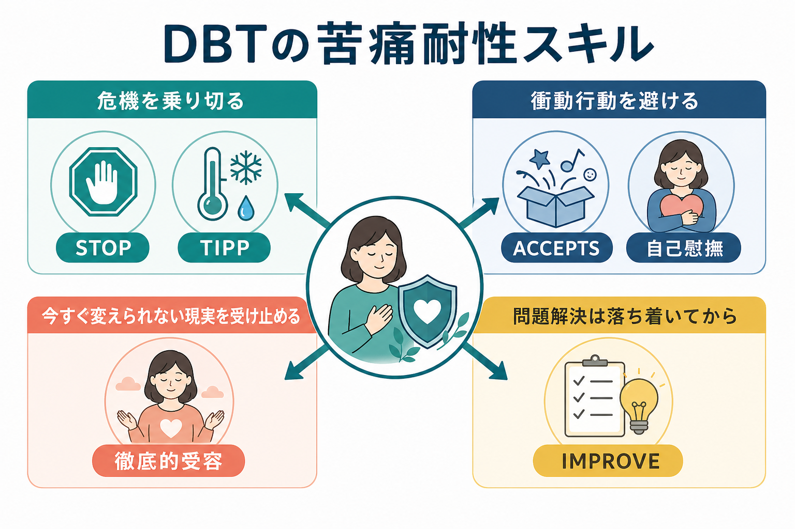
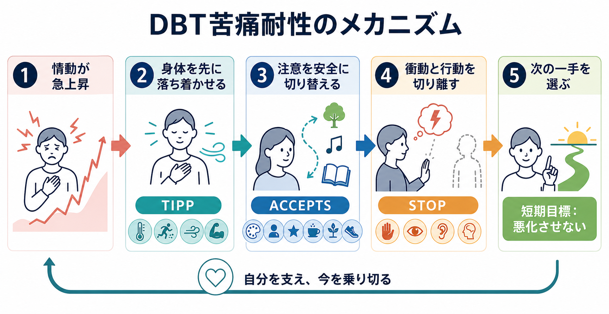
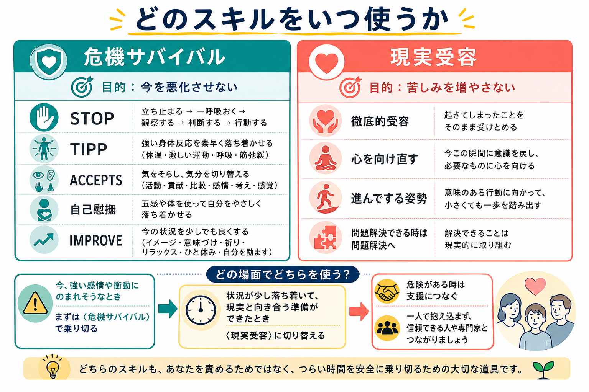

# DBTの苦痛耐性スキルとは何か

## 要点

- DBTの苦痛耐性スキルは、強い苦痛を「すぐ消す」技法ではなく、衝動行動や状況悪化を避けながら危機を通過するための行動スキルである。
- 大きく分けると、今この瞬間を悪化させない「危機サバイバル」と、変えられない現実への抵抗で苦しみを増やさない「現実受容」がある[1]。
- TIPP、STOP、ACCEPTS、自己慰撫、IMPROVEは、情動の急上昇時に[[抑制制御とは何か]]や[[意思決定とは何か]]が働きにくくなる場面で、行動までの時間を稼ぐ道具として使う。
- DBT全体には自傷・自殺関連行動、感情調整、対人機能を改善する根拠が蓄積しているが、苦痛耐性スキル単独の効果を過大評価しないことが重要である[2][3][4]。
- 危険が差し迫るときは、自己対処だけで完結させず、救急、地域資源、主治医、支援者などにつなぐ。

## この記事で答える問い

この記事では、[[弁証法的行動療法DBTとは何か]]の4つの技能モジュールのうち、苦痛耐性スキルに焦点を当てる。問いは3つである。

1. 苦痛耐性スキルは、単なる「我慢」や「気晴らし」と何が違うのか。
2. STOP、TIPP、ACCEPTS、自己慰撫、IMPROVE、徹底的受容は、どの場面で使い分けるのか。
3. 臨床研究の根拠から、どこまで言えるのか。

## まず結論

DBTの苦痛耐性スキルは、「苦しい気持ちをなくしてから行動する」のではなく、「苦しいままでも危険な行動を避け、次に扱える状態まで持ちこたえる」ためのスキルである。危機場面では、感情、身体反応、衝動、解釈が一気に結びつき、短期的には楽になるが長期的には問題を増やす行動が選ばれやすい。そこでDBTは、身体を先に落ち着かせる、注意を一時的に切り替える、五感を使って自分をなだめる、現実への抵抗を緩める、といった具体的な行動単位に分解する[1]。

## 背景

DBTは、もともと自殺関連行動や自傷、感情の急激な変動、対人関係の不安定さを示す人への治療として発展した。治療全体は、個人療法、技能訓練、電話コーチング、治療者チームなど複数要素から構成される[2]。技能訓練には、[[DBTのマインドフルネススキルとは何か]]、[[DBTの感情調整スキルとは何か]]、[[DBTの対人関係スキルとは何か]]、そして苦痛耐性が含まれる[1]。

苦痛耐性が必要になるのは、問題解決を今すぐ行うほどの余裕がない場面である。たとえば、強い怒り、恥、不安、空虚感、見捨てられ感、身体的な緊張が高まり、「すぐ連絡する」「物に当たる」「自分を傷つける」「飲酒・過量服薬・過食などで切る」といった衝動が強くなる状況である。ここでの目標は、問題を根本解決することではなく、被害と悪化を最小化することである。

## 基本概念

### 危機サバイバル

危機サバイバルは、今この瞬間に衝動行動へ進みそうなときの応急処置である。DBT技能訓練マニュアルでは、STOP、TIPP、ACCEPTS、自己慰撫、IMPROVE、長所と短所の検討などが、苦痛耐性モジュールの中心に置かれている[1]。

| スキル | ねらい | 使う場面 |
|---|---|---|
| STOP | 立ち止まり、観察し、意図的に次の行動を選ぶ | メッセージ送信、口論、自傷、逃避行動などの直前 |
| TIPP | 身体反応を素早く下げる | パニック様の高覚醒、怒り、強い身体緊張 |
| ACCEPTS | 注意を一時的に安全な対象へ移す | 今すぐ考え続けるほど悪化する反すう |
| 自己慰撫 | 五感を使って自分を落ち着かせる | 孤立感、緊張、疲労、過覚醒 |
| IMPROVE | イメージ、意味づけ、祈り、リラックス、一つ休み、自分を励ます | 状況を変えにくいが、持ちこたえる必要があるとき |

### 現実受容

現実受容は、「起きたことをよいことだと認める」ことではない。変えられない事実に対して「こんなはずではない」と抵抗し続けることで二次的な苦しみが増えるとき、その抵抗を緩める練習である。代表的には、徹底的受容、心を向け直す、進んでする姿勢がある[1]。

ここで大切なのは、受容と容認を分けることである。被害、暴力、搾取、不当な扱いを「受け入れるべき」という意味ではない。安全確保や支援要請が必要な状況では、現実受容は「これは起きている」と認めたうえで、より有効な行動へ移るための土台になる。

## 仕組み

危機場面では、出来事そのものだけでなく、解釈、身体反応、衝動、記憶、対人文脈が連鎖する。[[内受容感覚とは何か]]の変化が「耐えられない」という解釈を強め、[[実行機能とは何か]]が担う抑制や切り替えが働きにくくなる。苦痛耐性スキルは、この連鎖を完全に止めるのではなく、途中に介入点を作る。

### 1. 身体から入る

TIPPは、温度、強い運動、ペース呼吸、筋弛緩などを使い、高い覚醒状態を先に下げるためのスキルである[1]。これは「考え方を変えれば落ち着く」という発想とは逆で、考えられる状態を作るために身体から介入する。危機の最中に長い認知的検討を求めるより、短く具体的な行動に落とし込む点が実用的である。

### 2. 衝動と行動を切り離す

STOPは、衝動があることを否定せず、行動までの間に一拍置くスキルである。これは[[意思決定とは何か]]でいう即時報酬への偏りを弱め、次に何が起きるかを短く見積もる時間を作る。重要なのは、衝動を消すことではなく、「衝動がある」と「その通りに行動する」を分けることである。

### 3. 注意を安全に切り替える

ACCEPTSは、活動、貢献、比較、感情、考え、感覚などを使って、一時的に注意を移すスキルである[1]。これは問題から逃げ続けるためではなく、問題解決に戻れる状態まで過覚醒を下げるために使う。したがって、必要な支払い、連絡、受診、安全確保をいつまでも先延ばしにする使い方は、苦痛耐性ではなく回避になりうる。

### 4. 現実への抵抗を減らす

徹底的受容は、現実を好きになることではなく、現実と戦うことに使っているエネルギーを、有効な行動へ戻す練習である。[[ACTにおける心理的柔軟性とは何か]]とも近いが、DBTでは危機行動を減らす治療階層や行動分析と結びつけて扱われる点が特徴である。

## 図解

危機サバイバルと現実受容は、同じ苦痛耐性でも使うタイミングが異なる。強い感情や衝動にのまれそうなときは、まず危機サバイバルで悪化を防ぐ。少し落ち着き、状況そのものをすぐには変えられないと見えてきたら、現実受容に切り替える。問題解決できる条件がそろっているなら、苦痛耐性に留まり続けるより、問題解決へ進む。

## 臨床・研究との接続

DBT全体については、境界性パーソナリティ症に対する心理療法研究の中で比較的多く検討されている。LinehanらのRCTでは、自殺関連行動の高い境界性パーソナリティ症の女性を対象に、DBTが専門家による治療と比較され、自殺企図、救急利用、治療継続などで有利な結果が報告された[2]。また、DBTの構成要素を比較した研究では、技能訓練を含む条件が自殺企図や非自殺性自傷、抑うつ、危機サービス利用の低下と関連していた[3]。

系統的レビューでは、心理療法全体が通常治療に比べて境界性パーソナリティ症状や自傷を減らす可能性が示され、DBTは研究数の多い治療の一つとされる。ただし、効果の確実性はアウトカムによって異なり、エビデンスの質が低い領域もある[4]。NICEガイドラインは、女性で境界性パーソナリティ症があり、反復する自傷の低減が優先される場合に、包括的なDBTプログラムを考慮するよう勧めている[5]。

苦痛耐性スキルそのものについては、DBT全体の効果から間接的に意味づけられる部分が大きい。一方、技能使用が治療変化の媒介要因となる可能性を示す研究や、境界性パーソナリティ症以外の感情調整困難を対象にDBT技能訓練を検討した小規模RCTもある[6][7]。したがって、この記事の実用的な結論は「技能は有望で臨床的に広く使われるが、自己流の単独介入として万能視しない」である。

## よくある誤解

### 苦痛耐性は、ただ我慢することではない

我慢はしばしば、何もせず耐えることを意味する。DBTの苦痛耐性は、身体、注意、感覚、行動、受容を使って、危険な行動を避けるために能動的に行う。

### 気晴らしは逃避だから悪い、とは限らない

ACCEPTSのような注意転換は、問題解決を永遠に避けるためではなく、危機のピークを越えるために使う。使ったあとに、必要なら問題解決、相談、治療計画の見直しへ戻る。

### 徹底的受容は、ひどい状況を許すことではない

受容は「起きていることを起きていると認める」ことであり、不当な扱いを正当化することではない。安全が脅かされている場合は、受容より先に安全確保と支援要請が優先される。

### スキルは危機の最中だけ練習すればよい、ではない

危機の最中に初めて使うと、手順を思い出すだけで負荷が高い。平時に短く練習し、自分に合う感覚刺激、呼吸、注意転換、支援先をリスト化しておくほうが使いやすい。

## 関連ノート

- [[弁証法的行動療法DBTとは何か]]
- [[DBTのマインドフルネススキルとは何か]]
- [[DBTの感情調整スキルとは何か]]
- [[DBTの対人関係スキルとは何か]]
- [[心理療法とは何か]]
- [[認知行動療法CBTとは何か]]
- [[抑制制御とは何か]]
- [[内受容感覚とは何か]]

MOC更新候補: [[MOC｜臨床実践・治療]]

## 理解チェック

1. 苦痛耐性スキルの短期目標は、苦痛をゼロにすることではなく何を防ぐことか。
2. TIPPのような身体介入は、どのような状態で特に役立つか。
3. ACCEPTSと回避行動は、どこで区別できるか。
4. 徹底的受容は、なぜ「容認」や「あきらめ」と同じではないのか。
5. 危険が差し迫る場合、自己対処より優先すべき行動は何か。

## 参考文献

[1] Linehan, M. M. (2025). *DBT Skills Training Manual: Revised Edition*. Guilford Press. https://www.guilford.com/books/DBT-Skills-Training-Manual/Marsha-Linehan/9781462556359

[2] Linehan, M. M., Comtois, K. A., Murray, A. M., Brown, M. Z., Gallop, R. J., Heard, H. L., Korslund, K. E., Tutek, D. A., Reynolds, S. K., & Lindenboim, N. (2006). Two-year randomized controlled trial and follow-up of dialectical behavior therapy vs therapy by experts for suicidal behaviors and borderline personality disorder. *Archives of General Psychiatry, 63*(7), 757-766. https://doi.org/10.1001/archpsyc.63.7.757

[3] Linehan, M. M., Korslund, K. E., Harned, M. S., Gallop, R. J., Lungu, A., Neacsiu, A. D., McDavid, J., Comtois, K. A., & Murray-Gregory, A. M. (2015). Dialectical behavior therapy for high suicide risk in individuals with borderline personality disorder: A randomized clinical trial and component analysis. *JAMA Psychiatry, 72*(5), 475-482. https://doi.org/10.1001/jamapsychiatry.2014.3039

[4] Storebø, O. J., Stoffers-Winterling, J. M., Völlm, B. A., Kongerslev, M. T., Mattivi, J. T., Jørgensen, M. S., Faltinsen, E., Todorovac, A., Sales, C. P., Callesen, H. E., Lieb, K., & Simonsen, E. (2020). Psychological therapies for people with borderline personality disorder. *Cochrane Database of Systematic Reviews*, CD012955. https://www.cochrane.org/CD012955/BEHAV_psychological-therapies-people-borderline-personality-disorder

[5] National Institute for Health and Care Excellence. (2009). *Borderline personality disorder: recognition and management* (CG78). https://www.ncbi.nlm.nih.gov/books/n/nicecg78/

[6] Neacsiu, A. D., Rizvi, S. L., & Linehan, M. M. (2010). Dialectical behavior therapy skills use as a mediator and outcome of treatment for borderline personality disorder. *Behaviour Research and Therapy, 48*(9), 832-839. https://doi.org/10.1016/j.brat.2010.05.017

[7] Neacsiu, A. D., Eberle, J. W., Kramer, R., Wiesmann, T., & Linehan, M. M. (2014). Dialectical behavior therapy skills for transdiagnostic emotion dysregulation: A pilot randomized controlled trial. *Behaviour Research and Therapy, 59*, 40-51. https://doi.org/10.1016/j.brat.2014.05.005

## 未解決問題

- 苦痛耐性モジュール単独の効果、TIPPやACCEPTSなど個別スキルの相対的効果は、DBT全体に比べてまだ検討が少ない。
- 日本語圏の臨床実装では、文化的に自然な自己慰撫、支援要請、危機計画の作り方をさらに整理する必要がある。
- デジタルツールや短期介入で技能練習をどう支援するかは、今後の研究課題である。
