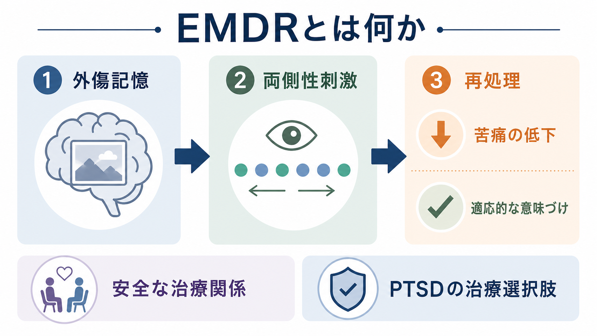
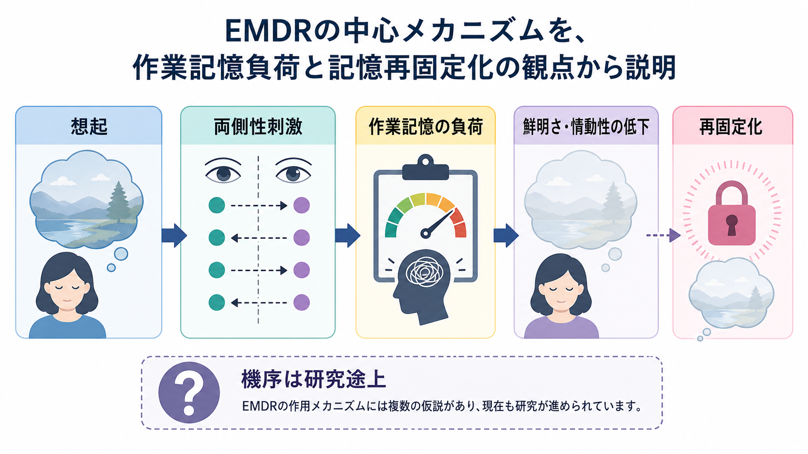
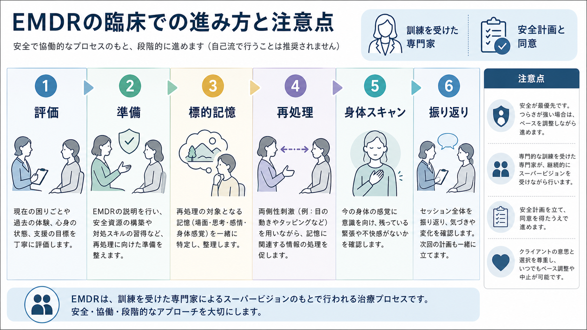

# EMDRとは何か

## 要点

- EMDR（Eye Movement Desensitization and Reprocessing）は、外傷記憶を想起しながら眼球運動、タッピング、音刺激などの両側性刺激を用い、記憶に結びついた苦痛・身体感覚・否定的信念の再処理を促す心理療法である[1]。
- PTSDに対する心理療法として、NICEやVA/DoDなどのガイドラインで、トラウマ焦点化心理療法の一つとして位置づけられている[3][4]。
- 中核は「つらい記憶を消す」ことではなく、現在の安全を保ちながら、記憶の鮮明さ・情動性・自己評価への影響を変え、より適応的に想起できる状態を目指すことである[2][3]。
- 作用機序には作業記憶負荷、定位反応、記憶再固定化、情動調整など複数の仮説がある。眼球運動が記憶の鮮明さや情動性を下げる実験知見はあるが、臨床効果の全体を一つの機序だけで説明する段階ではない[7][8]。
- 実施には評価、準備、安全計画、同意、専門的訓練、スーパービジョンが重要であり、自己流の再体験作業として行うものではない[3][4]。

## この記事で答える問い

1. EMDRは、何を対象に、どのような手順で行う心理療法なのか。
2. 眼球運動や両側性刺激は、外傷記憶の処理にどのように関わると考えられているのか。
3. PTSD治療の中で、EMDRはどの程度エビデンスに支えられているのか。
4. 臨床で使うとき、どのような誤解と注意点があるのか。

## まず結論

EMDRは、[[PTSDとは何か|PTSD]]や外傷関連症状に対して用いられる、トラウマ焦点化心理療法の一種である。クライエントは治療者と一緒に、安全性を確認しながら、苦痛を伴う記憶、その記憶に結びついた否定的な自己信念、情動、身体感覚を扱う。その際、治療者が左右の眼球運動、左右交互のタッピング、音刺激などを用いる。これにより、記憶そのものを消去するのではなく、記憶を思い出したときの「いまも危険である」「自分は無力だ」といった反応が弱まり、現在の文脈の中で想起できるようになることを目指す[1][3]。

ガイドライン上は、EMDRはPTSDに対する有力な治療選択肢の一つである。NICEは、非戦闘関連トラウマ後3か月を超えてPTSD症状が続く成人にEMDRを提供すること、また成人EMDRは訓練を受けた実践者が、妥当なマニュアルに基づき、段階的に行うことを推奨している[3]。VA/DoD 2023年ガイドラインも、個人のトラウマ焦点化心理療法を重視し、EMDRを推奨される治療群の中に位置づけている[4]。

一方で、EMDRを「眼を動かすだけの治療」「一回でトラウマが消える技法」と理解するのは不正確である。治療関係、評価、準備、標的記憶の同定、再処理、安全確認、振り返りを含む一連の心理療法として理解する必要がある[2][3]。

## 背景

EMDRは、1980年代末にFrancine Shapiroが外傷記憶への眼球運動手続きを報告したことから発展した[1]。初期には「眼球運動による脱感作」として注目されたが、その後は、外傷記憶に結びついた認知・感情・身体感覚・行動傾向を再処理する包括的な治療モデルとして整理されてきた。

PTSDでは、外傷体験が「過去の出来事」として十分に文脈化されず、フラッシュバック、悪夢、回避、過覚醒、否定的な信念として現在に侵入することがある。これは[[フラッシュバックとは何か|フラッシュバック]]や[[解離とは何か|解離]]、身体反応を伴うことがあり、単なる「思い出」ではなく、現在の脅威反応として経験される。EMDRは、このような記憶の再体験性と情動負荷を、治療者との協働的な枠組みの中で扱う。

WHOのストレス関連状態ガイドラインは、PTSDへの心理的介入としてトラウマ焦点化CBTとEMDRを取り上げ、非専門領域でも安全な導入と紹介体制を重視している[2]。したがってEMDRは、特殊な単独技法というより、PTSD治療体系の中に置かれた専門的心理療法として読むのがよい。

## 基本概念

### 外傷記憶

EMDRで扱う「標的記憶」は、出来事の映像だけではない。典型的には、最も苦痛な場面、否定的な自己認知、望ましい肯定的認知、感情、身体感覚、苦痛度が一緒に評価される。ここで重要なのは、記憶を詳細に語り尽くすことではなく、現在の症状や生活上の困難と結びついている記憶ネットワークを安全に扱える形で同定することである[3]。

### 両側性刺激

両側性刺激とは、左右交互に注意を向ける刺激である。代表例は眼球運動だが、視覚障害、疲労、好み、臨床状態によって、左右交互のタッピングや音刺激が使われることもある。NICEは、成人EMDRでは通常眼球運動を用いるが、必要に応じてタップや音などの方法も用いられると記述している[3]。

### 再処理

再処理とは、外傷記憶を「なかったこと」にすることではない。記憶に伴う情動の強さ、身体反応、自己評価、現在の危険感が変化し、過去の出来事として想起しやすくなる過程を指す。これは[[記憶の固定化とは何か|記憶の固定化]]や再固定化の議論とも接続するが、臨床的なEMDR効果を記憶再固定化だけで説明できるわけではない。

## 仕組み

EMDRの機序は一枚岩ではない。現在よく議論される説明の一つは、作業記憶負荷仮説である。人は外傷記憶をありありと思い出すとき、視覚イメージ、感情、身体感覚を保持するために作業記憶資源を使う。同時に眼球運動などの課題を行うと、同じ限られた資源が分割され、記憶イメージの鮮明さや情動性が下がると考えられる[7]。

実験研究では、嫌悪的な自伝的記憶を想起しながら眼球運動を行うと、想起のみの場合に比べて記憶の鮮明さや情動性が低下することが示されている[8]。ただし、実験室での短時間の記憶変化と、複雑なPTSD症状の臨床改善は同一ではない。臨床での変化には、治療関係、安全感、心理教育、回避の低下、意味づけの更新、身体反応への注意、セッション間の生活変化も関わる。

作業記憶負荷仮説は、眼球運動が「魔法の刺激」ではなく、想起中の記憶表象を変化させる認知的条件として働く可能性を示す。一方で、定位反応、REM睡眠との類似、注意の柔軟化、予測誤差、記憶再固定化などの説明も提案されている。現時点では、EMDRの臨床効果を支える十分なエビデンスはあるが、作用機序については複数仮説が併存している、と整理するのが慎重である[6][8]。

## 図解

EMDRを臨床プロセスとして見ると、次のような流れになる。

1. 評価：PTSD症状、併存症状、自殺リスク、解離、物質使用、生活上の安全、治療希望を確認する。
2. 準備：心理教育、安定化、感情調整、安全計画、治療同意を整える。
3. 標的記憶：現在の症状と結びつく記憶、否定的認知、望ましい認知、感情、身体感覚を選ぶ。
4. 再処理：記憶を想起しながら、眼球運動などの両側性刺激を用い、変化を短いセットごとに確認する。
5. 身体スキャン：記憶に関連する身体の緊張や違和感が残っていないか確認する。
6. 振り返り：セッション後の反応、安全、次回までの過ごし方を確認する。

この流れは説明のための単純化であり、実際の治療では準備や安定化に多くの時間をかける場合がある。複数のトラウマ、複雑性PTSD、強い解離、現在進行形の暴力や危機がある場合には、単純な標的記憶の再処理だけでは不十分であり、治療計画全体の調整が必要になる。

## 臨床・研究との接続

EMDRは、PTSDに対する心理療法研究の中で比較的強いエビデンスを持つ。Cochraneレビューでは、慢性PTSDの成人に対して、個人トラウマ焦点化CBTとEMDRが待機・通常ケアより有効であり、EMDRも有効な心理療法群に含まれるとまとめられている。ただし、研究の質にはばらつきがあり、害や悪化に関する証拠は十分ではないとされる[5]。

より新しい個人参加者データ・メタ分析では、成人PTSDに対するEMDRと他の心理療法を比較し、症状低減、反応、寛解、脱落を検討している。こうした研究は、EMDRを「効くか効かないか」だけでなく、「どの患者、どの比較条件、どのアウトカムに対して、どの程度有効か」という問いへ進めている[6]。

臨床上は、[[トラウマ焦点化認知行動療法とは何か|トラウマ焦点化認知行動療法]]、認知処理療法、持続エクスポージャー、ナラティブ・エクスポージャー・セラピーなどと同じく、PTSD治療の選択肢として比較検討される。選択では、症状の性質、回避の強さ、語ることへの抵抗、解離、併存するうつ・物質使用・自傷リスク、文化的背景、治療者の訓練、本人の希望を考える。

重要なのは、EMDRが他の心理療法より常に優れていると断定しないことである。ガイドラインは、個別の臨床判断を置き換えるものではなく、治療者と本人が、根拠、希望、リスク、利用可能性を照合するための枠組みである[4]。[[心理療法とは何か|心理療法]]全般と同じく、治療同盟、安全性、アウトカム確認、必要時の方針変更が不可欠である。

## よくある誤解

### 誤解1: EMDRは眼球運動だけで成立する

眼球運動は特徴的な要素だが、EMDRは眼球運動だけの技法ではない。評価、準備、標的記憶の選定、再処理、肯定的認知の導入、身体感覚の確認、終結、再評価を含む構造化された心理療法である[3]。

### 誤解2: 外傷記憶を消す治療である

EMDRは記憶そのものの削除を目的にしない。目標は、記憶を思い出しても現在の安全や自己評価が過度に脅かされず、過去の出来事として位置づけられるようにすることである。

### 誤解3: 誰にでも短期間で効く

PTSDへの有効性は支持されるが、効果の大きさ、必要な回数、脱落、悪化リスクは個人差がある。複雑なトラウマ歴、強い解離、現在の危機、併存症状がある場合は、長い準備や別の支援が必要になることがある[5][6]。

### 誤解4: 自分でつらい記憶を思い出しながら眼を動かせばよい

これは危険な単純化である。外傷記憶の想起は、強い再体験、解離、自己傷害衝動、睡眠悪化を引き起こすことがある。EMDRは、訓練を受けた専門家が、同意と安全計画のもとで行う治療として理解する必要がある[3][4]。

## 関連ノート

- [[PTSDとは何か]]
- [[複雑性PTSDとは何か]]
- [[トラウマ焦点化認知行動療法とは何か]]
- [[心理療法とは何か]]
- [[フラッシュバックとは何か]]
- [[解離とは何か]]
- [[記憶の固定化とは何か]]

## 関連ノート候補

- 「認知処理療法CPTとは何か」
- 「持続エクスポージャー療法とは何か」
- 「ナラティブ・エクスポージャー・セラピーとは何か」
- 「トラウマ治療における安定化とは何か」
- 「両側性刺激とは何か」

## MOC更新候補

- `content/00_MOC/MOC・臨床実践・治療.md`
- `content/00_MOC/MOC・精神医学.md`

## 理解チェック

1. EMDRが「記憶を消す治療」ではなく「記憶の想起のされ方を変える治療」と言える理由を説明できるか。
2. 眼球運動などの両側性刺激が、作業記憶負荷仮説ではどのように説明されるか。
3. EMDRを自己流で行うことが推奨されない理由を、安全性、解離、再体験の観点から説明できるか。
4. EMDRとトラウマ焦点化CBTを、共通点と相違点に分けて整理できるか。

## 未解決問題

- EMDRの臨床効果のうち、両側性刺激そのものが担う部分と、トラウマ焦点化心理療法に共通する部分をどのように分離して評価できるか。
- 複雑性PTSD、発達性トラウマ、強い解離を伴うケースで、どの準備・安定化・再処理順序が最も安全で有効か。
- 眼球運動、タッピング、音刺激の違いが、作業記憶負荷、受容性、脱落率、長期転帰にどう影響するか。
- 神経画像や生理指標を、個人の治療反応予測にどこまで使えるか。

## 参考文献

[1] Shapiro, F. (1989). Eye movement desensitization: A new treatment for post-traumatic stress disorder. *Journal of Behavior Therapy and Experimental Psychiatry*, 20(3), 211-217. https://doi.org/10.1016/0005-7916(89)90025-6

[2] World Health Organization. (2013). *Guidelines for the management of conditions specifically related to stress*. World Health Organization. https://www.who.int/publications/i/item/9789241505406

[3] National Institute for Health and Care Excellence. (2018). *Post-traumatic stress disorder: NICE guideline NG116*. Recommendations 1.6.18-1.6.20. https://www.nice.org.uk/guidance/ng116/chapter/1-Recommendations

[4] Department of Veterans Affairs & Department of Defense. (2023). *VA/DoD clinical practice guideline for the management of posttraumatic stress disorder and acute stress disorder*. https://www.healthquality.va.gov/guidelines/mh/ptsd/

[5] Bisson, J. I., Roberts, N. P., Andrew, M., Cooper, R., & Lewis, C. (2013). Psychological therapies for chronic post-traumatic stress disorder (PTSD) in adults. *Cochrane Database of Systematic Reviews*, CD003388. https://doi.org/10.1002/14651858.CD003388.pub4

[6] Wright, S. L., Karyotaki, E., Cuijpers, P., Bisson, J., Papola, D., Witteveen, A., Suliman, S., Spies, G., Ahmadi, K., Capezzani, L., Carletto, S., Karatzias, T., Kullack, C., Laugharne, J., Lee, C. W., Nijdam, M. J., Olff, M., Ostacoli, L., Seedat, S., & Sijbrandij, M. (2024). EMDR v. other psychological therapies for PTSD: A systematic review and individual participant data meta-analysis. *Psychological Medicine*, 54(8), 1580-1588. https://doi.org/10.1017/S0033291723003446

[7] van den Hout, M. A., Engelhard, I. M., Rijkeboer, M. M., Koekebakker, J., Hornsveld, H., Leer, A., Toffolo, M. B. J., & Akse, N. (2011). EMDR: Eye movements superior to beeps in taxing working memory and reducing vividness of recollections. *Behaviour Research and Therapy*, 49(2), 92-98. https://doi.org/10.1016/j.brat.2010.11.003

[8] Leer, A., Engelhard, I. M., & van den Hout, M. A. (2014). How eye movements in EMDR work: Changes in memory vividness and emotionality. *Journal of Behavior Therapy and Experimental Psychiatry*, 45(3), 396-401. https://doi.org/10.1016/j.jbtep.2014.04.004
