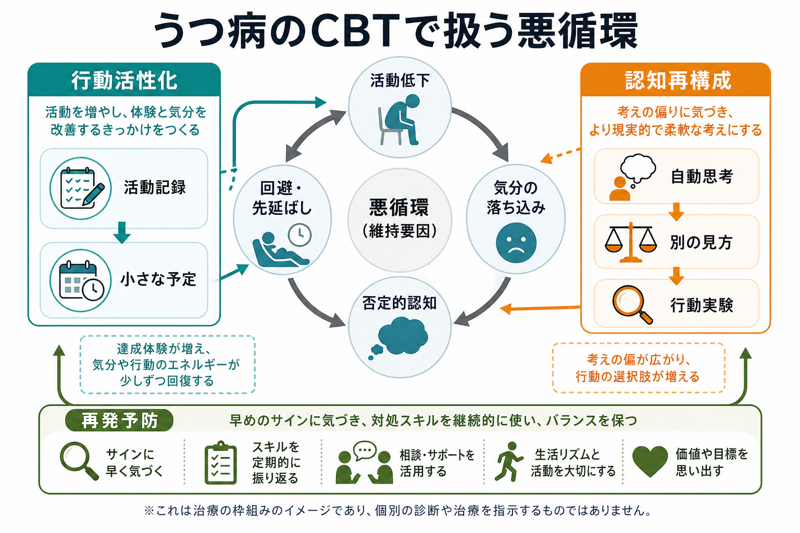
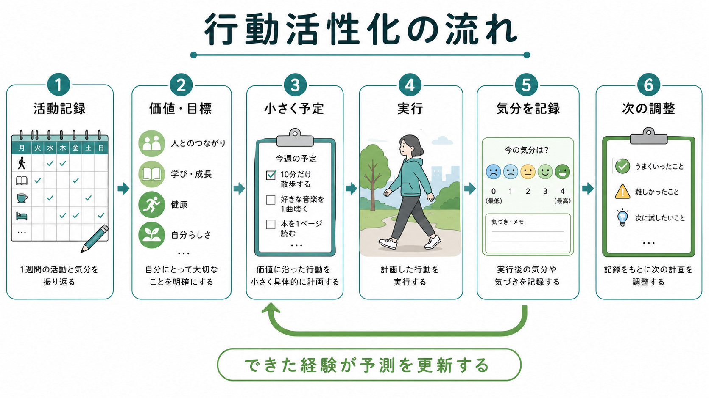
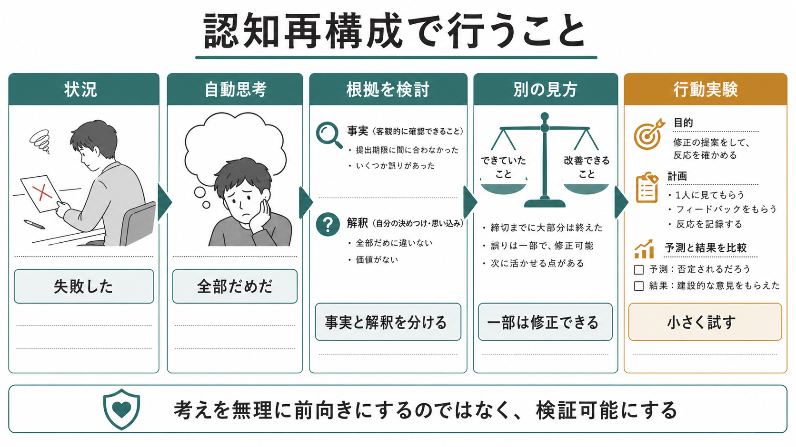

# うつ病のCBTでは何を行うのか

## 要点

- うつ病の認知行動療法（CBT）は、「気分を前向きにする訓練」ではなく、活動、気分、考え、回避、生活上の問題がどのように循環しているかを共同で調べる構造化された心理療法である[1][6]。
- 中心になる作業は、活動低下と報酬経験の減少を扱う[[動機づけとは何か|行動活性化]]、自動思考と解釈の偏りを扱う認知再構成、現実場面で仮説を試す行動実験である[1][4][6]。
- NICE は成人うつ病の治療選択肢として、個人CBT、個人行動活性化、抗うつ薬との併用などを重症度や希望に応じて提示している[1]。ACP も急性期の大うつ病に対して、CBT または第二世代抗うつ薬を初期治療の選択肢として推奨している[2]。
- CBT は有効性の研究が多いが、どの技法が、誰に、どの形式で、どの程度役立つかは個別評価が必要である[3]。この記事は教育・研究目的の整理であり、個別の診断や治療指示ではない。

## この記事で答える問い

この記事では、[[うつ病とは何か]]を背景に、うつ病のCBTで実際に何を扱うのかを説明する。特に次の問いに答える。

1. うつ病のCBTは、活動低下と否定的認知の悪循環をどう見立てるのか。
2. 行動活性化では、何を記録し、どう活動を増やすのか。
3. 認知再構成では、否定的な考えをどう扱うのか。
4. 治療終結や再発予防では、何を整理するのか。

## まず結論

うつ病のCBTでは、症状を「気分だけの問題」として扱わない。気分が落ちると、外出、仕事、家事、人との連絡、楽しみ、休息のリズムが崩れやすい。活動が減ると、達成感や楽しさ、他者からの反応、問題解決の機会も減る。その結果、「自分はだめだ」「何をしても無駄だ」「迷惑をかけている」といった自動思考が強まり、さらに回避や先延ばしが増える。

CBTはこの悪循環を、面接室内の会話だけで解くのではなく、日常生活の記録、活動計画、思考記録、行動実験、宿題、振り返りを通して少しずつ検証する。つまり、本人と治療者が「何が維持要因になっているか」「どこから変えると現実的か」を共同で調べる方法である[1][6][7]。

## 背景

うつ病では、抑うつ気分や興味・喜びの低下だけでなく、疲労、睡眠、食欲、集中困難、罪責感、希死念慮、精神運動の変化などが問題になる。こうした症状は、生活機能を下げ、生活機能の低下がさらに気分や自己評価を悪化させる。したがって心理療法では、「なぜ落ち込むのか」を抽象的に考えるだけでなく、「落ち込んだ日に何が減り、何が増えたか」を具体的に見る必要がある。

NICE の成人うつ病ガイドラインでは、CBTは、思考、信念、態度、感情、行動の相互作用を扱い、現在の問題を目標志向的・構造化された形で扱う治療として整理されている[1]。また、行動活性化は、活動と気分のつながりを同定し、活動のモニタリングとスケジューリングを含む治療として位置づけられている[1][4]。

## 基本概念

### 活動低下

うつ病では、「やる気が出たら動く」と待っているうちに活動がさらに減ることがある。行動活性化では、気分の改善を待ってから動くのではなく、生活の中に小さく実行可能な活動を戻し、活動と気分の関係を観察する。これは単なる気合いではなく、活動、報酬、回避、生活文脈の関係を扱う技法である[4][5]。

### 自動思考

自動思考とは、ある状況で瞬間的に浮かぶ評価や解釈である。たとえば、メールの返信が遅いときに「嫌われた」、仕事でミスをしたときに「全部終わりだ」と感じるような考えである。認知再構成では、この考えを否定したり、無理に前向きにしたりするのではなく、事実、解釈、根拠、別の見方、試せる行動に分ける[6]。

### 回避と先延ばし

回避は短期的には不快感を下げるが、長期的には問題を大きくし、自己効力感を下げることがある。CBTでは、回避を責めるのではなく、「何を避けると一時的に楽になるか」「その結果、何が失われるか」を一緒に調べる。これは[[認知バイアスとは何か]]で扱うような解釈の偏りとも関係する。

## 仕組み

### 1. アセスメントとケースフォーミュレーション

最初に行うのは、症状、生活機能、リスク、既往歴、服薬、身体疾患、睡眠、仕事や家庭の負荷、支援資源を把握することである。希死念慮や自傷リスクがある場合は、安全確保と専門的評価が優先される。CBTは万能の単独介入ではなく、薬物療法、休職・復職支援、家族支援、社会資源と組み合わせて考えることが多い[1][2]。休職や職場復帰が焦点になる場合は、[[精神科における休職復職支援とは何か]]とも接続する。

ケースフォーミュレーションでは、次のような形で悪循環を図式化する。

| 領域 | 例 | CBTで見る点 |
|---|---|---|
| 状況 | 仕事の遅れ、孤立、睡眠不足 | 何が引き金か |
| 気分 | 抑うつ、不安、焦り | 強さと変化 |
| 身体 | 疲労、頭痛、睡眠リズム | 身体疾患や薬剤も含める |
| 思考 | 「全部だめだ」「迷惑だ」 | 自動思考と根拠 |
| 行動 | 回避、寝込む、連絡しない | 短期効果と長期効果 |
| 結果 | 達成感低下、問題増大 | 悪循環の維持要因 |

### 2. 行動活性化

行動活性化では、活動記録を使って、どの活動が気分、疲労、達成感、楽しさ、価値感と関係するかを観察する。ここで重要なのは、「楽しいことを増やせばよい」と単純化しないことである。うつ病では楽しさを感じにくいことがあり、最初は「少しだけ生活が整う」「先延ばしが少し減る」「自分にとって大事な方向に1歩近づく」程度を目標にする。

Cochraneレビューでは、行動活性化は通常ケアより短期的に有効である可能性があり、CBTとの比較では短期効果に明確な差は示されなかった。ただし、エビデンスの確実性には限界があり、長期効果や比較条件によって解釈は変わる[4]。古典的な成分分析研究でも、行動活性化を含む構成要素が、完全な認知療法と同程度の急性期・短期追跡効果を示したことが報告されている[5]。

### 3. 認知再構成

認知再構成では、状況、気分、自動思考、根拠、別の見方、行動の結果を整理する。たとえば「提出が遅れた」という状況に対して、「全部だめだ」「信頼を失った」と考えた場合、事実と解釈を分ける。事実は「提出が遅れた」「修正依頼が来た」かもしれない。一方、「全部だめだ」は解釈であり、他の説明や修正可能な部分を検討できる。

ここで目標になるのは、楽観的な言葉を唱えることではない。むしろ、考えを検証可能にすることである。「自分は絶対に嫌われた」という考えなら、どの事実がそれを支持し、どの事実が別の可能性を示すかを検討する。必要に応じて、短い確認、相談、再提出、休息後の再評価など、行動実験として試す[6]。

### 4. 宿題と行動実験

CBTでは、面接で理解したことを生活場面で試す。宿題には、活動記録、気分記録、思考記録、予定表、段階的な行動実験、問題解決のメモなどが含まれる。宿題は「できなかったら失敗」ではなく、できなかった理由もデータになる。課題が大きすぎた、タイミングが悪かった、疲労が強かった、支援が足りなかった、予測が強すぎたなど、次の調整材料として扱う。

CBTにおける宿題の効果を扱ったメタ解析では、宿題を含む治療や宿題遵守と治療成果の関連が支持されている。ただし、宿題は治療者が一方的に出す課題ではなく、本人の状況、価値、負担、リスクに合わせて共同で設計する必要がある[7]。

### 5. 再発予防

治療後半では、症状が悪化しやすい早期サイン、役立った対処、避けたい悪循環、支援先を整理する。再発予防は「二度と落ち込まない方法」を作ることではない。むしろ、落ち込みの初期に気づき、活動低下、睡眠の乱れ、孤立、自己批判、先延ばしが再び強くなる前に、調整できる選択肢を増やす作業である。

NICEのガイドラインも、うつ病治療では再発予防や慢性症状への対応を治療管理の一部として扱っている[1]。研究上も、急性期の症状改善だけでなく、残遺症状、再燃・再発、生活機能、治療継続性を評価する必要がある。

## 図解

この記事で作成した3枚の図は、次の役割で読むと理解しやすい。

| 図 | 主題 | 読み方 |
|---|---|---|
| 図1 | 活動低下、気分、否定的認知、回避の悪循環 | CBTがどこに介入するかを見る |
| 図2 | 行動活性化 | 活動記録、価値、予定、実行、記録、調整の循環を見る |
| 図3 | 認知再構成 | 自動思考を事実・解釈・根拠・別の見方・行動実験に分ける |

## 臨床・研究との接続

臨床では、CBTは診断名だけで自動的に選ぶものではない。重症度、希死念慮、精神病症状、双極性障害の可能性、物質使用、発達特性、身体疾患、薬物療法への反応、家庭や職場の環境、治療への希望を含めて判断する。とくに強い希死念慮、著しい食事・睡眠の破綻、精神病症状、躁状態が疑われる場合は、CBTの技法以前に安全評価と医学的介入が優先される。

研究では、CBTはうつ病に対する心理療法の中でも試験数が多い。成人うつ病を対象にした包括的メタ解析では、CBTは対照条件と比べて有効であり、薬物療法や他の心理療法との比較では研究条件によって差が小さいことも示されている[3]。そのため、実践上は「CBTか薬物療法か」という二分法より、本人の希望、利用可能性、副作用、費用、併存症、生活上の制約を踏まえた選択が重要である[1][2][3]。

## よくある誤解

### 誤解1: CBTは「ポジティブ思考」の訓練である

これは不正確である。CBTは、否定的な考えを無理に明るく置き換えるのではなく、事実と解釈を分け、別の見方を検討し、行動実験で確かめる。結果として考えが柔軟になることはあるが、目的は現実を無視した楽観ではない[6]。

### 誤解2: 行動活性化は「頑張って外に出る」ことである

行動活性化は、気合いで活動量を増やす方法ではない。活動記録、価値の確認、段階づけ、実行可能性、疲労、失敗時の調整を含む。活動量を増やすだけでなく、回避を減らし、生活の中で意味や達成感が戻る条件を探す[4]。

### 誤解3: CBTは薬物療法と対立する

CBTと薬物療法は対立概念ではない。NICEは、状態や希望に応じて個人CBT、行動活性化、抗うつ薬、併用などを選択肢として示している[1]。ACPも、急性期の大うつ病でCBTまたは第二世代抗うつ薬を初期治療として検討し、併用も選択肢とする[2]。

### 誤解4: 宿題ができない人にはCBTは向かない

宿題ができないこと自体が、疲労、回避、課題設定、生活環境、自己批判の情報になる。CBTでは、できなかった理由を責めるのではなく、課題を小さくする、タイミングを変える、支援を加える、目的を明確にするなどの調整を行う。

## 関連ノート

- [[うつ病とは何か]]
- [[認知バイアスとは何か]]
- [[動機づけとは何か]]
- [[精神科における休職復職支援とは何か]]

### 関連ノート候補

- 行動活性化とは何か
- 認知再構成とは何か
- 自動思考とは何か
- CBTの行動実験とは何か
- うつ病の再発予防では何を行うのか

### MOC更新候補

- `content/00_MOC/` 配下の臨床実践・心理療法関連MOCに、`[[うつ病のCBTでは何を行うのか]]` を追加する。
- 並列ジョブとの衝突を避けるため、本ジョブではMOC本体は更新しない。

## 理解チェック

1. うつ病のCBTで、活動低下が気分や認知に影響するとはどういうことか。
2. 行動活性化で「楽しい活動」だけでなく「価値に沿った小さな活動」を扱う理由は何か。
3. 認知再構成が「ポジティブ思考」と違う点は何か。
4. 宿題ができなかったとき、それをどのように治療上のデータとして扱えるか。
5. CBTと薬物療法を二分法で考えることの限界は何か。

## 参考文献

[1] National Institute for Health and Care Excellence. (2022). *Depression in adults: treatment and management* (NICE guideline NG222). Published June 29, 2022; last reviewed January 30, 2026. https://www.nice.org.uk/guidance/ng222

[2] Qaseem, A., Owens, D. K., Etxeandia-Ikobaltzeta, I., Tufte, J., Cross, J. T., Wilt, T. J., & Clinical Guidelines Committee of the American College of Physicians. (2023). Nonpharmacologic and pharmacologic treatments of adults in the acute phase of major depressive disorder: A living clinical guideline from the American College of Physicians. *Annals of Internal Medicine, 176*(2), 239-252. https://doi.org/10.7326/M22-2056

[3] Cuijpers, P., Miguel, C., Harrer, M., Plessen, C. Y., Ciharova, M., Papola, D., Ebert, D. D., & Karyotaki, E. (2023). Cognitive behavior therapy vs. control conditions, other psychotherapies, pharmacotherapies and combined treatment for depression: A comprehensive meta-analysis including 409 trials with 52,702 patients. *World Psychiatry, 22*(1), 105-115. https://doi.org/10.1002/wps.21069

[4] Uphoff, E., Ekers, D., Robertson, L., Dawson, S., Sanger, E., South, E., Samaan, Z., Richards, D., Meader, N., & Churchill, R. (2020). Behavioural activation therapy for depression in adults. *Cochrane Database of Systematic Reviews*, 2020(7), CD013305. https://doi.org/10.1002/14651858.CD013305.pub2

[5] Jacobson, N. S., Dobson, K. S., Truax, P. A., Addis, M. E., Koerner, K., Gollan, J. K., Gortner, E., & Prince, S. E. (1996). A component analysis of cognitive-behavioral treatment for depression. *Journal of Consulting and Clinical Psychology, 64*(2), 295-304. https://doi.org/10.1037/0022-006X.64.2.295

[6] Beck, A. T., Rush, A. J., Shaw, B. F., & Emery, G. (1979). *Cognitive Therapy of Depression*. Guilford Press. https://books.google.com/books/about/Cognitive_Therapy_of_Depression.html?id=L09cRS0xWj0C

[7] Kazantzis, N., Whittington, C. J., & Dattilio, F. M. (2010). Meta-analysis of homework effects in cognitive and behavioral therapy: A replication and extension. *Clinical Psychology: Science and Practice, 17*(2), 144-156. https://doi.org/10.1111/j.1468-2850.2010.01204.x

## 未解決問題

- うつ病のCBTのどの要素が、どの患者群で最も重要な変化機序になるのか。
- 対面、オンライン、集団、ガイド付きセルフヘルプで、活動活性化や認知再構成の効果と継続率はどう変わるのか。
- 残遺症状、慢性うつ病、併存不安、神経発達特性、身体疾患がある場合に、CBTをどのように個別化するのがよいか。
