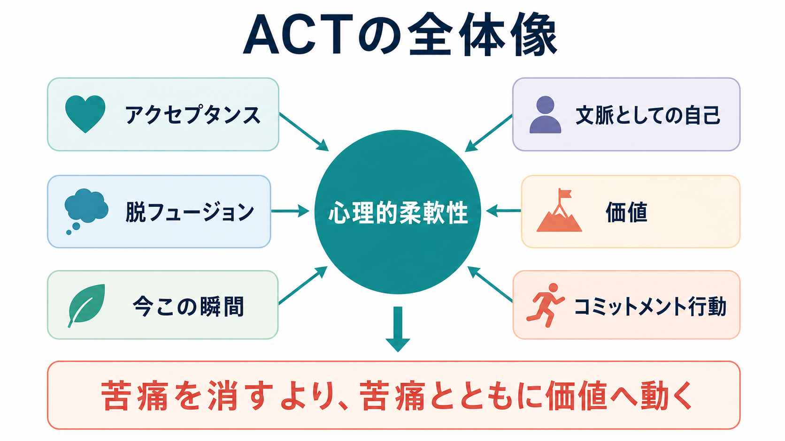
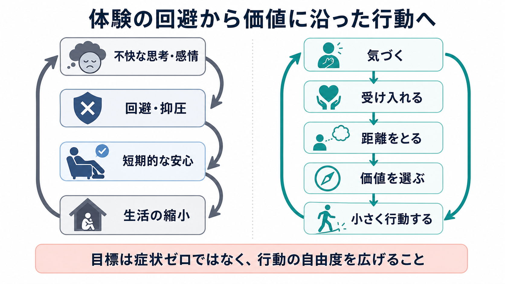
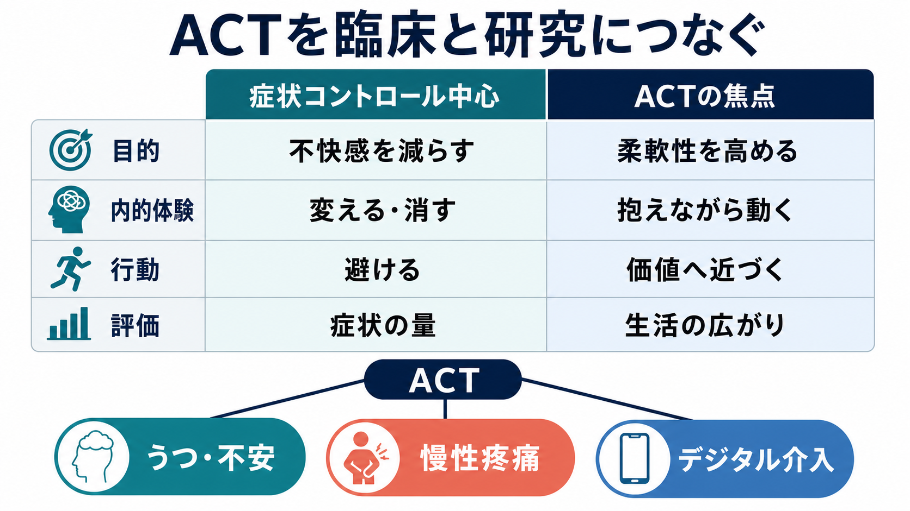

# アクセプタンス&コミットメント・セラピーACTとは何か

## 要点

- アクセプタンス&コミットメント・セラピー（Acceptance and Commitment Therapy: ACT）は、不快な思考・感情・身体感覚をなくすことだけを目標にせず、それらと関わりながら価値に沿った行動を増やす心理療法である[1][2]。
- 中核概念は心理的柔軟性である。これは、今ここで起きている体験に開かれつつ、状況と価値に応じて行動を変える、または続ける能力を指す[2][3]。
- ACTは「症状を気にしない」方法ではない。症状や苦痛が生活を狭める悪循環、特に体験の回避と認知的フュージョンを扱う[1][2]。
- 効果研究では、ACTは多様な精神・身体的問題に対して、待機群や通常治療などより有効なことが多い一方、従来の認知行動療法（CBT）より一貫して優れるとまでは言いにくい[4][5]。
- 慢性疼痛、うつ、不安、ストレス、身体疾患に伴う生活制限などでは、症状の完全消失よりも機能、生活の広がり、価値に沿った行動を評価する視点が重要になる[5][6][7]。

## この記事で答える問い

1. ACTは何を変えようとする心理療法なのか。
2. 体験の回避、認知的フュージョン、心理的柔軟性はどう関係するのか。
3. ACTの6つの中核プロセスは、実際の面接でどのように働くのか。
4. 研究・臨床応用では、どこまで有効性が示され、どこに限界があるのか。

## まず結論

ACTは、「苦痛を消してから生きる」のではなく、「苦痛があっても、自分が大切にしたい方向へ少しずつ動けるようにする」心理療法である。ここでいうアクセプタンスは、あきらめや我慢ではない。避けようとするほど生活を支配してしまう思考、感情、記憶、身体感覚に対し、それらを体験として認めながら、行動の選択肢を取り戻すことである[1][2]。

ACTの臨床的な焦点は、症状の量だけではなく、生活の狭まりである。たとえば「不安を感じないように外出を避ける」「痛みが増えるのが怖くて活動をやめる」「失敗という言葉にのみ込まれて挑戦をやめる」といった反応は、短期的には楽になる。しかし長期的には、[[回避学習とは何か|回避学習]]が強まり、[[行動活性化とは何か|行動]]のレパートリーが縮むことがある。ACTはこの循環に介入する。

## 背景

ACTは、行動療法と認知行動療法の流れの中で発展した、いわゆる第三世代の認知行動療法の一つである。理論的には機能的文脈主義、関係フレーム理論、行動分析、マインドフルネス的な注意訓練と関係している[1][2]。

従来の心理療法では、苦痛を引き起こす思考内容を検討し、より現実的な考え方へ変えることが重視される場合がある。ACTも思考を扱うが、主な問いは「この考えは正しいか」だけではない。「この考えに巻き込まれたとき、生活は広がるか狭まるか」「この反応は自分の価値に近づけるか遠ざけるか」を問う[2]。

このため、ACTは診断名ごとの専用技法というより、問題を横断するプロセスに注目する。うつ、不安、慢性疼痛、依存、ストレス、身体疾患への適応など、異なる問題に見えても、体験の回避、過度な自己批判、価値からの離脱、行動の硬直化が共通して関わることがある[4][5]。

## 基本概念

### 体験の回避

体験の回避とは、不快な思考、感情、記憶、身体感覚を感じないようにするために、生活上重要な行動まで避けてしまう過程である[1][2]。回避そのものは悪ではない。熱いものから手を引く、危険な場所から離れる、休息をとることは適応的である。問題は、内的体験を消すことが最優先になり、仕事、学習、関係、健康行動、創造的活動が長期的に失われる場合である。

### 認知的フュージョン

認知的フュージョンとは、思考を「頭に浮かんだ言葉」ではなく「現実そのもの」「命令」「自分の本質」として扱ってしまう状態である。たとえば「私は失敗者だ」という思考が浮かぶことと、「だから何も始めてはいけない」と行動が縛られることは同じではない。ACTの脱フュージョンは、思考の内容を無理に消すのではなく、思考との距離を少し作る[2][3]。

### 価値

ACTでいう価値は、達成したら終わる目標ではなく、どのように生きたいかという方向である。たとえば「試験に合格する」は目標だが、「学び続ける」「人の役に立つ」「誠実に関わる」は価値である。価値は、[[価値学習とは何か|価値学習]]や[[意思決定とは何か|意思決定]]と関係するが、ACTでは本人の生活文脈に根ざした選択として扱う。

### 心理的柔軟性

心理的柔軟性は、ACTの中核アウトカムである。Hayesらは、現在の瞬間に接触し、価値に役立つときには行動を変える、または持続する能力として整理した[2]。これは「いつも受け入れる」「いつも頑張る」ことではない。避ける、休む、主張する、距離を置く、挑戦するなどを、文脈と価値に応じて選べることを意味する。

## 仕組み

ACTは、心理的柔軟性を高める6つのプロセスを組み合わせる。実際の面接では順番に教えるというより、クライエントの困りごとに応じて行き来する。

| プロセス | 何をするか | 臨床的な狙い |
|---|---|---|
| アクセプタンス | 不快な体験を押しのけず、身体感覚や感情として観察する | 回避で生活が狭まる循環を弱める |
| 脱フュージョン | 思考を事実や命令ではなく、思考として見る | 自己批判や不安予測への巻き込まれを減らす |
| 今この瞬間 | 呼吸、身体、音、行動に注意を戻す | 自動反応ではなく選択の余地を作る |
| 文脈としての自己 | 「私はだめだ」などの内容を観察する視点を育てる | 自己概念への固着をゆるめる |
| 価値 | 大切にしたい方向を言語化する | 行動の基準を症状の有無だけにしない |
| コミットメント行動 | 価値に沿った具体的で小さな行動を計画する | 生活の中で行動レパートリーを広げる |

この仕組みを一つの悪循環として見ると分かりやすい。まず、不快な思考や感情が生じる。次に、それを消すために回避や抑圧を行う。短期的には安心が得られるため、その行動は強化される。しかし、活動、対人関係、学習、仕事、健康行動が減ると、生活の満足や自己効力感が下がり、さらに不快な体験が増える。

ACTはこの循環を、内的体験そのものへの闘争から、行動の自由度へ焦点を移すことで変えようとする。面接では、「不安をなくすにはどうするか」だけでなく、「不安がここにあるまま、今日の自分にできる小さな価値行動は何か」を具体化する。これは精神論ではなく、強化、回避、注意、言語行動、自己概念を扱う行動科学的な介入である[1][2]。

## 図解

ACTの実践では、症状を測らないわけではない。ただし、評価の中心を症状量だけに置くと、「症状が残っているから何もできない」という罠に入りやすい。ACTでは、症状、苦痛、生活機能、価値行動、回避の減少、心理的柔軟性を併せて見る。

研究では、心理的柔軟性や心理的非柔軟性の変化が症状改善と関連するかが重要な論点になっている。2024年の包括的なシステマティックレビュー・メタ分析では、ACTは心理的苦痛を下げ、心理的柔軟性を高め、非柔軟性を下げる傾向が示された。また、柔軟性の増加や非柔軟性の低下は、苦痛の低下と関連していた[7]。ただし、媒介分析の質、測定尺度、追跡期間、比較条件にはばらつきがある。

## 臨床・研究との接続

ACTの有効性については、複数のメタ分析がある。2015年のメタ分析では、精神疾患や身体的健康問題を含む39件のランダム化比較試験が統合され、ACTは待機群や通常治療などと比べて有効性を示した[4]。2020年のメタ分析レビューでも、ACTは不安、うつ、物質使用、疼痛、横断診断的な問題で検討され、非活動対照や通常治療より有利な結果が多いと整理された[5]。

一方で、ACTを「他のすべての治療より優れた治療」と読むのは過剰である。比較対象が強い治療、特に構造化されたCBTである場合、差は小さくなりやすい[4][5]。したがって臨床では、ACTを単独のブランドとしてではなく、ケースフォーミュレーション、クライエントの価値、回避パターン、治療者の訓練、利用可能な治療資源の中で位置づける必要がある。

慢性疼痛では、ACTの考え方は特に分かりやすい。痛みが完全に消えない状況でも、生活の質、活動、睡眠、人間関係、仕事、役割をどう広げるかが重要になる。NICEの慢性一次性疼痛ガイドラインは、16歳以上の慢性一次性疼痛に対して、適切な訓練を受けた専門職が提供するACTまたは疼痛に対するCBTを検討するよう推奨している[6]。ここでも焦点は、痛みの否定ではなく、痛みの影響を含めた生活全体の支援である。

うつ病領域でもACTのメタ分析が進んでいる。2025年のRCTメタ分析では、ACTは対照条件と比べて抑うつ、不安、心理的柔軟性を改善したが、自動思考への効果は明確でなく、エビデンスの確実性にも領域差があった[8]。これは、ACTが「思考内容を直接減らす」よりも「思考との関係と行動」を変える治療であることと整合的に読める。

## よくある誤解

**誤解1: ACTはつらさを受け入れて我慢する治療である。**  
ACTのアクセプタンスは、苦痛を美化したり、環境調整を諦めたりすることではない。変えられる環境や関係は変える。変えにくい内的体験に対しては、それを消す闘争が生活を狭めていないかを点検する。

**誤解2: ACTはポジティブ思考である。**  
ACTは「よい考えに置き換える」ことを主目的にしない。むしろ、よい思考にも悪い思考にも巻き込まれすぎず、価値に沿う行動を選ぶことを重視する。

**誤解3: ACTでは症状を評価しない。**  
症状評価は重要である。ただし症状だけを成功基準にすると、生活機能、価値行動、回避の減少、関係性の改善が見落とされる。研究でも症状、心理的柔軟性、生活の質、機能を併せて評価する必要がある[5][7]。

**誤解4: ACTは誰にでも同じ手順で使える。**  
ACTはプロセス志向だが、個別化が必要である。トラウマ、強い希死念慮、精神病症状、重度の物質使用、家庭内暴力、身体疾患、社会的困窮がある場合は、安全確保、診断評価、薬物療法、福祉・司法・地域支援との連携が優先されることがある。この記事は教育・研究目的の解説であり、個別の診断や治療指示ではない。

## 関連ノート

- [[回避学習とは何か]]: 体験の回避が短期的安心で強化される仕組みに接続する。
- [[行動活性化とは何か]]: 価値に沿った小さな行動を増やす実践と比較できる。
- [[価値学習とは何か]]: ACTにおける価値と、報酬・意思決定研究の価値概念を区別する入口になる。
- [[意思決定とは何か]]: 症状や感情がある中で行動を選ぶ過程を理解する補助線になる。
- [[うつ病とは何か]]、[[不安症群とは何か]]: ACTの適用研究が多い臨床領域として接続できる。
- [[疼痛と精神疾患は脳内でどうつながるのか]]: 慢性疼痛へのACT応用を神経科学側から読む入口になる。
- [[ACTとは何か]]: 略語が同じ Assertive Community Treatment との混同に注意する。地域精神医療のACTとは別概念である。

## MOC更新候補

- `content/00_MOC/MOC｜臨床実践・治療.md` に、心理療法・第三世代CBTの入口として `[[アクセプタンス&コミットメント・セラピーACTとは何か]]` を追加する。
- `content/00_MOC/MOC｜学習・行動・動機づけ.md` に、回避学習・価値行動・行動変容の臨床応用として追加する。
- `content/00_MOC/MOC｜精神医学.md` に、うつ・不安・慢性疼痛などへの心理療法として追加する。

## 理解チェック

1. ACTにおけるアクセプタンスは、我慢や諦めと何が違うか。
2. 体験の回避が短期的には楽でも、長期的に生活を狭める理由を説明できるか。
3. 認知的フュージョンと脱フュージョンの違いを、自分の言葉で説明できるか。
4. 「価値」と「目標」はどう違うか。
5. ACTの研究知見を読むとき、対照条件、追跡期間、心理的柔軟性の測定を確認する必要があるのはなぜか。

## 未解決問題

- 心理的柔軟性は、単一の構成概念として測るべきか、アクセプタンス、脱フュージョン、価値行動などの下位プロセスとして測るべきか。
- どの臨床像ではACTが標準的CBT、行動活性化、マインドフルネス系介入、薬物療法、統合的支援より適しているのか。
- デジタルACT、短時間ACT、集団ACTでは、治療者との関係、個別化、安全管理をどのように担保するか。
- 価値を扱う面接が、クライエント本人の価値ではなく治療者や制度の価値を押しつける危険をどう避けるか。

## 参考文献

[1] Hayes, S. C., Strosahl, K. D., & Wilson, K. G. (1999). *Acceptance and Commitment Therapy: An Experiential Approach to Behavior Change*. Guilford Press. https://www.guilford.com/books/Acceptance-and-Commitment-Therapy/Hayes-Strosahl-Wilson/9781572304819

[2] Hayes, S. C., Luoma, J. B., Bond, F. W., Masuda, A., & Lillis, J. (2006). Acceptance and Commitment Therapy: Model, processes and outcomes. *Behaviour Research and Therapy*, 44(1), 1-25. https://doi.org/10.1016/j.brat.2005.06.006

[3] Association for Contextual Behavioral Science. ACT ADVISOR Measure. https://contextualscience.org/act_advisor_measure

[4] A-Tjak, J. G. L., Davis, M. L., Morina, N., Powers, M. B., Smits, J. A. J., & Emmelkamp, P. M. G. (2015). A meta-analysis of the efficacy of acceptance and commitment therapy for clinically relevant mental and physical health problems. *Psychotherapy and Psychosomatics*, 84(1), 30-36. https://doi.org/10.1159/000365764

[5] Gloster, A. T., Walder, N., Levin, M. E., Twohig, M. P., & Karekla, M. (2020). The empirical status of acceptance and commitment therapy: A review of meta-analyses. *Journal of Contextual Behavioral Science*, 18, 181-192. https://doi.org/10.1016/j.jcbs.2020.09.009

[6] National Institute for Health and Care Excellence. (2021). *Chronic pain (primary and secondary) in over 16s: assessment of all chronic pain and management of chronic primary pain* (NG193). https://www.nice.org.uk/guidance/ng193

[7] Levin, M. E., Haeger, J. A., Pierce, B. G., & Twohig, M. P. (2024). Examining domains of psychological flexibility and inflexibility as treatment mechanisms in acceptance and commitment therapy: A comprehensive systematic and meta-analytic review. *Clinical Psychology Review*, 110, 102432. https://doi.org/10.1016/j.cpr.2024.102432

[8] Zou, Y., Wang, R., Xiong, X., Bian, C., Yan, S., & Zhang, Y. (2025). Effects of acceptance and commitment therapy on negative emotions, automatic thoughts and psychological flexibility for depression and its acceptability: A meta-analysis. *BMC Psychiatry*, 25, 602. https://doi.org/10.1186/s12888-025-07067-w
