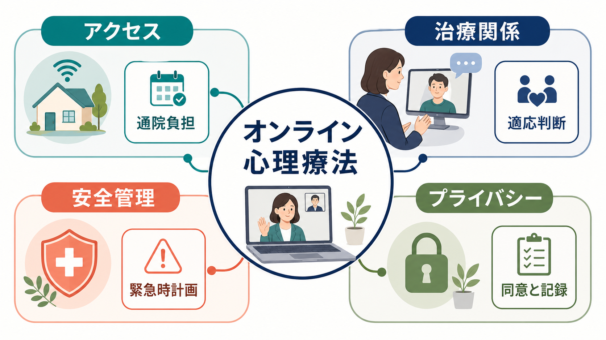
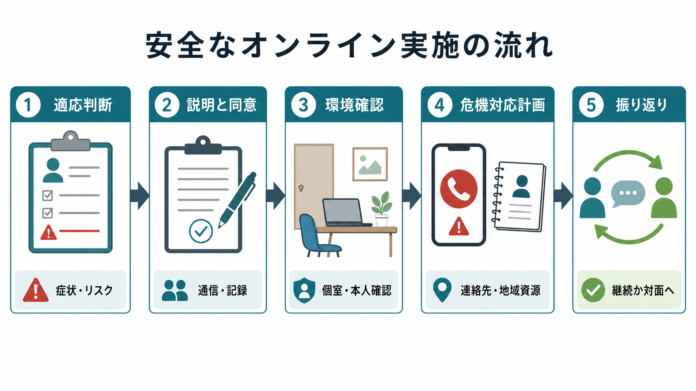
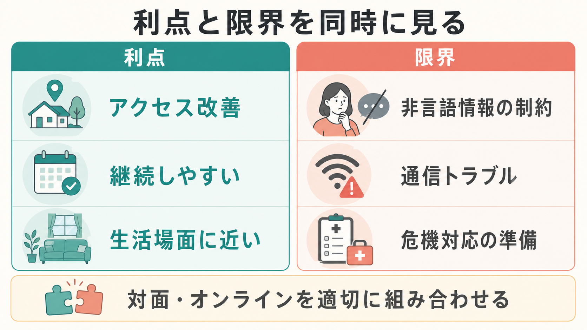

# オンライン心理療法とは何か

## 要点

- オンライン心理療法とは、ビデオ通話、電話、チャット、専用プラットフォームなどの情報通信技術を用いて、心理療法を遠隔で実施する方法である。中心は「技術」ではなく、[[心理療法とは何か|心理療法]]の評価、目標設定、治療関係、介入、振り返りを遠隔環境に合わせて安全に行うことである。
- 利点は、移動負担の軽減、地域・身体的制約のある人へのアクセス、生活環境に近い文脈での介入、継続しやすさにある。一方で、非言語情報の制約、通信トラブル、危機対応、プライバシー、法制度・資格範囲の確認が限界になる。
- 研究では、ビデオによる心理療法は多くの条件で対面療法に近い効果を示すが、対象、治療法、重症度、比較条件、治療者の訓練によって結果は変わる[4][5]。したがって「オンラインで十分」でも「オンラインは劣る」でもなく、適応判断と安全設計が重要である。
- 医療・精神医学領域では、オンライン実施は教育・研究上の知識として理解し、個別の診断や治療指示としては読まない。急性の自殺リスク、暴力リスク、重度の混乱、保護が必要な状況では、オンライン単独ではなく地域の緊急資源や対面支援との連携を考える。

## この記事で答える問い

1. オンライン心理療法は、対面の心理療法と何が同じで何が違うのか。
2. どのような利点があり、どのような限界があるのか。
3. 安全管理、危機対応、プライバシーをどのように考えるべきか。
4. 研究知見は「オンラインでも治療関係や効果が成り立つ」とどこまで言っているのか。

## まず結論

オンライン心理療法は、対面療法の「代用品」ではなく、心理療法を届けるための実施形式の一つである。[[認知行動療法CBTとは何か|CBT]]、支持的面接、対人関係への介入、マインドフルネスやスキル訓練などは、条件が整えばオンラインでも実施できる。ただし、画面越しであることは、治療関係、観察、記録、緊急時の判断、プライバシーの扱いを変える。

専門職ガイドラインは、遠隔で心理支援を行う際に、能力範囲、法制度、説明と同意、本人確認、記録、情報セキュリティ、緊急時対応を明示的に扱うことを求めている[1][2]。日本の医療制度でも、オンライン診療は対面診療と同じではなく、適切な実施指針、本人確認、急変時対応、情報通信環境の確保が重要な論点として扱われる[3]。心理療法でも同様に、実施形式を変えるだけでなく、リスク管理の設計を変える必要がある。

## 背景

オンライン心理療法が広がった背景には、遠隔地、身体疾患、育児・介護、仕事、感染症流行、移動困難、専門職不足など、対面支援にアクセスしにくい条件がある。精神保健サービスでは、支援を必要とする人が「行ける場所」に専門職がいるとは限らない。オンライン形式は、この地理的・時間的な摩擦を下げる。

ただし、アクセスが良くなることと、臨床的に適切であることは同じではない。たとえば、静かな個室を確保できない人、同居者からの監視や暴力の危険がある人、通信環境が不安定な人、急性期の安全確保が難しい人では、オンライン化がむしろリスクを増やすことがある。オンライン心理療法は、便利さだけでなく「どの条件なら安全に機能するか」という観点から評価する必要がある。

## 基本概念

### オンライン心理療法と遠隔心理支援

オンライン心理療法は、心理療法の枠組みをオンライン上で実施する場合を指す。より広い語として、遠隔心理支援、テレサイコロジー、テレセラピー、オンラインカウンセリング、デジタルメンタルヘルスがある。これらは重なるが、完全には同じではない。

- オンライン心理療法: 治療目標、治療関係、介入技法、評価を伴う心理療法の遠隔実施。
- オンラインカウンセリング: 相談・心理教育・意思決定支援を含む広い実践。
- デジタルメンタルヘルス: アプリ、ウェブ教材、セルフヘルプ、チャットボット、オンライン診療などを含む広い領域。

この記事では、治療者とクライエントが同期的に会話するビデオ通話型の心理療法を中心に扱う。メールやチャット、アプリ単独の介入は、別の評価軸が必要になる。

### 対面と同じ部分

オンラインでも、心理療法の核は大きく変わらない。初期評価、主訴の整理、治療目標、同意、介入計画、治療関係、進捗確認、終結計画は必要である。[[曝露療法とは何か|曝露療法]]、[[DBTのマインドフルネススキルとは何か|DBTのマインドフルネススキル]]、[[パニック症のCBTでは何を行うのか|パニック症のCBT]]のような構造化された介入も、条件が整えばオンラインで扱える。

### 対面と違う部分

違いは、観察できる情報と介入環境に現れる。治療者は全身の動き、入退室時の様子、待合室での変化、匂い、細かな緊張を観察しにくい。クライエント側では、同居者、通知、録音・録画、通信遅延、部屋の安全性が治療過程に入り込む。したがって、オンラインでは「画面の中の会話」だけでなく、画面の外の環境も治療設定の一部として扱う。

## 仕組み

オンライン心理療法の仕組みは、次の5つの判断で成り立つ。

1. 適応判断: 症状、リスク、治療目標、使用する技法、本人の希望、通信環境、プライバシー環境を確認する。
2. 説明と同意: オンライン実施の利点、限界、費用、記録、通信トラブル時の扱い、緊急時対応を説明する。
3. 環境確認: 個室、本人確認、現在地、連絡先、同居者の影響、録音録画の扱いを確認する。
4. 危機対応計画: 自殺リスク、暴力、虐待、急性混乱、通信切断時に備え、地域資源と緊急連絡先を事前に整理する。
5. 振り返り: オンライン形式が治療関係、理解、宿題、生活上の変化に合っているかを定期的に見直す。

## 図解

オンライン心理療法は、利点と限界を同時に見ると理解しやすい。アクセスの改善は大きな利点だが、アクセスしやすいことは「誰にでも、いつでも、同じように適している」ことを意味しない。適応が曖昧な場合は、対面、オンライン、電話、家族・地域支援、医療機関との連携を組み合わせる。

| 観点 | 利点 | 注意点 |
|---|---|---|
| アクセス | 移動時間、地理的制約、身体的負担を減らす | 通信環境や機器リテラシーが格差になる |
| 継続性 | 予定調整がしやすく中断を減らせる | 境界が曖昧になり、集中しにくいことがある |
| 治療関係 | 慣れた場所から話せることで安心しやすい | 目線、沈黙、身体感覚の共有が変わる |
| 安全管理 | 事前計画が明確なら迅速な連絡が可能 | 現在地不明、切断、同居者リスクが問題になる |
| プライバシー | 移動中に人目につきにくい | 家庭内の盗み聞き、録音録画、データ管理が問題になる |

## 臨床・研究との接続

ビデオによる心理療法の効果については、システマティックレビューとメタ分析が蓄積している。Fernandez らのメタ分析では、ビデオ提供の心理療法は待機リストより良好で、対面療法との差は小さいと報告された[4]。Norwood らのレビューでも、ビデオ会議心理療法で作業同盟と症状改善が成立しうる一方、同盟の非劣性については慎重な解釈が必要とされた[5]。また、治療同盟を扱った近年のメタ分析では、オンラインと対面で同盟が大きく損なわれるとは限らないが、研究数、測定時期、治療法の違いが解釈に影響する[6][7]。

臨床的には、「オンラインでできるか」よりも「どの条件を満たせばオンラインで安全にできるか」を問うほうが有用である。CBT のように構造化され、課題、記録、心理教育、生活場面での実践を含む介入は、オンラインとの相性がよいことがある。一方、重度の解離、精神病症状、急性の自殺リスク、家庭内暴力、保護が必要な未成年、通信環境が不安定なケースでは、オンライン単独の実施に慎重であるべきである。

### 安全管理

オンラインでは、危機が起きたときに治療者がその場にいない。したがって、毎回または必要時に、現在地、緊急連絡先、地域の救急資源、通信切断時の再接続方法を確認する。自傷他害リスクがある場合は、オンライン面接を続けるかどうかだけでなく、対面評価、医療機関、家族、地域支援、救急サービスとの連携を検討する。

安全管理は、クライエントを疑うための手続きではない。オンラインの弱点をあらかじめ補い、心理療法の場を安全に保つための共同作業である。

### プライバシーと記録

プライバシーには、通信システムのセキュリティだけでなく、部屋の環境、同居者、通知、録音録画、記録の保管、本人確認が含まれる。APA のテレサイコロジー指針は、秘密保持、データ保護、記録、技術利用の能力を実践上の重要課題として扱っている[1]。オンライン面接では、治療者側だけでなくクライエント側の環境もプライバシーの一部になる。

具体的には、個室で話せるか、イヤホンを使うか、画面共有や録画をどう扱うか、家族に知られたくない内容をどう守るか、緊急時に誰へ連絡するかを事前に決める。家庭内暴力や監視が疑われる場合、通常の「安全確認」が相手に知られること自体が危険になることもあるため、事前合図や代替連絡手段を慎重に設計する。

### 法制度と職能範囲

オンライン心理療法は、国・地域・資格・所属機関によって扱いが異なる。日本では、医師によるオンライン診療について厚生労働省の実施指針があり、本人確認、対面診療との関係、急変時対応、情報通信機器の安全性などが論点になる[3]。心理職による支援でも、所属機関の規程、職能団体の倫理、個人情報保護、記録保存、診療報酬や契約の範囲を確認する必要がある。

## よくある誤解

### 誤解1: オンラインは対面より必ず劣る

研究上、ビデオによる心理療法は多くの条件で有効性を示しており、対面との差が小さい場面もある[4]。ただし、これはすべての人、すべての疾患、すべての治療者、すべての技法で同じという意味ではない。オンラインの有効性は、適応判断、治療法、同盟形成、技術環境、安全管理に依存する。

### 誤解2: オンラインなら気軽に始められるので安全確認は少なくてよい

実際には逆である。治療者が同じ場所にいないため、現在地、通信切断時の手順、危機対応、プライバシー確認はより明示的に必要になる。オンラインであるほど、開始前の設定が治療の質を左右する。

### 誤解3: プライバシーは暗号化されたツールを使えば十分である

暗号化は重要だが、それだけでは十分ではない。家族に聞かれていないか、画面が見られていないか、録音録画が行われていないか、通知に個人情報が出ないか、記録がどこに保存されるかもプライバシーである。

### 誤解4: オンライン心理療法はアプリやセルフヘルプと同じである

オンライン心理療法は、治療者とクライエントの相互作用、評価、同意、個別化、危機対応を含む。アプリや教材は補助になりうるが、それだけで心理療法と同じ構造を持つとは限らない。

## 関連ノート

- [[心理療法とは何か]]
- [[認知行動療法CBTとは何か]]
- [[パニック症のCBTでは何を行うのか]]
- [[DBTのマインドフルネススキルとは何か]]
- [[曝露療法とは何か]]

## 関連ノート候補

- 「遠隔心理支援の倫理とは何か」
- 「心理療法における安全計画とは何か」
- 「デジタルメンタルヘルスとは何か」
- 「オンライン診療と心理支援はどう違うのか」

## MOC更新候補

- `content/00_MOC/MOC・臨床実践・治療.md`
- `content/00_MOC/MOC・心理療法.md`

## 理解チェック

1. オンライン心理療法で、対面と同じままにできる要素と、明示的に再設計すべき要素をそれぞれ説明できるか。
2. オンライン実施前に確認すべき安全管理項目を、現在地、緊急連絡先、通信切断時対応、プライバシー環境の観点から列挙できるか。
3. 「オンラインは対面より必ず劣る」「オンラインなら安全確認は簡略化できる」という誤解に、研究知見と臨床判断を分けて答えられるか。

## 参考文献

[1] American Psychological Association. (2013). *Guidelines for the practice of telepsychology*. https://www.apa.org/practice/guidelines/telepsychology

[2] American Psychological Association Services. (2020). *Telepsychology best practice 101 series*. https://www.apaservices.org/practice/legal/technology/telepsychology

[3] 厚生労働省. (2023). *オンライン診療の適切な実施に関する指針*. https://www.mhlw.go.jp/stf/index_0024_00004.html

[4] Fernandez, E., Woldgabreal, Y., Day, A., Pham, T., Gleich, B., & Aboujaoude, E. (2021). Live psychotherapy by video versus in-person: A meta-analysis of efficacy and its relationship to types and targets of treatment. *Clinical Psychology & Psychotherapy, 28*(6), 1535-1549. https://doi.org/10.1002/cpp.2594

[5] Norwood, C., Moghaddam, N. G., Malins, S., & Sabin-Farrell, R. (2018). Working alliance and outcome effectiveness in videoconferencing psychotherapy: A systematic review and noninferiority meta-analysis. *Clinical Psychology & Psychotherapy, 25*(6), 797-808. https://doi.org/10.1002/cpp.2315

[6] Seuling, P. D., Fendel, J. C., Spille, L., Goeritz, A. S., & Schmidt, S. (2024). Therapeutic alliance in videoconferencing psychotherapy compared to psychotherapy in person: A systematic review and meta-analysis. *Journal of Telemedicine and Telecare, 30*(10), 1521-1531. https://doi.org/10.1177/1357633X231161774

[7] Berger, T. (2017). The therapeutic alliance in internet interventions: A narrative review and suggestions for future research. *Psychotherapy Research, 27*(5), 511-524. https://doi.org/10.1080/10503307.2015.1119908

## 未解決問題

- オンライン心理療法が特に有効な対象、対面と組み合わせるべき対象、避けるべき対象を、診断名だけでなく生活環境・リスク・技術条件からどう層別化するか。
- 治療同盟、非言語情報、沈黙、身体感覚、家庭環境への介入がオンラインでどのように変化するか。
- プラットフォーム、録画、AI要約、チャット履歴などの技術が、治療関係とプライバシーに与える長期的影響をどう評価するか。
