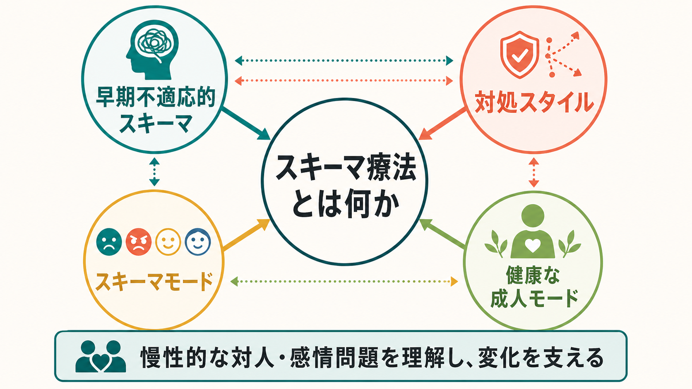
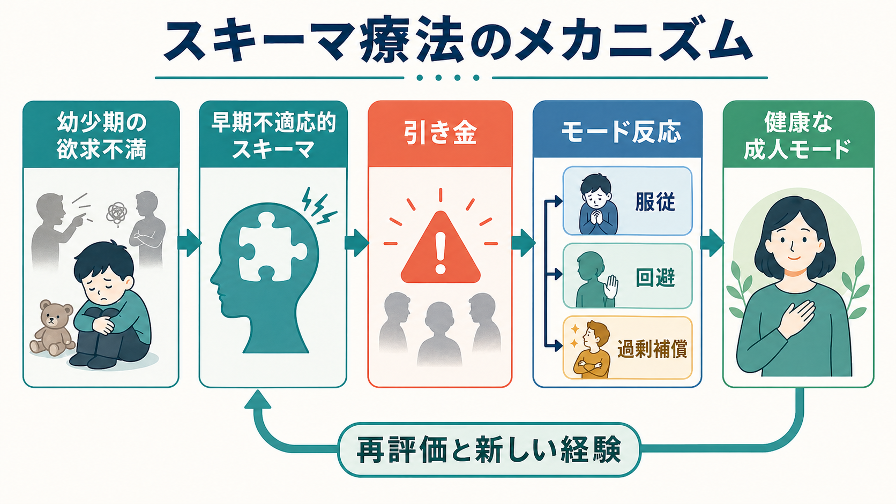
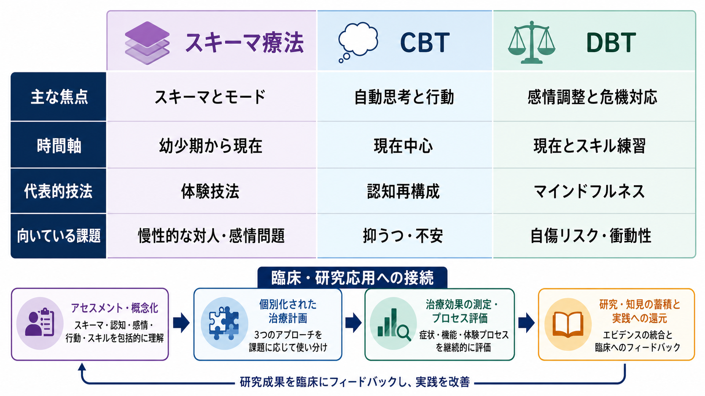

# スキーマ療法とは何か

## 要点

- スキーマ療法は、幼少期から形成された早期不適応的スキーマ、現在の対処スタイル、瞬間ごとのスキーマモードを扱う統合的な心理療法である[1][2]。
- 目標は「考え方を正す」だけではなく、中核的感情欲求を理解し、体験的・認知的・行動的な介入と治療関係を通して、より柔軟な反応を育てることである[1][3]。
- 境界性パーソナリティ障害を中心に研究が進み、RCT やメタ解析では有効性を支持する結果がある一方、対象疾患、治療形式、実装条件によってエビデンスの強さは異なる[4][5][6][7]。
- 本稿は教育・研究目的の整理であり、個別の診断や治療適応を判断するものではない。

## この記事で答える問い

1. スキーマ療法は、通常の[[認知行動療法CBTとは何か|認知行動療法]]的な考え方とどこが違うのか。
2. 早期不適応的スキーマ、対処スタイル、スキーマモードはどうつながるのか。
3. 臨床では、どのような問題に、どの程度の根拠をもって用いられているのか。

## まず結論

スキーマ療法は、慢性的な対人関係のこじれ、強い恥や見捨てられ不安、感情調整の難しさ、自己批判、回避、過剰な迎合や支配といった問題を、現在の症状だけでなく「人生の早い時期に学習された自己・他者・関係のパターン」として理解する。たとえば、批判されやすい環境で育った人が「自分は欠陥がある」というスキーマを形成し、親密な関係で小さな拒否のサインに過敏になり、服従・回避・過剰補償の形で反応する、という流れである[1][2]。

そのため介入は、思考記録だけに閉じない。イメージ書き換え、チェアワーク、感情体験の再処理、限定的再養育、認知的検討、行動パターン変容を組み合わせる[3]。[[治療関係とは何か|治療関係]]は単なる土台ではなく、本人が安全・共感・境界・現実的制限を体験し直す場として扱われる。

## 背景

スキーマ療法は Jeffrey Young らによって、従来の認知療法だけでは変化しにくい慢性的な性格傾向、対人問題、長期化した抑うつ・不安、パーソナリティ障害の臨床課題に対応するために発展した[2]。現在の困りごとを、単発の症状としてではなく、発達歴、気質、養育環境、対人経験、学習された対処行動が重なったパターンとして扱う点で、[[5Pモデルとは何か|5Pモデル]]とも相性がよい。

特に[[境界性パーソナリティ障害とは何か|境界性パーソナリティ障害]]では、強い見捨てられ不安、対人関係の急激な揺れ、自己像の不安定さ、怒りや空虚感、自傷リスクなどが絡みやすい。スキーマ療法は、こうした反応を「本人の性格の問題」と単純化せず、傷ついた子どもモード、怒っている子どもモード、罰する親モード、回避的保護者モード、健康な成人モードなどの相互作用として理解する[1][4]。

## 基本概念

### 早期不適応的スキーマ

早期不適応的スキーマは、自分、他者、世界、関係性についての広く持続的なテーマであり、幼少期から青年期の経験を通して形成され、その後の人生で繰り返し活性化する[1][2]。代表例には「見捨てられ」「不信・虐待」「情緒的剥奪」「欠陥・恥」「失敗」「服従」「厳格な基準」などがある。

重要なのは、スキーマが単なる考えではない点である。スキーマは、身体感覚、感情、記憶、対人予測、行動傾向を含む。だからこそ、本人が頭では「今の相手は危険ではない」と分かっていても、身体や感情は昔のパターンで反応することがある。

### 中核的感情欲求

スキーマ療法では、子どもが発達のなかで必要とする安全な愛着、保護、共感、自律性、有能感、現実的な限界、遊びや自発性などの欲求が十分に満たされないと、不適応的なスキーマが形成されやすいと考える[1]。これは、過去の責任追及ではなく、現在の反応が「何を必要としていたのか」を理解するための臨床的な視点である。

### 対処スタイル

スキーマが活性化したとき、人は痛みを減らすために対処する。代表的には、スキーマに従う「服従」、感情や関係から離れる「回避」、逆方向に振り切る「過剰補償」がある[1]。短期的には苦痛を下げても、長期的には同じスキーマを保ちやすい。たとえば「自分は拒絶される」というスキーマに対して、親密さを避け続ければ、拒絶される痛みは減るが、安心できる関係を学ぶ機会も減る。

### スキーマモード

スキーマモードは、ある瞬間に前面化している感情状態、自己状態、対処反応のまとまりである[1]。スキーマが比較的長期的な構造だとすれば、モードは「いまこの場でどの状態が出ているか」を見る道具である。境界性パーソナリティ障害や[[複雑性PTSDとは何か|複雑性PTSD]]のように状態の切り替わりが激しい臨床では、モード概念が特に役立つ。

## 仕組み

スキーマ療法の変化モデルは、次のように整理できる。

1. 幼少期や青年期の反復的な経験によって、自己・他者・関係のスキーマが形成される。
2. 現在の対人場面、失敗、批判、孤立、親密さ、依存、別離などが引き金になる。
3. スキーマが活性化し、強い感情と身体反応が起こる。
4. 本人は服従・回避・過剰補償によって苦痛を下げようとする。
5. その対処が、長期的には孤立、衝突、自己批判、関係の不安定さを維持する。
6. 治療では、スキーマとモードを見分け、感情欲求を言語化し、新しい体験と行動を積み重ねる[1][3]。

この流れは、[[弁証法的行動療法DBTとは何か|DBT]]の感情調整モデルとも一部重なる。DBT が危機対応、スキル、受容と変化のバランスを強調するのに対し、スキーマ療法は「なぜ同じ関係パターンが反復されるのか」「その反応の奥にどの未充足欲求があるのか」をより発達史的に扱う。したがって、[[DBTのマインドフルネススキルとは何か|DBTのマインドフルネス]]や安全確保が必要な急性期の支援と、スキーマ療法的な深い体験作業は、臨床上の優先順位を分けて考える必要がある。

## 図解

3枚目は、スキーマ療法を CBT や DBT と対比して、臨床・研究での位置づけを整理したものである。実際の治療選択では、症状の重症度、自傷・自殺リスク、解離、物質使用、治療環境、本人の希望、治療者の訓練状況を含めて判断する。

| 観点 | スキーマ療法 | CBT | DBT |
|---|---|---|---|
| 主な焦点 | スキーマ、モード、感情欲求 | 自動思考、信念、行動 | 感情調整、危機対応、スキル |
| 時間軸 | 幼少期から現在まで | 現在の問題を中心に扱うことが多い | 現在の危機と日常スキルを重視 |
| 技法 | イメージ、チェアワーク、限定的再養育 | 認知再構成、行動実験 | マインドフルネス、苦痛耐性、連鎖分析 |
| 注意点 | 深い感情作業には安定化と治療構造が必要 | 慢性対人問題では発達史の扱いが不足する場合がある | スキルだけではスキーマの痛みが残る場合がある |

## 臨床・研究との接続

境界性パーソナリティ障害を対象とした初期の RCT では、スキーマ焦点化療法が転移焦点化精神療法と比較され、長期的な改善や回復率に関して有望な結果が報告された[4]。その後、パーソナリティ障害を対象にした多施設 RCT でも、スキーマ療法は通常治療や他の心理療法との比較で検討されている[5]。

レビュー研究では、スキーマ療法のエビデンスは増えているが、研究デザイン、対象群、治療者訓練、アウトカム指標、追跡期間にばらつきがあると整理されている[6]。2023年のパーソナリティ障害を対象とする系統的レビュー・メタ解析は有効性を支持するが、研究数やバイアスリスクを踏まえた慎重な解釈も必要である[7]。2022年の国際多施設 RCT では、境界性パーソナリティ障害に対して個人療法と集団療法を組み合わせた形式が、通常治療や主に集団形式のスキーマ療法より良好な結果を示した[8]。

したがって、現時点での実践的な読み方は、「スキーマ療法は慢性的な対人・感情問題、とくにパーソナリティ障害領域で有望な治療法である。ただし、訓練された治療者、十分な治療構造、リスク管理、併存症への配慮が必要であり、どの問題にも同じ強度で一般化できるわけではない」というものになる。

## よくある誤解

### スキーマ療法は過去を掘り返すだけの治療である

過去の経験は扱うが、目的は過去の再確認ではない。現在の反応パターンを理解し、新しい感情体験と行動選択を増やすために過去を使う。現在の生活、関係、仕事、セルフケア、リスク管理から切り離された回想作業は、治療としては不十分である。

### スキーマは本人の「思い込み」にすぎない

スキーマには認知的な側面があるが、同時に身体感覚、感情、記憶、対人予測が含まれる。だから、論理的な説得だけで変化しにくい。体験技法や治療関係が重視される理由はここにある[3]。

### 健康な成人モードは、感情を抑える理性的な自分である

健康な成人モードは、感情を消すモードではない。傷ついた子どもモードの痛みを受け止め、怒りや衝動に現実的な境界を置き、罰する親モードに対抗し、必要な支援や行動を選ぶ働きである。感情と理性を切り離すのではなく、感情欲求を現実的な形で満たす方向にまとめる。

### スキーマ療法はDBTやCBTより優れている

優劣ではなく、焦点と適応が異なる。急性の自傷リスクや衝動性が高い場合は、まず安全確保と危機対応が優先される。抑うつ・不安の特定症状には CBT 的介入が効率的な場合もある。スキーマ療法は、慢性的で反復的な対人・感情パターンを深く扱う選択肢として位置づけるのが妥当である。

## 関連ノート

- [[境界性パーソナリティ障害とは何か]]
- [[複雑性PTSDとは何か]]
- [[5Pモデルとは何か]]
- [[治療関係とは何か]]
- [[弁証法的行動療法DBTとは何か]]
- [[DBTのマインドフルネススキルとは何か]]

## MOC更新候補

- `content/00_MOC/` 配下の臨床実践・心理療法系 MOC に、この記事 `[[スキーマ療法とは何か]]` を追加する候補。
- 並列ジョブとの競合を避けるため、本タスクでは MOC 本体は更新しない。

## 理解チェック

1. 早期不適応的スキーマとスキーマモードは、時間スケールの点でどう違うか。
2. 服従・回避・過剰補償は、短期的には何を助け、長期的には何を維持しやすいか。
3. スキーマ療法で治療関係が重視されるのはなぜか。
4. DBT、CBT、スキーマ療法を使い分けるとき、どのような臨床情報を確認する必要があるか。

## 未解決問題

- どの患者特性が、個人スキーマ療法、集団スキーマ療法、個人・集団併用形式の反応性を分けるのか。
- 解離、複雑性トラウマ、物質使用、発達特性を併存する場合、どの順序で安定化と体験作業を組み合わせるのが最も安全で有効か。
- 日本語圏の臨床現場で、治療者訓練、スーパービジョン、治療期間、医療制度上の制約をどう実装研究に落とし込むか。

## 参考文献

[1] International Society of Schema Therapy. *The Schema Therapy Model: Central Concepts*. https://schematherapysociety.org/Schema-Therapy

[2] Young, J. E., Klosko, J. S., & Weishaar, M. E. (2003). *Schema Therapy: A Practitioner's Guide*. Guilford Press. https://www.guilford.com/books/Schema-Therapy/Young-Klosko-Weishaar/9781572308381

[3] International Society of Schema Therapy. *Techniques*; *Limited Reparenting*. https://schematherapysociety.org/Techniques ; https://schematherapysociety.org/Limited-Reparenting/

[4] Giesen-Bloo, J., van Dyck, R., Spinhoven, P., et al. (2006). Outpatient psychotherapy for borderline personality disorder: randomized trial of schema-focused therapy vs transference-focused psychotherapy. *Archives of General Psychiatry*, 63(6), 649-658. https://doi.org/10.1001/archpsyc.63.6.649

[5] Bamelis, L. L. M., Evers, S. M. A. A., Spinhoven, P., & Arntz, A. (2014). Results of a multicenter randomized controlled trial of the clinical effectiveness of schema therapy for personality disorders. *American Journal of Psychiatry*, 171(3), 305-322. https://doi.org/10.1176/appi.ajp.2013.12040518

[6] Masley, S. A., Gillanders, D. T., Simpson, S. G., & Taylor, M. A. (2012). A systematic review of the evidence base for schema therapy. *Cognitive Behaviour Therapy*, 41(3), 185-202. https://doi.org/10.1080/16506073.2011.614274

[7] Zhang, K., Hu, X., Ma, L., et al. (2023). The efficacy of schema therapy for personality disorders: a systematic review and meta-analysis. *Nordic Journal of Psychiatry*, 77(7), 641-650. https://doi.org/10.1080/08039488.2023.2228304

[8] Arntz, A., Jacob, G. A., Lee, C. W., et al. (2022). Effectiveness of predominantly group schema therapy and combined individual and group schema therapy for borderline personality disorder: a randomized clinical trial. *JAMA Psychiatry*, 79(4), 287-299. https://doi.org/10.1001/jamapsychiatry.2022.0010
