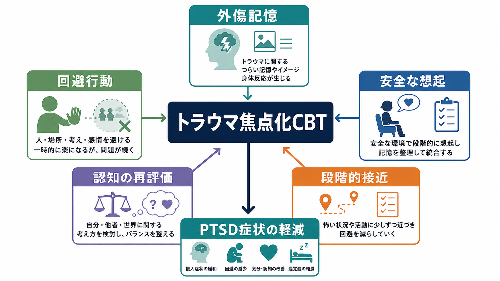
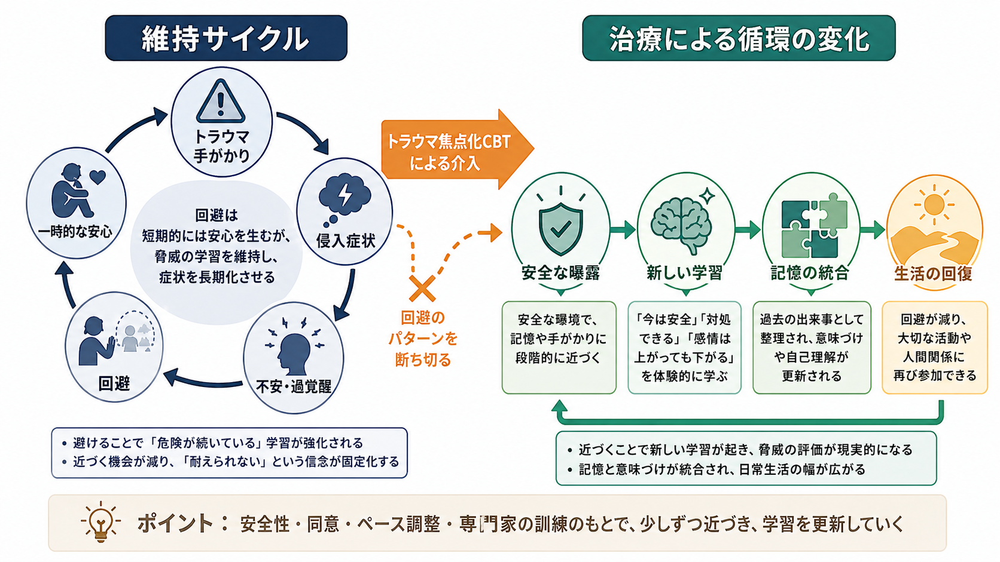
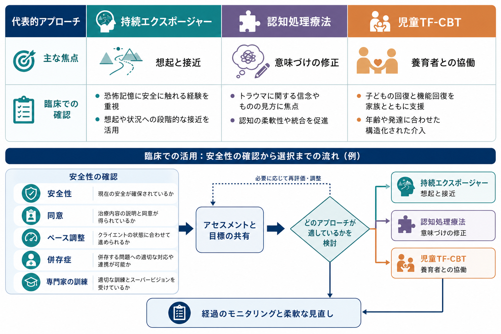

# トラウマ焦点化認知行動療法とは何か

## 要点

- トラウマ焦点化認知行動療法は、[[PTSDとは何か|PTSD]] を維持する外傷記憶、回避行動、過剰な脅威評価を、構造化された面接と課題の中で扱う心理療法群である。
- 成人では、持続エクスポージャー、認知処理療法、PTSDの認知療法、ナラティブ・エクスポージャー・セラピーなどが代表例であり、NICE は成人 PTSD に個人トラウマ焦点化 CBT を提供することを推奨している[1]。
- 児童青年では、養育者との協働、心理教育、感情調整、トラウマ・ナラティブ、認知的処理、安全スキルを組み合わせる TF-CBT がよく知られている[6]。
- 中核は「つらい記憶を無理に思い出させること」ではなく、安全性、同意、ペース調整、専門家の訓練とスーパービジョンのもとで、記憶と意味づけを現在の生活に統合し直すことである[1][2]。

## この記事で答える問い

1. トラウマ焦点化認知行動療法は、通常の [[認知行動療法CBTとは何か|CBT]] と何が違うのか。
2. なぜ外傷記憶や回避行動を扱うと PTSD 症状の軽減につながるのか。
3. どのような方法が含まれ、臨床では何に注意する必要があるのか。

## まず結論

トラウマ焦点化認知行動療法とは、外傷体験の記憶、その記憶に結びついた身体反応、罪悪感・恥・危険感などの意味づけ、そして回避行動を、治療者と本人が共同で安全に扱う治療である。PTSD では、過去の出来事が「今も危険が続いている」という感覚として現在化しやすい。治療はこの現在化を弱め、記憶を過去の出来事として位置づけ直し、生活上の回避を少しずつ減らすことを目指す[7]。

重要なのは、トラウマ焦点化 CBT が単一の技法名ではなく、エビデンスに基づく複数の治療モデルを含む傘概念である点である。NICE は成人 PTSD に対して、認知処理療法、PTSDの認知療法、ナラティブ・エクスポージャー・セラピー、持続エクスポージャーなどを含む個人トラウマ焦点化 CBT を挙げている[1]。VA/DoD 2023 ガイドラインを解説する National Center for PTSD も、PTSD に対する有効性の高いトラウマ焦点化心理療法として、持続エクスポージャー、認知処理療法、EMDR を中心に整理している[2]。

## 背景

PTSD の症状には、侵入記憶、悪夢、フラッシュバック、回避、否定的な認知と気分、過覚醒が含まれる。これらは本人の弱さではなく、強い脅威経験の後に、記憶、注意、身体反応、意味づけが危険検出へ偏ることで維持される反応として理解できる。[[PTSDでは恐怖記憶ネットワークに何が起きているのか]] や [[フラッシュバックとは何か]] と接続して考えると、記憶が「過去の情報」ではなく「今ここで起きている脅威」のように作動する点が重要になる。

外傷記憶に触れることは一時的に苦痛を高めるため、本人は当然それを避けようとする。[[回避行動とは何か|回避行動]] は短期的には安心をもたらすが、長期的には「近づいたら耐えられない」「思い出すと壊れてしまう」という学習を強め、日常生活の範囲を狭める。トラウマ焦点化 CBT は、この悪循環を安全にほどくための構造を提供する。

## 基本概念

### トラウマ焦点化とは何か

「トラウマ焦点化」とは、症状だけでなく、症状を維持している外傷記憶、トラウマ関連の意味づけ、回避、身体反応を治療の中心に置くという意味である。単に現在のストレス対処を練習するだけではなく、外傷体験が現在の自己理解、人間関係、危険予測にどう影響しているかを扱う。

ただし、すべての面接で詳細な記憶想起を行うわけではない。NICE は、成人向けトラウマ焦点化 CBT には、心理教育、覚醒やフラッシュバックへの対処、安全計画、外傷記憶の精緻化と処理、恥・罪悪感・喪失・怒りなどの感情の処理、トラウマ関連の意味づけの再構成、回避を乗り越える支援、生活機能の再建が含まれると整理している[1]。

### 認知行動療法としての特徴

CBT としての特徴は、本人と治療者が仮説を共有し、記録、曝露、認知再評価、行動実験、宿題を使って検証する点にある。[[認知再構成法とは何か]] で扱うような考えの検討は、トラウマ焦点化 CBT では「自分のせいだった」「世界は完全に危険だ」「誰も信用できない」といった外傷後の強い意味づけに向けられる。

[[曝露療法とは何か|曝露療法]] の要素を含む場合、目的は苦痛に慣れさせることだけではない。安全な状況で記憶や手がかりに段階的に近づくことで、「危険な記憶を思い出しても現在の危険ではない」「感情は高まっても下がる」「避けなくても対処できる」という新しい学習をつくる。

## 仕組み

### 1. 現在の脅威感を弱める

Ehlers と Clark の認知モデルでは、PTSD が持続する要因として、外傷とその後の反応への過度に否定的な評価、文脈化されにくい自伝的記憶、強い連合記憶、知覚的プライミングが挙げられる[7]。つまり、記憶が「過去の一出来事」として整理されず、手がかりによって強い現在の脅威感を呼び起こす。

トラウマ焦点化 CBT は、外傷記憶を言語化し、時間・場所・前後関係の中に位置づけ、当時の危険と現在の安全を区別する。これは記憶を消す作業ではなく、記憶の意味と文脈を更新する作業である。

### 2. 回避による維持サイクルを変える

PTSD では、場所、人、話題、身体感覚、睡眠、ニュース、対人関係などが外傷手がかりとなりうる。回避は一時的な安心を生むが、本人が「近づいても破局は起きない」と学ぶ機会を奪う。段階的な接近や in vivo 曝露は、この学習機会を回復するために使われる。

### 3. トラウマ関連の意味づけを再評価する

[[認知処理療法CPTとは何か|認知処理療法CPT]] は、外傷後に固定化した「スタックポイント」を扱う代表的なトラウマ焦点化治療である。National Center for PTSD は、CPT が安全、信頼、力とコントロール、尊重、親密性に関する信念を扱い、より正確でバランスの取れた解釈へ進むことを目標にすると説明している[8]。

ここでの再評価は、安易なポジティブ思考ではない。出来事の責任、予測可能性、当時取り得た選択肢、現在の危険、他者への信頼を、証拠と文脈に基づいて検討する。特に性暴力、虐待、災害、事故、戦争体験では、恥や罪悪感が症状維持に深く関わるため、慎重な扱いが必要である。

## 図解

| 図 | 読み方 |
|---|---|
| 全体像 | 外傷記憶、回避行動、認知の再評価、段階的接近が相互に関連し、PTSD 症状の軽減を目指すことを示す。 |
| メカニズム | 回避が短期的安心をもたらす一方で維持サイクルを強め、安全な曝露と新しい学習がその循環を弱めることを示す。 |
| 臨床応用 | 持続エクスポージャー、CPT、児童 TF-CBT の焦点の違いと、安全性・同意・ペース調整の確認を整理する。 |

## 臨床・研究との接続

成人 PTSD では、複数の診療ガイドラインがトラウマ焦点化心理療法を第一選択に近い位置づけで扱っている。VA/DoD 2023 ガイドラインは、PTSD と急性ストレス障害の評価・治療に関する体系的レビューに基づく推奨を提示しており、臨床判断を置き換えるものではないが、治療選択を支援する資料として重要である[2][3]。

Cochrane レビューでは、慢性 PTSD の成人を対象に、個人トラウマ焦点化 CBT、EMDR、非トラウマ焦点化 CBT、集団 TF-CBT などの有効性が検討された。個人トラウマ焦点化 CBT には支持がある一方、含まれた研究の規模や質には限界があり、害や長期効果については慎重に解釈する必要がある[5]。

児童青年では、Cohen、Mannarino、Deblinger らの TF-CBT が代表的である。レビューでは、児童青年の PTSD 症状、抑うつ、行動問題に対する効果が整理され、一定数の RCT に基づいてエビデンス水準が高いと評価されている[6]。成人向けの「トラウマ焦点化 CBT」と、児童青年向けの固有名詞としての「TF-CBT」は重なるが、同一ではない。児童では発達段階、養育者の関与、安全確保、家庭環境がより中心的になる。

臨床では、[[トラウマインフォームドケアとは何か]] の視点が欠かせない。本人の同意なしに詳細な体験を聞き出すこと、準備なく曝露を急ぐこと、解離や自殺リスクや現在進行中の暴力を見落とすことは避ける必要がある。[[トラウマ歴はどのように聞くべきか]] と同様に、本人がコントロール感を保てる進め方が治療そのものの安全性に関わる。

## よくある誤解

### 誤解1: つらい記憶を全部話せば治る

記憶を話すこと自体が治療なのではない。重要なのは、どの記憶を、どのタイミングで、どの安全確認のもとで扱い、どの意味づけや回避行動に結びつけて検討するかである。むしろ準備のない詳細聴取は、本人のコントロール感を損なうことがある。

### 誤解2: 曝露は苦痛に耐えさせる訓練である

曝露の目的は我慢比べではない。回避で閉じた学習機会を開き、現在の安全、感情の変化、対処可能性を経験的に学ぶことである。苦痛が高すぎる場合は、ペース、対象、方法を調整する。

### 誤解3: トラウマ焦点化 CBT は誰にでも同じ手順で行う

ガイドラインは平均的な有効性を示すが、個々の臨床判断を置き換えない。解離、精神病症状、重度の物質使用、自殺リスク、現在進行中の暴力、複雑性 PTSD、発達特性、文化的背景によって、治療の順序や強度は変わる。[[複雑性PTSDとは何か]] では、感情調整や対人関係の困難も含めた支援が必要になることがある。

### 誤解4: EMDR や NET とはまったく別物である

[[EMDRとは何か]] や [[ナラティブ・エクスポージャー・セラピーとは何か]] は、厳密には CBT そのものではない部分もあるが、外傷記憶を中心に扱うエビデンス支持治療として、ガイドライン上では近い文脈で比較・推奨されることが多い[1][2]。臨床上は名称よりも、本人の状態、希望、治療者の訓練、利用可能性、リスク管理を合わせて選ぶ。

## 関連ノート

- [[PTSDとは何か]]
- [[PTSDでは恐怖記憶ネットワークに何が起きているのか]]
- [[認知行動療法CBTとは何か]]
- [[認知処理療法CPTとは何か]]
- [[曝露療法とは何か]]
- [[回避行動とは何か]]
- [[フラッシュバックとは何か]]
- [[過覚醒とは何か]]
- [[EMDRとは何か]]
- [[ナラティブ・エクスポージャー・セラピーとは何か]]
- [[トラウマインフォームドケアとは何か]]
- [[複雑性PTSDとは何か]]

## 理解チェック

1. トラウマ焦点化 CBT が扱う「トラウマ焦点」とは、出来事の詳細だけでなく、記憶、意味づけ、身体反応、回避を含む。
2. 回避行動は短期的には安心をもたらすが、長期的には「近づけない」という学習を維持しやすい。
3. 曝露や記憶処理は、本人の同意、安全計画、ペース調整、治療者の訓練を前提に行う。
4. 成人向けのトラウマ焦点化 CBT と、児童青年向けの固有モデルとしての TF-CBT は、関連するが完全に同じではない。

## 関連ノート候補・MOC更新候補

- 関連ノート候補: [[児童青年期のトラウマ反応はどう現れるのか]], [[精神疾患とトラウマ反応はどう関係するのか]], [[トラウマ関連障害群とは何か]]
- MOC 更新候補: `content/00_MOC/` 配下の心理療法・臨床実践系 MOC に、バッチ統合時に本記事を追加する。

## 未解決問題

- どの患者に、どのトラウマ焦点化治療を、どの順序で提供するのが最もよいかは、併存症、解離、複雑性 PTSD、文化的背景、治療アクセスによって異なる。
- 症状尺度の改善だけでなく、生活機能、対人関係、就労・学業、再被害予防、本人の価値に沿った回復をどう評価するかが重要である。
- 画像研究や生理指標は治療機序の理解に役立つが、現時点で個人の治療効果を単独で判定できる臨床バイオマーカーではない。

## 参考文献

[1] National Institute for Health and Care Excellence. (2018). *Post-traumatic stress disorder: NICE guideline NG116, Recommendations*. https://www.nice.org.uk/guidance/ng116/chapter/1-Recommendations

[2] Norman, S., Hamblen, J., & Schnurr, P. (2025). *Overview of Psychotherapy for PTSD*. National Center for PTSD, U.S. Department of Veterans Affairs. https://www.ptsd.va.gov/professional/treat/txessentials/overview_therapy.asp

[3] U.S. Department of Veterans Affairs & U.S. Department of Defense. (2023). *VA/DoD Clinical Practice Guideline for the Management of Posttraumatic Stress Disorder and Acute Stress Disorder*. https://www.healthquality.va.gov/guidelines/MH/ptsd/

[4] International Society for Traumatic Stress Studies. (2018). *ISTSS PTSD Prevention and Treatment Guidelines: Methodology and Recommendations*. https://istss.org/clinical-resources/trauma-treatment/istss-prevention-and-treatment-guidelines/

[5] Bisson, J. I., Roberts, N. P., Andrew, M., Cooper, R., & Lewis, C. (2013). *Psychological therapies for chronic post-traumatic stress disorder (PTSD) in adults*. Cochrane Database of Systematic Reviews, CD003388. https://www.cochrane.org/evidence/CD003388_psychological-therapies-chronic-post-traumatic-stress-disorder-ptsd-adults

[6] Ramirez de Arellano, M. A., Lyman, D. R., Jobe-Shields, L., George, P., Dougherty, R. H., Daniels, A. S., Ghose, S. S., Huang, L., & Delphin-Rittmon, M. E. (2014). Trauma-focused cognitive-behavioral therapy for children and adolescents: assessing the evidence. *Psychiatric Services, 65*(5), 591-602. https://pmc.ncbi.nlm.nih.gov/articles/PMC4396183/

[7] Ehlers, A., & Clark, D. M. (2000). A cognitive model of posttraumatic stress disorder. *Behaviour Research and Therapy, 38*(4), 319-345. https://doi.org/10.1016/S0005-7967(99)00123-0

[8] Galovski, T. E., Norman, S. B., & Hamblen, J. L. (2026). *Cognitive Processing Therapy for PTSD*. National Center for PTSD, U.S. Department of Veterans Affairs. https://www.ptsd.va.gov/professional/treat/txessentials/cpt_for_ptsd_pro.asp
